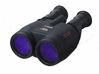

Canon Image Stabilizing 18x50mm Binoculars (retail cost, $1150)

I had the pleasure to give these binoculars a spin.

Before testing them, I had two concerns with these binoculars. First, knowing how difficult it is to handhold my 16x70 Fujinons, I wondered if image stabilization can really work at the even more powerful 18x magnification? Second, will the light throughput be diminished in any way by the stabilization mechanism?

Well, I am happy to report that the image stabilization is remarkably effective and the binoculars function with the full brightness of a normal 50mm binocular, and star images are sharp across the entire 3.7 degree field of view.

Eye Relief is 15mm, which meant I had to remove my eyeglasses to use them, but that still compares well to the 15.5mm eye relief of my Fujinons.

The effectiveness of the image stabilization is obvious. Using Jupiter as my target, I first tried viewing with the binoculars powered down. Because I've gotten somewhat used to handholding my 16x70s I discovered that it didn't take too much more to hold the Canons relatively still, even though they are slightly more powerful. Of course being only 50mm makes these Canons a much more manageable 2.6 lbs. (without batteries) as compared to the 4.75 lb. Fujinons. Then, I pushed the power button. At first, it's difficult to see improvement. But the longer you view, the more the image stabilizes. The binoculars seem to learn your hand movements and then compensate for them. The result is the ability to handhold the binoculars stable, even one-handed. As for Jupiter, it's nice to be able to handhold a pair of binoculars with enough magnification to see a sizeable planetary disk and four moons all spread out in a row.

As for the quality of the views, I compared images with the Canons side by side with my Fujinons on a parallel bino mount. I must confess that the Fujinons are noticably sharper, flatter, and brighter. But not substantially so. Any improvement in views by the Fujinons would have to be attributed to the larger aperture and quality/performance of the glass. Of course, that's the big selling point of the Fujinons in the first place, so there's no reason for Canon to hang its head in shame.

As for color performance, this is where the Canon seems to lag behind a bit. If any object in the night sky is going to show some false color, it's Jupiter. I detected a slight halo of violet around the yellowish disk of Jupiter. In contrast, the Fujinons show a white disk with only a slight yellowing toward the edges. However, we normally don't use binoculars for planets. M13, M44 and M92 showed no hints of false color. Many people might expect a thousand dollar pair of binoculars to be perfect optically and unfortunately the Canons do not meet these standards, but many will (and should) appreciate the performance of these Canon IS binoculars, especially considering that they can be easily handheld.

There's a reason that binoculars like the Canons and Fujinons are so expensive. That expense goes directly into performance aspects that less expensive binoculars cannot hope to attain. If you can afford these Canons, they may very well be the last pair of binoculars you will ever want.
