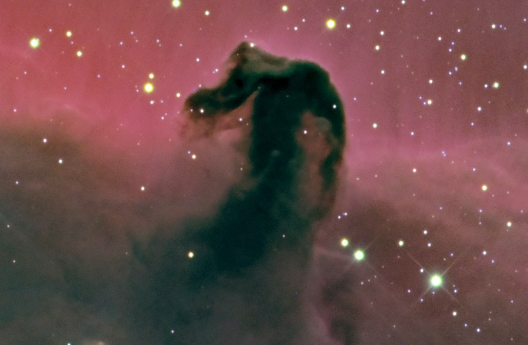
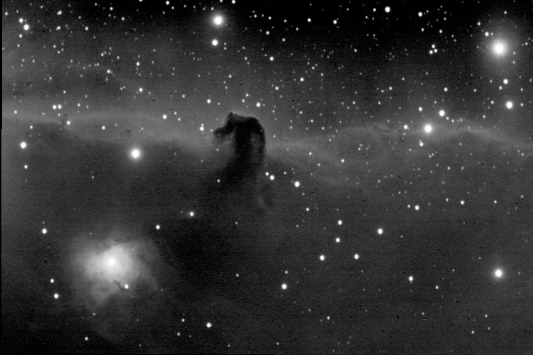

B33, the Horsehead Nebula, in LLRGB &mdash; a close-up view battling the glare of nearby Alnitak. A [wider region shot](/gallery/horsehead-flame-nebula-region/) including the Flame Nebula is also on file.

<strong>Location:</strong> Comanche Springs, 3RF dark sky site near Crowell, Texas

<strong>Date:</strong> October 26, 2005

<strong>Seeing:</strong> 9/10

<strong>Transparency:</strong> 8/10 (mag. 7 skies)

<strong>Temperature:</strong> 32 degrees F (-25 degrees C on camera)

<strong>Scope/Mount:</strong> 12.5" RCOS RC @ f/9 and Paramount ME

<strong>Camera:</strong> SBIG STL-11000M astro CCD camera

<strong>Exposure Info:</strong> LLRGB image; 160:50:40:60 RGB (20 minute subexposures for L, 10 minute subexposures for RGB, color binned)

<strong>Processing Information:</strong> Acquisition with CCDSoft. Calibration (darks/flats), registration, gradient removal, and RGB channel combine in MaxIm DL 4 (average combine). LRGB and LLRGB combine, color balance, levels/curves, high pass sharpening, and noise removal and local contrast enhancement (Noel Carboni's Astronomy Tools) in Photoshop CS.

<strong>Exposure Notes:</strong> One of the more difficult objects I've shot, simply because of the havoc wreaked by the bright star Alnitak just off the frame to the left. Philosophically, it poses a dilemma&hellip;attack the gradient, leaving the viewer with the question of why the red channel is weaker compared to the other channels -or- preserve the gradient, making it more obvious that something lurks outside the frame impressing itself on the landscape? For this image, I chose a mixture of both philosophies. The original data is heavily biased to the blue, so strengthening of the red channel and removal of most of the blue gradients were required; however, leaving some of the diffraction spikes/flares from Alnitak gives reference to its presence.

<h2>About this Object</h2>

One of the most famous objects in the sky, the Horsehead Nebula is a dark nebula only seen because of the reflection nebula, IC 434, that shines brightly behind it. It carries the designation of Barnard 33, one of many dark nebulae in the Barnard catalog. To the lower left in this picture is another emission nebula, NGC 2023. The Horsehead itself cannot be seen visually except by larger aperture scopes in very dark skies. Medium aperture scopes and some smaller scopes with fine optics can make out the shape of the Horsehead with the aid of a Hydrogen-Beta filter, but that is the exception to the rule. A filter, dark skies, and big aperture gives you the best opportunity, but this is primarily a photographic object, and a great one at that!

<em>The Horsehead Nebula, Barnard 33, in detail</em>

<h3>Previous Attempt</h3>

<strong>Location:</strong> Ballauer Observatory in Azle, Texas 
<strong>Seeing:</strong> 8/10 (2.5 FWHM) 
<strong>Transparency:</strong> 4/10 
<strong>Date and Time:</strong> November 18, 2003 @ 11:00PM 
<strong>Equipment:</strong> SBIG ST-7E, Tak FSQ-106 @ f/5, and Celestron CGE mount 
<strong>Length:</strong> Five 20 minute exposures binned 1x1 
<strong>Processing Information:</strong> Dark frames, gradient removal, registration and Sigma Combine in MaxIm 3.0. Levels, Curves, Gaussian Blur and Unsharp Mask in Photoshop 7.

<em>Exposure Notes: First light image with the new Celestron CGE mount.</em>

🤖 AI-drafted &middot; unverified

<dl class="ke-ai-stub-facts">
<dt>What it is</dt>
<dd>Barnard 33, the Horsehead Nebula, is a dense cloud of dark, cool gas and dust silhouetted against the bright background emission nebula IC 434, near the star Alnitak — one of the most recognizable dark nebulae in the sky, though faint enough to be a difficult visual target.</dd>
<dt>Constellation</dt>
<dd>Orion</dd>
<dt>Distance</dt>
<dd>~1,375 light-years</dd>
<dt>Apparent magnitude</dt>
<dd>N/A &mdash; dark nebula, silhouette only</dd>
<dt>Angular size</dt>
<dd>~6 &times; 4 arcminutes</dd>
<dt>Coordinates</dt>
<dd>RA 05h 40m 59s, Dec -02&deg; 27&prime; 30&Prime;</dd>
</dl>

This summary was generated by an AI assistant from general astronomical references, not from Jay's own notes on this specific image. Treat every detail above as a starting point for research, not settled fact.

Verify further: <a href="https://en.wikipedia.org/wiki/Horsehead_Nebula">Wikipedia</a>

