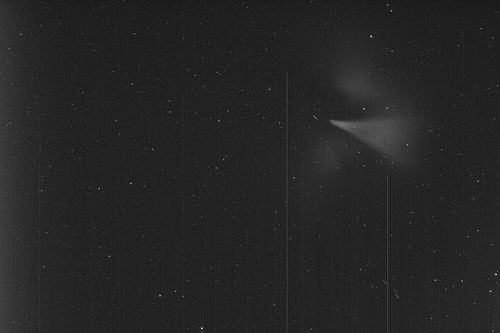

Location: Comanche Springs Astronomy Campus near Crowell, Texas. November 11, 2007, approximately 3 AM CST (event spanned 2:45am to 3:15am CST). Image credits: Jay Ballauer and Vance Bagwell, Three Rivers Foundation. Seeing: 4/10. Transparency: 7/10. Temperature: -20 degrees C on camera.

Video sequence information: Acquisition of 211 frames with CCDSoft. 36 frames around M42 selected, then calibrated and DDP'ed in CCDStack. Noise removal of individual frames in Photoshop CS2 with Noel Carboni's Astronomy Tools actions. Conversion of individual frames to JPEG. Conversion of frames to AVI movie format using Photolapse software.

<a href="https://oldallaboutastro.weebly.com/uploads/1/2/4/7/12477060/jaydelta.avi">Watch the video sequence &rarr;</a> (4.75MB)

There is an old saying, "Chance favors the prepared mind." Well, I do not know how prepared Vance Bagwell and I were to contemplate what we saw on one beautiful November night, but at least our equipment was ready to capture it in pictures.

Vance and I are veterans at astronomy outreach events, so when a couple of Fort Worth visitors to the Comanche Springs Astronomy Campus came to us at 2:40am on November 11th to ask why nobody told them about that "comet up in Orion," we immediately rolled our eyes. After all, we've heard something like that a million times when visitors come to our dark skies for the first time. However, when I loaned my green laser pointer to Danny Townsend and Kevin Ulrich of Fort Worth to show us what it was that had them so excited, our eyes stopped rolling. Mouths agape at the naked eye object that was both larger and brighter than the Orion Nebula, which rested only a couple of fingers away, Vance and I immediately shifted into our "serious" astronomer persona and grabbed any optics available to catch a closer view.

But when we detected movement of the mysterious object from west to east, heading on a collision course with the Orion Nebula, both Vance and I scrambled to halt our imaging sessions and acquire the event. Since my scope was already on the nearby M78, it was a quick jog, thankfully. Upon acquisition of the object just west of the Orion Nebula, I managed 211 one-second focus frames while tracking on the slowly moving "comet." Of course, knowing that this wasn't likely to be a new comet due to its brightness and speed, our speculation at the time was some kind of rocket shot or reentry vehicle.

It wasn't until the next day that the mystery was solved in our minds. Spaceweather.com reported that the event was a Delta IV Centaur fuel dump, which happened at an altitude of approximately 22,000 miles, following the launch of DSP 23 from Cape Canaveral, Florida. More on this from Ed Cannon of Austin, TX:

> Early Sunday morning a couple of transient naked-eye "nebulae" or "comets" are expected to be observable, weather permitting, from all of the western hemisphere at the end of the launch sequence of DSP 23. The launch window is 8:39 - 10:41 PM EST Saturday night (1:39 - 3:41 Sunday UTC) from Cape Canaveral, Florida.
>
> Just about six hours after launch (i.e., 2:39-4:41 AM EST, 7:39-9:41 UTC), when the payload and Centaur upper stage have reached very near to geostationary height, there will be a three-minute burn to change the orbital inclination and circularize the orbit. This will occur at about longitude 90 west, plus or minus some degrees, close to the celestial equator. This will be the first nebula/comet.
>
> Spacecraft separation will occur just about 6.5 minutes after the end of the burn. Not long after spacecraft separation, excess fuel and oxidizer will be vented from the Centaur. This will be the second nebula/comet — the brighter one.
>
> The burn itself (i.e., the flame) may be visible with a telescope. At least one of the nebulae/comets may be as bright as first magnitude.
>
> As these events will occur very near geostationary height, they will not move very much in the sky. The burn cloud may move at nearly sidereal rate. The venting cloud may be nearly stationary as the stars move by. But both of them may move to the north or south, as the nominal final orbital inclination is four, not zero.
>
> DSP satellites themselves are very faint unless specular reflections off their four solar panels are observed. They are spin-stabilized at 6 RPM.

### Additional Images by Vance Bagwell

Date: November 11, 2007. Time: approx. 3 a.m. CST (near Messier 42). Exposure: one 10 second exposure, unbinned. Equipment: Takahashi FSQ-106 refractor, Takahashi NJP mount, SBIG STL-11000 astro CCD camera.

To see the images and videos at Vance's site, and his apt descriptions, click through to [Vance's Flickr page](http://www.flickr.com/photos/14924974@N02/).

🤖 AI-drafted &middot; unverified

<dl class="ke-ai-stub-facts">
<dt>What it is</dt>
<dd>Not an astronomical object at all &mdash; a cloud of vented fuel and oxidizer from a Delta IV Centaur upper stage, illuminated by sunlight at high altitude, briefly resembling a bright comet or nebula.</dd>
<dt>Constellation</dt>
<dd>Appeared near Orion (M42/M78) as seen from Texas</dd>
<dt>Distance</dt>
<dd>~22,000 miles (near geostationary altitude)</dd>
<dt>Apparent magnitude</dt>
<dd>Reported as bright as ~magnitude 1</dd>
<dt>Angular size</dt>
<dd>Larger and brighter than the Orion Nebula at the time</dd>
<dt>Coordinates</dt>
<dd>N/A &mdash; transient event, moved across the sky</dd>
</dl>

This summary was generated by an AI assistant from general astronomical references, not from Jay's own notes on this specific image. Treat every detail above as a starting point for research, not settled fact.

Verify further: <a href="https://en.wikipedia.org/wiki/Delta_IV">Wikipedia: Delta IV</a>

