Location: "Ground Zero" - Walmart Parking Lot, Hopkinsville, Kentucky. Temperature: maybe 95 degrees F.

I was treated to the most glorious visual experience EVER with this 2017 Total Solar Eclipse. My journey took me to Hopkinsville, KY, which was essentially "ground-zero" for the eclipse. We were blessed with clear skies and friendly, excited neighbors for the 2 minutes and 40 seconds of totality.

This is the full solar corona, which is visible during totality. This image is a composite of several images ranging from 1/3200 seconds to 2 seconds. These are put together in Photoshop by uniting the images as a Smart Object and applying "mean" blending to the stack.

The moon details, which aren't visible with the eye during a total eclipse, become visible in a longer exposure due to reflected earth light (earthshine) that illuminates the moon's surface. The wispy details of the jets of particles that stream through the sun's coronosphere - collectively called the "corona" - are details achieved with additional processing. A tip for PixInsight users: use the Larson-Sekanina process on the stacked image.

Equipment used for this image was a Tak FSQ-85 (without solar filter) and Nikon D810A on a Tak NJP mount.

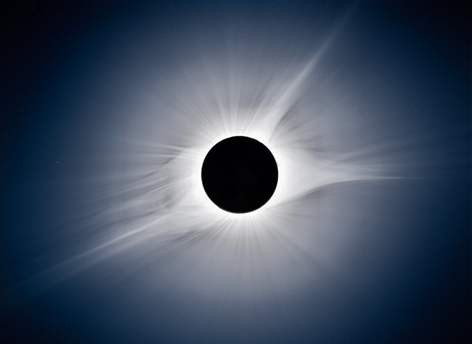

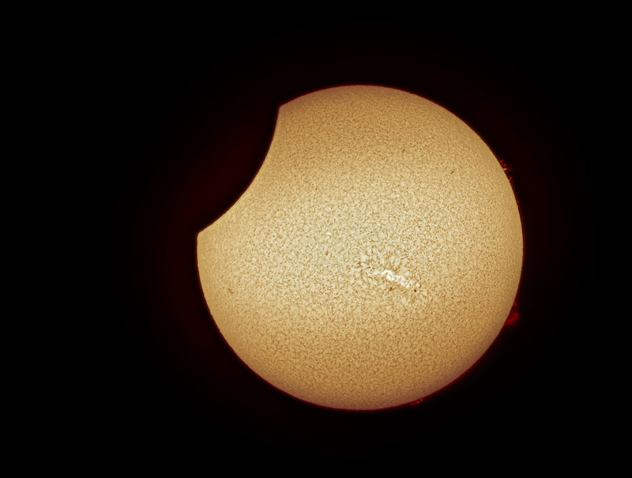

Left: the corona without earthshine detail in the moon. Right: the eclipse underway, captured in H-alpha.

I was very pleased to land my image on the cover of the most recent Amateur Astronomy Magazine. Thanks to Charlie Warren, editor of the magazine, for using the image on the cover. Cool stuff!

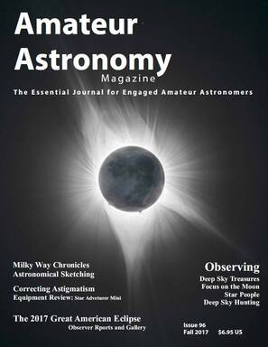

Special thanks to my friend Ross Lawrence for sharing the journey with me...and especially my wife, Helen, and kids for pardoning my absence from home.

### Eclipse Video

Here is the eclipse from our point of view. Thanks to my friend Ross Lawrence for the footage! Trying to capture a total solar eclipse is fraught with peril. In this video, you will see me dancing on the fine line of trying to execute my images while also trying to enjoy the moment. Nothing works exactly like you planned when under pressure, especially when so many people are interested in what you are doing.

Even so, the video is a neat look at many of the activities of that most special day. Ross captured the enthusiasm of the crowd so well.

<a href="https://oldallaboutastro.weebly.com/uploads/b/12477060-760644699539119106/eclipse_totality_174.mp4">Watch the totality video &rarr;</a>

### My Interview for a Bowling Green, Kentucky News Station

One of the cool things about having a nice astronomy setup for the eclipse is that people think you actually know what you are doing! My equipment must have gotten the attention of a local television station. The video below shows an interview that I gave.

The equipment I had setup for the event was a Takahashi FSQ-85ED "Baby-Q" apo refractor, a Coronado Solar Max 90mm H-alpha Scope, three Nikon D810a cameras - don't ask how I managed that - and a Takahashi NJP mount. I powered off of a large 12v deep cycle RV battery and 2000w Inverter.

<a href="https://oldallaboutastro.weebly.com/uploads/b/12477060-760644699539119106/20170821_102002_674.mp4">Watch the news interview &rarr;</a>

### Slide Show of Event Photos

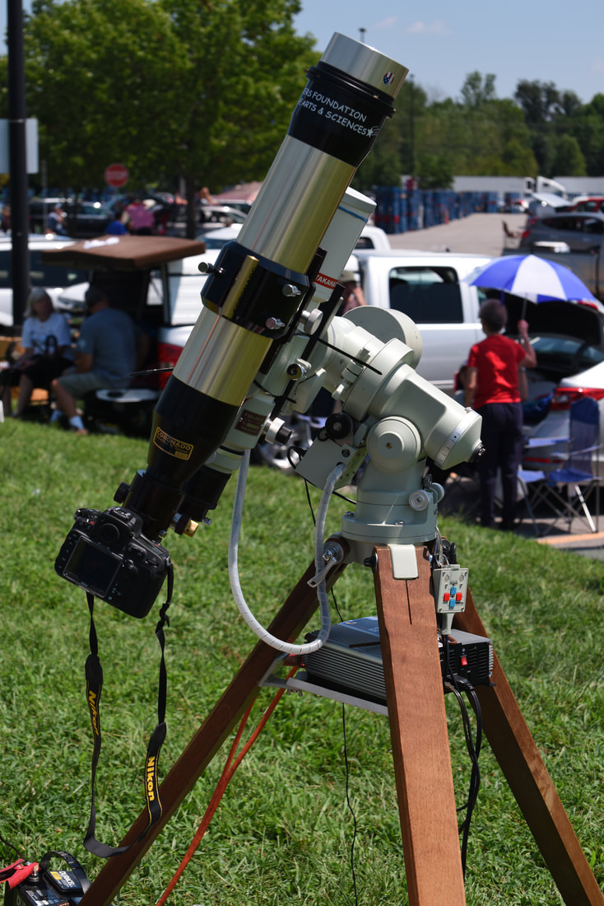

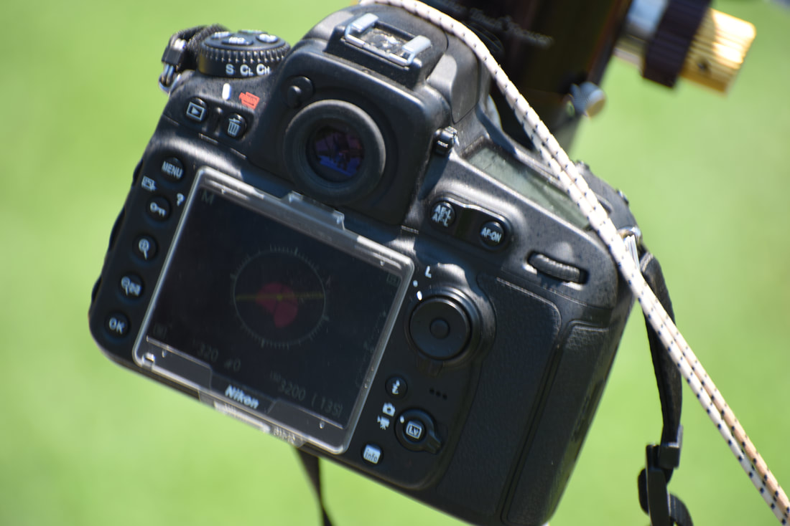

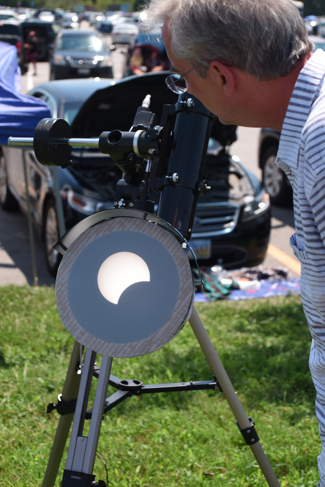

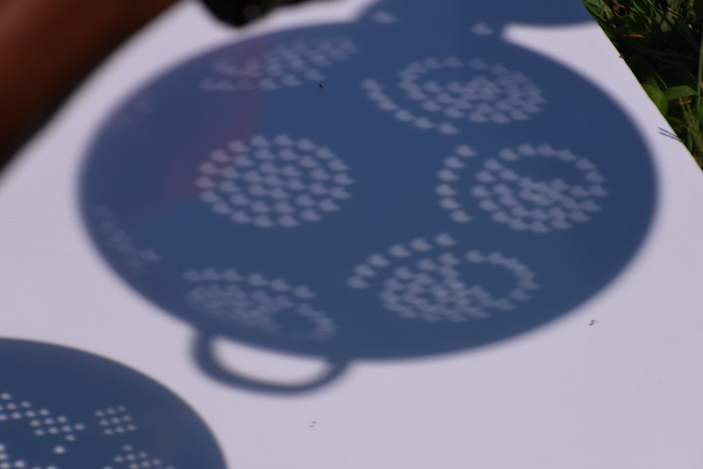

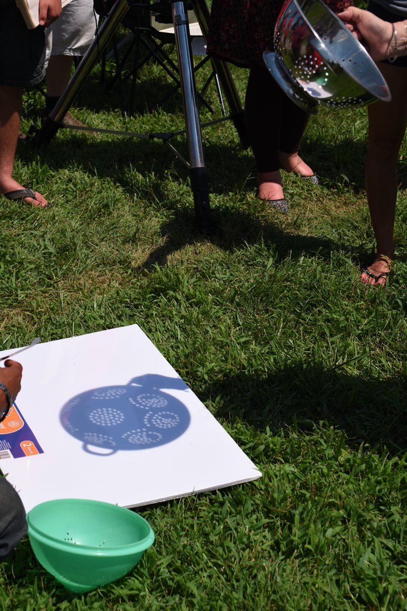

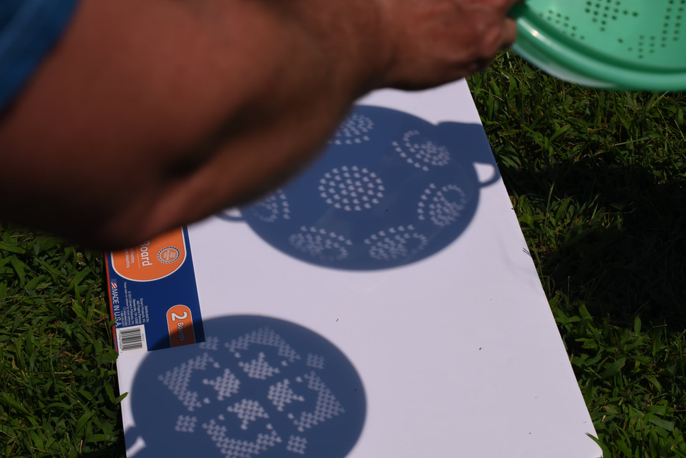

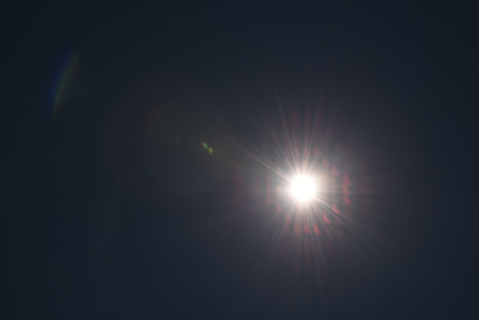

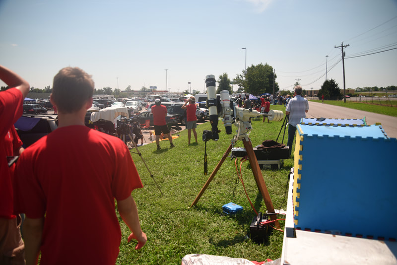

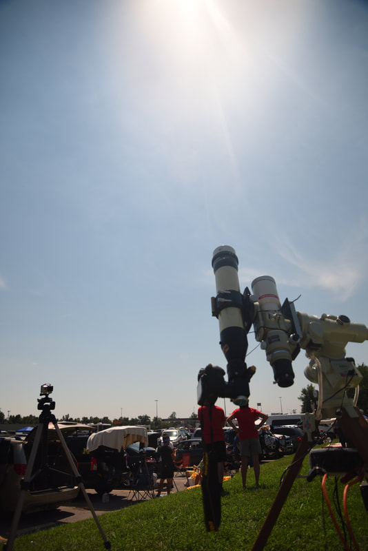

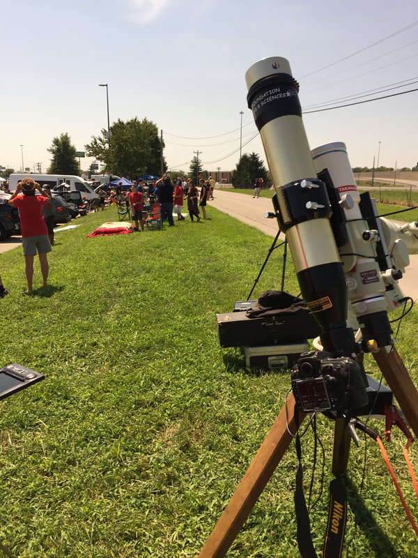

Pictures taken during the 2017 event, capturing the observations and activities of the people gathered around me.

This image was later used on the cover of Amateur Astronomy Magazine, Fall 2017.

🤖 AI-drafted &middot; unverified

<dl class="ke-ai-stub-facts">
<dt>What it is</dt>
<dd>The August 21, 2017 "Great American Eclipse" was a total solar eclipse whose path of totality crossed the entire continental United States, from Oregon to South Carolina — the first coast-to-coast total solar eclipse visible from the U.S. mainland since 1918.</dd>
<dt>Location observed</dt>
<dd>Hopkinsville, Kentucky &mdash; near the point of greatest eclipse</dd>
<dt>Path width</dt>
<dd>~70 miles (113 km)</dd>
<dt>Maximum totality duration</dt>
<dd>~2 minutes 40 seconds (near Hopkinsville, one of the longest-duration points along the path)</dd>
<dt>Next similar U.S. event</dt>
<dd>April 8, 2024 total solar eclipse</dd>
</dl>

This summary was generated by an AI assistant from general astronomical references, not from Jay's own notes on this specific image. Treat every detail above as a starting point for research, not settled fact.

Verify further: <a href="https://en.wikipedia.org/wiki/Solar_eclipse_of_August_21,_2017">Wikipedia</a>

