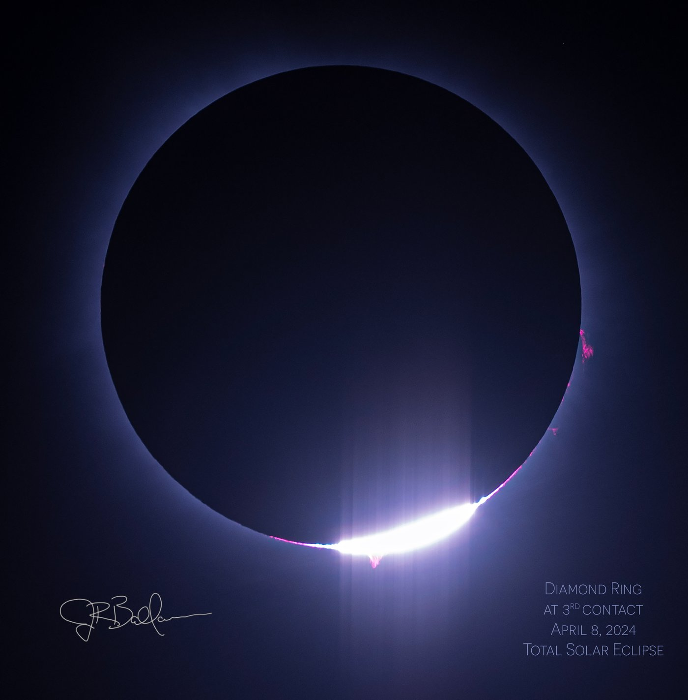
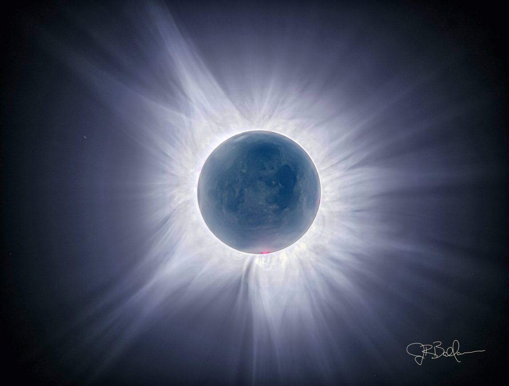
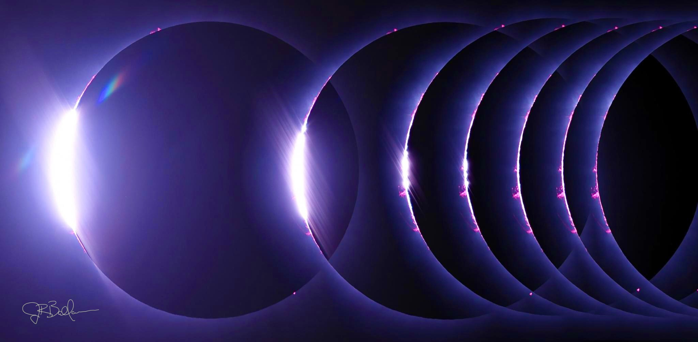
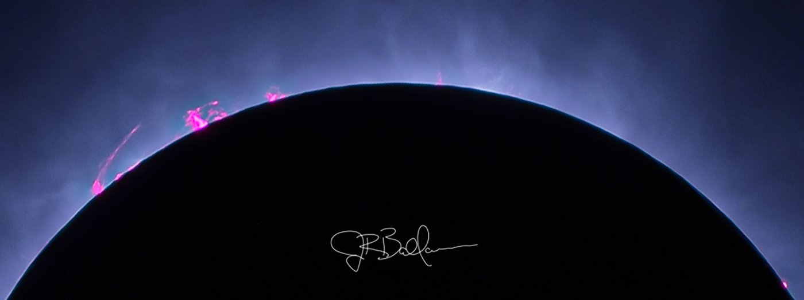
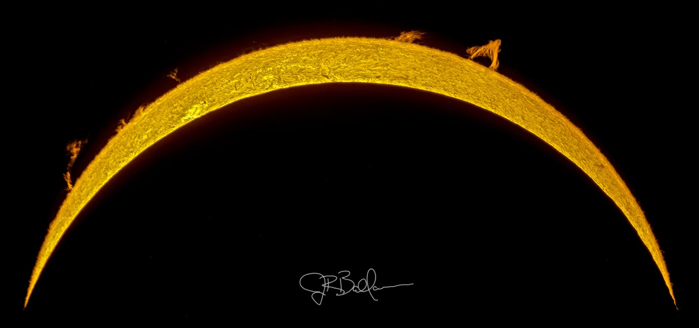
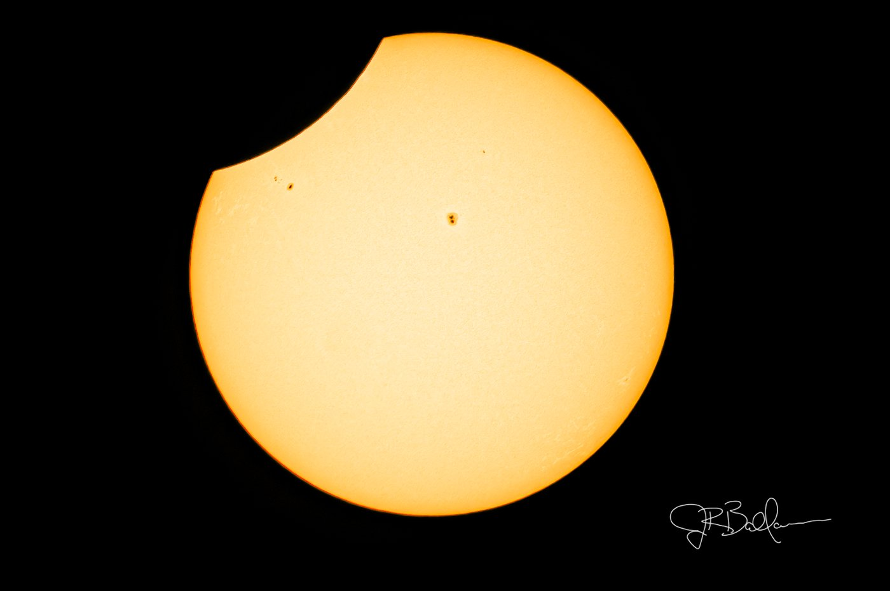
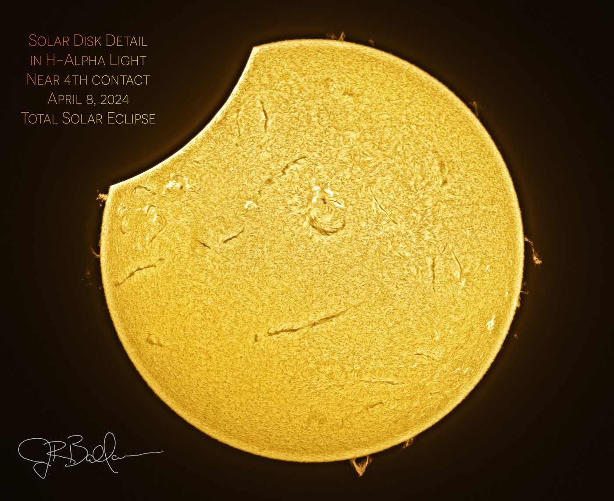

Location: Texas, on the centerline of totality for the April 8, 2024 "Great American Eclipse." Seven years after chasing the 2017 eclipse to Kentucky, this one crossed right through my home state &mdash; no cross-country drive required, just clear skies and about four minutes of totality.

This is the Diamond Ring at Third Contact &mdash; the instant totality ends and the first blinding sliver of direct sunlight reappears at the lunar limb, flanked by a scatter of pink prominences catching the light before they wash out. Getting the timing right on this shot means pulling the solar filter back off just before totality ends and firing through the transition in a fraction of a second.

The full corona during totality, composited from multiple exposures spanning roughly 1/3200 second up to 2 full seconds to capture the sun's dynamic range in one image. The longer exposures also pull out earthshine &mdash; sunlight reflected off the Earth, faintly illuminating the otherwise-black lunar disk, visible here as subtle cloud-like texture across the moon's face. A handful of prominences show up in pink at the limb.

A sequence of frames leading into totality at Second Contact &mdash; the diamond ring collapsing down to nothing as the moon fully covers the solar disk, corona and prominences emerging around the edge of totality's approach.

Left: a closeup crop on the prominences visible during totality, the pink plasma loops arcing along the sun's magnetic field lines. Right: the same kind of limb detail, this time captured in hydrogen-alpha with the Coronado scope, showing the prominences against the chromosphere's fibrous texture.

The white-light view as the moon pulls away near Fourth Contact, the eclipse's final moment &mdash; the sun's photosphere re-emerging as a growing crescent, sunspot groups visible on the disk.

And the same moment near Fourth Contact captured in H-alpha through the Coronado scope, showing the sun's chromosphere in fine fibrous detail, filaments threading across the disk and prominences still lifting off the limb.

For more on how I planned and shot this eclipse &mdash; equipment, exposure strategy, and the contact-by-contact rundown &mdash; see the [Great American Solar Eclipse 2024](/learning/great-american-solar-eclipse-2024/) article.

🤖 AI-drafted &middot; unverified

<dl class="ke-ai-stub-facts">
<dt>What it is</dt>
<dd>The April 8, 2024 total solar eclipse, whose path of totality crossed Mexico, the United States (from Texas to Maine), and the Canadian Maritimes &mdash; the last total solar eclipse visible from the contiguous U.S. until 2044.</dd>
<dt>Location observed</dt>
<dd>Texas, on the centerline of totality</dd>
<dt>Path width</dt>
<dd>~115 miles (185 km)</dd>
<dt>Maximum totality duration</dt>
<dd>~4 minutes 28 seconds (near the point of greatest eclipse in Mexico); around 4 minutes along much of the Texas centerline</dd>
<dt>Next similar U.S. event</dt>
<dd>August 23, 2044 total solar eclipse</dd>
</dl>

This summary was generated by an AI assistant from general astronomical references, not from Jay's own notes on this specific image. Treat every detail above as a starting point for research, not settled fact.

Verify further: <a href="https://en.wikipedia.org/wiki/Solar_eclipse_of_April_8,_2024">Wikipedia</a>

