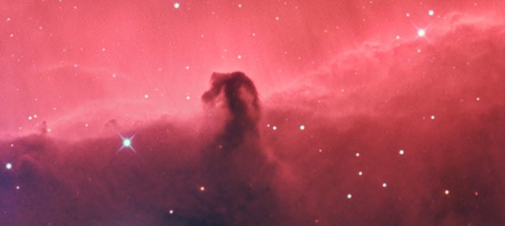
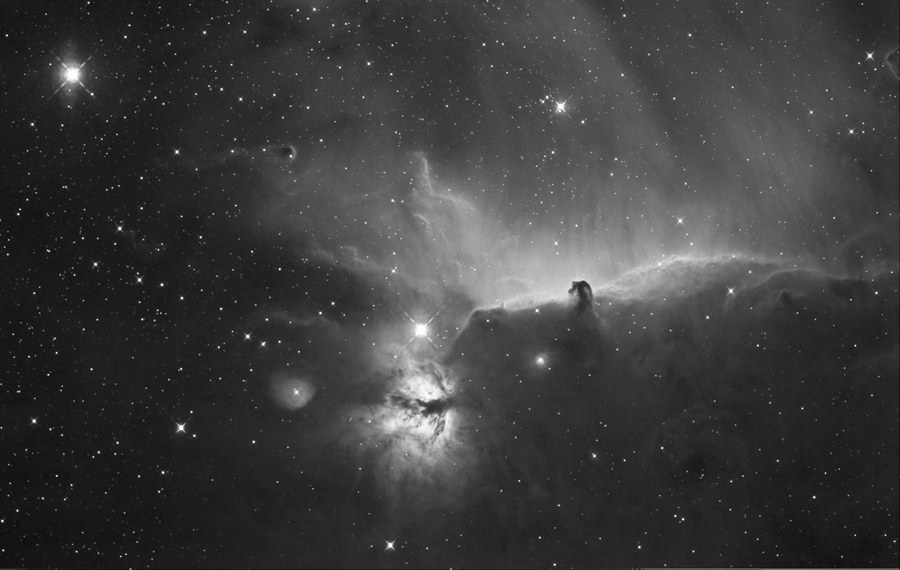

The Horsehead Nebula region &mdash; B33 and the Flame Nebula, NGC 2024, in Ha(Ha)GB. A [closer, later view of B33 alone](/gallery/b33-horsehead-nebula/) is also on file.

<strong>Date:</strong> December 6, 2004

<strong>Location:</strong> The Ballauer Observatory near Azle, Texas

<strong>Transparency:</strong> 4.5 mag zenithal

<strong>Seeing:</strong> 3/10

<strong>Temperature:</strong> 55 degrees, camera cooled to -25 degrees C

<strong>Scope/Mount:</strong> Tak FSQ-106 @ f/5 and Tak NJP mount

<strong>Camera:</strong> SBIG STL-6303E, self-guided

<strong>Exposure Info:</strong> Ha(Ha)GB, 150 minutes Ha luminance (8 x 15 minutes); 15 x 2 minutes green and blue; all unbinned.

<strong>Processing:</strong> Dark frame calibration, deblooming, registration, and Sigma Combine in MaxIm DL 4. Digital Development and RGB combine in MaxIm DL 4. Color balance, curves, levels, selective sharpening/blurring/despeckle in Photoshop CS. Masking of additional H-alpha luminance performed in Photoshop CS.

<strong>Extra Notes:</strong> An additional 30 minutes of h-alpha luminance was taken December 9, 2004. This allowed for more detail in the foreground.

<h2>About this Object</h2>

One of the most famous objects in the sky, the Horsehead Nebula is a dark nebula only seen because of the reflection nebula, IC 434, that shines brightly behind it. It carries the designation of Barnard 33, one of many dark nebulae in the Barnard catalog. The other prominent nebula in the bottom center of the image is the Flame Nebula, NGC 2024. Also pictured are IC 432 and NGC 2023, which is a reflection nebula. The prominent star in the image is the eastern most of Orion's Belt stars, Alnitak. This star is rather bright, shining at mag 1.7.

The Horsehead itself cannot be seen visually except by larger aperture scopes in very dark skies. Medium aperture scopes and some smaller scopes with fine optics can make out the shape of the Horsehead with the aid of a Hydrogen-Beta filter, but that is the exception to the rule. A filter, dark skies, and big aperture gives you the best opportunity, but this is primarily a photographic object, and a great one at that!

<em>The Horsehead Nebula, B33, shown at close to the full resolution of the camera</em>

<em>The Horsehead Nebula region in Hydrogen-Alpha light, used for luminance in the image above</em>

🤖 AI-drafted &middot; unverified

<dl class="ke-ai-stub-facts">
<dt>What it is</dt>
<dd>The Horsehead Nebula (Barnard 33) and Flame Nebula (NGC 2024) sit side by side near the star Alnitak in Orion's belt. B33 is a dark dust cloud silhouetted against the glow of emission nebula IC 434.</dd>
<dt>Constellation</dt>
<dd>Orion</dd>
<dt>Distance</dt>
<dd>~1,375 ly (B33); ~1,350 ly (NGC 2024)</dd>
<dt>Apparent magnitude</dt>
<dd>N/A &mdash; dark nebula and diffuse emission region</dd>
<dt>Angular size</dt>
<dd>~6 &times; 4&prime; (B33); ~30 &times; 30&prime; (NGC 2024)</dd>
<dt>Coordinates</dt>
<dd>near Alnitak: RA 05h 41m, Dec -02&deg; 24&prime;</dd>
</dl>

This summary was generated by an AI assistant from general astronomical references, not from Jay's own notes on this specific image. Treat every detail above as a starting point for research, not settled fact.

Verify further: <a href="https://en.wikipedia.org/wiki/Horsehead_Nebula">Wikipedia: Horsehead Nebula</a> &middot; <a href="https://en.wikipedia.org/wiki/Flame_Nebula">Wikipedia: Flame Nebula</a>

