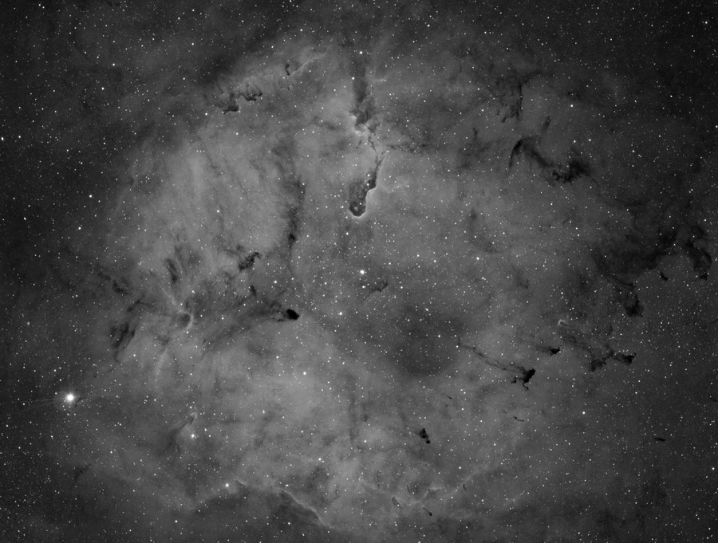
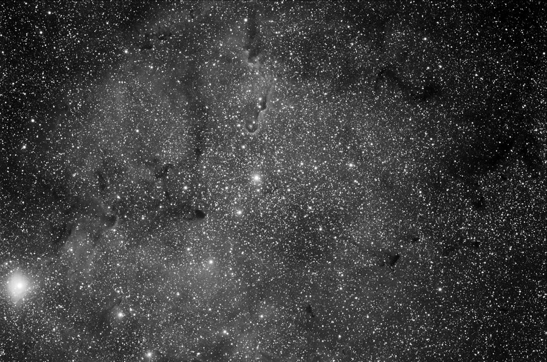
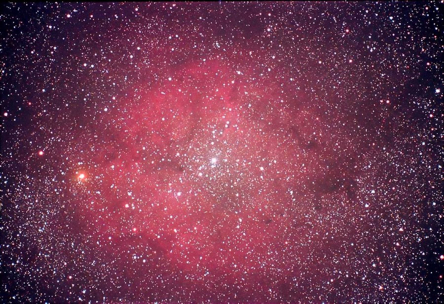

IC 1396, the emission nebula complex in Cepheus, with vdb 142, in Ha+LRGB.

<strong>Location:</strong> Okie-Tex Star Party, Kenton, OK

<strong>Date:</strong> September 18-19, 2006

<strong>Seeing:</strong> 3/10

<strong>Transparency:</strong> 9/10

<strong>Temperature:</strong> -25 degrees C on camera

<strong>Scope/Mount:</strong> Tak FSQ-106 @ f/5 on Paramount ME

<strong>Camera:</strong> SBIG STL-11000M astro CCD camera

<strong>Filter:</strong> Custom Scientific 4.5 nm H-alpha filter

<strong>Exposure Info:</strong> Ha+LRGB image; 150:40:30:30 minutes with 60 minutes of clear luminance data (10 minute subexposures for LRGB, 30 minute subexposures for Ha)

<strong>Processing Information:</strong> Acquisition with CCDSoft. Calibration (darks/flats), and registration in CCDstack (median combine). LRGB combine and Ha blending, color balance, levels/curves, and noise removal/local contrast enhancement/star halo reduction (Noel Carboni's Astronomy Tools) in Photoshop CS.

<h2>About this Object</h2>

A little known cluster and nebula in the Milky Way region of Cepheus. IC 1396 is large in size, covering approximately 3 degrees of the sky just southeast of Alderamin, the brightest star in Cepheus. In fact, it's one of the largest emission nebula in the sky, about 6 times wider than our full moon. The large, bright star in this photo is the Garnet Star, Mu Cephei, a red variable star. This star varies between 3.4 and 5.1 magnitude over a 730 day period. Several dark nebula permeate IC 1396 including Barnard 160, the larger of the dark nebula on the right side as shown here. Perhaps the most spectacular feature is van den Bergh 142, commonly called the "elephant trunk".

<em>Hydrogen-Alpha data used for the image above (150 minutes)</em>

<h3>Previous Images</h3>

<strong>Location:</strong> Texas Star Party 2004 near Fort Davis, Texas 
<strong>Seeing:</strong> 6/10 
<strong>Transparency:</strong> 8/10 
<strong>Date and Time:</strong> May 21, 2003 
<strong>Scope/Mount:</strong> Tak FSQ-106 on Tak NJP mount 
<strong>Exposure information:</strong> Grayscale, clear luminance (7 x 10 minutes) 
<strong>Camera:</strong> SBIG STL-6303E with integrated filter wheel 
<strong>Processing Information:</strong> Dark calibration, deblooming, alignment, and sigma combine in MaxIm DL 4. Digital Development in MaxIm 4. Levels and Curves in Photoshop CS.

<strong>Location:</strong> Texas Star Party 2003 near Fort Davis, Texas 
<strong>Seeing:</strong> 6/10 
<strong>Transparency:</strong> 8/10 
<strong>Date and Time:</strong> May 3, 2003 @ 3:35 AM CST 
<strong>Equipment:</strong> 420mm @ f4 (300mm Nikkor ED lens with TC14B teleconverter) guided with Meade 208xt 
<strong>Length:</strong> A single 45 minute exposure 
<strong>Film:</strong> Kodak E200 slide film with one stop push to ISO 320 
<strong>Processing Information:</strong> Image is slightly cropped with a levels adjustment and contrast/saturation increase. Slight unsharp mask applied.

<em>Exposure Notes: I shot this object a bit low on the horizon so some atmospheric discoloration occurred. I managed to process much of it out but some color shift remains. Still, a very pleasing shot!</em>

🤖 AI-drafted &middot; unverified

<dl class="ke-ai-stub-facts">
<dt>What it is</dt>
<dd>IC 1396 is an enormous, faint emission nebula and open cluster best known for the dense dark globule within it called the Elephant's Trunk. Its low surface brightness makes it a challenging target that photographs far better than it observes visually.</dd>
<dt>Constellation</dt>
<dd>Cepheus</dd>
<dt>Distance</dt>
<dd>~2,400 light-years</dd>
<dt>Apparent magnitude</dt>
<dd>N/A &mdash; very low surface brightness</dd>
<dt>Angular size</dt>
<dd>~170 arcminutes (nearly 3&deg;)</dd>
<dt>Coordinates</dt>
<dd>RA 21h 39m, Dec +57&deg; 30&prime;</dd>
</dl>

This summary was generated by an AI assistant from general astronomical references, not from Jay's own notes on this specific image. Treat every detail above as a starting point for research, not settled fact.

Verify further: <a href="https://en.wikipedia.org/wiki/IC_1396">Wikipedia</a>

