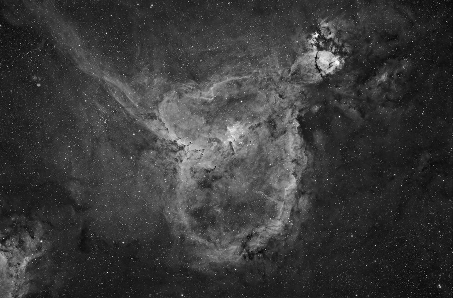

A Hydrogen-Alpha-luminance HaRGB image of the Heart Nebula, taken at the Eldorado Star Party. An [earlier attempt](/gallery/ic1805-heart-nebula-2004/) at this same object, from 2004, is also on file.

<strong>Location:</strong> Eldorado Star Party, Eldorado, Texas

<strong>Date:</strong> October 20, 2006

<strong>Seeing:</strong> 4/10

<strong>Transparency:</strong> 6/10

<strong>Temperature:</strong> -25 degrees C on camera

<strong>Scope/Mount:</strong> Takahashi FSQ-106 @ f/5 on a Software Bisque Paramount ME

<strong>Camera:</strong> SBIG STL-11000M astro CCD camera

<strong>Filter:</strong> Custom Scientific 4.5nm Hydrogen-Alpha filter

<strong>Exposure Info:</strong> HaRGB image; 160:50:30:60 minutes (10-minute subexposures for RGB, 20-minute subexposures for Ha)

<strong>Processing Information:</strong> Acquisition with CCDSoft. Calibration (darks/flats) and registration in CCDStack (median combine). LRGB combine and Ha blending, color balance, levels/curves, and noise removal/local contrast enhancement (Noel Carboni's Astronomy Tools) in Photoshop CS.

<h2>About this Object</h2>

Cassiopeia is an astrophotographer's dream! It is filled with shapely, beautiful emission nebulae. This image portrays one of the most spectacular of those nebulae, and perhaps one of the most unique objects in the night sky. Located next to another emission nebula, <a href="/gallery/ic1848-embryo-nebula/">IC 1848</a>, the two together comprise the Heart and Soul Nebula complex. This complex happens to be very close to another grand site, the Double Cluster in Perseus.

IC 1805 is the name for the large, heart-shaped area of nebulosity, but many of the components of this image have other designations. At the very center of the "heart" is an open cluster of stars known as Melotte 15. This cluster can be seen with just about any telescope as a couple of dozen stars, quite indistinct. The two bright patches at the bottom are known separately as NGC 896 and IC 1795, from left to right respectively. At the left side of IC 1805 is a line of stars known as Markarian 6. To observe the nebulosity itself, you must have large apertures (over 16") and either UHC or OIII filters. With such a setup, you should see NGC 896 as a faint glow, and perhaps even part of the arc of IC 1805 itself. Averted vision might be the only way to see it, and I shouldn't have to say it, but you'll also need dark skies.

Even though this object might not be too pleasing through a scope, it certainly is with a camera. To enhance the detail in the object, I employed a technique whereby I used a special filter that captures the Hydrogen-Alpha emissions of the nebula, took part of the image through it, and then used that information to give the image a special luminance component. It is a difficult technique to perform from a processing standpoint, but I'm quite pleased with the result, which is a good thing, since this nebula deserves a place in everyone's heart (pun intended).

<em>Hydrogen-Alpha data used for the image above (160 minutes)</em>

🤖 AI-drafted &middot; unverified

<dl class="ke-ai-stub-facts">
<dt>What it is</dt>
<dd>IC 1805, the Heart Nebula, is a huge emission nebula whose glowing clouds of ionized hydrogen form a heart-shaped outline.</dd>
<dt>Constellation</dt>
<dd>Cassiopeia</dd>
<dt>Distance</dt>
<dd>~7,500 light-years</dd>
<dt>Apparent magnitude</dt>
<dd>~6.5</dd>
<dt>Angular size</dt>
<dd>~150 &times; 150 arcminutes (~2.5&deg;)</dd>
<dt>Coordinates</dt>
<dd>RA 02h 33m, Dec +61&deg; 27&prime;</dd>
</dl>

This summary was generated by an AI assistant from general astronomical references, not from Jay's own notes on this specific image. Treat every detail above as a starting point for research, not settled fact.

Verify further: <a href="https://en.wikipedia.org/wiki/Heart_Nebula">Wikipedia</a>

