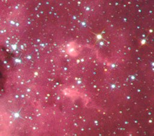
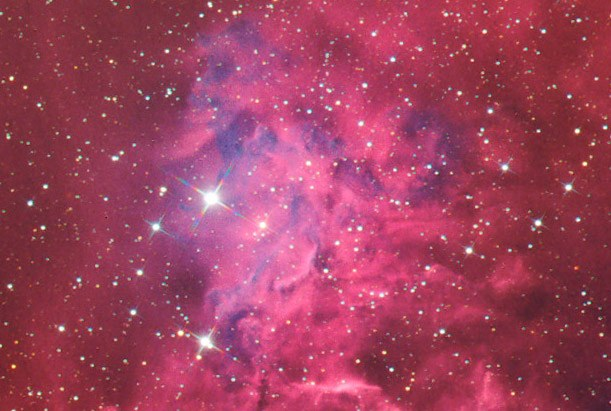

The Flaming Star region &mdash; IC 405 and IC 410, a pair of emission nebulae near Capella in Auriga, imaged in Ha(Ha+R)GB.

<strong>Date:</strong> December 9, 2004 (Ha info) and December 11, 2004 (color info)

<strong>Location:</strong> The Ballauer Observatory near Azle, Texas (Ha info) and Comanche Springs near Crowell, Texas (color info)

<strong>Transparency:</strong> 5.2 mag zenithal (Ballauer Observatory) and 6.8 mag zenithal (Comanche Springs)

<strong>Seeing:</strong> 2/10 (Ballauer Observatory) and 5/10 (Comanche Springs)

<strong>Temperature:</strong> 55 degrees F (Ballauer Observatory) and 35 degrees F (Comanche Springs); camera cooled to -25 degrees C

<strong>Scope/Mount:</strong> Tak FSQ-106 @ f/5 and Tak NJP mount

<strong>Camera:</strong> SBIG STL-6303E (Ha info) and SBIG STL-11000 (color info), self-guided

<strong>Exposure Info:</strong> Ha(Ha+R)GB, 135:60:60:65 minutes; 15 minute individual exposures for Ha and 5 minute exposures for RGB; all unbinned.

<strong>Processing:</strong> Dark frame calibration, deblooming, registration, artificial flats, gradient removal and Sigma Combine in MaxIm DL 4. Digital Development and RGB combine in MaxIm DL 4. Ha blending, color balance, curves, levels, selective sharpening/blurring/despeckle in Photoshop CS.

<strong>Extra Notes:</strong> "First light" image taken with the new SBIG STL-11000 camera, supplied by 3RF. Ha info blended into red at 50% using Screen blending mode. Ha info then used again as luminance at 33%. A string taped to the end of the aperture to create the diffraction spikes.

<h2>About this Object</h2>

Part of the winter Milky Way, these nebulae, IC 405 and IC 410, rest in the southern portion of Auriga near the open clusters M36 and M38. IC 405, located at bottom in this image, is also known as the "Flaming Star" Nebula due to the blue reflection of the bright star AE Aurigae amidst the rest of the reddish, hydrogen emissions. AE Aurigae is a hot, blue star shining at magnitude 5.96 with the B0 spectral class. It is a fast moving, roaming star that once originated in the Orion area. At the top of the image is IC 410, which is also an emission nebula, though the central star cluster also has the added designation of NGC 1893. This combination of nebula/cluster is reminiscent of the nearby Rosette Nebula in Monoceros. While the open cluster is easy to observe with most telescopes, the emission nebulae are a bit more tricky. The nebulosity of IC 410 is much easier to catch than that of the Flaming Star, but you'll still need at least 10" of aperture in dark skies, and a UHC or OIII filter will help. IC 405 requires much larger apertures, which makes its inclusion in the Caldwell "Catalog" (C31) somewhat questionable.

<em>IC 410 features some neat details, like these little tadpoles&hellip;or is it cosmic sperm? Hmmm&hellip;</em>

<em>The Flaming Star shown at full resolution of the camera</em>

🤖 AI-drafted &middot; unverified

<dl class="ke-ai-stub-facts">
<dt>What it is</dt>
<dd>IC 405, the Flaming Star Nebula, and IC 410 are neighboring emission/reflection nebulae near the bright star Capella; IC 410 hosts the open cluster NGC 1893 and the well-known "tadpole" globules.</dd>
<dt>Constellation</dt>
<dd>Auriga</dd>
<dt>Distance</dt>
<dd>~1,500 ly (IC 405); ~12,000 ly (IC 410)</dd>
<dt>Apparent magnitude</dt>
<dd>~6.0 (IC 405); ~7.5 (IC 410)</dd>
<dt>Angular size</dt>
<dd>~37 &times; 19&prime; (IC 405); ~40 &times; 30&prime; (IC 410)</dd>
<dt>Coordinates</dt>
<dd>near Capella: RA 05h 16m, Dec +34&deg; 16&prime;</dd>
</dl>

This summary was generated by an AI assistant from general astronomical references, not from Jay's own notes on this specific image. Treat every detail above as a starting point for research, not settled fact.

Verify further: <a href="https://en.wikipedia.org/wiki/IC_405">Wikipedia: IC 405</a> &middot; <a href="https://en.wikipedia.org/wiki/IC_410">Wikipedia: IC 410</a>

