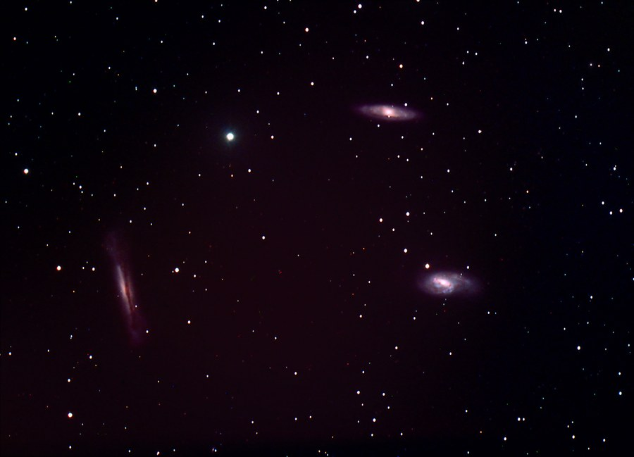

The Leo Trio of galaxies -- M65, M66, and NGC 3628 -- in LRGB.

<strong>Location:</strong> Comanche Springs Astronomy Campus near Crowell, Texas

<strong>Date:</strong> February 18-19, 2007

<strong>Seeing:</strong> 9/10

<strong>Transparency:</strong> 9/10, windy on second night

<strong>Temperature:</strong> -25 degrees C on camera

<strong>Scope/Mount:</strong> Tak TOA-150 (with 67 flattener) on Paramount ME

<strong>Camera:</strong> SBIG STL-11000M astro CCD camera plus AO-L adaptive optics

<strong>Exposure Info:</strong> LRGB image; 160:50:40:60 minutes (10 minute subexposures for RGB, 20 minute subexposures for L)

<strong>Processing Information:</strong> Acquisition with CCDSoft. Calibration (darks/flats), and registration in CCDStack (median combine). RGB/LRGB combine, color balance, levels/curves, and noise removal (Noel Carboni's Astronomy Tools) in Photoshop CS. Special thanks to the Three Rivers Foundation for use of the equipment.

<h2>About this Object</h2>

Leo is one of the more unrated constellations in the night sky. No, it is not filled with colorful nebula, a distinction of any constellation so far removed from the plane of our Milky Way. However, Leo is home to several of the best galaxies visible from earth. This image shows three of the most famous of the Leo galaxies, and together they are often called the "Leo Trio" or "Leo Triplet" of galaxies. Belonging to the M66 group, they reside some 35 million light years away.

In the image above, M65 is the oblique spiral in the upper right, M66 is below, and NGC 3628 is the edge-on spiral to the left. Notice the faint trail of dust extending below and to the left of this galaxy. Together, they are a beautiful trio indeed, a favorite target for many astroimagers in the spring months.

The cluster is quite easy to find, resting in the "back leg" of the Lion itself, between the Theta and Iota stars in Leo. Most any scope in dark skies can detect these bright galaxies - mag 8.9 for M66, mag 9.2 for M65, and mag 9.6 for NGC 3628.

<h3>Previous Images</h3>

<strong>Location:</strong> The Ballauer Observatory near Azle, Texas 
<strong>Date:</strong> February 13, 2004 
<strong>Temperature:</strong> 28 degrees F 
<strong>Seeing:</strong> 8/10 (1.3 FWHM) 
<strong>Transparency:</strong> 2/10 
<strong>Scope/mount:</strong> Takahashi FSQ-106 @ f/5 and Celestron CGE mount 
<strong>Camera:</strong> SBIG ST-10XME, self-guided 
<strong>Exposure Info:</strong> RGB image - 40:40:60 minutes (10 min. subexposures) 
<strong>Processing Info:</strong> Dark frame and flat field calibration, de-blooming, alignment, and Sigma combine of all channels in MaxIm 3.0. Digital-development in Images Plus. Color compositing in MaxIm. Curves, gradient removal, color balance, sharpening, and cropping in Photoshop CS. Final smoothing in Pleiades' SGBNR.

<em>Extra information: First light image with the SBIG ST-10xme. Taken low in the midst of lots of light pollution; around mag 2 skies. Thanks to Dr. Fred Koch for loaning me the ST-10.</em>

🤖 AI-drafted &middot; unverified

<dl class="ke-ai-stub-facts">
<dt>What it is</dt>
<dd>The Leo Trio (also called the M66 Group) is a small, gravitationally interacting group of spiral galaxies — M65, M66, and NGC 3628.</dd>
<dt>Constellation</dt>
<dd>Leo</dd>
<dt>Distance</dt>
<dd>~35 million light-years</dd>
<dt>Apparent magnitude</dt>
<dd>9.3 (M65); 8.9 (M66); 9.5 (NGC 3628)</dd>
<dt>Angular size</dt>
<dd>~9&ndash;10 arcminutes each</dd>
<dt>Coordinates</dt>
<dd>RA 11h 20m, Dec +13&deg;</dd>
</dl>

This summary was generated by an AI assistant from general astronomical references, not from Jay's own notes on this specific image. Treat every detail above as a starting point for research, not settled fact.

Verify further: <a href="https://en.wikipedia.org/wiki/Leo_Triplet">Wikipedia</a>

