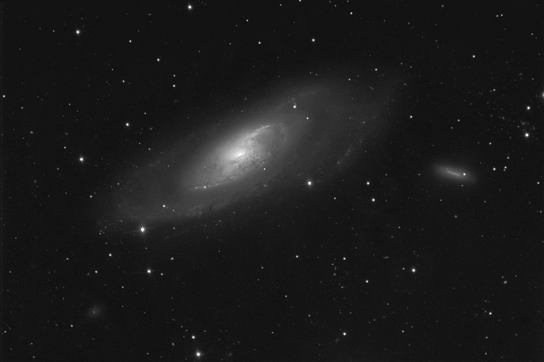

A first-light LLRGB image of M106, taken the first night with a new 12.5" RCOS Ritchey-Chretien and Paramount ME.

<strong>Location:</strong> The Ballauer Observatory near Azle, Texas

<strong>Date:</strong> February 13, 2005

<strong>Transparency:</strong> 4.5 mag zenithal

<strong>Seeing:</strong> 8/10, 1.4" FWHM

<strong>Temperature:</strong> 45 degrees F, camera cooled to -30 degrees C

<strong>Scope/Mount:</strong> 12.5" RCOS RC with field flattener and Paramount ME mount

<strong>Camera:</strong> SBIG STL-6303E, self-guided

<strong>Filters:</strong> Standard SBIG, clear filter used for luminance

<strong>Exposure Info:</strong> LLRGB image, 160:30:30:40 minutes - 10 minute subexposures L unbinned and 5 minute subexposures RGB binned 2x2

<strong>Processing:</strong> Dark frame calibration, flat fields, registration, and Sigma Combine in MaxIm DL 4. Digital Development and RGB combine in MaxIm DL 4. Final LRGB and LLRGB combining, deblooming, gradient removal, color balance, curves, levels, selective sharpening/blurring/despeckle in Photoshop CS.

<strong>Extra Notes:</strong> This is a first-light, first-night image with the new 12.5" RCOS Ritchey-Chretien scope and Paramount ME. The scope was slightly out of calibration and demonstrated some astigmatism despite the use of the field flattener. Of course, this will soon be corrected.

<h2>About this Object</h2>

Some galaxies are quite small when pictured. This is not one of them. M106 in Canes Venatici is one of the larger galaxies in the sky from our perspective. But it doesn't garner much notice because it takes a powerful scope or long exposure photographs to show the entire, faint outer halo. Partnered with M106 in this image is NGC 4248 at right and NGC 4258 at lower-left. Several other faint galaxies are shown scattered throughout the field.

M106 is an underrated Messier galaxy among visual observers but one of the most spectacular to photograph!

<em>M106 in grayscale, used for luminance in the image above</em>

🤖 AI-drafted &middot; unverified

<dl class="ke-ai-stub-facts">
<dt>What it is</dt>
<dd>M106 is an intermediate spiral galaxy with an active (Seyfert II) nucleus.</dd>
<dt>Constellation</dt>
<dd>Canes Venatici</dd>
<dt>Distance</dt>
<dd>~23.5 million light-years</dd>
<dt>Apparent magnitude</dt>
<dd>8.4</dd>
<dt>Angular size</dt>
<dd>~18.6 &times; 7.2 arcminutes</dd>
<dt>Coordinates</dt>
<dd>RA 12h 18m 58s, Dec +47&deg; 18&prime;</dd>
</dl>

This summary was generated by an AI assistant from general astronomical references, not from Jay's own notes on this specific image. Treat every detail above as a starting point for research, not settled fact.

Verify further: <a href="https://en.wikipedia.org/wiki/Messier_106">Wikipedia</a> &middot; <a href="http://www.messier.seds.org/m/m106.html">SEDS Messier Database</a>

