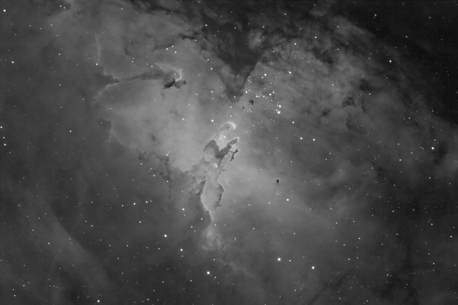

M16, the Eagle Nebula, in HaRGB &mdash; home of the famous Hubble "Pillars of Creation."

<strong>Location:</strong> Ballauer Observatory near Azle, Texas (Ha) and Comanche Springs Astronomy Campus near Crowell, Texas (RGB)

<strong>Date:</strong> June 28, 2005 (Ha) and September 6, 2005 (RGB)

<strong>Seeing:</strong> 9/10

<strong>Transparency:</strong> 4/10

<strong>Temperature:</strong> 72 degrees F

<strong>Scope/Mount:</strong> 12.5" RCOS RC and Paramount ME

<strong>Camera:</strong> SBIG STL-6303e astro CCD camera (Ha) and SBIG STL-11000m astro CCD camera (RGB)

<strong>Filter:</strong> Custom Scientific 4.5nm Hydrogen-alpha filter

<strong>Exposure Info:</strong> HaRGB image - 60:40:30:40 minutes (20 minute subexposures for Ha and 5 minute subexposures RGB, all unbinned)

<strong>Processing Information:</strong> Calibration, registration, and DDP in MaxIm DL 4. Levels/curves, sharpening, and noise removal in Photoshop CS.

<strong>Exposure Notes:</strong> H-alpha information is from previous data. Ha blended into red channel at 50% and reused as luminance at 50%.

<h2>About this Object</h2>

The Eagle Nebula, M16, inspires us like perhaps no other object in the sky. Perhaps it's because of the beautiful representation of its namesake, the Eagle. But more than that, it's a spectacular representation of creation in real-time. The hot emission nebula is the birthplace of many hot, new stars. And it's this aspect of M16 that is captured in the famous Hubble shot entitled "Pillars of Creation."

Visually speaking, M16 is a relatively easy object to see in dark skies. In fact, it will appear as a bright patch to the naked eye amidst the surrounding summer Milky Way. However, the pillars themselves are a little more difficult to see. Regardless, it is in one of the heaven's most exciting regions of the sky, and this image merely hints as to its true grandeur!

<em>M16 in Hydrogen-Alpha light, used for luminance in the image above</em>

🤖 AI-drafted &middot; unverified

<dl class="ke-ai-stub-facts">
<dt>What it is</dt>
<dd>M16, the Eagle Nebula, is a young open cluster embedded in a large emission nebula. It contains the famous "Pillars of Creation," towering columns of gas and dust made iconic by the Hubble Space Telescope.</dd>
<dt>Constellation</dt>
<dd>Serpens</dd>
<dt>Distance</dt>
<dd>~7,000 light-years</dd>
<dt>Apparent magnitude</dt>
<dd>6.0</dd>
<dt>Angular size</dt>
<dd>~70 &times; 50 arcminutes</dd>
<dt>Coordinates</dt>
<dd>RA 18h 18m 48s, Dec -13&deg; 49&prime;</dd>
</dl>

This summary was generated by an AI assistant from general astronomical references, not from Jay's own notes on this specific image. Treat every detail above as a starting point for research, not settled fact.

Verify further: <a href="https://en.wikipedia.org/wiki/Eagle_Nebula">Wikipedia</a> &middot; <a href="http://www.messier.seds.org/m/m016.html">SEDS Messier Database</a>

