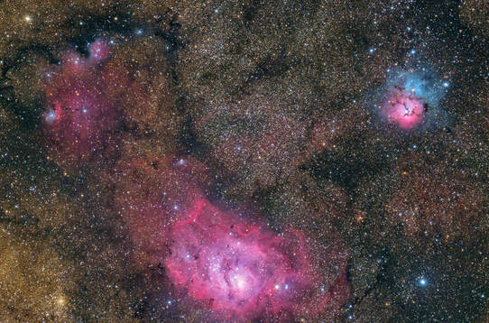

The Trifid Nebula is a part of one of the most photographed regions of the night sky. This area, known as the Lagoon Nebula region, is named after the large M8 nebula, the "Lagoon," in the bottom of this image. Trying to match the image scale of M20 here with the luminance data is typically a big challenge, and certainly here it was as well. Even so, once I scaled a cropped area of this image and pasted it onto the luminance in Photoshop, I was able to make stars look not too objectionable. The colors of the nebula itself seem quite good.

<strong>Location:</strong> Taken remotely from Grapevine, Texas, except for the color which was taken on-site

<strong>Observatory:</strong> The Conley Observatory, Comanche Springs Astronomy Campus (3RF) near Crowell, Texas

<strong>Date:</strong> August 2019 (clear &amp; h-alpha luminance); June 2018 (RGB)

<strong>Scopes:</strong> 12.5" RCOS Ritchey-Chretien (Lum/Ha); Takahashi FSQ-85ED (RGB)

<strong>Mount:</strong> Software Bisque Paramount ME (Lum/Ha); Takahashi NJP Temma 2 (RGB)

<strong>Cameras:</strong> FLI Proline PL-16803 astronomy camera (Lum/Ha); Nikon D810A (RGB)

<strong>Exposure Info:</strong> L (R+Ha)GB multi-scaled image. Best frames from clear luminance images taken with the PL-16803 unbinned. 160 minutes of data used (10 minute subs). 40 minutes (10 minute subs) of hydrogen-alpha data also using the PL-16803 unbinned. 50 minutes of color information (2 minute subs) taken from a previous exposure with the Nikon D810A.

<strong>Total Exposure Time:</strong> 4 hours and 10 minutes

<strong>Processing of Luminance and H-Alpha Frames:</strong> Calibration, star alignment, and integration of selected clear-filtered frames done within PixInsight. 16 of 30 images used. Each frame received Multiscale Linear Transform, Dynamic Crop, Histogram Transform, and HDR Transform in PixInsight. Noise reduction (various techniques) and local contrast enhancement (in select areas) performed in Photoshop CC (using ProDigital Actions). 40 minutes of H-alpha data calibrated, registered, stacked and stretched in PixInsight.

<strong>Processing of Color Frames:</strong> Color taken from a previous widefield image of the Lagoon Nebula region shown above. This image is only 50 minutes (2 minute subs) taken with the Nikon D810A.

<strong>Processing of LLRGB:</strong> Everything brought into Photoshop CC and aligned. Color frames were blurred, saturated, and cleaned of noise (a variety of techniques). Stars were reduced in size using multiple iterations of "Make Stars Smaller" action (using ProDigital Actions), as well as the Minimum filter in Photoshop on specific color channels. H-alpha data was masked onto the bright emission area only, very judiciously, into the red channel using Photoshop CC. Clear luminance was blended with the RGB data using "luminosity" blending mode.

<h2>About this Image</h2>

One of my favorite things about the dark skies at Comanche Springs is the fact that objects like this can be seen with the naked eye. It's so easy to go from object to object in the Milky Way, jumping up from M6 and M7 within the tail of the Scorpion (Scorpius), through the center of the Milky Way galaxy in Sagittarius, where M8 and M20 reside, and all the way to the north, where the Milky Way runs into the horizon near Cepheus.

Messier 20, known as the "Trifid" Nebula as described by Herschel two centuries ago, is never given enough credit of its own for being the night sky splendor that it is. It seems that it's always upstaged by its bigger neighbor, the Lagoon Nebula, M8. Even so, it's hard to ignore the trifurcated emission nebula, not so much because of the glowing hydrogen gases that shine red in the bottom of the featured image, but rather because of the extraordinary blue reflection nebula that glows around the entire nebula.

Reflection nebula doesn't glow on its own like an emission nebula does. Rather, it reflects back the starlight of what is typically hot, young, blue stars in the area. And young this nebula is, perhaps 300,000 years old. This seems to make sense, considering that the stars that typically shine off all that Milky Way dust are very young themselves.

Speaking of trifurcation, the three lobes of the red emission source is demarcated by a dark nebula (Barnard 85) that blocks much of the emission behind it. This feature is quite striking through a modest telescope. Shining at a surface magnitude of 6.5, the object itself is even visible to the naked eye if you look close enough.

M20 isn't too far away, about 5,200 light years, and its size is nearly 40 light years across. Along with the Lagoon and the interesting area seen in the wide-field image above, this area is one of the most popular targets for budding astroimagers everywhere. But really, if you haven't seen these nebula through a telescope in dark skies, then you are really missing out on an opportunity to see deep space objects as magnificent as these.

🤖 AI-drafted &middot; unverified

<dl class="ke-ai-stub-facts">
<dt>What it is</dt>
<dd>M20, the Trifid Nebula, is a combination emission, reflection, and dark nebula, divided into three lobes by dark dust lanes (Barnard 85).</dd>
<dt>Constellation</dt>
<dd>Sagittarius</dd>
<dt>Distance</dt>
<dd>~5,200 light-years</dd>
<dt>Apparent magnitude</dt>
<dd>6.3&ndash;6.5</dd>
<dt>Angular size</dt>
<dd>~28 arcminutes (~40 light-years across)</dd>
<dt>Coordinates</dt>
<dd>RA 18h 02m 23s, Dec -23&deg; 01&prime; 48&Prime;</dd>
</dl>

This summary was generated by an AI assistant from general astronomical references, not from Jay's own notes on this specific image. Treat every detail above as a starting point for research, not settled fact.

Verify further: <a href="https://en.wikipedia.org/wiki/Trifid_Nebula">Wikipedia</a> &middot; <a href="http://www.messier.seds.org/m/m020.html">SEDS Messier Database</a>

