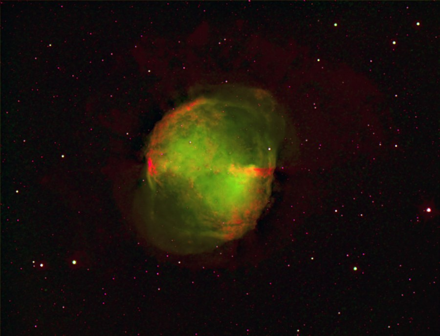

M27, the Dumbbell Nebula, in "Hubble" colors &mdash; Red = SII, Green = Ha, Blue = OIII.

<strong>Location:</strong> Ballauer Observatory near Azle, Texas

<strong>Date:</strong> June 24th and 25th, 2005

<strong>Seeing:</strong> 9/10

<strong>Transparency:</strong> 2/10 (shot near full moon phase)

<strong>Temperature:</strong> 69 to 72 degrees F (camera at -15c)

<strong>Scope/Mount:</strong> 12.5" RCOS RC and Paramount ME

<strong>Camera:</strong> SBIG STL-6303e astro CCD camera

<strong>Filters:</strong> Custom Scientific 4.5nm Ha, OIII, and SII spectral line filters

<strong>Exposure Info:</strong> Mapped color image - SII/Ha/OIII - 120:300:80 minutes (20 minute subexposures unbinned)

<strong>Processing Information:</strong> Calibration, registration, hot/cold pixel removal, and DDP in MaxIm DL 4. LR Deconvolution on Ha channel in CCDSharp. Color mapping, cropping, color balance, levels/curves, sharpening, and noise removal in Photoshop CS.

<strong>Exposure Notes:</strong> This represents my first "mapped color" image taken with narrowband, spectral line filters. The SII data is mapped to the red channel, Ha to green, and OIII to blue. Seeing was exceptional, in the 1" arc second neighborhood, but data was taken near a full moon.

<h2>About this Image</h2>

No, this isn't a Hubble shot. But this image was acquired and processed just like the gorgeous Hubble telescope images that we've come to love. To accomplish this, the image was taken through specialized, narrowband emission line filters. This information was then "mapped" to the traditional red, green, and blue channels of an RGB image. The green portions of the image represent Hydrogen-alpha ionized gases. Most notably, these gases extend well outside the Dumbbell itself to form a halo around the outskirts, something that requires very long exposure times to capture in an amateur image. The color blue represents doubly ionized Oxygen gases, and as you'd expect from a planetary nebula, the heaviest concentration of these gases are around the core area itself. Finally, red represents singly ionized Sulfur gases. While the stars glow heavily in the sulfur wavelength, there is only a light concentration of it in the nebula, mostly throughout the brighter portions.

Such images, while obviously beautiful, have a real scientific purpose. Because the colors are mapped specifically to certain gases, it's easy to understand the concentrations of ionizations and how (where) they interact with each other.

<em>M27 in "VLT" colors &mdash; Red = Ha, Green = OIII, Blue = SII (with a hint of Ha to simulate H-beta)</em>

<em>This is an attempt to take the same spectral line data and use the same techniques as the well-known European Southern Observatory image of M27, taken in 1998 on the newly constructed 8.2 meter VLT scope -- albeit with far less aperture!</em>

🤖 AI-drafted &middot; unverified

<dl class="ke-ai-stub-facts">
<dt>What it is</dt>
<dd>M27, the Dumbbell Nebula, was the first planetary nebula ever discovered, by Charles Messier in 1764, and is one of the brightest planetary nebulae in the sky.</dd>
<dt>Constellation</dt>
<dd>Vulpecula</dd>
<dt>Distance</dt>
<dd>~1,360 light-years</dd>
<dt>Apparent magnitude</dt>
<dd>7.5</dd>
<dt>Angular size</dt>
<dd>~8 &times; 5.7 arcminutes</dd>
<dt>Coordinates</dt>
<dd>RA 19h 59m 36s, Dec +22&deg; 43&prime; 16&Prime;</dd>
</dl>

This summary was generated by an AI assistant from general astronomical references, not from Jay's own notes on this specific image. Treat every detail above as a starting point for research, not settled fact.

Verify further: <a href="https://en.wikipedia.org/wiki/Dumbbell_Nebula">Wikipedia</a> &middot; <a href="http://www.messier.seds.org/m/m027.html">SEDS Messier Database</a>

