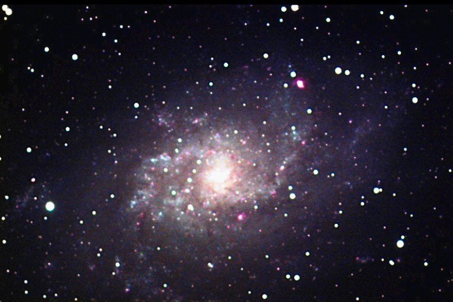

An earlier LLRGB attempt at [M33, the Pinwheel Galaxy](/gallery/m33-pinwheel-galaxy/), imaged over three nights at Comanche Springs. A [second, even earlier attempt](#previous-attempt) from 2003 is further down this page.

<strong>Location:</strong> Comanche Springs, 3RF dark sky site near Crowell, Texas

<strong>Date:</strong> August 1-3, 2005

<strong>Seeing:</strong> 9/10

<strong>Transparency:</strong> 8/10 (mag. 7 skies)

<strong>Temperature:</strong> 72 degrees F (-15 degrees C on camera)

<strong>Scope/Mount:</strong> 12.5" RCOS RC @ f/9 and Paramount ME

<strong>Camera:</strong> SBIG STL-11000M astro CCD camera

<strong>Exposure Info:</strong> LLRGB image; 150:40:30:40 RGB (10 minute subexposures, all unbinned)

<strong>Processing Information:</strong> Calibration (darks/flats), registration, gradient removal, and RGB channel combine in MaxIm DL 4 (average combine). LRGB and LLRGB combine, color balance, levels/curves, high pass sharpening, and noise removal (Noel Carboni's DLR Tools) in Photoshop CS.

<strong>Exposure Notes:</strong> This one was tough to put together because of the many brighter regions within the galaxy itself. Could have used a little more luminance, but this will do. Seeing was exceptional during this stretch. Imaged over three nights in the late morning hours.

<h2>About this Object</h2>

The Andromeda Galaxy (M31) gets tons of attention, as it should. It's huge, bright and easily seen in even light polluted skies. But just on the other side of Mirach on a line extending from M31 is the Pinwheel Galaxy in Triangulum, known as M33. This is a magnificent object in its own right and, in my opinion, is a better telescopic sight than M31, as are several face-on spirals. Under dark skies, the spiral arms are evident in many scopes. In fact, little do people realize that this is sometimes a naked eye object in those same dark skies. The pinkish areas in the photo are very active star-forming regions, known as hydrogen-alpha regions, and they really stand out in many photographs. This galaxy is quite large as well, a stunning site in a big scope and even in binoculars. Don't neglect this spiral galaxy!

<h3 id="previous-attempt">Previous Attempt</h3>

<strong>Location:</strong> Ballauer Observatory in Azle, Texas 
<strong>Date:</strong> December 26, 2003 
<strong>Seeing:</strong> 9/10 (1.3 FWHM) 
<strong>Transparency:</strong> 5/10 
<strong>Equipment:</strong> Tak FSQ-106 on Celestron CGE mount 
<strong>Camera:</strong> SBIG ST-7e with CFW8a color filter wheel, unguided 
<strong>Exposure Info:</strong> LRGB image (L = 5 x 10 min &amp; 30 x 1 minutes, R = 3 x 10 minutes, G = 3 x 10 minutes, B = 2 x 10 minutes) binned 1x1. 
<strong>Processing Info:</strong> Color channels and Luminance with darks, alignment and Sigma combine in MaxIm 3.0. RGB image combined in MaxIm. Luminance and RGB aligned and combined in Photoshop 7. Levels, Curves, and Unsharp mask in Photoshop 7 on the Luminance channel. Levels, Curves, and color balance performed on the RGB channel in Photoshop. Image cropped and resized for web.

<em>Note: If you image this object, you might try to do a better job of focusing than I did!</em>

🤖 AI-drafted &middot; unverified

<dl class="ke-ai-stub-facts">
<dt>What it is</dt>
<dd>M33, often called the Pinwheel Galaxy (or the Triangulum Galaxy), is a face-on spiral and the third-largest member of the Local Group.</dd>
<dt>Constellation</dt>
<dd>Triangulum</dd>
<dt>Distance</dt>
<dd>~2.73 million light-years</dd>
<dt>Apparent magnitude</dt>
<dd>5.7</dd>
<dt>Angular size</dt>
<dd>~70.8 &times; 41.7 arcminutes</dd>
<dt>Coordinates</dt>
<dd>RA 01h 33m 50s, Dec +30&deg; 39&prime;</dd>
</dl>

This summary was generated by an AI assistant from general astronomical references, not from Jay's own notes on this specific image. Treat every detail above as a starting point for research, not settled fact.

Verify further: <a href="https://en.wikipedia.org/wiki/Triangulum_Galaxy">Wikipedia</a> &middot; <a href="http://www.messier.seds.org/m/m033.html">SEDS Messier Database</a>

