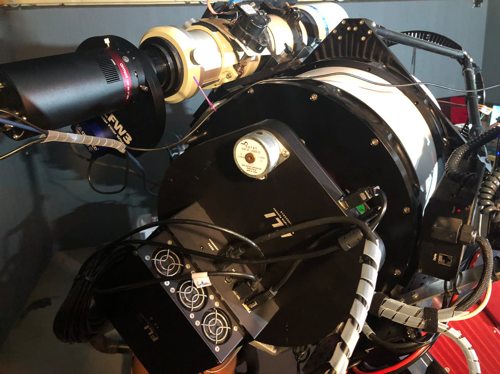
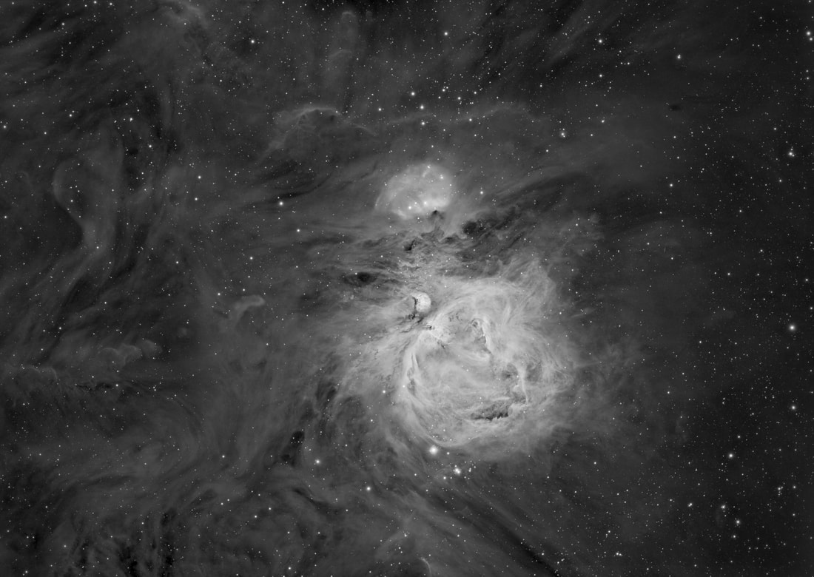

Location: Taken remotely from Grapevine, Texas at the Conley Observatory, Comanche Springs Astronomy Campus (3RF) near Crowell, Texas. Date: December 3 to 7, 2019 (h-alpha); December 17 to 19, 2019 (Ha and LRGB data).

Cameras: QHY600 CMOS astronomy camera with QHY3 CFW (4.5nm Custom Scientific H-alpha filter; LRGB Custom Scientific filters; all filters 50mm unmounted).

Exposure Info (main): Ha + L (R + Ha) GB image. 660 min H-alpha (10 minute subs unbinned); 215 min Luminance (2 and 5 minute subs); 46 min Red, 40 min Green, and 36 min Blue (all color 2 minute subs). Exposure Info (core): Ha only; 50 x 15 second subs.

Processing of H-alpha: This data is uncalibrated. Star alignment and drizzle integration in PixInsight 1.8.7 for both background and core exposures. Multiscale Linear Transform, Dynamic Crop, Histogram Transform, and HDR Transform in PixInsight. Noise reduction (various techniques) and local contrast enhancement (in select areas), and "AstroFlat" performed in Photoshop CC (using ProDigital Actions).

Processing of LRGB: This data is uncalibrated. Star alignment, drizzle integration, Multiscale Linear Transform, Dynamic Crop, Histogram Transform, and HDR Transform in PixInsight 1.8.7. Merged in PixInsight using LRGB Combination process. Brought into Photoshop CC and "AstroFlat" (ProDigital Actions) was used. Saturation boosted and then brought back into PixInsight for SCNR (green reduction).

Merging of all data: H-alpha and Luminance data combined in Photoshop CC using "lighten" blending mode. Color RGB was split into channels in PS CC and H-alpha was merged with red channel data using the same method. RGB and Ha+R data RGB recombined and Ha+R layer combined using "luminosity" blending mode. Multiple iterations performed, adding saturation and blurring/noise reduction to color data each time. Ha+L data received sharpening (high-pass) and "Local Contrast Enhancement" action (ProDigital Actions). Final cropping, core mask, blue halo reduction, and localized color balancing performed.

So, I installed a new camera in the Conley Observatory at CSAC this month. It promises to signify the end of all CCD astronomy cameras as we know it.

Why? Because it's the first full-frame (35mm film size) grayscale camera available to astronomers. And because it's a 16-bit back-illuminated CMOS sensor with quantum efficiency of over 90% (sensitivity), with barely any camera read-noise at all when compared with traditional CCDs, it's pretty much the perfect camera. Moreover, because the camera accomplishes this with really small 3.75 micron pixels (60 megapixels in total), it matches very well with smaller, high quality refractors like the FSQ-106.

Here is the completed "first light" image with the camera, an HaLRGB image (4 arc degrees wide) of the Orion Nebula region (M42/M43). Remarkably, only a small amount of the M42 core was blown out in the subexposure (massive full-well depth), so I had to mask only a small amount of the core with extra data...a small amount of Ha taken separately.

The image is remarkable because it shows the capability of the camera, made more so because much of the data was collected over the past few nights with a bright moon in the sky. Likewise, because I was not able to test the camera when I installed it due to bad weather, the camera is severely tilted, varying as much as 3" FWHM across the field. Back focal distance is not precise (I just used the adapters on-hand) and the blue filter data produced extreme star haloes on most stars in the field.

For those evaluating the performance of the camera (my apologies to the lay person who just likes to see pretty pictures), you should know that this image had slight vignetting in the corners given this setup and was taken with ZERO calibration frames...no darks, biases, or flat fields. The subexposures were taken at -12C, dithered. All pre-processing done in PixInsight 1.8.7, drizzle stacked. The slight vignetting was controlled in processing with the excellent ProDigital "AstroFlat" plugin in Photoshop CC.

For all the talk astronomers like to make about specifics of camera performance, quit being so picky! This camera is better than any camera that preceded it, including that FLI PL-16803 also in that picture. In fact, you can purchase TWO QHY600 cameras for the camera price as that FLI CCD setup. And this data was taken FAR FROM being optimally setup. Despite these errors, it just goes to show that good images can still be taken without obsessing about all the nuts and bolts.

It's truly a remarkable time to be an astrophotographer!

390 minutes of the first round of H-alpha data taken earlier in the month. More was added to produce the color image atop the page.

Taken remotely from Grapevine, Texas at the Conley Observatory, Comanche Springs Astronomy Campus (3RF) near Crowell, Texas. December 3–7, 2019 (h-alpha); December 17–19, 2019 (Ha and LRGB data).

🤖 AI-drafted &middot; unverified

<dl class="ke-ai-stub-facts">
<dt>What it is</dt>
<dd>M42, the Orion Nebula, is a diffuse emission and reflection nebula and one of the closest large star-forming regions to Earth. This image also captures M43, a smaller detached portion of the same star-forming complex.</dd>
<dt>Constellation</dt>
<dd>Orion</dd>
<dt>Distance</dt>
<dd>~1,344 light-years</dd>
<dt>Apparent magnitude</dt>
<dd>~4.0</dd>
<dt>Angular size</dt>
<dd>~65 &times; 60 arcminutes (M42); imaged field of view was ~4 degrees wide)</dd>
<dt>Coordinates</dt>
<dd>RA 05h 35m 17s, Dec -05&deg; 23&prime; 28&Prime;</dd>
</dl>

This summary was generated by an AI assistant from general astronomical references, not from Jay's own notes on this specific image. Treat every detail above as a starting point for research, not settled fact.

Verify further: <a href="https://en.wikipedia.org/wiki/Orion_Nebula">Wikipedia</a> &middot; <a href="http://www.messier.seds.org/m/m042.html">SEDS Messier Database</a>

