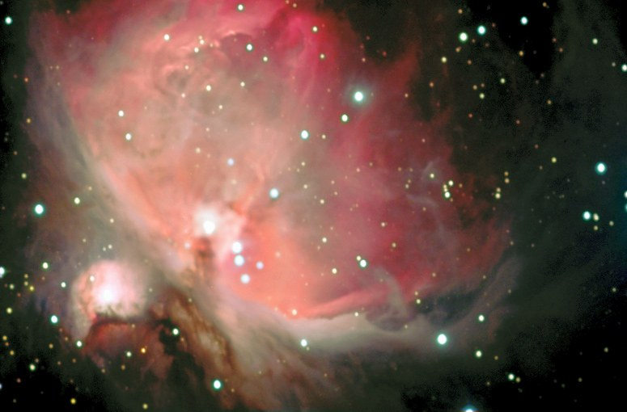
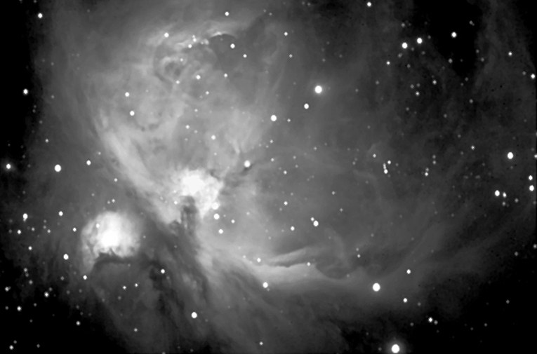

The Great Orion Nebula (with M43), in RGB.

<strong>Location:</strong> Ballauer Observatory in Azle, Texas

<strong>Date:</strong> February 15, 2004

<strong>Seeing:</strong> 8/10 (1.5 FWHM)

<strong>Transparency:</strong> 4/10

<strong>Equipment:</strong> Tak FSQ-106 on Celestron CGE mount

<strong>Camera:</strong> SBIG ST-10xme with CFW8a color filter wheel, self-guided

<strong>Exposure Info:</strong> RGB image - 20:20:20 minutes (5 minute sub-exposures)

<strong>Processing Info:</strong> Darks, flats, deblooming, alignment, and Sigma combine in MaxIm 3.0. Digital Development in Images Plus. RGB aligned and combined in MaxIm. Levels, Curves, Color Balance, cropping and Unsharp mask in Photoshop CS. Final smoothing in Pleiades' SGBNR. Separate mask from shorter exposure (4 x 3 sec) used to replace the burned-out core region. Masked layers re-leveled and balance to match in Photoshop CS.

<strong>More Information:</strong> Special thanks to Dr. Fred Koch for the loan of the ST-10xme camera.

<h2>About this Object</h2>

Arguably the brightest and most magnificent object outside of our own solar system, the Orion Nebula is easily visible as a naked eye object, even in light polluted skies. Shown here with the "Running Man" Nebula, NGC 1977, the views through a small telescope or binoculars are outstanding, and it just gets better in larger aperture scopes. In dark skies, some people can see color in the nebulae, usually in a subtle shade of blue or green. The bright center portion of the nebulae features four stars of similar magnitude known as the "trapezium." It's the heart of a massive complex of young stars being formed from the dust which gives the nebula its shape. It is truly a stellar nursery.

<h3>Previous Exposure</h3>

<strong>Location:</strong> Ballauer Observatory in Azle, Texas 
<strong>Date:</strong> December 26, 2003 
<strong>Seeing:</strong> 9/10 (1.3 FWHM) 
<strong>Transparency:</strong> 5/10 
<strong>Equipment:</strong> Tak FSQ-106 on Celestron CGE mount 
<strong>Camera:</strong> SBIG ST-7e with CFW8a color filter wheel, guided 
<strong>Exposure Info:</strong> (L+R)RGB - Luminance = 3 x10 minutes binned 1x1 and merged with red channel data; Red = 4 x 5 minutes, Green = 4 x 5 minutes, Blue = 4 x 8 minutes; color channels binned 1x1 
<strong>Processing Info:</strong> Color channels and Luminance+Red with darks, alignment, cropping, Sigma combine and DDP processing in MaxIm 3.0. RGB image combined in MaxIm. Luminance and RGB aligned and combined in Photoshop 7. Levels, Curves, and Unsharp mask in Photoshop 7 on the Luminance channel. Levels, Curves, and color balance performed on the RGB channel in Photoshop. Two separate masks from shorter exposures used to replace the burned-out core region. Masked layers re-leveled and balance to match.

<h3>Previous Exposure</h3>

<strong>Location:</strong> Ballauer Observatory in Azle, Texas 
<strong>Seeing:</strong> 5/10 (2.5 FWHM) 
<strong>Transparency:</strong> 4/10 
<strong>Date and Time:</strong> November 18, 2003 @ 2:00PM 
<strong>Equipment:</strong> SBIG ST-7E, Tak FSQ-106 @ f/5, and Celestron CGE mount 
<strong>Length:</strong> Three 10 minute exposures and one 2 minute exposure, all binned 1x1 
<strong>Processing Information:</strong> Dark frames, gradient removal, registration and Sigma Combine in MaxIm 3.0. Masked and replaced the burned out core of the Trapezium area with the shorter, two minute exposure. Adjusted Contrast and brightness to match surrounding areas. Levels, Curves, Gaussian Blur and Unsharp Mask were then applied in Photoshop 7.

<em>Exposure Notes: First light image with the new Celestron CGE mount.</em>

🤖 AI-drafted &middot; unverified

<dl class="ke-ai-stub-facts">
<dt>What it is</dt>
<dd>M42, the Orion Nebula, is a diffuse emission and reflection nebula and one of the closest large star-forming regions to Earth. It's easily visible to the naked eye as the fuzzy "star" in Orion's sword.</dd>
<dt>Constellation</dt>
<dd>Orion</dd>
<dt>Distance</dt>
<dd>~1,344 light-years</dd>
<dt>Apparent magnitude</dt>
<dd>~4.0</dd>
<dt>Angular size</dt>
<dd>~65 &times; 60 arcminutes</dd>
<dt>Coordinates</dt>
<dd>RA 05h 35m 17s, Dec -05&deg; 23&prime; 28&Prime;</dd>
</dl>

This summary was generated by an AI assistant from general astronomical references, not from Jay's own notes on this specific image. Treat every detail above as a starting point for research, not settled fact.

Verify further: <a href="https://en.wikipedia.org/wiki/Orion_Nebula">Wikipedia</a> &middot; <a href="http://www.messier.seds.org/m/m042.html">SEDS Messier Database</a>

