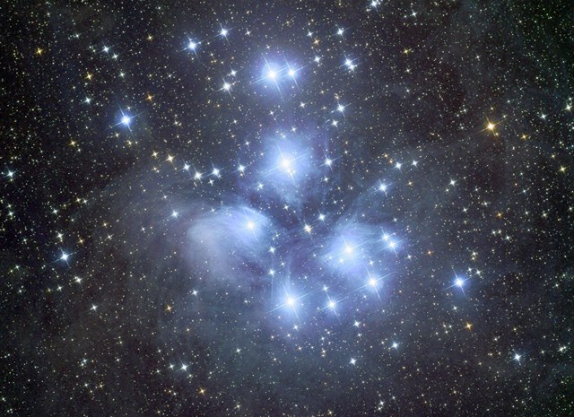
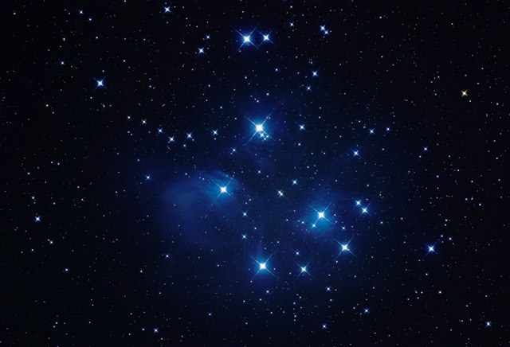

The Pleiades in Taurus, in LRGB -- the first long-exposure deep-sky image acquired remotely via the newly-built ProDome 10 observatory at Comanche Springs Astronomy Campus.

<strong>Observatory:</strong> Prodome 10 &mdash; data acquired via remote from Grapevine, TX

<strong>Location:</strong> Comanche Spring Astronomy Campus (CSAC), Three Rivers Foundation, Crowell, Texas

<strong>Date:</strong> November 22-23, 2009

<strong>Seeing:</strong> 9/10

<strong>Transparency:</strong> 9/10

<strong>Temperature:</strong> 55 degrees F (-25C on camera)

<strong>Equipment:</strong> Takahashi TOA-150 (with Flattener) on a Software Bisque Paramount ME mount

<strong>Camera:</strong> SBIG STL-11000M astro CCD camera

<strong>Exposure Info:</strong> LRGB, 160:60:50:30 minutes (10 minute subexposures, all unbinned)

<strong>Processing Information:</strong> Acquisition in CCDSoft V5. Calibration, Registration, and DDP in CCDStack. LRGB combine, cropping, color balance, levels/curves, sharpening, and noise removal (despeckle and gaussian blur) in Photoshop CS2. Color Blotch Reduction, Deep Space Noise Removal, and Local Contrast Enhancement in Photoshop via Noel Carboni's Astronomy Tools Actions for Photoshop.

<strong>Exposure Notes:</strong> This is an especially important image because it is the first long-exposure, deep sky image acquired remotely via the Prodome 10 Observatory on the CSAC campus near Crowell, Texas. I built the Technical Innovations ProDome observatory for the Three Rivers Foundation beginning 3 1/2 years ago, the robotic/remote phase just now being complete. One final phase for the observatory remains involving an all-sky camera, seeing, and weather sensors; however, it is exciting to capture data over 180 miles away from my home in Grapevine, Texas. Two more larger ProDomes will be nearing operational phases shortly!

<h2>About this Object</h2>

The brightest and most majestic open cluster in all the sky! The Pleiades has been known for centuries and is referenced in ancient documents, especially the Bible, due to its incomparable beauty. Known as the "seven sisters," a reference to the brightest of its stars, the Pleiades can be seen with the naked eye in even the worst of night skies, taking on the shape of a small dipper. In fact, many beginning observers often confuse this object with the Little Dipper itself. The entire cluster covers an area of the sky exceeding 2 degrees, or the equivalent of 4 of our full moons in width. The cluster looks best in smaller aperture scopes where the field of view can put all of the Pleiades in the eyepiece. Simply put, there's not a better small scope object in the heavens!

For an image of M45 with [Comet Machholz](/gallery/m45-comet-machholz/), see that page.

<h3>Previous Attempts</h3>

<strong>Location:</strong> Comanche Springs, 3RF dark sky site near Crowell, Texas 
<strong>Seeing:</strong> 9/10 
<strong>Transparency:</strong> 8/10 
<strong>Temperature:</strong> 35 degrees F 
<strong>Date:</strong> December 11, 2004 
<strong>Scope/Mount:</strong> Tak FSQ-106 @ f/5 and Tak NJP mount 
<strong>Camera:</strong> SBIG STL-11000M astro CCD camera 
<strong>Exposure Info:</strong> LRGB image; 60:60:80 RGB with synthetic luminance (5 minute subexposures all unbinned) 
<strong>Processing Information:</strong> Calibration, Registration, DDP, and RGB channel combine in MaxIm DL 4. LRGB combine, cropping, color balance, levels/curves, sharpening, and noise removal (despeckle and gaussian blur) in Photoshop CS.

<em>Exposure Notes: This was a first light image with the SBIG STL-11000M camera. Conditions were especially good this night. Processing was difficult because I wanted to show the background dust. I largely succeeded, though I should have taken the time for pure luminance. Diffraction spikes were created with a string affixed to the dewshield.</em>

<strong>Location:</strong> Ballauer Observatory in Azle, Texas 
<strong>Seeing:</strong> 7/10 
<strong>Transparency:</strong> 6/10 
<strong>Temperature:</strong> 35 degrees F 
<strong>Date:</strong> January 19, 2004 acquired; November 21, 2004 reprocessed 
<strong>Scope/Mount:</strong> Tak FSQ-106 @ f/5 and Celestron CGE mount 
<strong>Camera:</strong> Canon Digital Rebel 
<strong>Guiding:</strong> SBIG ST-7e on the AP 80/900mm guidescope 
<strong>Exposure Info:</strong> 8 x 5 minute images 
<strong>Processing Information:</strong> All images aligned and combined with a median combine in Images Plus. Photoshop CS was used for dark frame calibration, image cropping, manual gradient removal, saturation increase, levels, curves, sharpening and noise reduction.

<em>Exposure Notes: This is a first light image with the new Canon Digital Rebel. The file was saved as a Large JPEG instead of the RAW file format. Thus, lots of information was lost prior to processing. The dark frame calibration was a poor attempt using a single dark frame rather than a master, multi-image dark frame. Diffraction spikes were created with a string affixed to the dewshield.</em>

🤖 AI-drafted &middot; unverified

<dl class="ke-ai-stub-facts">
<dt>What it is</dt>
<dd>M45, the Pleiades or "Seven Sisters," is a bright, young open star cluster wrapped in wisps of blue reflection nebulosity.</dd>
<dt>Constellation</dt>
<dd>Taurus</dd>
<dt>Distance</dt>
<dd>~444 light-years</dd>
<dt>Apparent magnitude</dt>
<dd>1.5&ndash;1.6</dd>
<dt>Angular size</dt>
<dd>~110 arcminutes</dd>
<dt>Coordinates</dt>
<dd>RA 03h 47m, Dec +24&deg; 07&prime;</dd>
</dl>

This summary was generated by an AI assistant from general astronomical references, not from Jay's own notes on this specific image. Treat every detail above as a starting point for research, not settled fact.

Verify further: <a href="https://en.wikipedia.org/wiki/Pleiades">Wikipedia</a> &middot; <a href="http://www.messier.seds.org/m/m045.html">SEDS Messier Database</a>

