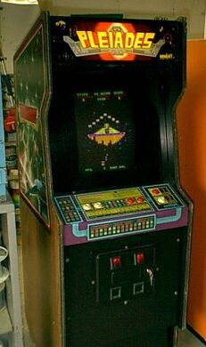
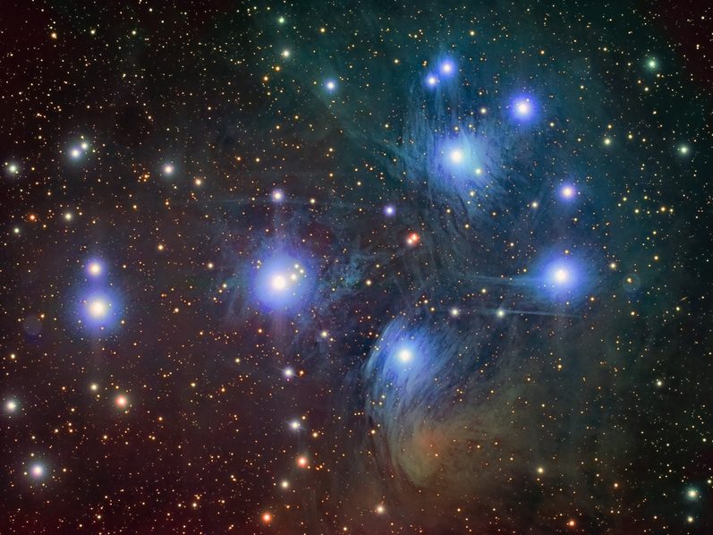

A four-frame mosaic covering Merope, Electra, Alcyone, and Maia, combining fresh luminance data with color data taken from a previous LRGB image of the cluster.

<strong>Observatory:</strong> The Conley Observatory - Data acquired via remote from Grapevine, TX

<strong>Location:</strong> Comanche Spring Astronomy Campus (CSAC), Three Rivers Foundation, Crowell, Texas

<strong>Date:</strong> November 2017 (luminance) &amp; November 2009 (color - see image below)

<strong>Scope/Mount:</strong> 12.5" RCOS Ritchey-Chretien and Paramount ME mount (luminance); Tak TOA-150 (with Flattener) and Paramount ME mount (color)

<strong>Camera:</strong> FLI Proline PL-16803 astro CCD camera (luminance); SBIG STL-11000M astro CCD camera (color)

<strong>Exposure Info:</strong> Luminance data comprises a 4-frame mosaic of 100 minutes (Merope frame), 100 minutes (Electra frame), 160 minutes (Alcyone frame), and 90 minutes (Maia); 10-minute subexposures, all unbinned. Color data taken from previous LRGB image (shown below), 160:60:50:30 minutes; 10 minute subexposures all unbinned.

<strong>Total Exposure Time:</strong> 12.5 hours

<strong>Processing Information (Luminance):</strong> Acquisition in TheSkyX Pro of 4 mosaic frames. Calibration, registration, and integration of all frames in PixInsight 1.8.5. Mosaic "stitching" in PixInsight using Gradient Merge Mosaic process. Multiscale Linear Processing used for noise removal in PixInsight. Histogram Transformation in PixInsight.

<strong>Processing Information (Color):</strong> Acquisition in CCDSoft V5. Calibration, Registration, and DDP in CCDStack. LRGB combine, cropping, color balance, levels/curves, sharpening, and noise removal (despeckle and gaussian blur) in Photoshop CS2. Color Blotch Reduction, Deep Space Noise Removal, and Local Contrast Enhancement in Photoshop via ProDigital Actions for Photoshop.

<strong>Processing Information (LRGB):</strong> Images aligned in PixInsight, saved as 16-bit TIFF files, and brought into Adobe Photoshop CC for further processing. "Make Stars Smaller" action (ProDigital) to help with star matching between Lum and color. AstroFlat Pro (ProDigital) used to reduce glare in luminance, revealing more dust. High-pass filtering used for sharpening and various noise reduction techniques used for cleaning up the background. Vibrance/Saturation, cropped, and rotated in Photoshop for more visual impact.

Taken remotely from Grapevine, Texas at the Conley Observatory, Comanche Springs Astronomy Campus (3RF) near Crowell, Texas. November 2017 (luminance) &amp; November 2009 (color).

<h2>Fun Fact...</h2>

My first exposure to "Pleiades" wasn't today's featured star cluster. As a child of the 80s who spent a large part of his childhood in an arcade, "Pleiades" originally had a completely different meaning for me.

Anybody else remember this game? Made in 1981 by Tecmo, I've lined up a lot of quarters on this machine!

<h2>About this Image</h2>

Known from the earliest of antiquity and mentioned three times in the Bible, the "Pleiades" or the "Seven Sisters," is inarguably the night sky's most beautiful star cluster. Illuminating the autumn sky, it seems to signify a cool, refreshing end to our hot Texas summer!

But cool they are not. Among some of the hottest stars in the sky, these blue beauties shine brightly from their position approximately 440 light years away. Of the nine brightest stars in the cluster, all B-class in spectrum, their grouping is special for a couple of reasons.

First, not many clusters like this are surrounded by so much dust. In the case of M45 (the Messier catalog designation for the cluster), this dust is easily seen because it is reflecting back all that blue starlight into our eyes. The swirls and streaks of dust seem astonishing to us, as if they've always been a part of the Pleiades landscape. However, most astronomers believe that the dust is just part of the interstellar medium and that the cluster is just passing through. I am not sure I agree with that assessment, as the dust appears captured up within the Pleiades neighborhood without hope of escape. Even so, thankfully for us, we get the chance to see their meeting!

Second, B-Class stars are relatively rare in the night sky, comprising less than 1% of stars in the main-sequence. They typically only occur in clusters, known as "OB Associations," having been birthed not too long ago (around 100 million years) within a giant molecular cloud of abundant, hot gases. So much in fact that the stars formed with such gravitational mass that their hydrogen is burning away at a very fast rate, enough to cause these stars to have relatively short life-cycles (perhaps 500 million years) as compared to something like our own Sun (which is already around 5 billion years old). Therefore, it should be no surprise that THIS cluster would be so striking...its stars' energetic natures (their fast fusion rate) make them very luminous from an absolute standpoint. Coupled with their relatively close distance to us, their relative magnitudes are rather bright from our perspective. Of the nine brightest stars, they range from magnitude 2.9 to 5.6, making them a good gauge for astronomers to measure the transparency/darkness of their own skies (see illustration below).

<button class="ke-star-hover-dot" type="button" style="left:39.22%; top:52.88%;">Alcyone &mdash; mag 2.9</button>
<button class="ke-star-hover-dot" type="button" style="left:13.81%; top:57.71%;">Atlas &mdash; mag 3.6</button>
<button class="ke-star-hover-dot" type="button" style="left:78.76%; top:51.55%;">Electra &mdash; mag 3.7</button>
<button class="ke-star-hover-dot" type="button" style="left:64.14%; top:29.28%;">Maia &mdash; mag 3.9</button>
<button class="ke-star-hover-dot" type="button" style="left:56.89%; top:66.52%;">Merope &mdash; mag 4.2</button>
<button class="ke-star-hover-dot" type="button" style="left:73.41%; top:20.30%;">Taygeta &mdash; mag 4.3</button>
<button class="ke-star-hover-dot" type="button" style="left:13.41%; top:50.33%;">Pleione &mdash; mag 5.1</button>
<button class="ke-star-hover-dot" type="button" style="left:79.69%; top:35.93%;">Celaeno &mdash; mag 5.5</button>
<button class="ke-star-hover-dot" type="button" style="left:62.77%; top:12.76%;">Asterope 1 &mdash; mag 5.8</button>
<button class="ke-star-hover-dot" type="button" style="left:60.68%; top:15.15%;">Asterope 2 &mdash; mag 6.4</button>

Positions plate-solved via astrometry.net; star identities and magnitudes cross-matched against the SIMBAD catalog. Hover (or tap, on touch devices) a marker to see that star's name and apparent magnitude.

So who are the "Seven Sisters"? In ancient Greek myth, the sisters were the daughters of Atlas and Pleione, shown in the illustration as the left-most named stars. Therefore, their off-spring, the "seven sisters" are those on the right (and my image only shows the sisters themselves). Note that Asterope is actually two stars, a fact that would have been hidden from the ancient Greek observers, as they would appear as a single star to the naked eye due to how close together the relatively faint stars actually are.

(Interesting fact: Most of the stars you see in the night sky are actually TWO stars, known as binaries. They usually consist of one large and one small star, the latter of which, typically, cannot be easily detected because of how close they are to each other.)

So where are the stars going? As they were birthed together, they are moving in mostly the same direction, as sisters like to do, toward the "feet" of Orion from our sky perspective. Orion, "the hunter," in Greek mythos, is said to be protecting the sisters from Taurus, "the Bull." So perhaps it's smart of the girls to be headed in that direction.

But I wonder if they realize that the bull is actually standing between them and their rescuer in the night sky?

🤖 AI-drafted &middot; unverified

<dl class="ke-ai-stub-facts">
<dt>What it is</dt>
<dd>M45, the Pleiades or "Seven Sisters," is a bright, young open star cluster wrapped in wisps of blue reflection nebulosity.</dd>
<dt>Constellation</dt>
<dd>Taurus</dd>
<dt>Distance</dt>
<dd>~444 light-years</dd>
<dt>Apparent magnitude</dt>
<dd>1.6 (cluster); 2.9&ndash;5.6 (nine brightest stars)</dd>
<dt>Angular size</dt>
<dd>~110 arcminutes</dd>
<dt>Coordinates</dt>
<dd>RA 03h 47m, Dec +24&deg; 07&prime;</dd>
</dl>

This summary was generated by an AI assistant from general astronomical references, not from Jay's own notes on this specific image. Treat every detail above as a starting point for research, not settled fact.

Verify further: <a href="https://en.wikipedia.org/wiki/Pleiades">Wikipedia</a> &middot; <a href="http://www.messier.seds.org/m/m045.html">SEDS Messier Database</a>

