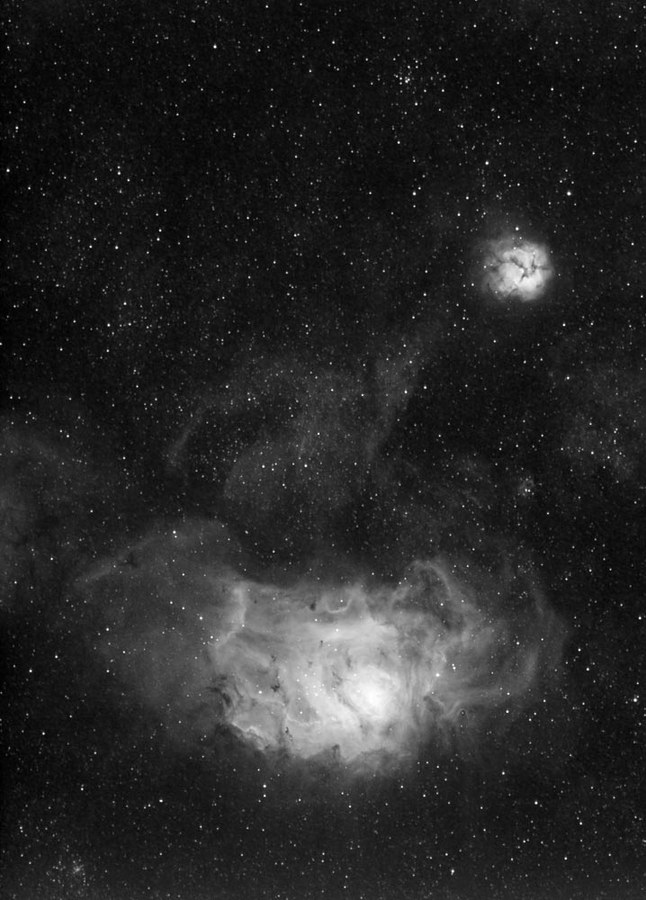
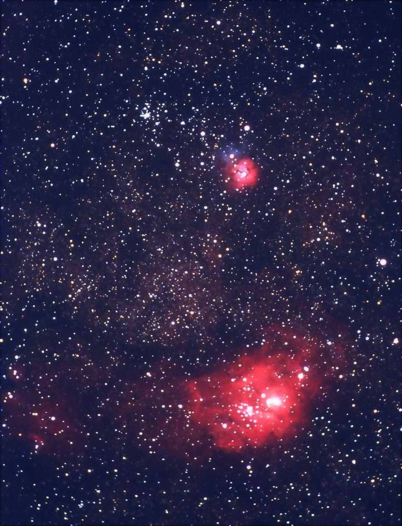

M8 and M20, the Lagoon and Trifid Nebulae in Sagittarius, in (Ha+R)GB.

<strong>Location:</strong> Texas Star Party 2004 near Fort Davis, Texas (Ha Luminance); FWAS dark sky site near Springtown, Texas (RGB)

<strong>Seeing:</strong> 5/10 (Luminance), 5/10 (RGB)

<strong>Transparency:</strong> 8/10 (Luminance), 5/10 (RGB)

<strong>Date and Time:</strong> May 21, 2003 (Luminance), September 11, 2004 (RGB)

<strong>Equipment:</strong> Tak FSQ-106 @ f/5 with Tak NJP mount

<strong>Camera:</strong> SBIG STL-6303E NABG with integrated filter wheel

<strong>Filter:</strong> Custom Scientific 5 nm H-alpha filter

<strong>Exposure Info:</strong> (Ha+R)GB. Ha luminance - 35 x 1 minute exposures (best of 55). RGB - 40:35:30 minutes (5 minute sub-exposures unbinned).

<strong>Processing Information:</strong> Darks, flats, deblooming, alignment, stacking, RGB combine, and digital development in MaxIm DL 4. Curves, Levels, selective Unsharp Mask, and Color balance in Photoshop CS.

<strong>Exposure Notes:</strong> I took the short Ha luminance shown below and blended it into the Red channel 50%. I chose this method because the length of the luminance wasn't long enough to stand on its own, which would have brought too much noise into the image.

Special thanks to the Three Rivers Foundation (3RF) for the use of some of the equipment used to create this image.

<h2>About this Object</h2>

Messier 8 is a diffuse nebula (NGC 6523) and star cluster (NGC 6530). It is one of the few nebulae easily visible to the naked eye, shining bright at 4.6 magnitude and spreading out more than 1.5 degrees across the sky (the moon is 0.5 degrees). The "Lagoon" gets its name from the dark nebular band that separates the nebula into two lobes. Messier 20, known as the Trifid Nebula due to its three part lobe shape, is also comprised of both nebulosity and a cluster. In fact, Messier himself described only the cluster portion of this object.

<h3>Previous exposure</h3>

<strong>Location:</strong> Texas Star Party 2004 near Fort Davis, Texas 
<strong>Seeing:</strong> 5/10 
<strong>Transparency:</strong> 8/10 
<strong>Date and Time:</strong> May 21, 2003 
<strong>Equipment:</strong> Tak FSQ-106 @ f/5 with Tak NJP mount 
<strong>Camera:</strong> SBIG STL-6303E NABG with integrated filter wheel 
<strong>Exposure Info:</strong> Grayscale, h-alpha luminance. Length: 35 x 1 minute exposures (best of 55) - unguided 
<strong>Filter:</strong> Custom Scientific 5 nm H-alpha filter 
<strong>Processing Information:</strong> Deblooming, alignment, stacking and digital development in MaxIm DL 4. Curves and Levels in Photoshop CS.

<em>Exposure Notes: When you have guiding issues, this is the way you do it! After fighting with a finicky autoguider, I decided to rip off about an hour's worth of one minute, unguided exposures. I ended up with 35 quality images to stack. The results are quite nice. When astronomy gives you lemons&hellip;.</em>

<h3>Previous exposure</h3>

Simply gorgeous! The dark lanes in both nebulae can easily be seen here. Open cluster M21 appears to the upper left of the Trifid. These objects light up the summer Milky Way sky, easily naked eye objects in dark skies. The views are stunning in binoculars or small telescope. But the best view is in a big apertured scope. Simply jaw dropping!

<strong>Location:</strong> Texas Star Party 2003 near Fort Davis, Texas 
<strong>Seeing:</strong> 7/10 
<strong>Transparency:</strong> 9/10 
<strong>Date and Time:</strong> May 3, 2003 @ 3:00 AM and 3:10 AM CST 
<strong>Equipment:</strong> 420mm @ f4 (300mm Nikkor ED lens with TC14B teleconverter) guided with Meade 208xt 
<strong>Length:</strong> A 6 minute and an 8 minute exposure stacked and averaged 
<strong>Film:</strong> Kodak E200 slide film with one stop push to ISO 320 
<strong>Processing Information:</strong> Image is slightly cropped with a levels adjustment and contrast increase. Slight unsharp mask applied.

🤖 AI-drafted &middot; unverified

<dl class="ke-ai-stub-facts">
<dt>What it is</dt>
<dd>M8, the Lagoon Nebula, is a large emission nebula and stellar nursery — bright enough to be glimpsed with the naked eye under dark skies.</dd>
<dt>Constellation</dt>
<dd>Sagittarius</dd>
<dt>Distance</dt>
<dd>~4,100 light-years</dd>
<dt>Apparent magnitude</dt>
<dd>~6.0</dd>
<dt>Angular size</dt>
<dd>~90 &times; 40 arcminutes</dd>
<dt>Coordinates</dt>
<dd>RA 18h 03m 37s, Dec -24&deg; 23&prime;</dd>
</dl>

This summary was generated by an AI assistant from general astronomical references, not from Jay's own notes on this specific image. Treat every detail above as a starting point for research, not settled fact.

Verify further: <a href="https://en.wikipedia.org/wiki/Lagoon_Nebula">Wikipedia</a> &middot; <a href="http://www.messier.seds.org/m/m008.html">SEDS Messier Database</a>

