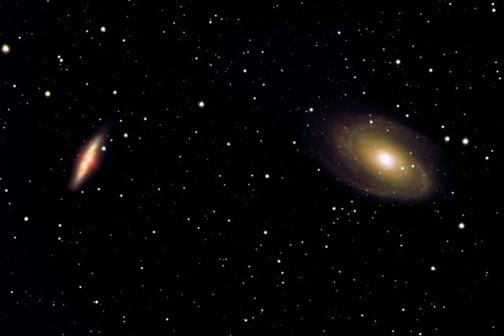

M81, M82, and NGC 3077 -- a classic duo plus one -- in LRGB.

<strong>Location:</strong> Comanche Springs Astronomy Campus near Crowell, Texas

<strong>Date:</strong> March to April, 2008

<strong>Seeing:</strong> 7/10

<strong>Transparency:</strong> 7/10, windy on second night

<strong>Temperature:</strong> -20 degrees C on camera

<strong>Scope/Mount:</strong> Tak TOA-150 (with 67 flattener) on Paramount ME

<strong>Camera:</strong> SBIG STL-11000M astro CCD camera

<strong>Exposure Info:</strong> LRGB image; 240:60:60:60 minutes (10 minute subexposures for LRGB)

<strong>Processing Information:</strong> Acquisition with CCDSoft. Calibration (darks/flats), and registration in CCDstack (median combine). RGB/LRGB combine, color balance, levels/curves, and noise removal (Noel Carboni's Astronomy Tools) in Photoshop CS.

<h2>About this Object</h2>

M81 and M82 together form the most famous galactic pair known, but a third galaxy wants to crash the party.

M81, on bottom-left, is a nice spiral galaxy in Ursa Major, the "big bear." Its size, from earth, is near the equivalent of our full moon; therefore, this is one of the larger galaxies in the night sky from our vantage point. Here, the majestic and sweeping spiral arms show an abundance of hot, star forming regions. M81 is also known as "Bode's Nebula."

In contrast to M81, M82 (bottom-right) is a peculiar galaxy shown on edge. Because it is shown on edge it is unclear exactly what type of galaxy this is. A unique feature of this galaxy is the red ejecta spraying out of the core which is somewhat captured here in this image. The ejecta is likely caused by tidal attractions to the larger M81 neighbor. M82 is sometimes known as the "Cigar Galaxy" because of its shape.

The party crasher is NGC 3077, a magnitude 10, peculiar galaxy. Like M82, it shows strange structures and dust clouds that are likely due to gravitational interaction with other, larger members of the M81 group. It looks much like an elliptical galaxy.

Together, these galaxies are circumpolar for most of the United States, meaning that they rest very near the celestial pole.

<h3>Previous Images</h3>

<strong>Location:</strong> The Ballauer Observatory near Azle, Texas 
<strong>Date:</strong> February 16, 2004 (RGB) and April 7, 2004 (Luminance) 
<strong>Temperature:</strong> 60 degrees F 
<strong>Seeing:</strong> 7/10 (1.4 FWHM) 
<strong>Transparency:</strong> 4/10 (dew) 
<strong>Scope/mount:</strong> RGB data - Takahashi FSQ-106 @ f/5 and Celestron CGE mount. Luminance data - Takahashi FSQ-106 @ f/8 and Tak NJP Temma 2 mount 
<strong>Camera:</strong> SBIG ST-10XME, self-guided 
<strong>Exposure Info:</strong> LRGB image - 160:80:80:80 minutes (10 min. subexposures RGB, 20 min. subexposures Luminance) 
<strong>Processing Info:</strong> Dark frame calibration (no flats), de-blooming (New Astro Plug-in), registration, and Sigma combine of all channels in MaxIm 3.0. Background compensation, Digital-Development and Lucy-Richardson Deconvolution (10 iterations) in Images Plus. Final data combine, curves, levels, and color balance in Photoshop CS.

<em>Extra information: Green haloes caused by RGB data being shot at smaller focal length than Luminance. Deblooming still needs some work as well.</em>

🤖 AI-drafted &middot; unverified

<dl class="ke-ai-stub-facts">
<dt>What it is</dt>
<dd>M81, known as Bode's Galaxy, is a grand-design spiral, and M82, the Cigar Galaxy, is a starburst galaxy seen edge-on — the two form a gravitationally interacting pair.</dd>
<dt>Constellation</dt>
<dd>Ursa Major</dd>
<dt>Distance</dt>
<dd>~11.8 million ly (M81); ~12 million ly (M82)</dd>
<dt>Apparent magnitude</dt>
<dd>6.9 (M81); 8.4 (M82)</dd>
<dt>Angular size</dt>
<dd>26.9 &times; 14.1&prime; (M81); 11.2 &times; 4.3&prime; (M82)</dd>
<dt>Coordinates</dt>
<dd>RA 09h 55m, Dec +69&deg;</dd>
</dl>

This summary was generated by an AI assistant from general astronomical references, not from Jay's own notes on this specific image. Treat every detail above as a starting point for research, not settled fact.

Verify further: <a href="https://en.wikipedia.org/wiki/Messier_81">Wikipedia: M81</a> &middot; <a href="https://en.wikipedia.org/wiki/Messier_82">Wikipedia: M82</a>

