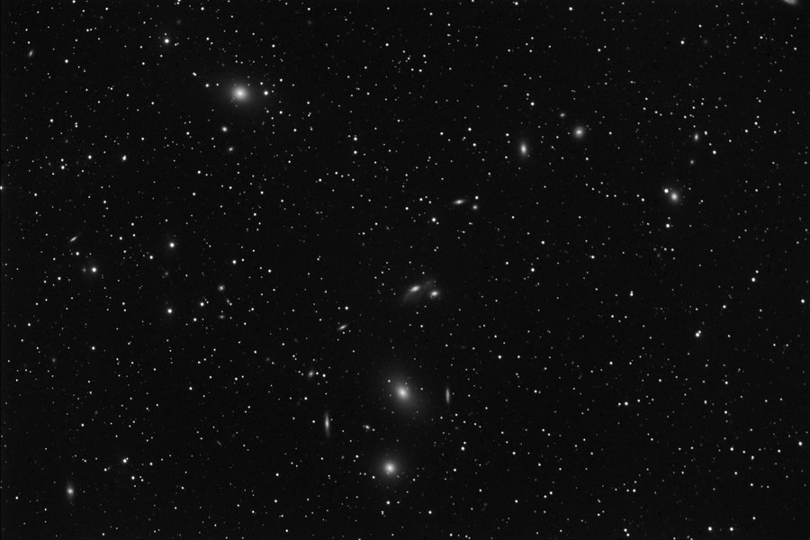
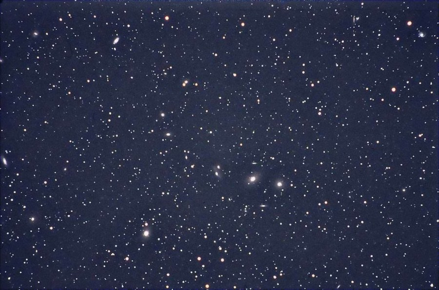

import DeepSkyMarkerSlider from '../../components/DeepSkyMarkerSlider.astro';
import markarianChart from './_images/markarian-chain-virgo.jpg';

export const markarianMarkers = [
  { catalogName: 'M87', kind: 'Galaxy', mag: 8.63, x: 453.58, y: 614.22, tagDx: -70, tagDy: -15 },
  { catalogName: 'M86', kind: 'Galaxy', mag: 8.9, x: 763.08, y: 448.73, tagDx: -95, tagDy: -35 },
  { catalogName: 'M90', kind: 'Galaxy', mag: 9.54, x: 38.88, y: 410.76 },
  { catalogName: 'M88', kind: 'Galaxy', mag: 9.56, x: 357.39, y: 50.59 },
  { catalogName: 'M89', kind: 'Galaxy', mag: 9.75, x: 122.65, y: 577.93 },
  { catalogName: 'NGC 4438', kind: 'Galaxy', mag: 10.17, x: 656.22, y: 434.99, tagDx: 90, tagDy: 25 },
  { catalogName: 'NGC 4473', kind: 'Galaxy', mag: 10.2, x: 512.97, y: 322.45, tagDx: 60, tagDy: 10 },
  { catalogName: 'NGC 4477', kind: 'Galaxy', mag: 10.42, x: 496.07, y: 265.14, tagDx: 0, tagDy: -35 },
  { catalogName: 'M84', kind: 'Galaxy', mag: 10.49, x: 840.77, y: 462.33, tagDx: 70, tagDy: -15 },
  { catalogName: 'NGC 4435', kind: 'Galaxy', mag: 10.8, x: 661.39, y: 415.21, tagDx: -70, tagDy: -10 },
  { catalogName: 'M91', kind: 'Galaxy', mag: 10.96, x: 123.33, y: 36.03 },
  { catalogName: 'NGC 4388', kind: 'Galaxy', mag: 11.02, x: 794.24, y: 526.86, tagDx: 40, tagDy: 55 },
  { catalogName: 'NGC 4461', kind: 'Galaxy', mag: 11.19, x: 567.06, y: 389.18, tagDx: -70, tagDy: 30 },
  { catalogName: 'NGC 4459', kind: 'Galaxy', mag: 11.32, x: 563.12, y: 167.4, tagDx: 105, tagDy: -30 },
  { catalogName: 'NGC 4478', kind: 'Galaxy', mag: 11.45, x: 490.46, y: 630.5, tagDx: 0, tagDy: 50 },
  { catalogName: 'NGC 4486A', kind: 'Galaxy', mag: 11.59, x: 445.22, y: 648.2, tagDx: -40, tagDy: 75 },
  { catalogName: 'NGC 4550', kind: 'Galaxy', mag: 11.68, x: 135.62, y: 671.27, tagDx: 70, tagDy: 15 },
  { catalogName: 'NGC 4440', kind: 'Galaxy', mag: 11.72, x: 654.08, y: 634.84, tagDx: -70, tagDy: -10 },
  { catalogName: 'NGC 4571', kind: 'Galaxy', mag: 11.82, x: 23.97, y: 116.58 },
  { catalogName: 'NGC 4425', kind: 'Galaxy', mag: 11.83, x: 695.47, y: 510.12, tagDx: 90, tagDy: 10 },
  { catalogName: 'NGC 4551', kind: 'Galaxy', mag: 12.02, x: 126.93, y: 659.46, tagDx: -70, tagDy: -10 },
  { catalogName: 'NGC 4458', kind: 'Galaxy', mag: 12.07, x: 572.69, y: 372.77, tagDx: -70, tagDy: -15 },
  { catalogName: 'NGC 4387', kind: 'Galaxy', mag: 12.12, x: 798.58, y: 485.25, tagDx: -110, tagDy: 20 },
  { catalogName: 'NGC 4479', kind: 'Galaxy', mag: 12.44, x: 478.33, y: 282.16, tagDx: -80, tagDy: 20 },
  { catalogName: 'NGC 4531', kind: 'Galaxy', mag: 12.42, x: 213.89, y: 430.47 },
  { catalogName: 'NGC 4474', kind: 'Galaxy', mag: 12.5, x: 516.67, y: 152.5, tagDx: -70, tagDy: -10 },
  { catalogName: 'VCC 1214', kind: 'Galaxy', mag: null, bucket: 12.5, x: 519.12, y: 146.51, tagDx: 70, tagDy: 20 },
  { catalogName: 'NGC 4431', kind: 'Galaxy', mag: 12.89, x: 683.82, y: 634.64, tagDx: 70, tagDy: -5 },
  { catalogName: 'NGC 4436', kind: 'Galaxy', mag: 12.98, x: 667.86, y: 627.99, tagDx: 0, tagDy: 45 },
  { catalogName: 'IC 3475', kind: 'Galaxy', mag: 13.29, x: 323.83, y: 512.33 },
  { catalogName: 'IC 3303', kind: 'Galaxy', mag: 14.24, x: 829.55, y: 510.86, tagDx: 90, tagDy: 20 },
  { catalogName: 'LEDA 41007', kind: 'Galaxy', mag: 15.47, x: 611.44, y: 384.35, tagDx: 60, tagDy: -40 },
  { catalogName: 'LEDA 40598', kind: 'Galaxy', mag: 15.56, x: 784.68, y: 377.66, tagDx: 70, tagDy: -15 },
  { catalogName: 'LEDA 40519', kind: 'Galaxy', mag: 16.0, x: 815.23, y: 533.18, tagDx: 95, tagDy: 75 },
  { catalogName: 'CGI J1226+1307', kind: 'Galaxy', mag: 17.1, x: 768.81, y: 399.15, tagDx: 10, tagDy: -170 },
];

Markarian's Chain of galaxies in Virgo, in LRGB from the Texas Star Party.

<strong>Location:</strong> Texas Star Party, 2006, near Ft. Davis, TX

<strong>Date:</strong> April 29, 2006

<strong>Seeing:</strong> 3/10

<strong>Transparency:</strong> 7/10

<strong>Scope/Mount:</strong> Tak FSQ-106 and Paramount ME

<strong>Camera:</strong> SBIG STL-11000 astro CCD camera

<strong>Exposure Info:</strong> LRGB image - 100:20:15:20 minutes (10 minute subexposures unbinned for luminance; 5 minute subexposure binned for RGB)

<strong>Processing Information:</strong> Acquisition in CCDSoft. Calibration, Registration, DDP, and color combine in CCDStack. Color balance, levels/curves, sharpening, and noise removal (Astronomy Tools/Pro Digital Software) in Photoshop CS.

<strong>Exposure Notes:</strong> Dark TSP skies, but not quite as transparent as I've seen it there. Seeing around 3 to 3.5 arc seconds&hellip;good enough for wide field refractors but not for long focal length instruments.

<h2>About this Image</h2>

During the spring months, the night skies turn to a galactic festival. A veritable parade of galaxies from Ursa Major to Virgo stretches across the northern hemisphere sky. One of the most popular "clusters" of galaxies is in the constellation Virgo, the heart of which is known as the "Markarian's Chain" of galaxies. The chain, named after an Armenian astronomer in the 1970s, consists of giant elliptical galaxies M84 and M86 on the right side and stretches up to the spiral galaxy M88 near the top. Other major galaxies in the image include the huge elliptical M87 at bottom; M89 and M90 at bottom left; and M91 and NGC 4571 at upper left. Of note is the galactic jet streaming out from M89.

The Virgo cluster consists of over 2000 known galaxies, which collectively impact our own Local Galaxy Group. The image above shows no fewer than 100 of these galaxies, or perhaps more. How many can you count?

### Galaxies in this Image

The Virgo core packs in far more than the chain's named Messier/NGC members — drag the slider below to reveal 35 catalogued galaxies in the field, brightest first.

<DeepSkyMarkerSlider image={markarianChart} alt="Markarian's Chain with 35 catalogued galaxies marked by apparent magnitude" imageWidth={1000} imageHeight={705} markers={markarianMarkers} step={0.25} />

Positions plate-solved via astrometry.net; galaxy identities and apparent magnitudes cross-matched against the SIMBAD catalog (NED's quick-look magnitude used for the few lacking a comparable SIMBAD V-band measurement). VCC 1214 has no citable magnitude anywhere and is revealed alongside its near-twin NGC 4474 rather than placed by brightness.

<h3>Previous Attempts</h3>

<em>The Markarian Chain</em>

Three prominent Messier galaxies can be seen in this shot, M84, M86, and M87, all of which are massive, elliptical galaxies. The rest of the galaxies are part of a cluster of galaxies in Virgo. Most impressive is the chain of galaxies known as Markarian's chain. The chain begins at M84, at the bottom of this image, and curving upwards to the right. How many galaxies are here? Perhaps hundreds and thousands. No fewer than thirty are shown in this image. If it's fuzzy, it's a galaxy!

<strong>Location:</strong> Texas Star Party 2004 near Fort Davis, Texas 
<strong>Seeing:</strong> 8/10 
<strong>Transparency:</strong> 9/10 
<strong>Date and Time:</strong> May 16, 2003 
<strong>Equipment:</strong> Tak FSQ-106 @ f/5 on Tak NJP mount 
<strong>Camera:</strong> SBIG STL-6303E NABG with integrated filter wheel 
<strong>Exposure Info:</strong> Grayscale, clear luminance, 6 x 10 minutes 
<strong>Processing Information:</strong> Dark frame calibration, deblooming, registration and Sigma combine in MaxIm DL 4. Digital development in MaxIm DL 4. Levels and curves in Photoshop CS.

<em>The Virgo Galaxy Cluster</em>

Anything that is not round is a galaxy! I've counted no fewer than 20 galaxies in this photo. The Virgo area has the largest concentration of galaxies reachable by amateur telescopes. Shown here is the heart of the Virgo cluster known as the Markarian Chain spanning from M88 at the upper left of the picture to M84 in the center.

<strong>Location:</strong> Texas Star Party 2003 near Fort Davis, Texas 
<strong>Seeing:</strong> 6/10 
<strong>Transparency:</strong> 9/10 
<strong>Date and Time:</strong> May 2, 2003 @ 11:45 PM CST 
<strong>Equipment:</strong> 420mm @ f4 (300mm Nikkor ED lens with TC14B teleconverter) guided with Meade 208xt 
<strong>Length:</strong> Single 45 minute exposure 
<strong>Film:</strong> Kodak E200 slide film pushed one stop to ISO 320 
<strong>Processing Information:</strong> Image is slightly cropped with a levels adjustment and contrast increase. Slight unsharp mask applied.

<em>Exposure Notes: For a 45 minute exposure at f4, this shot didn't achieve the depth that I hoped for, especially considering that I gave the film a one stop push. The lack of blue response with the E200 emulsion is obvious here. In particular, the elliptical galaxies M84, M86, and M87 should be much more saturated and detailed.</em>

🤖 AI-drafted &middot; unverified

<dl class="ke-ai-stub-facts">
<dt>What it is</dt>
<dd>The Markarian's Chain is a striking curved line of galaxies — including M84, M86, and several NGC members — at the core of the Virgo Cluster, a rich hunting ground for observing many galaxies in a single field of view.</dd>
<dt>Constellation</dt>
<dd>Virgo</dd>
<dt>Distance</dt>
<dd>~53&ndash;60 million light-years</dd>
<dt>Apparent magnitude</dt>
<dd>9.1 (M84); 8.9 (M86)</dd>
<dt>Angular size</dt>
<dd>chain spans ~1.5&deg;</dd>
<dt>Coordinates</dt>
<dd>M86: RA 12h 27m, Dec +13&deg; 06&prime;</dd>
</dl>

This summary was generated by an AI assistant from general astronomical references, not from Jay's own notes on this specific image. Treat every detail above as a starting point for research, not settled fact.

Verify further: <a href="https://en.wikipedia.org/wiki/Markarian%27s_Chain">Wikipedia</a>

