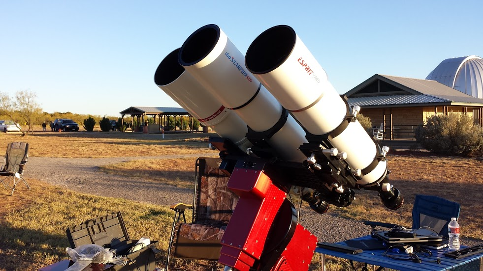

Location: Comanche Springs Astronomy Campus (CSAC), Three Rivers Foundation, Crowell, TX. Temperature: 47 degrees F.

Processing: Dark frame calibration, registration, and Windsorized Rejection combine in PixInsight 1.8. Histogram Transformation, SCNR and noise reduction in PixInsight 1.8. Final color balance, saturation, curves/levels, star repair, and local contrast enhancement in Photoshop CS6.

If it seems like I shoot this object a lot, well, you would be right. But this image arose from special circumstances...

I was recently approached by Celestron and Skywatcher telescopes, by virtue of my long-going association with the Three Rivers Foundation, to shoot a series of images that would provide content for an upcoming advertising campaign. The idea is that you take the new Skywatcher Esprit 6" apochromatic refractor and perform a head-to-head, simultaneous data acquisition against a leading competitor refractor (typically twice the price), and see what results arise. In this case, my current Takahashi TOA-150 is the perfect competitor.

Of course, to do an effective comparison, you need an object that produces good results for both scopes, which yields ever so slightly different image scales (1050mm for the Esprit and 1100mm for the TOA). Likewise, you need identical cameras. Canon provided two new 60Da factory-modified DSLRs, which I was really curious about since it had been many years since my own testing of a self-modified Canon 300D. My old favorite, the Rosette, is perfectly suited for this comparison.

I will save all telescope and camera comparisons for another time and place; however, the resulting image is a composite of both data sets, comprising one long, 6 hour image. The results are not what I would typically expect, which results from using the DSLRs as opposed to real CCD astronomy cameras, but I will say that the telescopes both perform equally well.

🤖 AI-drafted &middot; unverified

<dl class="ke-ai-stub-facts">
<dt>What it is</dt>
<dd>NGC 2244, the Rosette Nebula, is a large emission nebula surrounding a young open star cluster at its center.</dd>
<dt>Constellation</dt>
<dd>Monoceros</dd>
<dt>Distance</dt>
<dd>~5,200 light-years</dd>
<dt>Apparent magnitude</dt>
<dd>~9.0 (cluster); nebula surface brightness is much fainter</dd>
<dt>Angular size</dt>
<dd>~80 &times; 60 arcminutes</dd>
<dt>Coordinates</dt>
<dd>RA 06h 32m, Dec +04&deg; 52&prime;</dd>
</dl>

This summary was generated by an AI assistant from general astronomical references, not from Jay's own notes on this specific image. Treat every detail above as a starting point for research, not settled fact.

Verify further: <a href="https://en.wikipedia.org/wiki/Rosette_Nebula">Wikipedia</a>

