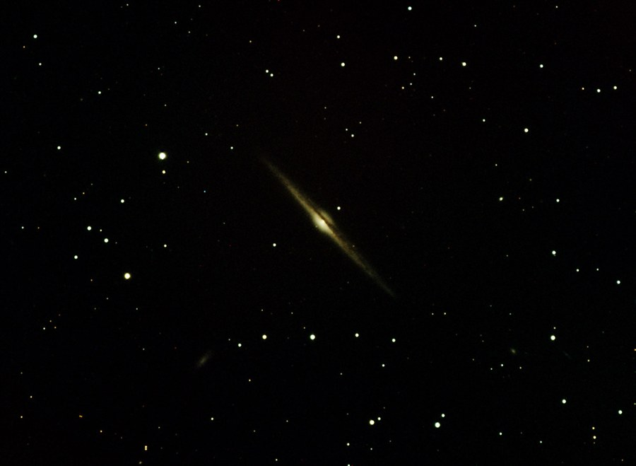

NGC 4565, an edge-on spiral galaxy in Coma Berenices, in LRGB.

<strong>Location:</strong> Comanche Springs, 3RF dark sky site near Crowell, TX

<strong>Date:</strong> April 8 &amp; 9, 2005

<strong>Seeing:</strong> 5/10 on average

<strong>Transparency:</strong> 7/10

<strong>Temperature:</strong> Chilly (-25 degrees C on camera)

<strong>Scope/Mount:</strong> 12.5" RCOS RC @ f/9 and Paramount ME

<strong>Camera:</strong> SBIG STL-6303e astro CCD camera

<strong>Exposure Info:</strong> LRGB image; 130:20:20:45 minutes (10 minute subexposures for L, 5 minute subexposures for RGB, color binned)

<strong>Processing Information:</strong> Acquisition, calibration (darks/flats), registration, and RGB channel combine in MaxIm DL 4 (Sigma combine). LRGB combine, color balance, levels/curves, cropping, and noise removal (Noel Carboni's Astronomy Tools) in Photoshop CS.

<h2>About this Object</h2>

This might be the most famous of the non-Messier galaxies, with good reason. This edge-on spiral, with prominent dark dust lane, is a delight through just about any telescope with moderate aperture. The smaller galaxy at the bottom is NGC 4562, a 13.7 magnitude spiral, and of course many other smaller, fainter galaxies litter the field. NGC 4565 is assumed to resemble our own Milky Way galaxy if we were to view it from the outside, looking in. It rests approximately 31 million light years away. It can be found close to the unusual cluster of stars known as Mel 111 in the constellation Coma Berenices. It's one of my favorite galaxies and a wonderful springtime object.

<h3>Previous Attempts</h3>

<strong>Location:</strong> The Ballauer Observatory near Azle, Texas 
<strong>Date:</strong> March 30, 2004 
<strong>Transparency:</strong> 5/10 
<strong>Seeing:</strong> 5/10 
<strong>Scope/Mount:</strong> Tak FSQ-106 @ f/8 (with Extender-Q) on Tak NJP mount 
<strong>Camera:</strong> SBIG ST-10xme with CFW8a filter wheel 
<strong>Exposure Info:</strong> RGB image (20:20:20 minutes) 
<strong>Processing Info:</strong> Dark and flat calibration, registration, gradient removal, and average combine in MaxIm. DDP and Lucy-Richardson Deconvolution (2 iterations) in Images Plus. Curves, deblooming, sharpening, and cropping in Photoshop CS. Final smoothing in Pleiades' SGBNR.

<em>Extra Info: Special thanks to Dr. Fred Koch for the use of the SBIG ST-10xme camera and Tak NJP mount.</em>

🤖 AI-drafted &middot; unverified

<dl class="ke-ai-stub-facts">
<dt>What it is</dt>
<dd>NGC 4565, nicknamed the "Needle Galaxy" for its razor-thin profile, is a spiral galaxy seen almost perfectly edge-on.</dd>
<dt>Constellation</dt>
<dd>Coma Berenices</dd>
<dt>Distance</dt>
<dd>~30 million light-years</dd>
<dt>Apparent magnitude</dt>
<dd>9.6</dd>
<dt>Angular size</dt>
<dd>~15.9 &times; 1.9 arcminutes</dd>
<dt>Coordinates</dt>
<dd>RA 12h 36m 21s, Dec +25&deg; 59&prime;</dd>
</dl>

This summary was generated by an AI assistant from general astronomical references, not from Jay's own notes on this specific image. Treat every detail above as a starting point for research, not settled fact.

Verify further: <a href="https://en.wikipedia.org/wiki/NGC_4565">Wikipedia</a>

