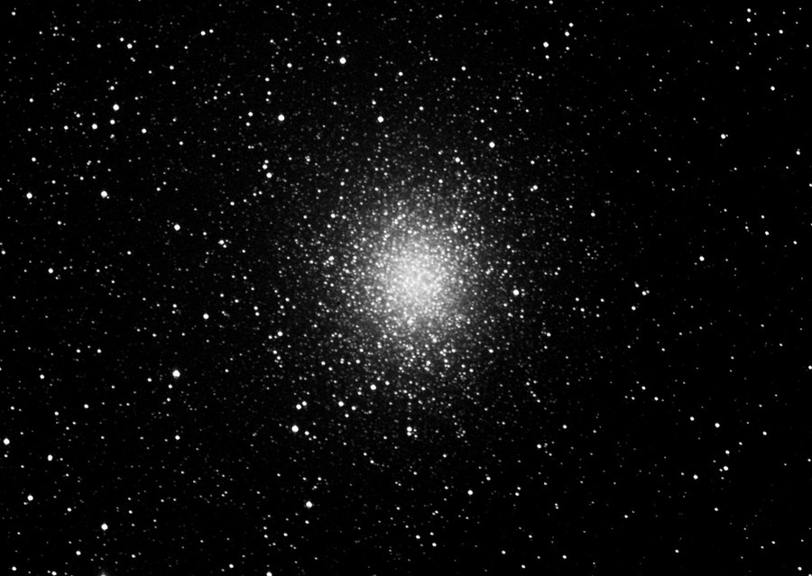

Omega Centauri, NGC 5139, in grayscale luminance -- shot just 11 degrees above the southern horizon.

<strong>Location:</strong> Texas Star Party 2004 near Ft. Davis, Texas

<strong>Date and Time:</strong> May 17, 2004

<strong>Seeing:</strong> 8/10

<strong>Transparency:</strong> 9/10

<strong>Equipment:</strong> Tak FSQ-106 @ f/5 on Tak NJP mount

<strong>Camera:</strong> SBIG STL-6303E NABG with integrated filter wheel

<strong>Exposure Info:</strong> Grayscale, clear luminance (4 x 10 minutes)

<strong>Processing Information:</strong> Calibration, deblooming, registration and Sigma combine in MaxIm DL 4. Digital development in MaxIm DL 4. Levels and Curves in Photoshop CS.

<h2>About this Object</h2>

One of the good things about living in Texas is that we can see this gem just above our horizon. Perhaps the grandest globular cluster of them all, Omega Centauri is compact and slightly oval in shape, shining at a naked eye brightness of 4th magnitude with an angular size that approximates our own moon at full phase. Millions and millions of stars comprise this beauty of an object which is easily resolved by even small aperture scopes, that is as long as the object is high enough at Northern latitudes to avoid atmospheric interference. This shot is wide-field, taken from very dark skies. Omega Centauri was 11 degrees above the southern horizon when this picture was shot.

<h3>Previous Attempt</h3>

<strong>Location:</strong> Copperbreaks Star Park near Quanah, Texas 
<strong>Date and Time:</strong> April 17, 2004 @ 12:30 AM 
<strong>Seeing:</strong> 8/10 
<strong>Transparency:</strong> 7/10 
<strong>Equipment:</strong> Tak FSQ-106 @ f/5 on Tak NJP mount 
<strong>Camera:</strong> SBIG ST-10xme 
<strong>Exposure Info:</strong> Grayscale (5 x 5 minutes) 
<strong>Processing Information:</strong> Calibration, deblooming and registration in MaxIm DL 3. Digital development, Lucy-Richardson Deconvolution (10 iterations), and Background Compensation in Images Plus. Unsharp Mask, Curves and cropping in Photoshop CS.

<em>Note: Wind gusts of around 20 mph during time of exposure. Object was taken only 7 degrees from horizon in the midst of skyglow from a small town (Crowell, TX). Seeing was exceptional for an image this low. Thanks to Dr. Fred Koch for the use of the NJP mount and ST10xme camera.</em>

🤖 AI-drafted &middot; unverified

<dl class="ke-ai-stub-facts">
<dt>What it is</dt>
<dd>NGC 5139, Omega Centauri, is the largest and brightest globular cluster orbiting the Milky Way, containing an estimated 10 million stars. From mid-northern latitudes it only skims the southern horizon.</dd>
<dt>Constellation</dt>
<dd>Centaurus</dd>
<dt>Distance</dt>
<dd>~17,090 light-years</dd>
<dt>Apparent magnitude</dt>
<dd>3.7</dd>
<dt>Angular size</dt>
<dd>~36 arcminutes</dd>
<dt>Coordinates</dt>
<dd>RA 13h 26m 47s, Dec -47&deg; 28&prime; 46&Prime;</dd>
</dl>

This summary was generated by an AI assistant from general astronomical references, not from Jay's own notes on this specific image. Treat every detail above as a starting point for research, not settled fact.

Verify further: <a href="https://en.wikipedia.org/wiki/Omega_Centauri">Wikipedia</a>

