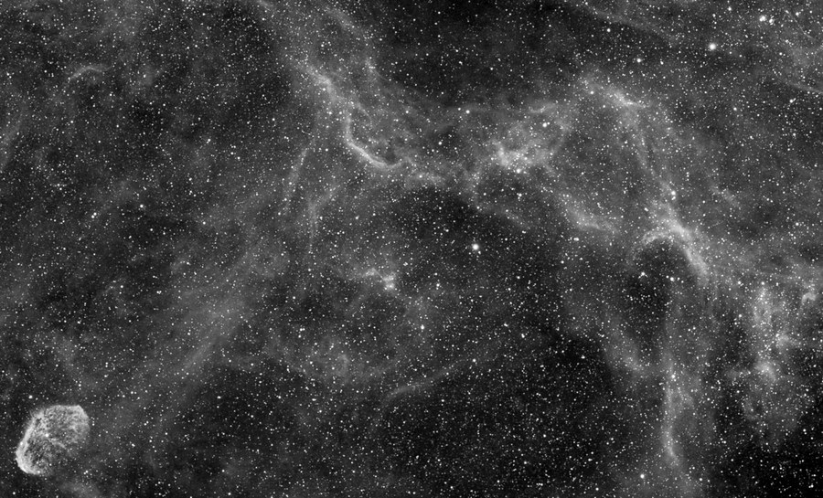

NGC 6888, the Crescent Nebula, in HaRGB.

<strong>Location:</strong> Ballauer Observatory near Azle, Texas

<strong>Date:</strong> June 26 &amp; 27, 2005

<strong>Seeing:</strong> 7/10

<strong>Transparency:</strong> 3/10

<strong>Temperature:</strong> 72 degrees F

<strong>Scope/Mount:</strong> 12.5" RCOS RC and Paramount ME

<strong>Camera:</strong> SBIG STL-6303e (Ha) and SBIG STL-11000M (RGB) astro CCD cameras

<strong>Filter:</strong> Custom Scientific 4.5nm Hydrogen-alpha filter

<strong>Exposure Info:</strong> HaRGB image - 120:80:50:80 minutes (20 minute subexposures for Ha; 10 minute subs for RGB; all unbinned)

<strong>Processing Information:</strong> Calibration, registration, DDP, and RGB combine in MaxIm DL 4. HaRGB combine, levels/curves, sharpening, and noise removal in Photoshop CS.

<strong>Extra Notes:</strong> H-alpha data blended 50% with the red channel to improve color saturation. H-alpha data was then used again as luminance.

<h2>About this Object</h2>

The Crescent Nebula, NGC 6888, is an interesting nebula with a peculiar and unique shape. At the center of the Nebula is a Wolf-Rayet star (WR 136) that shines at magnitude 7.4, a star in the latter part of its life-cycle that is shedding off its mass in the form of a strong, stellar wind. It has shed off all its hydrogen gases leaving its helium core exposed, a dynamic that will result eventually in a supernova explosion. The stellar winds stirred up the surrounding interstellar dust and gas causing ripples across the visible part of the nebula, which is now seen because the ultraviolet radiation of WR136 exciting the gases of the nebula, causing it to fluoresce.

Many planetary nebulae have similar Wolf-Rayet stars at their center. In the case of NGC 6888, it is classified as an emission nebula because it emits its own light, although it shares many characteristics of planetary nebulae itself. The Crescent is quite difficult to observe visually because of its rather even surface illumination. To see it, you'll need medium to large aperture and dark skies.

<h3>Another View&hellip;</h3>

Here is a wide-field shot of the area extending south-east from the Crescent Nebula, NGC 6888, shown in the lower-left of this image. The total exposure is over 3 hours in Hydrogen-alpha light, a method that allows for capturing detail of the hydrogen gases being emitted in this area. It is a region of interesting nebulosity from the Cygnus Milky Way, a southern extension of IC 1318 around Gamma Cygni; however, none of the nebulosity in this image has a designation, at least none that I'm aware of. There are star clusters contained within the dust. Open clusters NGC 6871 and NGC 6883 are included at the right side of the image. NGC 6874 is at the upper left.

<strong>Location:</strong> The Ballauer Observatory near Azle, Texas 
<strong>Date:</strong> July 11, 2004 and September 8, 2004 
<strong>Scope/mount:</strong> Takahashi FSQ-106 @ f/5 and Tak NJP mount 
<strong>Camera:</strong> SBIG STL-6303E, self-guided 
<strong>Filter:</strong> Custom Scientific 4.5nm Hydrogen Alpha 
<strong>Exposure Info:</strong> Grayscale, Hydrogen-alpha filtered image - 205 minutes (15 min. subexposures unbinned). 
<strong>Processing Info:</strong> Dark frame calibration, flat-fields, registration, and average combine in MaxIm 4.0. Digital-Development in MaxIm. Levels, Curves, selective unsharp mask, and selective gaussian blur in Photoshop CS.

🤖 AI-drafted &middot; unverified

<dl class="ke-ai-stub-facts">
<dt>What it is</dt>
<dd>NGC 6888, the Crescent Nebula, is a bubble-shaped emission nebula formed by fast stellar wind from a rare Wolf-Rayet star colliding with material the star shed earlier in its life.</dd>
<dt>Constellation</dt>
<dd>Cygnus</dd>
<dt>Distance</dt>
<dd>~5,000 light-years</dd>
<dt>Apparent magnitude</dt>
<dd>~7.4</dd>
<dt>Angular size</dt>
<dd>~20 &times; 10 arcminutes</dd>
<dt>Coordinates</dt>
<dd>RA 20h 12m, Dec +38&deg; 21&prime;</dd>
</dl>

This summary was generated by an AI assistant from general astronomical references, not from Jay's own notes on this specific image. Treat every detail above as a starting point for research, not settled fact.

Verify further: <a href="https://en.wikipedia.org/wiki/Crescent_Nebula">Wikipedia</a>

