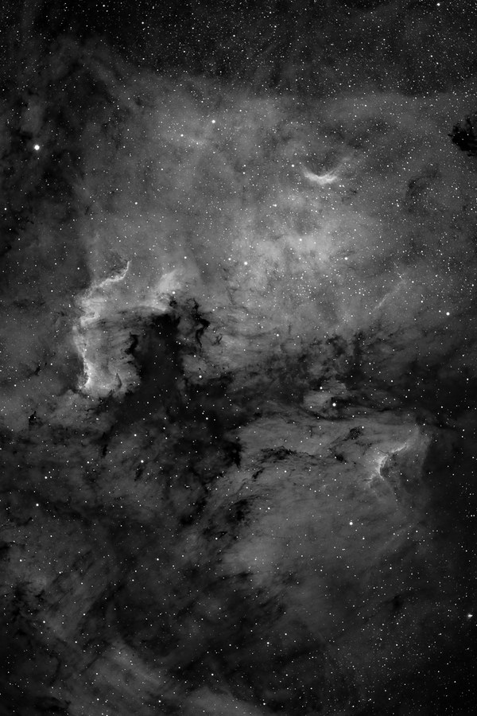

NGC 7000 and IC 5067/70 -- the North America and Pelican Nebulae -- in Ha+LRGB. Earlier attempts are on file: an [HaRGB blend](/gallery/ngc7000-cygnus-wall-hubble-palette/) and a [plain LRGB](/gallery/ngc7000-cygnus-wall-visual-palette/) version, both from 2004, plus a [quick DSLR shot](/gallery/ngc7000-ic5070-dslr/) from 2018.

<strong>Location:</strong> Okie-Tex Star Party, Kenton, OK

<strong>Date:</strong> September 18-19, 2006

<strong>Seeing:</strong> 3/10

<strong>Transparency:</strong> 9/10

<strong>Temperature:</strong> -25 degrees C on camera

<strong>Scope/Mount:</strong> Tak FSQ-106 @ f/5 on Paramount ME

<strong>Camera:</strong> SBIG STL-11000M astro CCD camera

<strong>Filter:</strong> Custom Scientific 4.5 nm H-alpha filter

<strong>Exposure Info:</strong> Ha+LRGB image; 150:60:30:40 minutes (10 minute subexposures for LRGB, 30 minute subexposures for Ha)

<strong>Processing Information:</strong> Acquisition with CCDSoft. Calibration (darks/flats), and registration in CCDstack (median combine). RGB combine and Ha blending, color balance, levels/curves, and noise removal/local contrast enhancement (Noel Carboni's Astronomy Tools) in Photoshop CS.

<h2>About this Object</h2>

A terrific region of the sky in the constellation Cygnus, this region of emission sources are among the sky's most recognizable objects. The shape of these two nebula remind most people, unmistakably, of the North America continent (top) and a Pelican (bottom). The pair rests just to the west side of Deneb, the star at the top of the Swan or Northern Cross asterism.

While not especially faint objects, these nebulae can be difficult to spot through telescopes because of their size. Binoculars and short focal length telescopes normally give you the better views&hellip;in dark skies, of course. If the skies are dark enough, don't be surprised if you can make out the North America Nebula with the naked eye. It's a sight to behold and a good indication as to the quality of your skies.

<em>Hydrogen Alpha data used for the image above (150 minutes)</em>

🤖 AI-drafted &middot; unverified

<dl class="ke-ai-stub-facts">
<dt>What it is</dt>
<dd>NGC 7000, the North America Nebula, and IC 5070, the Pelican Nebula, are a pair of large emission nebulae separated by a lane of obscuring dust, though they are part of the same enormous star-forming cloud.</dd>
<dt>Constellation</dt>
<dd>Cygnus</dd>
<dt>Distance</dt>
<dd>~2,590 ly (NGC 7000); ~1,800&ndash;2,000 ly (IC 5070)</dd>
<dt>Apparent magnitude</dt>
<dd>~4 (NGC 7000); ~8 (IC 5070)</dd>
<dt>Angular size</dt>
<dd>~120 &times; 100&prime; (NGC 7000); ~60 &times; 50&prime; (IC 5070)</dd>
<dt>Coordinates</dt>
<dd>NGC 7000: RA 20h 59m 17s, Dec +44&deg; 31&prime;</dd>
</dl>

This summary was generated by an AI assistant from general astronomical references, not from Jay's own notes on this specific image. Treat every detail above as a starting point for research, not settled fact.

Verify further: <a href="https://en.wikipedia.org/wiki/North_America_Nebula">Wikipedia: North America Nebula</a> &middot; <a href="https://en.wikipedia.org/wiki/Pelican_Nebula">Wikipedia: Pelican Nebula</a>

