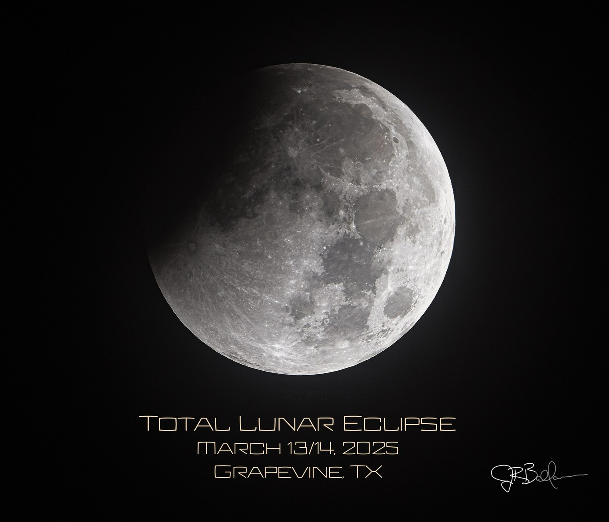
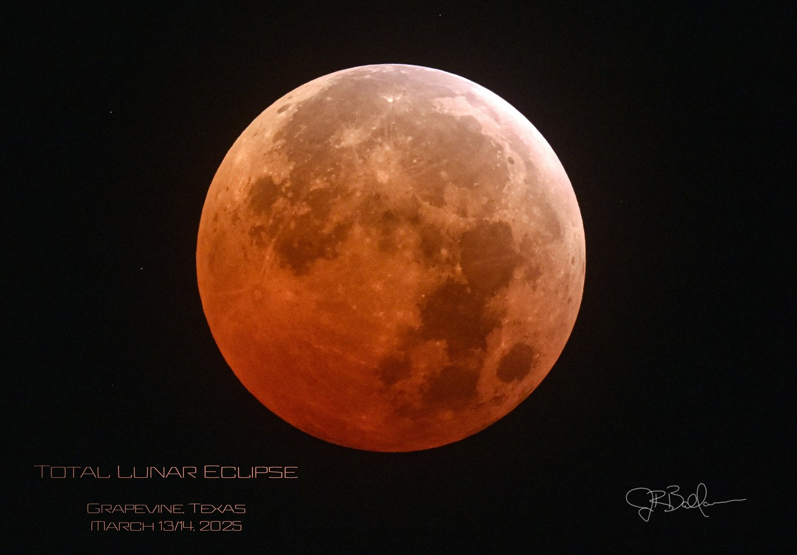
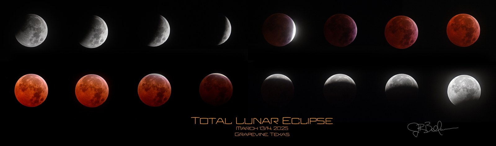

A composite showing the full progression of the March 13-14, 2025 total lunar eclipse, shot right from home in Grapevine, Texas. No need to travel for this one &mdash; the whole event, start to finish, played out overhead on a clear March night.

The moon was tracked continuously through an intervalometer-driven sequence of 290+ exposures, from the first bite of the penumbra through totality and back out again. Nine frames from that sequence, evenly spaced, make up the composite above &mdash; arranged in a single row radiating outward from totality at the center, with the exposure time climbing steeply toward the middle of the sequence as the moon dims from a fully-lit disk to a dim red ember and back again.

Left: the partial phase, well before totality &mdash; still a fast, bright exposure. Right: totality itself, the "Blood Moon" &mdash; a much longer exposure to pull detail out of the dim, reddened disk.

That jump in exposure time from one frame to the next is the whole story of a lunar eclipse. During the partial phase, the sunlit crescent is still bright enough to expose in a fraction of a second. But once the moon slides fully into Earth's umbra, direct sunlight is blocked entirely &mdash; what little light reaches the lunar surface has been refracted and reddened by passing through Earth's atmosphere, the same effect that reddens a sunset. That dim red glow needs a much longer exposure to capture, which is exactly why totality is the most technically demanding part of the sequence to shoot well.

### A Second Composite

A second, denser arrangement of the same event &mdash; sixteen frames stacked in two rows rather than radiating out from a single center like the composite up top. Same eclipse, same night, just a different way of laying out the story.

🤖 AI-drafted &middot; unverified

<dl class="ke-ai-stub-facts">
<dt>What it is</dt>
<dd>A total lunar eclipse, sometimes called a "Blood Moon" for the deep red-orange color the fully-eclipsed moon takes on. This one was also nicknamed the "Blood Worm Moon," pairing the eclipse with March's traditional "Worm Moon" full moon name.</dd>
<dt>Location observed</dt>
<dd>Grapevine, Texas</dd>
<dt>Timeline (Central Daylight Time)</dt>
<dd>Penumbral phase began 10:57 PM, March 13; partial phase began 12:09 AM; totality lasted 1:26&ndash;2:31 AM; partial phase ended 3:52 AM; penumbral phase ended 5:00 AM, all March 14</dd>
<dt>Totality duration</dt>
<dd>~65 minutes</dd>
<dt>Coordinates</dt>
<dd>N/A</dd>
</dl>

This summary was generated by an AI assistant from general astronomical references, not from Jay's own notes on this specific image. Treat every detail above as a starting point for research, not settled fact.

Verify further: <a href="https://en.wikipedia.org/wiki/March_2025_lunar_eclipse">Wikipedia</a> &middot; <a href="https://science.nasa.gov/solar-system/moon/what-you-need-to-know-about-the-march-2025-total-lunar-eclipse/">NASA</a>

