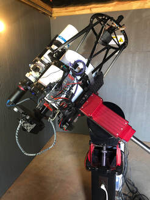
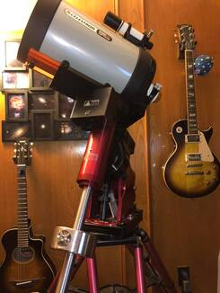
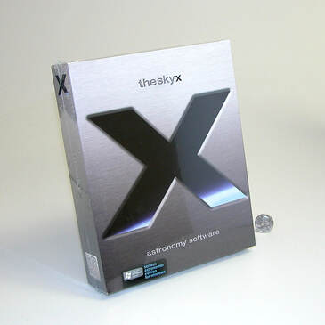
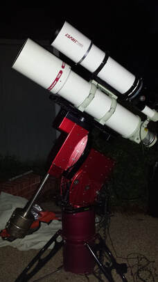
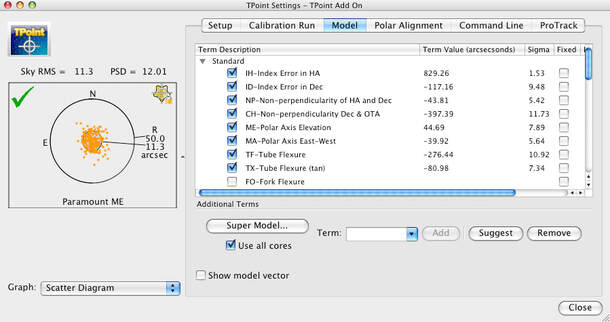
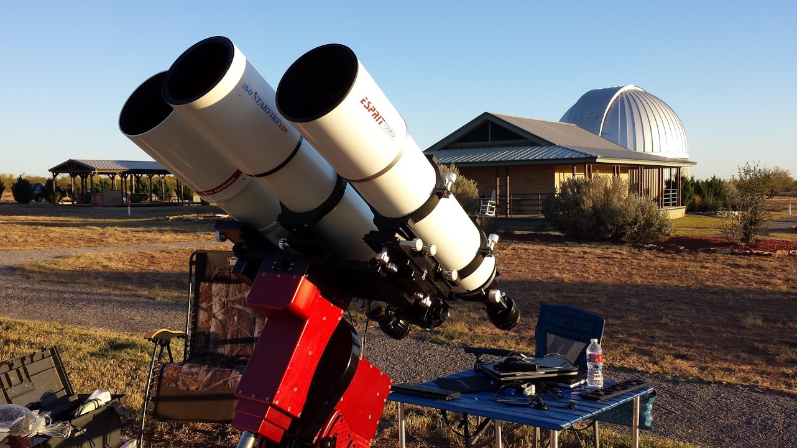

The Software Bisque Paramounts - An Overview and a Review
First, let's hop right to the conclusion of this review since you are probably very curious if I like the Software Bisque (SB) Paramounts? 

Uh...yeah, I like them...I like them a lot.

Just judging by all the pictures of equipment at All About Astro.com, you've no doubt realized that!  

Now that the mystery is out of the way, let's talk about why I - and so many others interested in serious astroimaging - will put so much money into one (or more) of the several Software Bisque mounts on either the new and used telescope market.  

A LITTLE HISTORY

My first use of Paramount came in January, 2005, when a Paramount ME entered my life (see SIDEBAR: My First Paramount Experience).  As a user of SB's planetarium software product, TheSky5 (at the time), I was familiar with their foray into the hardware mount arena a few years earlier, so I had anticipated this "dream" mount for quite a while. 

But from Day 1, what has made an SB mount so unique was that it wasn't just a hardware solution like almost every other mount.  Rather, it's a total package of excellent hardware plus powerful software, and it's the integration of these two aspects that have always made Paramounts so awesome.  Paramounts come with the most current version of the The Sky software, seemingly custom written with the Paramount in mind.  Feature rich, current mounts are shipped with The Sky X Pro Software Suite.  This opens up a vast amount of capabilities that no other mount can really boast.   To make matters worst for non-Paramount buyers, you are probably going to want to purchase The Sky X Pro software anyway, especially if you are in an observatory setting and desire to run T-Point to refine the tracking and slewing performance of your own high-end mount.   T-Point is only one of the powerful tools that are a part of The Sky X Pro software suite.  

Coming in at a variety of price points - all high ones - Software Bisque offers three Paramount options to the typical amateur...the MyT, the MX+, and the ME II.  Also, for those with even deeper pockets and larger needs (read universities), SB has their fork-mount Taurus and Apollo Paramounts.    

Of course today's versions are refinement of the original SB mounts, the GT-1100, the MX, and the ME.   

Let's run down some of the historical particulars of each mount, since it's likely that even a used Paramount could find its way into your hands and it would be good to know what power it offers...
​The Paramount GT-1100 - This SB mount started it all.  First arriving on the scene in 1996 and later updated to a GT-1100S variant in 2000, it was clearly the predecessor in both form and function of all SB mounts.   Almost shockingly, these mounts were not red, but rather a gun metal-like gray/blue color.  Using 11" and 7" Byers gears for RA and Dec respectively, it was advertised at less than 5 arc seconds of periodic error or less.  Tthis mount established a strong presence in the amateur astronomy market, especially among imaging platforms.  With a 75-lbs. capacity and with Bisque's The Sky Astronomy software, users could do T-Point modelling and scripted automation (using Orchestrate) without needing to purchase anything else.   

With the 2000 model, known as the GT-1100S, the same mount incorporated servo motors (not the steppers in the original mount) for the first time.  This, along with its new MKS3000 control system, allowed software tracking refinements via ProTrack.  With the new control board came a different mount color as well...black (or black-ish).   

Today, this mount variant can represent a good value on the used market because of its servo motors and updated control system, meaning that it can be used with the most recent version of The Sky X. They are rare, however.  The used GT-1100 version can either function with the classic version of The Sky 6 or it may be "updated" by purchasing one of the more modern MKS control systems.  These mounts pop up occasionally at places like Astromart. 

The Paramount ME - ​This classic mount arrived on the market in April 2002, replacing the GT-1100 series mount.  It's the original all-red extruded aluminum design that Paramounts are currently known for.  This would be the only mount SB would produce for 9 years.  Against the GT-1100s, it didn't represent a significant upgrade in performance because it used the same MKS3000 control system.  Thus, software integration did not change.   However, the ME had a greatly increased payload capabilty up to 125 lbs, which would increase to 150 lbs by the end of the decade.  Over that time, SB would raise the game with a MKS 4000 controller, allowing for DirectGuide capabilities (direct control of autoguiding by the software directly to the mount controller), temperature-compensated tracking, and USB serial compatibilitiy. 

A clutch-free design, with internal cable routing, and a hardware-fixed home position, it was really an astronomer's dream, able to hold up to 150 lbs. of payload.   Needless to say, this mount became the amateur observatory standard for robotic-controlled setups.   There was seemingly nothing that it could not hold. 

Today, these mounts can be found used for around $5000, down from the $12,000 original price tag.  This is a tremendous amount of functionality for the price and should make mount buyers question if they really do need something newer or "better"?    If you do find one, make sure it has the MKS 4000 controller.   And if you find one cheap enough, it's worth considering an upgrade to today's current system, the MKS 5000. 
The Paramount MX - Because the ME did so well, people clamored for the same level of excellence in a smaller mount at a more budget-friendly price point.  In return, SB gave us the MX mount in 2011.   However, at a $9000 sticker price, it's debatable HOW budget-friendly it truly was!    It did feature the same capabilities of the ME with a 90 lbs. payload capacity, saving $3k from the ME price tag.   
The Paramount ME II - In March 2013, SB redesigned the ME in the form of the ME II (two).  They added more payload capacity, capable of now holding 240 lbs. Bisque also updated the control system to the MKS 5000.   The price raised as well -  $15,000 was the cost of this top-tier SB mount.   This remains in the current product line-up.
The Paramount MX + (Plus) -  Also introduced in 2014 was an update to the MX mount design, utilizing upgrade servo motors that were used in the larger ME II mount.   These mounts, as a current part of the Paramount lineup, also include the updated MKS 5000 control system and a slightly increased capacity over the original MX (up to 100 lbs.).   Price remains $9000; a popular mount by all measure. 
The Paramount MyT - An even smaller variant of the Paramount, the MyT was introduced in 2014.  And it was "mighty" indeed.  A lightweight mount capable of holding 50 lbs. as imaging gear.  It includes the MKS 5000 control system.  Currently, it's the lowest priced SB mount available, at $6000.
The Paramount Taurus 500 and 600 - Growing on the success of their traditional German-equatorial designs, SB introduced two fork mount models in September 2015.   And really, why wouldn't they?    The fork mount design gets lambasted in astrophotography circles because the two dominant designs, the Meade LX SCTs and Celestron Nexstar SCTs, lacked much of the precision and stability required.   However, if made beefy enough, this design has MANY virtues as compared to the German-equatorial design; most notably, no meridian flip!   As such, SB did it right by putting enough mass into these mounts, which dampens vibrations as compared to the less expensive, aforementioned Meade and Celestron models.   However, doing costs a heavy premium at $45,000 and $55,000 respectively.    

Naturally, these mounts utilize the same SB control system and TheSkyX features and accessiblity that have become comfortable to so many users.  Likewise, having direct drive technology, these mounts offer very accurate tracking.  However, the price limits the market to education and research circles, or those who can afford scopes 20" instruments or larger. 
The Paramount Taurus 400 - In June 2016, Bisque introduced a smaller version of the observatory grade Taurus mounts.  At $~15,000, this mount give the virtues of the fork design at a price point that's a little more accessible to hobbyists.   Often mated to OTAs in the 16" to 24" range, the Taurus really is a best of all worlds type of mount, providing that the price tag doesn't scare you away.   If not, then you could opt for a on-axis absolute encoder version of the same mount for ~$21,000. 
The Paramount Apollo 500 & 600 - Coming sometime during 2020, Software Bisque will be offering an alt-azimuth fork-mount, complete with three-axis direct drive.  Instead of using this fork-mount equatorially, the mount will ship with a direct drive instrument rotator.  These mounts are capable of holding 400 lbs.  More about these mounts will be known shortly, but they will be priced at $32,500 and $37,500 for the 500 & 600 respectively.

Sidebar: My First Paramount Experience
So what was my first hands-on experience with a Software Bisque mount like?   I wrote about the unboxing of the Paramount ME here at All About Astro.com on what I used to call my "Astro Updates" page, back before I ever knew what a blog was!

​You might get a kick out of it...
AstroUpdate Entry for January 26, 2005...

Today I received shipping of the "Software Bisque Paramount ME Robotic Telescope Mount."  Yes, it's a long title, but so many words aren't wasted on equipment like this.  Thanks to my association with the Three Rivers Foundation for the Arts and Sciences (3RF), I'm fortunate to have the opportunity to use this mount for the foreseeable future.   

First Impressions

Three boxes came to my front door step at high noon today, two of which hurt my back when carrying them into the house.  The largest box, the one that includes the mount head and software, weighed 80 lbs.  The next 65 lbs. box holds nothing but the three 20 lbs. counter weights.  The final box contained all the hardware for the mount, including the counterweight bar and Versaplate, or the top mounting plate for the mount.

Of course, the first thing that strikes you when you open the large box, which was well packaged by the way, is the sheer beauty of the mount itself.  I've seen these mounts in person many times, but opening this box is akin to opening the door to a new Ferrari and enjoying the best of ALL possible new car smells!  Though the mount failed to emit any detectable odor, which is perhaps a good thing, it is a treat for the senses. Visually, the mount is stunning, made of CNC red-anodized aluminum plating, highlighted with black knobs and silver bolt heads.  And then there is the sheer size!  I'm very accustomed to nice, large mounts, having toted around the excellent Takahashi NJP for most of 2004.  I've always stated that the NJP is a great portable mount, and after lifting the 75 lbs. Paramount head from the box, that NJP has never seemed more portable!   This German equatorial mount was built to stay in one place.  That is very obvious!   

Setting it Up (temporarily, that is)

While I placed the mount head onto the portable Particle Wave Tech Monolith pier - a matching, work of art in its own right - it became very clear that this Paramount will see only a few trips a year away from home-base.  Now, I'm a large, strong, all-American kind of guy who has little problem throwing around the NJP mount head, which weighs around 50 lbs. by comparison.  But the Paramount seems twice as heavy and twice as bulky.  I lifted the mount somewhat easily onto the Monolith pier, assisted in large part by the vast amounts of adrenaline that was surely coursing through my body.
But unless I begin a regular dosage of steroids treatments sometime soon - which is not going to happen - I think my back will continue to pay the price with each lift.  I used the four base-plate hand knobs, found in the accessories box, to affix the mount head to the pier.  

Then, after leveling the pier somewhat - not really important since I'm just testing everything indoors first - I screwed in the slick, silver counterweight shaft, which only reinforced the beauty of the silver bolts in the mount casing.  Then, I installed the Versaplate atop the mount head, being certain to thread the wires coming from the top of the mount itself.  Why the wires?  

The Paramount has two control panels.  The main "Telescope Control System" is located on the back of the mount head, but two large cables tunnel through the RA and DEC axes and come out the top of the mount.  The cables pass through channel grooves in the underside of the Versaplate and attach to a secondary electronic panel, or interface.  This allows for CCD cameras, focusers, guiders, and other electronics that normally clutter up the visual back of the scope tube to connect very neatly near the tube itself. The result is the luxury of slewing the mount without the worry that it will choke itself on cables.  Of course, considering that this is a robotic mount with fully unattended, remote control capabilities, this is simply one of the ways that the Software Bisque guys are trying to make your life easier.  They even provide space to run additional cabling yourself, should you decide that you have other accessories that might otherwise hang loosely off the back of the scope.  

The Versaplate itself is amazing.  It can be placed in either a straight orientation, along the scope's axis to accommodate larger scope tubes, or in an oblong orientation to accommodate smaller side-by-side systems.   Whichever method you choose, I assure you that there are enough holes in this plate to give you an unlimited number of mounting options, regardless of the hardware you have.  It even has a Losmandy dovetail channel ready to receive your Losmandy mounting accessories.   Because this particular mount will soon hold a 12.5" RCOS Ritchey-Chretien Cassegrain scope that is due to arrive, hopefully, in one more week, I opted for the traditional, straight placement of the Versaplate.  

After putting on a single counterweight to balance my Tak FSQ-106 atop of it - I needed something to put on it, afterall - I plugged in the power cable, USB cable, and joystick controller.  Of course, the 20 lbs. counterweight is really too large to balance the smallish FSQ, but this is the only time the mount will tote ONLY this little scope. Still, it's always better to have more weight on the counterweight bar, if only to keep from accidentally loosening the clutches and watching a top-heavy OTA hit the floor!

Actually, "clutches" is somewhat of a misnomer here.  This is a clutch-less system, intended for pure electronic control.  The mount head is locked in place by engaging the gears with the worm drives. When engaged, the system is locked and loaded for slewing.  When dis-engaged, it moves freely, without friction.  To balance the OTA, you dis-engage the gears.  When balanced, you re-engage them. Therefore, care must be taken to prevent imbalance when the gears are dis-engaged.  Keeping a hand on the OTA while loading the counterweights is important, and frankly, with the upcoming 50 lbs. RCOS scope, I'm sure that two people will be required to perform simple balancing of the OTA.   That said, some type of lock on the axies would be perhaps the only thing I might find the Bisque guys wishing they'd have added; however, perhaps it will prove to be an insignificant concern.

Firing it Up!

Although I was inside the house, I wanted to see how well the mount worked with the included THESKY 6 Professional control software.  Of course, I already owned this software myself, but the Paramount is designed to make better use of this software than my previous mounts and I wanted to test those capabilities.  I also wanted to make sure there were no bugs in the software or any difficulties with setting up the USB driver for the mount, not to mention the driver for the control system.  After inserting the supplied Paramount ME system disk in the CD-ROM drive of my laptop computer, I installed the most recent THESKY 6 update (.27 at this release) and the aforementioned drivers without even the slightest hiccup.  Then, I plugged the supplied 15 ft. USB cable into the laptop and powered up the mount.  The colored LEDs on the back of the control panel came to life with a pattern of flashes that I have yet to completely understand, but after a few seconds, they gave me a solid-blue color, indicating that the mount is ready to be "homed" with the software.

After setting my THESKY 6 software for the Paramount ME and the appropriate COM port, I linked to the mount...success!  The software immediately asked me if I wanted to "home" my mount.  I gave it my permission to do so.  "Homing" the mount is something that must be done so the mount knows where it is located.  Once homed to its starting position, polar-aligned, and programmed with the exact time and date (done transparently through THESKY 6), the mount immediately knows where it is.  To test this, I chose Vega in the software and selected "slew."  The mount moved to where Vega would be if I could see it during the day...and when I say it "moved," I mean, it scooted!   This mount runs on 48 volts DC, which is another reason it's not the first choice for a portable, field setup, unless you just love carrying 4 huge 12v batteries around all the time.  But this power is put into good use with Paramount. The top slewing speed in the software suggests a 512x sidereal rate. Whether that is what I was seeing is anybody's guess, but I do know that it made the move to Vega faster than my old Meade LX200, and was at least three times as fast as the Tak NJP.  

Once the scope found Vega, I synced to this star, not really moving the controller around since, afterall, the transparency was quite poor inside my livingroom.  Then, I pretended I was outside and chose objects in the software for the scope to slew towards.  I played with the mount's software settings in THESKY 6.   I played with the slew rates.  I llooked at the PEC graphs and T-point interface.  I tracked on a satellite.  I set a "park" position for the mount.  I played! 
​
Of course, this was the limit to my play at this time. What else can you do indoors?  Once I get the RCOS scope and get it outside, I'll put the mount to the test, including it's tracking and guiding ability. Hopefully, the next new moon will signal that the REAL play time is about to begin.  
The Sky X Professional - The entire suite of this do-it-all control software is $1200 when purchased separately. But it comes WITH every Paramount purchase, and in many ways, a Paramount is almost just "some other mount" without it.
COMMON PARAMOUNT FEATURES

Because Paramounts are a hardware/software system, and because the software, TheSkyX Professional, can be purchased for use with third-party mounts, it should be said that many such mounts can be setup and controlled within TheSkyX to offer SOME of what Paramounts can do.   Essentially, we would need a review of TheSkyX Professional itself to explain these advantages more fully.  But whereas this might be true to some extent, the full feature-set of the software can never be fully-realized without Paramount hardware.  More importantly, the security of just KNOWING that the system will work is only true of Paramounts themselves.  As such, let's explore the nature of a Paramount's hardware features, keeping in mind how the software can enhances these mounts to make them perhaps the most reliable, flexible, and powerful mounts available to amateurs today.  
Anodized aluminum plating with through-mount wiring - Paramounts are just pretty.  That's might be my opinion, but it's certainly one shared by many.  But not only does the red, shiny anodized aluminum plating make the mount look and feel totally classy, it provides heft and durability that you likely can't find in other competitor mounts.   And because of the plating, users have the ability to remove certain panels to pass-through custom cabling from the mount's base to the top plate.  

Versa-Plate with upper pass-through electronics panel - In addition to custom through-mount wiring, all Paramounts have an upper electronics panel at the back of the instrument mounting plate, which Bisque calls the "Versa-Plate."  This upper panel is obviously connected to the lower control panel via through-mount wiring.  It typically will have multiple 12v DC power and USB jacks for connection to accessories at the optical tube itself.   The Versaplate is the largest mounting saddle you will find on an amateur mount, machined for Losmandy/Celestron dovetails, yet with a plethora of other mounting holes for a variety of custom bolt-on configurations.  The Versaplate is aptly named, indeed. 

Hardware-fixed encoders - An absolute game-changer, the Paramount was, to my recollection, the first mount to offer such encoders.   Useful for those in a permanent setting, fixing the encoders where the (0, 0) position for declination and right ascension means that the mount can never "get lost."  Upon power-up, the first task of any Paramount is to "home" the mount.   As such, no matter where the mount is parked, the mount will be sent precisely to the mounts hardware fixed (0, 0) position.   This assures that the mount always knows where it is upon "homing" the mount, and in a sense, provides the assurance that you can send remote slew commands to the mount without worrying that the mount will wreck by erroneous slew-commands. 

Horizon Slew-limits - Because of the hardware-fixed encoders, the user can set a custom horizon where the mount cannot slew.  These slew-limits are useful for two reasons.  First, if there are obstructions around the observatory horizon, or the observatory itself, minimum altitudes for pointing within 360 degrees of azimuth can be set.   Thus, if you attempt a GOTO slew to an object within the restricted part of the sky, the mount will refuse to comply to your wishes!   Don't worry, it might sound rude, but the first time you try to image an object remotely without this feature enabled, you will scratch your head for a while before you figure out why you can't see anything with the camera!  

Second, as a user of many other mounts in my past, slewing accidentally to an object beneath the horizon can be, well, traumatic.  Watching the scope wreck itself on the mount's tripod isn't for the faint of heart, unless the scope is a Tasco, at which point you wouldn't likely care.   Bisque prevents this in two ways, first by warning you that a slew will go outside the zone, proactively preventing a bad slew, and second by knowing exactly where the mount is pointing at all times, keeping it from entering zones if has no business entering.   Needless to say, if you are using high dollar equipment, you don't want to see your expensive scope or camera crash like this!   And while this sounds like it's a level of security offered by many other mounts, think again...I've crashed Takahashi, Astro-Physics, and other expensive mounts multiple times.  I have YET to crash a Paramount.

Meridian Tracking/Slew Limits - Once hooked up to TheSKY X and properly homed, the mount immediately shows tracking limits on screen in the form of purple and red bands near the meridian.  Once an object tracks into the purple band, you have 15 minutes (by default) until the meridian is reached.  After that, you have 15 minutes of tracking remaining in the red zone until the mount hits a hard stop.    This, of course, prevents the mount from continuing to track through the night, possibly damaging equipment by wrecking into its own tripod.   Thankfully, these values (the hour angle) can be user-configured after the meridian to maximize the amount of tracking that is allowed before the Paramount hits hard-stops (the Paramount MEII actually has adjustable hard-stop bolts for additional protection).  Likewise, by setting a great hour angle prior to the meridian, an object may be acquired by slewing into a "non-standard" mount position.   This allows for the earliest acquisition of soon-to-be eastern objects without needing to do a meridian flip.  

Collectively, all slew limits are a feature of TheSkyX, not necessarily specific to the Paramounts.  This means any TheSkyX user with an ASCOM-compliant or Bisque driver-supported mount, should have some level of programability in this regard, though it should be understood by the user that the degree of reliability depends on the mount itself, and Software Bisque is clear within its software documentation that the liability of using these feature on non-Paramounts falls on the TheSkyX user.  In other words, while software as feature-rich as TheSkyX can make third-party mounts work "like" a Paramount in many cases, ultimately how reliable the system is depends on the mount itself, especially the drivers.  For Paramounts, the system becomes quite bullet-proof, and in practice, while I have a remote camera trained on my currently employed Paramounts, I seldom feel the need to monitor them.   This is a level of trust and security that I do not have with other mounts when connected to TheSkyX, including Takahashi Temma mounts and various Astro-Physics offerings.   Your mileage may vary, of course. 

Adjustable object tracking rates - While this feature isn't unique to Paramounts or TheSkyX, its implementation is well done.  While most mounts only have sidereal, lunar, or "solar" tracking rates, a Paramount can track at the speed of any object within TheSkyX.  This means that not only can objects like satellites, near-earth objects, and comets be tracked perfectly, they may also be quickly acquired.   As such, images of something like the International Space Station can be achieved with a little keen planning using a Paramount running TheSkyX.  

Direct-guide autoguiding with adjustable rates - Beginning with the MKS4000 control system, Paramounts had the ability to send guide corrections to a mount directly from the controlling PC.  This is not historically the way autoguiding is accomplished, whereby software would route pulse commands through the camera first, whereas the small voltages would trigger camera relays to send the necessary larger voltages to the mount.  The lag induced by the relays made for less responsive guiding.   Today, most mounts have the ability to be pulsed with sufficient voltages directly from PC imaging software, so this feature is no longer unique to SB mounts (nor Astro-Physics, who also had their own implementation of this feature).  

Similarly, the guide rate can be user-controlled with a variety of settings, not just the typical sidereal or half-sidereal rates.  While this isn't a game-changer by any means (I've never used anything BUT half-sidereal), it's nevertheless part of a huge, customizable feature-set the end-user can explore.  
​
Clutch-less gears and axis locks - Perhaps the best way to discuss the virtues of this feature is to express the frustration I've had with other mounts.   The Astro-Physics mounts I've employed (AP900, AP1200, and AP3600) all used a clutch-design utilizing delrin rings to put pressure on a plate.  But to keep heavy payloads from slipping (losing synchronization with TheSky), you had to put a tremendous amount of pressure on the clutch knobs (beyond hand-tightening in some cases).   The lighter the pressure, the more that a payload will slip in the RA or DEC axis. This, by definition, is what a clutch does. Takahashi is not immune from this either.  My favorite NJP mount uses a single lever design to apply locking pressure to both axes as well.   With the AP mounts I've used (the newer ones have proper axis locks), the frustration comes when the delrin rings wedge themselves in so much that pressure still binds the axes even when the clutches are loosened.   With the Tak NJP, the set screws that hold on the levers will eventually loosen and slip when the levers are overly torqued.  

But from a standpoint of functionality, a clutch-design, while simple to implement, never made much sense to me in an imaging mount.  Of course, when using such mounts for visual observing, a clutch makes sense when manually pointing to objects...keep it loose enough to make manual pointing smooth, but not so loose that a small bump can take you off of the object.  

Software Bisque realized that an electronic mount essentially has no need to be manually pushed, whereas anybody who might want to use a Paramount for visual observations can just use the joystick controller.  Why not, right?   So, a locking-design seemed more obvious to modern needs.   Bisque accomplishes this by putting the worm-gear on its own movement arm, whereby when the worm is disengaged, it's free to spin around, yet when "engaged," it mates with the toothed-gear.  Because the movement-arm is spring-loaded, it is able to fully mesh together without binding, nor inducing backlash due to worm and gear being too loosely meshed.   

Today, SB designs the mounts to provide an additional lock when the mount is disengaged.  This allows for safer transportation of their mounts, keeping the axes locked while keeping the worms and gears disengaged.  Moving a mount around with engaged worm & gear can cause damage to the worm gear, an experience I can speak of well by experience.   That said, users of the older ME and MX designs, mounts without the extra locking feature, need to be aware that damage can result if improperly transported.  Likewise, buyers of used mounts should insist that the seller show the PEC curve prior to purchasing the mount.   (For the record, this is true of any mount, as most mounts retain their worm-to-gear meshing when transported.)

ASIDE:   With regard to their older mounts, Astro-Physics will tell you that there is no reason to tighten the clutch knobs beyond hand-tightening and that the clutches should always be allowed to slip.  This bothers me in a remote observatory situation, where a cable pull could ruin the pointing accuracy and require a "re-sync."   Similarly, if I bump the mount accidentally, I wouldn't want that to necessitate a re-sync, which is no small feat with T-Point.   People use these mounts routinely in remote observatory situations, so it's likely not a big problem in actuality...and certainly, the newer AP mounts solve the problem entirely.  But for me, there is a certain piece of mind with the Paramount from the very beginning.   It just shows that Software Bisque has always designed their mounts for imagers first. 
Of note here is the Particle Wave Technology portable pier option originally acquired with the Paramount ME. Pricey then and impossible to find today, the PWT pier was a beautiful way to "mount the mount," with a near-matching anodized aluminum color in the familiar "Paramount red."

Polar Alignment - One of the simple hardware virtues of all Paramounts is that the alt-az adjustment knobs have tics or cogs built into them, each with known amounts of angular adjustment.  This, coupled with a vernier scale, can allow you to know how much you are adjusting the mount, either in a complete rotation of the knob or by moving it a certain number of "tics."   When you use TheSkyX for polar-alignment via T-Point, the software will tell you how far off you are from a perfect alignment and will instruct you to turn the knob the proper number of tics to fix it.   This is can make for very accurate polar alignment in a quick amount of time (depending on the size of the T-Point model).   I've used Paramounts in the field and was able to dial in a near perfect polar alignment within 30 minutes, and this includes an additional T-Point model to reestablish the pointing accuracy of the mount (once a physical adjustment is made, it invalidates that model and a new one is required to reestablish a new slewing model.    

There is factory polar scope option for these mounts, which I've never bought or used.   While I cannot attest to its accuracy, I will say that it's mostly unnecessary if you make use of TheSkyX.   There is also a "rough" polar alignment method, which is more useful than you might realize, especially when using the smaller Paramounts in the field.   Because of the fixed hardware encoder position upon homing the mount, it technically knows exactly where all objects should be.  Thus, when the mount is physically setup with its telescope, it's easy to have TheSkyX slew to a visible object in the sky and then physically move the tripod and the alt-az adjustments until the object is within the scope's field of view.   There is a small amount of error, but it's quite close...certainly sufficient to begin an actual T-Point run to refine the pointing more closely. 

Stainless steel counterweights - These mounts are pretty, as are their counterweights.  While some mounts use painted steel counterweights, it's easy to see that one nick in the paint can cause some issues after a certain number of dew-filled nights.   Takahashi sells actual paint to customers so they can touch-up or redo the paint on their counterweights when needed...and at some point, if you care about such cosmetics, it will be needed.    Paramounts weights are stainless steel, keeping them looking good over many years of use.   Coming in 20 and 30 lbs. varieties, they aren't cheap, and for heavier payloads on something like the ME or ME2 it's wise to budget an extra grand (or so) just for counterweights.  Be careful, as the mounts have differing shaft sizes, so the weights are not a "one-fits-all" proposition. 

Tripod and Pier Options -  Software Bisque currently has a variety of options for mounting your Paramount.  There are currently two general tripod offerings known as the Pyramid ($2000) and Helium ($1100).   The Helium is designed for use with the smaller MyT and MX+ Paramounts and comes with your choice of mounting plate (the hole patterns are different for these mounts).    The Pyramid mount comes with the standard MX plate, which also works for the ME and ME2 mounts (a smaller plate for the MyT mount can be purchased separately).  

Additionally, for $1350, SB sells a MyT-specific tripod, which is more like a "portable pier."  All tripod options have additional pier 4" and 6" extensions for an extra $100. 

These portable tripods and piers are relatively new for SB and were not available at the time I acquired my first Paramount ME.   At that time, a third-party, Particle Wave Technology, sold a PWT tripod option as shown in the picture above.   This option, no longer available today, originally cost $3300.   While it's an amazing portable "pier" option, it's easy to see that the SB options of today are a little more budget friendly, and the newer MyT portable pier option most certainly appears to be a descendant of the PWT version.

Software Bisque also carries a variety of permanent piers for MX and larger mounts.   Priced around $680, standard heights are 12", 18", 24", 30", 36", and 48", with custom options available. 

Accuracy - The traditional interface between a worm and its mating gear is that there will always be periodic error in the implementation.  The amount of which depends on the quality (ie. price) of the mount.  But for many mounts "rated" or "advised" for astrophotography, once auto-guiding and PEC (periodic error correction) is applied, there isn't too much advantage to be gained in higher-precision unless, by design, the amount of error (especially random error and backlash) prove too great to overcome.    The effect of this, especially in RA, means that an object is being tracked not quite at sidereal speed, but rather a little slower at times and a little faster at others.   This results in a perceived "wobble" in the star corresponding to the amount of error and the length of the exposure (short exposures might reveal only a partial amount of this periodic error).  

As an illustration, most budget mounts (fork mounted SCTs and EQ-6 based mounts) that people use for imaging will have approximately 10 to 20 arc seconds of periodic error over the full cycle of the worm, as judged by the amount of wobble in the star.  Older fork-based SCTs can have upwards of 50 arc seconds of PE or more.   Quality mounts like Astro-Physics and Takahashi will traditionally be in the 5 to 10 arc-second area, as well as the best of the Meade, Celestron, and Optron offerings.   Some of the newer high dollar mounts from Astro-Physics and Takahashi can be better than 5 arc seconds in PE...and this is the range typical of all Paramounts. 

There is an exception, however.   Paramount now offers an option with their Taurus and Apollo models which skips the worm-gear connection entirely in favor of a "direct-drive" design.  Typically, as now implemented in some high-end mounts from other makers, this means a belt-driven design using gears or a transmission of multiple gears.   As such, there is no periodic error component (no worm), rather just small amounts of random errors (less than an arc-second).

Of course, the less error (periodic or otherwise) is better; however, the reality is that most people will auto-guide anyway.   While I'm not one to say that auto-guiding completely fixes tracking errors, it's nevertheless good enough for most people, especially those with shorter focal length scopes.   For those who obsess about doing unguided imaging, then the direct-drive option might be a good choice.   However, when you consider that the typical Paramount can be PE corrected to less than an arc-second, a direct-drive mount wouldn't have any true advantages from a performance standpoint. 

Sidebar: Towards a Robotic System...
The magic behind all Paramounts is the MKS control system.    From Day 1 of these mounts, the control system was designed to be as minimal as possible, whereas the true work of the mount is accomplished via software, namely "The Sky" Software Suite that comes with the mount. 

I didn't understand this at first.   My previous experience to the Paramount ME was the Meade LX50 & LX200 scopes (Magellan controller), the Celestron CGE mount (NexStar controller), and the Losmandy GM-8 (the Gemini controller).    And when I first opened up the Paramount, I was stumped by the single joystick controller packaged in the box.   Instead of the lit-up handbox I was used to, advertised by Meade and Celestron to let me see zillions of objects in their databases, Software Bisque gives me something that looked like it belonged on an Atari 2600.  

In other words, the Paramounts have always been designed to leverage the power of your PC.   No processing or storage is required in hardware, meaning a simpler, more bulletproof design based on microcontroller ICs and mosfets.    These are not mounts that you setup in the field to show people thousands of objects in the mounts internal database.  There are no setup menus to navigate through upon setup.  No "tours."  You just connect to a PC via USB, make sure the driver is installed on the computer, and press "connect" in TheSKY.   Then, a one-star "sync" and a single click on any object's slew command sends the mount merily across the night sky.  

Moreover, it's the little things that a software-based control system provides that goes unappreciated.   For example, instead of having only "solar" or "sidereal" tracking options on a mount like a Losmandy, selected via handpad, the current TheSKY X gives the ability to track on any object, matching speed to the object itself.   This means satellites, both real and artificial, can be tracked perfectly.   Now, granted, such a feature can be accomplished within the firmware of something like a Meade hardware controller, it's not done as easily and as simply as it is with software.   In fact, the more that Meade or Celestron tried to add such features to native hardware, the more complicated the user experience becomes and the more likely something is to fail.   

That said, updates to the MKS control system over time have added more powerful features, again accessible via TheSKY software.  My favorite addition was ability to do "direct-guiding" with the introduction of the MKS 4000 control board.   Traditionally, an autoguider sent correction commands to a mount via "relays."   A necessity of using ST-4 type autoguiders without a PC, relays aren't needed (nor desired) with a direct computer connection.   Now, most mounts have the ability to be guided directly through most guiding software via the ASCOM protocol; however, for a time, the Paramount ME was one of the only mounts that could send guider commands directly to the mount from the PC. 

But the real power of any Paramount comes with the ability to become truly "robotic," a term that SB has always used in reference to their mounts.   The idea is that the mounts are "intelligent," capable of knowing their own errors and providing proactive ways to compensate for them.   This process, made possible through software, is referred to as "modelling" or "charactization" of a system. 

As such, refinements to the pointing precision of the mounts have been a major advantage with the Paramount, even from the beginning, using T-Point.   And with the MKS 3000 control system, tracking accuracy could be further enhanced with ProTrack.    Above and beyond periodic error correction (PEC) which SB mounts can employ, ProTrack takes all that modelling data and computes the necessary tracking compensation for very specific parts of the sky.  And I mean minutely SPECIFIC. 

For example, if there is flexure in the system that causes a slight error in the pointing accuracy at a given mount position, or a periodic error that does the same, T-Point can model the error (determine where the mount IS versus where it should be) and ProTrack can robotically provide the compensation in both axes by either speeding up or slowing down the tracking in anticipation.   

​In other words, through the sophisticated modelling of the mount's behavior, software can vary the tracking rate according to what is needed for high precision, proactively compensating for error rather than reactively correcting for it (such as with an autoguider).   Thus, with ProTrack, especially in light the overall well-designed and accurate hardware, these mounts can be used without autoguiding for long duration, long focal length images.  

Both T-Point and ProTrack are now seamlessly integrated within TheSkyX Professional software package. Buyer's of TheSkyX must purchase these (as well as camera/observatory control modules) as supplements to the main planetarium package.  But for Paramount buyers, all such modules, including T-Point and ProTrack, come with the mount. 

On the whole, a robotic system removes the user from the control loop.  Positioning information is always known and the mount is characterized and compensated to be absolute in its accuracy.   While these utilities can be used in a similar way with non-Bisque mounts, it's never to the same degree of precision, comfort, and satisfaction as can be done with a TheSkyX-controlled Paramount.  ​
Periodic Error Correction - Obviously, all Paramounts have the ability to record the periodic error, invert the curve, and then reapply the curve as pulses to the mounts tracking at every position of the worm cycle.   While this feature is typical of most mounts, the Paramount implementation is quite good allowing, with not much effort, the ability to refine the tracking accuracy to sub-arc-second precision.   I typically will use a third-party software, PEMPro (www.ccdware.com), to perform the actual recording.   Then I will upload the curve to the mount via TheSkyX.   Or, the curve can be recorded directly into TheSkyX itself.  
​
WiSky Functionality - Many telescopes now provide wireless network (wifi) connectivity, especially the all-in-one Celestron and Meade fork-mounted SCTs.   For any Paramount with the MKS5000 control system,  this feature may be added via an optional "WiSky" controller board.   The cost for this option is $299, which compared to most things "Paramount," seems beyond reasonable.   The obvious "virtue" of using a wifi-based controller is that "wireless" is all the rage, because, well, there are...no wires.  But I jest.  The one wire you save (from mount to PC) by using wifi isn't an advantage with something like a Paramount.   The question is rather,  "What capability do you gain by using a wifi setup?"  

I mentioned before that a Paramount comes with a pretty simple joystick-type of controller, strictly for manually moving the telescope while in the field.   Being so featureless, GOTO functionality isn't possible without a PC, unless you can somehow drive the mount with the ubiquitous "device."  And therein is the reason SB provides this option.   They even have an iOS version of TheSkyX (for $29) to use one your iPhone or iPad is wifi-connected.  

I can't speak to how well this system works, as I do not actively use a Paramount in the field (I have an MX+ that I could use for this).   In such situations, such as for outreach events that require GOTO, I am more likely to use an old Meade LX200, AP900, or iOptron CEM-60.    For portable imaging and non-GOTO outreach events, I'm more likely to use a Tak NJP.   So why not use the MX+? 

WiSky (or any manufacturer's equivalent) seems like a useful feature.   While I stop short of declaring this a gimmick feature, I don't find it as useful as most, at least not on a mount like a Paramount.   If outreach astronomy is important, then I feel that there are much cheaper alternatives than a WiSky-equipped Paramount.   Unlike most, I have a plethora of choices in that regard.   That said, if you look for something like this to "round out" your do-it-all Paramount and you are looking to do outreach events AND portable imaging or observing, then the extra cost does make sense to me, especially for low cost, relative to the mount itself.  

In a world where you ONLY have one mount, then a Paramount MX+ or MyT with WiSky would likely be one of the most versatile, portable setups you can have.   In fact, that reason alone might be enough to add WiSky with TheSkyX for iOS to my MX+. 

Multiple park positions - When you turn off the mount after an evening of observing, two things are needed.   First, you need for the mount to remember "where" it is when the power is turned off, so that you may resume the next session with a proper synchronization.    This is not typically a problem with many imaging mounts unless it lacks an on-board battery to store the settings to ROM when the power is off.   But, second, the user will want the ability to store the mount in a particular "park" position.   Some mounts from other makers provide this, but it is required before shutdown as its way of remembering where it is upon startup.   Other mounts use a "home" position also as its park position.   A Paramount gives a variety of ways to park the mount, independent of the home position, despite the fact that it doesn't HAVE to be parked in order for it to know where it is...it will be physically "homed" upon next power cycle anyway.  

So why the park feature?    I use two park positions in practice.   The first stores the mount upon power-down so that the roll-off roof can easily clear it.   We (3RF) recently dropped the height of the instrument piers to make hitting the scope with the roof and impossibility, but prior to this we actually had a script in our roof controller to immobilize the roof unless a separate park sensor was in the "closed" position.   But even today, as a matter of practice, I still park the mount in the same place, even though I technically do not need to.    Likewise, I set a second park position to point to a flat-field illumination panel for the taking of flats.    As such, it's very convenient to point the scope at the panel remotely without having to worry about it.
​
T-Point Instrument Modeling - The mechanical nature of an astronomy mount and the optical nature of telescopes suggests a certain amount of imprecision.   The more something is "over-engineered," meaning expensive, the less imprecision there will be.   But because components have to work together - guidescopes mounted to imaging scopes via dovetail rails OR excessive movement in focusers OR optical vs. mechanical axis misalignment OR things like "cone" error - there is always some amount of error in both object tracking and object slewing, no matter how well your pricey mount is setup and aligned.   Thankfully, much of these errors come with a certain amount of predictability and, therefore, these errors can be modeled and fixed using a software solution.  

Accuracy is even more difficult when the hardware is HUGE.   As such, development of T-Point came originally from work done at the Anglo-Australian Observatory during the 70s.  A derivative of this same command-line version is currently utilized in most such observatories today.  The commercial version for Windows, Mac, and Linux operating systems, mostly used by amateurs, is provided exclusively by Software Bisque as an add-on to TheSkyX Pro package.  

As discussed earlier, T-Point works by identifying a large number of star fields, typically with known coordinate values via "plate solving" with your camera's image of that field.   The amount of error between the ideal and real position can be computed for all regions of sky.   The more sky points you use, the larger and more accurate the "model" becomes.   These offsets can be played back when the T-Point model is activated in such a way to assure more accurate object slewing at various and differing parts of the sky.  

In a remote observatory, all-sky modeling has tremendous value.   Confidence is high when you have a T-Point aligned and modeled Paramount.   Slews to an object can be perfectly centered, even allowing for a perfectly planned camera orientation (plate-solving is able to detect a camera's rotation).   Automation can be employed without oversight, as you can trust and predict the accuracy of the telescope's pointing performance.   It's the difference between staying up all night while imaging, or going to bed while letting your automation do all the work.  
ProTrack Implementation - In any T-Point model, the inaccuracies are categorized by what the software calls "terms."   There are 6 basic terms to any T-Point model, with additional terms that can be added if the model is thorough enough to provide a level of accuracy to support the additional terms.    For example, once the 6 basic terms are known, further repeatable inaccuracies can be explained and accurately modeled using additional terms.  Shown in the FIGURE above -  the first 2 terms are indexing errors (offset of the object/star in the sky which should be dead center); terms 3 and 4 are errors in axis perpendicularity; and terms 5 and 6 are altitude and azimuth polar alignment errors.  Various forms of component flexure typically comprise the next few terms, as an example.  When your T-Point model approaches 300 or more points all over the sky, the refinements made by the model can become so accurate that any residual error is reasoned to be periodic.  As such, telescope tracking can be improved via the T-Point model itself, not only by a PEC model. 

This is what ProTrack does - it enhances T-Point to provide increases in tracking performance via modeling, in most cases affectively eliminating any periodic mount error that remains after activating a PEC curve.

The effect of such modeling, especially once ProTrack is activated, means that images can be done WITHOUT the need for an auto-guider solution, even for very long sub-exposures and even at longer focal lengths.   As such, 30 minute unguided images at focal lengths greater than 2500mm are absolutely possible.   Doing so, especially if automating observations via scripting for general public use (think subscription-based observations), can greatly decrease the complexity (and cost) of the entire system.  For more on such robotic systems, check out "Sidebar: Towards a Robotic System..." above. 

Complete GOTO via TheSkyX Pro planetarium software - When the first "GOTO" telescopes came out, it fascinated me that I could type an object into the scope's hand-pad, press "Enter," and then watch the scope slew directly to the object.  While old-school observers were became vocal about how GOTO was going to ruin the hobby, I was quick to recognize that people who want to learn the sky would DO SO anyway.   That's what binoculars are for.   So this power tool became a nice feature for when I WASN'T trying to check off an observing list!   

As an imager, especially in light polluted skies, I shouldn't have to tell you how valuable it would be to look up an object in planetarium software, complete with the actual field of view indicator of your camera, click on the object and then slew to the object DEAD ON.   Certainly, you will still take a test exposure to consider the viability of the object, to properly frame the target, or to evaluate the background sky counts (to help establish your sub-exposure length).  But even so, not having to search for the object itself and hope the object is in the field of view of a test frame is a real time saver.   

Again, this speaks more to the virtues of the software rather than the Paramount hardware, but it's all part of the Paramount functionality that you pay for.   Users of other mounts have similar abilities if their mount controllers have GOTO functionality, but there are limitations, especially when it comes NEOs, comets, and satellites which require periodic updates via the Internet.   This is why a software-based controller via TheSkyX is so powerful. 

Total system control of cameras, focusers, rotators, and observatory systems - To make best use of a Paramount, you likely need to take full advantage of TheSkyX Pro software that comes with it.   When you do this, you also have software that will control most of the hardware you have employed, including cameras, auto guiders, focusers, rotators, and even your dome itself.   The extra modules, mostly add-ons to the self-standing version of the project, are all bundled with a purchased mount.    One advantage of this is obvious...if you buy a Paramount, you won't also need to purchase potentially expensive data acquisition software.  While many people will use inexpensive software like PhD2 or SharpCap for this, TheSkyX Pro's camera module is so good that there's no need for anything else, including the popular and feature-rich MaxIm DL/CCD software which will otherwise cost you a pretty penny.  Moreover, because TheSkyX Pro is a single interface for all your hardware components, there are less packages that you must learn - it's all in one integrated, mostly (see my comments about this in the next section) intuitive system.  ​​

Additional features like slew-between limits - When you bundle TheSkyX Pro with a Paramount, you have a several extra features that get overlooked until you actually need them.   For example, Software Bisque recognizes that many aspects of ownership will require user-maintenance of their mounts, and SB is VERY GOOD when it comes to providing support and documentation for users to do exactly that.   If you need a PDF tutorial on how to re-grease your worm gears or even to replace an entire system board, SB has you covered online and encourages you to perform the maintenance yourself.   They even go so far in their software to provide a nifty feature or two that allows for easy maintenance.  

As long as you have a Paramount, when you choose the "Bisque TCS" option in the tools dialog of your Telescope control tab, you will see a variety of cool features.   Some are basic, such as the ability to compensate the slew rate of the mount depending on scope temperature (the Paramount has a built-in thermistor). Likewise, you can reboot the hardware via the software within these same set of "utilities," as well as perform a firmware update if necessary.   From this same section is where you adjust the mount'ss slew limits (as expressed earlier), as well as to customize the rates for the joystick controller.  But one of my favorite features in this section is called "Exercise Mount."  When you activate this feature, you can make a Paramount move between established RA limits over any number of iterations.  When you remove the cover to your RA worm, setting this feature in motion allows for quick clean-up and replacement of the grease.   
DISADVANTAGES

With all of the "pros," it would be irresponsible of me to give these mounts a free pass on those aspects that could be considered "cons."   Plus, I don't want to appear as if I'm a total Paramount "fanboy."  

1.)  More electronics equals more potential problems -  This fact did not fall upon me initially.  After all, I've used a variety of Paramounts for 15 years now, none of which have given me a hint of a problem.   And then, about 5 months ago, I powered up a MX+ plus for the first time.   This mount was purchased for a project almost four years ago, an observatory that was never built because my partner passed away unexpectedly.   Since then, I have been holding the mount, either awaiting a use or for an opportunity for sale.   I decided on the latter.  When my friend (the buyer) came to pick up the mount, I had it setup in my home office.  Why wouldn't I?  It's like "art."  However, when we plugged it in to power it up, for the FIRST time ever, a pop was heard, followed by smoke.  Poof!  

Of course with my luck, the smoke came from the control board, the very same MKS5000 control board I spoke so glowingly about above.   The culprit?   A surface-mounted (SMD) capacitor biasing the mosfets controlling the servos.     

...and such is the potential issue with technology.   SB service is excellent in this regard, and a replacement can be easily had.   However, despite the first-time power-up issue, this is a NON-WARRANTY replacement due to the age of the mount.  As such, a replacement board costs $400.   

While I'm pretty good with a soldering iron, I considered doing the repair myself, but if do this, I run into potential issues with a re-sale of the mount.   A new control board retains its own warrantee.  

But, in short, there's always a downside to astronomy instruments that rely heavily on electronics...and a Paramount is not immune to this.

2.)  TheSkyX, as bundled with a Paramount, is still owned by Software Bisque - Nobody ever reads the User Agreement (UA) that comes with software.   Interestingly, nobody would think to read a UA if it's bundled with the hardware.   After all, it would seem that if you buy and own the mount, then you'd also buy and own the software.   But this is not the case with TheSkyX Pro, and this fact is clearly defined in the lengthy User Agreement that you didn't read.   

When a Paramount is purchased, a full suite of TheSkyX Pro comes with the mount, but this software is not owned by you.  SB retains ownership and the software is only loaned to you for as long as you own the mount.   If you sell the mount, your right to use the software ends.   Likewise, in order to sell the mount to another individual, the software must be re-registered with Software Bisque in order for the user to be eligible for patches and updates.  Doing so costs an extra $350 dollars for the buyer in what SB calls a "user transfer fee."   This is mildly irritating, as it seems to go against what we typically would expect.  Albeit, it shouldn't come as a surprise in today's anti-piracy, software "subscription-based" world.  

Honestly, this isn't too big of an issue when you consider that people who buy a full-featured version of TheSkyX Pro (a version known as a "universal" subscription) will pay $1200 it.   When you consider that a used Paramount comes with the "right" to use TheSkyX Pro for only $350, then you should likely consider that a darn good deal.   If you already own the Universal version of the software, then certainly you won't need the version that "comes with" the mount, potentially saving yourself the $350.  But consider that if you decide to sell THAT mount and a future owner needs that version of TheSkyX, then Bisque will need proof that you own it...which means paying the transfer fee. Otherwise, you will not likely be able to sell the mount since no legitimate version of TheSkyX Pro will come with it...though I suppose Bisque might work with such buyers in individual cases to figure out a solution.   As mentioned, they are nice people and offer good customer service, even if they seem a little too "by the book."  

Thus, it impacts buyers of used Paramounts who typically won't budget the extra funds for the software transfer fee.   As such, those who sell their mounts have to make would-be buyers aware of Bisque's stance on this.  While you could be a good Samaritan and absorb the $350 within the sale price, Samaria isn't a real place anymore, even if we'd like to think some of us might be so charitable!  In truth, if you paid the $350 transfer fee when you bought a second-hand Paramount, you will likely want that fee back when you sell it yourself.

3.)  High-value competitor offerings - This is less an indictment of the Paramount and more of a praise for how the hobby has advanced.   In truth, there are some pretty great, highly-capable mounts out there today, all for less than the cost of the Paramounts.   This is especially true when comparing mounts on a payload-for-payload basis.   For example, SkywatcherUSA recently introduced a direct-drive capable mount, the EQ8-Rh, for $7100.  With absolute encoders, sub-arc-second tracking, and a 110-payload capacity, this compares exceptionally well to the 100-lbs. payload capable MX+ Paramount for $9000.  While the Skywatcher offering does not include TheSkyX Pro, adding the Universal version of it for $1200 still puts you well under the price of the MX+, a great value with some pretty advanced capabilities.  After all, only the Taurus and Apollo line of pricey Paramounts offer direct-drive capabilities.  

In all honesty, as much as I am a fan of Paramounts, I would explore that alternative, and other such gear, strongly.   While there is a "Made in USA" virtue to Paramounts, a virtue that should not be discounted for both practical and ideological reasons, something "chinese-made" should not be immediately discounted.   CMOS-based cameras from ZWO and QHY will soon dominate the market, if they aren't already.   I would expect a similar trend to happen next with astronomy mounts.  

Sidebar : My Dream Scope List
Take a second and read through a blog post I made on this very webpage back in June 13, 2003.  You might find comfort in the fact that I, like you, had a Dream Scope List!   I'm thankful to have possessed every scope on my list (and more...see picture below), something I pray that you too will be able to experience.  But I thought that in the midst of a review on SB mounts, you would get a kick out of this old blog entry... 
Blog Entry for June 13, 2003:

Astronomy is an addiction.  The longer you do it, the more you want to do it more!  Think about that for a second.  What begins with a small, inexpensive scope, at first, soon blossoms into a major investment over time; an investment in both time and money.  It begins when your observing skills become such that you understand the limitations of any scope (and every scope has them).

It is then that you realize that no one scope can do it all.  Dobs are great for DSOs, but you can't image with one and planetary observing suffers from it's lack of tracking capabilities.  Refractors are great for planets, but DSO performance doesn't compare to the big reflectors. SCTs are a well-balanced scope, but doesn't do any one thing tremendously well.  Then there are issues of portability.  Sometimes we feel like dragging out the big Dob, other times we really need something smaller for quicker sessions.

And one day, you catch the astrophotography bug.  At this point, serious dreaming begins.  You contemptate owning many scopes of every type and size to accommodate imaging of the widest variety of objects imaginable. Then you have to ask if the mount can hold up to the weight and precision requirements you will soon have? Since the answer to that question is always "no," we add a few mounts to our dream list.

Like you, I have a dream equipment list; gear that will satisfy my every whim and fancy.  It looks something like this:

- 20" Obsession dob for visual observations of deep sky objects.
- 6" Astrophysics AP155 EDT or 6" Takahashi FCT-150 apochromatic refractor for planetary observing and medium-field imaging.
- 4" Takahashi FSQ-106, 4" Televue NP-101, 4" Astrophysics Traveller, or 4" TMB 105/6.2 for wide-field imaging and highly portable observing.
- A 14.5" Ritchey-Chretian Cassegrain (any make will do) for narrow-field CCD imaging.
- One of several GOTO mounts such as an AP900/1200, a Software Bisque Paramount, a Takahashi NJP, or a Mountain Instruments MI-250.

Any one telescope in each category will satisfy my requirements and will be held onto for the rest of my life.  Even unto death. Who needs a coffin when you have a big dob?

Yeah, these scopes cost some money...but don't all dream scopes?   And when I receive one, I hope you will pardon me for my moment of glee.  It's a feeling I'll only have maybe 4 or 5 times in a lifetime!
The Setup of Dreams - My first Paramount ME was definitely a dream mount. In all honesty, it still is, which is why a used Paramount ME in today's market for around $5,000 is an absolute bargain. I've been fortunate in my astronomy "career" to be associated with some great people and organizations, which have led to opportunities that could never happen otherwise. At that point, when you have three killer 6" apochromatic refractors and a Paramount, there's probably no good reason to use them all at the same time. But isn't that what dreams are all about? Dreams are seldom about what is necessary; rather, about what is fantastic. For me, imaging with a Tak TOA-150 and Sky-Watcher Esprit 150 simultaneously, while relegating the Astro-Physics AP-160 refractor to the role of "guide-scope" is utterly ridiculous and delicious, all at the same time!
4.)  Cost - Astrophotographer's are a minority interest.  We aren't the "every man."   While modern DSLRs and online encouragers (like a YouTube video) inspire people to dabble with night photography, the type of astrophotographer who purchases a Software Bisque Paramount is a relatively rare breed.    In fact, with Paramounts, there's a cachet to ownership, an "elite" feeling to being among what has to be a privileged few.   However, honestly, business is good for Software Bisque, who have sold more mounts than you'd likely suspect.  This is largely because many non-profits for science and education utilize Paramounts within their observatories.  The repeatability and predictability of their performance makes them THE choice for uninterrupted operation, especially for robotic setups.   And in all honesty, it's difficult to put a value on that.   While these mounts seem expensive on the surface, their capabilities when matched with their reliability make them a much better value than you might realize.

So, what's the disadvantage here?   The sheer fact of the matter is that not many people NEED a $15,000 mount.   Not many people need a $6000 mount either.   Certainly, for those really deep into the hobby, Paramount owners quickly come to realize the blessings these mounts can bring.   But when it comes right down to it, with an autoguider, some dark skies, and a nice attention to detail, there's nothing really lacking with a $3000 mount either.   Look around, and you'll see thousands upon thousands of truly great images taken with something that WASN'T a Paramount.   Losmandy, Celestron, Meade, SkyWatcher, iOptron, Scientific American, Orion....all companies that provide very well priced mounts that can be made even better when accompanied with TheSkyX Pro and PEMPro and PHD2 and a plethora of other softwares that can improve and enhance their basic electronic mounts.  

Even makers like Takahashi and Astro-Physics, whose mounts are mostly expensive like Paramounts, have more budget-friendly options for those who do not require massive payload setups.   And for those willing to buy used, I find it hard NOT to recommend a used Tak NJP mount, which I would put against any new mount on the market today for a variety reasons, most chiefly accuracy and easy of use.   In fact, this is what keeps me from being a total Paramount fan-boy...I would be hard-pressed to choose between a Paramount and that Tak NJP, especially if my priority is for a portable mount. 

And as the voice of the "every man" or "every woman" in this hobby, I'm not going to pretend that everybody needs a Paramount.   People get great images with "budget mounts" everyday, and I celebrate those who devote themselves to maximizing their results with such gear. 

5.)  High learning curve - We've spoken of the hardware/software tandem of a Paramount controlled via TheSkyX Pro as being other-worldly powerful and capable.   What we haven't said is that no such power, short of maybe an iPhone, is EVER this powerful without a substantial learning curve.   While TheSkyX is mostly intuitive - it could be better in that some of the customizations seem overly redundant - the sheer number of options to customize the user experience and the number of modules that need to be learned to take full advantage of all of these features makes for a quite a long haul.   Having used some version of TheSky software since around the turn of the century, including TheSkyX Pro for most of the last decade, I have to confess that I haven't become the expert that I could be, certainly not as big of an expert as a person who sets out to become one!  

For me, the utility of TheSkyX is such that it gets the job done; albeit not perfectly, since I don't often need it to be so.  There is a level of "good enough" in my applications that does not require absolute perfection in slewing accuracy, or perfect unguided images at long focal lengths, or even total automation of many of the processes, such as temperature-compensated focusing or observatory control.   Of course, this is more about what TheSkyX Pro can do for you if you need it and less about the Paramount itself.  After all, Software Bisque didn't twist my arm to FORCE me to control my Robofocus with TheSkyX Pro.    That is my choice and has nothing to do with the Paramount!  So, taken in isolation of a mount coupled with the mount-control software, the system can be a simple as you want to make it.  

​But inevitably, when you have software as powerful as TheSkyX Pro, the user ends up neck deep in some pretty sophisticated stuff, far beyond that of ANY mount purchased today.   So, in short, if you expect to get the most from Paramount hardware, you are forced into learning in depth the Paramount software; unless, of course, you run your Paramount generically, as if it's like some other mount. 
​

CONCLUSIONS

Much has changed in the two decades that I've been doing astrophotography.   There are more choices and better tools available to take great pictures of the cosmos.   The good value choices do indeed make the hobby more accessible, especially to the average person who doesn't want to make too large of a commitment.  But it should be stated that mounts like the Software Bisque Paramounts are not for these people.  Moreover, because of the capabilities of mounts in the middle-price tiers, these mounts might be all you need.   Quite simply, you would never hear me say that a Paramount is a required tool.  

SB's market includes amateurs who desire bulletproof setups of exceptional reliability and, potentially, "robotic" applications.   Likewise, it's great way for the majority of schools and universities to introduce the heavens to their students.    As such, if your local university has a roll-off roof observatory for their programs, it will likely be equipped with Paramounts running TheSkyX Pro.   It is this observatory model that sells mounts for Software Bisque.   There is no mystery to such setups; no guesswork; no worries about whether or not it will work.   

But there is a cachet to owning a Paramount.  You realize that very quickly when you set one up at the Texas Star Party only to be inundated with gawkers.   Secretly, it's because many astrophotographers would love to have one if money were no object.  It's on the bucket list for MANY people in the hobby, particularly those who've been around long enough to know the market and who are educated enough to know why the pros of the Paramounts greatly outweigh the cons. 

​I have either used, maintained, or owned a dozen Paramounts over the years.   When people ask me for observatory advice, one of my more certain recommendations is to build around a Software Bisque Paramount running TheSkyX Professional on an observatory PC.
