A Telescope Buyer's Guide
- edited May 6, 2020
Purchasing a telescope, especially your first scope, is a daunting task.  There are just so many different types of scopes that do so many different types of things.  Apos and Achros; SCTs and Maks; dobs and newts; RCs and CDKs...the choices can get overwhelming!    But then, you must also consider how each "scope" or optical tube assembly (OTA) is mounted (see SIDEBAR: BASIC TELESCOPE MOUNT OPTIONS at right). 
​
So instead of trying to explain to you what each type of scope does (a study for a later time), I think it's important to outline several qualities first.   These should be on your mind when searching for your first telescope.  In fact, these qualities are relevant to both the beginner and the expert, and serve as general rules to the hobby.  Those five qualities are listed here, somewhat, in descending order of importance. 

In this Telescope Buyer's Guide,  I'll talk a bit about each of these qualities and what it will mean to you. Plus, I'll give examples of scope designs that best meet those qualifications.   I'll also discuss some other factors that play into any purchase decision. 

Finally, I will give recommendations based upon the kind of hobbyist you think you will be!     Let's get started...

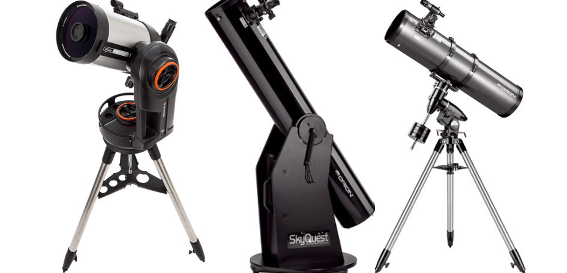

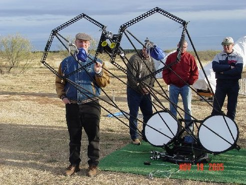

APERTURE

​​APERTURE size is important if you like deep sky objects (DSOs) like galaxies and globular clusters, or high resolution views of the planets.  Likewise, aperture size is important for the fastest photographic speed and when trying to see faint stuff from light polluted skies. 

In other words, unless you want your scopes portable, APERTURE is ALWAYS important!  APERTURE IS KING!

To elaborate, bigger apertures gives a larger opening for collecting light, which is the FIRST job of a telescope.  Most objects in the night sky are rather large and would be seen EASILY by the naked eye if they were bright enough.  Thus, the larger the aperture of the scope, the more likely you will be able to see these objects, even at very low magnifications.  

Secondly, aperture serves to provide increased resolution, or detail in your views.  While the quality of the atmospheric conditions, or "seeing," is the true limiting factor in this regard, most people will find that a good 10" scope will give great details for the majority of sky conditions.  Only occasionally will larger aperture scopes perform at their theoretical resolutions, though make no mistake about it, they will certainly provide some exciting views during moments of excellent seeing!  Of course, those living in good seeing areas, like on the coasts or atop a mountain, will be able to make best use of the resolution granted by large aperture scopes.

But the fact that bigger scopes will accumulate more light makes them the best, and often only, choice for viewing faint DSOs, regardless of how good your seeing tends to be.

The most common large aperture scope among amateurs is the reflector (aka, the Newtonian), mostly because it costs the least per inch of aperture when compared to other designs. Most observers of all levels of experience purchase these in the Dobsonian mounted-design because they give the most bang for the buck, sparing the customer the added cost of a good quality (or even bad) German equatorial mount.   Even so, some people, especially astrophotographers, will opt to spend thousands of dollars on an equatorial tracking mount to use with these such optical tubes, known also as optical tube assemblies (OTAs).   The larger the tube, the more robust and expensive such a mount becomes. 

Thus, the Dobsonian mount has become the most popular choice for general, deep sky observing.  It's pure, raw aperture with nothing other extravagances to be purchased. 

The big negative when considering the Dobsonian (or "Dob") is that you are generally limited in the accessories you can include, especially if you desire the telescope to track automatically with the stars, or even give you electronic "goto" functionality.  Often, these can be purchased as add-ons, however.   Electronic encoders, servo drives, and tracking platforms, especially the nice dual-axis ones, do add a lot more to the total, but those are options for a later date. They are nice options to have!

There are several makers of quality Dobsonian reflectors in sizes from 3" all the way up to 36".  Prices vary according to aperture size, optical quality, mechanical quality, and features (especially for "truss" designs" and those that might embed electronics).   Top notch makers include Obsession, Starmaster, Starsplitter, Teleport, and Mag-One, to name but a few. Good quality Dobs most commonly purchased are those made by larger companies such as Meade, Celestron, Orion, and Skywatcher.   These include budget options and a variety of performance packages, "bundles, or "kits."   

However, Dobs - and reflectors in general - that have custom optics will demand the highest prices.  If it comes with optics from the likes of Zambuto, Royce, or Pegasus then you can expect it to be a very nice telescope!  But be prepared to spend money in the thousands of dollars for such quality. 

Sidebar: Basic Telescope Mount Options
You made it to the Orion Telescopes website and you are confronted with some options.   Lots of them.  You are confused! 

But for now, you should know that a scope can come mounted in three different ways, represented below. 
Such scopes will typically be purchased with all you need to work it.  But if we play, "which one is NOT like the other," then you'll certainly pick the one in the middle.   This is the Dobsonian mounted scope.  But in this case, you lose the game.   

The correct answer is the scope on the right.   

And what makes this different?   It's the only scope where the optical tube assembly (OTA) can work separately from the mount on which it was purchased.   The first two scopes require you to use it exactly as pictured.  The first, a single fork-arm SCT, is a single unit, and must remain so for it's lifetime.   The dobsonian?  Same story.  

But the reflector on the right is purchased with a German Equatorial mount, known simply as an GEM or EQ mount.   You purchased them together as a "bundle," but if you wanted, you could remove the OTA from the mount and use another OTA on it.  Likewise, you could upgrade that mount to something "better" in the future, using the same reflector here. 

This aspect of telescope shopping is important to grasp, because as you advance in the hobby, regardless of the scope design, it's likely that you will be purchasing your instruments "al a carte," meaning that you might buy a nice EQ mount first, and then several other high-quality scopes (of varying types), and plan on interchanging them for whatever need you have on a given night.   

It's also the reason why something like a "Newtonian" reflector can come configured in so many different ways...perhaps mounted like a Dobsonian, riding atop an EQ mount, or even on a simple tripod.  

More importantly for you now, a scope is only as good as its weakest link.   So when you consider your first scope, perhaps something mounted like the scope on the right, then you should know that the OTA might be terrific, while the mount be almost impossible to use.    This, I hope, is something I can teach you to avoid.  
Aperture is King - In this case, "double" aperture is King! Shown is the 22" Sayres Binoscope, taken from CSAC near Crowell, Texas, in 2005. The first objective in the hobby will always be to funnel more light into your eyes. This does a good job of that.
"Central Obstruction" - A Schmidt-Cassegrain (SCT) is a "folded" design, where light bounces back upon itself twice. This puts a secondary mirror in the middle of the front corrector plate to bounce light straight back to the eyepiece. This creates a "central obstruction" (red arrow) that light must pass around. While newtonians have this too, held in place with "vanes or a spider," it doesn't have to be nearly as large as that of the SCT. This is because light still has a 1/3 of its path remaining in the SCT, whereas in the "newt" it only has a little more distance to go. The effect of this is slightly "less" contrast in the view, since more of the light energy is concentrated into the "diffraction rings" of star's PDF. These are fancy words to say that non-obstructed designs like refractors are naturally higher contrast, while designs with the largest obstructions are worse, like SCTS, RCs, and CDKs, among others. That said, practically speaking, if its a good telescope, well-collimated with pristine optical figure, then it's only the most experienced visual observer will likely detect the difference.
Another alternative when considering a telescope with larger apertures is the Schmidt-Cassegrains (SCTs).  These are excellent choices because they are more compact and portable for any given aperture - light folds back on itself twice, shortening the tube - and often contains some wonderful electronic features such as automatic GOTO pointing, where you tell the scope where to go and it goes there all by itself.  Thus, gadget "freaks" will certainly enjoy the ability to use their computers to control a large aperture scope.  Of course, these added features come at an increase in price.  Plus, they generally take a long cool-down time and are more susceptible to quality control issues because of the complexity of their electronics and mass-production techniques.  

​Some might say that the large central obstruction (see right) is a negative to the SCT design because of the general loss of contrast; however, my experience has been that contrast seems to fluctuate among samples of these scopes because of a variance in optical quality and poor user collimation from sample to sample. I've seen certain SCTs that exhibit some impressive, nicely contrasted views despite being obstructed.  In my opinion, these design trade-offs are minor negatives for a system that provides such great versatility and power.

Meade and Celestron are the main players here; Meade with their LX-series OTA (typically in 8", 10", 12" and 16" sizes) and Celestron with some iteration of the classical C-8, C-9.25, C-11, and C14 (the numbers are their aperture sizes in inches).   Both companies have EQ and fork mounted varieties, both in one and two fork-arm designs. 

Finally, many of the world's best astrophotographers and professional observators will choose the Ritchey-Chretien Cassegrain (RC) or Dall-Kirkham Cassegrain (DK) as their large aperture scope of choice.  These scopes generally combine the best qualities of all the other scope designs.  But this doesn't come cheap!  Expect to pay at least a $1000 per inch of aperture for such scopes.  Likewise, the classical Cassegrain offers larger apertures, as does the BRC (Baker) and Mewlon (DK) telescopes from Takahashi.  These are generally longer focal length designs and are still rather expensive.   

While many of these advanced scopes  aren't considered by beginner's from a budgetary standpoint, it's important to know of their existence, either to alleviate confusion or to allow you to start saving for one!

Regardless, when talking aperture, you will want at least 8" to 10" for visual observing of deep sky objects in dark skies.  This is widely considered the point at which galaxy details begin to appear.

Most amateur astronomers will say that aperture size is the most important consideration when deciding on a scope. It's hard to disagree!

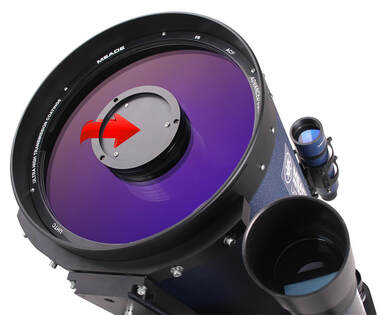
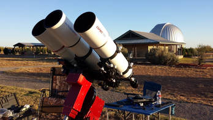
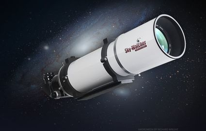
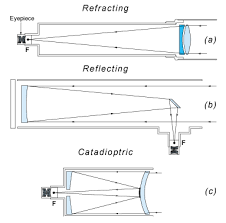
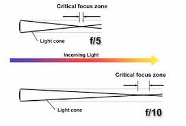

OPTICAL PERFORMANCE

Optics are typically the second consideration with a telescope, both in design and quality.   From a design standpoint, the nature of the optics - mirror or lens, number of elements, focal length - determines the portability (size and weight) of a scope.  Quality-wise, your choice of optics can mean sharpness of the view, fidelity of the color, and flatness of the field of view.  ​
"Triple Threat!" - Having fun with three 6" apos. Shown (from left to right) are a Takahashi TOA-150, Astro-Physics AP160 Starfire, and the Sky-Watcher Esprit 150. I was comparing the Tak and the Sky-Watcher for a Sky-Watcher advertisement using the same cameras simultaneously. The AP was the guidescope! Photo taken at CSAC (3RF) near Crowell, Texas. Buyer's might think that a scope costing twice the price will have twice the performance. Despite being half the price, the Esprit produces nearly equivalent results as the TOA. The difference in price is in construction and optical design, but those do not always lend themselves to overwhelming better performance.
While high quality optics are typically the domain of the astrophotographer or solar-system observer, it would be a mistake to think that great optics aren't a virtue for ANY telescope, regardless of the purpose or design.  In fact, I tend to be very sensitive to the quality of the optics even with a larger visual scope like a Dobsonian reflector.   It's day and night to me. 

Great optical performance as a function of design are typically associated with refractors; Maksutkov Cassegrains (Maks), and high-quality newtonians.  However, any design can have great optics in terms of quality.

Particularly great are those refractors that are described as apochromatic (APO).   These provide exquisite views with very good color correction, a problem with refractors in general.  The only caveat is that APOs come at substantial cost per inch of aperture.  

​For example, a 3" version will cost in the area of $500 to $2000, or more, and this only includes the OTA (optical tube assembly). As a rule of thumb, APO prices often double for each inch of aperture.  For example, let's look at pricing for Sky-Watcher's lineup of their best refractor, the "Esprit" (see Apochromatic Refractor Pricing). 

Takahashi, Astro-physics, TMB, Stellarvue, Sky-Watcher, Vixen, TEC, Williams Optics, Explore Scientific, and Televue all offer a variety of apochromatic refractors at various different price-points.   Be aware that not all similar sized APOs are treated equally.   For example, the Sky-Watcher Esprit 150mm telescope has a price of $6000, which seems really expensive until you look at the price of Takahashi's TOA-150 of $12,970 for the same aperture size.  I can confirm that the "Tak" is a great performer, but it's not twice the performer that the Sky-Watcher is.   As somebody with lot of experience with both telescopes (see "Triplet Threat" at left), you can take my word for that.  

Apochromatic
​Refractor Pricing 
Makers of quality APOs typically will have a price structure similar to those in the "Esprit" of Sky-Watcher refractors seen here:  

3" (80mm) - $1699
4" (100mm) - $2499
5" (120mm) - $3199
6" (150mm) - $6399

Priced competitively in the smaller apertures, Sky-watcher is able to beat the "double your cost for each inch of aperture"  rule of thumb.   This puts really good sized APOs (3" or 4") into the hands of relatively newer hobbyists. 
Sidebar: Basic Optical Tube Design
My fifth grade daughter had a science assignment recently that required her to know that light can do 3 different things when it encounters an object:  it can bounce (be reflected), bend (be transmitted), or be absorbed (causing heat).    A telescope is designed to utilize one or two of these dynamics to refocus light onto your eyeball.  

Diagram of three main telescope designs. Courtesy of Andrew Johnston at http://www.eaas.co.uk/
This gives rise to THREE different scope designs (above):  one that uses mirrors (reflectors), one that uses lenses (refractors), and one that uses BOTH mirrors and lenses (catadioptrics or "cats").   All of these designs require some way of mounting it, which is the subject of the previous SIDEBAR.  ​

One thing in common, regardless of the design, is that light has some distance to travel through the scope once it enters the scope.  More precisely, from the moment it hits the primary element, whether a mirror (in reflectors and cats) or a lens (in refractors), the light begins to be focused toward its "focal point."   This path from first contact (not including the corrector plate in an SCT) to the focal point is known as the focal length of the telescope.  The focal ratio (or f-number) will be the overall focal length divided by the scope's aperture.  In essence, this is a measure of how "steep" the cone of light is...or at what rate the light finds its focal point.

With lenses, where light can only be bent, it must travel along the full length of the optical tube and out the other end.   Thus, refractors are typically longer than most scopes at comparative aperture sizes.   With concave mirrored primaries, both the reflector and cat scope (most notably SCTs), will fold the light back in the direction the light came to hit a secondary mirror placed in the center of the scope's aperture end (see the note above on "central obstruction").  In a typical newtonian reflector, that smaller secondary mirror is also concave, angled 45 degrees to bounce the light out the side, a short distance to the eyepiece.  Compared to the refractor, the cutting-off of the light to the side of the scope as well as the typically short focal length of the primary mirror - lenses have typically longer focal lengths - means that the overall OTA of a newtonian reflector will often be shorter. 

A catadioptric, like a Schmidt (SCT) or Maksukov (Mak) Cassegrain, has a convex secondary mirror, which bounces light straight back toward the primary again, but this time the light "cone" is small enough to go through a hole in the primary and through the back of the telescope.   The eyepiece awaits on the back side of the scope.   In effect, the light has been twice folded back upon itself, which lends most "cats" the distinction of having a "folded" design.  More importantly, it allows the tube to be greatly shortened, making the design far more compact.  Similarly, because the secondaary is convex, it pushes light even further out of the back of the scope, meaning that longer focal lengths can be created with even shorter tube designs.   The net result is an OTA that's about 1/5th shorter than the focal length of the instrument; hence, the compact design.

We should be cautious about reflectors, however, since non-newtonian types of reflectors might do something different.  For example, a classical cassegrain, Ritchey-Chretien (RC), and Dall-Kirkham (DK) telescope, while being twice folded like a Schmidt or Maksukov (Mak) Cassegrain, are actually reflectors since they lack a lens element or corrector plate.   Interestingly, telescope-maker,  Planewave, markets their "CDK" , or "corrected Dall-Kirkham."  This design includes a pair of optical elements (lenses) just before the focal plane, making it a catadioptric design. 

Even more confounding, most any of the reflectors when used in imaging, especially RCs, will have optional field-flatteners/correctors sold as accessories, user-installed just before the focal plane.  Similarly, TeleVue produces their Paracorr, which is a correcting "eyepiece" that goes ahead of the typical eyepieces to correct the "coma" aberrations natural to a newtonian design.   What this goes to show is that the lines between the types of designs become very blurry in practical usage, since there is often a benefit to utilizing both lenses and mirrors as add-ons to traditional designs. 

Therefore, if you are confused by everything, then join the club!   

But rest assured none of that really matters right now, especially for the beginner.  However, since you've undoubtedly seen all the lingo in your research of prospective scopes, this discussion gives some context about what it all means.  

Refractors come in both achromatic and apochromatic designs.  This is necessary because refractive elements (lens) bend light differently at different frequencies.  You can see this with a typical prism, where light is spread out into a rainbow across its different frequencies.  As such, a telescope of a single lens element would be unable to focus all wavelengths at the same spot (a longitudinal error), meaning that red light (long waves) would be out of focus compared to the blue light (short waves).   Similarly, there is a component of lateral error as well, meaning that a lens cannot necessarily assure that all of a specific wavelength is focused on the same focal plane, since any distortion or magnification variance within the lens is wavelength specific as well.  

This, of course, is a problem...one in which mirrored scopes do NOT have...a big advantage with reflectors. 
​
The solution for this "chromaticism" within refractors is three-fold:  1.) use more elements, 2.) use elements of higher quality glass (extra-low dispersion or ED glass), and 3.) make the focal length long enough to increase the "zone of focus."  

An achromatic refractor, typically with two elements (made of low-cost crown and flint glasses), is designed to bring light to focus in two broad wavelengths, typically red and blue.  These "doublets" are easy to manufacture and are cost-effective, but they do not work to focus ALL the visible frequencies of light, most notably "violet."   As such, on bright objects like the moon and planets, purple fringing is typically seen on the edges.   This is called "spurious color" or "chromatic aberration."  This is even more obvious if they make the scope too short.  For this reason, many good achromatic doublets will be LONG, with f-ratios in excess of f/12 or f/15.   Longer scopes (high f-ratios) increase the critical zone of focus or depth of field (see image below), making it possible for all visible waves, albeit dispersed, to be contained within that focal zone.  Such scopes are good performers because they make best use of the design, working around its limitations.  

- image courtesy of Ron Wodaski's "The New CCD Astronomy"
Problematic for the first time scope buyer are those doublets known as "rich-field" refractors, which are made at f-ratios of f/5 to f/8.  These, as you would expect, have abundant color fringing!   If used on dim targets like star clusters and Milky Way vistas (hence the term "rich-field"), then there isn't too much issue, but if you hope to use such a scope to get good views of planets and the moon, then you will likely be disappointed.  Likewise, if you bought the scope because of the "fast" f-ratios to do astrophotography, then you will be disappointed when most all the stars in the image, especially those at the edges of field, are a nightmarish purple mess.  

As mentioned, color performance can be improved in refractors by adding more elements of glass, which of course raises the material and design cost of the instrument.   This gives birth to the "triplet" refractor.  Such a design is typically "apochromatic," meaning that it will be able to bring three broad wavelengths of light to focus, typically red, green, and blue.  This should also bring "violet," and all other visible wavelengths, into focus as well.  Though it should NOT be reasoned that all triplets are inherently apochromatic.  Typically, true "apo" (or APO) performance requires the use of one or more of the elements being made of a special, extra-low dispension or ED glass.   FPL-53 is the typical "ED" glass found in most of these refractor types, so if you have seen it listed in the specifications for an instrument, then now you know what it does!  

In some cases, a doublet-design can also be apochromatic in performance.  Takahashi, in particular, once made a line of fine "fluorite" element doublet refractors (they still do in short production runs).  Fluorite, which is a remarkably low dispersion glass that is grown in a lab, is now in too short supply to make these refractors in abundance; however, such fluorite doublets are wonderful, high-contrast instrument without a hint of spurious color.   Takahashi also utilized fluorite in their triplets and quadruplets, which if you are lucky enough to have, are some of the best visual scopes on the planet.   To my knowledge, the small volume-maker, TEC, and Takahashi (in a couple of short-production run scopes) are the only companies that still makes APO refractors with fluorite elements.  

Be careful of doublet refractors being marketed as ED APO scopes.  A doublet with a single ED element of FPL-53 glass might not be truly apochromatic in the technical sense of the term, especially if the scope is on the "fast" side...let's say below f/7 or f/8.  These scopes, because of their performance value are very attractive to buyers since they advertise APO performance at a bargain price.  However, when compared side-by-side with a good APO triplet, it's easy to see that their color-fidelity is somewhat lacking.   Today, because of consumer blow-back by those who know better, many distributors of these mostly Chinese-made "value" scopes have backed off the "ED APO" branding, choosing to advertise these doublets as "just" ED scopes.   However, these scopes are a great middle ground, a good value option, particularly for those wanting a good photographic instrument and are willing to compromise just slightly on performance. 

To clarify another aspect of refractors, especially triplets, lens elements can be configured as either "air-spaced" or "oil-spaced."   In the air-spaced design, lenses are only separated by a thin amount of air between them.  This means light must pass through six surfaces before it exits the lens "cell."   Each time it passes through an optical surface, from the dense glass to low density air, there is the possibility of internal reflections that can create a slight ghosting effect as you get farther from the center optical axis.  This is fixed by using coatings on the surfaces of those elements, which most modern triplets do today.

But when the elements ARE spaced with oil in between them, then the oil fills the gaps, making it behave as if the light passes only through two surfaces, the front of the first and the rear of the last.  No need to use surface coatings, albeit it's much more difficult to assure both chromatic AND spherical aberrations are tamed.  

A good oil-spaced triplet is delight to use, high-contrast and very well corrected for aberrations, though it typically takes an advanced observer to appreciate it.  It also comes to thermal equilibrium very quickly!   An "oil-spaced" triplet is a rare breed today, since companies can get great performance in all aspects with the cheaper, air-spaced design. But companies like TEC still utilize the expensive "oil-spaced" design in their scopes.   Having used their TEC 140FL, TEC 180FL, and TEC 210FL models, which are also "fluorite" triplets, these are the very best views I've ever had through any telescope at their given apertures. 

Other oil-spaced triplets that I've used in the past include the William Optics FLT-110 f/6.5 and various Astro-Physics models.  Even today, for me, they represent some of the very BEST in optical triplet performance.   

Finally, another refractor design, also apochromatic, is the 4-element Petzval design.  It typically utilizes a color-correcting lens pair up front, with one-or-both elements of fluorite or FPL-53 glass, and an additional "field-flattening" pair of elements in the back of the scope.  Obviously expensive and wonderfully pristine in performance, it's typically the best refractor you can find if astroimaging is your desire.  The Takahashi FSQ-series of scopes utilizes this design, as does the TeleVue NP-series of APO Refractors.   Per inch of aperture, these scopes are the best optical instruments there is when you demand the best color-correction combined with the ultimate in field-flatness.   Both traits are highly desirable when imaging with today's larger sensors, so much so that most people purchase "field-flatteners" to be used with the already pristine doublet and triplet apos. 

Portable? Don't forget the mount! Shown is a Takahashi FS-78 on a Losmandy GM-8 mount, taken around 2002. APOS are immanently portable, but once you account for a good quality mount, especially for photography, you can get a bad back really fast...and of course, a mount doesn't fit in an airplane carry-on. In this case, the GM-8 is actually one of the more portable mounts you'll find. Quick tips...mailing you gear ahead of you OR checking them as baggage on your flight are good ways to have your imaging cake and eat it too.
Anything bigger than 6 or 7 inches in any refractor becomes extremely large, heavy, and expensive, especially if its an APO.   I have experience with many larger APO refractors, including a TMB 203mm; and both the TEC 180FL and TEC 200FL fluorite refractors.  The views through the TECs (which are air-spaced triplets) are some of the best views I've ever witnessed through a telescope.    I also have regular access to a 15" f/12 doublet refractor with D&G optics (a 19 foot long refractor).  Whereas the views aren't particular well color-corrected on bright objects, the 15" refractor at the Comanche Springs Astronomy Campus in Crowell, Texas (3RF) definitely makes globular clusters look like grains of fine sugar! 

But not all high quality refractors are expensive.   Many makers now produce exceptionally nice, small APOs in the 2" to 4" range that can be had for very reasonable amount of money, perhaps in the area of $500 to $1200..   Such models are highly recommended for the aspiring astrophotographer who is on a tight budget, or the informed beginner who is serious about "doing it right."

Most of us who own APOs settle for scopes in the 3" or 4" range because of price considerations and portability concerns.  Of course, we eventually yearn for more.  But apochromatic refractors, and to a lesser extent achromatic refractors (achros), have such high contrast due to their quality optics, lack of central obstruction, high color correction (not with an achros), anti-reflective coatings, and internal baffling that they tend to show objects in similar detail to that of scopes slightly larger in size.   They even seem to have the ability to cut through nights of poor seeing to give steady views when you wouldn't be able to see anything otherwise, though this is perhaps more of a function of their smaller aperture sizes yielding less resolution.  

Beyond refractors, large Newtonians reflectors (FYI, a Dobsonian is a type of Newtonian) with great optics will yield uncompromised views.  Newtonians, as well as APO refractors, will have wide fields of view (in smaller focal ratios) providing the luxury of seeing more of the sky at once.   But many will find that such large reflectors are too cumbersome when compared to the size/performance of a refractor.  Plus, big reflectors are difficult to keep centered on planets unless they are equatorially mounted, configured with motors, or sit on a tracking platform.   Thus, for pure planetary performance, I recommend the apochromatic refractor (if not the more capable planetary imaging scope, the SCT).

But don't think for one second that reflectors take second billing to refractors.  A large newtonian with terrific optics tracking on a planet like Jupiter or Saturn is a mind blowing experience.  If the atmospheric "seeing" is stable, then crank up the power (over 500x) and you might have the greatest eyepiece view of an object that you'll ever experience!  

The aforementioned Maksukov-Cassegrains (Maks) are also good alternatives when looking for scopes of excellent optical performance.  The legendary 3.5" Questar is the classic example, but most of the major telescope makers now produce some model of Mak-variant. Costing as much, or more, than APO refractors, the Questar is the prime example of how good these scopes can be, though it is an outlier from the standpoint of price - most are quite affordable by comparison.   The Meade and Celestron series of Maks comprises the larger market-share, though Orion, Explore Scientific, and Sky-Watcher now produces them as well.  

Maks are often overlooked, but they too have really nice optical performance chiefly because the design employs a smaller central-obstruction for higher contrast views.  Moreover, these scopes often come packaged with fork mounts and the luxury of GOTO drives, just like the SCTs - albeit I feel that these features are often under-utilized in the smaller aperture sizes (a source of criticism among amateurs).   After all, what good is an object-library of 40,000 items if your 3" scope will only show you a few hundred of them from your light polluted site?  

Maks do have longer focal lengths than normal scopes (which is why the central obstruction is so small).   This makes them excellent planetary scopes due to the fact that they are more powerful with any given eyepiece and, of course, due to their higher contrast views when compared to other obstructed designs.  

Astrophotographers of deep-sky targets would say that Maks do not make good imaging scopes - though they are wonderful for bright targets like the moon and planets.   I would concur with this opinion as a general statement, but being f/15 does not negate a Mak-design from taking great images IF you are matching the camera's pixel size to the focal length of the instrument.  At that point, there is no performance disadvantage despite the "slower" speed.   Many people will also say that the narrow fields of view are also a real negative to these Mak designs, but I'd tend to disagree.  Wide-field eyepieces and focal reducers are available to give you wide enough views, if needed.   

Lastly, I feel that the only remaining negative to these scopes would be their general quality, especially their enclosures, and the increased likelihood that the scope's electronics gives it more reasons to find its way into the repair shop.  
​

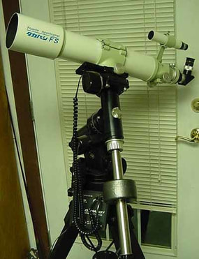
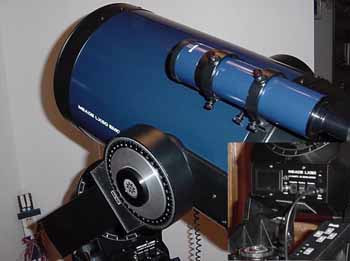

PORTABILITY

The third consideration when looking to buy a scope is PORTABILITY.   This could be considered the most important factor, especially if you need to travel to dark sky sites or desire quick setup observations (see this article on the importance of dark skies for viewing here).  Likewise, many of us struggle with larger gear as we age!   

Scopes bigger than 10" are very difficult to transport (SCTs due to the weight and reflectors due to the size), which is a big reason why many of these scopes never get used.   So, this must be considered in any purchase decision.   For example while being a great performer, a 16" Dobsonian (non-truss variety) cannot be carried in anything smaller than a cargo plane (a little exaggeration, but not far off).   Likewise, my old 10" LX-200 SCT (yes, I still have it) weighs somewhere around 50 lbs., not including the huge, heavy tripod and wedge (optional).  8" in aperture is generally the largest scope among reflectors and SCTs that most would considered "portable."  Of course, "portability," in the mind of most advanced astronomers, is determined by their passion.  After all, it's amazing how "portable" something becomes when you are sufficiently motivated!

Otherwise, larger scopes are best when you can set them up permanently at home, either in your own observatory or rolled out from the garage.   Of course, this would require reasonably dark skies to begin with, something that a growing majority of people no longer have.   

Because of this, it becomes necessary to consider scopes that can be toted easily to darker sky sites.  Some examples are most Maks, smaller Dobsonian reflectors, and smaller refractors on alt-az or light-weight German equatorial mounts (see the SIDEBAR: ALT-AZ VS. EQ below for a distinction between these mounts).   These can be good first telescopes, especially considering their lower prices.  A person who buys a scope that never gets used will probably leave the hobby prior to finding out how truly wonderful it is.   Lack of portability is a major reason why. 

Therefore, quite often the best scope for YOU is the scope you will use most often.
QUALITY

Another important concern, quality, usually scales inversely with portability - high quality often equates to heavier, well-built gear. 

While we've already discussed the necessity of quality optics, the other components such as mounts, focusers, tubes, mirrors/lens, etc., can make or break your enjoyment of the hobby. Because many scopes are mass-produced, the potential for sub-par quality, or inconsistent quality controls, are always there.   This could come in the form of poor optics, breakable plastic parts, and limited or inaccurate electronics, to name just a few.   For this reason, there is a central truth to astronomy, "YOU GET WHAT YOU PAY FOR..."  As with anything else in life, if you put money into it you'll be purchasing a certain amount of quality, and the more you pay, the more quality you get!

Scopes less than $300 have the potential to be real pieces of excrement, the exception being some smaller sized reflectors.   Some makes like Tasco, Jason and Bushnell, along with the consumer-lines of Meade and Celestrons found at places like Wal-Mart, should be avoided at all costs.   These classes of scopes might be suitable for people with low budgets, especially if their expectations of the scope match their budgets, but generally speaking, a good pair of binoculars will likely be the wiser purchase.

Few scopes have perfect track records where quality is concerned.   For example, some of the "all-in-one" types of scopes suffer from poor workmanship in the form of mickey-mouse gears and plastic castings, even though the optics remain of good quality.  And even some of the flagship models from these makers will still have plastic gears.  User reports help the most when determining which scopes (and mounts) have the best quality.

You should understand that "quality" makes itself most evident in the mount.   Remember this rule: A GOOD SCOPE WITH A BAD MOUNT BECOMES A BAD SCOPE.   Shaky or undersized mounts should be avoided at all costs. As much time should be used in considering the mount as the scope itself, and if you are interested in astrophotography, the mount is by FAR the most important component in the system.  If you are going to buy quality, make sure it comes in the mount!
My First Telescope - In 1997, I purchased this 10" Meade LX-50 Schmidt-Cassegrain, or simply "SCT." Typically more expensive than a "first" telescope, they are the KING of flexibility, serving as excellent visual instruments, imagers, and even a tracking platform for piggybacked scopes or lenses. For the gear-head or tech-guy who fancies a mix of fun, the SCT is really hard to beat without totally breaking the bank.
FLEXIBILITY

You might need to consider FLEXIBILITY when considering your scope.   You'll know more about this trait after you do your homework and you'll likely understand its importance after a year or two in the hobby.   For example, if you decide that you want to do astrophotography, then you might want a scope that has the versatility of both a good visual and astropix platform.   SCTs are the masters of versatility, designed to be accommodated with tons of options and enhancements that make these scopes extremely powerful in the hands of even the most casual of observers.  

Be careful with some of the extras that come with computerized scopes.  While GPS or auto-set capabilities are pretty much standard equipment today, they generally provide very little in the way of excess flexibility.  After all, if you only use the scope at home, then GPS really only helps on the first night of observing.   

Also, smaller scopes are great because they are highly portable, but you lose some flexibility because their aperture sizes make them less optimal scopes for a wide-variety of observing.   So, you must strike a balance with other features you might feel are important.

Generally speaking, the more money you pay for a scope, the more versatile or flexible it becomes, until the point where gear becomes more specialized.  This is especially true of astrophotography setups, where scopes and mounts are designed with only that in mind.  For this reason, many amateurs will own more than one such scope, each of which has the purpose of doing something different, yet doing it exceptionally well!   Thus, we would be more likely to purchase individual pieces to accomplish multiple tasks. 

Most beginners desire to see a bit of everything, and do a bit of everything with their first telescopes, making FLEXIBILITY a higher priority than it probably should be.   For example, despite the highly recommended 8" Dobsonian reflector being a really great purchase, there is a possibility that you'll be a little disappointed at how "plain" it is.   It lacks a lot of the bells and whistles you'll find with other electronic scopes.   It's also a poor choice for astrophotography.   But that doesn't mean it's not the scope you should buy for your first instrument!  

Likewise, those that purchase a small, rich-field refractor will be very disappointed with the views they get on planets.  Rich-field refractors simply aren't designed for anything other than wide-field views of the Milky Way and star clusters from darker skies.   So, do NOT over-prioritize flexibility in an instrument...you cannot expect a small investment to be good at a TON of things!

Therefore, as a beginner, you should probably temper your expectations a little bit and purchase a good telescope for visual use only, since the more versatile scopes are also more complex, not to mention more expensive.  Allow yourself some time before you look for versatility in a scope...save such things for your second one!  
Sidebar: Chinese Value Options
Americans often swell with pride when we see the "Made in the USA" label.  And maybe we should.  Companies like Celestron and Meade; boutique telescope-builders like Astro-Physics and Stellarvue and TEC and Planewave; and scope/eyepiece juggernaut, TeleVue, are all companies that originate right here in America.  

American pride must seem strange, or even narcissistic, to my non-American readers. They probably are better aware than we are that American companies outsource seemingly everything from overseas.   If it's not the whole product, then it's likely the assembly.  Apple iPhones are less "American" than Toyota pick-up trucks.        

It's those aspects of this hobby that lead to confusion...simply put, the majority of budget products (and even some pricey ones) that you are seeing in your online research from American companies are predominantly Chinese made.   

While there are indeed great astronomy items that are conceived, designed, and manufactured in the USA, those likely aren't the items that a newbie to the hobby is shopping for.   More importantly, for you the uninformed, you need to know how this hobby works; how it HAS worked for ages.   

Compare the following mounts from 5 major retailers...
 
Celestron
 

Each of these mounts is the EQ-3 type mount, produced in China by Taiwai-based Synta Corp.  All prices similarly in a base configuration, a touch of paint, labels, and perhaps the tripod are all that sets them apart.   Some companies might have found ways to add electronics to this mount, as Orion has in this picture, but the consumer has to know that they are essentially the same thing.  

Synta has produced these mount for ages (beginning in 1992), ranging from the EQ-1, which comes as the most basic of any company's cheapest telescope offerings, to the EQ-6, which is a hefty mount that can exceed the $1500 price tag in certain situations (it's a very configurable mount from an electronic aspect). 

Traditionally, the most popular has been the EQ-5 type of mount, that many people might know better as the Celestron AVX or Meade LX85.  Again depending on maker and the options if had, this is essentially the same mount...and almost all telescope retailers have a version priced somewhere in the $700 to $1100 range.  

In most cases, the origin of the mount can be identified within the model name for each company.  If you see CG-5, EQ-5, HEQ-5, or any mount with a 5, it's likely the same mount.  Same with alt-az mounts, AZ1, AZ2, AZ3, and AZ4...yep, all Synta. 

Of course, they make most of the OTAs as well.  If a company advertises a budget 70mm refractor, a 4.5" reflector (also known as the 114mm), all the way up in size...it's Synta.    Anything sold by Orion telescopes is Synta, and that includes the XT-series of Dobs and the 80ED and 100ED doublet ED/APO refractors.   Again, NOT everything "Synta" is bad.  Those refractors, which I criticized for the "ED/APO" label elsewhere in this Guide, I also praised for being a really good value performer.  And more than once in this Buyer's Guide I have recommended the Orion XT-8 dob as my "favorite recommendation" for a serious, beginning observer.   Oh, and the Skywatcher 8" Classic Dob is the same scope.  Compare below...
Two of my favorite scopes to recommend to serious beginners are the Sky Watcher 80" Classic Dobsonian (on the left) and the Orion SkyQuest XT8 Classic Dob (on the right). Well, actually they are the same scope, with only a slight change to the rocker box. - Click to see bigger.
Incidently, Synta isn't responsible for everything, nor is China.  Many American companies also source from Guan Sheng Optical (GSO) in Taiwai.   All those accessories like focusers, eyepieces, finderscopes, and adapters that come WITH all those telescope bundles?   That's GSO.    Oh, and how about all those Ritchey-Chretien (RC) tubes you see on Orion.  Heck, those are even labeled "GSO" in the model name. 

And any of the other items on those webpages you are surfing, like some of the 6" and 9" newts or the 93mm refractors...you have GSO to thank for that.    

Most people who've been in this hobby know this information.  Some are bothered by it; yet others like me celebrate it, because we know that such value options help grow the hobby that we love.   Now that YOU know it, use it....look for similarities in products, shop more specifically at an online dealer/distributor because you hear good things about the company or the "product line."  In essence, within the first $1000 in this hobby, much of what you see from a company is ALSO offered by somebody else...or many somebody's.   

There are USA-made scopes from Meade and Celestron, most notably the SCTs and Maks, the success on which those companies were built.  But to compete with retailers, Meade and Celestron are also forced to source many of the budget telescopes on their website; sales of which are responsible for the bulk of their income.

Don't be disappointed in this fact.  Instead, celebrate that open competition in these markets gives you many more choices at much lower prices.  While the choices are overwhelming sometimes, it's not a bad problem to have!

Dobsonians, like this 10" Sky-Watcher, deliver the most visual performance for your money. You can't go wrong with an instrument like this and it will likely out-live you. This truss version (for a little more money), is even collapsible, increasing its portability.
OTHER FACTORS

​After the "main five" qualities, there are several other aspects to consider before running out and purchasing that "beginner's scope."    Whether its value, ease of use, resale value, or photographic capabilities, it's extra information that will make you feel good about your purchase.  

"Bang for the Buck"

Want to know the number one reason why I'm fat?   It's because I expect the MOST food for my money.   Growing up, I heard my father always grade a restaurant by "how much do you get for your money."    Now, I'm not sure if this is mostly an American trait, but it definitely impacts the way I look at food...and consequently having a huge effect on my health!   

As consumers, everybody wants to know that our money is well-spent.   While we definitely want a large "bang for the buck," we should understand that you have to spend a certain amount of money in order to get quality, reliable gear in our hobby.   As a beginner, we should be very concerned about buying bad gear, since there is a lot of it out there.   But, neither do we want to take a "buy once, cry once," philosophy.   You don't HAVE to go crazy!  

Thus, your overall budget should be moderately sufficient to acquire not only a capable telescope, but also the accessories you will need to operate it. 

Because scopes of big aperture show you more things, then it stands to reason that the biggest "bang" will come from putting your money mostly into the aperture.   This favors mirrors (reflectors) over lenses (refractors).   And from the standpoint of cost, the cheapest way to deliver that aperture is often preferred.   This is where the Dobsonian telescope has a large advantage.   Placed into an easy-to-push "rocker box," whereas the light can bounce back up to the eyepiece, such scopes are the simplest way to deliver photons to your eyes.   

Therefore, the secondary aspect to getting "good value" comes in avoiding spending money on electronics with a telescope, something that most people will add later, once they are more familiar with the hobby or they determined a specialized direction to go. 

For these reasons, Dobsonian reflectors deliver the most visual performance for your money, by far.   A 10" manual version, which is enough to last a life-time, can be had for under $500, including accessories.   These scopes are perfect for learning the sky, are reliable since they have no electronics to breakdown, and they show you more of the sky than another comparative telescope.   ​

​When in doubt, get a Dob!

Then again, there's another consideration, one that deals with making choices among certain types of gear.   For example, perhaps you want to do a little photography and see people buying a particular mount...or you've heard people tell you that the "CG-5" or "AVX" is the least mount they can recommend.  And certainly, such might be good advice, since such mounts DO represent good value choices in the hobby.    As such, "bang for the buck" might just mean making a value choice that delivers 80% of the performance of something twice as expensive.  In our discussion on OPTICAL PERFORMANCE, I mentioned that SkyWatcher Apo refractors were a high performance, yet great value choice compared to those from Takahashi, Astro-Physics, and the like.    But what I did NOT mention at that time is that these scopes are chinese-made, although SkyWatcher-USA outsources them.   I know.  Not 'Merican...for shame!    

Now it might be a moot point for you anyway, since even those scope are WAY out of your budget.   But one of the things to know is that MANY companies that you are looking at now, including Celestron, Orion, Explore Scientific, iOptron, Meade, and SkyWatcher...they ALL have items in their product lines that are sourced from China.   More specifically, one main company known as Synta (which is the parent company for Celestron and SkyWatcher-USA).   And this begins to make a little more sense when you see the similarities between various products (see Sidebar: Chinese Value Options at left).

I tell you this here because not all chinese-made things are bad, much of it is good "bang for the buck," AND the confusion when comparison shopping can be GREATLY eliminated once you realize how many of those products are actually the same thing.   
Resale Value

Like most anything you buy, purchasing new comes with an immediate depreciation in value.  Other than Astro-Physics refractors, nothing ever appreciates in this hobby.  These are not "investments" in the financial sense of the word, even if they are an investment in your educational or developmental well-being!   

Many telescopes (and gear) are purchased on the used market to avoid this initial hit, just as there is a large market for used or "pre-owned" cars.   In many cases, a person can resell telescopes for the same price they paid for them...maybe even better.    

For the beginner, however, I recommend you AVOID the used market.  There's simply too much risk for those without experience and knowledge in this hobby.  

While I feel that what you purchase should last a lifetime, most beginners, graduating to intermediate stages, will eventually trade-up to better, more capable, or more specialized equipment.   If you feel that this is you, then equipment with good resale value should be a consideration. 

A few tips here.    Anything with electronics will typically show the largest depreciation.   After all, technology becomes obsolete rapidly now-a-days.   While mounts will typically perform for a LONG time just as they were when brand new, they don't necessarily carry good resale margins.  Simply put, people tend to buy "new" on electronics.   If you do resell electronics, then you will want to sell them sooner rather than later.  

Cameras are the worse.   They sell only for a fraction of their value over time...especially for equipment over a decade old.   Now, this is good if you want to purchase a good astro CCD camera with "low mileage," but it's not good if you are the seller.  

Optics without electronics, such as high-quality, high-performing APO refractors yield the best opportunity for resale.  Such optics are always in demand, as people recognize that performance doesn't decrease dramatically (if at all) over time.   Some manufacturers are better than others here, with Astro-Physics and Takahashi being the leaders.   

Similarly, some designs are in higher demand than others.   Petzval-based refractors and those with oil-spaced or fluorite lenses are very attractive.   Also, mirrors from well-known custom makers (i.e. Zambuto) always carry a premium...and many people will pay almost new prices for used gear just to circumvent the build-time (often measured in years) for certain optics.   An Astro-Physics refractor is the classic example of this principle, as their wait-list for current refractors is about 7 years long.   Thus, people who want such instruments will often pay full retail price (or more) for used gear, saving 7 years of agonizing waiting!  

Larger instruments are the most difficult to resell, obviously due to their size.   Shipping is a pain...and costly.   So, resale is often limited to local-only, where the demand will be much less.   Thus, smaller instruments, especially portable optics like APO refractors, will be the easiest to move.  

Ease of Use

When you start adding electronics, as awesome as they are, you start raising the complexity of the instrument and, therefore, its learning curve.  From a purely visual standpoint, learning the sky takes significant effort on its own, so adding electronics on top of that can make for a difficult hurdle to overcome, especially for the casual hobbyist who doesn't get out very often!    So, the less you do it, the more you better choose equipment you KNOW you can use.   

Some of us are motivated as much by the cool gear as we are the night skies themselves.  That was certainly a driving force for me as I persistently spent night after night under the stars.  In fact, astrophotography can become addictive, once you've overcome a difficult learning curve and have invested in some higher-quality equipment.   Thus, I do not want to neglect that aspect, since many people might find motivation in such things.  

But for the majority of beginners, you might find yourself quickly frustrated by your equipment, which is the leading cause for why people fail to stick to it!   

Once again, Dobsonian reflectors are the leaders here.   Coupled with their large apertures, ease of use is what makes us recommend Dobs so quickly to beginners seeking a "first telescope." 

Similarly, a small refractor on a basic alt-az mount (see SIDEBAR: ALT-AZ VS. EQ at right).

And as I said before, more money usually leads to more complexity, either in the purchase of electronics, or the necessity of purchasing electronic-based gear in order to get full use of their telescopes, such as good mounts and cameras for use with already expensive APO refractors!
Photographic Capabilities

Most beginners want a telescope to view the skies.  It's only later that they realize that hooking up a camera is a natural evolution of the hobby, and a generally COOL thing to do.   But not all forms of astroimaging are treated equally - different telescopes yield different results.  This is why the camera industry has different lenses for your camera - and scopes work exactly like camera lenses in this regard.  

But just in case photography is important in your first scope (i.e. you have a large budget than the typical beginner), then let's talk briefly about four different areas of imaging and how they affect your choice in telescopes...​
Lunar/Planetary
Lunar/Planetary Imaging - One of easier methods to get started in imaging is to hook a DSLR or video camera to your long-focal length scope, point at the moon or planets, and let 'er rip!  With free software, you can produce mind blowing images with a little practice.   SCTs are the preferred scopes here, though it's possible with Dobs if you have built-in tracking. 
Wide-Field
Wide-field (or short focal length) Imaging - When you first start with serious imaging of deep sky objects (DSOs) and you have the money to invest, you will want an equatorially-mounted scope in a relatively shorter focal lengths.  Small imaging newts, small apo refractors, and especially camera lenses are the best choices.  In fact, even if you have a longer focal length SCT and a wedge, it's smart and satisfying piggybacking these shorter focal length optics atop the main scope. 
DSO Imaging
Long Focal Length Imaging - This most difficult form of astrophotography due to the long exposure times requiring a premium on instrument performance, learning curve, and cost.   I recommend longer focal length APOs, RCs, and SCTs when you want to capture galaxies, globular clusters, and some of the night skies "smaller" features.   "Longer" however is relative.  With some of the small pixel CMOS cameras available to us today, focal lengths less than 1000mm in many cases will deliver maximum imaging resolution. 
Solar
Solar Imaging - To take a picture of the sun, you can purchase a white light solar filter for your telescope, any telescope, and shoot away.  Thus, there is no specific requirements here...just be well informed and keep it safe.   But there are also dedicated instruments that ONLY image the sun.  These h-alpha solar scopes go beyond the scope of this article. though you should look into a Coronado PST if you want to explore some great solar views for less than a grand. 

Sidebar: "Alt-az" vs. "EQ"
- Courtesy of Starry Hill Observatory at www.starryhill.org
Shown in the picture above, mounts come in two varieties in terms of how we align them. 

"Alt-az" or altitude-azimuth mounts are quite simple...rotating the scope is an azimuth move and raising the scopes is an altitude move.  As such, mounts like these can be made simply and cheaply, making them easily portable.  They are also free of difficulties in terms of use. 

Both axes can be equipped with encoders and motors, which is the typical fork-armed SCT setup (Meade LXs and Celestron Nexstars).  These take advantage of on-board electronics to know exactly where an object is at any given time, coordinates that are mapped out at (azimuth, altitude).   These "GOTO" scopes are very popular, keeping in mind that ANY electronics increases the learning curve with such instruments, as well as one more thing that could break.  Similarly, the alt-az Dobsonian scope may be configured with encoders that indicate the coordinates in which the scope is directed.  These "push-to" electronics are often sold as extra bundles to existing dobs for some extra money.  For example, with Orion XT dobs, this is the difference between the "Classic" and the "Intelliscope" versions, which have a $250 price differential for same aperture scopes.   

With motors, electronics, and heavy fork-arms (like with SCTs), the non-dobsonian alt-az mount ceases being light-weight and simple.  When beefed up to hold large OTAs, they can be monstrous.  It should also be said that such alt-az scopes, even those with tracking motors in both axes, are not photographic instruments because of a dynamic called "field rotation."  Over the time of a longer exposure, the camera view will rotate around the center of optical axis unless the scope is equatorially-mounted.  For this reason, many scopes like SCTs have a "wedge" accessory that allows you to mount the same scope equatorially.  Wedges are heavy.  This makes such setup even LESS portable and much more complex in use.   

"EQ" or equatorial mounts, are tilted to point toward the celestial pole, which lies above the earth's axis of rotation.   As such, aligning to the celestial pole (very near Polaris or the "North Star" for northern hemisphere users) allows the mount to accurately track the stars by using a single motor, which spins at the earth's rotational speed.   This is highly desired for photographers, since a well-aligned EQ mount will run happily all night on an object without any issues.  No field rotation to speak of.   Even manually, one just has to turn one knob (the RA knob) to keep up with the earth's rotation. 

A good EQ mount will typically be motorized on both axes, and when equipped with a electronics the positions of objects can be dialed in according to the (Right Ascension, Declination) coordinates for any given time.   EQ mounts require a beefier setup for greater accuracy and heavier payloads, and for this reason many of these lack the portability of a simple, motorless alt-az setup.  

There is a smaller type of EQ mount popular today known as "tracker" mounts.  Such mounts allow for very small payloads like smaller refractor and camera lenses.  Motorized, these light-weight mounts can be quickly "polar aligned" and left to track an object all-night.   These will typically NOT be GOTO mounts, so be sure you know how to find the objects yourself.  
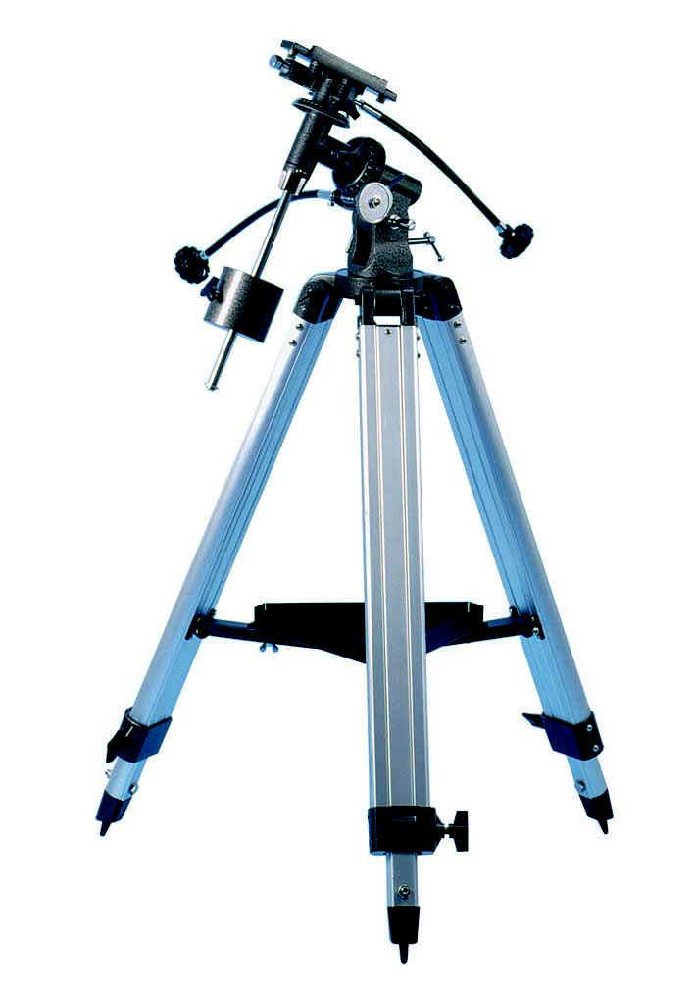
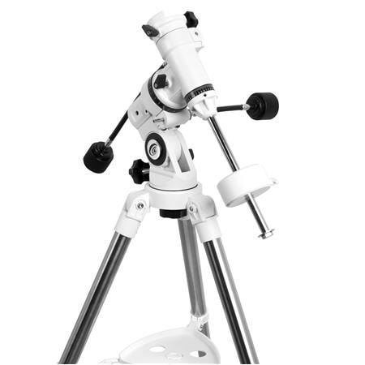
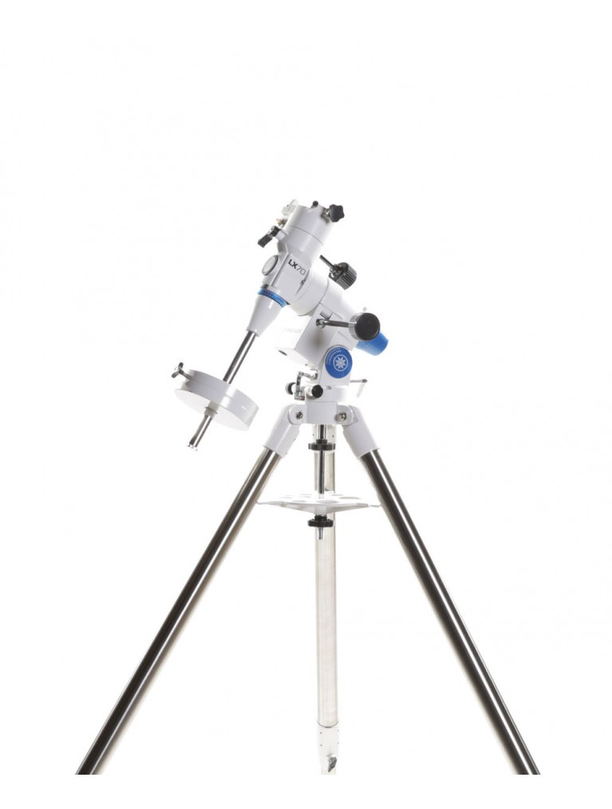
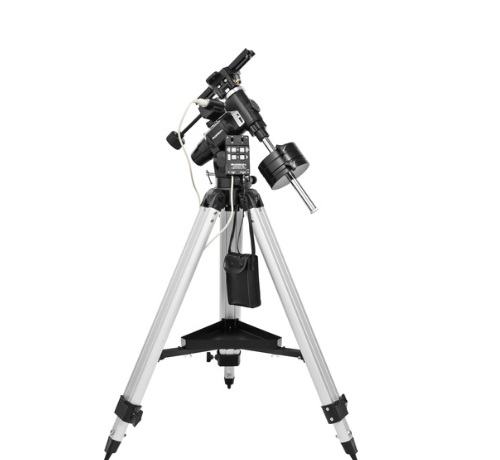
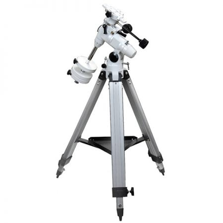
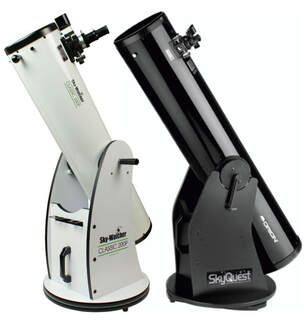
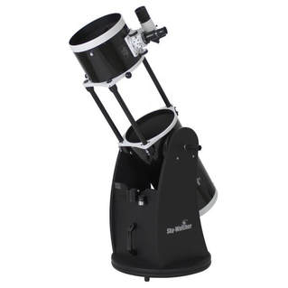
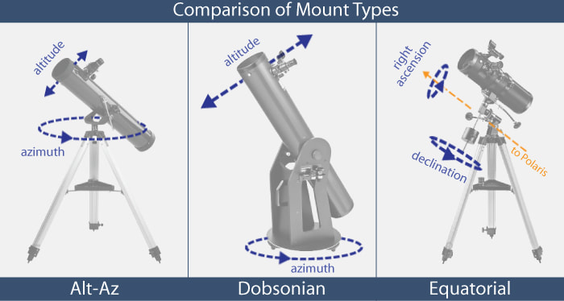

SUMMING IT ALL UP

We have outlined several things to consider before purchasing a scope, categories that EVERYBODY looks at when evaluating which scope meets their needs.    Of course, with a true beginner, seldom do you know what your needs are!     This is why, after all, choosing a scope can be so difficult when you first start in this hobby.    

Below I have ranked scope types according to each category on a 1-10 scale.  1 is "low" and 10 is "high."  ​
 

Dobs

SCTs

Maks

APOs

RC/CDK/Cass

Achros

Newts

Fast Astrographs

  Category Summary 

Aperture

10

8

5

2

8

3

9

7

Dobs are the best way to have massive aperture outside of a permanent enclosure (observatory), where the "folded" designs rule.  Short newts (on an EQ mount) are practical as well.  

Optical Performance

5

5

6

10

9

4

6

5

The least obstructed design combined with the best quality in optics makes APOs the easy winner.

Portability

5

4

10

8

3

8

1

5

Maks for all-around portability; small APOS for airline travel (especially on alt-az mounts); larger refractors are not as portable as one might think; Dobs are portable for their aperture size.

Quality

7

5

4

9

10

3

5

5

The imaging designs (RC, CDK, BRC) and other classical types of casses and DKs must be high quality to perform.  There is some variance with cheaper APOs, but most are generally solid.  Larger custom-dobs can be special. ​

Flexibility

3

8

3

6

2

2

5

1

SCTs are the jack-of-all-trades scope; bigger APOs are versatile for quality of visuals, planetary-use, and imaging.  ​

Bang for the Buck

10

6

5

3

2

5

8

4

Massive aperture for low cost is the Dob's trademark; SCTs are reasonably priced for their versatility; chinese "value" APOs and newts can be good performers as well.

DSO Imaging

1

8

2

8

10

2

7

8

For single objects, folded designs win the day; for wide-fields, nothing beats an APO refractor short of a fast astrograph like a Celestron RASA or Tak Epsilon. ​ Short newts the budget option for a highly capable DSO setup.

Lunar/Planetary Imaging

5

9

9

5

5

2

6

3

The world's greatest amateur planetary images are taken with SCTs.  Big aperture dobs give good views until you raise the power and watch them scoot too quickly across the eyepiece.  Tracking scopes are preferred.

Resale Value

4

3

3

7

8

2

5

5

APOS return most of their value upon resale, especially if you purchase used in the first place. 

Wide Field imaging

1

2

1

10

2

3

5

8

Bigger astrographs can't go exceptionally wide like an APO can, but they are amazing for wide-fields.  Epsilons are tricky.   APOS are the overwhelming, majority choice here.  

Cost

5

6

3

9

10

2

5

7

Scopes built for imaging or those with custom optics (especially with multi-elements) are the most expensive. 

Ease of Use

8

6

6

5

2

4

4

3

Dobs are the easiest to use, followed by any small scope on an alt-az mount.   Other scopes typically come with electronics that can raise the learning curve.  Same with EQ mounts. 
Priced at around $55, 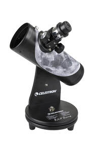

this Celestron Firstscope (Robert Reeves Signature Series) is a decent performer compared to a lot of the cheaper EQ setups you'd purchase for a little more. The nice thing, other than having the knowledge that Robert is a friend, is that you won't be greatly put-out if you are disappointed. It's simple and easy to use...and that makes scopes like this (and full-sized dobs) a safe choice for a first scope.
HOW TO CHOOSE?

As I said, with all the choices, true beginners are at a disadvantage.  But you can start by asking yourself what it is you'd like to do and how much you are willing to pay for it?   When we ask this question of people online in various forums, the typical person will indicate that they want to "see everything and do some photography."  Hopefully, in my presentation to this point, you realize that the MORE you hope a scope will do, the more likely the price tag becomes something you fail to anticipate.   
Quite simply, for most, I recommend that you keep it simple and get a visual instrument.  In this way, you know you will be getting one tool, well chosen for the job.  Your likelihood of being dissatisfied with your choice lessens when you have fewer expectations of it. 

However, if you are like me, you might be wiling to spend a little more deeply into your pocket-book.   As an adult with adult money, I typically am willing to enter new hobbies with an attitude that says, "If I'm going to do it, I might as well do it the right way." 

I do believe there are several types of interested beginners...and I've crossed paths with many of these people in my 20+ years within the hobby.  So, let's see if one of the following people describes you?    If so, then consider the following to be advise customized JUST FOR YOU! 

THE BEGINNING VISUAL OBSERVER (BVO) - Many people wake up one day and realize that they never really paid attention to the night sky.  Some come to the realization of this after a vacation out in the middle of nowhere.  Others, perhaps, always had an infatuation with "space" but never really did anything with it.    For the BVO, it's likely just a question of buying a telescope that will provide good value, be easy to use, and provide some good views of the stars, moon, planets, and other deep space objects.    

For this person, budget is important, but it's not a huge constraint.  It's likely that you are willing to budget $500 or so because you realize that, ultimately, you get what you pay for.   

As such, you should look no further than a 8" to 10" Dobsonian Reflector.   Among experienced amateurs, this will be the number one recommended telescope for the vast majority of people willing to spend a modest amount of money.    It packs huge bang-for-the-buck, delivering the most total amounts of "eye candy" at the most reasonable price.   Granted, it's not a photographic instrument - although holding an iPhone to the eyepiece can still be really cool - but this shouldn't matter right now, especially since you'd done enough research on your own to know that any telescope that allows for decent photography will cost more than you want at this time!   

The BUYING-A-SCOPE-FOR-MY-KID PARENT (BASFMKP) - ​This is the one that frustrates me. When this person asks me questions, we realize that they are looking for a good, easy-to-use, fun telescope that packs a large potential for learning.  Only we know the next line will typically be, "But I don't want to spend too much on it."  

Here's the thing...if you aren't willing to spend $300 or more on a telescope, then just buy a nice pair of binoculars instead.    

But here's what $300 will get you... a 4.5" to 6" Dobsonian reflector with a couple of eyepieces that can let your child learn the sky and see an enormous number of exciting objects in the night sky!

And if you must buy something slightly cheaper, then get a table-top version of a similar style (see right).   

But what about the cheaper telescopes you see at the department store?   That's what you are really asking about, right?   Well, again, you get what you pay for...and you would be paying for low quality, frustrating junk.   Most of this is because of the tripod/mount that comes with these cheap scopes.  If it's low quality and lightweight (as they all are), then the scope will NEVER get used.  That is a promise.  

​​​So, when the BASFMKP asks this question, I cringe a bit...because if you are like everybody else in this group, you'll likely find my recommendation to "spend a little more" to be a little off-putting. 

Sidebar:  "The Sky-Learner"
With the rise of electronics within telescopes, especially with GOTO scopes that could arrive at your sky destination at the click of a button, people of my generation of astronomers went through a huge debate on whether technology is good for the hobby.   This debate has subsided somewhat today, but it still is "out there."   It went something like this...

"Learning the sky should be your first motivation...and GOTO scopes will keep people from learning the sky."  

The debate is an interesting one.  Should we learn the sky?   Is it a moral imperative, as if we will be offending the science gods if we take up the hobby for any other reason?  

Obviously, given that this article outlines many "types" of first time buyers looking to enter the hobby, you probably know my feelings at this point...the astronomy hobby should be for your enjoyment, whether its to celebrate the vast cosmos, grow in knowledge, play with great toys, or hang out with like-minded people...you would never hear me say that you MUST learn the night sky...certainly NOT as a primary motivation.

Having said, that, the more you do the hobby, the more you will naturally be curious about what it is you see.   Online study of objects, their locations, their impact on science, and even their historical impact on culture...it's all fascinating and well-worth the time.   As a hobbyist, you'll find yourself showing objects to others.  And even if your scope has GOTO, there is always the inevitable question from those around you, "Where in the sky is are we looking?"   And when you get that question often enough, you will soon invest in a green laser pointer and begin to realize your need to be able to see constellations, major stars, and the general location of objects.   You might even be inspired to turn off the electronics and learn to "star-hop" with actually star charts.  

To be sure, there will be other times in the hobby when your GPS-equipped auto-align GOTO telescope doesn't behave as you would like.   In the least, most all electronic telescope require the knowledge of at least a few MAJOR stars in the night sky.   So, learning the night sky, at least in small part, can be helpful in making the hobby easier for you.  

There is an element of purity that those of my generation rightly feared would be lost with the advent of electronics.  And I do believe that the night sky deserves your understanding and attention to as many of the details as possible. 

​But I typically have no fear of that.  The more people we have interested in buying a telescope, the better our hobby becomes. 

Some may never venture out beyond a one-time use of it, a very likely outcome if you only used it in your heavily light-polluted backyard.  So get that scope in some dark skies!  I think once you do that, the majesty of the night sky will inspire you. 
For the Techie Guy - Celestron's Nexstar Evolution 8" with Starsense is a lot of scope for the money. $2300 isn't cheap, but this wifi-equipped scope not only can be controlled via your phone, it sets itself up completely. While I always advocate learning the sky the old fashioned way, it's hard to argue with a scope like this that takes a ton of frustration out of the learning process. Buy the scope...bring binoculars to learn where they are.
 THE TECHIE GUY - I am a guy.  I like toys.  Those two traits are not mutually exclusive.    If you are anything like me, you probably came across this really cool looking telescope when you were walking past the "nature store" at the mall.  Or maybe you visited a local star party one night and saw somebody's electronic telescope racing across the sky at the push of a button?   Or perhaps you like the thought of hooking telescopes to computers and robotic-control of your observations?

There is no better time than NOW to get into the hobby for "The Techie Guy."   The way advanced amateurs do astronomy today has been transformed over the last two decades by the technology that is available to us "off the shelf" - technology that is actually quite reasonably priced.  

For this type of person then, it's really hard to beat a Schmidt-Cassegrain Telescope (SCT) in the 8" to 11" aperture size.  These instruments do just about everything you can imagine. They provide GOTO slews to thousands of targets in the night sky to be viewed through either an eyepiece, recorded on video, or snapped with a camera.  At a $2000 to $5000 price point, depending on size, it's nothing to sneeze at!  But then again, you recently dropped three-grand on a gaming PC, so why the heck not!

Also, the scope shown at left, and many other scopes that are electronically-equipped, will have a dedicated jack for a serial, cable connection to a controlling PC or laptop.  Some, like the Evolution, even have WiFi capability to a phone or tablet device.  This is also true of German EQ mounts (GEMs) that you might consider for imaging.  

These connections lead for greater infrastructure possibilities, whereas these scopes become the centerpiece of an actual robotic observatory or an unattended, remote-controlled setup.  Whether its a backyard setup controlled from the comfort or a warm living room or an observatory located hundreds of miles away, this connectivity leverages powerful software to control the scope, camera, and any other accessories needed for hands-free operation, such as guiding cameras, auto-focusers, dew-heaters, and cooling fans.  

THE BEGINNING ASTROIMAGER -  A true beginner typically does not buy a telescope specifically to take pictures; however, a "beginning astroimager" is also full of questions regarding what gear they should buy.   

To help with these crucial decisions, you should know one principle, first and foremost...the longer the focal length of your scope/lenses, the more difficult it is.   And it's not a linear relationship either; the difficulty goes up exponentially with focal length.   This puts a strong premium on the mount, which in turn puts a strong demand on your pocketbook!   

It should probably be stated that a beginner to astroimaging should probably get some experience using their own DSLR with camera lenses, either on a tripod or a small "tracker" mount.    But once you have done this, an imaging telescope becomes inevitable. 

Over the years, at some point, I have recommended SCTs (especially with small refractors and lenses piggybacked atop) and EQ-based Newtonians for beginners.   Then, I decided that smaller apochromatic refractors with mid-range EQ mounts was probably the best bet.    

Any of these would be good advice, especially any purchase that includes a solid EQ mount.     

​Today, I have concluded that there is no single best choice.    Instead, I have five suggestions, sequential steps toward success ...see below right.
THE MONEY-IS-NO-OBJECT DUDE - Sure, you have the money and you want to do it the "right way."  I get that.  I respect that.  

Now, do yourself a favor...put down the credit card and read through the other people I've described here.  Pick one, and then follow those recommendations.  

Sure, you have the green!   Certainly, you want the coolest thing around!  I get it.  

​But here's the thing...the "coolest" thing around is pushing six figures. (!)   Remember that bass-boat you bought last year?   Well, you only THOUGHT that was a lot of money!  

You can certainly spend less and get an amazing setup.  Budgeting $10,000 to $20,000 yields a nice APO refractor, bullet-proof EQ mount, and nice DSLR or astro CCD camera.   But here's the thing...this is the kind of gear that people "upgrade" to, after many years of practice, research, and learning. 

It's okay to buy it if you are fully-prepared to learn to use it, which is why I recommend similar setups above. 

But I have been around many people just like you, Mr. Moneybags - don't just buy it because "you can."  Trust me when I say that you have to work up to this level of gear.  Unless you are determined, you need to pay your dues first, or you might just find this thing collecting dust in your closet.   Just remember that more money always means more complexity, so keep that in mind, even if it does look good hanging out next to your bass-boat! 

THE HOBBY ENTHUSIAST - ​You are one of my favorite types of people.  You really like space, hangout at star parties, and probably even got to spend some time on a variety of nice instruments.    More than likely, you've always loved photography; and you look at images like those I've shot in my gallery page and you can't wait to give it a try!   

You understand the concepts of paying your dues, finding dark skies, and being patient with your learning.  You already have your observing charts, object lists, and a telrad to mount on your new scope.   For you, the sky (or your budget) is the limit.   

I would have no problem recommending telescopes for you, as I know you would likely end up having several scopes to do so many different types of things anyway, from visual observing to imaging, from solar work to actual science.    

The nice part is that I probably don't need to recommend anything for you.  You already know this stuff...even if you'd never actually owned it or used it.  I wish all people were like you, in fact.   You'll likely win many people to the hobby in the near future, and I greatly appreciate your zeal!   

If I do have a recommendation, it would be to find a role-model and a mentor; people who do what you WANT to do and people who can help you achieve it.
  
THE SEASONED VETERAN - Many of you I've shared time with, either online or under actual stars.   You know what you want, the different scope designs, what value is found in certain instruments, and how to make the most from them.   But perhaps you are here reading my views on what you would consider a very "basic" topic.   

But what I've learned over the many years is that my own understanding of things can be greatly increased by reading the perspectives of other seasoned veterans.  Hopefully, and especially, if you dig in a little deeper with the SIDEBARS in this article, you can appreciate some of the perspectives.   Similarly, perhaps you aren't quite as deep as I have been for 20 years into astroimaging and you like some of what I've said there.  

I will say this to you...keep learning...keep growing...keep sharing.   What I've discovered about this hobby, and my hobbies in general, is that things are cyclical.   Is doesn't take too many gray skies before we get side-tracked into other pastimes.  The nice part about astronomy is that the night sky is always there.    I find comfort in that, especially when I find myself away from the hobby because of life's other happenings. 

​Thanks for reading!
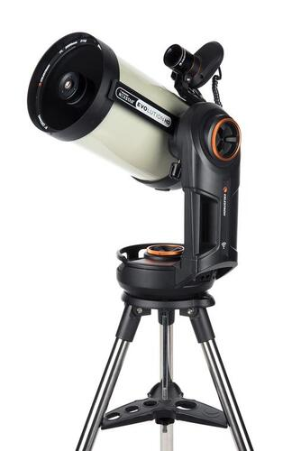
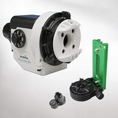

CONCLUSION

So, my advice is to understand as much as you can about this hobby before making any purchase.   Don't rely on one person's opinion, but definitely make sure that any advice you get comes from people with "skin's on the wall."  

In your search for a scope, be certain to do your homework and if possible seek out a "star party" close to you.  The best way to know what scope is best for you is to actually look through them and ask the owner tons of questions.  You will discover that most all amateur astronomers are more than happy to share their equipment, and talk endlessly about it!   
If you make the wrong decision on a scope, don't let it dictate your opinion about the hobby.  There are so many things, so many scopes, so many experiences (good and bad) that can define success or failure.  My best advice is to never give up on a telescope before you have used it under the darkest possible skies...or if you are too frustrated by the rickety mount I told you NOT to buy!

Be persistent; have a growth mindset; enjoy the process AND the results.  

I hope you found this Guide helpful!

Recommendations for Aspiring AstroImagers...
Tripod + Camera
If you have a camera, then it might be welcome news to you that you do not need a telescope to do night sky imaging.   Your starting point, especially if you already have something like a DSLR with its own lenses, is to prop the camera up on a tripod (or a rock), bump up the ISO a little, dial in a long exposure speed, and shoot!    

Following the "Rule of 500" - exposure length is equal to 500 divided by the focal length of the lens - you can use a tripod very successfully without fear that the stars will "move" during the image.  For example, a wide-field Milky Way shot can be taken with a 24mm lens (try f/2.8 to f/4) very successfully with a 500/24 or approximately 21 second exposure.   I'd try 30 seconds (the shorter the lenses, the more it becomes a "rule of 600"). 

Do the same thing for lightning storms, aurora, constellations, star trails, or any other creative thing you can think of.  

Taken a step further, the purchase of an "intervalometer" (as shown above) allows for automation of a sequence of such exposures, meaning you can create wonderful time lapse videos.  It also doubles as a shutter release cable, meaning you can get longer exposures than the maximum time setting allowed by the camera.  
The "Tracker" Mount
Taking the tripod technique a step further, you are not far away from being able to move the camera with the stars.   All it requires is a way to "track" them.  "Tracker" mounts exist to do exactly that.  Attached between the tripod and the camera, these boxy little mounts have a motor that moves at the same rate that the earth spins.   As long as you are "polar aligned," it will track for any amount of exposure time.   This lets you shoot longer images of wide-fields, going even "deeper" with your Milky Way and constellation shots.   It also lets you use longer lenses (up to practical mount payload and tripod stability) without needed to worry about the Rule of 500.     

This form of imaging also allows you to begin "stacking" individual exposures to form a single, deeper image.  It's this technique that is the foundation of all other more advanced forms of digital astrophotography...the more you "stack," the better the signal/noise ratio (or the cleaner the image). 

"Piggybacking"
Many might be surprised that I'd choose an all-in-one SCT (fork-mounted) for a good many people.  They are reasonably priced and versatile... and it's this latter point that makes it so great, since you can use it as a tracking platform (if equipped with a "wedge").  This is known as "piggyback" imaging.  Using camera lenses (or small scopes) while using the SCT as a tracking platform is powerful, especially since an SCT is an uncompromised visual instrument as well.  

SCTs are absolutely the best system for imaging the planets and the moon, since the exposures are short.  Shooting long exposures of DSOs THROUGH the SCT is a much greater challenge, however.  Even so, it's there when you are ready for it.  

But "piggybacking" doesn't require an SCT with a wedge...it can be any equatorially mounted scope.   In such cases, a camera with lenses can be mounted atop via a "piggyback bracket."   Or, you can use a smaller second scope mounted in either over/under or side-by-side configuration.  

The advantages of this technique when compared to a "tracker" is that greater payloads are possible, as well as greater degrees of accuracy, since many such mounts will be very accurately aligned and more precise.  

Short Focal Length
The most difficult aspect of imaging is getting good tracking and precision that can "freeze" the stars in your picture, a fact that become increasing true the longer the lens or telescope becomes.  This means that you must be able to align the mount properly...and you need a mount refined enough to not "wobble" as the shutter is open.

Unlike any other "German Equatorial Mount," Takahashi has you covered in spades (as shown in the picture).   Tak mounts have very accurate polar alignment scopes, meaning you can be imaging within 30 minutes of pulling up your car.    And the gears are very refined, meaning that when you decided to "auto-guide" an exposure, you will have the greatest amount of success.  Mate this with any APO scope of your choice (especially short ones) with a DSLR and you have a ready-made imaging setup capable of 3 to 5 minutes of UNGUIDED exposures right out of the box!   

You pay a nice price for this setup ($5000 or more), but it guarantees the greatest successes on traditionally difficult, long-exposure astro-images. 

However, nothing says you have to spend that much on a mount.  There are many options.

You should know that such a setup is the typical, first serious imaging setup of most who desire to image the cosmos through actual telescopes.  You just need to know that the quality of the mount MUST increase with the focal length of the scope.   Keeping under 500mm or so is important if you hope to have success with less expensive mounts.  But I'd recommend at least an EQ-5 type of mount...which starts to push the $1000 threshold.   But at this point, you will be required to spend money on a "guiding" solution as well.   
The RASA
​Not a cheap option, but a powerful one, is the 11" Celestron RASA Astrograph.  A special design similar to an SCT, this scope puts the camera at exactly where it's shown in the picture (known as "prime" focus). This shortens the focal length dramatically while funneling a tremendous amount of light onto the focal plane - f/2.2 for you focal-ratio-minded people. 

What this means for you is that when you place this 620mm focal length system on a well-aligned, reasonably accurate EQ mount, you swallow up photons very quickly.   With a DSLR, this means images less than a minute.  620mm means you'll likely want to "guide" the image just to keep it honest, but unguided images are very much possible if you pay some attention to the mount.  

The shorter exposures (around 1 minute) are especially beneficial for use with DSLRs, since you avoid excessive heat build-up (thermal noise) that can come with the more typical 3 to 5 minute images using other systems.

This tube mounts on an EQ mount, so you'll want to get one that holds a nice size optical tube.  And, oh, by the way, this is an imaging-only system...no visual-use possible (hence the term, "astrograph).

Celestron now has an 8" version of this same design, which is more cost effective and easier to use.   However, a DSLR does not work with the 8" RASA because it robs the front aperture of too much light.  A small-enclosure, round footprint dedicated astro-camera is typically used in this case, which is also a benefit to the 11" RASA as well.
There is something beyond.   LONG focal length imaging, as high as 3000mm or more, is possible with higher quality ($$$) mounts/accessories and great attention to detail.   I would consider "long" being anything greater than the aforementioned RASA, which still has it's own challenges.   Such goals go beyond the extent of a "Buyer's Guide" directed toward beginners; however, you should know that MANY people decide never to go into imaging with longer scopes...and this is totally cool.  But in the event you ever want the highest detail images of smaller objects in the sky, like most galaxies and clusters, then you might find yourself jumping in quite deep some day with more research on such setups.
