

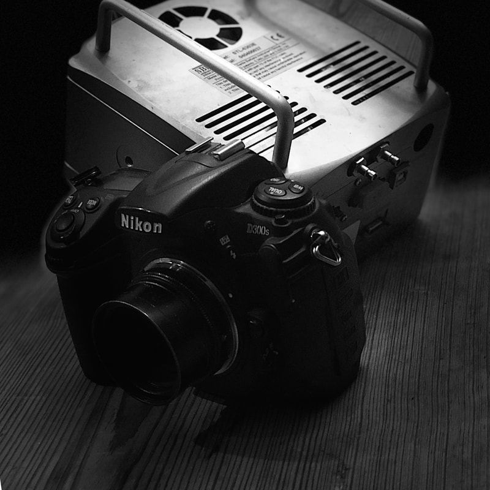

*(\* — Here we will not differentiate the type of sensors used in astronomical cameras - "CCD" will be used collectively for all sensors, even if the camera uses CMOS technology. In the event that we must talk about a specific sensor technology, we will specify either CCD or CMOS within that conversation.)*

Not too long ago, a good "non-astronomy" friend of mine asked, "Why is everything that we see from NASA shot in monochrome and needs to be edited and filtered in order to get color? Why not just outfit satellites and exploratory devices that travel to nearby planets with hi-res color cameras?"

Certainly my friend knows a little bit about the modern, digital world of photography. He knows that grayscale-only cameras with individual filters are used in such imaging, and these are much different from the really fancy digital SLRs that professional photographers use today.

He just wonders, "Why use the former when the latter exists?" To him, surely the advancements in camera technology, found in the everyday camera, must be good enough to put in space, right?

Well, the ***short answer*** is that monochrome cameras designed for astronomy, as equipped with full chip-sized filters, are better performers than any other camera type on the market. These advantages show themselves in **color accuracy**, **resolution**, **signal-to-noise ratio**, and **versatility**.

Across these four main topics, we will take a look at what dedicated astronomical cameras can do and how both professional and amateur astronomers use them. We will compare and contrast them with the typical "DSLR" ("Digital Single Lens Reflex") to see what both cameras do well...and where both cameras fail. Afterward, we will evaluate the future (and present) of astrophotography and discover if professional or "prosumer" DSLRs and, now, "mirrorless" cameras will ever be able to catch up to the power of our dedicated CCD imagers and techniques. But most importantly, we will celebrate the wonderful time in which we live, when a DSLR, while less capable than an astro CCD, remains a powerful tool in the hands of a capable imager.

In this comparison of the two imaging platforms, we will talk more from the standpoint of ***application***, rather than ***technical specifications***, albeit it will be difficult to avoid some technobabble. Please note that I plan to provide a "primer" to the technical side of CCD and CMOS cameras in the not-too-distant future. In the meantime, Dr. Craig Stark has written a nice, well researched article comparing the two platforms via technical specifications [here](http://www.stark-labs.com/craig/resources/Articles-&-Reviews/DSLRvsCCD_API.pdf). Either way, card-carrying geeks should find the articles enjoyable.

**MATTERS CONCERNING COLOR**

Most people make the assumption that an astronomical CCD camera takes color pictures right out of the box. In fact, they are usually surprised to learn that most of our CCD cameras are indeed "black and white" only.

"Why is such an expensive camera black and white?" they ask.

To them, perhaps, we are like the last family on the block to get a color TV...

"Okay, but how does that produce a color image?" they ask.

*To answer that question, we will delve into how we make color images and what makes our color images faithful from the standpoint of the data. We will discuss color perception, production, and fidelity.*

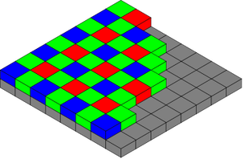

FIGURE 1 - A Bayer Matrix filter array (or Color Filter Array) found on typical digital cameras, turns black & white sensitive pixels into specific collection buckets for red, green, and blue color information.

**MAKING A COLOR IMAGE...**

The raw ***pixels*** of any CCD or CMOS sensor see ALL photons of light, regardless if that light is red, blue, or green. Pixels make no distinction between the colors of that light - the values contained within represent some level of brightness, not a specific color. The camera simply has no way of knowing how many of those captured photons were red, green, or blue, unless we filter that light. Unlike with modern color digital cameras purchased at a local camera shop, astronomers are fond of using "grayscale" sensor and employing filters ***that cover the entire array***, recording specific spectra of light.

Typically, for "true color images," we would use red, green, and blue (RGB) filters, one at a time, to produce three "channels" of color information. After taking the three images, the data is then merged into a single picture using image processing software like Adobe Photoshop. You can think of the process as a REVERSAL of the way your printer works.

"Tri-filtering" is tedious because three filtered images are required to produce a single color image. But there are advantages to this approach (a discussion we will save for later).

But for now, you might realize that such a technique looks nothing like the DSLR you have in your hand, a camera that does NOT require changing filters between exposures to achieve color images.

**The Color Filter Array**

A typical camera will put color filters over each individual teeny-tiny pixel ***(see Figure 1)***. This pattern of pixels is called a Color Filter Array (CFA), the most popular implementation of which is known as a Bayer Matrix. Your digital color cameras, DSLRs, and camera phones do exactly this.

The important point to understand here is that, physically, the pixel itself (without a filter) doesn't care what the color of light is. It continues to collect photons as a level of brightness (corresponding, in a general sense, to the bit-rate of the camera). A typical 14-bit DSLR will allow for 2^14 or 16,384 levels of illumination. ***But those teeny-tiny filters work to pass a particular TYPE of light onto the chip, filling up a particular pixel with values of a known spectra of light.*** As such, red-filtered pixels could contain up to 16,384 levels of red information.

As effective as this is, producing those colorful selfies that no doubt litter everybody's Facebook page, there are several deficiencies inherent to a CFA that are worth talking about. And since all DSLRs and one-shot color (OSC) cameras utilize CFAs, then these deficiencies are worth understanding.

What should be obvious when looking at ***Figure 3*** below, notice how much different and varied the color curves are.

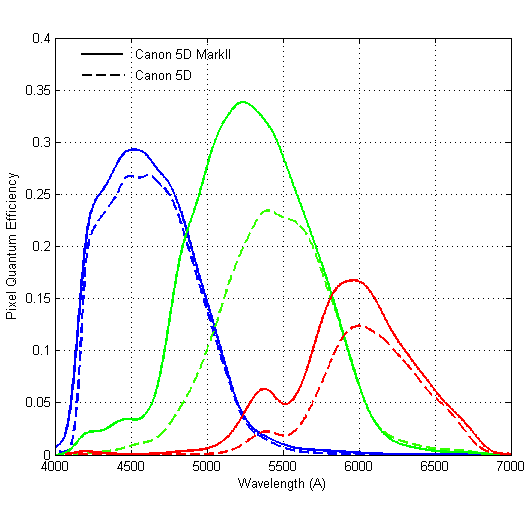

FIGURE 3 - The light response curve of the Canon 5D SLR family, a modern DSLR highly regarded. Note how the manufacturer limits silicon's response (see FIGURE 2) to an approximate 200nm bandwidth, more similar to the most sensitive spectra of human vision. As such, Canon (and other makers) limit the more-capable sensors with an IR cut filter. Notice also how each color in RGB further divides the human visual spectrum into its respective colors.

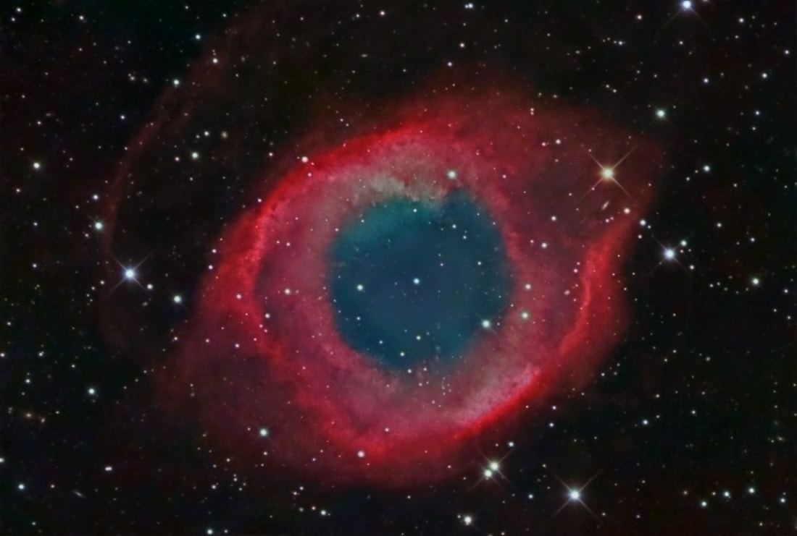

FIGURE 4 - The Helix Nebula (NGC 7293) is the most picturesque example of a planetary nebula in the night sky. The teal region around the central star can vary widely in color according to the camera being used, since the ionized gases of Oxygen that permeate this region will fall right near the 500nm crossover line between the blue and green channels collected by the camera. As such, there will be inconsistencies in color hue among a wide variety of CFA-equipped cameras (something that is more easily controlled with dichroic astronomy filters). Thus, for what astronomer's should properly expect as teal in color, various DSLRs might deliver a wider range of solid blues or greens than is anticipated.

This isn't problematic in daylight photography since cameras are "balanced" to provide color approximations to match our real-life perceptions. However, in astronomy applications, restricting the quality of light that reaches the sensor is not very helpful!

Also in ***FIGURE 3***, notice the crossover (overlap) regions between the colors, specifically how much of one color's data ends up in the neighboring channel. This is done purposely, so as to compensate for some of the issues found in the CFA. For example, if blue is only collected on 25% of the pixels, then helping it out by pouring some green into it will boost sensitivity in that channel. Likewise, its easy to see that some red information will end up in the blue channel, and vice versa. This allows for the potential rendering of "violet" colors, important for daylight applications.

However, with such overlapping curves, it can be argued that astronomical color fidelity suffers when compared to full-chip "dichroic" filters that can be made to have steeper cross-overs, such as those used in the image train of astronomical CCD cameras (see ***FIGURE 3***). This will be especially true of oxygen rich emission sources that glow close to the 500nm crossover between the blue and green channels. As such, there can be a wide variety of variance in the colors of something like the Helix Nebula (NGC 7293) among the various types of CFA cameras (see ***FIGURE 4***).

It is also well reported that absorption dyes are used to create the colors within a Bayer matrix, and as such will suffer from weaker transmission (and leakage) as compared to dichroic glass astronomy-specific filters. Less control over this factor equates to spectral-curves being more varied from camera to camera within a model line, which means your mileage may vary slightly from the generic curve that was published with your DSLR camera.

Finally, because of the color checker-board nature of a CFA, color data must be interpolated to fill in the pixel gaps between the color pixels in a channel. For example, if you view only the blue channel information in Photoshop, you must realize that only 1 out of 4 pixels will collect actual, real blue data. The pixels that collect red and green data will be missing blue information, which must be interpolated from an average of the neighboring blue pixels. As such, each pixel will contain real information from one color and interpolated information from the other two colors. In practice, this is only marginally problematic as the algorithms that do the interpolation fill in the gaps nicely. But in terms of color fidelity, the gaps in color caused by the lack of true sampled data can cause a problem known as ***aliasing*** within an image.

## Sidebar: Color Fidelity - The Myth of True Color Acquisition

Here's the thing...we equate true color with what our eyes see. We ask ourselves, "What would that galaxy look like if I were standing right in front of it?" And then, thinking we know the answer, we become defiant when we see an image that fails to meet those expectations.

Interestingly, reality isn't confined to what our eyes see. They are receivers of signal, similar to a car stereo that receives audio information across the airwaves. We never question how "good" our visual receivers are, although we are quick to remark how much worse AM radio is than FM radio.

Remarkable, the eyes are; even miraculous, considering that they are biological things collecting those photons of light, constructed out of completely different stuff than our cameras. Yet, they function in much the same way. But if we questioned what "reality" truly is, we'd realize that a camera has the potential to do everything better.

*(Author's outline note, left as-is: "additive vs. subtractive")*

**HOW THE EYE WORKS...**

> **"light"** - /līt/ - *noun*
>
> 1. The natural agent that stimulates sight and makes things visible. Ex..."the light of the sun".

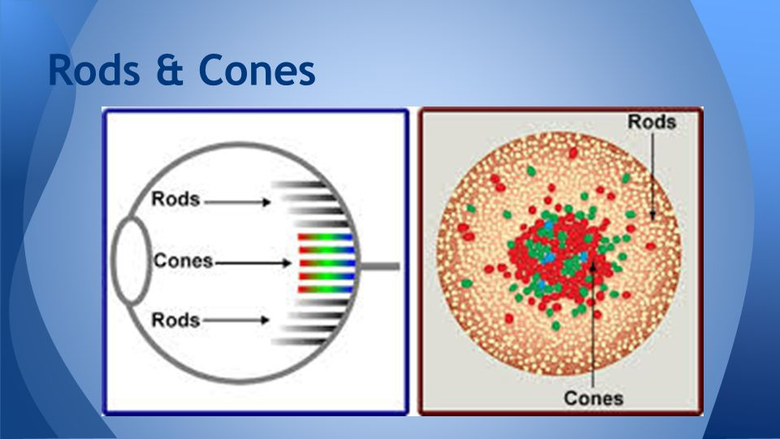

According to the definition, light is different for everybody. The ***amount*** and ***quality*** of it required to trigger your vision is not only different from mine, but how we see color is highly variable among us as well.

We need a minimum amount of light before we can begin to detect the world around us. We talk about this amount in terms of ***luminance***, which is the intensity of the light per unit area of our eyes. These luminance values are collected by both the "rods" and the "cones" in our eyes.

The highly-sensitive rods - there are 20 times as many rods than cones in our eyes - detect light in shades of gray. In low light situations, the rods are triggered first.

Because we are creatures of biology, slowing wearing out as we age, the elderly among us will require a higher threshold of light before vision occurs. As such, in low light conditions, your grand-kids will see you first.

But before they can see us in color, their color sensors (cones) will need to be activated by a stronger source of light. Once enough of it hits the eyes, three types of cones collect light in three broad bands of red, green, and blue (RGB). Once enough light from these bands is sensed, the brain mixes these colors into specific shades.

The interaction between rods and cones is interesting. Once the cones activate, the need for rods diminishes. Our color perception and intensity of light (luminance) becomes almost entirely the result of cone activation during the daytime. There is an overlap between the rods and cones during periods when it's "sorta dark" outside. Think about those nights shortly after sunset when you can still perceive color in some of the things around you. As the cones become more ineffective - the colors disappear - the rods take up the heavier workload. This overlap is obvious when you consider that as color fades from our vision, it doesn't SNAP from color to grayscale immediately.

Visual astronomer's will recognize that at night, ***averted vision*** can be used to detect fainter targets. As ***shown in the eye diagram above***, it's easy to see why averted vision works...the rods are arranged on the outside of the retina while the cones are heavily clustered at the center. With ineffective color receptors on-axis, it makes sense that we can increase sensitivity to the faint light by turning the rods toward our visual target. However, it should be noted that the vision will become increasingly blurry. This is because the cones are clustered closer together, yielding higher resolutions when looking on-axis.

Our sense of color balance is amazing when you consider that the blue cones are not at the center of vision, but rather toward the outside near the rods. There are also a lot fewer of them as well (around 2% of the total). The blue cones are the most sensitive, however, which helps offset the balance a little bit.

Of the remaining cones, red out numbers green by 2 to 1, though because green receptors are more sensitive and because the largest number of working receptors happen at the overlap of the red and green color bands, our eyes are most sensitive to a blend of these colors, namely in the greenish-yellow region of the spectrum.

As such, the way the human eye balances color depends on the total number of each type of light being received, but also the "bandwidth" it is capable of detecting. Overall, our cones can ***detect*** wavelengths within a spectrum of approximately 400nm to 700mm, from blue to red respectively, though at the extremes of that range light is ***barely*** detectable. So in practice, what we see as true color will comprise information mostly in the 450nm to 650nm range.

There are a couple of takeaways to be made from this fact. First, so much of the light coming from the astronomy targets we try to see visually are actually outside of the our ability to see them with our eyes. For example, the principle line of hydrogen emissions glows at 656.3nm, which can be imperceptible to many people visually since it's slightly outside that 650nm effective visual spectrum. Making matters worse, because our rods are the major workhorses when doing low-light astronomy, they actually have worse spectral capability than our cones, as you can see in the graph here...

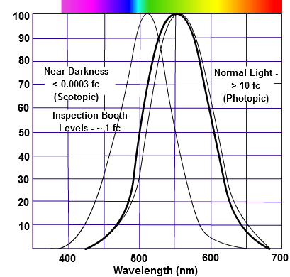

Notice the approximate 80nm left shift of the "scotopic" (rods) curve from the "photopic" (cones) curve? This indicates that hydrogen rich targets like emission nebula have almost a zero chance of visual detection, all because we are being forced to see them with our rods, rather than our cones.

If only we had a big enough flashlight, right?

The second key point to be made is that "light" waves exist far outside our eye's capabilities of seeing them. Moreover, a camera can see a great many wavelengths that we cannot. Shown in FIGURE 2, while the eye sees what it sees very WELL, it will not perform as well as a silicon chip for much of what type of light exists.

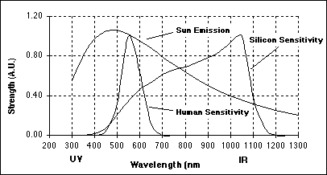

FIGURE 2 - Humans see light much differently than a camera. The graph demonstrates how little of the light spectrum of our sun we actually see, while the silicon chip within our cameras has the ability to see information that we cannot. It is interesting how sensitive our eyes are to the visible color spectrum as compared to a camera (our eyes are really good at what wavelengths it CAN see), but given the ability of a camera to continue collecting light over time, the camera still wins when compared to doing visual observations.

Finally, given the definition of "light" as given above, it begs the question, "So if light is what stimulates sight and makes things visible, then can we properly call those wavelengths outside our human vision ***light***?"

At that point, "light" is very much a human construct, the amount and quality of it being highly individual among us all!

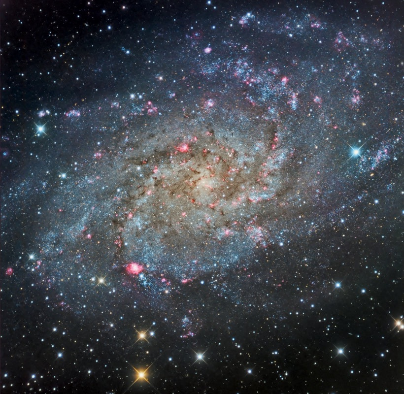

One of the more powerful abilities of a grayscale camera is the ability to utilize any filter you would like. This image of M33 demonstrates a popular technique used on this object, where the imager takes separate data using an h-alpha filter only and merges it into the red channel of the final processed image. The result is a boost to the emission nebulae that litter the galactic image. While some people might be too quick to point out that it's adding extra data to the image bringing it out of balance, I would say that it's helping to make up for the relatively weaker h-alpha response of the KAF-16803 sensor (as compared with the peak efficiency) used in this image.

**BETTER COLOR ACCURACY WITH GRAYSCALE CAMERAS**

Instead of a color filter array you could do away with the grid of tiny filters and just use individual filters, one at a time, covering all of the pixels simultaneously, switching filters for each of the color "channels." This, in a nutshell, is how color images with grayscale CCD or CMOS astro cameras are produced, as different from a DSLR (or "one-shot-color" astro camera). The raw sensor can actually be used to accumulate grayscale-only images - when color is needed, you rotate these dichroic filters into position.

For example, when you place a red filter in front of the entire chip, the only thing that reaches ***every pixel*** on the CCD is red light. All other wave lengths are blocked. Therefore, in this case, you know that the image you accumulated represents only those features of the object that are red in nature. Same goes for the green filter, then the blue filter.

So for an RGB image, you would take three separate images, one with each filter. Such filters are designed with the appropriate broadband spectrum that corresponds to typical RGB wavelengths, close to what the eye sees...well, sorta...approximately 400 to 500nm for blue, 500 to 600 nm for green, and 600 to 700nm for red. Note that these bandpasses are larger than the typical spectral response of DSLRs, as ***shown in FIGURE 3 above***.

Of course, each of these images are still grayscale images as far as the camera is concerned, which only "sees" shades of gray representing the color information for each image.

But when you take these images and put them into the image processing software (i.e. Photoshop) as independent color channels, each pixel becomes interpreted as a blend of red, green, and blue colors producing a color image...much the way a color printer "colors" an image with a blend of RGB inks. So you can think of each pixel having some combination of red, green and blue "ink." Quite literally, a rainbow of colors is produced depending on the original colors in the image.

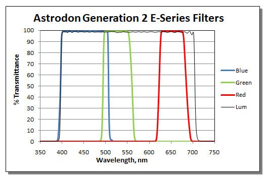

FIGURE 5 - Shown is the spectral response curve of Astrodon's current RGB filter set. Note how a good set of astro CCD filters like these will attempt to pass a much wider and more squared-off bandpass of spectra for each color. This wider transmission of data when compared to the CFA of a DSLR should not be overlooked. Many more photons of a particular color will get to the chip of a grayscale camera when using these filters. Interestingly, note the lack of crossover between the red and green filters. This is by design, as most of the light pollution sources - all major sodium and some mercury vapor lines - are found in the 570 to 620nm represented above. As such, the Astrodon's trade-off object data in this region (which has no major object emission lines) in order to block the major lines of bothersome local light.

From a color supremacy standpoint, the chief advantage of using individual color filters as opposed to a camera with a CFA is that a good set of RGB filters can be customized specifically for astronomy applications. They may be designed with more precise band-width, relating better to the spectral sensitivity needed in the targets we shoot. Likewise, much more data can pass to the sensor with the wider band-passes and the steeper cut-offs at the heel and toe of each filter. Additionally, filter sets may be customized to help combat major light pollution sources, which might otherwise affect the proper rendering of color once the image is processed. Evidence of all these aspects can be seen in ***FIGURE 5 above***. In other words, grayscale sensors with individual filters do not suffer at the hands of a camera-maker who cares only about day-light photography. This is a significant point when it comes to color accuracy and efficiency within astronomy-specific applications.

Likewise, because each pixel covers the whole of a particular color's data, there are no gaps which require interpolation. One might argue that this isn't an issue with a DSLR because of the sophisticated interpolation algorithms, but what cannot be argued is that each color is properly sampled to begin with. Even if this promotes even slightly more accurate color, it's still one less thing you need to worry about.

Another aspect of color accuracy where grayscale cameras have an advantage is in the thermal noise handling of the camera itself. Because astronomical cameras typically come with cooling aboard, it makes accurate calibration of the image possible. DSLRs, which lack on-board cooling, cannot accurately model thermal noise no matter how hard people try. In fact, I am of the school of thought that doing dark frame subtraction with a DSLR is fruitless, especially in Texas. As such, with a DSLR, excess chrominance "noise" (technically unwanted signal) will exist that will not be found in a well-calibrated astro image using a cooled sensor.

Finally, because the user does have the ability to remove the filters entirely to shoot narrowband spectral images, the accuracy of a particular type of data can be assured. For example, when shooting an emission nebula with an h-alpha band filter, you are assured of accurate data at that frequency, without any worry of other cross-over color spectra or light-pollution. While such data does not present itself as "color" in an image per say, it does help assure a degree of accuracy when such data is merged into existing color channels. This might be important with some grayscale cameras where the sensitivity is weaker in the h-alpha spectrum than in other areas (i.e. the KAF-11000 chip has a quantum efficiency of 65%, but only half of that at the h-alpha line). As such, the imager might opt to take some extra h-alpha data and add it back to the red channel data, assuring a better, more accurate rendering of the image.

***Conclusion about Color Accuracy***

For all the talk about color, our capabilities and our ability to generate accurate color data, it's most certainly a worthwhile activity to strive to maintain accuracy with our data. The versatility of a filtered grayscale camera, when coupled with large RGB filters that provide a more customized bandpass of all color data assures that all your efforts to capture an image yields superior color in almost every way possible.

However, despite attempts for accuracy, I find it ironic that ALL astrophotographers will fail in rendering an accurate image once processing is complete. For why this is so, see the discussion above on how the eye sees reality, and below in ***Sidebar - Color Fidelity: The True Color Myth***. But in lieu of reading the sidebar, just know that image processing is ultimately an interpretative practice and no two people and no two images can ever be the same.

So if color accuracy isn't guaranteed in the final image, then why discuss color accuracy at all?

The original premise stated that monochrome astro-cameras with dichroic filters are "better" than color filter arrays. Taken with a grain of salt, to make ***pretty pictures***, we actually have quite a bit of leeway in how we do this. Truly, good results can be accomplished with many types of cameras and filters.

But as it concerns color accuracy, we have to realize that scientific applications DO REQUIRE accurate data and that certain camera technologies DO NOT lend themselves well to certain types of science, where images will be minimally processed to preserve the most accurate data possible.

To summarize, for the astro-imager who's goal is to make pretty pictures, while color accuracy serves as a proper starting point, we are usually more interested in GOOD, strong color, where there is enough data of sufficient quality within each channel to achieve a nice image. And this is why people can have success with a wide variety of camera types and techniques. It's just that if you have the choice, a grayscale camera with filters provides the best of all worlds when attempting to render color images of a variety of different types.

## Sidebar: Color Fidelity - The Myth of True Color Interpretation

If our cameras have the ability to produce accurate color, then why does it seems that no two images of an object look the same?

*After all*, **if technology gives us powerful capabilities to capture accurate color, then shouldn't that mean images taken of the same object should always look the same among astrophotographers?**

Amazingly, we know this isn't the case. Indeed, the resulting color in our images, as much as we might strive for some objective standard, ends up being unique to the processor. As such, there can be no "true color" representation - only true data.

Quite simply, as Anais Nin once said, "We don't see the world as it is, we see it as we are."

Ironically, one of my favorite arguments in the amateur imaging community stems from this notion of "true color," as if we have some moral or ethical responsibility to reach a standardized result with our processing using standard methods. The argument is now somewhat old, as people have grown to understand all the issues at hand, but early on the voices sounded something like, "We have a scientific duty to assure that we haven't distorted the data, especially color."

And you can see where this originated. Here we were, a bunch of amateurs with fancy new scientific tools called CCDs, we learned to "calibrate" them, just like real scientists, and then we made this huge chasmic leap into believing that, "We, too, must maintain scientific veracity with our data."

Why wouldn't we think our images are contributing to science? The rise of amateur imaging coincided almost exactly with the spectacular Hubble Space Telescope (HST) images. But ironically, as scientific as the Hubble seems, the results of the jaw-dropping pictures we've seen from it is NOT science. Rather, the HST has accomplished one major achievement...to inform the public about the importance of astronomical research and space exploration. It uses "art" to inform about "science."

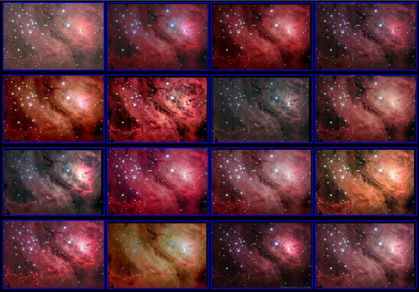

But, ***we aren't scientists***. And even if we were, with the tools we have and with the requirement of making "astro-images," we surrender the chance for having data with scientific meaning just because the images we create require our own interpretation to make them. They represent our own biases, agendas, feelings, and expressions, whether you want to admit that or not. The multiple images of M8 ***shown above***, processed by some of the world's best astrophotographers using the same data set, shows exactly this.

Quite simply, the aim of a beautiful image conflicts with any scientific application with our data. And because HST images try to be beautiful, they too lack scientific veracity, other than to reveal or affirm glimpses of celestial mechanics.

Don't get me wrong, just because our images aren't scientific does not mean that I'm advocating free reign with our data. No, most certainly, we do want to adhere to good practices in most regards, as maintaining a controlled workflow during the processing of our data helps to prevent us from diverging too far from where the data should go. Complete freedom will not be in the best benefit to our final images, which often has something informative in the data that might benefit from a careful, discerning eye following a consistent workflow. Tragically, many are so driven by an image's aesthetic that everything become fair game for them, including stealing data and calling it their own.

Thus, with a legitimate astrophoto, there remains plenty of latitude to make processing decisions to yield a spectacular image, all the while maintaining an image of integrity...one that is true in the best sense of the data.

As I said, over the last decade or so amateurs have reached a sort of equilibrium where the "true color" argument is concerned, typically agreeing that we should start off with some reference point (typically the "white balance" of the image), and then trying to coax as much from our data from that point forward. Certainly, you are much less likely nowadays to get a comment on an image about how the color in your image isn't "real."

But truthfully, every person on this planet sees color in a slightly different way, and now amateur imagers are beginning to understand that. And to be sure, people now realize that the way we see ANYTHING is most certainly different than the way that the ***camera*** sees it. For more about this, see the discussion above on ***How the Eye Works***.

**THE DSLR'S LIMITED COLOR SPECTRUM**

Back in the days of film, manufacturers like Kodak and Fuji would design film to be activated by a light spectrum that best matched the way the human eye sees color. Certainly, the average human eye, as a receiver of light, is most sensitive to frequencies between 450nm and 650nm, a 200nm (nanometer) bandwidth from violet to cherry red. While film emulsions could be made with a wider bandwidth (or specific bandwidths), doing so compromised color in the sense of the realism that people expected to see in their prints. For example, a typical film would cut-off red frequencies higher than 650nm, depending on the emulsion, all in an effort to preserve skin tones when taking portraits. Likewise, trying to push the frequencies more into the ultraviolet (UV) or near-IR spectra could cause either spurious color fringing or muted, desaturated colors, respectively.

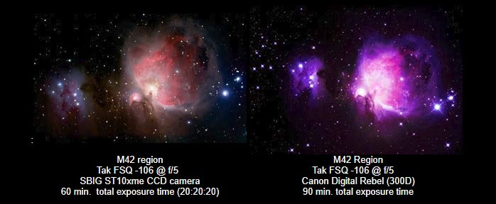

FIGURE 4 - This comparison between cooled astro CCD and one of the earlier consumer DSLRs demonstrates the advantage between the two technologies. Certainly, many will find that today's wisely chosen DSLR might serve very well, but it should be understood that DSLRs will always be slightly less useful when compared to a dedicated astro CCD camera.

Fast-forward to today and digital cameras still operate under the same limitations. Yes, including a DSLR. Regardless of the type of sensor, whether CCD or CMOS, when implemented into a camera designed to take photographs of humans and landscapes and cuddly puppy dogs, the camera still has the same restrictions placed upon it by the camera manufacturer, with the end goal being to mimic the realism that the human eye expects to see in their prints, despite the fact that the raw sensors themselves are capable capturing a much broader bandwidth, typically from 300nm (ultraviolet) to 1100nm (near IR). In fact, in many such chips, the PEAK sensitivity can be outside the most sensitive spectral areas of human seeing.

So, Nikon, Canon, and Sony (among the rest) must limit the natural ability of their sensors to collect light to only the typical 450nm to 650nm bandpass...just like with film. To accomplish this, a clear cover glass over the sensor is used. This works as a cut-filter, blocking near-IR light and, consequently, far too much of the available red information. What light that is allowed to pass can be seen in the typical spectral response curve ***shown in Figure 1***.

When you consider that the strongest emission source in space, singly-ionized Hydrogen-alpha gas, glows at a narrow spectral band around 656.3nm, then it is easy to see why a stock DSLR might not be the best choice for astro-imaging. It lies just outside the cut-line of the filter.

The best way to see the negative effects of this is to look at similar images of the same object taken with both types of camera. For this comparison - done many years ago - it's hard to think of a better object than the M42 region! ***See FIGURE 3 below***.

The left image was taken with an astronomical CCD camera for a total exposure length of 60 minutes. Because these cameras require "tri-color" imaging techniques - filtered exposures for each of the red, green and blue channels - the image uses 20 minutes of information per channel; thus, 20 minutes with a red filter, 20 minutes with a green filter, and 20 minutes with a blue filter. While this may seem very difficult to do, the integrated color filter wheel and acquisition software makes the process somewhat simple. Because the camera filters worked on a 1:1:1 ratio, meaning that equal exposures of the channels provide the best color balance, the colors shown in this photograph are quite representative of the actual colors inherent in the nebula.

In other words, the shot on the left is very close to the way the nebula SHOULD appear in photographs from the standpoint of color.

The image on the right was taken with a ***Canon Digital Rebel***, also known in Europe as the ***300D***. This was an early Canon DSLR (2003), the first such camera offered for less than $1000. Because DSLRs use tri-color pixels (which will be described in the next section), a single shot from these cameras will produce a color image, unlike an astronomical CCD camera that requires individual exposures for each of the colors. This particular image contains 90 minutes of total exposure time (18 separate exposures of 5 minutes each).

The most obvious difference in the two images is the color. Purple dominates the scene of the digital SLR image. Secondly, the amount of detail and depth in the first image is much greater than in the second.

## Aside...

Now, before you argue that we are talking about an ***old DSLR*** in this example, I include this comparison to demonstrate the differences in the extreme, an effect brought on by a response-less Ha spectrum, lack of sensitivity, and increased noise when compared to the cooled Astro-CCD camera. Certainly, a modern, stock DSLRs does bridge the gap in performance a little better (as you will see below), but today's DSLRs will suffer in a similar regard when compared to a cooled astro-CCD camera.

Looking at the individual red color channels can show us why the second image is so dominantly blue and purple. ***See FIGURE 3 below.*** The CCD camera yields more red information (reddish hydrogen gases) in the nebula itself and astronomy cameras like the SBIG used in this comparison are very sensitive to it. They pass all red light (including the h-alpha emission line) right up to where near-IR spectrum starts at 700nm. Plus, many such cameras boast greater "quantum efficiencies" right at that spectral line, a quality we will look at later in the article.

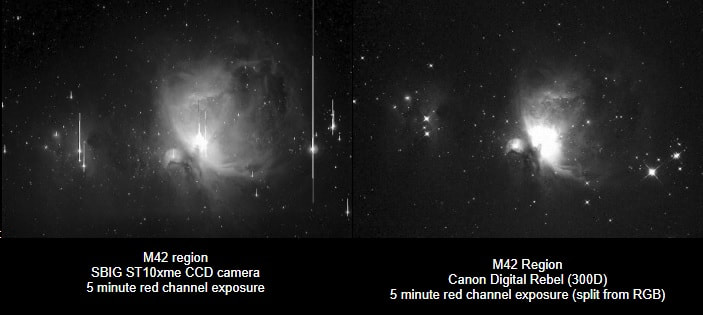

FIGURE 3 - Showing the red channels only of the FIGURE 2 image demonstates the lack of h-alpha information within this nebula when using a non-modified DSLR. As shown below, a more modern, modded-camera can yield pleasing results on these emission sources.

As mentioned, the DSLR only passes a small portion of the red information to the chip in comparison. Therefore, when one processes such an image, attempts to bring out the faint details in the nebula, which should be red, often do nothing to help. Unfortunately, as in the color DSLR version in ***FIGURE 3 above***, pushing the mix too far makes for a purple mess. This is because typical cherry red h-alpha regions require twice as much red information than blue to make it look right (RGB 255, 0,127 is a "rose" color) and there's just not enough red to make that possible, particularly in the faint regions.

***Thus, for users of stock DSLRs, great care must be taken in processing so as to avoid pushing the blue and green histograms beyond what is available within the red channel if you hope to maintain color balance. It is possible, but it comes at the expense of enormous amounts of faint detail.***

While getting your color from a single RGB exposure might seem to be an advantage compared to a grayscale astro CCD with filters, DSLRs lag behind astronomical CCDs in their ability to achieve the same level of detail and depth. While a modern-DSLR can bridge the gap slightly with increased sensitivity and better noise characteristics, especially if "modified"; however, it's important to realize that ANY stock DSLR is still limited by the more restrictive IR cut filter, the narrower individual channel band-passes of the color filter array (CFA), and the lack of on-camera cooling to limit thermal noise -both of which we will talk about later. None of this will change anytime soon since DSLRs do not require this for daytime photography.

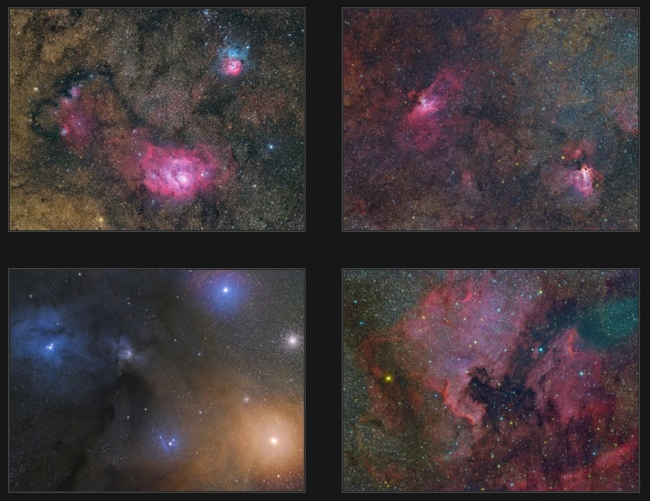

FIGURE 4 - Taken from a dark sky site, all images are unguided taken with a Nikon D810a through a Takahashi FSQ-85ED refractor atop a Tak NJP mount. The images range from 22 minutes to 50 minutes of total exposure time, showing that modified DSLRs are very capable of some nice astrophotos. Make particular note of the balance in color made possible by the equal presence of all available wavelengths of light.

**THE "MODDED" DSLR**

Since necessity breeds invention, astro-imagers typically have a way of modifying sub-optimal technology into usable, even powerful tools. As such, amateurs have popularized the advent of the "modded-DSLR," which usually involves the replacement of the existing cover glass with a different piece of glass for a less aggressive, less restrictive response. And in some other cases, the modification might also involve a DIY cooling solution.

While compromising none of the daylight use of the camera (the extra response is compensated for with a custom white-balance), the modded-DSLR will now have sensitivity to the all-important h-alpha spectral line (as well as SII and some NII gas emissions), all the while retaining the auto-focus capabilities of the original camera.

(True story - I eventually "modified" the Canon 300D camera used in the earlier comparison by removing the cover glass entirely. Yanked the sucker right out! It worked too. Couldn't "autofocus" on daylight shots anymore, but I really didn't care.)

The positive result of any such modified DSLR can be seen with images of emission nebula sources, where the cherry red color becomes much more visible compared to images taken through stock DSLRs.

To show this, let's look at some images taken through a factory-modified Nikon camera, the Nikon D810a. This modern camera is Nikon's response to the growing astronomy market. Also a camera with a replacement cover glass, this Nikon is a good performer on a variety of h-alpha rich sky regions, as ***shown in FIGURE 4 above***. The "a" in the model number designates "astronomy." As a side note, I find it striking that companies like Nikon and Canon have recognized our hobby as a "market." It just goes to show how much our wonderful hobby has grown!

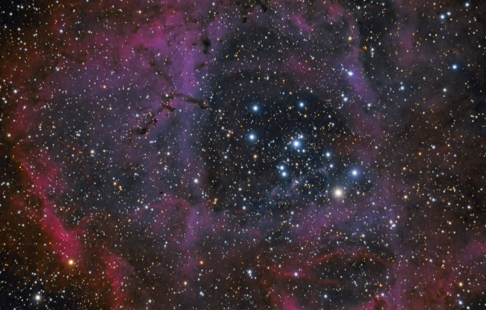

While both the Nikon and Canon typically use replacement glass that has much better transmission than stock, they will not be as satisfactory as a commercial or DIY-modded camera, with cover glass you could get off-the-shelf.

Among the big players, Canon was first to the market, producing the 20Da (the "a" designation also indicates an "astronomy" variant) in 2005. Seven years later in 2012, Canon followed up with the 60Da.

Nikon's entry, the D810a, was introduced in 2014 and obviously functions quite well on a wide-variety of emission nebulae. However, in my experience, that's not quite the case for the Canon 60Da.

I've been fortunate enough to play around with that DSLR as well and was largely unimpressed by it.

For example, shown above, this 6 hour total exposure image of the Rosette Nebula was taken with a Canon 60Da at ISO 800. Note that even after such long exposure times in quite dark skies (at an ISO that's a little high), the shift of hue toward purple is still quite obvious. Certainly it is not objectionable, but when compared to a [typical CCD shot](/gallery/ngc2244-rosette-2004/) of the same area, it's definitely, well, different!

As for galaxies and other non red-emitters, you might think that a stock DSLR might work pretty well. Beauty is certainly in the eye of the beholder, but its easy to see the differences in shots taken of a particular subject, in this case the Andromeda Galaxy (M31), with both stock and modded-DSLRs (***see FIGURE 5 below***).

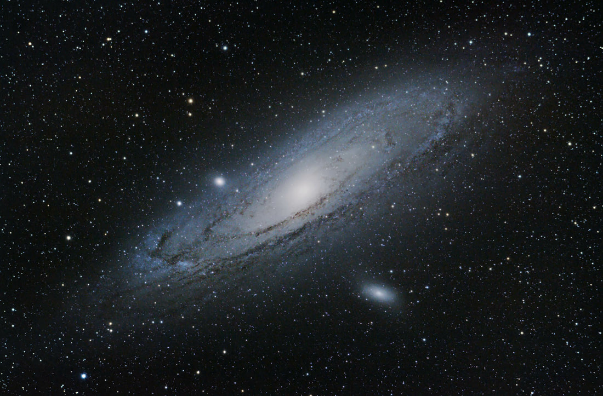

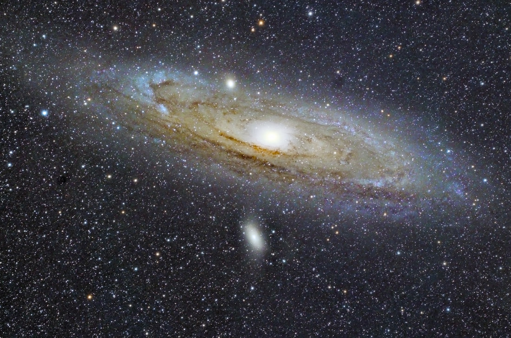

FIGURE 5 - Shown on left is M31 taken with a stock Canon 450D (Rebel XSi) with 3 hours of total exposure time. This is a good result (Explore Scientific 80ED 80mm f/6 refractor) from a good astrophotographer, albeit the image is about the best you should expect from such a camera (courtesy of Trevor Jones at [AstroBackyard](https://astrobackyard.com/andromeda-galaxy/)). My result (Tak FSQ-85ED 85mm f/5.3 refractor) in the middle is taken with the factory-modified Nikon D810a with 36 minutes of total exposure time. While Trevor's image is undoubtedly taken in brighter skies than mine with a slightly slower scope, it should be clear the advantages of the modified camera. Of particular note are the reddish-brown areas shown within the galactic dust and the yellowish hues made possible by the contributions of the extra red data. Pictured at right is another Nikon D810a image taken from dark skies in Wyoming. Only 46 minutes total, make note of the heavier color saturation made possible by more SNR through increased aperture (11" Celestron RASA). As such, a DSLR can begin to compare more like an astro CCD, especially since the individual sub-exposures (less than 1 minute) are short enough to spare the DSLR from objectionable thermal noise.

***Choosing a DSLR-Modification Option***

As a rule of thumb (perhaps), a modification done through one of many third-party sources (or even DIY) will perhaps double the red-sensitivity of a factory-modified camera...which itself is perhaps 100% better than stock. So, when considering whether to purchase a factory-modified DSLR or one that is done through a third-party, you can probably estimate the latter to perform quite a bit better than the former.

DIY solutions can be done for around $100, but are NOT for the faint of heart. Third-party commercial solutions can be very cost friendly compared to a factory-modded camera done by Nikon or Canon. However, you must be careful of the source of a third-party solution. Currently, [Hap Griffin](http://www.imaginginfinity.com/dslrmods.html) is the most reliable and experienced source, performing the mod on a wide number of stock DSLRs - and he is the only source I can personally recommend. [Andy Ellis](http://www.astronomiser.co.uk/) is reputed to be a good UK source.

A typical price for such third-party solutions, including Hap's might be between $200 and $400, depending on the camera model and the type of class used (or if a replacement glass is used at all). Keep in mind that a replacement glass is required if you expect to use the camera during the daytime as well, so if you only plan to use the modded DSLR for nighttime images of the stars, then such replacement glass isn't necessary.

Commercial "modders" will typically provide a short warranty period on the work, perhaps around 3 to 6 months. But as always, caveat emptor - do your homework if you are serious. But it's certainly a temptation - a Nikon D810a, which is currently the only factory-modded camera available new, will cost you no less than $3200, which is double the price of a stock D810 model. This seems a little outrageous, but Nikon does modify the firmware of the camera to add a new "astronomy mode," which is "M-asterisk (\*)" on the D810a mode selector. It adds a custom intervalometer and longer individual exposures beyond the stock 10 minutes.

***Recommendation #1*** - I own a Nikon D810A and love it; however, if I did it again I would likely purchase a stock D810 plus a Hap Griffin modification and save at least $1200. While you lose the dedicated astronomy mode in the Nikon factory version, most people will opt to use either an external intervalometer or some variety of laptop control software anyway.

***Recommendation #2*** - In the Canon world, either the 6D Mark II (full frame) or 7D Mark II (APS-C size) are reputed to be really solid performers, both in read noise, thermal noise, and spectral characteristics. While most believe they would need to be modified for best results, Canon folks have some really nice astro camera options.

But despite what you see above, before you pull out your money to purchase a DSLR, let's finish the article! Certainly, we can conclude that there's enough good with some of today's DSLRs to satisfy and enormous number of hobbyists. But since the article is attempting to compare DSLRS with Astro CCDs, we'll not stop there. You need to know that DSLRs, both modified and stock, are still limited when compared to Astro CCDs in several other areas...

**DIGITAL CONVERSION FACTORS WITH DSLRS**

For almost every DSLR manufactured today, they utilize 12-bit and 14-bit ADCs (analog-to-digital converter), which is specifically sized to match the known dynamic range of a camera (full-well depth divided by read-noise level). Comparatively, dedicated astronomy cameras usually come with a 16-bit ADC, which matches the greater well-depths found in the more powerful (and larger pixel) astronomy-specific cameras. But in truth, the overall dynamic range of both camera types is pretty much a wash.

**MATTERS CONCERNING RESOLUTION**

But it can be argued that actual resolution and color fidelity will be lost because there is no real "sampling" of data within the gaps. In terms of resolution, there is likely some loss, but not as much as you might think.

In short, the amount of resolution loss is often argued, some feeling that it's significant and others believing that it's minimal, though nobody believes that there is zero loss. A 10% loss of resolution is probably a good estimate. However, the aliasing of a Bayer matrix filter has many people looking for other solutions among CFAs that do not suffer those effects, such as with the Foveon implementation.

As both an imager and a visual observer, I am routinely struck by how similar the eye functions to a camera. Amazing to me, but people seem to ignore the connection between them as collectors of light. After so many years of using both, I've come to the conclusion that the eye is a lot more sensitive than your camera. In fact, the eye is a rather extraordinary piece of biology, capable of seeing minute details at very little light level. If this is a surprise to you, or if you think I'm just crazy, then you probably need to read my ***imaging primer*** a little more closely. But what I find is that people confuse a camera's "sensitivity" with its integration time and its sample rate (AKA image scale)

What makes the camera SEEM more sensitive is that the eye has almost zero integration time. You can test my opinion about this pretty easily...

Take a DSLR and capture a nighttime image at approximately 1/30th of a second, operating at a moderate ISO of 800. Now compare the image taken with the view you see with your own two eyes. Amazing how the eye will out perform the camera at that little test!

But there is a reason why I said to take an image of 1/30th of a second - this is the approximate refresh rate of the human eye. In other words, the brain forgets what happens after that 1/30th of a second and then "refreshes" its memory of the scene. It can only integrate visual information at a rate of perhaps 30 hertz (cycles per second). Incidentally, this why the eye can often perceive the flickering of a computer monitor (especially in the olden days of the technology).

Cameras, being integration devices, place no limits on how long light is allowed to accumulate. You may open the shutter for as long as is necessary and keep pounding light onto the sensor. As such, cameras accumulate MUCH more light before you decide to refresh the exposure. However, this does not take anything away from the miraculous ability of your own eyeball from a sensitivity standpoint. It's just that it tends to act more like a video camera than it does your DSLR.

But this is only one area of similarity between the eye and your camera. Relative to the topic of ***resolution***, you should know that the eye functions remarkably in a similar way. In terms of visual acuity, the best of all eyeballs can act like a ~12 micron pixel, albeit this is when viewing straight in front of us. Visual acuity falls off remarkably at the periphery, even if there is a slight gain in sensitivity (visual observers take advantage of that fact by using averted vision to find objects at the threshold of their detection). Our eyes rapidly scan the scene, in stereo, and our brain interprets the big picture of what we see to complete a sharp "picture" from edge to edge. Dr. Roger Clark, at his great website, expresses that once the eye does its scan of a scene, it then acts like a 574 megapixel camera. See his interesting article called, "[Resolution of the Human Eye](http://clarkvision.com/articles/eye-resolution.html)" for more.

As an astrophotographer AND a visual observer, I am interested in TWO parameters when it comes to getting the best view of a target. The first, which relates to resolution, will be talked about here. The second parameter relates to signal-noise ratio, which I'll talk about later.

First, I desire to see detail in the targets I choose. To accomplish this in astrophotography, I choose an instrument of sufficient focal length to yield the right angular resolution across my given pixel. This the idea of "sample rate" or "image scale," and it represents the smallest detail that my system can capture. For example, with a 9 micron pixel astronomy CCD sensor (e.g. KAF-16803, KAF-11000, and KAF-6303), I can optimize the amount of detail in my images by choosing instruments in the neighborhood of 2000 to 3000mm in focal length. My weapon of choice is typically a 12.5" RCOS RC at 2857mm, but Schmidt-Cassegrains also work exceptional well as instruments to deliver the maximum resolution possible. In my case, the my RCOS yields an image scale of 0.65 arc seconds/pixel. This means that I am "sampling" an area of the sky on a single pixel that is only .65 arc seconds wide. This yields optimum data given the best of my typical seeing conditions based on Nyquest criteria (see ***Sidebar: Applying Nyquist to Imaging***). Truthfully, I can hope for no better detail with this setup, but it does give me a chance to capture it should the skies cooperate!

## Sidebar: Applying Nyquist to Imaging

Most people who get involved in this hobby have no doubt heard of Nyquist at some point of their lifetime. Your first exposure to it probably occurred when you bought your first music CD (compact disk) instead of the normal cassette. You probably wondered, "How many songs can actually fit on these things?"

And this is what the Nyquist Criterium is - the minimum rate of sampling required to render a continuous function (or data) of a finite bandwidth into discrete, storable points that can be reliably reconstructed into the original function. For music, it's the smallest file you can use to reproduce your favorite song. It's the key to going from the analog to the digital world with perfect fidelity.

Speaking of CDs, we learned at the time that if we "sample" by a factor of 2x (at the least), we can reconstruct our songs digitally. With a sound recording, this occurs at a 44.1mhz (at 16-bits) standard, which is slightly more than double the highest frequency that humans can typically hear (no higher than around 20mhz on the high end). This "sampling rate," which is a little more than 2x of the highest bandwidth, is necessary to provide a buffer against ***aliasing*** (for more, please refer to the ***Digital Imaging 101 Primer*** mentioned earlier).

This Nyquist "rate" of 2x for digital signal processing works for any type of analog data, including the reproduction of astronomical objects into pretty pictures. But as opposed to sound frequencies, which are a function of time, in astro-imaging we are all about spatial frequencies, which is a function of distance (angular size). As such, we want to find the finest detail possible in size and then record it by a pixel by at least TWICE as small.

The simple approach would be to work at an an image scale that is twice as good as your best atmospheric "seeing" conditions (assuming you are not limited by your equipment itself). For example, if you know your atmosphere lends itself to 2" (arc second) details - by measuring a star's point spread function (PSF) - then Nyquist would seem to indicate that half of that measure PER PIXEL would suffice. And many imagers choose scope and camera combinations that yield image scales of around 1"/pixel.

As such, because pixels have x and y dimensions, we have to focus proper sampling on the diagonal measure of a pixel (the image scale of the diagonal measure and not the actual image scale). And we measure our seeing at the standard deviation (sigma 1) of the star using "FWHM" or "full-width" at "half-maximum". In one dimension (x or y), the FWHM at sigma 1 for a star - or any data that is normally distributed - is 2.355" \* sigma. But because we have to take this measure at the diagonal of a pixel, it yields 2.355 \* sqrt(2) = ***~3.3" FWHM \* sigma.***

Therefore, the minimum critical sampling of your image data would have to be at an image scale that is 3.3x more fine than the details you hope to capture when measured in FWHM. Many imagers feel that 4x to 5x is more satisfactory if you hope to truly achieve an image that reproduces the fine details of reality. See ***FIGURE 4***.

Using this math, based on a typical setup designed to capture the best resolution possible given skies that occasionally permit 2" of seeing, then the image scale should be around 2"/3.3, or 0.6" per pixel, at the minimum. And to guard against "undersampling," most experienced imagers will tell you that you should probably be a little better than that, perhaps in the 0.3" to 0.5" range for optimal resolution, especially if you hope to take advantage of the rare night when your seeing starts to creep down into the sub-2" area.

For this reason, when ***shooting for the best resolution possible***, it's likely important to choose a camera pixel size and telescope focal length that yields between 4x to 5x of your typical seeing. This provides the best sampling on a typical night, with enough headroom to deliver well-resolved data on that special night you've waited all year for!

And if you are worried about the waste that comes with oversampling, then...

Wide-field imaging setups do not regard Nyquist rates - the goal for such images works contrary to those that want fine resolution, which is namely ***to produce images with large fields of view***. This also makes it better for beginners, since higher images scales (like 3.5"/pixel in my favorite wide-field setup) become immune to recording seeing fluctuations. It's just a much easier form of imaging than trying to capture the finest of details.

Moreover, it's likely possible that most people lack the equipment of sufficient enough quality to take advantage of proper sampling.

Perhaps surprisingly, I do the same exact thing as a visual observer: I choose a magnification - which actually serves to lengthen the focal length of the instrument - for a given object based on what I details I hope to see given my eye's ability to record the information akin to a 12 micron pixel sensor. Of course I don't literally compute my visual acuity so accurately when it comes to resolving details with an eyepiece, but everything works with the same principle, and all that is left from the standpoint of resolution is to hope that the skies and my telescope are steady enough to see it.

But with a camera, we have a choice of what size of chip we are using, and more importantly, the size of the pixel we desire. In truth, most imagers who do astrophotographer, especially with DSLRs, have little choice in this regard. DSLRs have rather smallish pixels. For example, a Nikon D810a has pixels that are 4.88 microns in size. This is not that huge of a concern, but it does mean that if I attempt to use the same instruments as mentioned before, then I will be "over-sampling" my image by quite an amount. In other words, if I choose an instrument too long in focal length, then I will be injecting more read noise into my images because I'm using way more pixels to collect my photons without any additional benefits of resolution.

In such a case, and as a help to those who use DSLRs, you likely want to use instruments that yield a similar image scale as I achieved with my own astronomy CCD setup. But that would mean using a focal length half of my RCOS, perhaps something in the neighbor of 1200 to 1500mm to maximize my resolution. This is why you seldom see DSLRs used with SCTs...even the smallish Celestron C8 (at 2000mm focal length) would yield 0.5 arc seconds per pixel, which is considered, by most people, to be quite over-sampled.

*(Author's outline note, left as-is: "But as I mentioned earlier,")*

Secondly, once I've established the way I want the scene sampled, whether by camera or by eye, I then hope to accumulate as much light as possible. In BOTH cases, this is controlled chiefly by the aperture of the given instrument and the darkness of the sky around me.

Among the reasons a grayscale astro camera with individual filters keeps its versatility edge over a one-shot-color camera:

1. Each pixel accumulates all of one color, so the full resolution of that color is delivered without the need for interpolation. (ACCURACY)
2. The ability to shoot an individual color allows the user to shoot a particular channel only when it's best. As such, you can choose to optimize your data by shooting blue high in the sky where there is less blue extinction OR you can concentrate only on a particular color channel to strengthen weaker data sets. (VERSATILITY)
3. Filters can be designed with much wider bandpasses for each channel and they may be customized to help combat major light pollution sources (***see FIGURE 3***). In other words, they are astronomy-specific, as compared with the CFA of a DSLR. (ACCURACY)
4. They can be removed entirely, allowing for the collection of luminance-only data. We will talk about "binning" later, but this is a powerful feature only made most practical by the ability to remove the color filters. (SNR increase and resolution) Similarly, because the user can now choose to shoot luminance-only data, this opens up the entire efficiency of the sensor by shooting completely filter-less (as opposed to a clear filter with near-IR block). This makes the collection of near-IR signal possible, which could boost SNR up to 30% or so on some targets. (SNR)
5. Because you retain the ability to shoot in grayscale, you can make the determination of when to shoot luminance and when to shoot color. For example, light pollution gradients are more difficult to remove when shooting RGB. As such, many imagers will reserve shooting color until they have better, darker skies. Likewise, because the grayscale camera is not crippled with a CFA, not only can you take luminance, but also shoot spectral band images, should you desire. While it isn't impossible to shoot h-alpha (or mapped color) images with a single-shot-color camera (shout-out to my friend, Bud Guinn), it's not nearly as optimal as allowing every pixel on the sensor to collect spectral information, without being encumbered by the existing color filters. (VERSATILITY)
6. Akin to the previous point, scientists can shoot with UBVRI spectral bands filters for spectroscopic data. This is simply not possible with a camera that has color filters, or has been limited to the visual spectrum by use of near-IR cut filters. (VERSATILITY)

*(Author's outline note, left as-is: "OTHER Factors..." Processing power requirements are much larger with DSLRs than grayscale cameras.)*

**MATTERS CONCERNING SIGNAL-TO-NOISE RATIO**

*(Author's outline note, left as-is: "Give examples of dark frames and how they work to show how they actually remove thermal noise in an image.")*

Issues:

1. The amount of noise, even when subtracted properly, will leave behind more dark current NOISE.
2. You can't properly subtract dark current signal in a DSLR!
3. Quantum efficiencies are greater in astro CCDs.
4. Peak efficiencies are often times greatest right at the h-alpha spectral line with astro CCDs.
5. There is a healthy amount of worthwhile information to be gained from the night sky outside the RGB bandpass limitation. Near-IR light, specifically, can add as much as 30% more signal to our images. Just because our eyes cannot perceive near-IR data, our cameras still have the capability to record it. As such, collecting grayscale luminance data (using no filters) allows for extra information that CFA-equipped cameras cannot record. Using this information can add SNR to images that would otherwise be thrown away using RGB techniques alone. Therefore, with permanently affixed CFA, it cannot be removed to take advantage of near-IR information. It would be nice if the camera had a way to bypass the CFA entirely, but that isn't possible with today's DSLRs.

*Note to self: Get rich by creating a DSLR that overlays the CFA onto a rigid, transparent plane that can flip out of the way when I want to go into "grayscale mode." With the advent of new mirror-less DSLRs, the CFA overlay could retract into the place of the traditional flip-down mirror. Or, how about a CFA that shifts at high frequency to keep color elements moving?*

**VERSATILITY**

**LRGB IMAGES...**

But the problem is that we are not just collecting red, green, and blue light. Much of the objects we shoot have wavelengths in the ultraviolet and infrared red as well. Though our eyes can't see these wavelengths, the CCD can - typically a full 100 nm of UV information and around 400 nm of near-IR spectra on a filterless image.

This has a couple of implications for us. First, pure color doesn't work well if this extra information is added to a channel (since UV and near-IR is technically not a "color" as our eyes understand it). So the actual RGB data must "cut-off" these frequencies. Thus, when using RGB color filters, the extra, useful information in the UV and near-IR does NOT pass through to the CCD. Secondly, because some of this information contains nice detail and additional signal strength that is otherwise very useful to us, we need a method by which we can merge it into the color data without distortion or disturbing the color balance.

In other words, the question becomes "how can I preserve the colors accurately yet also show the information in the UV and near-IR areas of the spectrum?"

Well, that's what LRGB images are all about. "L" stands for Luminance. It is a frame shot without any blocking whatsoever, so all the wavelengths are accumulated in the pixels. It is therefore a long, high resolution, grayscale image of tremendous depth and detail complete with UV and near-IR information. The "RGB" portions are the normal color frames.

When you combine these in an image processor, you get the complete detail of the luminance frame with the color information of the separate tricolor images. In fact, you can even take shorter, combined pixel (binned) images of the color frames, just enough to give the colors you need, and then combine that with the longer grayscale image. This works well because the eye isn't as sensitive to color as it is brightness levels. Thus, our eye sees detail better in the black and white images than the color images. In essence, we can simply "map" the colors over the luminance details in order to blend the two.

The result of the LRGB technique is normally spectacular, though it takes several iterations and a slow blending together of the data since there isn't really a one-to-one correspondence between the original visual data (RGB) and the invisible data (the UV and near-IR). But I strongly advocate making the effort. However, you should know that many people shoot their luminance data with full cut-off filters, since they wish to add data from luminance frames (often "binning" the color), yet maintain proper fidelity of the color itself. This assures an easy processing match, where there is color information one-to-one with all the luminance data.

**H-ALPHA with RGB**

Many people refine the technique by using a luminance frame shot with a hydrogen-alpha filter (not the same one as for the sun) in a 3 to 7 nm bandpass. This brings in specific waves of red light only, such as those in most emission nebula. The idea is that all other wave lengths (especially light pollution) are somewhat blocked except for the intricate details of the hydrogen gases. This requires a very long exposure, or stack of exposures, but the result is signal in the areas that you want it, which is a good thing. Once put into an HaRGB composite, where the Ha works into the image like a typical "L" luminance channel, then you have something pretty incredible.

This is by far the most difficult form of image processing, because there is very little correspondence in the data between the Ha and the RGB channels. So, these have to be blended, merged, and tweaked in such a way to make for a natural image. It's very much an art form, but the results are wonderful when properly achieved.

**SPECTRAL BAND IMAGING**

Incidently, the same techniques work for Oxygen (OIII) and even sulfur (SII). In fact, this is what the Hubble does. It takes separate images with OIII, SII, and hydrogen-alpha as long luminance frames. Then, it inserts them into the color channels for blue, red, and green, respectively. The result is a "false color" composition of incredible detail and beauty. Moreover, it's a pretty simple, artistic form of processing with emphasis on how the palette can please the eye. No more "true color" to shoot for or disparate luminance and color channels to try to merge together. Because of this, the method is often referred to as "false color" imaging.

Hubble palette images (and other spectral band blends) are certainly not natural looking as the eye sees it, and it's very questionable how much "science" shows itself in the final composite image. But it's a powerful technique since these three thin spectral band filters will block out all other forms of light. This means light pollution is no longer an issue. Thus, many people in the cities have adopted this form of imaging.

Fortunately, we live in a great time, when amateurs can replicate a lot of what the Hubble telescope has been doing all along.

*(Author's outline note, left as-is: two placeholder lines, "This is the Hubble shot:" and "This is my shot:", with no comparison images ever inserted on the original page.)*

The term "false color" as I used it above simply means that the colors aren't realistic; not how we'd perceive them with our eyes.

True color would be combining three images with EXACTLY the proper red, blue, and green wavelengths. In other words, the red image should show ONLY red information, not green or blue or UV or IR. When we use filters to collect the information, it's not always perfect. For example the red filter might not block out some of the green, allowing some green information to leak into the red image. Same with the other colors.

Therefore, the true color images are those that use the BEST filters with the best transmission and blocking characteristics.

When you do images with H-alpha, OIII, and SII filters, you are collecting information in spectrums of actually 3nm spectral wide as opposed to 100nm. Put another way, a perfect red filter will block all wavelengths EXCEPT for those waves between ~600nm and ~700nm. But when you use an H-alpha filter, you aren't collecting all the red information, only the part of it at 656nm (plus and minus 1.5 nm with the Custom Scientific filter and plus and minus 10nm with my Lumicon filter). With a green filter, you'd collect everything between ~500nm and ~600nm. But when you substitute an OIII filter in its place you'd get only the information at 500nm (plus and minus 1.5 nm with the Custom Scientific filter). But what is interesting is when you replace the ~400nm to ~500nm blue spectrum with SulfurII. Sulfur actually glows at 672nm, in the red spectrum.

**HOW ARE THESE CAMERAS BEING USED?**

AstroCCDs can utilize other technologies, such as dual chip guiding and adaptive optics.

DSLRs have the advantage of being able to be used easily by themselves with existing lenses to do a wide-variety of "nightscapes," star trails, time lapses, and ultra wide-field images, both tracked and from a tripod. Additionally, they have there own batteries and do not require a computer to use them. None of these things should be dismissed...and what I've found is that people with even the best of astro CCDs within their astro-quiver STILL heavily utilize their DSLRs for a wide-variety of both casual and serious shots.

*(This is where the original article ends — it was left unfinished on the source site, with no closing section or conclusion.)*
