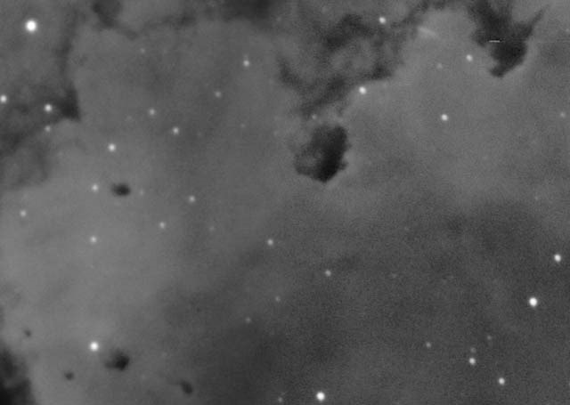
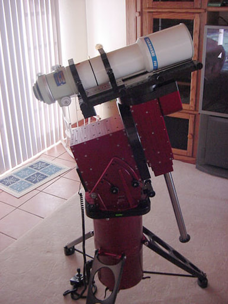
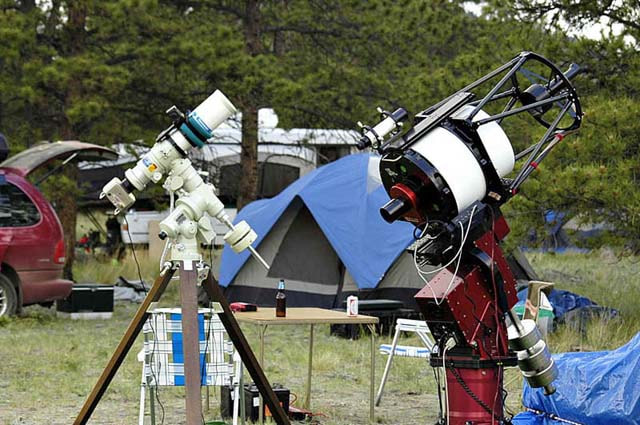
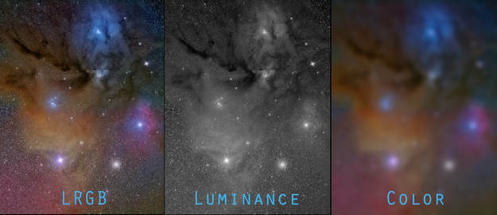
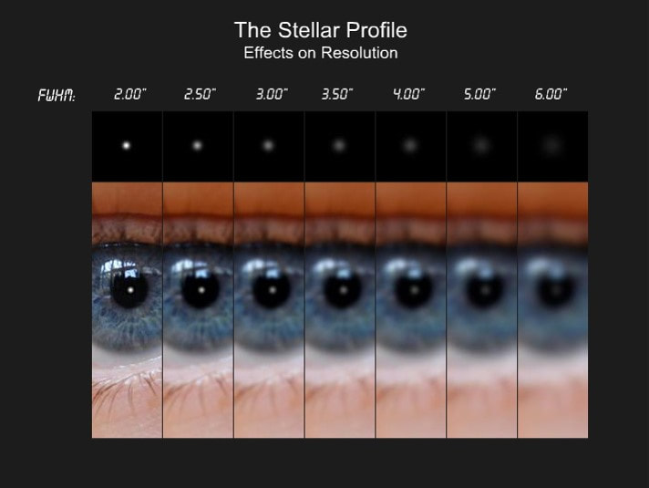
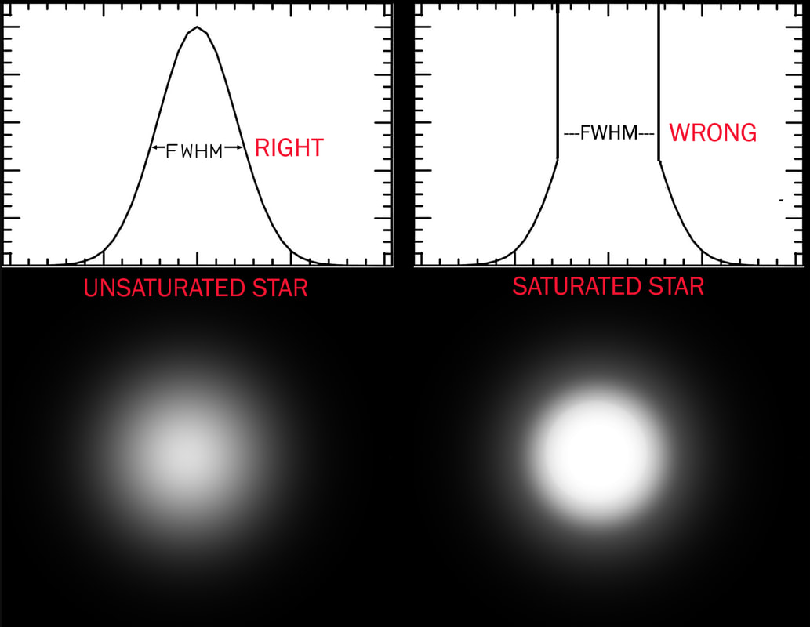
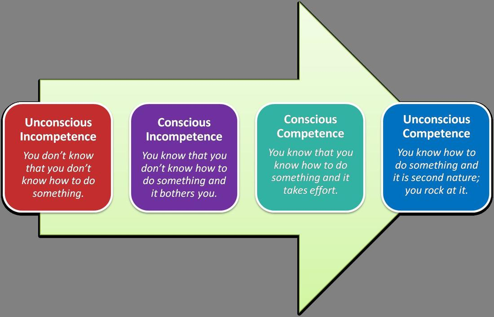

Best Data Acquisition Practices

​Too often, beginning and intermediate astroimagers worry about all the wrong things.  They try their hands at autoguiding before getting good focus.  They try to take images with a haphazard polar alignment.  They fail to collimate their optics.  They have the wrong adapter or back-spacing and it cuts into the light cone.   

And then, when things go wrong, they cannot figure out what's responsible for the poor performance.   

Simply put, they have no systematic way of improving their images; no well-designed program to measure skill improvement that would make them more capable of producing great images.  

Blame it on the equipment if you must, but there's a certain amount of tragedy in not being able to get the most out of your equipment.
 
Getting the most from one’s equipment requires perfecting the most important processes first; the things that affect your image the most; the things that are most easily correctable and manageable.   THIS is the way to great S/N.
 

Figure 1: The above portion of the Rosette region, taken from a two-frame mosaic, was imaged on sequential nights of similar darkness. The data is h-alpha. The portion left of the line was 150 minutes of total exposure time. The portion at right is 210 minutes total. This is an illustration of how important matching shots of near equal S/N can be when doing a mosaic. But moreover, it shows how a reduction in astronomical seeing can greatly reduce total S/N. In this case, the quality of seeing dropped somewhat on the second night, when data for the right side was acquired.
Unfortunately, much of what you read with regard to S/N considers only the noise component.   Many people assume that if you just have a noiseless image from the standpoint of the camera, then you will have high S/N.  Or, they assume that by getting many lengthy sub-exposures, netting enough total exposure time, they will have images high in S/N.   Untrue.  Totally.
 
To demonstrate the point, see figure 1.

Sure, we should take care to limit noise from the camera perspective, which is why we discuss the concept of “sky-limited” exposures extensively.  But when we discuss how to get the best S/N from the perspective of the CCD camera, why do we ALWAYS assume there is good signal acquisition of the subject?   In other words, noise is not independent of your data acquisition abilities, but rather is a direct result of it!  

There's far too much, "Well, my image is noisy, so I guess I didn't image long enough."  

There's not enough, "If I could improve my autoguiding, choose the right target, or properly sample my image, then I would only need half the exposure time in my images."

The purpose of signal-to-noise discussions should not be to learn how to compute pixel SNR by imaging longer, but to help you to gain more reliable information of the object of your focus. 
 
The reality of the situation is that if you can’t keep the stars still enough to expose, then you aren’t going to have good S/N, no matter how capable your camera is.   Likewise, if we define "noise" as unreliable data, then out-of-focus data is akin to noise...sorta.  For example, data taken on widely diverse seeing nights will show itself with one sampling being more "noisy" than the other...as in the above Rosette mosaic. 
 
Simply put, good S/N happens more as a result of good signal acquisition than it does noise suppression.  Conversely, nothing destroys S/N like bad conditions and poor execution.   Noise suppression can only be accomplished in one way (go longer), whereas good signal acquisition can be accomplished by MULTIPLE factors.   And this is where we should seek to increase our signal-to-noise ratios.
 
In reality, we can’t assume perfect signal acquisition.  Some issues, like atmospheric seeing, are often beyond our control (which is arguable).   Others, like achieving good focus, are controllable to a great extent.  
 
Therefore, our purpose here is to highlight the "user-controllable" areas of signal acquisition, some which are simple, nightly solutions, and others that, with planning, can greatly affect the final S/N of the image.  

BEST IMAGE ACQUISITION PRACTICES
 
The following chart outlines the disciplines that we should successfully employ to help us better record what the scope actually sees, thus helping us to acquire the best signal possible.  In total, they represent a program of the best image acquisition practices. 
Skill or Practice

Time Required

Frequency

Controllability

Importance

Difficulty

Polar Alignment

10 to 90 minutes

Upon each setup

Very High

1st Order

Easy to Very High

Focusing

1 to 5 minutes

Every 20 seconds to once per night

Very High​

1st Order

Very High

Collimation

10 minutes

After travelling

Very High

1st Order

Moderate to High

Balance

1 minute

Each equipment change

High

2nd Order

Easy to Moderate

Cable management

Minutes to Hours

Each use

High

3rd Order

High to Very High

Local seeing

n/a

Each use

Moderate

1st Order

Easy

Wind

n/a

Each use

Moderate

1st Order

Easy

Optical setup

Hours to Days

Once

Very High

1st Order

Very High

Differential Flexure

n/a

n/a

High

3rd Order

Very High

CCD Darks/Flats

Minutes to Hours

Varies

Varies

2nd Order

High to Very High

Filter choices (Image type)

n/a

Each new target

Very High

1st Order

Easy

Autoguiding

5 to 10 minutes

Each new target

Moderate

2nd Order

High

Periodic Error Correction (PEC)

Minutes to Hours

Each equipment change

Depends

2nd Order

High to Very High

Sampling rate

n/a

n/a

Very High

2nd Order

Easy

Dithering

n/a

Each new object

High

1st Order

Easy

Luminance "Harvesting"

n/a

Each new object

Very High

2nd Order

Very High

Atmospheric Seeing

n/a

Constantly

High

​2nd Order

​Easy

Going "Long"

n/a

​Each new object

Very High

3rd Order

High to Very High
 Some clarifications about the column headings:
Skill or Practice:  The task you must perform.
Time Required:  The amount of time needed (usually nightly) to complete a single occurrence of the task.
Frequency: How often you need to do this task.
Importance: Rated as either 1st Order, 2nd Order, or 3rd Order...higher orders have exponentially greater impact on success.
Difficulty: How hard it is to do the given task.

Some overall impressions you may have about the table:
Some tasks seem more easy to do than others; some tasks seem more impactful than others.   It should be obvious that the easy, most impactful items should of top priority to the imager. 
It's amazing how many factors can truly affect the quality of the data that I collect. 
It's insane how many variables there are that I will need to troubleshoot while I learn this stuff. 
Some of the items seem to be one-time setup issues.
Many of the items you say are within our control seem very much OUT of our control.​

To eliminate confusion, let's describe the practices, categorizing by their importance.   I have termed the task as either 1st Order, 2nd Order, or 3rd Order Disciplines.  1st order tasks will be an order of magnitude greater than 2nd Order...and 2nd Order will be a magnitude more important to your image than 3rd Order.   Therefore, you will want to practice 1st Order Discipline first. 

1st Order Disciplines

Polar alignment – On many an on-line astronomy forum I have heard people opine that you don’t need a good polar-alignment if you autoguide.  Nothing could be further from the truth.  Good autoguiding works best when it has to make as few corrections as possible.  If the autoguider has to work too much, the signal of an object will get blurred over more pixels than necessary.  This is because the autoguider now has yet another compensation to make; which is never a guaranteed deal.  The result is an uncertainty in the data for that object detail, which by definition, is noise.  So, because you decided to skip out on accurate polar alignment, you automatically start on the wrong side of the S/N equation.  

Moreover, autoguiding as a discipline is not a brain-dead activity.  It becomes a real challenge at longer focal lengths.  Thus, if you are troubleshooting trailed stars in your image, how do you know it's not polar alignment induced drift in your image?  For that matter, could it be bad seeing?  Differential flexure?  Cable snags?  A lost guidestar?   Thus, why would you NOT try to eliminate drift as a probable cause? 

Finally, if autoguiding was the end-all solution for good imaging, then why do we use equatorial mounts (good ones) in the first place?   Why not just use an alt-az setup?    Of course, those with experience know that we need the scope's axes to align with the celestial pole in order to eliminate the potential of field rotation in an image...but do you realize how prominent that can be in an image if you are not, at least, reasonable close to the pole star?   For example, when imaging at over 2500mm, such as with many larger SCTs and RCs, field rotation can become objectionable in a very short subexposure if you are a matter of several arc minutes away from the actual pole.   So when you are troubleshooting what looks like an optical aberration in your image, how do you know it's not actually field rotation?  

​Focusing - Ah, yes, where do we start here?   If I were to name one thing...one FIRST CAUSE to bad S/N, it would not be exposure lengths, autoguiding, or bad seeing, it would be FOCUSING.    If you are not going to bother with getting great focus in your image, then you might as well go no further with refining the other skills...they simply won't matter.  

​Focusing manually is a pain.  First, you have to know what good focusing looks like.   Then, you have to know how focus can change during a night due to thermal expansion.

Then, you have to be able to tell if the focus has actually changed, or whether it was just a change in atmospheric seeing?   Second, it takes a long while to learn the most efficient and bulletproof method with your setup.   Do you 3D print a Bahtinov mask with your 3D printer?  Do you get a better focuser for your scope with dual speeds?  Zero-shift focuser and mirror lock for your old SCT?  

Speaking of thermal expansion, as the temperature drops during the evening, you do realize that your fast apochromatic refractor made of aluminum likely needs to be REFOCUSED every 20 to 40 minutes, right?

To complicate the matter further, many seek to automate focusing by using the appropriately named "auto-focuser."  But if there is one piece of gear that is the MOST DIFFICULT to setup and run, especially for a beginner, if would be an auto-focuser.   Moreover, you will be welcomed to a world of new terminologies and measurement rubrics like FWHM, HFD, and peak-brightness.   The learning curve is not without obstacles.

Collimation - There is not a whole lot to say here, but for people who travel with their catadioptric or reflector telescopes, it's of primary importance.   Thus, it is a strong virtue with refractors that they are mostly not a concern.  Same with a permanently-mounted telescope...just set it...and forget it. 

But don't make assumptions here.   If you are out of collimation, it is a huge hit to the performance of your optics and your S/N will suffer like no other.  

A couple of tips here.   First, don't attempt collimation on a bad seeing night.  You need a steady stars to reveal a good star test. 

As an example, I sold a refractor online recently and the buyer wanted a refund because it was "out of collimation."   

I told him, "Sure, but do me one favor.  Try it again on a different night...if you still feel the same, I'll honor your request." 

As you might have guessed, he changed his mind after catching a good seeing night.  

Similarly, I recently star-tested a beautiful William Optics FLT-110 f/6.5 -  the oil-spaced triplet with TEC optics - and got a little concerned.  But, knowing that I 

Collimation can be difficult to learn...and it's most certainly intimidating to a beginner.   But it doesn't have to be done often in most cases.  Don't be lazy here.

Local Seeing - I am making a distinction here.   We will talk about "atmospheric seeing" later.   "Local seeing" is the factors immediately around the telescope that comprise the greatest instability to an image.   In fact, I believe that 90% of what we deem as "bad seeing" takes place within the first 30 feet of the ground.   

Turbulence in telescopic views are a result of localized temperature zones, and pressure difference between those zones.  Air pockets form, especially in and around the optics, and air moves from zone to zone, thus causing shaky viewing.   

Everybody knows that the first thing to do to combat this is to acclimatize their telescope to ambient air temperatures prior to critical observations. Dob owners know that fans on the back of the mirrors greatly reduces these "cool-down" times.    But it goes much further than this.  

Radiant heat from around the observatory is an issue...concrete in Texas is a huge issue if it's next to a telescope.  Trapping hot air inside an observatory is also a time-robber in the early parts of an evening.    So, local seeing is a matter not only of where you set a scope, but how to acclimatize that scope. 

My recommendation is that you use fans to quickly equalize the area around you.  And before you go through the effort to shield your setup from the wind, you do realize that wind can be your friend, right?   If you have big heavy mounts, then let the wind blow a little bit!   Likewise, having digital temperature sensors to measure the air at the surface of your optics vs. the ambient temperature can give you a quick way seeing what is required and providing objective measures of your efforts.

In short, controlling the climate around you is somewhat easy to do and it can have a huge impact to your images.

Wind - This is a killer to your image, making it a 1st Order concern.  In fact, the question you might be asking is, "Why do you consider this a skill?"   I most certainly seems to be beyond our control.  But in reality, there are a lot of ways to limit its effects.  

There are a couple of points to be made here, things you should consider every night you shoot data.    First, as stated earlier, not all wind is bad...it can serve to assure acclimatization and seeing consistency.  

Second, making right decisions with permanent enclosures (or wind breaks at star parties) can solve a lot of issues here as well.  Even setting up the scope next to you car can give you better data on windy nights. 

Third, the primacy of the mount as your MOST IMPORTANT piece of gear is obvious here...so make a good decision in its purchase.  Don't skimp.

But let me share an important tip...astroimagers, like all astronomers, are soon bitten by the equipment bug.   If you start this hobby thinking that one scope is all you need, then you are just being silly!   Directly correlated to "sampling rate" or "image scale," you will quickly learn that on nights when the wind doesn't let you shoot through the C-11, it doesn't mean that you cannot shoot with a Hyperstar.  Or if you are still worried that you Hyperstar-equipped C-11 is going to act like a big sail, then go "low-profile" with a 80ED apo refractor. ​   See FIGURE 3 below.

Optical Setup - If you have dealt with Takahashi telescopes for any amount of time, you will know that there are exactly 133 adapters to be purchased with any telescope.  I might be over-exaggerating, but not by much!   Oh, and add another adapter (or four) when you decide to connect a camera.  

And it's not just Takahashi.  For ANY setup, particularly when you add camera rotators, reducers, flatteners, filter wheels, off-axis guiders, or focusers to the optical train, you have a lot of math to do...and a lot of decisions to make.   

And remember, you don't have ONLY one telescope, do you?  

Getting the optical setup absolutely correct is a skill...and it's a hard one. While you can get setup help from many sources, especially from quality manufacturers of these scopes, the number of hardware options available with these types of accessories makes for a big-time headache.  

Reducers and flatteners are especially tricky, as they are designed to be used at a very specific distance from the sensor chip.  Likewise, telescopes such as Ritchey-Chretiens and Dall-Kirkhams have to place the CCD a specific distance from their back-plates to achieve proper optical performance, despite what accessories you use in the optical train. This means that there might NOT be room for that new off-axis guider you had your eye on.   

And then there are reflectors, which might require a low-profile focuser just to bring the camera to focus in the first place...or refractors that have been shortened down to fit in your airline carry-on, yet require a crazy amount of extension tubes to bring that camera to proper focus.  

Regardless, this is a 1st Order Practice...you MUST make those optics perform as designed for best S/N.   It's not a decision you have to make frequently, but it's one that demands your utmost attention to detail.

Figure 3 - Taken in 2003 after receiving my Paramount ME by Software Bisque. You might laugh, but I challenge you to find a better performer in the wind. With multiple OTAs, I had a wide choice of optics, but there is no such thing as "overkill." I've used this Tak FSQ-106 directly atop this mount many times. It turns wasted nights in productive ones.
Filter Choices (Image type) - ​With astronomical CCD cameras with filter wheels, you have a choice to make every night you image AND from image to image.  RGB, RRGB, LRGB, HaRGB, Ha+LRGB;  clear luminance vs. IR-blocked luminance; Ha/OIII/SII or dual-channel spectral band?   With so many decisions, of course this is a skill!

The first thing you need to know, which is a skill to be acquired, is that not all filters are used or treated equally.   I'm not just talking about using an h-alpha filter on moon-lit nights instead of your RGB filters.   That choice is obvious.  I mean things like...should I shoot red first or blue first?  Answer:  You shoot blue high...always.   Or, on a bad seeing night, what do I shoot?  Answer:  You shoot color.   Or, on a bright night for an LRGB image, do I shoot luminance or color?  Hint:  Light pollution causes difficult-to-correct gradients in color.    

If you have not learned these in the laboratory of actual experience, then keep working on it.  It will take a while!

I'm also talking about one time purchase issues here, such as whether to buy a 3 micron or 5 micron or 6 micron H-alpha filter.  Or, whether I have an opinion on shooting clear luminance with a filter or without a filter.   Or, will a one-shot-color camera will be sufficient for me? 

Oh, and there are also filter-offsets where focus is concerned.  They might be advertised as "par-focal" filters, but when your scope is f/3.6...you need to know that it is NOT going to be par-focal...and you better know why. 

Using the right filter at any given time is a 1st Order Discipline.  It is something you have to do every new target you choose, and is a consideration ever hour that you image.  Choosing the right filter has a huge impact; making a bad decision can mean a huge waste of time...time that you could be using to get more data. 

Dithering - If I had to pick one skill that is easiest to learn yet has the greatest impact on your S/N, it would be dithering.  It is estimated by people much smarter than me that you gain 20 to 30% increase to your S/N simply by turning on "dither exposures" in your software.  

For those that do not know, dithering is bumping the mount in between exposures to create an offset frame to frame by a small number of pixels. This offset creates a misalignment when stacking, and when you do your image registration, it realigns up all the signal.  The nice part is that the fixed pattern noise, hot pixels, and shot noise are further randomized...and your software's rejection algorithms (e.g. median and sigma) a more capable of eliminating offending noise. 

In order to dither, there are a couple of prerequisites.  First, you must be autoguiding your image.  After shooting a sub-exposure, the software typically will move the guidestar around by a certain number of pixels that you determine (I usually use 3 to 5 pixels, depending on image scale).  The autoguider will once again lock into place, guiding on those new coordinates, and then shoot the next sub-exposures.  A new dithering occurs after every new exposure.   Therefore, if there is no guide-star or autoguiding, then you may not dither.  

Secondly, dithering is not available in all camera control software, so you have to make sure you have the right software.  This is not as big of an issue today as it was 10 years ago, as most of the major camera control packages do allow dithering.   But many people with DSLR may not use any image acquisition software at all, especially at shorter focal lengths.  This conversation might be the impetus toward hooking up a guide camera if ONLY to dither the mount. 

2nd Order Disciplines

Items classified as 2nd Order tasks are not unimportant, but normally should be addressed only after you have mastered the 1st Order Disciplines.   Either that, or they are items you should be mastering early on (because they are easily accomplished), only they have lesser overall impact on image S/N.  So if you forget about it, or do poorly at it, your image won't suffer like it would if you failed at a 1st Order task.  Descriptors (and tips) for these are as follows:

​Balance - Absolutely something you should nail down from the first moment you setup your gear, getting everything balanced is critical in some regards, no so critical in others.   Actually, the impact it has on the image, and thus S/N, is a direct reflection of the quality of your mount...period.  For this reason, it could be considered a 1st Order Discipline for users of bad mounts and insignificant for owners of good mounts.

For beginners, especially those with introductory types of gear, balance is important to get the best performance.  With lesser-quality mounts, balance issues really shows up when attempting to guide an image, as the inconsistencies in balance causes unpredictability in some scope positions over others.   This is likely because the gear-to-worm connection in the drive motors might have slack in some positions, and binding in others.  As a result, true engagement (the moment when the electrical energy actually translates to mechanical energy) can vary from object to object during the course of an evening, or even during the same image if you have a meridian flip.   This delay in response is known as drive "backlash," and is especially frustrating, causing many hobbyists to upgrade to better mounts in short order.  

In many cases, as a way of controlling backlash, people with difficult mounts may be inclined to unbalance their setups INTENTIONALLY.  For example, with a cheaper EQ mount, you might add extra weight to the eastern side of the mount so that it assure that the RA gears are meshing tightly.  Or, people may intentionally DE-POLARIZE (is that a word?) their mounts in order to induce some DEC drift in the image, and then turning off the DEC motor in the opposite direction.  The result is that your DEC only ever has to be corrected in a single direction, eliminating DEC backlash.  

But even advanced owners of high-quality gear are not immune from balance issues.   For example, it is very easy to forget about updating your T-Point model after making a little change to your setup, and thus the balance of your gear.  This can cause erratic behavior that you wouldn't otherwise expect, which leads you do yet ANOTHER troubleshooting path in this hobby.  Otherwise, mount like the one pictured in Figure 3 often don't care if you have a little imbalance. 

Finally, balance is not always straight-forward, especially with dual-scope arrangements or longer movement arms.  Ballast sometimes needs to be added 3rd dimensionally (off the RA and Dec axes) to compensate for such imbalances.  These issues must be taken in stride.  I had to do this a long time ago with my old Meade LX200 Classic by adding an ankle weight to one of the fork arms to get the worm drive to mesh together better.   Ah, the good ol' days!  

CCD Darks and Flats - Image calibration, taking darks frames and flat-fields are the subject of intense conversation in our hobby.  I believe, in most cases, it's more like chasing a golden unicorn!   So, I'll say this...you are more likely to affect your S/N negatively by employing darks and flats than you are to affect your S/N positively.   Said another way, are you absolutely sure your calibrations are actually helping your image?   Or are you doing them just because you are "supposed" to?  

So, why the cautionary remarks?  

Let's consider what you are doing with dark frames for a moment.   The objective is to model pixel-to-pixel thermal noise variants, which is predictably at a given temperature and exposure length, and then "subtract" this model from each of your light frames prior to "stacking."   So, with a thermal-electrically cooled CCD camera, where you can maintain precise temperature regulation during an entire exposure, the thermal noise is precisely modeled in the dark frame.  

Now, consider the DSLR that lacks such temperature regulation.  As the shutter is open, the temperature increases, and this lack of regulation cannot be accurately modeled.   This doesn't keep people from trying, however.   Many will take dark frames inter-mixed among light frames, or even allow the on-camera dark subtraction to do the work for them.  But in my experience, and in the experience of many, this is a crap-shoot, at best.   Now, if you can shoot in very cold conditions, then the temperature delta (change) throughout an exposure is lessened, but at that point it could be argued if you even need dark frames at all with what is typically considered a low-noise chip in a modern DSLR (which is a virtue of such cameras).

How can I be so sure about that?  If you have ever taken dark frames with a temperature regulated camera, performed the software calibration, and then watched all the noise visibly DISAPPEAR, almost magically cleaning up the light frame, then you will know that the subtraction of a good dark is an obvious and powerful aid to your S/N.    However, I have yet to do a similar process with the DSLR and achieve such an obvious improvement to the image.   Therefore...why bother at all.  You can easily waste HALF of your "sky-time" by chasing the elusive dark frame with such cameras, time that could be put back into actual, quality light frames. 

But how about flat fields?  Certainly if the Cloudy Nights guys says that I need to do it., then...

Two thoughts on this.  First, getting good flat fields are an advanced skill.  "Sky flats" are difficult to time well, especially when you consider that they need to be done with each filter in a multi-filter system.   EV panels seems to be the way to go here, since they can be taken at any time quite leisurely, but not everybody has an expensive EV panel.   Other methods can work, but again, it's not without many difficulties.   Which ever method you settle on takes practice to gain consistency enough to truly help your image.  

Second, there is many conflicting options on how long to expose flats and when you should take them.   Should you take them with a certain ADU count in mind (for astro CCDs) or for a certainly histogram level (DSLRs)?   Should you attempt to go beyond the sky-limited regime with the length of your flat frames or should you go a little further to try to model the FPNU (fixed pixel non-response) inherent in your light frames?   Should I take new flat fields each time I rotate the camera or change a filter, or can I get away with the same flats for multiple configurations?   Hint: Most of the dust that appears on the optics occurs on the CCD cover window and filters...which means they will rotate with the camera.  

Additional hint:  A long as you have on-axis illumination and proper accessories in the optical train, then vignetting or "not-spot" optics are usually very concentric about the image center.  So, light "fall-off" is typically the same for any rotation of the camera.

Third hint:  Dust motes in "fast" systems have little effect in the final image, unlike the big dust "donuts" that can evade light frames in a "slower" system...meaning that flats become more imperative with SCTs and RCs.   Not so much with fast refractors.   For this reason, I used to never shoot flat fields with my FSQ-106 at f/5 since I could easily model out the "hot-spot" later in processing with circular gradient removal...dust motes were little specs that could be cloned out. 

So, what's the solution to flats?   Here is a practical test...look at the image before you apply the flat field and after you apply the flat field.  Simply put, if you see no obvious help to the image, then do away with the flats!   Like the dark frames, there should be an OBVIOUS improvement in image quality.  If not, then you are likely ruining your image AND/OR wasting your valuable time.   

Therefore, calibration frames are a 2nd Order concern, not worth your energy until you've mastered the 1st Order disciplines.  Because they are difficult to do, you run the risk of hurting and not helping your image...and for a newbie or intermediate imager, bad application of dark and flat frames can lead you to think you are a worse imager than you actually are.  

Autoguiding - This certainly belongs higher up the list in importance, huh?  Well, not so fast.  While autoguiding vies for 1st Order territory, many of today's systems and technologies do not require it.  Great results can be had without autoguiding at all, such as with solid, well aligned mounts and shorter focal length instruments.  In fact, many quickly jump into autoguiding, sacrificing work in the 1st disciplines because they think it is indeed the end-all, be-all of modern imaging.   For this deception, I penalize its standing here.  

Certainly at long focal lengths, there is no escaping it.  But even then, with today's wickedly effective cameras great results can be had in short, sub-minute exposures at focal lengths up to 3000mm.    

Here is the thing...autoguiding is a dangerous thing.  In fact, long-time expert and programmer of guiding solutions, Ray Gralak, has stated that every time your autoguider has to work, you are hurting your image.   Think for a second what this means.  When the guider has to bump the mount, it does so because something is "off" mechanically, be it drift, periodic mount error, or other random errors...and this what the autoguider is designed to fix. So, it stands to reason if such errors are eliminated (or made small), then the guider should not be needed at all.   In the least, autoguiding to "keep it honest' or to allow for dithering of your sub-frames should be your ultimate goal. 

That said, do you realize how hard it is to determine what is mount error versus what is a fluctuation in the atmospheric seeing?  At longer focal lengths and finer image scales, "chasing the seeing" is really easy to do.   In other words, your autoguider cannot differentiate between the movement of a guidestar caused by seeing fluctuations or mount error.   And because of this, each time your guider makes a correction on the atmosphere, it hurts the image worse.   

The difficulty of autoguiding is hidden since many imagers never really go beyond more forgiving image scales (short focal lengths).  But spend some time in the sub 1 or 2 arc seconds per pixel range and you'll quickly see you guider's graphs jumping around all over the place.  The fact is, if you are doing autoguiding right now, there is a high likelihood that you could be doing it BETTER.   Don't make assumptions here.  Similarly, guard against being lazy with setup and mount refinement routines (like PEC)...these can be your ticket to unguided images.  

Thus, the key to good autoguiding is to understanding this crucial difference in seeing vs. mount error, then resisting aggressive moves when the guider makes random jumps all over the place.   Good mounts should move slowly and smoothly due to its own errors.  Thus, less aggressive guider settings and longer guide exposures (to average out the seeing) can help you overcome unwanted guiding moves.   Your goal should be fewer guider activations during an exposure.   
​Periodic Error Correction (PEC) - As much as I want to make this a higher priority concern, I have come to the point of realizing that the need for learning such a skill is dependent on so many issues that your mileage will vary greatly.  So, we will talk about it as a 2nd Order concern, though admittedly, I am a big believer in doing what you can to refine the accuracy of your mount, most of which can be improved simply by learning another piece of software.  

All mounts, no matter how good, have a certain amount of cyclical error in its tracking mechanism, which is typically a gear-to-worm connection.  This occurs because the manufacturing of a quality worm is difficult; and good ones are always obvious by their price.  Inaccuracies - due to machining tolerances (or lack thereof) - anywhere in the worm itself will show itself as a slight increase or decrease in tracking speed relative to the actual rate you need.  And because the worm will run its cycle and then start all over again (the period is usually measured in minutes), your mount will show the same errors predictably at every position of the worm.   This is known as "periodic error" in the mount.  Exceptional mounts (i.e. expensive ones) will typically show 3" of peak-to-peak error or better right out of the box.   Middle range mounts, perhaps in the $3000 to $7000 area, will be less than 15" or better (perhaps), and anything cheaper will typically show 15" to maybe a full arc minute of error per worm rotation measured, as always, peak-to-peak.   

As mentioned earlier, THIS is why you "autoguide."   

But what if you could tell the mount to compensate for those errors, being that we can predict the amount of error at any particular position of the worm?   In that regard, all you would need is a way to record the periodic error (PE) "curve" of the mount, which is sinusoidal in shape.    And then, you could have the mount play back the inverse of the curve.  In other words, if error is dragging down the speed of the tracking, then the mount would speed up inversely to compensate - and vice versa.   The more severe the error, the most the mount counteracts in its response.  

What I have just described is known as Periodic Error Correction, or simply PEC.  And yes, most modern mounts of sufficient quality will have the ability to store a PEC curve and play it back automatically, thus refining the mount's native hardware error with a software model.   This curve is typically "remembered," even when the mount is powered down, in the same way the mount remembers your time and location - all such mounts have a tiny internal battery for such things.  

​If this sounds like the greatest thing since sliced bread, well, it might be!  However, there are three aspects to PEC implementation that makes it less than a bullet-proof or turn-key process.  

First, to "record" an accurate curve, you need a reliable camera to record star movements, software to shoot it, and then the capability of uploading the curve to the mount.  Also, this software has to be able to differentiate between star movements caused by fluctuations in seeing (or drift due to polar alignment) versus those actually derived from periodic mount error.   Finally, since mounts, especially less-expensive ones, are not immune from random errors (dirt in the gears, dings in the worm, et al.), adding yet another erratic and unpredictable movement in the tracked star, then getting a true PE model can be quite difficult.  Good software (such as PEMPro by CCDWare) will allow for multiple cycles of the curve to be recorded, thus averaging the individual curves together to cancel out the random (non-PEC-attributed) fluctuations. 

Second, not all mounts have good implementations of PEC.   A good, modern mount will likely interface well with some of the aforementioned software to allow seamless integration of the curve.  But some mounts, especially older ones, might do a poor job of storing the curve, might reset the curve upon power-up, or might allow for only a single incidence of the curve (making it prone to random errors during the "recording" of the curve).   Likewise, some mounts (like Takahashi) might have no PEC features at all (see SIDEBAR: No PEC, Tak?  What's the Heck?). 

Third, performing PEC is not an intuitive process.   In fact, it's plain hard!  As such, PEC is a wild-card in some cases, only tamed by somebody who has experience with its application.   Therefore, it is a difficult skill, one that people should be patient with over time.  But for those who concentrate on understanding its eccentricities, then it will be prove to be a great skill for a great many people. 

As such, the advantages of PEC cannot be overlooked.  With a good implementation of it, really bad mounts can become exceedingly good.   I've seen old classic Meade LX200s corrected from 70" of error down to less than 5".  Already great mounts, like Paramounts and APs can be dropped down to sub-arc-second accuracy - to a level which renders autoguiding unnecessary in most cases.   

But mostly, if you KNOW the guide star movements are NOT occurring because of the mount, then that is powerful information for you, since it makes troubleshooting such things much, MUCH easier!  

Figure 4 - To PEC or Not? The Takahashi NJP (at left) with a Tak FSQ-106 and SBIG STL-11000M camera. Taken in 2005 at RMSS in Colorado. Despite a lack of PEC implementation, this Tak mount remains one of my all-time favorite performers.
Sidebar: No PEC, Tak?  What the Heck? 

Story time.   Back in 2004, I achieved some of my first real successes - in terms of consistency and quality - in CCD astroimaging with a Takahashi NJP mount.   It gave me rock-solid autoguiding for the first time in my life.  Its periodic error, measured around 7" peak to peak, was very smooth, with very little random errors.  It seemed a huge leap from my previous Celestron CGE (an erratic 18" peak-to-peak PE) which I struggled with controlling.   Used for several years, despite my successes, I decided to trade the NJP in for a Astro-Physics AP900 mount.   

Why?   Because the AP had PEC.  The Tak did not. 

You see, I was at the point of my imaging career where I had already worked through most of the 1st and 2nd Order Disciplines and I was looking for the "next thing" to improve.  I felt that maybe I was missing something with the Tak, that if it actually had PEC abilities, then I could get better performance.   

Ultimately, despite my ability to correct the AP 900 to less than 1" of peak-to-peak PE, I never grew to like the AP mount - it was more difficult to setup, took longer to align, and didn't have the jet-engine sound of the Tak that I had grow to love.   In fact, to this day, I've never achieved any degree of comfort with Astro-Physics mounts, for reasons I won't clarify here.   However, the AP did have PEC.   

But try as I might, I never saw any improvements to my images with PEC-enhanced AP 900.    This is because Takahashi knew something I did NOT.   They knew that a Tak's drive gears are so refined, so smooth, that their mounts were immanently "guide-able,"  especially at the shorter to medium focal lengths I was using.    Moreover, when I needed to put that 12.5" RCOS RC (see the other scope pictured in Figure 4) on the same Tak NJP, easily exceeding the rated capacity of that mount, I still produced a well-executed image of M51 despite the 2857mm focal length.   I was sold!  

Since then, I've gone back to the NJP for a portable mount.  Not only was Takahashi correct about their mounts not needing PEC, but NOBODY beats the accuracy of polar-alignment with their polar alignment scopes.   If you want a great mount that can produce great images within 20 minutes of pulling up your truck, then you can't beat a Tak mount. ​
Sampling Rate - Knowing the proper sampling rate of your image (or image scale) is the key to success in so many areas.  If you know your image scale - how much angular measure of the sky per pixel on the chip - then you know how much leeway you will have to mount errors and seeing fluctuations.  For example, if you have your mount corrected for periodic error down to sub-arc-second accuracy and you are shooting your FSQ-106 with a 9-micron pixel CCD chip (such as an SBIG STL-11000), then you know that your 3.5"/pixel image scale is very forgiving, whereas your well aligned mount would show zero mount errors....which means that you should turn your autoguider OFF...or in the least, to a very unaggressive setting so that you can still dither your images.  

Moreover, knowing the image scale of all your scope/camera combos can given you key insight over what you can shoot on any given night of atmospheric seeing.   Bad seeing night?    Go with the short scope.   Good seeing night?  Pull out the big guns! 

Although "image scale" is the more casual term, I choose to use the more academic term, "sampling rate."  In any collection of random data (photon conversion to electrons is a random phenomenon), there is a certain requirement with regards to how that data is "sampled" in order to maximize the resolution potential in a system.   I use a "sampling rate" of FWHM/3.3 (divide by 3.3) - Nyquist sampling when using FWHM is 3.3x, not the 2x that you might think - of my image as a rule of thumb, meaning that if I am imaging in skies that have seeing measured in the 3.3 arc seconds (which is poor seeing in my area...average in others), then you need at least a 1"/pixel image scale (scope/camera combo) to yield the maximum possible resolution in those conditions.   An image scale > 1"/pixel and you are "under-sampling," or missing out on possible detail in the image.   An image scale < 1"/pixel and you are "over-sampling," or providing more pixels to an area of the sky than is truly needed, raising the read noise contribution in an image.  

So, by monitoring the seeing on a given night and adjusting your image scale accordingly to maximize sampling, then you are going to have more S/N in the image...you will be recording where the photons are actually falling, as opposed to a neighboring pixel due to under-sampling.   And, again, if the pixel missed its intended spot, then this, by definition, is "noise."   

Likewise, equipped with this knowledge, you can know when to "bin" your images and when not.  In this way, you can limit camera read noise by creating super-pixels through CCD binning in the event that you would be over-sampling in bad seeing.  This means better S/N because you are striking the balance of a properly-sampled image at all times.

​Thus, knowing your image scale of your instruments is a one-time thing.  Understanding image sampling, however, leads you to consider, from object to object, if you are maximizing the quality of your data by recording it with the proper fidelity.  

Luminance "Harvesting" -  This is a term that I coined several years ago, but I haven't heard anybody else use it.   Therefore, I'm taking sole credit.  

For a second, let's focus more on what happens when we have taken our data, opened it up in processing, and then processed it.    Did you use EVERY piece of data that you took in your final image?   If not, then what made you determine NOT to use it.   Were there trailed stars?  Lost guide star?   Clouds?  Cable snag?  Focus shift?  Somebody flashed a light at your scope?    Certainly, you have standards, and whatever those standards are, you determined that you shouldn't use it in your final image.   

But how can we be more specific about it?   Is there an objective way to measure what SHOULD be and what should NOT be in the final image?   

Many of us, myself included, will set a threshold for quality...perhaps determining that we will not allow data worse than our typical seeing.   For me, I know that I normally discard data if it is higher than 3"/pixel FWHM, which is always worse than my typical seeing on most nights.  I have determined that if I am going to get exceptionally good images, then I will not accept  sub-par sub-frames if my skies and equipment are capable of much more.   To do this, I typically run my light frames through CCDInspector by CCDWare, which measures the FWHM of all my subexposures, grades them, and then sorts them by quality.   This gives me a quick visual of what to keep and what to toss.  Garbage in, garbage out...I always say!

But if we are going to "harvest" only the good data, then perhaps we should be sensitive also to other areas where data could be bad?  

For example, there is a crucial mistake I see among narrow-band imagers shooting tri-color, "Hubble" palette images.    So, you've taken all this great H-alpha that is as smooth as glass (since almost all of your structural details are hydrogen components), and you mix them evenly with your OIII and SII channels, all the while knowing that those images are awfully noisy.   Don't do that!    You have just injected noise into the overall luminance of the image...luminance that should be coming almost entirely from the glassy clean h-alpha!   Truthfully, there are very few images where structural details come from the other spectra - OIII envelopes within planetary nebulae (and around Wolf-Rayet stars) would be an exception.   Therefore, you will want to use OIII and SII data for "color mapping" only - a term coined by J.P. Metsavainio, but something most of us learned intuitively years before.    95% of the time, you should paste the H-alpha into your luminance layer exclusively.  
What is Color? When you realize that the details from an image are the grayscale luminance, then you begin to realize that color merely serves this finer data. Shown is an LRGB, that uses the luminance (center) and color (right). The severe 10 pixel radius blur is not enough to deter the luminance from doing its job. Thus, the applications here are enormous...why acquire hours of RGB data when you know that just a little (even blurred) might do the trick? Better yet, why spend hours on OIII or SII data when you know it'll only be used to color the image anyway?

But here is something you might not have thought about...did you know that you can "harvest" better quality data from either specific parts of individual color channels, or even sub-frames that you might have thrown out?   Here's a thought...since most of the nebulosity in your image is probably contained structurally in the red channel, then why not use it exclusively in your luminance (RRGB)?  Another thought...if you have reflection nebula that is getting lost in the channel merge, then why not map those areas contained only in the blue channel into the luminance as well using a mask?  Those lost, wasted sub-exposures?  Perhaps you can include their stars (as a mask) or their backgrounds into your stack (raising S/N in those areas), yet discard the elements that would otherwise ruin your stack?    Better yet, since color doesn't have to be perfect, why not use that data anyway, especially if it is gradient free?   See What is Color? at left. 

Or, perhaps you separate the scale sizes within your image (with Pixinsight) and boost certain areas in processing independently...it's a good way to enhance IFN (intergalactic flux nebula) and other faint shadow nebulosity that you might not otherwise be able to bring out (ala Rogelio Bernal Andreo).

But in an article about data acquisition, isn't this a processing skill?   Well, yes, until you realize that your abilities in this area can cause you to reprioritize the type of data you acquire.   After all, when you realize that you only need enough OIII and SII to color map the image, or that RGB doesn't have to be fancy, then you'll realize that you might not need HOURS of it to achieve your goals.  

​By being smart with how you get your S/N, you might be surprised what judicious use of your data can avail to you.    ​
Atmospheric Seeing - Again, one of those things that you might ask, "How is this a skill to be learned?"    In fact, in reading the table of acquisition skills, you might have noticed that I said that atmospheric seeing is "highly" controllable.   How can that be possible?   Certainly you do not have a magical wand to steady the sky, nor do you likely have an active adaptive optics system to do the same!   

This is definitely true, but after our conversation about "sampling rate," you should probably guess that we have another option at our disposal, and that is to choose a scope/camera combo that will allow us to collect data with negligible impact from atmospheric turbulence.   For example, if I know my seeing on a given night is poor (perhaps in the area of 4"/pixel FWHM), then you know to sample your image at an image scale no less than that indicated metric.   Perhaps it's the perfect night to get that piggybacked Milky Way shot, time lapse, or full constellation image with your camera lenses.  Or, in the very least, to work on that wide-field, 12 frame mosaic of Orion using your short apo refractor!

As a veteran of the Texas Star Party near Ft. Davis, Texas, I have learned that I cannot bring my long focal length gear.  After several years of frustration having brought my 2857mm RCOS 12.5" RC to the upper fields, I noticed that my images always turned out soft, and auto-guiding was always a real chore!   Truth of the matter, it took me a few years to realize that, despite being only 7 miles away for McDonald Observatory, the TSP observing fields are only around 5000 ft. in elevation, which is about 1000 ft. shy of being above the inversion layer where the atmosphere is much more stable.   So what do I bring to TSP now?   I bring the Tak TOA-150 (when the seeing is decent) and my TAK FSQ-106 (when the seeing is poor).  And that will likely change in the future, since I've recently added the "baby-Q (FSQ-85) to my arsenal!  

So, where is the "skill" I am talking about?   

Obviously, there is a certain amount of experience required to know good data vs. bad data, good guiding vs. bad guiding, and good seeing vs. bad seeing.   But using the latter point, the skill comes down to being able to measure your nightly "seeing" with some objective measure. The standard way amateurs do this is using the FWHM (Full Width Half Max) metric, which gives you the width of the star profile at 1/2 its peak value.   This star width, according to the normal (Gaussian) distribution of a star, will always be consistent in your images...all stars with reliable (non-saturated) brightness values should be the same across the image.   See Sidebar - A Little About Star Profiles for more about this.

Your method for determining seeing should be to take a short exposure with your best focus and tracking (or guiding), typically from 5 to 10 seconds, and then read the FWHM of select stars that are safely within peak-values.  Stars from the center of the image are preferred.  You can customize the procedure to fit your program, but be consistent from night to night.    FWHM measures in below 1"/pixel are elite, on par with the best locations on the planet.  1" to 2" are typically the best you can expect as an amateur.   2" to 3" is considered good for most people, whereas 3" is probably close to average.  3" to 4" is average to below-average for most, and greater than 4" is typically poor, with truly awful seeing at 5"/pixel and more.   See The Stellar Profile below to approximate this effect.  

Figure 5 - A stellar profile is the typical bell curve, whereas FWHM is measured half-way up the brightness scale. Notice that when the star core is saturated, you lose the ability to get accurate FWHM measurements.
Sidebar: Star Profiles

If a star profile measured in FWHM should be identical across your entire image, then what explains the slight differences when I get information about individual stars in m​y software?  

First, understand that taking the width of the star at half its peak value REQUIRES an accurate peak measurement.  With a digital chip, it is easy to saturate the centers of stars with values that exceed their peaks.  Thus, you have to measure only stars that are less than the peak value at your camera's "full-well capacity," information you must know about your CCD or CMOS chip.   And then, you have to consider if your chip adds anti-blooming gates to bleed off photons to prevent blooming (cascading of extra electrons spilling out of the stars).   This "gating" of data doesn't occur when stars ARE full, but rather happens as they approach full-well capacity, which is perhaps 75% of saturation.  Thus, the stars you want to measure need to be safely less than this level.  See Figure 5 above.  

Second, not all optics have perfect spherical performance or field "flatness."  It is very typical for stock telescopes of ALL types to be sharper on-axis than off.   Therefore, without a properly configured "flattener" in your optical train, you can expect the FWHM numbers to fall off between the center and the edge of your field.   And the bigger the chip, the more discrepancy you can expect.   The best performance in that area would be Petzval-designed, 4 element refractors, where the front two elements serve for color correction and the rear two elements are field-flatteners...a strength of the design (e.g. Takahashi FSQ series).   Other refractors require a field flattener to be able to use the entire chip real-estate.   SCTs all require field-flatteners, but coma is typically a problem well before then.   Same with reflectors.    Other popular imaging scopes, such as RCs and Dall-Kirkhams also require field correction.    Regardless of the design, a 25 to 50% decrease in FWHM numbers is likely in most uncorrected optics.  

​Third, software that provides FWHM as a measurement tool typically must be properly configured with the right scope focal length, pixel size, and other properties.  Failure to do so will write incorrect information into an image's FITS header and will not read properly in the software (or any other software that reads FITS information (or provides FWHM measurements).  

Fourth, if you are measuring FWHM from image to image, then you should be sensitive to shifts of focus over time (due to thermal expansion in the telescope tube) and changes in the atmospheric seeing, especially as the thermals are equalized over the night.

Regardless, FWHM is a very useful metric, which can tell you how your optics are performing, the quality of the seeing, and whether or not your focus is good.   Measuring your data in this way is a very important skill to learn, letting you get the most out of your system.   
​Therefore, understanding your seeing is an important tool to let you know what is possible on a given night so that you can make the right decisions with regard to scope choices, binning options, etc.   

While I am inclined to make this a 1st Order discipline, in reality, most people are shooting very relaxed image scales anyway, meaning that seeing issues aren't quite the concern as for those who are pushing into higher sample rates.  However, it still affects you on a nightly basis, so is a skill to really learn, even if the affects of seeing aren't as great as having bad focus.  Even, the ability to measure FWHM allows you to maximize your system for a given night; an important skill that translates directly to the S/N equation.

​​3rd Order Disciplines

Does a mount that costs twice as much deliver twice the performance?   Of course not.  But that does not keep guys like us from spending the extra money for perhaps a 10% to gain, does it?   Much is the same way with tasks that I consider 3rd Order Disciplines...if you want that little extra improvement, then you work on these.   But they do very little good is you do not master higher priority items first.  

So, what are the 3rd Order Disciples?   Let's explore...
Cable Management - For years and years, I setup my scopes nightly, even my big ones.   A full suite of hardware, with camera, piggyback guiders, autofocusers,  ​rotators...the works.   Power cords, USB cables, serial converters, even parallel cables (ST-7, anyone?).    I would allow my cables to dangle everywhere.   

To this day, unless the setup is permanent in an observatory, I am willing to trade the time involved in cable management with actually taking pictures of the stars.   Thus, I assign cable management as a 3rd Order Discipline.  

Now this doesn't mean it's unimportant.   You learn pretty quickly how to manage your mess in a way that it does not impact the data.   As long as you avoid the catastrophic cable snag, then there are no hard and fast rules here.   However, nylon zip-ties are your friend here...and you should probably bundle what you can.   But have a set of cutters on-hand as well.  When you bind your camera rotator because you put the zip-tie in a bad place, you'll need them.  

Differential Flexure - Most people who have yet to master the 1st and 2nd Order tasks will likely not understand the subtlety of this point, but differential flexure can be a frustrating issue to both troubleshoot and solve.   

So, what it is?  Not everything you have, despite the crazy money you spent, is as rugged as it needs to be.  For example, just because you have an FLI PDF focuser you spent over a $1100 for ten years ago, it doesn't mean that it will support the weight of a modern, massive camera that you hope to hang off of the back.   Similarly, that focuser on your refractor might have just enough slop in to move ever so slightly, which causes the autoguider to chase it around as if it's mount error.     In other words, differential flexure is any movement in the hardware of your system which shows itself as a  variation in performance.   

You do get what you pay for here.   High quality instruments mounted with excellent quality hardware will alleviate most of these issues.  Even so, do not be surprised when your 3000mm 16" RCOS RC (used as the image scope) and 530mm piggyback FSQ-106 (used as a guide scope) seem to show some elongated stars, despite the fact that everything is built like a tank.   At very long focal lengths, small issues like this can be greatly magnified.  

The "skill" aspect of this comes in two ways.  First, understanding the best way to make mechanical connections is important; you may not be a mechanical engineer, but you will feel like one if you stay in this hobby for any amount of time.   Threaded adapters; set-screws; high-quality rails and accessory plates (I use Losmandy); quality cabling; tight connectors; and, of course, quality instruments can go a LONG way toward never having to worry about this...particularly if you stick with shorter focal length imaging.   

Second, when you DO have differential flexure and there is no seeming way around it mechanically, it might be important to develop solutions to combat it.   I recommend T-Point modeling here; as you can set up extra "terms" in the model to compensate for predictable movements due to flexure - at this point, flexure is not a random phenomenon, typically flexing with relation to the scope's position.   

Of course T-Point (or any other astronomy application/program) has an extensive learning curve.  But rest assured, it also has great uses in so many other areas, such as to refine polar alignment, pointing accuracy, and even to improve periodic error in the mount. 
  
​Going "Long" - The competition is on.  Who can take the longest image?   Now, total exposure times are often measured in weeks, not minutes.  The question becomes, "Is this a skill, and is this worth doing?"  

Now, before you answer, realize that not all of us have the equipment that lets us go LONG in an image.  Nor do they have the imaging time or the quality of skies.   One would be lead to think that quantity of data trumps quality of data, but I think you realize by now that time is SAVED by taking really good data in the first place.  

But just out of curiosity, hypothetically, do you really know WHY you are doing 18 hours of luminance on your image?   Have you truly imaged and figured out that you need that much time?    

Certainly, you probably realize that the SNR equation requires a certain amount of exposure time given the amount of light pollution you have.   But there is so much variance in the amount of time due to other factors like astronomical seeing, equipment quality, and execution of tasks.  

In other words,  every photon counts!    So, putting them where they are SUPPOSED TO BE is MUCH more important than taking hours of photons that consistently miss their mark.  

This was driven home to me when I shot the H-alpha for my Rosette mosaic at my home in suburban DFW skies many year ago (see Figure 1).  In this two frame mosaic, can you guess which side had the most exposure time?

When I tried to match the two-frames of my mosaic, each of which had very similar LP background counts in the subs, I was surprised to see that the image with the most total exposure time (210 min. vs 150 min.) showed the worst S/N.

For this reason, I believe that there is very little gain by going long just for the sake of it.  In fact, after 17 years of CCD imaging, I have yet to take a single image that exceeds 8.5 hours.   I am not suggesting that I couldn't benefit by going longer (e.g. to catch the faint outer halo surround the core of the Dumbbell Nebula).  As such, all my images could benefit from going longer.  However, not a single image is prevented from being "good" just because I cut it off "short."  You just learn to process your image differently.  "

Since then, I've come to realize that how long I imaged was much less important than the quality of the execution and the steadiness of my skies.   Thus, I do not believe that total imaging time is predictive, since it scales too much with the quality of your seeing, not to mention your ability to consistently acquire the data optimally for your system.  

Execution.  Execution.  Execution.  Leave the 20 hour images to somebody who probably needs it.  More than likely, you do not.

So, focus more on quality when you shoot.  If your time is limited, strive for tight stars.  Find dark skies.  Executed all your tasks well.  If you process the image and find that you need more data, then fine.  But don't think you need to image a target over multiple nights to get a great image.   

Go long?   Not at the expense of doing it right!  ​
HOW TO PROCEED?  

So, either you can trust me and order your learning of all of these skills in way that I have prioritized them, or, you can figure it out all on your own.  But if you are reading this article, then you probably trust me MORE than you trust yourself!   

I've often said that in order to get better at this hobby, you have to ask questions.   But the problem with being a beginner (or a learner) is that you typically have no clue about what questions to ask!    So perhaps you will be swayed by my descriptions of these tasks and the reasons for why I value some more than others.    

But as a newbie, you have another issue...how do you take what I say and balance it with what others have said on these topics?   After all, if a guy on Cloudy Nights has a different opinion than me, then which do you follow?    And if you have been burned by choosing the wrong side of an argument, then a.) how do you know you are on the wrong side, and b.) how does it hurt you learning this terrifically difficult hobby?  

In other words, how do I improve within these skill areas if I might get conflicting information about them?   I think I can give some advice there. 

First, you should realize that not all opinions are to be treated equal.  Ask yourself the qualification of the person giving the advice and whether the experience to have such an opinion is there.   What you will likely find is that you are receiving advice from a guy either with zero skins on the wall OR has never shot an image with anything other than their short apo refractor or DSLR.   

Second, proper evaluation of a skill should be objective-based as much as possible.   For example, if you know you want to improve your focusing, then actually use a metric such as FWHM or HFD to read the data, logging your images and learning to rate them according to your seeing.  Or, don't make assumptions on whether your flat-fields are working...actually use the info cursor on the calibrated image to see if the field is actually FLAT!   

Third, realize that there is no substitution for real-life experience.   You learn as much by failures as much as successes.   Be patient (there are a lot of clouds in the sky) and be persistence (troubleshooting is a necessity).   While these words can guide you do be better at a task, you should understand that it takes experience to actually believe what I am saying about them.  

Finally, have a rubric for understanding your growth in a particular discipline.  Competency requires honest and a way to measure your skill.   In order to assist with this, allow me to share one such rubric based on my years as an educator.  
THE FOUR STAGES OF COMPETENCE

So, we know it can be difficult acquiring data that results in great images.  To do this, you must gain competency in a number of the tasks mentioned above...the more you gain, the better your data will be.  And how you direct your energies toward these items varies from person to person.  To assist in that regard, I've provided you with my priorities, but as further advice, I recommend that greater priority be given to the 1st Order skills that are easiest to learn and implement (i.e. polar alignment, setup location, filter choices, proper sampling, and dithering).  Then, work on the 1st Order disciplines that require more of a systematic, long-term approach...namely focusing.  

But while climbing the "learning curve" can be accelerated by gaining an understanding of the impact that some tasks might have over others, you will soon discover that each task requires an education all its own, not just focusing.  

In other words, for any given skill, how do you take it from newbie-level to expert-level?  What does this look like for a given skill?     

Aside:  
A quick opinion here:  it's really nice to be able to have an observatory configured in such a way where you have managed to avoid many of the acquisition struggles above...or even to buy time on somebody else's observatory.  

But I believe that if you haven't genuinely struggled with these things, then you will never be able to appreciate just how difficult it is to do what we do.  So, in many cases, and with many amateurs, I feel less of a kindred spirit with those producing great images who didn't really "pay their dues."    Anybody can process great data; but not everybody can truly acquire it. 
In the 1970s, Noel Burch wrote the Four Stages of Competence, which has become a learning model in many industrial and educational environments.  I feel that a good way to approach these tasks is to understand how we might feel about them using this model. 

Figure 6. The Four Stages of Competence - To learn a skill, you can measure mastery by progressing through these four stages. For us, the more aspects of imaging in which we become "unconsciously competent," the better we become in our ability to acquire great data.

See Figure 6 for an overview.

While the stages are straight-forward, clearly described in the diagram, it's not easy in practice due to the complexities in our hobby and how those complicated issues are learned...namely through internet forums and people with uneducated opinions.  

Similarly, because the hobby is so dependent on the astronomy gear, you may not benefit (or be able) to progress through a particular skill because of your equipment.  This is an important thing to understand, since not all gear is treated equally.  For example, you might not have good experience with taking reliable dark frames because you are a DSLR-user.   Or perhaps focusing isn't much of an issue anymore because you have a temperature-compensating focuser on a carbon-truss f/9 RC?   
 
But to see an example of how this model plays out psychologically within a skill, let's apply the four stages of competence to a task like "polar aligning."
Unconscious Incompetence (UI)
"I've heard of polar aligning, but my buddies tell me not to worry much about it because I'm autoguiding."

Conscious Incompetence (CI)
​"I do polar align as well as I can, but it's a struggle to know if it's helping me take better images.

Conscious Competence (CC)
  ​"I am seeing good results without trailed stars in short exposures and I think I will see better results with more practice."

Unconscious Competence (UC)
"I know the value of getting a good polar alignment and I can do it in my sleep."
At the UI level, there is a complete lack of prioritization with the skill (polar aligning), or in many cases, there is the notion that it is made obsolete entirely by another skill (autoguiding).   At the CI level,  the learner has realized the need for the skill (polar aligning), but is too new to the hobby (or lacks good enough equipment) to truly see gains in this areas.   At the CC level, the hobbyist is not only getting pretty good at polar aligning, perhaps even having narrowed it down to one preferred method, but is now only beginning to differentiate between star trailing due to bad alignment or bad autoguiding or terrible atmospheric seeing.  And finally, at the UC level, there is mastery of the concept in such a way that polar alignment is easy and automatic, and the hobbyist can look at a test image and KNOW exactly what is causing trailed stars.  

Let's do another one...how about when we consider if "sampling rate" is worth understanding?  
UI
"​I have the equipment that I have and if the skies are clear, I am going to use it."

CI
"I know that when I get new gear, I will need to match the camera to the scope...it hasn't mattered much so far." 

CC
"I have matched my camera to my scope and I am figuring out how the seeing and autoguiding are affected by my sampling."

UC
"I have several perfectly matched systems and I can recognize what setup will give me the best results on any given night."
And once more with taking darks or flat frames:  
​UI
" I just discovered what stacking light frames was last week!   I've read Wodaski's book about "calibration frames" but it's pretty complicated for me right now!" 

CI
"Dark frames will come when I get my new cooled CCD camera!  I tried doing flats, but now I just use DBE in PixInsight!" 

CC
"I take darks and flats each night and I'm trying to evaluate their effectiveness.   I'm exploring what bias frames are, as well as making master calibration files."

UC
"I have a full library of master darks and I rotate in new images periodically. I often use bias frames for scaling.  I use an EV panel for flats with each filter and I am getting really good results." 
And just in case you wondered what this is like for ALL of the data acquisition disciplines, I've provided my own competency statements about them below (see My Own Evaluation).  Here, I reveal to you where I believe I stand with regard to these skills.   Also, I have provided a blank rubric (MS Word document) for you to fill in your own statements about all of these skills.    Please note that if you cannot fill out a competency level for a particular skill, then perhaps you have yet to achieve that skill?  After all, you MUST move through certain skills in order to know what each competency looks like!  Therefore, if you are a true beginner, then perhaps you would benefit by filling out your rubric while reading through your books and tutorials?  
As a corollary point, the competency stages can also be used to evaluate the astrophotographer on the whole by adding up the columns in the rubric.  Compare your results as follows...
Level of Competence

Unconscious Incompetence

Conscious Incompetence

Conscious Competence

​Unconscious Competence

Title

The True Novice

The Tenacious Apprentice

The Prolific Master ​​

​World-Class
​Imager and Mentor

​​AKA

​​The guy who has tons of questions but doesn't know what they are; beginning set of mismatched tools; lacks understanding of potential.

​The guy reading everything he can get his hands on and spending work nights practicing it; gaining valuable experience each night out.

​The guy you look up to because his images have gotten really good, albeit at an easy focal length; understands that even failures have value.

The guy who passes on his knowledge to others, having mastered most aspects of the hobby, because he wants to spare you the same struggles. ​​

Traits

- Uncertainty
​- Newbie
​- Wrong expectations

​- Hungry for growth
​- Inexperienced
- Acquiring good tools

​- Excellent tools
- Higher success rate
- Good troubleshooter

- Automation
- Objective
​(data-driven) Thinker
- Permanent solutions

CONCLUSION

As a school teacher doing my day job, I have a student teacher who I am mentoring.  Math major, smart, friendly, good pedagogical skills; a really high quality young lady who is ready to start gaining some experience in her own classroom.   In fact, she does certain things better than me.   But there are two areas where she lacks skills, skills that she will only get through experience.  

First, she lacks the ability to communicate math effectively.  For all of her math abilities, she only understands the way that SHE thinks about it, not anybody else.   As a teacher, you must learn the way EVERYBODY thinks about it and then adjust accordingly.  Secondly, she lacks the ability to interpret the kids' questions, since the kids knows too little about the topic to verbalize them well.  Conversely, when I see a kid's hand raised, I know exactly what the kid is going to ask before she asks it.    Know matter what my student teacher knew going in, the real learning will come by TRIAL AND ERROR. 

For the growing, learning astro-imager, you will have the same deficiencies...you will only know the way YOU think about it...you will lack the ability to interpret what is happening around you...and the ONLY way through it all is to make mistakes, learn from them, and figure out ways you can improve.  

Because here's the thing...no matter what you read, no matter who you talk to, no matter what you think you know; you won't be able to ask the questions until you experience it.   Like teaching, this TOO is a hobby that is learned by TRIAL AND ERROR.  

Do not judge your progress by a data set.  Judge yourself by what you've learned in the experience.   Good luck!
