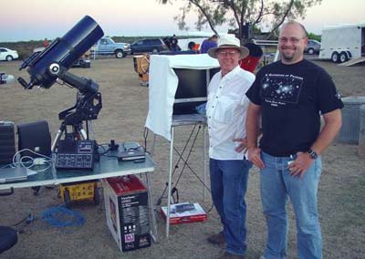
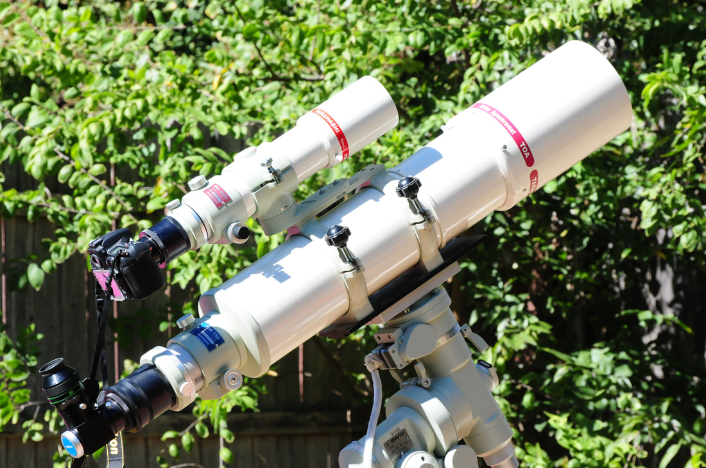
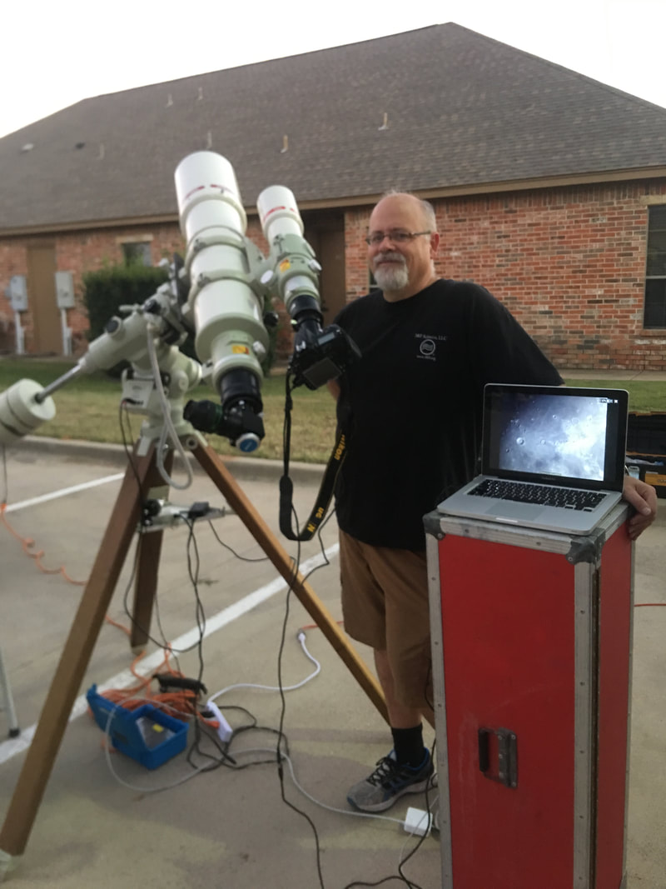

### Introduction

Once I started in the hobby of astronomy, I fell in love with a large number of its aspects. I believe it comes naturally, for many of us, to share that love with others, as with any other passion in life. Today, nearly 20 years later, I remain a staunch advocate for educational outreach in astronomy.

And for me, it's not just the "love of space" that is its biggest selling point — well, not entirely. While showing people the awesomeness of Saturn through a telescope is really cool, I get as much out of showing off the technology side of things too. Perhaps you will forgive me of my status as a "gear head," but I am equally amazed at what we can DO in this hobby as much as what we can SEE.

Truthfully, I believe that for many people, what they've never seen (i.e. the sky) doesn't grab them nearly as much as what they didn't realize they can do (i.e. control a telescope with an iPhone).

It's something like this line of reasoning... "I like to eat fish, but until you either make them cheaper to eat OR you show me how to catch one, then I'll just eat hamburgers."

That translates to astronomy something like... "It would be interesting to see that space-stuff, but unless you show me a way to see it from my house, then I'm not going to worry much about it."

For example, your choice of outreach "gear" will be impacted by whether you want to "show off" the cool things we can do in the hobby or if you just want the sky to speak for itself. So, it might mean the difference in purchasing a Dobsonian reflector versus a dedicated imaging setup.

Similarly, you probably have an idea about the kind of people you want to reach and the setting in which you plan to do it, which brings into the picture issues such as handicap accessibility, audience aptitudes, and even the purpose of the event organizers. For example, in many cases, outreach organizers will want you showing off specific observing targets in concert with the overall efforts.

Lastly, your own capabilities as an astronomer needs to be considered, since your ability to make things interesting to the public will depend upon the confidence in those abilities as well as any special qualifications you bring to it. After all, if you are an expert on a particular aspect of it, then you probably want to focus most specifically in those areas.

*So, overall, outreach astronomy becomes about three central issues, namely the content of the effort, the context in which you deliver it, and your ability to communicate it.*

We will consider these three central issues more specifically as we delve into the article. But, for most of us, the choice of outreach gear is more simple than that — we just need to know if eyepieces or cameras will be our window to the stars.

### Visual Observing

Sidewalk astronomers have been trying to show people the stars for many decades. Many of us are familiar with a guy named John Dobson, who created a telescope of his own design primarily for this purpose. Therefore, it stands to reason that the popular, easy-to-use Dobsonian reflector telescope (the "Dob") is by far the most practical and useful telescope for public outreach.

Looking at the Dob, it's easy to see why they make good outreach scopes. First, they require no electrical power. There is no need to string long extension cords to a power outlet, if such an outlet even exists. Plop them down anywhere and you are good to go! Dobs also deliver a lot of aperture at a lower price... and we know that sidewalk astronomy in urban areas (where the people are) requires larger apertures if you hope to see a lot of objects other than the moon, planets, stars, and brighter deep space objects.

Of course, a Dob is not without its list of cons. You certainly have to be somewhat proficient as an observer to "starhop" to many of the fainter objects in light polluted skies, where the problem is that there are much fewer stars to "hop" with. And unless you are using a Dob with tracking abilities (either with motors or on a tracking platform), then higher magnification views of your targets can cause some issues when going from person to person. After all, Saturn at 300x power doesn't stay in the field of view for very long! Of course, other scopes are not immune from this issue, but today, with more and more electronic scopes with built-in tracking motors being sold, then you probably realize that the automatic "tracking" of your targets is a very nice feature.

A common issue with ALL visual setups is that focusing can also be a challenge from person to person. When using higher powers with lower "eye-relief" — which is the amount of distance your eye can be from the eyepiece to see anything — people will need to remove their glasses... and this means that they will need to refocus for their eyes. I advocate long eye-relief eyepiece designs, like the Televue Delos (or the discontinued TV Radians) for this reason. In this way, observers will not feel compelled to remove their glasses. Alternatively, using a longer focal length eyepiece PLUS a barlow lens will provide better eye-relief than a more powerful eyepiece when used by itself. I like a good Televue 2x Powermate for this application.

Finally, when doing visual observing, using higher powers means that you will likely be showing off the skies with eyepieces yielding very small exit pupils. As an advanced observer, this likely isn't a huge issue, but for the newbie public, they might not be able to see the object at all while looking through such a small "pinhole." And this sensation is compounded by wide-field eyepiece designs with larger apparent fields. As such, the head has to move much more to "find" the object within the pinhole for an eyepiece like a TV Nagler or Ethos.

My vote for the very best outreach setup might be shown here. Pictured is the 6" TOA-150 and 3" FSQ-85, for a simultaneous visual and integrating video presentation. I would likely use an astro CCD camera for better sensitivity if your targets are DSOs, but it's hard to beat a good DSLR for typical city-outreach targets, either running live-view or integrating 1 second images to a laptop display.

You will find that this pinhole issue cannot truly be mitigated since exit pupil is consistent with any magnification regardless of the system. In other words, even if you need a 5mm eyepiece to get the same magnification as a 10mm eyepiece on a longer scope, the exit pupil doesn't change at that magnification. Therefore, it is much easier for newbie viewers to see their targets at lower magnifications.

### Video Astronomy and Astroimaging

In early summer of 2002, Dr. Fred Koch of Quanah, Texas, began providing as equipment for the Copper Breaks State Park's Astronomy Program. As a volunteer to their monthly "Star Walk," my friend Jeff Barton and I began contemplating ways to expand the programs by providing non-traditional forms of public observing. Fred was keen on the idea and so we worked together to tap into the "dark side," chiefly using technology to interface with equipment and to communicate the cosmos to the crowds.

Jeff had experienced limited success in using video cameras to display "live" images over a small video monitor of what the scope was showing. I had begun astrophotography several years earlier and was in the process of converting to digital.

Working together, our first truly positive crowd response happened when Jeff and I used an automated Meade 10" LX200 telescope and SBIG STV integrating imaging camera to project deep sky objects and planets onto displays large enough for several people to see simultaneously. Crowds began to gather around the displays, becoming transfixed to what was happening, quite literally, in real-time. Seeing public interest in this, and knowing that CCD cameras were the future of providing interesting, entertaining, and educational content for such groups, Dr. Koch began to help fund these efforts more fully.

Same setup as shown above, but with the camera feed shown on the laptop. I use BackyardNikon software in Focus Mode, with both zoom and full-screen settings active. The digital zoom is important to project the details onto the laptop at such short focal lengths.

Those efforts turned into the "for education," non-profit 501(c)3 corporation, the Three Rivers Foundation ([www.3rf.org](http://www.3rf.org)). Today, 3RF's science division now exists primarily as a 3250-acre astronomy campus near Crowell, Texas, with facilities to house up to 100 visitors per weekend. They host twice-monthly open-public events, in addition to private events hosted throughout the year. Serving as their first Director of Astronomy during its first 3 years of existence, I had the pleasure of organizing and running their earlier on-campus efforts and installing much of the current technology, including several of their observatories.

Simply put, witnessing first-hand the public impact of available technology during those first Star Walks provided the impetus toward the ambitious pursuit of a greater reach *with* these technologies, enough so to form the awesome para-educational institution known as 3RF.

And since this time, whether through 3RF or via my own initiative, I have shown the cosmos to countless thousands of onlookers utilizing the same technologies which I will outline here.

For imaging and video applications like these, aperture "rulez." Don't be deceived... it's not about f/ratio. It's about your ability to lift the signal out of the noise by collecting more light in the first place. This means that city-outreach benefits greatly by larger aperture scopes, which is true in both visual and photographic applications.

