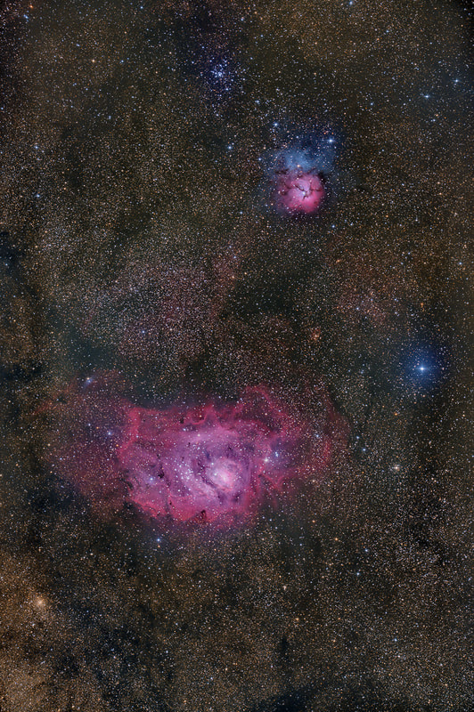
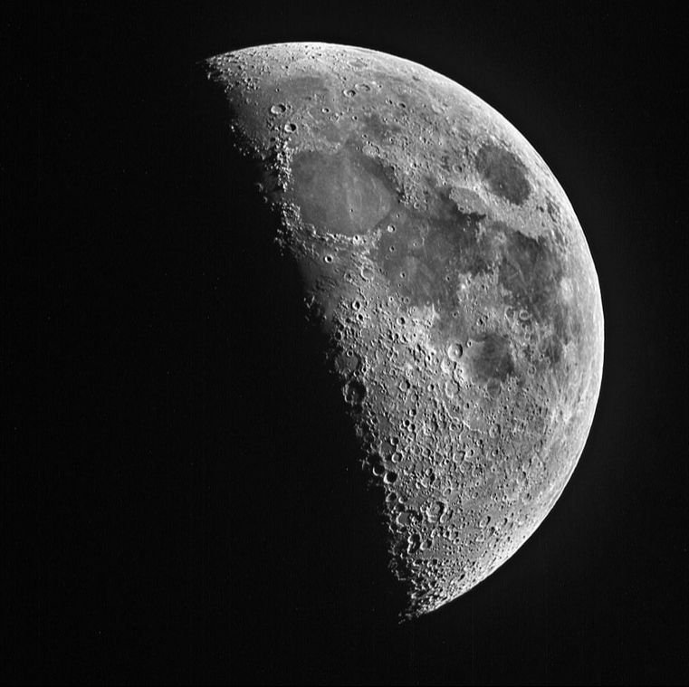

I love astronomy gear. I dream about it. I find myself contemplating all the ways I would design new products and prepare users for the impact they will have. While I lack the insider's perspective of sales margins and market-shares, I am a telescope guy with an uncommon experience within the amateur astronomy hobby. I can speak strongly from a consumer's point of view as an advanced hobbyist. Likewise, my standing as an astronomy mentor and teacher within the education industry gives me a unique perspective that Celestron might find useful. I would like to share some of those perspectives below in the form of my qualifications. Then, please allow me to speculate upon specific areas where I feel that market effectiveness can be improved via products and their placement, as well as to build consumer confidence, trust, and loyalty.

## My Unique Qualifications

- **A singular knowledge of astronomy equipment and applications** — I have been in the unique position of working with the vast majority of all equipment and accessories on the market, both currently and historically. I am versatile in all astronomy applications; my interests are broad. I am a world-class astrophotographer getting an early jump on digital imaging, with an appreciation of having originated with film. I am well-versed as an observer, learning the sky by star-hopping well before I purchased a "goto" telescope.
- **Knowledge of the amateur astronomy market** — I have bought dozens of telescopes from the consumer side. I know thousands of fellow observers and photographers and I keep in touch with trends and needs of current hobbyists. I was a moderator of the online forums at the *Astronomy* magazine website prior to it being discontinued. I have contributed in many other popular internet communities, such as the forums at CloudyNights.com and on many Facebook astronomy groups. I have also been a member of the large astronomy clubs in the DFW area, including TAS-Dallas and Fort Worth Astronomical Society. I have a history of working at hundreds of public events with millions of viewers through my telescopes and I know what they expect in their views and images.
- **Being known among the industry** — I have developed contacts with most makers and vendors by virtue of my exposure to astronomy gear and my status within the amateur astronomy community. I know many book authors, having contributed images to their texts. I have beta tested gear from Sky-Watcher, having contributed images for their magazine ads. I remain close to many of the vendors I have met or contacted over the years. I have conducted workshops with astronomers and authors in the field, among many others. As such, I am well networked within the industry.
- **Familiarity with Celestron's current product line** — I understand the pros/cons of the current products including the history and lineage of their development. I understand which products are regarded as good value. I have strong opinions about those products which yield the best results and those which are frustrating to use. I know why current products are being made (for market reasons) and how they are being placed or positioned within the market. I see opportunities for equipment and accessories that I believe would fill some needed segments of your market.
- **Familiarity with Celestron's history** — I know Celestron's legacy products, having been a long time consumer. I also have owned or used almost everything Celestron has ever made. I know what products needed my attention and what didn't; I know the bad from the good, both aesthetically and functionally. Mostly, I know that this history is important to build consumer faith and continuance. Celestron should be the unquestioned leader in that regard.
- **Familiarity with the market place** — As a fan of telescopes, I know the current products within today's market place, not just those from Celestron. I know the tools available to amateurs and how those tools fit together to form more complex systems.
- **An inside track into the education market** — As an educator who has pushed school districts to do applied astronomy instruction, I know why education has yet to fully embrace modern technology. I know the struggles that teachers face in learning how to use telescopes in education and what prevents districts from implementing astronomy "labs." Importantly, I know how manufacturers can reach this market. I speak the language of educators and have many contacts within science education.

## Celestron and Sky-Watcher Equipment Experience

I have either purchased or made use of the following Celestron and Sky-Watcher instruments:

- SCT OTAs including C-8, C-9.25, C-11, C-11 Edge, & C-14
- Refractors including Celestron 80mm guidescope and 150mm achromatic refractor; Sky-Watcher Esprit 120 & 150 apochromatic refractors
- 11" Rowe-Ackermann Schmidt Astrograph (RASA)
- Mounts including Ci-700, AVX, CGE, and CGE-Pro
- NexStar 5 and 11 SCTs
- Nightscape 8300 CCD camera
- SkyMaster 12 x 60 binoculars
- StarSense Autoalign, SkySync, and SkyPortal
- Celestron PowerTank 12v

Now that you know me, here are some convictions I have about amateur astronomy, representing what I have learned and believe about those who attempt to enter our hobby. I feel that I have a firm understanding of the "consumer" in today's confusing and technological market place. As somebody who could be in a position to make or influence decisions where products are concerned, these principles would guide me in the direction I believe the industry should go.

1. **Consumers need more than a telescope.** They need to know that if they choose Celestron, then they will have a better user experience than one from a competitor. They might need a supplement to the manual that teaches them how to use their investment. They might need a reliable internet community to ask questions. They could certainly use more videos posted to YouTube to learn their gear. In a hobby where satisfaction is largely based on growing a SKILL, my experience is that products must support the growth of said skill. I know of NO telescope maker that truly does this — I know many other industries of consumer products that do. Additionally, time is never in abundance in this hobby. Every time a consumer must buy a third-party product to do something like polar-aligning, this learning requires time and energy that the generic hobbyist usually does not have. As such, Celestron products should have such features built-in.
2. **Consumers need an upgrade path.** A true hobbyist will always purchase more than one telescope. In a sense, if Celestron only sells consumers one telescope, then they've missed out on a follow-up opportunity, losing business to the competition. A user is more likely to upgrade their telescope if they LOVE the first one and believe that spending a little more money on a follow-up product will gain them the same experience, only better. Currently, I see gaps within the Celestron product line that can meet those expectations. The placement of such products is needed to provide ***continuity***, keeping consumers within the brand, even if they return little in profit. Such products will appeal to the most committed of Celestron customers, giving them an option to stick with Celestron, rather than jump to a competitor's product.
3. **Consumers need a way to LAST in this hobby.** Telescopes are like treadmills...they end up as laundry racks. Perhaps, like with my first conviction above, it's just a matter of buyers having the wrong user experience. But most of what I see in terms of a bad user experience comes with the natural complexity of the hobby AND the faulty expectations of a product. Buyers will always think the views should look like Hubble photos, simply because they lack a realistic perspective. Nor do many have the luxury of understanding the true capabilities of a telescope unless they are blessed with dark, rural skies. Thus, we will build toward the conclusion that Celestron as a company ***can inform*** all the while their products can function as intended.

## Strengthening the Celestron Product Line

Again, lacking the virtue of knowing specifically why telescope makers offer the products they do, it does not keep me from wondering about it. Based on the three broad convictions above, having the mind of an advanced amateur and already being intimate with Celestron (and Sky-Watcher) products, please allow me to make some observations. These prompt questions in my mind. While the answers might come down to simple market research information, logistics, or manufacturing limitations of which I am not familiar, perhaps the following thoughts might give Celestron some perspectives they have not considered...and in the least, perhaps it lets you see into the heart and mind of a guy who's thought long and hard about his hobby.

**Products placed toward beginners...** You currently have 35 telescopes priced under $250 directed toward a market that lacks the understanding of the *differences* in those products. Refractors and reflectors, EQ mounts and dobs; it's all the same to them. ***Informed*** first time buyers know that scopes in this price tier aren't recommended by the amateurs who are advising them, which means that these sourced, consumer products are directed at impulse, one-time buyers...the "Walmart crowd." I feel that Celestron could trim down some of the lower tier items — I'd keep quality instruments like the FirstScope tabletop series (especially the Reeves lunar version), a wide-field 80mm refractor on azimuth tripod mount, a longer focal length option of the same, and the 114mm newt on the CG-3 mount. I would market these heavily toward lunar and planetary observing, with white-light solar filters as a ready option.

**Middle-tier products...** Celestron currently offers only 11 complete telescopes in the $500 to $1000 segment, mostly 5" to 6" SCTs, a couple of newts, achro refractors, and a small Mak, all on non-GOTO CG-4s or GOTO altaz mounts. Celestron is currently missing a computerized mount option between $299 and $899. Consequently, ***a low-cost EQ imaging mount with GOTO fits here***, if you can innovate one at around $500.

**Astronomy Mounts...** At the lower end, Sky-Watcher carries two terrific mounts, the AllView and the Star-Adventurer, but they lack the payload to do long-exposure photography through a telescope with any meaningful size — I'd strive to produce a low-cost EQ mount with GOTO aimed for entry-level imaging at the $400 or $500 price point. Among the middle-tier mounts, the AVX is well-priced but doesn't inspire much confidence in me (I have one at home); the CGEM-II seems a bit redundant with the Sky-Watcher EQ-6 types. At the high-end, the CGX and CGX-L are solid mounts, but I am skeptical of the belt drive system and gear-box, which would appear to lend itself to some drive noise. I feel that these mounts are ***under-priced*** — astronomers who pay $3500 to $14,000 for large SCTs and RASAs are prepared to pay slightly more for mounts that handle these great OTAs. I would work toward a fresh redesign — partly out of orange aluminum extrusion, with a quick and accurate through-axis polar-alignment scope, targeting $3000–$3300 for refractor users and 11" SCTs, and $5000–$5500 for larger RASA and C-14 users. I would also explore direct-drive technology in upper-tier mounts, and consider bringing back a newly designed fork-mount option that allows any OTA to be attached to it.

**Further innovations...** I firmly believe Celestron needs to be a market leader with a few of their upper-end products — I think Celestron is on the right path with the RASA, but I would look to produce other such "halo" products. Celestron binoculars are great, but a binocular chair or mount is an obvious missing accessory. For a potential "halo" product, why not consider a pair of 5" or 6" binoculars to go against Fujinon? I see a lot of potential in the camera market — I would want at least one dedicated long-exposure digital camera to compete there, marketed to mate perfectly with the RASA, SCT, and Sky-Watcher Esprit refractors, plus an easy-to-use camera connected to a phone via WiFi with auto-stretching capture settings for non-imagers. Beyond cameras, I see where Celestron could add built-in sky quality meters (SQM), temperature sensors and variable DC fans, and a camera derotator/rotating visual back — features I'd likely market as an add-on "telescope control system" black-box that can control many of an OTA's functions.

**Random product thoughts...** While the zoom eyepieces are actually a terrific product, nobody in the amateur community knows they exist — I would put one of those as a bundle for many of your new scopes. My advice on regular eyepieces would be to demonstrate and educate the market that when it comes to eyepieces, perfect is often the enemy of good-enough; Celestron has to attack the perception that people NEED to pay $500 or more for a comparative eyepiece. The elephant in the room is the importance of the basic dobsonian to beginners and expert hobbyists alike, yet Celestron does not sell one — this leaves Sky-Watcher positioned to sell these critically important scopes. Interestingly, I am not aware of a 4.5" dob from either maker — that's the ***single most important telescope*** to sell to first-time buyers, as it GETS and then KEEPS them in the hobby. Finally, and curiously, I wonder why Celestron scopes are marketed in millimeters — 4.5" is better than 114mm, consistent with Celestron's history of selling C8, C-9.25, C-11, and C14 scopes, all of which indicate the scope's aperture in inches.

M31 — Andromeda Galaxy, taken August 10, 2015 from CBBHO near Newcastle, Wyoming, with an 11" Celestron RASA and Nikon D810a camera.

M8 and M20 region, taken August 10, 2015 from CBBHO near Newcastle, Wyoming, with an 11" Celestron RASA and Nikon D810a camera.

First Quarter Moon, taken from CBBHO near Newcastle, Wyoming, with an 11" Celestron RASA and Nikon D810a camera.

## Summary of the Products

In summary, much of what I discuss above would have the intent of putting together a more logical and cohesive product line, the success of which can be monitored not only in an increase of sales, but an increase in repeat customers. I would advertise upgrade "tracks" for buyers — one for those wanting to go up a visual path, another for those who want to climb an imaging path — showing how the systems work together and giving consumers a road-map to future Celestron products they will likely want.

People who LAST in the hobby don't just buy one telescope, they eventually buy several. I would build brand-loyalty by offering such people a good starting point followed by a logical "upgrade" path, even if those are Sky-Watcher products. The current entry products do not have logical follow-ups in your product line, so people eventually jump to gear from other makers. I would promote product ***continuity***, both in marketing and in design philosophy.

## Teach the Consumer

I would attempt to ***Teach the Consumer*** to not only show that we care about the consumers' needs, but also to lessen consumer uncertainty in such a confusing market place. In education, when we want our students to learn something, we "scaffold," or build a lesson up through sequential steps to assure their understanding of the deeper learning. For the consumer of a telescope, it is no different. We lead the consumer through the questions to find the telescope that is right for them, and then once they get the telescope home, it's the responsibility of the teacher (in this case Celestron) to get users through the difficult learning so they can experience the joy of why the telescope exists in the first place.

While Celestron currently has aspects of this online with setup videos and a knowledgebase, neither is very thorough, and really not very well known to consumers unless they run into a question and seek solutions online. Videos, especially on YouTube, should be posted with such frequency that "subscribers" have something new to watch weekly, providing not only product highlights and setup, but also tutorials on how to use them.

And this same *Teach the Consumer* philosophy is not only for the consumers, but for the overall markets in general. Those markets that you feel cannot be penetrated, like education, require industry leaders to TELL them what they are missing. Currently, educators do not buy telescopes because they cannot really afford them. There are no existing models for motivated educators to follow because they do not exist. I would outline a program for schools to follow, with example lessons that can be performed, aligned to learning objectives, and linking Celestron equipment into the curriculum. I would seek schools to pilot such programs for free and then provide other schools with incentives and discounts. At a minimum, the goal would be for all students to use or at least look through a telescope each year — something that can easily be monitored.

## Conclusion

My goal here has not been to tell Celestron, or any other telescope maker for that matter, what to do. I would have to believe that the industry is full of energetic and intelligent people who have thought a lot about the subject matter I have discussed here.

My hope is that I can communicate a perspective and an image of what your consumers truly are. Moreover, I hope that my own perspective demonstrates that there is an enormous amount of potential consumers that haven't really been reached.

As an educator who sees tremendous value in teaching astronomy to children, I am dumbfounded why parents easily spend money on their kids' phones (every two years) and schools spend serious money on extra-curricular activities, but somehow they do not believe there is value to purchasing telescopes to be used by their students. This needs to change. There has never been a better time to push kids toward future visions of a return to the Moon or a journey to Mars or a total solar eclipse. Celestron can be a leader in such efforts. If the industry steps up and lets educators know what's possible and what modern astronomy education can look like, I firmly believe that not only will more kids fall in love with the hobby that we adore, but they will also put more money into the industry itself.

