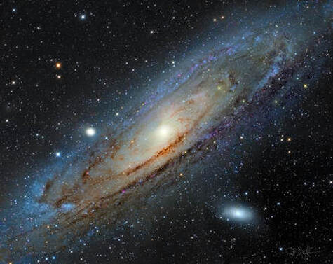
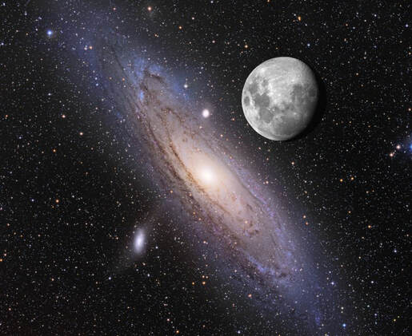
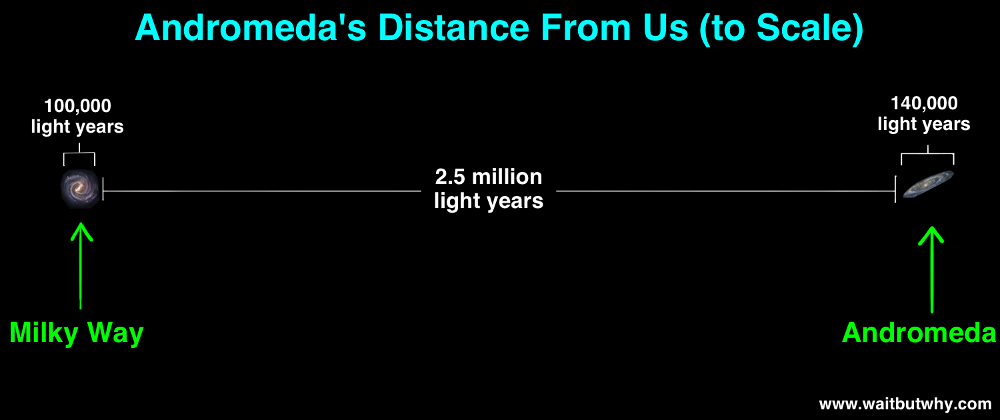

This is a galaxy. It is huge. I know, a Chevy Suburban is huge. The Pacific Ocean is likewise huge.

We use the word "huge" to describe anything that is *relatively* large. For example, my belly is huge relative to what it used to be…and because I can no longer tie my shoes.

It's an adjective that often describes the significantly larger of two *measurable* objects.

Therefore, it's inappropriate to tell our students something like, "You are a *huge* waste of my time!" After all, can we truly measure HOW MUCH of a time-waste that student truly is? Do you have a stop-watch to measure exactly how much time you lost? And since MOST of your students likely aren't respecters of your time, how can we know that all the waste isn't getting mixed up? We are educators…everything we are *supposed* to be doing is data-driven and objectively measurable, right?

So my advice is to choose from any of the following appropriate responses...

"You, sir, are a ***colossal*** waste of my time."

"You, my dear, are a ***ginormous*** waste of potential."

Better yet, "You are a colossal, ginormous, ***galactic*** pain in my &lt;bleep&gt; !!!"

Ah, "Galactic." That's most certainly a word we can use when something is *beyond* measurable. It can be used to represent something that's so utterly outside our own sphere of understanding that we cannot even BOTHER to understand just how big it is. Because doing so would give us a HUGE headache!

So when I present this image of M31, the **Great Andromeda Galaxy**, you aren't going to call it huge…because it's not something measurable with typical tools. It is quite literally so **honking big** that you can't comprehend it. That in its shadow, you are so **insignificant**, so microscopic, that you probably need to discuss it with a counselor.

Over the next three parts of this article, I will tell you just how insignificant you really are. Insignificant not only as you relate to size (Part 1), but also compared to distance (Part 2), and time (Part 3). Starting today in Part 1, we will attempt to build understanding, hopefully without the suffering. I just have to quantify it with a few teaching points to reset your earthly perspectives. This is easy because I'm such a good teacher. You are NOT a huge waste of my time!

So, let's start!

## Part 1 — Galactic Size (featuring The Great Andromeda Galaxy)

The object in today's image is called the "Great" Andromeda Nebula (known by the catalog designation of M31) for a reason, but not for the reason you think. Yes, it's colossal in size (more on that in a minute), but in truth it's rather average when compared to some other galaxies. "Greatness" comes from the fact that it's the largest, "near" galaxy to us, making it the easiest spiral galaxy to see from our own planet (other than the close-by, irregular Magellanic Clouds seen in the southern hemisphere). The bright core of this galaxy can actually be seen "naked eye" from even suburban skies if you know where to look. And from very dark skies most of the galactic "disk" appears quite obvious to the observer. In this case though, M31 will not appear large to you when compared to something like the moon because you'll still be seeing a small, bright portion of the whole "surface" of the galaxy.

It's only with a camera that you can accumulate enough light sufficient to reveal the fainter extremes as shown in today's image. But if you could see the entire galactic disk with the naked-eye, using the full moon for a size reference, it'd likely look something like this...

The apparent size of the Andromeda Galaxy as compared to our own Moon. Roughly 6 times larger in the night sky, M31 would appear massive if we could see its faint extremes. Credit Adam Block and Tim Puckett.

In fact, many of our "deep space objects" (or DSOs) are quite sizeable in the night sky, which speaks to an important point about how we use telescopes. It's not so much about "magnifying the view" or "zooming" it in, but rather gathering enough light to see objects in the night sky. So a "larger" telescope is said to have a bigger objective (which could be a mirror or a lens) and an opening large enough to accommodate it. In this way, telescopes are "light collectors," funneling precious photons into your eyeball.

The way WE see the objects in our own sky is what we call "apparent size." The actual size requires more science to compute, but I think we can approach some idea of that by making a few points about the galaxy itself.

First, M31 has an estimated 1 trillion stars. That's a number that's hard to fathom, especially when you consider that our own sun is a star complete with its own solar system, where the nearest star is over four light-years away. And yet, Andromeda has a trillion of those, each with their own solar system full of their own planets (and none of them are flat, by the way). Just for reference, our own Milky Way galaxy has about half as many stars.

Because 1 trillion (or 1,000,000,000,000) is so enormous, let's try to put it in perspective:

- if you count one digit each second, it will take 31,709 years to reach 1 trillion.
- It would take a military jet flying at the speed of sound, reeling out a roll of dollar bills behind it, 14 years before it reeled out one trillion dollar bills.
- A trillion dollar bills, laid end to end, would stretch 96,906,656 miles — further than the distance of the earth to the sun.
- A trillion dollars laid side to side, would cover more square miles than the states of Rhode Island and Delaware combined.
- if you stacked up one trillion dollars, it would be 67,866 miles tall, or about a fourth of the way to the moon.
- stack a trillion pennies as close together as you can, and it would look something like a small mountain.

*Note: Our national debt is over $30 trillion dollars...so a stack of that many dollar bills would be over two million miles high...which is four round trips to the moon.*

There's another way to think about size, which can be somewhat confusing, and that is to regard the ***mass of the object***. Usually, to measure the mass of something, we would weigh it on a scale and then divide it by the acceleration of gravity. It's an easy computation to make when you have a scale big enough to weigh it. Good luck if you are a planet, or a star, or a galaxy, all of which scientists can estimate (within an admittedly large degree of error). The method goes beyond the scope of this article, but for galaxies it's accomplished by judging the speeds of high-velocity stars and estimating galactic mass based on how the star appears to be breaking the galaxy's gravitational pull, a concept known as ***exit velocity***. Because more mass means more pull, estimations can be made of a galaxy's size based on the star's mass, position, and rate at which it's trying to escape...or more accurately, it can be used along with other similar stars to provide a model representing the galaxy on the whole.

The measure of mass for any colossal space object is typically given in "solar masses," which gives a means of comparison of these objects with our own sun, known to have a mass of 1.989 x 10^30 kilograms, or roughly equivalent to 333,000 earths.

In this regard, scientists have been able to compute the Andromeda Galaxy as having the equivalent of 1.5 trillion solar masses. This seems to make sense if there's ~1 trillion stars and if Sol (the name of our own sun) is considered a very average (main sequence) star. More recently, when measuring our own galaxy, the estimates for the Milky Way have grown to be roughly equivalent to the Andromeda Galaxy, and maybe even larger. Considering that our own galaxy is known to have roughly half of the stars of Andromeda and that the size of its "disk" is maybe 3-quarters as big, then you would be right to ask ***what accounts for the extra mass***?

And this is why, sometimes, you just have to "**science the $&%!**" out of stuff. In actuality, scientists estimate that only ~10% of the galactic mass of the Milky Way is stars, planets, and the like, which means there's something else that we cannot see, some other "matter," that is responsible for the other ~90% of the mass. This theoretical matter has been coined **"dark matter,"** which was originally introduced back in the 1930s, but it wasn't until the 1980s that scientists began to understand how much of gravitation is invisible. And in current thinking, only ~0.5% of known gravitation comes from matter we can actually see...and up to 85% of all matter is likely dark matter.

The real mind-blowing dilemma, which is the source for the original hypothesis on this issue, is that in the 1930s scientists figured out that the galaxies around us are not moving as expected by the laws of physics centered around Einstein's Theory of Relativity. Instead, scientists like Edwin Hubble discovered that galaxies are actually ACCELERATING in their movements through the universe at a very predictable and constant rate (Hubble's Constant) and that some mass we cannot see must be responsible for the acceleration...you could think of it as "anti-gravity." Scientists call it **"dark energy."**

So, there's something invisible within galaxies that attracts objects with mass gravitationally, known as ***dark matter***, and there's something invisible outside of galaxies that repels galaxies on a much more grand scale, known as ***dark energy***.

Even more bizarre, we've known for almost a century now that the Andromeda Galaxy is being drawn in a direction toward our Milky Way galaxy, which was always theorized to occur in a few billion years. But more recently, data has shown that the galaxies are MUCH larger than we thought. As shown in photographs, the visible parts of the galaxy are rather obvious, but we now know that there's a faint halo surrounding the galaxies full of star clusters and dark matter that are most definitely part of a galaxy. These halos extend out perhaps a million light years from their galactic cores. This means, quite possibly, the Andromeda and Milky Way galaxies are colliding AS WE SPEAK.

Surely, you might think that we should be able to see such a collision visibly? Well, we won't be equipped to deal with that question quite yet. So let's dig into another important cosmic perspective first...

## Part 2 — Astronomical Distance

When you look at today's image — taken by me in August, 2019 — you need to know that it's "close" to us, about 14,700,000,000,000,000,000 miles away. Doesn't seem very close, huh? But since it's one of the near galaxies to us, among likely millions of other galaxies (!), then it's right to say that the Andromeda galaxy is in close proximity to us. But it makes no sense using such numbers when talking about something at such a cosmic scale. So we need a better way to both communicate and relate.

I don't need a tape measure or some physical measuring device. For example, if it takes me 5 minutes to get to Taco Casa to buy 6 tacos while going 40 miles per hour, I know I'm just a few miles from adding to my ***huge*** belly. If there's a school zone, I know it'll take longer. This is math. Don't worry, it's one of those "math is everywhere" things that you probably forgot about because you are like my math students.

But the point is, I can measure this *not* in traditional distance units, but rather by just saying that Taco Casa is "5 minutes away."

A Toyota will not work for something "cosmic," so let's use something faster: LIGHT itself.

You know that light has a "speed," even if you aren't willing to comprehend. Remarkably and quite simply, this can be measured in a variety of ways. We won't do that now, but the speed of light is around 186,000 miles per second and the distance of our light source, the sun, is around 93,000,000 miles away from us.

This means that it **takes light around 8 minutes** to get to us...and if we wanted to we could just say that the sun is *just 8 minutes away*, but not in my car (maybe yours). At least I can get tacos in less time than it takes a light particle (photon) to reach me from the surface of the sun. But because of the higher speed limit with light, this can be a usable measure for interstellar travel if we consider the distance that light travels in 1 year, yielding the concept of the "light year."

We could convert a light year to miles, which is ***5.88 trillion miles***, but now we are stacking money to the moon in our attempts to comprehend it. And when we talk about something like our nearest star, Alpha Centauri, which is ***4.246 light years*** away, using the same units we'd use while driving to get tacos just doesn't make sense.

For middling distances, like within the solar system itself, we have another option, and that is to normalize the sun/earth distance to something else, like 1 "Astronomical Unit (AU)," and then relate this measure to other objects. For example, instead of saying that the closest that Mars can get to us is approximately 34 million miles, it's probably better to just say that Mars can approach within 0.373 AU. Jupiter will be 4.2 AU away at its closest, and Saturn is nearly 7 AU. So it would take almost an hour for light to reach Saturn from the sun (8 minutes × 7 AU = ~56 minutes). This is a lot easier than saying Saturn is more than 650 million miles away. Even Alpha Centauri is ***270,000 AU*** in distance from us...so astronomical units are sufficient only to a point...and we'll need something larger to measure objects outside our own galaxy.

Speaking of which, how far away is the Andromeda Galaxy? Let's NOT use miles, since they don't make big enough numbers for that without resorting to some rather painful scientific notation. Nor let's use AUs, since it would be around **140 billion** of them! In light years, it would be **2.5 million** light years away, which is a big number, but at least it will fit on a calculator. And with this new perspective about distance, now we can revisit the size of M31. How big is it? Well, it's about ***200,000 light years*** across, from one edge to the other. Compared to our own Milky Way Galaxy, which is estimated at ***150,000 light years*** in diameter, you can think of it like this...

If our solar system out to Neptune was represented by a US quarter, then the Milky Way would be around the size of the continental United States while the Andromeda Galaxy could be approximated by the entire North American continent.

## Part 3 — A More Universal Concept of Time

Einstein is confusing. Well, I should say that what Einstein theorized is confusing. But if you could summarize ALL of Einstein's thoughts into one single idea, then it would probably come down to TIME as being a part of the "fabric" of SPACE itself.

In the most fundamental aspect of this, we could say that time only exists within "space" and that time does NOT exist unless there is "space." This has all sorts of ramifications for science, and even religion. For science, it means you are quite limited to only the existing laws of physics and mathematics; that no other tools for doing science *beyond* actual "space" will be available. As such, a scientist will not be able to explore avenues with regard to a "prime mover" or some mechanic that might cause "creation" to occur since, like religion, doing so would require either a leap of faith or pure conjecture.

For religion, it would mean that a "Creator," who would sit ***outside of the bounds*** of space (and perhaps choosing to be immanent within space as well), would not be bound to TIME as a concept...or at least as we understand it. As such, perhaps a study of the Bible (or whatever religious text you choose) should likely mean that you not think of "eternal" concepts such as "heaven" or "hell" as ***everlasting***, but rather as ***timeless***. But I digress.

The real question, being a person "in space," is HOW CAN THERE BE NO SPACE? And therefore, how can there be no time?

This is where the word "fabric" comes into play. Just as a dress is made of fabric, the universe is made of the fabric of space. While we are inclined to think of space as "emptiness," it's more likely that space is something more. Could space be energy or matter we can't see, which gives rise to our observable universe? Could the causal forces of what pulls galaxies within and pushes galaxies from outside actually be the fabric of space itself? Is space actually dark matter and dark energy? Hmmm? It's questions like these that are driving current scientific thought.

For the lay person, you might also think of "space" as a canvas...or perhaps the surface of a balloon. You would not see the canvas because it's covered with paint. And the surface of the balloon is a good way to think of a "Big Bang," which is not what you think it is or the thing that your Sunday School teacher rails against at church. Instead, if you blow up the balloon, then you can see how EVERY PART of space is exploding simultaneously, or every part of the balloon is expanding at once, when it "blows up." In other words, the observable universe did not first appear from one singular point in space, but rather space first appeared "everywhere" and then expanded all around simultaneously.

What's strange is it would seem to imply that you need "space" for ***space to expand***. But remember, if you think of space as a "fabric" of energy or matter, then space could expand into an already existing, empty void. And these two aspects must be separated for further understanding. "Space" is not the void itself...it's what filled the void.

At the end of science is the question, "What is responsible for filling that void?" I guess it could be said that this is where religion picks up. Though that's probably giving religion too much credit...it never understood any of this scientifically or objectively. Rather, it just looked up and said, "Holy cow, who's responsible for all this stuff?" But that's a question asked by every person capable of a philosophical thought, not just somebody who is religious.

*Aside: If this universe is considered the expansion of space to "fill the void," then who's to say there aren't MULTIPLE expansions into the void over what we know as history? That would lead to multiple universes expanding within the void all at once...which would be something akin to galaxies expanding all over our known universe...and just as the galaxies can merge, what perhaps keeps these universes from merging as well? And what if what we know as the "void" is something entirely more...where multiple voids exist...each having multiple universes...leading to...well...who knows? Quite simply, there are dimensions to reality in existence that physics can't hope to measure, at least until tools are developed to measure what's outside of space and within the "void." And there's a certain arrogance within science AND religion that believes it's possible to know. Science doesn't have the tools, and religion can only use metaphor.*

Back to Einstein...

If space is like a dress and is "fabric," then there will be places where the fabric is stretched relative to others, or even in some cases, completely torn. You should know that space will always "stretch" around objects of LARGE mass, like stars. This leads to effects like "gravitational lensing," where we can observe objects in space BEHIND other objects because light will bend around what would otherwise be an obstruction. What should be invisible, as with something like "Einstein's Cross," is clearly visible as the object behind becomes refracted by space itself.

Even something like gravity itself could be explained by the same phenomenon. For example, if we think of a heavy ball on a trampoline, where the surface of the trampoline bends to accommodate it, then not only would other balls placed on the trampoline naturally "gravitate" toward the object of central mass, any ball flung around the edge of the trampoline would tend to spin around the edge first...and in space, where there's nothing like the friction of a trampoline to slow it down, it would just spin around in orbit forever.

And where space is "torn" might be what we consider a "black hole" or maybe a "worm hole." While it all sounds like science fiction, it's interesting that such fantastical ideas have to come from somewhere, and it's typically science itself and some quiet, healthy hypotheses.

Knowing this about space, how we should understand TIME is quite obvious...if space can fold, bend, compress, or stretch — if it is pliable or even malleable — then time would have to be localized to a particular position within space. In other words, if distance can change by how space can be bent, then time must change inversely proportional to it. (rate = distance/time)

Thus, TIME can speed up or slow down relative to where you are within space itself...hence, the "Theory of Relativity."

But as an observer of something like the Andromeda Galaxy, time plays out a different way. By saying that it's 2.5 million light years away, then logic holds that those light photons left that galaxy 2.5 million years ago and, therefore, when the light reaches your eyes it will be "old" light...forming the appearance of a galaxy as it appeared 2.5 million years ago. This means that when you look up, you are actually looking back in the past!

On the grand scale, 2.5 million years is a short time in the life-span of a galaxy. So the way it appears now versus the way it IS now shouldn't be all too different. For example, science does estimate an average galaxy to require around 1 billion years to complete a rotation around its core. So from our point of view Andromeda would be lucky to move 1 degree during that 2.5 million years. But this is still something to consider.

More practically, it means that the sun can blow up...but it'll take you 8 minutes before you know it!

More sobering is this thought…if it takes light 8 minutes to get from the sun, then the light captured by my telescope in my galaxy image took approximately ***2.5 million years***. And you complain that it takes 5 minutes to get tacos! Importantly, it also means that my galaxy image is a portrait of how the galaxy appeared 2.5 million years ago…not as it currently is.

Don't believe in time machines? Well, behold, when you look at astronomy images, you could be looking back **eons** into the past. In truth, we can't possibly know what the galaxy actually looks like right now.

------------------

BTW, "ginoromous" is a stupid, made-up word and should never be used. Choose "galactic" instead.

jay ballauer 
LRHS Math Department
