Developing a Plan for Our Images

**Preface**

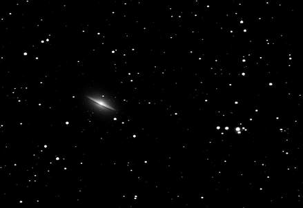

Once upon a time, I was a noob.  When I began in the hobby, I learned to find objects in the sky by star-hopping my 10" Meade LX50 telescope around the sky.   One of my favorite objects to view through that telescope was M104, the Sombrero Galaxy, shown at right.

It seemed only natural to connect my SLR camera (note the lack of a "D" in that acronym) to the back of the telescope to attempt to image this favorite object.   And I have to tell you, I was never all that successful at it, especially with film. I struggled with that scope, as it was just too long (2500mm) and I was just too green.

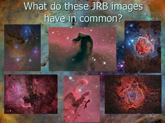

Whether you say that the images have something interesting in each area or that "north" wasn't necessarily "up," a well done image speaks as much about the astrophotographer as it does the object. These objects have been taken a thousand times by your peers, but thinking of them a subjects and not merely "targets" can set your images apart.

I would eventually get a nice apochromatic refractor and some better lenses to piggyback atop that scope, and I achieved some nice successes with film on many subjects.  But galaxies?  I really never impressed myself with film, regardless of the focal length I used.  

In fact, even when I switched to CCD imaging, it still took a while to learn how to capture galaxy photons on the chip.

Take M104 for example.   I would come back to it several times over a couple of years, using a Meade 208xt and then an SBIG STV and then an SBIG ST-7E.   While encouraged by some of the results I was getting, I still hadn't gotten an M104 shot that I was particularly proud of.    But around 2004, I got an SBIG ST-10xme and paired it with a 3" Takahashi FS-78 refractor on a Losmandy GM-8 mount.  The result is the picture of M104 up there.   Talk about being proud!   Perhaps it was the good focus or the fact that I caught the "Hammerhead" asterism with it?  Not sure, but I know that I was pleased.   So pleased, in fact, that I began the website, Allaboutastro, as way to show others how excited I was!  

For the reader who is shooting images like that and beaming with the same amount of pride that I had, perhaps you should skip this article and come back to it next year?   I want you to enjoy and be proud of your accomplishments, as I know that it is HARD EARNED.   

At this risk of being pretentious, this article is for those who want to evolve and take their images to the next step, which begins with a plan, a mental picture of how you want your final images to looks.   I make no judgments with regard to you, or even to my image posted above.  I post it with pride.   But if you decide to continue, then you'll hear me talk about what makes good images...and by the definitions and descriptions I give, that M104 shot just doesn't qualify. 

So if you continue reading, don't be offended if my words hit home a little too strongly.   Simply take them to heart and use them as a catalyst to improve.  Trust me when I say that I WISH I had somebody telling me these things - I had to learn them through experience.

## Introduction

As an astro-imager, I'll say it right now - I do not like the term "target" when referring to our subjects.    However I suppose that a website about astrophotography (or observing) cannot avoid usage of the term, and neither will this one. But I find it to be one of the more amusing aspects of our hobby, our love of the manly, ballistic metaphor...

"Let's sight our targets with our scope and then fire off a few rounds with our photon cannons!"   We seem more likely to "man our artillery" and "snipe the cosmos" than we are to merely "photograph the sky."   

That'd be way too boring.  It lacks adrenaline-pumping adventure!
My disdain for the term originates because the analogies are just incomplete to me; or better said, they fail to promote the "space is a landscape" philosophy that I espouse (see my article on the topic here).  I believe that the notion of a single "target" leads imagers to a tendency toward poor composition - great stories that can be told by our images become the picture of a single target, center chip, surrounded by a bunch of black space.  Sometimes I feel like we are just reading from an Astronomical League object list and then, check, we are done.  I was always partial to people who could sketch what they saw, as if the artist truly saw the value of the object itself.  

As such, after a while of doing the "checklist" thing, one's collection of images does little to distinguish themselves from each other, or from any other image out there.  Nor does it help to tell the complete, real story - that space is a dynamic maelstrom of activity.  Those targets are moving and changing. There is interaction between the components of the image. 

For me, a "target" or "target-object" is compositionally better when it does not define borders.  And in many cases, even taking a portion of an object might be a more interesting image.    Thus, trying to capture a wide range of activities within the dynamic subject matter is a worthwhile pursuit.  For me, this is the center of any imaging plan - appreciation of the subject matter itself.

Even the term "object" by itself leaves little to be desired.  Whereas objects are a convenient and logical way to catalog our images, the concept confines us to our pre-conception of that object alone…it is usually much larger than we think it is and much less alone than everybody reasons it to be.

<blockquote class="ke-callout">

"Whereas objects are a convenient and logical way to catalog our images, the concept confines us to our pre-conception of that object alone…it is usually much larger than we think it is and much less alone than everybody reasons it to be."

</blockquote>

To develop a good plan, this article will look at various classifications of objects "worth" imaging from the perspective of the subject.   In the first part, we discuss what types of objects to image with specific kinds of telescopes, cameras, and filters, including techniques best suited for the type of image you will put together.  RGB?  RGB with separate luminance? RGB with hydrogen-alpha luminance? Luminance or H-alpha only?  Full mapped color; spectral band?

After that, we will address how we might be able to combine multiple data sets (mosaics and multi-scale images) and how to plan our data acquisition with that in mind for a given subject.

Finally, I will provide you with a large recommendation of specific subjects to shoot, based on coverage area, camera types, and telescope optics (field issues).   And then we will wrap it all up by looking at some ways to execute your plan through the final processing of the image.

## Our Subjects and the Tools for Capturing Them

In my article, "The Beginner's Telescope," I highlighted four different types of imaging setups that amateurs are likely to employ.  To summarize, I list them here.  
Lunar/Planetary Setup - One of the easier methods to get started in imaging is to hook a DSLR or video camera to your long-focal length scope, point at the moon or planets, and let 'er rip!  With free software, you can produce mind blowing images with a little practice.   SCTs are the preferred scopes here, though it's possible with Dobs if you have built-in tracking. 
Solar setup - To take a picture of the sun, you can purchase a white light solar filter for your telescope, any telescope, and shoot away.  Thus, there is no specific requirements here...just be well informed and keep it safe.   But there are dedicated instruments that ONLY image the sun.  These "h-alpha" solar scopes let you explore some great solar views in the way we perceive the sun, as a big ball of burning gas. 
Wide-field Imaging -  Images that capture a wide field of view are typically captured with shorter focal length lens and telescopes.  It is highly recommended that the deep space object (DSOs) imaging novice begins here, if he has the money to invest.The vast majority of the setups in the hobby will be of this type, especially since they lend themselves well to portability and ease of difficulty.  Multi-object images, star fields, and Milky Way vistas are typically the subjects "du jour." 
Narrow-field imaging - DSO imaging at higher resolutions happen at long focal length, and thus a much narrower field of view.  It is the most difficult form of astrophotography due to the long exposure times at higher "magnification," requiring a premium on instrument performance, learning curve, and cost.    Longer focal length APOs, RCs, and SCTs on smaller targets are typical. 

While much of these equipment combos are dictated by experience level; most of it is determined by budget.   Because many people only have ONE such expensive setup, not every subject will be optimal.  Whereas many imagers are not deterred from capturing small galaxies with their short-focal length refractor, doing such often comes from necessity, not by choice unless, truly, you do not know that longer focal length instruments could do the job quite a bit better! 

So, at first glance, it would seem that we have no choice.   If we buy a short focal length refractor, then we are stuck with wide fields.  But let's ask what this looks like from the subject's perspective, as if to say, "I am an extended emission nebula.   How would I like to be shot today?"  

In taking a "subject-first" point of view, we will provide potential answers to the following questions:

What various instruments might yield acceptable and differing perspectives on the object?
Is resolution required to best represent the object?
Will spectral band filters be effective?
What kind of exposure times should we consider?
Should the object be captured in part or in full?
Will there be any issues with finding the objects?
Any other tricks that make for a more unique image?

Up for discussion will be the various subject types, 20 in total.  I will give recommendations for shooting them, including optimal focal lengths, preferred equipment (optics, cameras, and filters), and methods (RGB, LRGB, HaRGB, mapped color, or grayscale) that provide us the best chance of aesthetic success.  I will assume use of a grayscale astro camera with color filters, but I will make a few comments about DSLRs for these subjects in parentheses. I will also suggest how to approach the subject when we lack the optical tools, chiefly with our wide-field rigs.   

Our Subjects...

1.) Galaxies (size above 15') - Best captured with long focal lengths in LRGB - H-alpha enhanced for select objects; non-IR-blocked luminance; expose heavy luminance with optimized sub-exposures; watch for ejecta and jets; dust lanes interrupt brighter star clusters and HII regions; plan to use non-global, non-linear histogram stretches to reveal areas of contrast.  (DSLR - Beyond M31, its difficult to capture individual galaxies unless you can control thermal noise in colder conditions.  Dark skies are an imperative.) 

2.) Galaxies  (5' to 15')  - Long focal lengths in LRGB - non-IR-blocked luminance; expose heavy luminance with optimized sub exposures; watch for ejecta and jets in the edge-on varieties and ellipticals. (DSLR - Same as #1.  It can be really hard to differentiate details between galaxy arms and the dark sky background.)

3.) Galaxy Clusters (small and large) - Medium focal lengths in RGB/LRGB - Blocked-IR luminance to preserve star colors; more total exposure time makes for more interest; be careful with global adjustments; work galaxies separately. (DSLR - Concentrate less on the galaxies and more on what's potentially in the background.  Go long and attempt to capture background IFN - intergalactic flux nebula - in dark skies.  Modded-DSLR is a significant advantage.)

4.) Open Clusters (1 to 2 degrees) - Medium focal lengths in RGB - Blocked-IR luminance to preserve star colors; watch for star core oversaturation and color loss; add diffraction spikes for aesthetics. (DSLR - Excellent subjects for a variety of DSLR users.)

5.) Globular Clusters (20' to 1 degree) - Long focal lengths in RGB/LRGB - Can get by with shorter exposures to sharpen core stars; focus well and often; be mindful of brighter cores; be sensitive to yellow and blues, old and new stars; plan to use a good logarithmic stretch to make core stars visible while revealing surrounding stars.  (DSLR - Excellent subjects.) 
​
6.) Single and Double Stars (20' to 1 degree) - Varying focal lengths in RGB -  larger FOVs could be needed to accommodate diffraction spikes; add them for aesthetic color.  Consider a blocked-IR (or cut filter) to preserve core color.  (DSLR - A strong suit for you.)

7.) Emission Nebulae (20' to 4 degrees) - Short focal lengths in LRGB/Ha/Spectral -  Collect tons of data, especially for IFN; balance Ha data with enough red and clear luminance; strong blue is important for reflections; plan to process with wide dynamic range in mind, not everything is a single shade of cherry red.  (DSLR - Modded cameras are important to increase the h-alpha signal.  Stick to brighter subjects; avoid Sharpless catalog).
​
8.) Reflection Nebulae (1 to 3 degrees) - Varying focal lengths in RGB and LRGB - Strong, well-focused blue channel data is imperative; plan for well balanced color; don't wipe out reflections for the sake of adding h-alpha data.   (DSLR - Enjoy these types of subjects, but process the image to avoid the purple hue that wants to develop due to the weaker red response.)  

9.) Planetary Nebulae (10' to 1 degree) - Medium to long focal length in LRGB and Spectral - Use a barlow for small ones and thank me later; very long total exposure time can reveal extended halo around objects.  (DSLR - Nice objects for you; bright surface brightness, so detail in the nebula is easy to catch.) 

## Sidebar: The Importance of Field of View

In regular photography, when you want to shoot something far away, you use a longer focal length lens to better frame the object and to see more detail.  As such, lenses in the area of 300mm and 400mm are popular with sports and wildlife photographers because they yield the appropriate field of view (FOV) to show the subject with sufficient detail.   Ideally, nothing changes in astrophotography, as a plethora of deep sky subjects deserve the same treatment as lions and tigers.  

But while a moose can be shot outdoors in the sun, there is a problem with something like low-light sports photography, which is somewhat analogous to the DSOs.   Because such long focal lengths put less photons on the image plane per unit area (which we typically measure in pixels), then the sports photographer needs more light to freeze the action.  Shorter exposures require it. 

To compensate, the solution is to increase the "f-stop" of the lens, which is the ratio of the focal length to the aperture of the lens (in mm).  As such, opening the lenses to a "faster" f-stop (which increases the aperture), allows for more light to hit the sensor.  Focal length doesn't change, merely the aperture.

Lenses at smaller f-stops become "faster" as the aperture increases.   And because focal length remains the same, it's like having a telescope with the ability to change its aperture to whatever we like. 

In astrophotography, our goal is to choose a telescope that yields a FOV sufficient for the subject we are shooting.  However, unlike regular photography, pragmatism dictates differently, as few of us have the finances to fill a "camera bag" full of telescopes of varying focal lengths for each and every application. 
​
​But this is where a myth needs to be busted.  When the astronomer changes the f-stop or focal ratio, he must do so NOT by changing the aperture, but rather by changing the focal length of the instrument.   The result, while filling up the pixels faster at the object, puts the object on FAR FEWER PIXELS, meaning that your goal to catch the noise hair of your moose is no longer possible.   

Anybody can speed up their exposures by going to a "faster" f-ratio telescope, but you do so at a heavy compromise, and that is field of view.   It would be like a sports photographer trying to get a close up shot of Dak Prescott from the sidelines with a 50mm lens.   

Choose the tool to suit the subject, as much as you can, not vice versa.

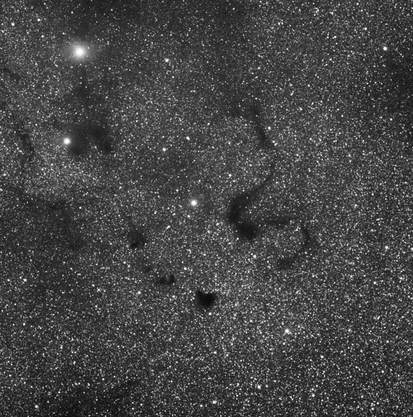

The Snake Nebula, designated as B72 in the Bernard catalog of dark nebulae, is quite familiar to most of us. Like all dark nebulae, they are seen because of the silhouette that is created by their brighter surroundings, in this case the zillions of stars in the Milky Way. Also captured here just to the left and below is B86, the Inkspot Nebula.

10.) Milky Way (ANY field size) - Short focal lengths scopes and camera lenses in RGB or H-alpha only - Tracked images for deep, clean fields when targeting narrower fields; piggyback-mode works well, autoguiding not needed; do not assume good focus, don't use the infinity mark on a lens; great for DSLRs using a fast ISO without compromising noise too much.  (DSLR - The Milky Way was made for your camera). 

11.) Planets (10" to 50") - Barlowed, long focal instruments in RGB video; use a IR-cut filter and emission band filters for details; use grayscale video with filters for best resolution; catch object high in sky; find local area of good seeing; temperature-acclimated your gear; have Powermates handy; work quickly on Jupiter due to fast rotation.  (DSLR - Use in video mode.) 

​12.) Moon and lunar eclipses (30') - Medium to Long Focal Lengths in Grayscale or RGB - H-alpha, neutral density, and polarizing filters are helpful to attenuate light with sensitive CCD cameras; I prefer single frames from high S/N cameras like DSLRs; video cams can stack multiple frames; don't assume that video cams are best here as they work better on narrower fields of view when you are really pushing the magnification; catch object high in sky; easiest object to image.  (DSLR - The moon was made for your camera!)

13.) Dark Nebulae (30' to 10 degrees) - Varying focal lengths from short to long in RGB, LRGB, Grayscale and H-alpha - Longer exposures brighten the scene around the dark nebula, allowing a nice silhouette; plan to bring out detail in the dark nebula itself, they aren't black, featureless objects (see The Snake Nebula right); do not forsake grayscale and h-alpha only shots as they are artfully gorgeous.  (DSLR - Because these objects are within the Milky Way, they show up well with your camera.)

14.) Supernova Remnants (0.5 to 4 degrees) - Varying focal lengths from short to long in RGB, LRGB, H-alpha, and spectral band - Potentially some of the most difficult object types as their surface brightness extends over wide FOVs; going long is necessary, unless it's the Crab Nebula (M1); due to size, portions of the remnant can make a nice composition, like the central waterfall area of the Veil Nebula or either the eastern or western networks.  (DSLR - A real challenge due to the amounts of h-alpha and the overall brightness of most of these objects.  A modded camera gives you the best chance of success.)

15.) Comets (30' to partial sky) - Varying focal lengths from short to long in RGB and grayscale - Single-shot color preferred -  These move fast, so shorter total exposures are necessary to freeze them against background objects during conjunction events (see Machholz Meets M45 below);  for detailed comet shots showing ion trails and dust streamers (and trailed stars), match tracking rate of the mount on the object with an updated ephemeris in your scope control software, guide on the comet's coma if necessary; plan to use the Larson-Sekenina process in PixInsight to process detail in comet; most comet images are composites of some type, so plan what non-comet objects should look like in the final image.  (DSLR - Comets are terrific with your camera, especially those with long, bright tails which might require a wide-angle camera lens.)

16.) Sun and solar eclipses (30') - Medium to Long Focal Lengths in Grayscale or RGB - White light/h-alpha/CaK solar filters; catch object high in sky but before warming up; consider a light-protected booth for focusing; tune your h-alpha scopes well; DSLRs are nice for this.  (DSLR - My preferred camera for this type of work!)

17.) Constellations (10 to 30 degrees) - Camera lenses of short focal length in RGB - DSLR recommended; piggybacking or tracker preferred for getting more in a constellation than just stars; tripod is sufficient in dark skies and shorter focal lengths; with a tripod, use the "500 Rule" to determine exposure length before stars begin to trail (500 divided by focal length = exposure length); experiment with star colors and diffraction spikes.   

18.) Meteor Showers (Partial to full sky) - Camera lenses of short focal length in RGB - DSLR recommended; piggybacked or tracking preferred on the radiant; capturing wide-field star trails with meteors is another approach; dark, moonless skies are required.

19.) Star Trails (Partial to full sky) - Camera lenses of short focal length in RGB - DSLR on tripod with intervalometer recommended; shoot in dark skies to yield longer individual subframes; use low ISOs; experiment with trails both including and not-including the celestial poles; defocus on purpose to bring out star colors; plan to add these images in Photoshop as layers using the "lighten" blending mode and mask-in one good image for your foreground. 

20.) Time Lapse (Partial to full sky) - Camera lenses of short focal length in RGB - DSLR with intervalometer recommended; tripod for basic time lapses, a tracker for panning the images for advanced sequences; set high ISO, but not so high that noise is a problem; choose exposure based on what you need in the single frame, add a delay allow for download time only; more exposures for longer movies; dark skies provide deeper Milky Way shots; practice techniques during the day, using clouds and shadows.   

Note that there are zillions of objects less than 5 arc degrees or so, objects that do not avail themselves as worth-while single targets.   But wider fields can yield a Hubble Deep Field type of opportunity, especially with galaxies in various clusters, like Virgo, Pegasus, etc. 

Also note that DSLRs work really well for a large majority of subjects.   I think as a rule of thumb...the wider the field of view, the more a DSLR can really show its worth.  

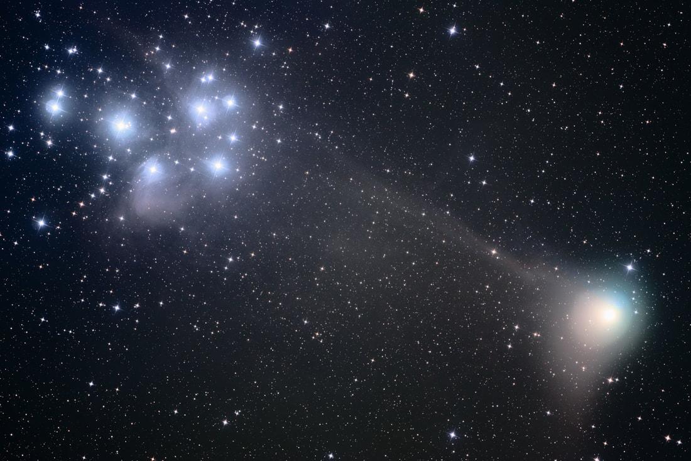

Machholz Meets M45 in this 2005 conjunction. The Magnitude 4 comet was a great target when it passed the brighter Pleiades. This was an LRGB image. I used three 5 minute unbinned images to capture enough of the Comet and M45 before blurring of the comet was evident (I guided on a star). I then took 15:9:15 RGB of 2x2 binned images to color the scene. Of course, the color of the comet was masked in later. In truth, this data deserves a revisit, as newer techniques might bring in more detail with the comet itself.

So, in looking at the list of subjects, we take notice that larger objects, those that could stand on their own, typically approach 1/2 degree or larger.  As such, longer focal lengths, perhaps in excess of 2000mm, can yield great detail, allowing them to tell their own stories.   But does this mean that those with short refractors cannot shoot these subjects?  Of course not, but you should observe a few tips to make for the best composition:
Smaller pixel sensors are your friend.   These provide an "image scale" which best captures the resolution that is made possible with your relatively short focal length.  The trade-off is increased noise and less sensitivity, so guard against too much compromise here, but DSLRs and CCDs with pixels in the 5 micron area make a nice match to wide-field, short focal length refractors.  There are some exciting developments today with clean sub-4-micron pixel sensors, which are good matches to short focal length refractors when you desire a little bit more detail in your subjects. 
Crop your images.   Too many people feel that they must use the entire sensor area in their final images, but the virtue of having such a big sensor in the first place is the flexibility you gain in composition, as you have more real estate to pick and choose the portions of the image that tell the better story.   Don't leave a bunch of black space in your image...it's boring.  Avoid over-cropping, however.   At some point, you should just start saving up for that longer-focal length scope! 
Speaking of black space, there is really not that much of it.  If you look at images from the world's best wide-field astro-imagers you will see that they model my "landscapes in space" philosophy, meaning that they seek to make all the pixels in an image count.  There is much less "black" than we realized 20 years ago, and with long enough exposures you can portray this.  Consider going "deep" if you can; otherwise, crop your image or choose subjects that have extended, more easily captured sources.
Don't waste resolution with haphazard data acquisition. Work hard to acquire good data, even at larger image scales like 3.5"/pixel.  Do not assume that because somebody says that, "Seeing doesn't affect a small refractor," that you can be sloppy with how you acquire your data.  Read my article, "Best Data Acquisition Practices" for a good discussion on how to maximize your data in this regard.  You might be surprised at how much more detail you can get in your subjects just by refining these practices.   
If you have a single mount or a single telescope, don't forget that you can easily expand your focal length options simply by "piggybacking" your regular camera lenses atop your setup.   There are a plethora of options for accomplishing this, either atop your existing scope with some kind of dovetail and camera mount, or in a side-by-side configuration with a "dual saddle" plate.  Additionally, you can expand your main scope by using a barlow on some subjects, especially planetary nebulae (see Sidebar: Barlow Up! for more on this controversial technique). ​
Take a portion of bigger objects.  In the event that you lack the field of view to shoot something as big as the Pleiades (small chip?) then just shoot the star Merope instead.  It's awesome by itself.  Or perhaps the core of M31, instead of the whole thing?  Hit the trapezium of M42 - the Elephants Truck within IC1396 - the witch's broom in the Veil. Tons of options here.   

## Sidebar: Barlow up!

I love stirring the pot of controversy in this hobby sometimes.  Because of the rules of thumb and simplified approaches, we historically limit ourselves to what can be accomplished.

Here is an example of where we've missed the boat.

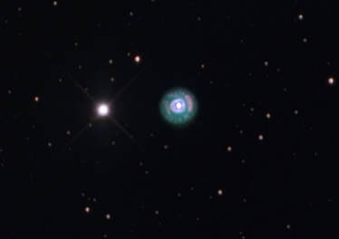

Take a look at my image of the Eskimo Nebula above.  Such objects, even when imaging at longer focal lengths (in this case with a 2857mm f/9 RCOS RC), the ending result is very small on the chip.  After all, at 48" in apparent size, it looks no bigger than Jupiter through a telescope (hence the term "planetary" nebula). 

Wouldn't it be nice if we had a longer instrument for such cases?  Minus that, could I possibly use my 2x TV Powermate to effectively image at 5714mm?  It works on Jupiter, right?  

And this is where the nay-sayers come in.  They will be quick to point out that using a barlow puts you at f/18, which nobody would be crazy enough to attempt on a deep sky object (DSO), right?  

Only here's the thing, my image above does just this, and I feel that it could have been even better if the seeing cooperated. 

But don't take my work for it alone, do a Google search for images of "planetary nebulae" with "barlow" or "Powermate" as keywords.   Look at how many hits you get, including there here and here.  The later shot is from Noel Carboni, whose Photoshop actions you might be familiar with.  

Better yet, check out Adam Block's 20" RC shot of the same object, shooting at f/17 below.   And before you say that he probably needed hours to catch it at that f-ratio, then let me just say that the image is only 44 minutes of total exposure time in LRGB.  

Because here's the thing.  Any visual observer will tell you that to see the faint stuff, you need to apply more power.   When trying to see something like the 15.7 mag central star of M57, operating at greater than 500x yields your best opportunity when the seeing stabilizes enough.   Effectively increasing your focal length - which is what you are doing here - increases object detail because it provides better sampling when the seeing allows.   

For the imager, you can accomplish the same thing.  While you must be careful since you have more pixels just barely above the noise floor, this can be counteracted by imaging at the optimal sub-frame exposure time, a condition known as the "sky-limit".   Or, just get a big aperture for the maximum in flexibility, f-ratio be dammed. 

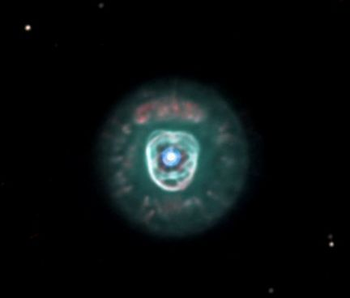

Taken with a 20" RC operating at f/17. So, here's the thing. Despite what you believe about f/17, big apertures like 20" throw a ton of light on the chip. Thus, using a Powermate to give more detail when the conditions allow for it is a great way to give yourself extra oomph on those really small planetaries. Credit: Suzie Erickson and Adam Block.

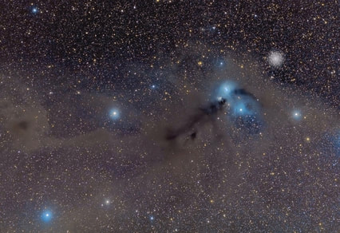

Located just off the plane of our Milky Way is the Corona Australis region, shown here. This is a nice subject for wide-field refractors due to the dust which spreads throughout the 4 degree field of view. But imagine the image without the dust? Targets like that reflection nebula and the globular cluster alone would make this a poor subject for that same scope, the Tak FSQ-106. At some point, unless you are willing to go extremely LONG with many of your images (to catch nebular dust that is there) or you are willing to CROP your images around smaller objects, then you begin to run out of good compositions at focal lengths that provide wide FOVs, especially during months when the Milky Way isn't prevalent in the night sky.

For the rest of the smaller objects, we try to group or cluster them together in our compositions, hopefully with connecting elements, like dust and nebula that allow the eye to travel naturally from one place to another.    At exceptionally short focal lengths, particularly with camera lenses where you are imaging large swathes of the sky, there isn't much difficulty in getting a good composition if you point somewhere in the Milky Way, which becomes less important anyway since the goal is generally to image EVERYTHING in the sky.   The tricky part is when trying to image objects outside of the Milky Way with short focal length refractors in the neighborhood of 300 to 600mm in focal length.  With today's chips, you will be dealing with 4 to 8 arc degrees of FOV, close enough to give some resolution of individual objects, but wide enough to make finding whole fields that show a nice stellar "landscape" somewhat difficult. 

For example, I absolutely love my 4" Takahashi FSQ-106 apochromatic refractor.  I will probably be buried with it some day.  However, I when you consider the number of good compositions that you can get at 4 degrees (530mm focal length with a full-format CCD sensor), it's very difficult to develop multi-object compositions where totally black space doesn't dominate the scene.  For example, galaxy clusters are typical targets during the spring months here in North America, but most all single galaxies, even big ones like M33, look rather small on the chip.   Realizing this, you swing over and capture something like the Leo Trio of galaxies, where you can get three galaxies nicely arranged, as if they got together for a "selfie."   There's also Markarian's Chain in Virgo and the Deer Lick group in Pegasus and clusters of galaxies down in Fornax (which I cannot image from my home).   

After a while, you exhaust many of these options, unless you are willing to substantially crop your image (and can live with the low-resolution of the "object" you captured).  Thus, ultimately, while such refractors are highly recommended as the first imaging scope we should buy, something we will certainly keep for a lifetime, I find that wide-field refractors simply aren't as useful as you might be led to believe; certainly not year-round, as I originally hoped it would be.   At some point, once most of your subject matter is exhausted, you definitely will see the need for longer focal length options.  

Of course, keeping to the "space is a landscape" philosophy, we know that there is inter-galactic flux nebula (IFN) regions all over the sky that can aid in good composition with short refractors IF you can only image long enough.  Even a single star like Polaris can be imaged amidst all the background IFN if you put days and days of time into your image.   But at this point, I think we come to the realization, after evaluating how big of a commitment that is, that it simply isn't reasonable to do unless you are somebody like Rogelio Bernal Andreo (www.deepskycolors.com) or JOhn Davis (www.bucksnortobservatory.com), who seem to live for such tasks.

For the most part, you can shoot any "object" in the sky with any telescope or camera lenses.   For many, especially the beginner, it's thrilling to just catch ANYTHING on the chip.   As I mentioned in the Preface, would not deter such people from that enjoyment.   But if you are in this for the long haul, and if you really want to get good at this stuff, producing artful images that impress not only your family but also your astronomy peers, then perhaps some of these tips regarding object choices and image composition will be useful to you!

## Advanced Approaches

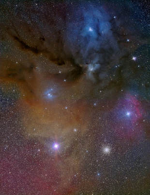

The Rho-Ophiuchus/Antares Region

Taking a look at images on the internet taken by brethren in the hobby, it's easy to be amazed at some of the techniques that amateurs now employ.  Mosaics are plentiful, made possible with acquisition tools like TheSkyX and processing tools like PixInsight.  Multi-scale approaches are possible, where a wide-field image is masked-in with more detailed data from a higher resolution image taken with a longer focal length instrument.   In total, it seems like some of us have astro-imaging "superpowers," and in this section, we look at how we can add them to our super-hero skillset.  

### Mosaics

One of my favorite images of all time was this image of the Rho-Ophiuchus/Antares Region of the night sky, at right.  This is the first true mosaic I ever did, which is a only a two-framer, top and bottom.  If you look closely, you can see a seam in the middle, or at least detect a slight background difference between the halves of the image.    Taken back in 2005, "stitching" a mosaic together in Photoshop CS2 was a tall order, especially with LRGB color images.  

Today, with PixInsight, processing multi-frame mosaics is much easier, giving seamless borders.  It's not without its learning curve, but the results are amazing.   But before we look at how to take them, let's first ask the key question, "Is this something I should do in the first place?"

### Investigating the Mosaic

Because today's advanced tools make acquisition and processing of a mosaic more accessible to all astro-imagers, there are more and more people making the attempt.   But first, let's evaluate our need for going through these efforts.

And I will be honest here.   I don't so much see the point.   When you realize that the purpose is to combine wide-fields of view with detailed resolution of individual parts of an image - in order to have our cake and eat it too - it becomes apparent that you need some way to display the final result - perhaps on the side of a building - in order to truly witness the results.   Seriously, in today's iPhone and tablet society, who will really views such images?  How many "mosaics" have you seen on Facebook and truly bothered to hop over to the linked webpage just to see how detailed that whole-sky mosaic actually is?

So, for this reason, unless you are planning your mosaic for a specific display purpose, either on a web-page with "zoom-in" views or on a massive, gorgeous museum quality print to hang over your sofa, then I think most are better served at single shots (or smaller mosaics) with much shorter instruments.   

You may respond, "Well, everybody does it."    

It does seem that way, but I see several main reasons for an overall increase in people giving mosaics the old college try:
 
We have tools, as mentioned, that make them more executable.  As you will see, software is very intelligent now in terms of setting up the mosaic, acquiring it, and stitching them together. 
We have the need to increase our FOV with the telescopes we have.  If the FOV of my scope/camera combo yields a 4 arc degree image of the sky, and the subject I want to image is 6 by 6, then it's easy to see the attraction of perhaps a 4-frame mosaic.
We labor under the misconception that we need massively large, zillion-pixel images to create enlargements.  Through software interpolation in Photoshop, you can make ANY image with as many pixels as you need to make big prints.  This is a chief virtue of digital processing.  While you might argue that it'd be nice to show more details when you stand close to the print, it's not the necessity that we make it out to be, based on what we perceived it to be back in the film days when we needed medium and large format films of small-grain to create larger prints.  Digital just doesn't work that way.
We believe that we haven't graduated to "super-imager" until we've done it.  Interestingly, I think this is a huge motivational factor for many, in the same way that we feel the need to take 30+ hour images.   Mosaics, like exceedingly long images, are...well...excessive, in my opinion.  They have their place in some instances, as I've already defined; but when my single shot CCD image of the full moon looks better than your 30 frame mosaic of the same, then you have to question, philosophically, what you are trying to accomplish.   See Sidebar: Lunar Mosaics for more. 
So, prior to diving neck deep into your first mosaic, be sure that you know why you are doing it and if there are easier alternatives to net the same shot.  With experience, you might discover that shooting them just isn't worth the supreme effort involved. 

### Planning the Mosaic

So here we go.   You have in mind a perfect region for a deep sky mosaic, something you intend to be a focal point art print on the wall of your living room.    You love the results you get from your wide-field refractor on single-frame images and you recognize that the area you've chosen would be prefer to fill up that empty wall above your sofa.  

Let's look at the approach with a typical telescope/camera combination, the short focal length apochromatic refractor with full-frame CCD or DSLR sensor.   Let's look at a typical FOV indicator in TheSkyX Professional, shown here framing M45 with a 530mm Tak FSQ-106 and Nikon D810A (35mm sensor size)  for a 4 arc degree field of view.

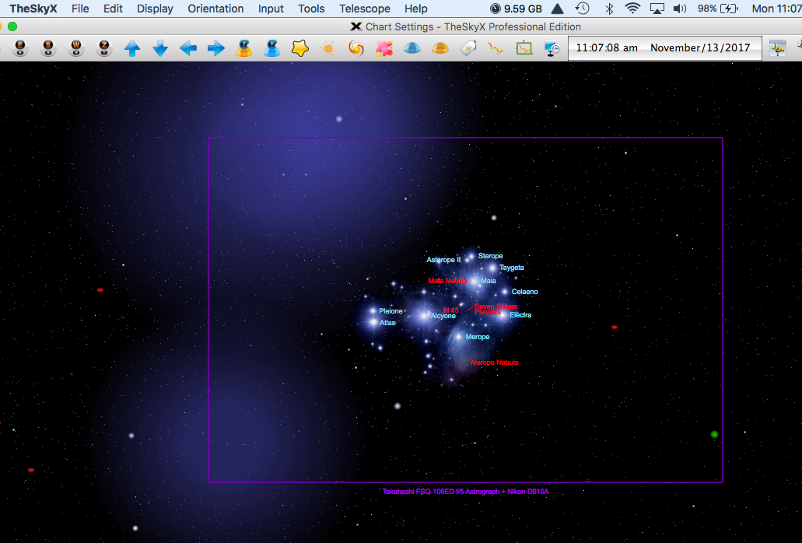

Interestingly, the Pleiades is part of a much larger complex that you think would be a great composition as a mosaic.  Shown below, let's use the Mosaic Grid tool in TheSkyX to show one possible way to layout your composition:

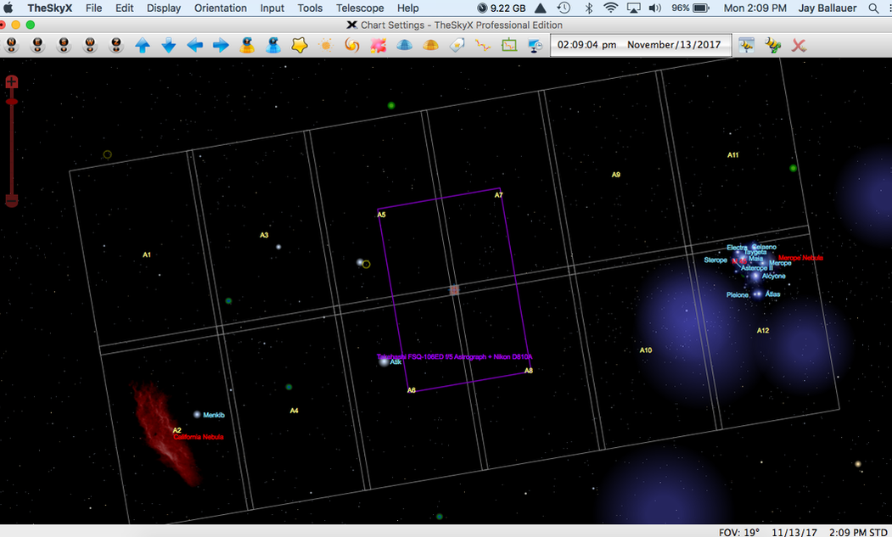

There are a ton of goodies in this region, with intergalactic cirrus all over the region and a several other cataloged objects separating the two primary "targets."   Together, if executed well, a 12 frame mosaic would be a killer, museum quality work of art. The Mosaic Grid tool allows the user to duplicate the selected FOV indicator, which is the purple region shown here centered about the on-screen sky chart, counting sizing it to any dimension you want with a custom overlap.   Shown is at 5% overlap, which is likely no enough for your processing software to do its job (10 to 20% would be better), but the less overlap in the panels you have then then more FOV you will achieve in the composite.

## Sidebar: Lunar Mosaics

Other than those trying to image the entire Milky Way with a refractor, the main place we've seen a rise in mosaic images is on our brightest night-time object, the Moon.  

I am continually amazed at the number of massively large mosaics I see today, including 20 to 30 frame mosaics in an effort to cover the entire lunar disk...which is interesting because how much detail does a full moon actually avail when there are no shadows to provide feature relief?

The appeal is obvious...if I can generate a high-resolution image of a single crater, then stitching ALL the craters together must provide a better image.   While there is some truth to this, what the imager is forgetting is that the best camera to accomplish this is NOT necessarily the video cam.   The extension of this comes obviously from planet imagers, who need the tool to capture individual frames capturing the very best seeing moments of those really small objects, which are inherently low signal-to-noise (S/N).   In other words, for planets, using a video cam is a necessity.  

But the moon is bright. Really bright.  Bright enough that we often need the fastest of shutter speeds or neutral-density filters to keep from over-saturating the image.  For this reason, a single, fast exposure from a DSLR or CCD accomplishes similar levels of S/N and detail as a stack of several hundred individual video frames.  

Think about it.  The fastest frame rates you will likely use with your video cam is perhaps 100 FPS, but that means 1/100th of a sec of a high read-noise, low-sensitivity, single frame capture.  Compare that to a low read-noise, low ISO, 1/1000 shutter speed exposure with a DSLR, which you can pull from the best of several possible DSLR images taken with an intervalometer.   Which is inherently better?

I know, you want to use wavelet processing in Registax because that's where the magic is.  But when you realize that the same magic happens if you load up a single DSLR frame (or a stack of several), then you start to wonder why you are using that real small video sensor in the first place!   

Don't go too far, however.  No need to stack a bunch of DSLR images, which can cause alignment issues.  If one frame works, just use one frame.

Again, just because everybody is doing it doesn't make it right.  Question everything; don't make the assumptions about a technique.   Think it through; learn the theory behind something; test it in the laboratory of experience.

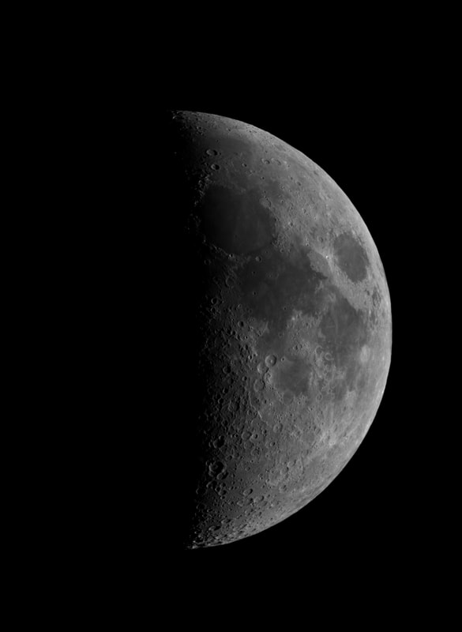

Single CCD image prior to wavelets processing in Registax. Compare this with a mosaic (of matching image scale) of stacked images from a video cam prior to the same processing steps. Ask yourself if it looks as good as this prior to wavelet processing. If not, then you should probably evaluate your philosophy on this.

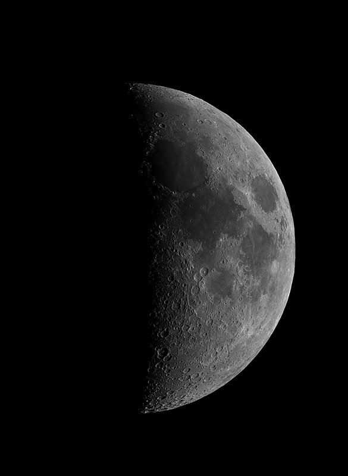

Same lunar image WITH wavelets processing in Registax. Yields the look of a stacked mosaic in Registax with a single best image in series of lunar images. This should make you question why you are using a small chip video camera for lunar imaging. And if you insist on more native resolution, then use a 2x Powermate and take a 4-image mosaic!

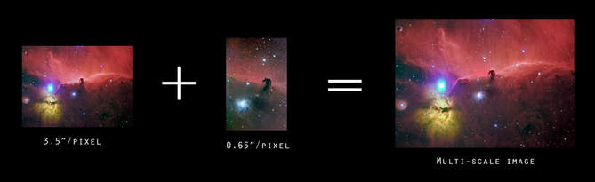

If you click on the image and squint hard enough, you can see the results of masking in a higher resolution image. Not practical with a webpage display, but perhaps you could imagine the improvements in the multi-scale result on the right. There is increase in detail on the Horsehead itself, but mostly notice the blue reflection nebulosity that was barely existent in the smaller scale image which is now detailed in the final image. Here, I used Photoshop CS6 to select, feather, and copy the 0.65"/pixel image as a new layer above the low res shot, manually aligned them, selected both layers together, and then used "Auto-Blend Layers" to match the shading and color automatically. You can further assist the process by matching levels in both image prior to the merge. I trusted Photoshop to do this entirely here and am fine with the result, being that I created this with JPGs merely to demonstrate the technique.

### Acquisition of Mosaic Data

Clicking on the Mosaic plan above, you might notice that each mosaic panel has custom labels, A1 to A12.  This becomes useful when automating the mosaic sequence because the frames can be called upon one at a time by panel label.   TheSkyX now defines each label as an "object."  For example, once the A1 panel is finished, you can simply click and slew the instrument to the next panel by clicking on "Mosaic A2."   Truthfully, you may do the panels in any order.   I would likely work from right to left starting with the Pleiades first.  In this way, if you ever lose ambition on the project, you can choose to terminate it at any point, knowing that you still have M45 on the right side with some interesting cirrus nebulosity leading into it from the left.  

If you do opt to shoot each mosaic panel in color (either single shot or LRGB) entirely with the same instrument, then you will want to take the entire frame of each mosaic panel at once, assembling them together as separate images, and them stitching them together in software later.  If you do process the panels first, you probably should "stretch" out the data consistently from panel to panel, taking the images into a non-linear (visible) mode.  The PixInsight method that I will detail works on either linear or non-linear, unstretched data, so I typically leave it non-linear.  

Finally, one last issue that you might not have thought about when dealing with multi-frame mosaics is that there can be an objectionable difference between the quality of the images, frame to frame.   This is certainly a concern from a transparency standpoint, since you really want to be sure that your frames go together well after each frame has been properly relieved of its light pollution gradient.  Dew can be an issue for a similar reason.    "Seeing" quality is less of a concern with refractor mosaics, but you cannot assume that it's a cakewalk.  It really plays into mosaics with long focal length instruments.  Even taking frames over the same night can vary wildly, making it difficult to match up in the composite image; or in the least, can make an unseemly transition between mosaic panels.   Astronomical seeing can change quickly, so be aware when the S/N of the panels vary too much from one another.   It's really obvious in the panel transitions when one panel is cleaner than the other.  

In the event that you don't wish to use TheSkyX to accomplish your mosaic acquisiton, then you might look into "Sequence Generator Pro."   For $140, (SGPro plus the Mosiac add-on), the entire process of acquisition can be automated.    If you are in the market for scripting or automation software, then this might be just the ticket for you.  I have no experience with this software, but you can test it yourself via free trial.  If you do, let me know how it goes!

An Important Tip:  If you have an astro CCD, shoot all the panels first in clear luminance on massive mosaic projects.  Process all of your panels of that mosaic, and then choose a wide field lenses to cover the entire field (or fewer portions of the entire field) in color.  In this way, you only have the tedium of ONE channel to deal with.   Remember, RGB color can usually be at widely different image scale, which can then be artfully processed like the master you are!  In the above example, you might consider shooting the RGB color with a 200mm lens in 4 panels...or even changing cameras and shooting color with a DSLR.  In short, there are several ways to work around such a mosaic...you want to avoid shooting 48 individual frames (12 x each of your four LRGB channels) if you can.  If its just a couple of panels, then I typically would shoot everything in LRGB or RGB color with individual channels like normal.   But remember that the final resolution comes from the luminance frames alone, so it's technically the part that delivers the resolution you are seeking when shooting such a mosaic in the first place.  
​
### Processing Your Mosaic

I choose to use PixInsight to put together my mosaic panels, but there are other good options as well, albeit some with a more difficult learning curve than others.  Among these, softwares I have not used, include Montage and MS Image Composite Editor (ICE).   I've heard the latter Microsoft product is free and easy to use, but isn't very feature rich.  

I have used RegiStar, which is now quite old, with mild success.  It's still the goto software for many, predating Pixinisight, and enough reason for Photoshop mavens to stave off the purchase of PixInsight.   Of course, they might also opt to construct smaller mosaics in Photoshop itself.   This was made easier in Photoshop version CS3, whereas the ability to do a "PhotoMerge" was made possible.   Or, you can stitch it together manually, achieving results like my Rho-Ophiuchus/Antares image above.  

Again, I now favor PixInsight for this, whereas its mosaic features are only one of a bunch of useful tools for astro-imaging.   At around $220 (US dollars), the package is well worth the price.   

The procedure in PixInsight is typically a two-step process.   First, you use the "StarAlignment" process to align two of the frames using "Register/Union Mosaic" as the working mode.  Once you have two frames aligned, you add a third, then a fourth, etc.   This aligns all of the overlapping sections of the image one by one and creates a large canvas as the construction of the mosaic slowly builds.  Secondly, you will then use the "GradientMergeMosaic" process to match the colors and brightness levels along the seams of the panels and flatten the image into a final composite image.    The learning curve is somewhat tricky, made more difficult if you fail to overlap the image sufficiently enough.  However, there are numerous tutorials EVERYWHERE for all PixInsight processes, so use them when you are trying something like a mosaic in PixInsight.   My success rate is much better with PixInsight than with any other method, now that I know what I'm doing.   I predict the same for you. 

### Multi-Scale Images

Just as the name implies, a multi-scale image is a composite image incorporating two or more data sources with mismatched image scales.   Let's take for example the above mosaic that I set up above.   The alternative approach would have been to take one shot of the entire region using a camera lens, take some longer focal length details of the individual objects separately, and then mask in the higher-resolution data into the places where you want them.   In such cases, because you know that background dust doesn't benefit from more resolution, you can take advantage of longer focal length data you've already shot to provide the resolution in the areas you need.   

Again, using the image above, the first step might be to take the single wide-field image and resize it in Photoshop via interpolation, adding enough pixels back into the image to increase overall image size while essentially matching the image scale of finer details you will be adding.   Speaking of which, the main objects in the image, including the Pleiades, California Nebula, and the objects with structure in between would be masked-in, much the way you would add a shorter picture to the center core of the Orion Nebula.   

Working around star sizes is the trickiest aspect of this, but use of this technique typically disregards the stars in the detailed sections of an image and layers in only the structural detail of the subject.  Use of the "lighten" blending mode in Photoshop is usually sufficient enough to retain the stars of the wide-field image (for consistency) while allowing the star-less, high-resolution inset areas to pass through.  

One of the best uses of this technique would be when shooting galaxy clusters.   For example, supposing that you shoot the "Leo Trio" of galaxies with a wide-field refractor, you could easily take individual shots of the three galaxies with a longer focal length instrument.   Once all images are processed, you can match the scales through interpolation and then mask in the galaxy details.   Because the rest of the image is likely dust (if at all), there is no need for high-resolution data in those areas anyway.      

Another multi-scale approach might be doing the inverse of this, taking advantage of the LRGB technique to add color data to a high-quality luminance image you already shot.    Let's say that you shot the M43 data posted below, but failed to get color data of the subject on the same night.  However, if a previous shot already has decent color, then perhaps you can make use of it to color this new luminance data?   The images do not have to be taken with the same telescope at the same image scale.   While it can be difficult to match wildly differing image scales (it takes practice), you might be surprised at both your ability to make it work AND the amazing flexibility you have with the color of our images.  Apply the same technique to those wide-field multi-panel mosaics and you'll save yourself lots of time.  

Simply put, there's a tremendous leeway in the quality and type of color data that we can make work for us in our image...the luminance seems to do all the grunt work.  

## Recommended Subjects

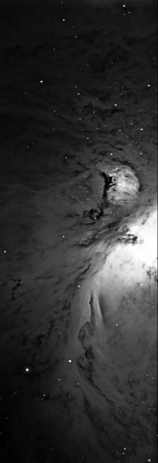

Keeping in theme with getting the most from our subjects, let us now take a look at object areas in the night sky that lend themselves very well to portraits using a variety of focal lengths - stories worth telling both in wide-field and narrow. For these items, we are looking for regions that easily fill up the field of view with a short refractor, but also have parts which might necessitate the scrutiny of much higher resolutions.

M31 - Andromeda Galaxy: The classical shot of M31 is the full disk view, always containing neighbors M32 and M110. But the amount of detail that can be gained by shooting at long focal lengths is absolutely mind-blowing. With enough focal length, capturing globular clusters and HII regions in a galaxy other than the Milky Way is an incredible capability of modern, amateur equipment. Unfortunately, it is a capability that has been largely untapped. For some reason, people want to take ALL of an object this big when even little pieces of it speak volumes to us.

M42 - Orion Nebula Complex: With M31, this is the first target for almost everybody, regardless of the camera. As a composition, there are a multitude of ways to approach M42, especially when you consider all the complexity of this winter Milky Way area. While we call it M42, nearby NGC 1980 ("The Running Man") and M43 (see left) also yield narrow field opportunities with long focal lengths. Embedded in galactic dust and nebulosity, there is no field of view too wide. Take any telescope or lens and point it in the direction of Orion and you are assured of a good result.  However, if you can't pick up the back ground dust, then crop the image up to the nebula itself, otherwise you'll have a lot of black space that lacks interest.  

NGC2244 - Rosette Nebula: Another large emission nebula with open cluster, the traditional shot is wide-field, up to 4 arc degrees. With longer focal lengths, aim toward the center cluster and you will get beautiful results with a variety of filters, both RGB and narrowband.  A good DSLR subject, especially if you have a modded-DSLR.

The Horsehead and Flame Nebulas (B33 and NGC 2024): As you begin at M42 and expand the field of view about 8 degrees, you begin to involve the most famous dark nebula in the sky, the Horsehead (shown earlier in the article). Positioned next to Alnitak, Orion's left belt star, the Horsehead can be captured by itself at focal lengths 2500mm and more OR in composition with the Flame Nebula. A 2 or 3 arc degree field is perfect to capture the entire scene.

NGC6888 - Crescent Nebula: A very versatile subject, the Crescent is roughly 20 square arc minutes of nebula, rippling from the violent UV activity of it's Wolf-Rayet central star. Close-up, the nebula lends itself to all filters, especially in dual-band h-alpha and OIII, where a distinct oxygen envelope perfectly mimics the underlying hydrogen nebulosity. But despite being a relatively small object compared to M42, what puts it on this list is surrounding nebulosity that extends well away from the NGC itself. This makes it great for wide-field shots too. Can be a challenge for non-modded DSLRs, however.  
The Leo Trio: When galaxies get down to 10 to 20 arc minutes each, they don't image well unless you go to longer focal lengths to get up close and person with them. But if you get a few of these together, then their juxtaposition within a single wide-field frame is delightful. In the "Leo Trio" of galaxies, M65, M66, and NGC 3628 are featured, each a stand-alone subject at long focal lengths. A few arc degrees separates them, so a good wide-field refractor makes these a terrific wide-field composition. Go longer to capture a stream of dust coming from NGC 3628, also known as the "Hamburger Galaxy." Plan to process the individual galaxies separately, as each one has something different to show off.

North America and the Pelican Nebulas (NGC 7000 and IC 5067/70): This was the goto image for me early on, a shot that allowed me to monitor my progress in the hobby. A perfect wide-field nebular region in the Cygnus Milky Way, this tandem of nebulae fills in a large field of view, larger than 4 arc degrees.  The entire area could lend itself to a nice mosaic.  I delighted at my improvements year-to-year as my images turned from "targeted objects" to a true composition. There's not a dark pixel in the entire region if you shoot this correctly. Long focal length instruments can concentrate on key features in both nebulae.  Longer focal lengths allow you to focus on specific areas of detail, including the "Mexico coast" area of NGC 7000 and the Pelican's neck region of IC5067/70.  The region is H-alpha rich, meaning it can be captured using a variety of techniques, including LRGB, spectral band, mapped color, and even pure grayscale.   It's simply a wonderful subject to shoot.

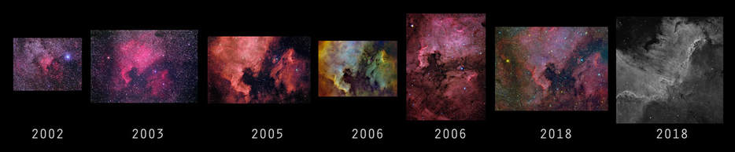

North America and Pelican Over Time - Here is a selection of images that I've taken over many years, starting with film and moving through both DSLRs and the most sophisticated astro CCDs with spectral band filters. The vast range of focal lengths used during my imaging career leads to many different takes on the same subject matter. Don't limit yourself to one perception of a subject. Most of the "recommended subjects" in this list can be taken in a plethora of ways!

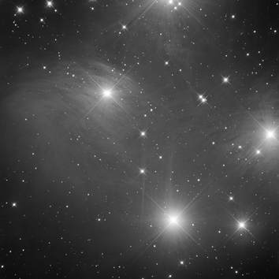

IC 1396 and Elephant Trunk: Again, it's hard to miss a good composition in the summer Milky Way, but this region in Cepheus is a versatile target. Focusing alone on VDB 142, the "Elephant Trunk" is a really pretty subject with a variety of RGB and mapped color possibilities with long-focal length instruments. Going, wider, we see that the Van de Bergh object is only a small part of a much larger complex of nebulosity, known as IC1396. It perfectly fills out a 4 degree field of view.

​IC 1805 and IC 1848 - Heart and Soul Nebulas: Laying just close enough to each other to fit in a 6 x 8 degree section of the sky, it is a perfect field for a mosaic or 300mm scope. Or, each can be taken individually, almost filling up a 4 degrees wide chip. The versatility continues with harrow field instruments by focusing on either the center "Mellotte" cluster of the Heart or the interesting hydrogen formations in the "soul" (AKA the Embryo Nebula).

M45 - The Pleiades: The most beautiful star cluster in the sky cannot be topped for its blue reflections against the tremendous amount of background dust. A four degree field of view captures the cluster surrounded by a rich field of dust, which can be extended way out to the east (left in the traditional view) to capture NGC1499, the California Nebula, as shown in the Mosaic Framing above. If your instruction yields a half-degree field of view, you can single out the nebulously around individual stars, especially Merope. Use an instrument with a spider secondary to produce gorgeous diffraction spikes on the stars (​see left).   ​If using a refractor, you can simulate the spikes by taping on some thin string to the front of the aperture.

Rho-Ophiuchus/Antares Region:  When you think of color in the night sky, this is the first region you picture.   Yellow and blue reflection nebulae, red emissions, and sparkling globulars, all against a backdrop of dust and in the presence of bright Antares.  Perfectly filling a 4x6 degree FOV (see the image with the same title above in the section on MOSAICS), you can choose to expand this region all the way to the Milky Way with camera lenses or you can highlight any particular feature with longer focal length instruments.   This is a first choice for those seeking to absolutely fill up every pixel with bright features, requiring very little total exposure time to yield a fantastic image.   Any scope or lens you have can make for a nice composition of this amazing section of the night sky.  

Eta Carina Nebula:  I really don't know what I'm talking about here.  I'm a northerner.  I hate that I've never had the chance to tackle this amazing region of the southern night sky.  But I do know this...it looks great regardless of what people use to shoot it!   

Magellanic Clouds:  See Eta Carina above.   I can only imagine being able to shoot these guys.  
​
M81 and M82: A delightful tandem of very different galaxies in Ursa Major, this is a composition that's at the top of most new hobbyist's lists.   Individually with a long focal length instrument, M81 is a large and spectacular face-on spiral with amazing dust details.   M82 is a an edge-on galaxy where the challenge is to attempt to capture the red ejecta streaming from the galactic center.   Separated by only a couple of degrees, both easily fit in a wide-field image.    Going extra long with your exposures nets a ton of IFN all over the area as well as Holmberg IX, an irregular dwarf satellite galaxy of M81.   Expand the field slightly more and a plethora of other galaxies pops into view, namely NGC 3077 just to the east.  

M8 - The Lagoon Nebula (with M20 - The Trifid):  Look to the center of the Milky Way and you will see M8 naked eye in a dark sky.  It shines bright and is the absolute perfect "target" for ANYBODY, from newbies to experts alike.  Pick an instrument from your quiver, any instrument, and shoot away.   Don't shoot for long.  You won't need to.   M8, approximately 1 degree wide, is amazing when using long focal lengths, yielding amazing details of the hydrogen rich stellar nursery at its center.  In fact, using an h-alpha spectral band filter anywhere in the region is a mind blowing thing!  Widening the field out to about 5 degrees will net you M20, the Trifid Nebula, as well, itself also an insanely great subject on its own.  It's blue reflection and red emission properties yield a textbook study in nebulae.   To the east of M8 is a gorgeous, nebulous region centered about the star cluster IC4685.  All three objects could fit in a 5x5 degree square field, making it a nice area for a small mosaic with a good sized refractor or an easy composition with a 200 to 300 mm optic.   It is one of the most versatile, confidence building images you can do!

IC405/410 - Flaming Star and Tadpoles:  Auriga is an underrated area of the night sky.  Tight open clusters like M36, M37, and M38 sit amidst a winter Milky Way back drop, which also means a bunch of exciting nebulae.   These two emission nebula, the IC405 and IC410 complex are easily juxtaposed within a 4 degree FOV.   Individually, each IC has some cool details, namely the "Flaming Star" of IC405 and the "Tadpoles" within IC410.  Not to be overlooked is the gorgeous and bright open cluster, NGC1893, which seems to separate the two emission sources, like a referee working a cosmic fight between the two. Using LRGB or full mapped color spectral band gives a variety of looks to your image.   You can go as wide or as narrow as you want there.   

## Finishing the Plan

From the very first light frame, you had a game-plan.  You have played well thus far, and you are pleased with the results of your efforts.   But like many ballgames, you can lose focus and stray from your goal, so now is the time to stay true to the plan, finishing strong.  

Sports references aside, we have talked about good composition practices.  Whatever you pictured in your head at the beginning should be carried through to the end during your processing.   This is the time to crop the image to the right size.  Rotate the image in a way that you are able to catch the eye.   Make sure that the scene tells the best story possible, making the viewer question the dynamic relationships they see.  Use local contrast enhancement on various portions of the subject and sharpen those items that can make the image "pop."   

If displaying the image on a webpage, create inset images of individual areas or objects within a composition.   The allows you to say you took a picture of "such and such" Messier object all the while being a small part of a dynamic overall composition.  Post the most impressive cropping or artistic composition as your lead Facebook image, Instagram post, or email attachment.    

Moreover, evaluate if what you have captured is truly what you wanted to reveal in your composition.  Is the data good enough to do what you wanted?   Do you need more data to do a better job?  If not, then take an extra night or two to acquire it.  

Finally, I try to avoid posting partial images or works in progress.   If you allow people on Facebook to see the image half-way done, you will have already ruined half of the impact and most all of the surprise.   Let people only see the best of what you have to offer.  The reality is that not every image is a successful one from an acquisition standpoint, so hold your standards high and avoid compromising your original vision for the image.  

For more detail in presenting your final images, check out the PRESENTATION section of my article, "The Task of Image Processing." 

## Conclusion

At the end of the day, if you are happy with the progress you've made as an astrophotographer, then you've gained more than any ONE single thing.   While it's nice to be able to shoot good data, the most satisfying aspects of this hobby seems to be in formulating a plan and then going out and executing that plan. Murphy's law was invented due to this hobby - if something can go wrong, more than likely it will.    So its with great satisfaction when we are successful, especially in the beginning.    

I finally got my M104, which was the fruition of something that I began years before.   Why so long?  

Because I didn't know how to establish a great plan! 

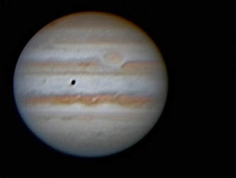

Probably my best Jupiter image from 2009. When you compare this to somebody's image like the one from Damian Peach from 2016 below, then you begin to understand what having a "realistic plan" truly means. I rarely shoot planets, just because I know I'm not blessed with the seeing conditions to do them as well as I'd like.

As the astrophotographer gains quality experience, which often happens simultaneously with your addition of high-quality astro-imaging gear, you should see the ability to execute a plan become more and more of a likelihood.   At some point, Murphy has less of a say so in your final results, as you have learned how to formulate plans that are 1) realistic for the equipment you have, 2) workable within the situations in which you are presented, and 3) reachable because you know what is actually possible for your subject.  

Moreover, perhaps you just need a cold dose of reality.  If your "plan" is to take an image of Jupiter at opposition and make it looks like a Damian Peach image, then you had better NOT be in Denver, Colorado when you attempt it!   I tried it once from Dallas.   Once. ​

In a similar way, I hope you have understood that not all subjects are to be treated equal.   In fact, there are millions of things to shoot, but there are likely only a COUPLE of subjects on any given night that will yield your best chance of success.  For example, if your plan involves going DEEP to fill up the entire frame with meaningful pixels, then you will be looking for optimum conditions for shooting that object.  Moonless nights might be a necessity.  You might need to wait for the right time of year where the object is high in the sky.   The seeing might be poor and you might need to go with a different plan on a different object with a wide-field instrument.   Nobody said having only ONE plan is sufficient...you certainly need alternatives!
Hopefully, I have been able to give you a glimpse at the types of things you CAN accomplish, subjects that make best use of your time and energies, those that give you the best opportunity to be successful from the start.   In the end, having a good plan helps to ensure that you can put quality data on your computer, which yields more ultimate power in processing that data.   Garbage in; garbage out.  

Therefore, planning means nothing without good execution and realistic expectations...and I hope you have learned that some subjects will be better than others in that regard.

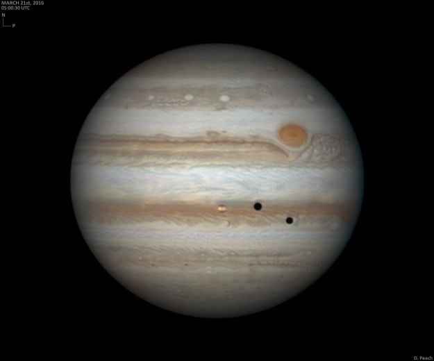

Credit Damian Peach at www.damianpeach.com

## Addendum - 4/10/2018

I'm sure that after you read the section above called "Investigating the Mosaic," you got the idea that I'm anti-mosaic.   Well, not entirely.   My concern was that people shouldn't do a mosaic just because they think they are supposed to, where not only is it a difficult and time-consuming process, but it is also something that cannot truly be appreciated unless you display it with a large, expensive, professional print of the work. 

Recently, I was introduced to metal printing, typically advertised as "HD Metal Prints" by many online print shops.   The technique, usually done on thick aluminum sheet, infuses the ink into the aluminum itself using a special process.   Reputedly, this process yields a result rich in color, with exceptional durability, sheen, and anti-fade characteristics.   Moreover, they typically will be bracketed on the back side, ready to hang on the wall, meant to project around 3/4" from the wall itself.    It's a gorgeous, frame-less look, without the need for expensive frames and picture mats.  So, while the process is more expensive than a typical paper print, you save a lot of money in the framing.

I decided to give it a try, choosing this last year's Total Solar Eclipse image.   I chose a 24" x 36" sized aluminum print from Artbeat Studios.  The process was simple...you upload the full resolution image (no bigger than 100mb) and choose the various print options. 

After a couple of weeks, I received the print in a solid wooden crate; well protected.  Needless to say, I was blown away with the result. 

For me, I have always feared spending big money on "professional prints" only to have them disappoint me with bad color matching and wrong black/white-point levels.   I was not disappointed at all with Artbeat Studios.   And many other online print shops seem to get equally good reviews from fellow astrophotographers.  

Since the first one, I have acquired a couple of more prints from them, as shown in the picture below.

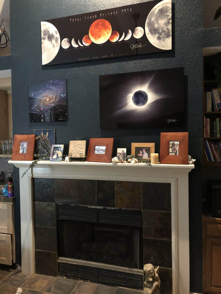

They can be pricey, but the results are more than worth it. 

It also has me reevaluating my thought on mosaics.   Now that I have the confidence in the final product, I can see how a massive wide-mosaic might be worth all the effort.   

However, mosaics will not be my default stance when it comes to image planning and acquisition.  I, like you, should continue to get good results with single frame images...at least until we know that we have the perfect spot above our sofas for that Orion widefield mosaic.

