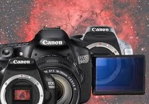
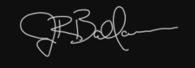

In the time of film, sensitivity of the emulsion increased in a near-linear fashion according to the film's "ISO" for short exposures. But longer exposures died quickly in a phenomenon known as "reciprocity failure." Here, film speed was somewhat of a secondary concern to the film's staying power. Truly, it didn't matter how "fast" the film was if it was going to lose its speed after a short amount of time anyway.

So, for normal exposures, practically speaking, film ISO was a trade-off between the emulsion's sensitivity and the point where the film "grain" became objectionable — you needed larger emulsion crystals to lift sensitivity to light, which made high ISO films more grainy.

So, utilizing high ISO film was not always practical because it was inherently "noisy." This was also true of any film if it was "push-processed" — overdeveloped in the darkroom to mimic a higher speed film. By the way, the term "noisy" as it related to grain-size was a subjective trait. For most, large grain was objectionable. But, for others, it was "artistic."

Even so, shooting film was troublesome because the single, long exposures were a prime target for airplane trails, satellite streaks, and cosmic ray hits. (Thank goodness for digital "stacking" and outlier algorithms!)

In a film camera, such as the Nikon F2 that I still fondly cherish to this day, physically setting the ISO on the camera did not magically cause the film to change its "speed." The film itself recorded light at a predictable rate regardless of how you set the camera's speed dial. Rather, ISO was a characteristic of the film, manufactured into the emulsion itself. On the camera, the ISO dial's purpose was to set the camera's internal light-metering electronics to properly adjust the automatic exposure time for your given choice of consumer film, which typically ranged in ISOs from 50 on the low-end to 3200 at the top.

So, why talk about film here?

Well, the ISO setting is NOT entirely different with a digital camera. Most now realize that ISO in the digital world is synonymous with sensor "gain," but this is not the same thing as "sensitivity." More practically, you should know that changing the gain of a digital sensor does not change the nature of the sensor, which inherently has its own built-in sensitivity (known as quantum efficiency or QE). In truth, your silicon sensor, be it CCD or CMOS technology, is no different than the "old-school" film that had a given sensitivity and spectral curve.

---

Today, setting the ISO of a digital camera or the "gain" of any digital camera (like a QHY or ZWO CMOS camera) will NOT give you more overall sensitivity...and this bears repeating over and over, mostly because this doesn't appear to be the case when you look at the LCD display on your camera after shooting at some crazy ISO numbers possible on today's DSLRs. It ***appears*** faster.

So we will say it again...higher ISOs are not the equivalent of faster speeds. Instead, your ISO dial (or gain setting) is simply responsible for determining how the camera will read out its pixel charges into the Analog-to-Digital Converter (ADC), and brainlessly setting it to the highest setting possible will not be to your benefit. The decision is still important, but likely NOT for the reason you think!

Here, let's look more deeply into the impact of your ISO choice and how you can better get the most from your sensor. Rest assured, there is an ISO setting that is proper for you, where you can maximize the collection of your on-camera data. This article explores that.

But first, we need to know something about digital sensors...

***How Digital Works...***

We must be careful when we call DSLRs "digital." In a sense, this is incorrect. When the chip records light from the night sky, the silicon stores the photons as electron "charges" within the photosensitive areas of the chip, which are known as "pixels." But at this point, the amount of current in each pixel is strictly "analog," distinguished by a wide variety of pixels of differing voltages. In fact, the digitization of the charges doesn't happen until ***after*** the next step of ***amplification***. This level of amplification (where the camera gain is set) is established by the user upon setting of the exposure's ISO on a DSLR.

For CMOS chips, which are now found in most all DSLRs and digital cameras (as well as in some exciting new cooled astronomy cameras), there are components within EVERY pixel to count the number of charges, amplify them, and perform an ***analog-to-digital conversion*** (ADC process)...the varying pixel voltages are assigned a "digital number" (DN) or "analog-to-digital unit" (ADU). These new digital values (12 to 14 bits worth depending on the DSLR) are then carried off the chip for on-camera processing and conversion to a file format for display and storage. These pixel values are stored within camera memory at this point (known as a "buffer" with cameras like a QHY or ZWO CMOS chip), capable of being accessed by "random addressing," much like RAM in a computer. All this happens on the chip.

For CCD chips, which are typical in most dedicated astro CCD cameras, the charges are collected within the pixel wells and they are gated off the chip, cascade style. This is accomplished by attracting the negative charges with positive voltages at the end of each pixel row, where there is typically an amplifier to measure the values and assign DNs or ADUs, whatever your preference.

Either way, CMOS or CCD, this "1 to 1" assignment of a voltage to a digital representation is ideal. It assures that each photon and each sum of photons within a pixel is uniquely distinguishable from a neighbor.

The number of representations depends on the ***bit depth*** of the ADC. Typically, the bit depth in our cameras is either 8, 12, 14, or 16-bit. A "bit" is the exponent of a base 2 (binary). Thus, an 8-bit camera (with a 2 to the 8th power ADC) yields 256 distinct digital numbers that may be assigned to pixel electron counts (or voltages). Other bit-rates are as follows...

- 8-bit = 2 to the 8th power = 256 digital numbers
- 12-bit = 2 to the 12th power = 4,096 digital numbers
- 14-bit = 2 to the 14th power = 16,384 digital numbers
- 16-bit = 2 to the 16th power = 65,536 digital numbers

The choice of an ADC will typically depend on the ***full-well capacity (FWC)*** of the sensor, which can be defined as the number of charges that a single pixel can hold. So, for example, for a sensor that holds 50,000 (or 50k) electrons (e-) of charge, manufacturers will attempt to match it to an ADC with a large enough bit-depth to represent all of the individual pixel voltages. In such an example, a 14-bit ADC has fewer representations than is needed by the sensor to allow for individual, unique representation for the pixels. Not that you couldn't use a 14-bit ADC, it would just mean that certain pixels of slightly differing charge amounts could take on the same digital representation. Doing so gives rise to something called ***quantization error.*** This means that pixels that SHOULD have distinguishable and different charges are now truncated to some degree by the forced assignment of an overabundance of charges to fewer available digital numbers.

To avoid this, a manufacturer will typically match such a camera to a larger ADC. In the above 50k FWC example, it makes sense to match the sensor to a 16-bit ADC, where there are 65,536 "numbers" available, which avoids repeated assignments...and thus avoids quantization error.

In such a case, if you have 16-bits worth of levels to explore, you might as well use them. As such, the 50k electrons of charge will typically be spread across those 65,536 digital numbers, meaning that some numbers might be skipped. This can be done, however, with no penalty. To make those assignments, the 65,536 digital numbers are divided by the 50,000 worth of charges yielding a level known as "unity gain," and it varies according to what camera you have — normally somewhere between ISO 800 and 1600 on 12-bit DSLRs and 50% of that on 14-bit DSLRs. It is affected by the camera's total "full-well capacity" (the amount of charges a pixel can hold before saturation) and the size of the AD converter, which, as I said, is typically either 12-bits or 14-bits in a DSLR.

So, for typical photography, the manufacturer has designed the camera with a range of ISO values to maximize the types of photography you can do with your DSLR, from fast-motion, low-light situations, all the way to bright-light landscape shots. And they must accomplish this using a level of technology that puts a cap on the overall dynamic range of possible illumination values. Truly, DSLR makers never completely knew that our application, astrophotography, required a whole different kind of technological specifications!

SNR before amplification will be the same after amplification.

For example, if a pixel is 1/4 full of charges, then setting the ISO to anything more than an amplification of 4x (times) will fill up the pixel.

***"Under" Optimized ISOs***

With CCDs and CMOS chips, as found in today's DSLRs, the electronics attempt to simulate ISO changes by increasing the amount of "gain" at each level. The idea is that if you have, for example, 1000 converted photons in a single pixel at ISO 100, then you can double the gain and achieve 2000 levels of Analog-to-Digital Units (ADU) at ISO 200 (ADUs are the output upon readout). So, upon read-out, the camera has twice the value in each pixel. If a pixel starts near the saturation point (full-well capacity) of the pixel, then adding too much gain will put values over the threshold, meaning you burn out the data in those pixels. This means that overexposure comes faster.

So, from the camera, it appears you've doubled the sensitivity. But this is merely an appearance.

DSLRs, upon read-out, have a number of potential levels of illumination, which may, or may not, represent all the photons that were recorded. This number is typically 4,096 possible levels of illumination, for 12-bit DSLRs, or 16,384 levels for newer 14-bit DSLRs. How the converted photons, or pixel charges, are converted depends on how you set your ISO (or gain).

So, in a 12-bit camera at ISO 100, the camera will likely set its gain factor where it takes several converted photons in order to represent one ADU out of the camera. It does this in order to protect against overexposure on typical shots. So, if the gain factor is 5 at ISO 100, a 1000-level pixel is assigned to the 200th level upon output (5 photons per ADU). At ISO 200, or gain 2.5, it would be at the 400th level. At ISO 400, or gain 1.25, it would be at the 800th level...and so on. Thus, lower ISOs surrender photons captured in order to protect the top-end from overexposure. For the astrophotographer, light photons captured in those elusive shadow regions just got deleted from existence, never to be seen again, sadly.

Thus, at gain factors greater than 1 — "under" optimized ISOs on the camera — we lose data because the actual amount of photons getting recorded is wasted by this "rounding" of pixel charges, something known as "quantization error." So, up to the point where a camera has a "1 to 1" representation of converted photons to ADUs, there is decreased "sensitivity," to use the term somewhat incorrectly. To say it more accurately, the data loss in this conversion from analog to digital units causes a loss in dynamic range. Areas in the shadows that should have had a gradient of illumination values will now be under-represented.

So, you might think that the highest ISOs on your DSLR would be your best bet and, perhaps, allow you to accumulate your data "faster"? Well, no.

***"Over" Adjusted ISOs***

At ISOs where the gain is set to less than 1 (higher than unity gain), what happens is that the charges in a pixel are assigned to ever increasing ADUs, normally skipping ADU numbers. For example, if unity gain is at ISO 800, then going to ISO 1600, or increasing gain by a factor of 0.5, will assign 1000 charge pixels to the 2000th ADU level. In the same trend, a pixel with 1001 charges will get assigned to the 2002nd ADU level. This means you will have no representation at the 2001st level. This might not seem like much, but when you increase to ISO 3200 (or 4 "stops"), then you will have 3 missing units between numbers, and so on. When you do this, especially on a 12-bit DSLR with 4,096 possible AD units, you will be greatly shrinking your camera's full well depth. In other words, you have full photon representation in the conversion (no quantization error), but more and more pixels will become increasingly oversaturated, which does NOT take long on bright stars.

Reaching saturation faster is not a virtue. Doing so is merely wasting photon capacity at the top-end, clipping your stars. Therefore, in ISOs above unity gain, there is no increase in "sensitivity" since photon representation was long ago maximized.

So, in reality, increasing your ISO is not gaining you any more photons than you originally had available. There is no magical switch on the camera that allows you to accumulate photons "faster." Photons are what photons are. There will be no actual increase in the NUMBER of total photons recorded by the chip itself. Applying "gain" is just a way of performing some mathematics (through electrical currents) to the pixel to achieve the perception of image brightness. Remember, most people do not post-process their images, so they want their images to be ready for viewing upon image readout. For the astro-imager, we just need solid data for post-processing.

**Putting It Into Practice**

If photon maximization and great dynamic range were the only virtues to properly optimizing your ISO then that would be quite enough. But there are certainly other noteworthy aspects worth considering, all of which help to improve upon the performance of the DSLR as an imaging platform.

On the pros/cons list of DSLRs, particularly in comparison to their bigger Astro-CCD cousins, DSLRs surrender a lot in the way of thermal noise. While today's DSLRs are improving in that regard, the lack of internal cooling options makes long-exposure astro-imaging much more difficult than with a dedicated astro-camera. And, in fact, setting a camera's gain to higher than necessary simply compounds that issue.

High ISOs naturally produce extra levels of thermal noise because of the camera amplifier — the part that sets the level of charge based upon the gain — is working harder to do its job. It gets hotter because higher ISOs necessitate more AD conversions (more electricity is required) and thermal noise is the byproduct. So, at a certain exposure length and/or ambient temperature, you will end up with a better image (greater S/N ratio) with an ISO that best balances photon representation with the level of thermal noise. That level will be at unity gain.

But perhaps the bigger issue, an issue which I seldom hear addressed, is what happens in smaller bit-rate cameras to our star images when we begin to lengthen our sub-exposure times?

To see what I mean, take a long sub-exposure with a DSLR and open the RAW file in your image processing program. Of course, this will represent the unstretched data, exactly how the data was read out of the camera. Do you notice the stars of this unstretched image? More than likely, even in a 14-bit DSLR, the bright stars are easily seen, as well as many of the fainter ones. What this means is that the cores of those stars have already maximized the full-well capacity of the chip and have oversaturated to the point where there is significant data loss on the high-end. Whereas there is no data loss in terms of image details, there will be a huge loss in star color.

This is data you cannot retrieve. It is gone. It is complicated by the fact that now you have larger stars in the image than you might have intended and stars that have lost their natural softness. And how are you going to merge the color of the star's outer halo with the already maxed-out central core?

And to make matters worse, this makes image processing more difficult because you now have to be extremely careful in how you stretch your data, otherwise, you lose the rest of the color of your stars. Many techniques have now been developed which might involve star masking or their entire removal during processing, but I have found these developments to be reactionary to the fundamental problem, that namely, even with a 14-bit DSLR we must be very careful to first find the optimal ISO and then be careful not to go too long with our sub-exposure lengths. 12-bit DSLRs simply do not offer the necessary bit-rate.

As a response to the difficulty in finding this balance, software such as PixInsight offers nice HDR compression routines to help preserve the top-end, as well as the ability to do the aforementioned star-masking. However, I see many people now using such techniques with data acquired with dedicated 16-bit (65,536 ADU levels) Astro-CCD cameras and I am left to wonder why? Proper logarithmic stretches (good curves) are all one needs to combat this lack of headroom.

But the lesson is as follows...care must be taken to protect your star images, because once that data is clipped it is gone forever, as is the star color that that data represents. Of course, a higher than necessary ISO just makes that point of star loss come much faster, all the while you increase noise in your image with absolutely no gain in additional information.

In truth, setting the actual ISO for long exposures depends on many factors, and it's often not a matter of simply finding out what unity gain is for your camera and keeping it there. For many DSLRs at any given exposure length, you will likely find that even at unity gain you will need to shorten exposure times in order to prevent star over-saturation. A target such as the Rosette Nebula, where you have a bright NGC cluster of relatively bright stars in the center, will peak out the stars VERY quickly at unity gain with 12-bit cameras and, in my experience, you cannot maximize your sub-exposure lengths to achieve best signal to noise efficiency.

I used that same target recently for some images ([see here](/gallery/ngc2244-rosette-nebula-dslr/)) and found my 5-minute sub-exposures to be quite objectionable with regard to star saturation. I used a Canon 60Da set at ISO 1600 using a pair of f/7-ish 6" apochromatic refractors for these images. In retrospect, ISO 1600 was too much for the 60Da, as I learned afterward that unity gain is much lower, perhaps as low as ISO 250 to 400. This means I was over-exposing at 5-minute sub-exposures. However, it was a cold night so I had hoped to take advantage to go longer with the sub-exposures. More investigation into the optimal ISO and sub-exposure length is definitely needed for the Canon 60Da and other 14-bit cameras, however it goes to show my point...brainlessly setting your ISO too high can cause problems you do not anticipate!

Even so, imagine had the target been the Pleiades?

Finding the sweet spot regarding ISO will be quite individual to the gear being used and the target being acquired. But one thing is for certain...you will never gain improvements in the image beyond the unity gain ISO of your camera.

