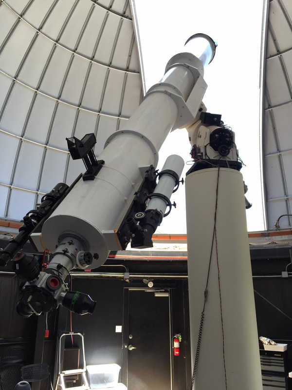
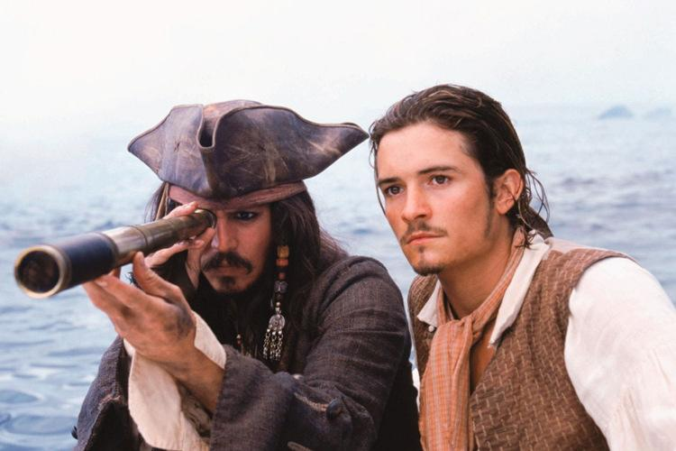
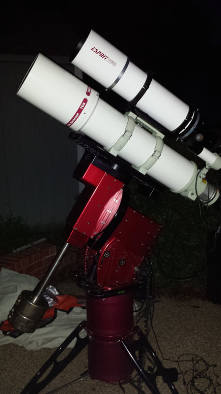
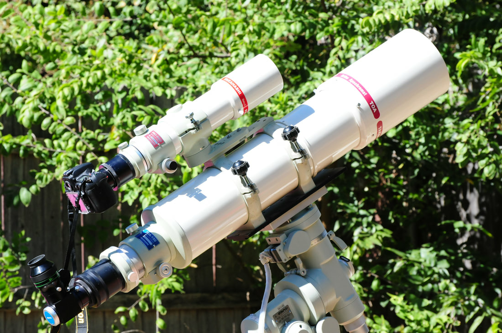
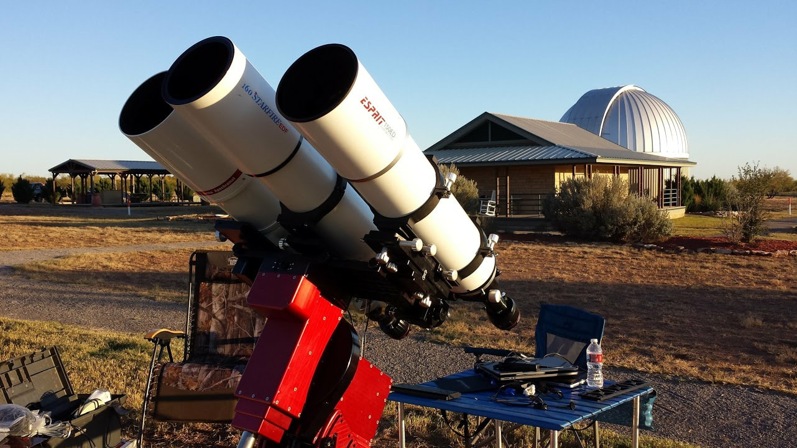

When most of us picture a "telescope," our minds see a refractor.

A 15" D&amp;G f/12 refractor.

Sighting through a tube, from one end and out the other, magnifying the oncoming approach of pirates gaining on your ship or watching the Pink Panther fighting with the astronomer at Star Peak Observatory. There's a romantic aspect to the refractor that no other telescope designs have. Our childhood fantasy was one of looking up and through such a telescope as the 15" D&G f/12 refractor shown at right.

From a pure design standpoint, a well executed refractor has its complexity, as lenses must be designed to not only flatten the field from side to side, but to do so by bringing all wave-lengths of light into focus exactly at that flattened plane.

The spyglass — a refractor's oldest and most romantic role.

A TOA and an Esprit refractor mounted side by side.

The same pair of refractors, set up for a daytime imaging session.

A Starfire EDF and an Esprit refractor sharing a mount, in front of an observatory dome.

The article breaks off here — Jay had sketched out the sections still to come, but never wrote them:

- Refractor Design
- Achro vs. Apo
- Practical concerns for visual use
- Practical concerns for imaging

That's the whole page as it exists on the original site. Reach out to [Jay](mailto:jballauer@gmail.com) if you were hoping for more.
