## Foreword

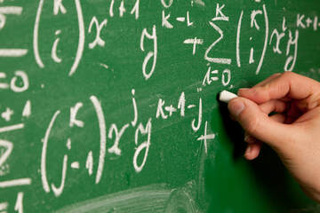

You will not learn astrophotography over night.  You will not be able to read a single article, or even a single book, and think that you can accomplish some of what you see at All About Astro. 

On the contrary, one article will be quite enough to inform you just how much education about the hobby you LACK; how much there is to learn.  Complicating the matter is the Internet.  Yes, all you need to learn imaging is on the Internet.  It's all there.  GO!  

Where to start?  For this reason, having a plan is important.   This article, in addition to suggested resources, will outline a plan or approach to your learning.  Some of you likely lack a complete clue about what it is that an astroimager actually does...so we will also illustrate a picture of what it's like to be an imager.   What is involved with a typical night under the stars?  What types of skills do we need to process our images?

## Jumping in with the Articles at All About Astro...

If I were writing the book, "All About Astrophotography," then this article would be the starting point in many ways.  In fact, one of the purposes of this article, other than to help ease the learning of a pretty complex hobby, would be to provide a jumping off point for other articles found under this webpage's LEARNING section.  As such, be aware of how I link to those articles from the over-arching concepts mentioned here.   Likewise, as always, read the articles in small doses.  There's a lot here...and a little goes a LONG way!

## A Perfect Night...

The night of an astroimager starts with hopeful enthusiasm.   Last night, after all, was a washout.  Tonight is a little windy, but that's not an ender, like so much of the weather.  Hopefully, the wind doesn't pick up any more, since last month you had much of your "data" ruined by the wind-induced vibrations to your mount.  That's why, tonight, you've chosen to shoot with your smaller refractor.  Shorter focal lengths means more room for error...so let the wind blow a little.   

Setup begins after dinner - a window of 90 minutes of remaining daylight to make sure everything is ready by dusk.  First thing you do is put up your small table and the second thing you do is pop open a beer to place on the table...because that's important..   

Then, you pull out your big tripod for the "mount," sticking one of the three legs in the general direction of "north."   Close enough is all that matters for now, since you'll need to see Polaris before you can actually "polar align" the mount. 

Next is your equatorial mount "head".   Heavy, weighing about 40 lbs. itself, you are thankful that you ditched the $400 case you normally keep it in...it's such a pain trying to grab it out of the foam padded case!   From the back of the SUV to the tripod, you strain to lift up the GEM (German Equatorial Mount), spinning it around toward the northern-placed leg prior to attaching the bolts to connect the two.    

Counterweights are next.  You brought only one to this dark sky site since your small refractor only needs one.  It slides on and you bind it to the counterweight shaft with no real care about where - you'll balance the mount later.   Oh, but don't forget the stop that screws into the end of the counterweight shaft.   You remember very well the time you forgot the stop and a 12 lbs. counterweight slammed into your foot!  

You slide the Losmandy rail containing the telescope's rings into the mount's saddle and lock it down.  You open the rings, insert the telescope, and lock down the rings.  Again, not caring about actual position.   

Then it's the finderscope, guidescope, camera adapters, and two separate cameras - your imaging camera which connects to your small refractor and a "guide" camera that goes with the guidescope. 

Cables are next, which means out come the laptop PC.   USB cables, one each for the mount, imaging camera, and guide camera are run to a USB hub stuck with double-sided tape to that Losmandy rail.   Then, a long USB cable goes from hub to laptop.  You also run a separate serial cable from your guide-camera to the mount.  Power for the mount and both cameras goes to a DIY terminal strip also mounted at the rail, and a power cable connects the strip to a large DC 12v battery.   The battery will power all your gear for the duration of the night.    You are ingenious!  

You tidy up the cables a little bit with zip-ties to keep them from hanging on stuff.  And then you release the mounts RA lock to begin balancing the mount.  Holding the counterweight shaft to keep it the scope from flying towards the ground, you loosen the counterweight and slide it lower, intermittently locking it in place to see if it perfectly balances out the small, but surprisingly heavy refractor, locking the mount when you achieve balance.   You then repeat in the DEC axis, sliding the Losmandy rail in the saddle until you are convinced it will not spin out of control if you let go.   

You power up all the hardware, including the laptop, equipped with Windows 7 (because 10 might not work yet with your drivers and you hated 8).  When convinced that everything is working, you start-up your chosen planetarium software, TheSkyX, and you wait for the excitement to begin.  

"Polar alignment" begins the moment you can see Polaris, since now you can use your polar alignment scope.   Turns out you were remarkably close to it when you first plopped down the mount...you are getting good at this stuff!    With allen wrench in hand, you flip on the illuminated polar reticle and compare it to the one shown on an app you've brought up on your phone.  You torque the altitude and azimuth adjusters on the GEM until Polaris is at the exact spot in the reticle that the app indicates.   You know precision in the alignment step assures no drift in the image throughout the night...and you are thankful you spent extra money on that heavy Takahashi mount that lets you NAIL your alignment.  

You go into TheSkyX, make sure that it "sees" the mount, connect to it, and then you select Betelguese, surprised at how faint it looks compared to last year.  Using the handpad of the mount, you "slew" the scope toward the star using your small finder-scope.   You connect to your imaging camera in SharpCap, turn on your camera's cooler to -15 celsius, and you begin short, repeated focus exposures hoping that Betelguese is on the screen.   Certainly it is, but you adjust focus to make it look like less of a smudge.  It's also a little off-center, so you nudge the hand-box until it's right in the middle and then you "sync" on the star in TheSkyX.  Now, you feel good about using the planetarium software to go anywhere you want in the night sky.   

Of course you really aren't focused yet.  You've finally learned your lesson after scores of wasted data due to too many assumptions about being "in focus."  So tonight, as in all nights now, you begin your typical focus procedure with a mag 5 star and a Bahtinov mask.   You hope to get a robotic focuser and total automation software at some point in the future, but for now you'll just adjust your focus by hand.   

Then swing the mount over to another, less bright star, and you repeat the same procedure for the guide camera, bringing it to focus and then "calibrating" it on the current star, so the "guider" can do its job accurately and precisely.  

It is now 30 minutes later from the moment you first saw Polaris and you figure that there's about 30 minutes of twilight remaining until you can actually start an image.  You are definitely getting good at this!   So, you use the time to take some dark frames with the camera.  Easy enough.  Ten 3 minutes darks in a row...glad the software does it all for me with the push of a button. 

So you celebrate being "ready" by taking seat and sipping on the beer you opened an hour ago.  Thankfully, it's a chilly night so the beer only warmed up enough that you can really taste the malt...just as you like it! 

You decide on a target for the night...the Rosette Nebula...and you know that you have the right equipment for the job.   When dark enough, you select NGC 2244 (which is the star cluster within the core) within TheSkyX and you press "slew."  Sounding like a jet engine, the mount does a meridian flip from east to west, bring the nebula closer and closer on target until, after a minute, you are sure the mount did its job.  But to be certain, you do a 10 second image with the main camera to see if you recognize the field...and truly the cluster is right in the center of the laptop screen.  Yay!  

Next, you bring up your guide camera, take a 1 second exposure, and see if there is a bright enough star to "guide" on.  Yep, lots of bright stars here.   So you choose one that isn't over-saturated and you tell the software to begin auto-guiding.   You know that now if the star moves in any of those 1 second images, the software will bump the mount automatically to keep the star in the center.   At this moment, you are thankful you spent all that extra money to get away from your old CG-5 mount, which only seemed to calibrate and guide accurately half of the time.  

Finally, you are able to setup a sequence of exposures to be taken with the imaging camera.  Your camera is one-shot color (OSC), so you are glad its just a matter of taking a whole bunch of those pictures instead of needing to capture through RGB filters with a grayscale camera.  But isn't digital wonderful!  You can't wait to "stack" all 100 three minute images you take over the course of the night.  Of course, the temperature is dropping quite a bit, so you know you'll have to REFOCUS your f/5 refractor after about 40 minutes because of focal shift.   You are determined to do so, since you are tired of being lazy and seeing your images become more and more out of focus as your evenings goes by.  Truly, focusing is job ONE in this hobby!   

Your first image of the Rosette appears about 3 minutes later.   It's all dark on the screen, but you know that the monitor can't show your 12-bit image on screen since the software's "screen stretch" setting expects 16-bits.   So, you manually move the slider to reveal all the thick ionized hydrogen and dust, along with some quite bright and round stars.  

Nothing to change now...there's one beer to be consumed between each focus run.   Might as well sit back with some binoculars are enjoy the night. 

The ideal evening as an astro-imager has taken place.  You pack up in the morning after taking some "flats" with your EL panel, happy with the knowledge that you have so many fine sub-exposures of a great deep sky object.   

After 23 years in this hobby, I'm still waiting for a night like that.   Not that I haven't been close.  I'm good enough now, my equipment reliable enough now, that I do pretty well on most nights.  But there's always something you didn't expect.  The astronomy gods always have a surprise, either weather or something mechanical or a stupid Windows update that you forgot to disable!  

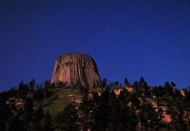

There isn't a huge challenge involved with an image like this. Taken in 2015, Devil's Tower in Wyoming is awesome, especially when you can catch the Big Dipper with it. Despite a full moon, knowing how to properly expose the image takes some practice. But practice aside, this type of image is a great way to start in this hobby. Taken with Nikon D810a DSLR on tripod.

## Figuring It All Out

​For today's beginner to the hobby, it seems less obvious that the learning curve with digital is far beyond that which us old timers experienced with film.   Those were the easy days. In fact for us, the earlier adopters to digital CCDs, we had a need to evolve and LEARN a whole new, complicated way of imaging the night sky.    More electronics, more cables, more things that could go wrong.   

Learning this new frontier of imaging wasn't easy.   It wasn't like we had a ton of resources.  Yes, we had an early Internet, but there was nothing on the internet in which to learn digital astro-imaging other than some astronomy forums or "use-nets" where many of us would post our experiences, pitch ideas, and show the fruits of our efforts with some rather ugly (by today's standards) astrophotos.  So, we had to experience a lot of failure, define some new experiences, and read a few textbooks before we started to see some good progress.  

Most importantly, unlike today, we didn't have people to teach or mentor us.   Those people didn't exist.   There were experts within different areas of what we needed to know, which were definitely an important part of our learning.  There were trailblazers who accomplished a variety of firsts in our hobby, leaving some coat-tails onto which the rest of us rode.  But for the most part, from the time we started until the time many of us felt we "mastered" any aspects of it that we cared about (there's so many ways that this hobby can express itself), it took many, many years.  
​
Today, of course, is different.   The problem is not a lack of learning resources, but rather there are so many resources that you will likely not know where to start.  In fact, I would suggest that you need a filter (just like our cameras); you will need a way to sort out all the information (and misinformation) to find out what is worth your time.   Certainly, you need to be careful, as there are opinions out there that can confuse you or mislead you as much as help you. 

And in fact, if you are reading this, you are undoubtedly going through the process of learning this difficult hobby.    But, perhaps unlike anything else you have read,  I will attempt to show you how to put together a program of study from the enormous amount of largely disconnected resources out there.  And then we will put together a method of practicing astrophotography.  And if you don't really need such a program, you should still get plenty of mileage out of some of the many tips and tricks. 

## Developing an Approach

If you are anything like me, you dreaded taking classes in high school and college for the subjects you hated.   For me, I despised literature.  The act of reading entire books or short stories to learn a small snippet about something I didn't care about seemed a waste of my time.   Pass me the "Cliffs Notes" or just show me the movie!   

But what sets hobbies apart from high school is that we genuinely want to do it and we are typically willing to read the entire book.  We often have sufficient motivation, but this alone does not assure that we are willing to do what it takes to properly learn it. 

This hobby is a challenge...but I knew that going in...and it was honestly my driving force for learning it.  I embraced every failure I had because I knew that I was getting better regardless of the result.   And I failed hard.   Truth be known, my first efforts were hooking my Nikon F2 to my Meade LX200 at prime focus.   It didn't take me long to realize that I REALLY needed to work up to that type of photography.  

Do you know how depressing it is to have your first 6 rolls of film developed and get nothing but trash for your efforts?  

I say this because I find that most people are more interested in the end result rather than the "journey."   They see images like those in FIGURE 1 below and they don't realize how difficult it really is.  They buy a bunch of expensive equipment, assuming they'll have what it takes to use it, but it becomes a classic case of biting off more than they can chew.    ​​

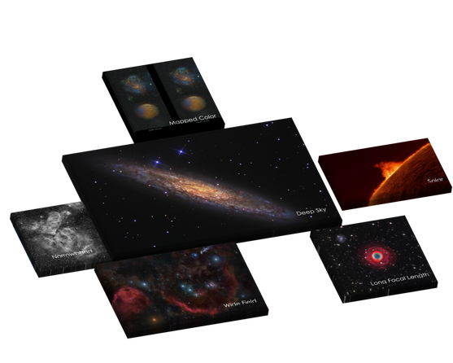

FIGURE 1 - The form of the Astrophotography you wish to learn can play a large role in the ease in which the learning occurs. While much of your choice in this area is dictated by equipment availability, budget, and location, the willing learner needs to understand the demands and complexities of each imaging form and how much time and effort you are willing to devote to having success. This goes beyond the scope of this article, but be sure to spend some time researching why some images are just a heckuva lot easier to take (and process) than others.

## A Sensible Progression

​Rethinking my approach, I decided to begin with the more fundamental of techniques, which was film exposures using a tripod and wide angle camera lenses.  Star trails, Milky Way vistas, nightscapes, lightning pictures, and constellation images were my objectives.   I followed that with "piggyback" photography, achieving my most exciting successes.  This is when I truly fell in love with astrophotography.  And only then did I really feel prepared to work my way up the ladder to the real hard stuff.

For today's beginner serious about photography, you probably already have a DSLR and a tripod, so it just makes sense to begin with images like the Devli's Tower shot shown earlier.  Doing so, I think newbies will better understand the level of commitment required without being thrown into "prime focus," long exposure imaging through a telescope.  You will also have a better idea of what your next purchases should be.   ​​

From there, I would suggest a similar progression (seen in FIGURE 2 below), regardless of how you approach your learning in the sections that follow.   It's not all THAT challenging doing nightscapes with a DSLR on a tripod and those early successes will drive you forward, very analogous to the way I did it with film.  That same equipment can then be used to mount onto the top of your first equatorially-mounted scope, using your own camera lenses while the scope serves as the tracking platform. This is what I mean by "piggybacking."  I consider it a powerful gateway to all other forms long exposure, deep sky object (DSO) imaging using telescopes.  Unfortunately, "piggybacking" seems to be the imaging method talked about the LEAST (see Sidebar: Piggybacking Power! for more details). 

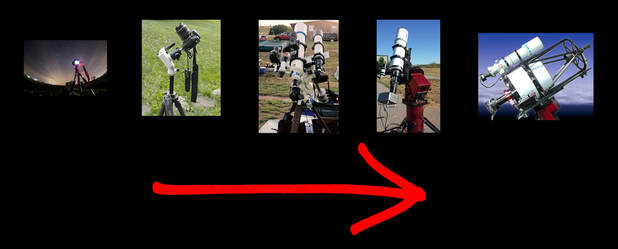

FIGURE 2 - Jumping into the hobby at the extreme end can prove to be difficult for ANY learner. By starting at left in this diagram and then working toward the right, it assures that your learning becomes gradual and consistent, all the while producing some nice images as you go. Shown left to right are a DSLR & tripod for wide-fields, a tripod "tracker" setup, a piggyback rig, a short focal length deep-sky setup, and a long focal length deep-sky setup.

## Sidebar: Piggybacking Power!

One of the things that becomes quickly evident while practicing this hobby is that the challenge to get good images rises exponentially with the focal length of your setup.  As shown in FIGURE 2 where ​there is a progression of optical focal lengths from left to right, the use of short-focal length camera lenses makes a ton of sense.  It's just plain easier!

Tripod shots will typically be less than 30 seconds or so, which is the maximum set exposure time of most DSLR cameras without either using a shutter-release in "B" (bulb) mode or using an intervalometer (hardware or software) to automate your exposures.   The "rule of 500" gives you a great rule of thumb for estimating the maximum exposure possible for stars before they start to trail, which is basically dividing 500 by the focal length of your lens.   It will vary according to where in the sky you are shooting and the "crop-factor" of your camera sensor, but the article linked above will give you a handy chart so you don't have to compute those figures each time. 

After shooting stationary tripod images of star-trails, constellation, and the Milky Way anywhere from 14mm to 50mm - or perhaps even doing some other creative night photography (see images above) - the next step will definitely become "tracked" shots that move with the stars.  This allows you to do much longer camera exposures - you bought that intervalometer, right?  That might necessitate the purchase of a dedicated-tracker (either commercial or home-made).  But most people just set the camera on a motorized equatorial-mount.   

Doing so could occur in three forms:  1.) Mounting the camera with lens directly on a German-Equatorial mount (GEM), 2.) Mounting it atop a Schmidt-Cassegrain (or any fork mounted scope) with an equatorial "wedge," or 3.) piggybacking it atop (or alongside) your main telescope on a GEM.  ​

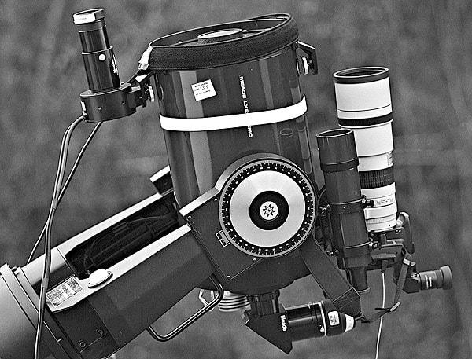

- credit Michael Covington at www.covingtoninnovations.com

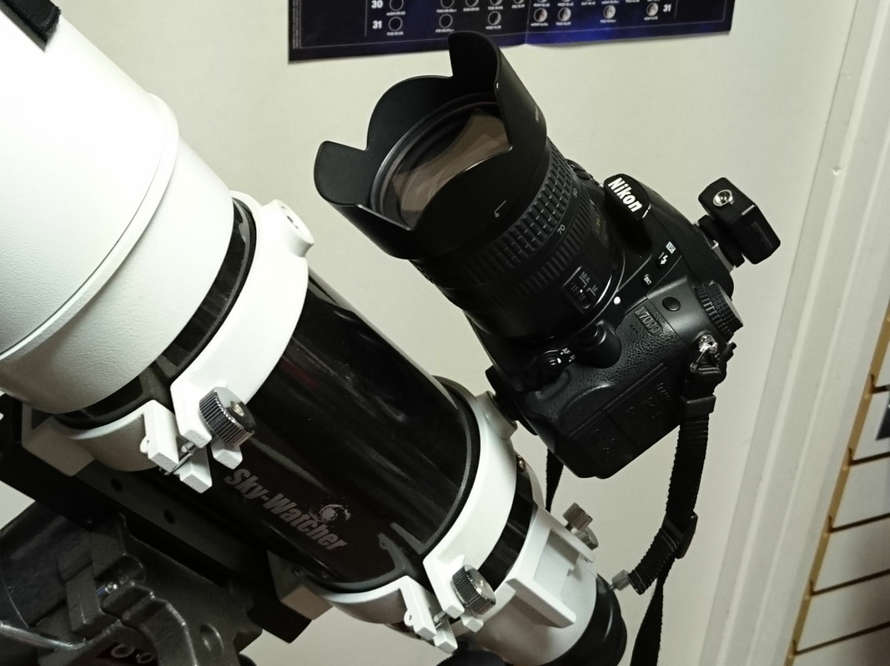

- credit www.f1telescopes.co.uk

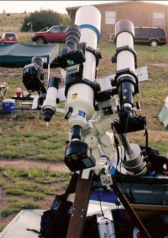

- credit Phil Jones at www.visualuniverse.org

Shown above - Various ways to piggyback a camera.  Piggyback DSLR with large lens atop a fork & wedge mounted SCT (upper left), a DSLR fixed atop a refractor with GEM (lower left), and a variety of cameras mounted in both piggyback and side-by-side configurations (right).

Whichever way it's done, piggybacking a scope is simple and the quality of the tracking EQ mount doesn't have to be extreme.  Most people with DSLRs likely have 200mm or 300mm lenses in their camera bags, and I cannot think of a single electronic tracking equatorial mount that cannot be made to give stable, long exposures (within reason) of wide-field deep sky objects.  It further introduces you to the skills of polar-aligning a telescope, calibrating images, and refining focus. It can also accommodate multiple camera setups for simultaneous image capture.  

The feasibility of this type of approach, from the standpoint of limitations, ends somewhere around the 300mm focal length mark.  Nicer GEM mounts and the more sturdy fork-mounted SCTs can provide sufficient platforms to take exceedingly long exposures; however, large lenses can cause some setups to oscillate with vibrations, become affected by wind, or require a "guiding" camera to keep tracking centered.   Even so, before you purchase those fancy new telescope optics, spending extra on the mount FIRST makes total sense when you consider that you may have enough camera lenses to last you quite a while! 

In fact, this should prompt the question as to why ​we think we need a fast 3" apochromatic imaging scopes to use with a DSLR?   For example, while a Skywatcher Esprit 80mm f/5 telescope is pretty slick for 400mm focal length images, you might not be gaining much over the Canon 300mm f/4 "L" series lens you already have in your camera bag.   Add a 1.4x telecompressor for 420mm f/5.6 images, and you begin to see the virtue of saving that money for either more telescope mount or a medium focal length telescope in the 500mm or greater range.    Of course, if you are using a dedicated astro CCD camera, you'll be very inclined to buy such telescopes, though be aware that some such cameras even have ways to adapting it to your DSLR camera lenses.  

The longer you stick with your arsenal of camera lenses, the more versatility you will have.  And though you are progressing up the learning curve by increasing focal lengths, it's not like a your camera lenses ever become obsolete.   We always have the need to shoot such images...and the best way to take advantage of all those toys in your camera bag is to come up with a piggyback rig!

My hope and my assumption, if you are reading this, is that you've already figured out how challenging everything is, yet you are determined to dive into your education, undaunted by the journey before you.

​So here, having fully committed to your equipment investment and the price of the learning to come, let's look at three general approaches to learning today's astrophotography.  There's the "tutorial approach," where we look for step-by-step processes or individual activities to initiate us to our learning.   We have a "theory approach," in which we consider the overall concepts and overarching themes of what we are doing.   And there's the "guided approach," where we enlist a teacher, mentor, or community to help us with our learning.   

**SPOILER ALERT:**   All three approaches are necessary if you hope to learn in the most efficient of ways, regardless of where you are in your progression. For more about the overall process of learning just about anything, check out the Sidebar: How to Learn Anything.
​

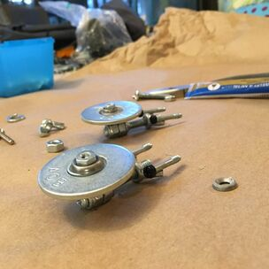

Wanna build a Starship Enterprise and don't know how to start? We'll click on this picture for a tutorial on how to make one!

## The Tutorial Approach

If I want to build a model of something, let's say, the Starship Enterprise, then I wouldn't have a clue on how start it.  And for a scratch build, I wouldn't even know the right materials, even though I've seen people use balsa wood for stuff.  Nor would I know the appropriate tools, except for being able to use a digital multimeter to help wire an LED circuit.  

Wouldn't it just be nice if somebody posted an "Instructables" tutorial online detailing every step involved?  Oh, wait...it's a little basic, but check out the one at right.   

You can search the Internet for building or fixing ANYTHING now-a-days and you'll undoubtedly find a "tutorial" on some aspect of it.  Keeping with the sci-fi theme, do you want to build a Millennium Falcon out of Legos?   Well I can point you toward a PDF file showing THOUSANDS of steps toward completing this wonderful achievement! 

Building a ship that can make the Kessel run in 12 parsecs is very similar to astrophotography...and a bunch of tutorials can be an extremely valuable way to get started on a hobby when you have no other idea of how to proceed...   

With any mount, there's probably a tutorial online on how to set it up.  
Setting your DSLR for optimum exposures can be discovered with a simple Google search.
If you want to learn how to sharpen your image, then I'm sure you'll see a thousand videos on YouTube detailing the process.
For those who want to hit the ground running, one of the zillion "How to Shoot the Milky Way" articles might prove to be a great resource for you.

For many, especially those driven to take "nightscapes" or time-lapses with a DSLR, then jumping from tutorial-to-tutorial might be all that's needed.    ISO 1600...check.   Good focus...check.   Compute exposure length...ready to go! (see Sidebar: Piggybacking Power! for the "Rule of 500")

Tutorials, or even simple lists, reminding us of how to do some of the more difficult tasks in the hobby are all over the Internet. Or, thankfully, many wonderful people have published their entire "workflow," or their the step-by-step process in which we can emulate. 

Step-by-step, inch-by-inch, you can accomplish the task.   Rinse.  Lather.  Repeat. 

It's been said that to master anything, we need to do it for 10,000 hours.   Practice, practice, practice!    And just about any tutorial can provide you with some kind of meaningful practice.  We don't even need to understand what we are doing in many cases...the recipe for success is on the Internet.  

Hopefully you will strive to supplement your learning with some extra reading, but the Tutorial Approach does promote a good pathway to success, especially for those who don't have a clue how to start.  

## The Theory Approach

​​What if you wanted to be a good basketball coach?   Would you win a lot of games if you ran the same plays as your own high school coach or if you watched a few videos on how to coach?   Well, perhaps for a while.  But what if your players change or the rules change or the competition and style of play changes?   Will you be able to adjust?  

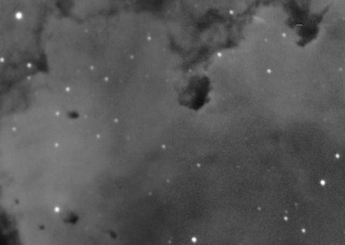

FIGURE 3 - Gaining valuable information about an image despite optimal results has great merits. This two-frame mosaic portion of the Rosette Nebula is a study in the importance of SNR vs. "seeing" conditions. The noisy right hand side of the image taken during worse seeing had easily 50% more imaging time compared to the left side of the image. Each frame, taken on subsequent nights, demonstrated one of the most important discoveries of my own learning - that the quality of my acquisition is just as important as the amount of time I spend DOING my acquisition.

Tutorials over astroimaging can yield success on a regular basis, but it's only by understanding a little about imaging theory that you can hope to duplicate your successes on multiple nights on a variety of images using a variety of hardware and software.     

For example, I would argue that using a digital camera to get good "data" is a nice accomplishment, but understanding the nature of that data and how it can be improved the following night is quite another.  Moreover, knowing how a TEC-cooled astrocamera can yield another level of significant improvement is doubly empowering!

Such is the basis of the Theory Approach to learning astro-imaging. 

Your ability to respond to the ever-changing nature of events and the wide range of complexity depends on your ability to understand the whys and hows of the hobby.  In other words, do you know enough about the overall nature of what you are doing to be consistently successful?    

Please forgive the minor digression, but as a high school teacher, my career began by teaching Career and Technology courses, chiefly on how to use software on a PC to do word processing, spreadsheets, and databases.   Back in 1995, there were a variety of software packages that could be learned, and no single software publisher had the kind of market-share that Microsoft enjoys today with their MS Office products.   So, it became important for us to teach the overall concepts of those applications, even though we practiced using a single software package.  Yes, we used an early version of MS Office, but it could have very well been ClarisWorks, which I favored personally on Macintosh at the time.  

​In astronomy, there IS NO STANDARD HARDWARE OR SOFTWARE PLATFORM.  Your results will be different from my results, even if we use a lot of the same gear.   To be able to understand these differences, there's a huge benefit to reading some good articles on webpages, magazines and books covering topics like SNR, sampling, binning, histograms, deconvolution/convolution.   Likewise, knowing something about astronomy gear can help you know the limits you might expect with your own gear and whether or not a change or upgrade might be in order? 

While you might not understand "theory" the first time you read the theory-heavy articles at an excellent webpage like All About Astro, you certainly might after a year passes, after you've seen enough of the concepts in your practice.   It's a systematic approach whereby we categorize our experiences, realizing how all the pieces fit together, and how new experiences fit into the overall picture.   

It's in knowing that this week's image of the Rosette Nebula might not produce a pleasing end product, but there might be something far more valuable in having made the attempt (see FIGURE 3 above).  This is what makes you better at this stuff.   It turn's failures into learning experiences...which equates to less failure in the future. 

## The Guided Approach

Teaching is one of the more undervalued or under-appreciated professions around (in my biased opinion).   Teachers are necessary in the development of the learner.  If a student didn't have anybody to guide instruction, answer their questions, give customized practice, grade the quality of their work, and assess mastery of their learning objectives, then there would no longer be the need for schools, colleges, and universities.  

When you attempt to learn ANYTHING without a teacher or mentor, no matter who you are, you are doing so at a handicap.   Those that recognize this fact will favor a Guided Approach to the hobby.

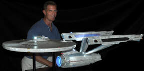

My fellow astroimaging friend, Jason Ware, makes scratch-built scale models of NCC-1701A, which geeks know as the Starship Enterprise. If I were to build one, I'd definitely need his help. It'd sure save a ton of time! Maybe I should consider budgeting for him to be my mentor, considering that the extra thousand hours of trying to learn it all by myself are worth money too!

Unlike when I started the hobby, there are plenty of people available today to serve as teachers/mentors to your learning...some free...some paid...but all of which have value.  And even without a specific individual to serve in a mentoring capacity, bringing in people at various stages - if only to "show me a few things" or to answer important questions - can cut into the learning curve substantially.  

Workshops and other forums (online or not) become valuable in that regard, even if a single mentor is not around.   For some reason, we don't consider this a part of our astronomy budget, but we should. 

So, for the beginning learner of Astrophotography, you should consider how much of your learning will involve a mentor and how much will you be willing to budget to learn from others?  ​

## Aside...

Interestingly, with the rise in technology, more and more people think that an iPad and YouTube is all that's needed to learn.  Not surprisingly, more and more educators are using Khan Academy to supplement classroom curriculum, which is good.  Alarmingly, many are using it to REPLACE classroom instruction.   But it's a terrible assumption that any student, even a motivated one, can learn everything via videos.  

What I've discovered as a teacher, albeit anecdotally, is that the use of devices in the classroom has only increased the performance gap between the strong students and the weak ones.    Better said, it can be a positive tool for a strong, motivated student, but a distraction and hindrance for a weak, unmotivated student.   And it's especially true in a subject like mathematics, where the presence of a teacher is critical to not only answer direct questions, but to redirect students when they stray off the most logical path of learning.   ​

My digression into this topic above was meant to highlight ONE KEY THOUGHT - no matter who you are, you can always learn faster, be better, and grow stronger with a teacher.  Even an engineer with two PhDs could still benefit from the guidance of a mentor when learning astrophotography.  Certainly you can guide the process yourself (somewhat), but the complexity of everything requires that mentorship will give focus and efficiency to one's learning.  

## Resources

​A good mentor could lead you to good resources, but if you are reading this article, then it's likely you want the challenge of learning a few things all by yourself.   I am often asked what resources I believe have some educational value to them, so now let's discuss some of the more valuable resources available to you in your journey to be a good astro-imager.

### Articles, Videos, and Podcasts

Using the Internet to read articles on various topics or to watch videos about similar experiences is a great way to get going.   In fact, I have saved myself thousands of dollars by watching YouTube videos alone - fixing my own appliances and "DIY-ing" most of the things around my home.   But while I can typically fix my own HVAC system, it doesn't make me an expert on it.  Even so, people are normally impressed by my abilities as "Mr. Fix-it."   In the same way, you should know that people WILL be impressed by your astrophotography, even if the only thing you ever do is learn via YouTube videos and Internet articles.  The resources are THAT plentiful, unlike back when I first learned the hobby.  ​

Many of these resources will fully support your desire for either a Tutorial or Theory Approach to the hobby.  At All About Astro,  I tend to speak more about the theory of what we do, since I have experience over a wide range of equipment, software, and imaging types.  I also recognize that step-by-step tutorials are already plentiful on the Internet.  

Two of the best websites to peruse are those by Jerry Lodriguss and Starizona.  Both sites have highly recommended "how-to" tutorials and articles about imaging theory.   Jerry has also published several topical series of tutorials which can be purchased online both on his website and at various vendors.   For the most amazing information about DSLRs and other technical aspects of the hobby, Roger Clark's website is an absolute treasure trove of objectively tested information.  As for image processing, I have to recommend Harry's Astroshed for some of the best free video tutorials around.  It's where your PixInsight education should begin, among other things. 

YouTube is a terrific resource when you want astronomy-related information and it should be your primary way of understanding more about the objects you are shooting.  I particularly like many of Brady Haran's "channels," specifically Sixty Symbols, DeepSkyVideos, and Numberphile.  Like Numberphile, 3Blue1Brown is also wonderful if you are a math geek.  Make sure you subscribe to such channels so you won't miss any of his very regularly published videos. 

 YouTube also has some interesting videos by some aspiring imagers.   Among my favorite imaging channels are AstroBackyard, AstroBiscuit,  Dylan O'Donnell, and Chuck's Astrophotography.  There's also a plethora of one-off videos for taking nightscapes and Milky Way time-lapses that have received thousands upon thousands of views.  So yeah, fire up YouTube and see if there's something that interests you.  As long as you realize that most "YouTubers" (especially the imagers) aren't necessarily experts and even authoritative within the hobby (or anything else for that matter), then you can gain some valuable information in this way.  

Finally, there are a couple of regular astronomy and astrophotography podcasts out there.   Podcasts specific to imaging are not typically long-lasting.  However,  you will discover via google search many single or guest episode podcasts that have been archived featuring some really nice content from some solid astrophotographers.   They should not be ignored. 

### Books and Magazines

There's nothing like reading a good book.  The tactile feel of paper pages cannot be replaced by digital...and there are several references out there worth your time.    

But if there were one book that was instrumental in helping me build a foundation on astrophotography, it was The New CCD Astronomy by Ron Wodaski.   It was as close to a full, comprehensive look at the hobby that's ever existed.   It's a mixture of practical and theoretical advice and topics that still holds up after all these years since it was first published.  

One author, Robert Reeves, has produced a variety of books through Wilmann-Bell, covering a number of topics in astrophotography.  Pictured at left in FIGURE 4 is my favorite, Introduction to Digital Astrophotography, albeit I'm a little biased (see pages 3 to 5 for my contribution to it).  His other texts about lunar and planetary imaging are an absolute must read for those interested in video imaging.  Robert is the foremost expert on our moon among amateurs, and as of December 2023 he has a new book available, Exploring the Moon, which is an absolute must-own. 

Canadian authors Terence Dickinson and Alan Dyer have some excellent texts as well, my all-time favorite being The Backyard Astronomers Guide (check out pp. 302-303 in the 3rd Edition for my contribution). Dickinson also delivered to us Nightwatch, which is considered a classic.   Dickinson recently passed away, but Dyer still cranks out many books, magazine articles, and web-tutorials that are wonderful resources.   He, like Robert, are great guys and helpful to hobbyists, even face-to-face.  You'll likely run into them at any Imaging Conference or major star-party.  

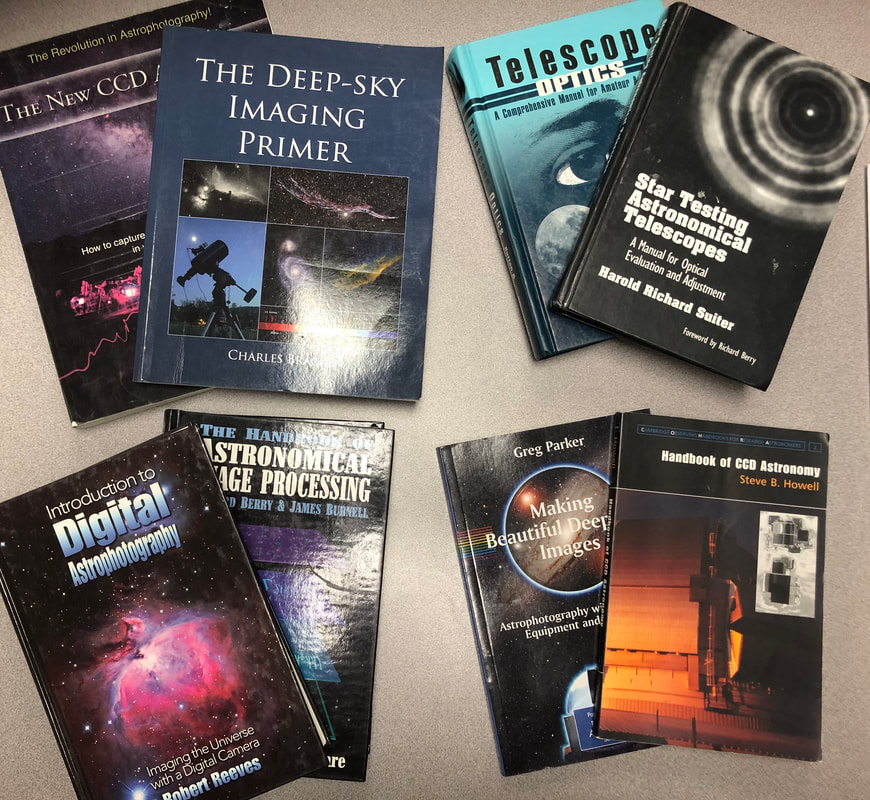

FIGURE 4 - Some of my favorite books, even ones not specifically about imaging, have significant value to the overall process to what we do as imagers. Pictured here are eight such books, also written about in the text of the article. It's not a conclusive list, as I have other favorites not pictured. But any text that makes you a better astronomer will also make you a better imager.

Comanche Springs Astronomy Campus (CSAC) is the home of over 3500 acres designated by the Three Rivers Foundation for public science education. It is home of several observatories, with classrooms and bunkhouses that can accommodate groups up to 150 or so. Owner of the largest private collection of Obsession dobs, including a 30" on campus, CSAC hosts routine astronomy and astroimaging workshops. Unique is the ability to use actual equipment from Bortle Class 2 skies WHILE learning imaging in a workshop setting. Very special and unique. See www.3rf.org for information on future opportunities.

## Sidebar: How to Learn Anything

We often begin our learning with a question, which brings about some way to test and confirm the answer.  But like the classic question of the chicken and the egg, what comes first, the question has to come from somewhere too. 

Usually, questions comes from a previous experience. 

And while it'd be nice for these experiences to come from somebody else, especially for the tough learning experiences through which life puts us, it's really not the way it works.  Most of us don't trust the experiences of others, even there's something to learn from it.  We are stubborn creatures, often needing to go through everything ourselves. 

This is why you didn't know that your father was ALWAYS right until you became a father yourself.   At some point, your experiences matched those of your father's. 

So while reading a book or watching a video can teach you something if you trust the source and are sufficiently motivated, the ideal way to learn is to jump into your own personalized and active experiences.  This prompts the right questions in the right order, applicable to where you are in your own learning journey.

As such, effective learning is a process; a cycle; a feedback loop.   A good educator knows this cycle.  There are many statements of this, but here's one popularized by David Kolb, as shown below.    

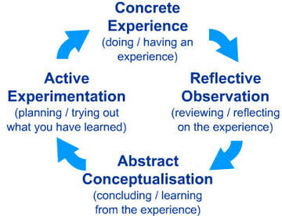

Kolb's Learning Cycle or the 4-Step Cycle.

It would be nice to always start the cycle with a question to be answered.  But in most cases, especially with beginners, the experience MUST happen first.   The more we experience, the more questions we can raise, but until this happens, learning can often become frustrating because we lack the ability to verbalize what it is that seems missing. 

In fact, for a learner of astrophotography, my recommendation is just do something...anything.  Begin with experiences, even some that do not involve the use of a camera.  Download tutorials from the Internet and put in some meaningful experience.  Play with multiple types of software.  Watch a lot of videos; compare and contrast diverging opinions on similar topics.  Just jump into the cycle and the questions will flow.

Once initiated, you will see that the learning cycle works both passively and actively.  

The passive aspect is that internalized learning will always occur even if it doesn't seem like the lessons are structured.  This gives you the comfort of knowing that nothing will be in vain; even when you didn't have a solid plan for the learning.  Likewise, you will learn to value any experience as a positive learning opportunity, even if what happens seems like a total failure.   

Most importantly, you can think of this cycle actively. Knowing ahead of time that your questions will be best answered through a planned process of research, experimentation, and evaluation.  In other words, you can successfully plan out your learning and, in a sense, become your own teacher, guiding yourself through the process like a teacher would.   Albeit, you are far more likely to ask your questions out of order this way.  
​

This is because any teacher knows the "curriculum."  They understand the structure of the learning: what should be practiced first, what is most important, and what prompts the best questions.  They also give you valuable feedback, beyond what you can gain on your own.  In other words, while you can learn anything and everything by yourself, having a teacher allows you to learn more efficiently. 
  
​Teaching (or mentoring in this hobby) is less about imparting knowledge (we do that) but more about directing students down the right path of their own discovery in a way that prioritizes the learning in more of a logical, timely and holistic way.  This gives ownership over the learning in a way that isn't found when always directed by a curriculum or some ordered instruction. 

Make no mistake about it, of all the ways and resources to learn, many of which are presented in this article, there is NO substitute for a good teacher or mentor for guidance.   A mentor will keep you going in the right direction - testing the right hypotheses, giving you a way to prioritize your learning steps, and helping to encourage you every step of the way.    Plus, the feedback gained will be much more rapid and valuable.  ​

Perhaps the most important book for hobbyists, written by expert astroimager Warren Keller, would be Inside PixInsight by Springer Press (see right).  PixInsight is the most comprehensive, powerful software package for data reduction and processing, but that power only comes after overcoming a deep learning curve.  Debates about PixInsight vs. Photoshop aside, it's hard to argue the growth in numbers among PixInsight users and I HIGHLY RECOMMEND this book to provide both Tutorial-based and Theory-based instructions within its 400 plus pages.   

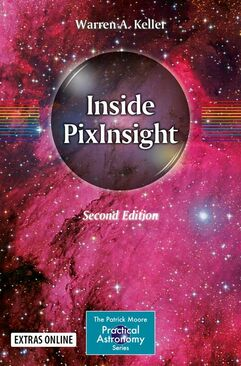

There are many other solid books, even if they are a bit dated, that you need to find, especially for those that want to dig into the theory of digital imaging.  I have used the Handbook of CCD Astronomy by Steve B. Howell for many years as support for some of my published opinions on the technical aspects of the hobby.   Richard Berry's The Handbook of Astronomical Image Processing is a deep foray into the technical side as well, albeit a little dated.  Many texts by Michael Covington belong on your bookshelf, if only to make you look like the cool kid, but in particular he has an excellent text called Digital SLR Astrophotography that is well worth your time.  

There are two classic books on astronomy optics that should be considered.   Star Testing Astronomical Telescopes by Harold Suiter and Telescope Optics by Rutten & van Venrooij will each have you understanding more about choosing proper optics, how they work with a camera, and in troubleshooting optical aberrations in your images.   

My friend, Dr. Greg Parker, wrote Making Beautiful Deep-Sky Images more than a decade ago now.  I have always appreciated the concise and straight-forward layout of the text.   Part of the Patrick Moore Practical Astronomy Series by Springer Press, Parker's book serves as an excellent survey of the hobby from equipment purchase to the published image.   A similar text, but more up-to-date, would be The Deep-Sky Imaging Primer by Charles Bracken.  The first edition digs into more of the theory-side (which I obviously enjoy), and includes some image processing workflows and understanding of PixInsight and Photoshop.   Now in its second edition, which I don't have, the book is likely improved. 

Other books I find important would include astronomy-specific (non-imaging) types of texts, which tend to never go out of date.   For example, Kepple and Sanner's ​Night Sky Observer's Guide details just about any object in the night sky within its three volumes.  And don't forget the numerous star charts, like Sky Atlas 2000, Herald-Bobroff Astroatlas, and Uranometria that can help you plan both astronomy observations and astro-images.   

As far as magazines, Astronomy and Sky & Telescope are two of the biggest reasons that many people get involved in astronomy in the first place.   They deserve a place in your monthly reading list.   Others like Amateur Astronomy Magazine and ​Astronomy Technology Today, as well as non-American publications like SkyNews and Astronomy Now, serve the same types of information.  Monthly star charts, observing list and highlights, equipment reviews, current events, and tutorials are consistent features in all of these magazines.   And if nothing else, you need to experience the joy of having an image published in at least one of those magazine's image galleries!  

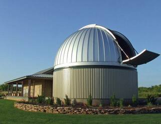

Comanche Springs Astronomy Campus (CSAC) is the home of over 3500 acres designated by the Three Rivers Foundation for public science education. It is home of several observatories, with classrooms and bunkhouses that can accommodate groups up to 150 or so. Owner of the largest private collection of Obsession dobs, including a 30" on campus, CSAC hosts routine astronomy and astroimaging workshops. Unique is the ability to use actual equipment from Bortle Class 2 skies WHILE learning imaging in a workshop setting. Very special and unique. See www.3rf.org for information on future opportunities.

### Workshops, Conventions, and Clubs

Some of the best learning happens when you attend local, regional, or national imaging workshops and conventions.   It's as close as you might get to attending an actual imaging "school."   Most such workshops will be 3 to 5 days long, with an agenda of topics each day.   Depending on the event, the presentations could be wide ranging, for beginners to experts, covering a plethora of diverse areas of interest.  This is especially true in the two major national conferences here in the states...the Astronomical Imaging Conference (AIC) held each November in San Jose, California and the NorthEast AstroImaging Conference (NEAIC) held each April in Suffern, New York.   The latter conference is a part of a larger exposition known as the NorthEast Astronomy Forum (NEAF) which is the largest collection of amateur astronomy gear you will ever see in any one place.  

At the regional level, there are a variety of choices here, which typically includes experts traveling around the country within a reasonable drive from you.   One of the most highly recommended is that of Warren Keller's (IP4AP) three day work shop for PixInsight.   Warren, author of the book recommended previously, is a terrific teacher and his 3-day introductory workshop over PixInsight is money well spent.   As you might gather, the regional workshops can be a little more focused in terms of learning content.   In Warren's workshop (which he conducts with Ron Brecher), you will receive hands-on skill-building within PixInsight.  

At the Three Rivers Foundation, we have been known to host imaging workshops around Texas, many of which probably involves this author.  Most often, these are hosted at Comanche Springs Astronomy Campus (CSAC) at left and are always very affordable, fun, day/night workshops where you get both instruction AND practice.    Based in an area of Texas known as the "big empty," it's easy to see that 3RF offers a dark sky experience that nobody else can provide.   

Finally, most large cities in the states have astronomy clubs.  These clubs usually have Special Interest Groups (or SIGS) that meet periodically to focus on specific aspects of astronomy, including astro-imaging.   For example, here in the DFW area, a member of the Texas Astronomical Society of Dallas can attend a monthly astro-imaging SIG at a local library, where there are presentations, processing demonstrations/practice, and open question times.  Being in the club also keeps you connected with events that you might not have known about otherwise.  You should also remember that anything you do in astronomy can benefit your imaging as well, so be sure to plug into the club as an amateur observer too.  

But I think, most importantly, workshops and astronomy clubs offer an opportunity to socially network (non-virtually) with other like minded, motivated astrophotographers and astronomers. These relationships can form the basis for future partnerships, mentorships, and other opportunities you would never have if you remained invisible.  At some point, such contacts can lead to your own chance to speak at conventions, make money from the hobby, and even rub elbows with some of your astro-imaging heroes.    

### Online Forums/Social Media

## Conversation Heard Frequently at All Internet Forums...

​Newbie: "Could somebody tell me the best way to do ________."

Mr. 5-Star Poster: "Did you use our search bar before you asked that question?"  

Newbie: "Uh, no...I kinda hoped somebody would just answer my question without me needing to take 2 hours of time to read through a 150 page thread.  But thanks anyway." 

One of the very best parts of the early internet was the concept of a "bulletin board" or "user group."  The first true social media, people could gather virtually to ask questions and discuss a variety of aspects of over the hobby or hobbies.    Today, remnants of many still exist, such as the Yahoo Groups, which still serves as an excellent place to get user support over a variety of legacy (and current) equipment makes. 

Once the "web" fully developed, internet "forums" began to take over, yielding a better user experience and interface, with features often including chat and private messaging, and greater participation.   Cloudy Nights is likely the best known of these running today, but there are several others like Ice in Space and Astromart that provide similar online communities.   As with any community, it's a good chance ask a question, which inevitably yields no end to responses, ranging from the ridiculous to the extremely helpful.  More than that, it gives you the chance to search through archives of previous "threads," to see your question has already been answered.  Or, it gives you the chance to post an image to get feedback.    

The biggest issue I have with internet forums is the extreme noise level, where you will have to filter through the blow-hards and phonies and egos, as well as dealing with the inevitable "Mr.-Did-You-Search-First-Before-Asking-Us Guy."   I always found it amusing the number of people on Cloudy Nights who are members of the "community," yet aren't willing to give personalized and customized help for those in need.   

The other alternative to the community forum is via Facebook or Facebook-related groups.   Personally, I've enjoyed accepting friend requests from thousands of astronomers and astrophotographers, and then watching them post images, opinions, and questions that pop up in my "news feed."  As with any social media, the noise level can be extremely high when dealing with those opining about politics and religion, but a well administrated, astronomy-specific Facebook group can be a joy to use.   Just watch out for NASA-bashers and flat-earth conspiracists!

### Data Repositories 

You can learn to process astronomical images without taking a single image yourself.   This is possible because many people upload their own raw data (or master frames) to the Internet for ANYBODY to play with.   Unbelievably, you can even download Hubble Space Telescope data to practice on. Googling "HST public data" or "Hubble Legacy Archive" will get you started.   Digitized Sky Survey (DSS) data?   Yes, that too.   Even data from the James Webb Telescope can be downloaded and processed.   The Space Telescope Institute provides such access to an enormous amount of real telescope data.  

One of my favorite amateur repositories has been provided by Jim Misti, who uploaded FITS data from a 32" Ritchey-Chrietien scope, as well as 4" apochromatic refractor data.  He even uploads your processed results to a page where you can compare it against others who did the same object.   It's amazing to see the differences in results among participants, even among some really talented amateur astrophotographers.  

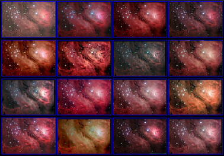

If you want to process some data online, head over to Jim Misti's FITS site. Here are the results of his M8 data processed by 16 distinct hobbyists. It's nice to be able to process the data yourself and see how YOU compare!

Somewhat conversely, it's good to make use of those around us to process our data for us, if only to compare their results with our own.  It's an excellent way to understand what is the limiting factor in your images...is it your processing...or is it just the data?   Getting buddy-buddy with some experienced and proven astronomy "forum-ites" or making a Facebook request is a good way to find people willing to do it; many of them are probably looking for something to do anyway since they just bought new equipment and will be socked in by clouds.  It's called the "equipment curse" and you should definitely take advantage of other people's misfortunes.      

### Mentors/Consultants

I have stressed the importance of mentoring when it comes to accelerating the learning curve in the hobby.   Traditionally, those who are learning the hobby would bounce questions and ideas off of each other, usually online, in an attempt to improve together.  But at this point in time, there are many people who have made themselves available as private teachers to serve your needs.  Some advertise these services online via their webpages or will let you know they provide such services at various workshops, conventions, or meetings where you might encounter them at a vendor's table.   

Many such mentors will offer those services as part of a packaged online course or other paid content.   I have some recommendations for that in the following section.

As such, I would not recommend any individual consultants as I cannot vouch for their services.   But a keen ear will let you know when others have been satisfied by the help of such providers.  Your mileage may vary, but be sure to ascertain their credentials through known projects and/or results.  

Others, like myself, will often consider providing such services when contacted, even though I don't expressly state that I sometimes work as a consultant.  However, my visibility and my experience makes it possible for people ask for my help to construct their observatories or provide them a guided "course" for improving as an imager - and as a professional teacher, I have summer-time off to do that. 

But I make this latter point for a single reason...you never know when people might be willing to help you out if you promise to throw a few bucks their way.  Offering an experienced imager/teacher a C-note to go out with you on an imaging night might be the very best money you will spend in this hobby.   

​I will often make myself available for email questions and assistance just because, by nature, I like to help.   And if you want to give me something for such services, beer doesn't hurt.    Just make sure you are gracious - don't take advantage of others and be willing to provide some compensation for those who are saving you tons of time and money with their advice.   

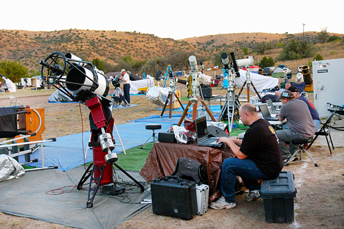

Getting setup for a major star party in anticipation for great skies with a bunch of fellow imagers and astronomers is something everybody should experience. Shown here, I've brought out the big guns for the 2005 Texas Star Party. - Image credit Phil Jones

### Star Parties

Some of the greatest advancements in my own learning came from attending major star "parties."   These week long affairs are typically well hosted in very dark skies, accommodating hundreds of fellow amateur astronomers and imagers alike.   Not only can you setup scopes alongside other well schooled amateur astronomers, but the days will typically be filled with informative presentations and learning events.   Moreover, and most importantly, you have the opportunity to network and form relationships with others who might serve as mentors, partners, and friends.  

The major star parties that I've frequented in the past include the Texas Star Party (TSP) held in the spring, the Rocky Mountain Star Stare (RMSS) held in the summer, and both the Eldorado Star Party (ESP) and the Okie-Tex Star Party held in the fall months.    But these are basically the major star parties closest to me...there are several I haven't had the pleasure of attending.  These, which come widely recommended by most amateurs, include the Winter Star Party (WSP) in the Florida keys, the Nebraska Star Party, the Grand Canyon Star Party, and the Cherry Springs Star Party in Pennsylvania.   

For those wanting a once-in-a-lifetime star party experience, then look no further to the Oz-Sky Star Safari.  As you might have guessed, this is in Australia, near Coonabarabran.   Hosted by 3RF during our spring months (which is the Fall in Australia), you don't even need to bring a telescope with you as many large Obsession dobs are provided.  For imagers, bring your small, travel setups.    Previously known as the "Deepest South Texas Star Safari" due to most attendees coming from Texas (where 3RF is based), they now take reservations for up to 30 people.  And if you can't attend this one, then you might want to catch their other star party, the OzSky Southern Spring Star Safari (during our Fall season). 

Either way, the total cost for the Australia events, when you include airfare, will be in the $2200 to $2500 range (by my estimates), not including spending cash.   And while this sounds like a crazy amount of money, it's really not when you consider that the mount, scope, and camera that you own probably costs much more than that... EACH!    

In addition to the major star parties, astronomers should not forget that the local astronomy clubs found in most of the larger urban areas likely host single-night star parties as well.   Many of these will be spread out within parts of the city, held monthly.   While these are largely considered "side-walk astronomy" events, it's not a bad place to connect with others and learn a thing or two about astronomy, especially for those who are just beginning and who want to know more about equipment choices.   Also, aside from the learning you naturally receive by being in the club, most of these societies will have a club dark sky site, where you will have fully access privileges, such as using club telescopes.  While you might not need this from an education standpoint, most clubs will still coordinate events at their site, which become more like a shorter "major" star party. 

### Courses, Paid Content, and Observing Programs

"Astrophotography 101" is not typically a course you will find in a college or university.   However, we are seeing more and more institutions understanding the importance of CCD imaging to overall astronomical science since all forms of data collection begin with a camera - and it's not within the realm of possibility that you might find the occasional local offering in astrophotography, especially at the junior college level.  

But to fill the gaps, many well-known astrophotographers and teachers have provided online classes for a more formal method of study.  Typically, the courses are subscription-based.   What follows is a list of various content that I can recommend, but it should not be considered exhaustive by any stretch...

IP4AP (Image Processing for Astrophotography) - This is Warren Keller's site where he has centralized all his workshop information, consulting, and book information.  But more importantly, he provides online subscription-based courses in image processing via this website.  Read his book, take some courses online, and then hire him to mentor you.   

Adam Block - One of the best imagers in the world, Adam has provided telescope hosting/teaching and paid online content for nearly two decades now.  He has unified his online teaching at his Adam Block Studios page.   This online content focuses almost entirely on image processing.   

Skillshare - This is an new online learning community where content providers give either free or premium courses in a variety of skills and hobbies.  For an subscription price of around $10 per month, you can have access to 2000+ free courses in all areas, including Ian Norman's large classes covering Nightscape Photography and Time-lapses.    Premium content, of which I'm not familiar, costs extra on a per class basis.   While there is not a lot astrophotography content at Skillshare, it's growing by leaps and bounds and is worth keeping an eye on. 

Also chief among paid educational opportunities are observing programs, which may or may not include imaging opportunities.   Below I have listed three programs that I can personally recommend: 

Mt. Lemmon Sky Center - In addition to his online content mentioned above, Adam Block is best known for his imaging and observing program at the Mt. Lemmon Sky Center.   Here you can learn how to acquire data using large 32" and 24" telescopes.  Adam is always there to instruct you every step of the way and the learning you can get from him over a couple of nights is worth more than your apochromatic refractor.  

Kitt Peak National Observatory Visitor Center - KPNO offers its Nighttime Observing Program and guided teaching through its Visitor's Center.  I enjoyed a couple of nights here in 2005 when Adam Block was at the helm, but the program still persists.

Three Rivers Foundation (3RF) - For those seeking free opportunities in the Texas area, there are regular (typically monthly) public events at 3RF's Comanche Springs Astronomy Campus (CSAC) near Crowell, Texas.   For those who serve as volunteers to the general public - who come to look through the scopes for an "experience" - once they leave, you have the Bortle 2 class skies to yourself using the same amazing telescopes.  Or, come early the night before and get a head-start!   Want to use a 30" Obsession for two straight nights?   No problem.   How about touring the sky on the 15" D&G refractor?  Yep, you can get the best view of globular clusters imaginable.   The 30' Ashdome pictured above houses this 19' long instrument.   For imagers, you can bring your own setup to show off for the public or you can enjoy exploring the new Conley Observatory, housing 12.5" RCOS and 14" Celestron SCT imaging setups.   If you are in the north or central Texas area, you really have no excuse NOT to be involved with the 3RF program. ​

## Qualities of Good Practice That Aids Learning
​
Once you've perused and studied many of the above resources, a thousand questions are raised.  This is because astrophotography is an action word and we really haven't discussed what this looks like in practice.  

What do I need to address while using my equipment and what practices can I employ to keep it running at peak efficiency?  

Assuming we already have good data to process, how can I improve my processing skills to assure that everything turns into a meaningful image? 

I have a thorough article, called Best Data Acquisition Practices, that addresses many of these questions from the standpoint of collecting image data.  But this has less to do with a program of learning astrophotography and more to do with simply producing good images.  While these are not mutually exclusive ideas, neither are they synonymous.   As such, it's important to understand that learning HOW to image can be completely independent on getting a good image itself.   So, really, short of an actual astroimaging curriculum, we need some ways to get better at imaging, some practices designed to make us better astrophotographers...and if that helps us take consistently good images, then so be it! 

From data acquisition, through image processing, and all the way until an image is published, it'd be rather exhaustive discussing all the ways that we can practice for success.   While I'll use some specific examples of good practice here, I'd like to discuss FOUR important guiding principles that I believe become fundamental to ALL such practices, and thus to the successful learning of astrophotography.​​

### Be Systematic About Your Approach...

Very few people are ever successful without a plan.   Doing research in advance of the evening about the objects you want to shoot, the best equipment to use to shoot it, and a timeline (workflow) for how it should play out is important to success.   

As a teacher, I have to use a lesson plan, which serves two purposes:  1.) It guides me what to do on a given lesson, and 2.) It assures me that my lesson fits well into the overall unit of study.    As an imager, having a plan for the evening is logical, but what might not be logical is how your nightly plan fits into your entire process of learning.   

One aspect of this second point becomes obvious.   Because many of the objects we shoot might require multiple nights to shoot them, especially if it's a mosaic, then you need a broad plan for how that will work.   This means planning around the moon phases, knowing when to shoot luminance data versus your color data, and having options for when weather or seeing messes up your plans.    But that's less practicing a skill as much as it is simple logistics.

A better example would be when I was learning collimation.  This was a skill that required some effort to learn.  I would conscientiously practice it over several nights, knowing that if I worked at it diligently, it would start to make sense to me.  I would intentionally take the scope WAY out of collimation on purpose, just so I could witness how bad it could be.  After a while, it became second nature.  I learned to recognize poorly collimated optics just by how a star looked through an eyepiece or on my computer screen.

For you, perhaps it's weak focusing skills.  While the temptation is strong to ignore this fact and just start working on your data collection, spending your time focusing WELL and OFTEN will yield a much better image, even if it means less total time in your "stack."   Less great data is always better than a bunch of awful data when it comes to image quality.  I refer you back to Figure 3 for a practical example of what I'm talking about.   Of course, the time spent in really nailing down your focusing will eventually translate to all of your images.   It's what I call "purposeful practice," even if it pays immediate dividends on tonight's image.  

This sense of purpose isn't specific to those doing long, guided exposures either.   Even something as "simple" as a untracked DSLR shot of the Milky Way can benefit from experimentation and practice.   I always find achieving good focus with camera lenses to be a real SKILL, so I really concentrate on getting that correct every night out.   I also take practice shots, zooming in to see what the stars look like, especially in the corners.  This reveals not only the focus, but also the quality of the lens being used AND whether it can be improved by stopping down the lens.   For many of my DSLR lenses, while shooting fully open at f/2.8 is appealing, f/4 normally returns better star shapes.  

Planetary imagers know that acclimatizing the scope as early as possible and cooling down the environment near the scope are critical to the success of such high-resolution images.  While focusing is always important, controlling the environment (which many have no idea is even possible) requires foresight and proper planning.   

And these examples are what I mean about being systematic...understand that there are overall skills to improve, focus on those skills each night until they are mastered, and trust that your images will be better for having done so.   

As an astronomer, you might have an astronomy objective as well, so that should be built into your plan for the evening.  For me, it typically means getting my head out of the PC long enough to get a visual on what is going on in the sky.  I don't want to ever lose the sky-familiarity that took me so long to learn prior to becoming an imager, so it remains a high priority focus for me.  

Good practices should also take place when processing images, or working on equipment, or when reading about the hobby as well.  Having a set of goals when in those settings will be greatly beneficial.   While following a tutorial (or somebody else's workflow) to process your data set can help you produce an image, the most improvements for the long-term will come when spending some extra time experimenting with the settings in a PixInsight process, or playing more with Photoshop Curves, or making several images using different types of noise reduction.  

### Never Let a Night Be Wasted...

​In light of the above, you have to change your view of what "success" looks like.   When I first started, I felt like an abject failure if my image data didn't meet my expectations in a way that would turn into a final image.   If I didn't execute, I got pretty hard on myself.   To make matters worse, at least half the time I would be disappointed that the imaging gods didn't find it sufficient to give me good skies for my efforts. 

In a hobby where most everything is going to work against producing a good image, you will want to QUIT the hobby if you define success solely on getting good images.  Because of this, you need to realize that learning something positive about the hobby can happen on ANY night.   If you really care about getting BETTER at this stuff, then try some of the things I've listed in Sidebar:  What to Do During "Wasted" Nights? ​at right. 

For example, when a telescope breaks down, it doesn't have to be an end to your night.   Successful imagers are typically also mechanical engineers, not by choice but by necessity, and that's an aspect of your education you better embrace.   My friend, Jason Ware is fond of saying that star parties are made for working on equipment - and I don't disagree!

Or if you haven't had clear skies in what seems like a decade, there are still lots of ways you can practice getting better during the down time.   Processing online data or reprocessing your old data or rebuilding your webpage presentations makes for good learning opportunities.   

It's often said in this hobby that cloudy nights are for taking "dark frames."  In other words, there's always something to do even if the skies don't cooperate. 

In fact, when you think about it...how good are you really getting when everything is going perfect on a given night?   

​Are you really learning what getting good focus means if you only ever rely upon a robotic focuser?  If you use a GOTO mount or planetarium software every time you image, then will you be able to properly frame a wide-field DSLR shot on a tripod? In a way, becoming better requires a concerted effort, an interaction with the process even IF all your imaging processes are automated. 

​Simply put, a great image doesn't means you've learned. 

So when the clouds prevent you from getting good data, be sure to have a Plan B to get the most from your night.   This redeems every cloudy evening as a productive night. 

## Sidebar: What to Do During "Wasted" Nights

Clouds are inevitable.  But let's assume you forgot all about that prior to setting up all your imaging gear!   While you might not be able to get a good image on this cloudy night, dad-gum-it, you still wanna do something productive!

So here, before you tear-down all that gear, let's think of some ways that you can make good use of that time to get better at this whole astro-imaging thing!   

- **Become an Observer** - Unless it's totally cloudy, there's likely some "sucker" holes up there.  While you really can't work on an image, you can still point between the clouds and do some observing.   Point to those objects you wouldn't ordinarily image and see what they look like.   Revisit some old objects, if only to remind yourself how awesome the night sky is!
- **Work on your equipment** - It's a good time to re-grease the gears on your mount.  Work in the new grease by doing slews across the sky.  You can also clean your optics.  Or how about troubleshooting that differential flexure that's been popping up in the images?   Perhaps you have a new piggyback rig or dual-side plate to assemble and test out?  
- **Practice focusing** - It's the single most important skill to taking good images and there's probably a star up there somewhere.  Practice focusing now.  Try out that new focusing mask.  Experiment with some new software metrics.  Get your focus frames running and measure the amount of focus shift you are getting as the temperature drops.  
- **Practice collimating** - Put on "Bob's Knobs" and start tweaking!  Intentionally take the scope out of collimation and look what it looks like when focused.   Try out a new method, or a new laser collimator.   Anything that has to do with optics typically scares amateurs, especially collimation, so now's the time to get good at it!  
- **Do a polar-alignment or pointing model** - In an observatory setting, it might be time to recheck that polar-alignment or add "terms" to your pointing model.  If you have portable setup, yet can still see Polaris or your alignment stars, practice your alignment with a polar scope.   Try a new technique, like "iterative" polar aligning.  Try a software alignment solution.  Learn to do it with your neighbor on a different mount. 
- **Refine your focusing V-curves** - Those who use robotic focusers will be familiar with the concept of the "V-Curve."  Point it between the clouds and put that focuser to work.  Or, just spend some time working with better setting to produce a better curve.  Maybe figure out how the temperature-compensation feature works?   
- **Get a good PEC curve** - I'm amazed at how many people have mounts with the ability to upload a periodic error correction (PEC) curve, yet they don't have a clue how it works.  This is your chance to improve your mount's performance, in many cases greatly.   I've taken a scope (LX200 Classic) with 70 arcsecs of periodic error to under 5 arcsecs.   Mounts that you didn't think could be used for imaging can become very capable with a good PEMPro run.  Already great mounts can be refined to the point where auto-guiding is no longer necessary.   
- **Reroute or secure cabling** - I've never been one to completely figure out the best way to run cables with my portable rigs.  But tonight might be a good chance to experiment with new cabling techniques, USB hubs, power supplies or even DC power rails (my favorite is the Rigrunner pictured below).

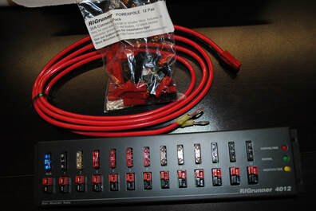

- **Test out new gear** -  You are going to get bad weather after buying a new scope.   It's a given.  But new equipment needs to be figured out and ANY opportunity is usually coveted.  Figure out how everything's mounted and make sure you have all the right hardware.  Re-organize your equipment boxes to make sure they are tidy.  
- **Take some calibration frames** - Dark frames, bias frames, and flat fields do not require clear skies.  Shoot them.  Organize your files on the PC.  Test a new way of taking flats. 
- **Test out your observatory systems** - For those blessed to have permanent setups, there are support systems integral to your pier instrumentation.  Weather systems need proper shake-down.  All-Sky cameras need cleaning.  Roll-offs need lubrication.  Park sensors require troubleshooting when there's dew on them.  Use the time to test your cloud-monitors and programmed "interrupts" to make sure the observatory does indeed shutdown when the wind gets to 30 mph.
- **Play with your planetarium software** - I use TheSkyX and there are features I've never really touched.  Now is the time to figure it out. 
- **Learn new scripting software** - With the shift toward technology, many of us don't even need to be awake to take imaging data.  But with any scripting solution, you will need time to figure it out and troubleshoot it.  
- **Have fun with a DSLR** - Most astrophotography setups need cloudless nights to produce images of objects, but not so with a DSLR and a tripod. The same techniques can capture any night-time, long-exposure image.  Fireworks are awesome targets, as are car lights on a dark highway.  Shooting the weather, especially lightning, is a favorite pastime for rained-out astrophotographers.  Practice getting a time-lapse of ​

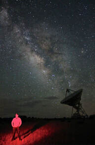

some clouds rolling past the Milky Way through the evening or make it track on the radiant of a meteor shower. Paint yourself amidst a Milky Way backdrop for the ultimate "selfie"  see left.   For more tips on shooting the weather, see my article  "Astronomy and the Weather."

### Don't Be Merely an Imager...

​The night sky is a marvel.   It's mysterious, grand, seemingly infinite, and awe-inspiring.   It's worth knowing, understanding, and preserving.    As a guy who loves the entire process of gettng a great astrophoto, my involvement with the sky didn't start that way.   I wanted to see the cosmos with my own eyes long before I hooked up a camera.   I wanted to expand my knowledge beyond the simple world around me.   I wanted to familiarize myself with the celestial sphere and appreciate the beauty of what I was seeing.   Learning all I could about astronomy was a priority for me.  

With the rise in telescope "tech," especially when driven by planetarium software as part of an imaging rig, many imagers never really see the need to learn the night sky.  They just ready...aim...and fire!  But what many might not understand is the advantages that you will have as an imager IF you have some sky knowledge.  

Let's look at some of these advantages now.
​

### Limiting Magnitude

You might notice that many imagers classify the darkness of their skies when they post images online.   Some will mention lunar phase or the Bortle rating for their location at the time of the image. Others will go all out and purchase a sky quality meter (SQM) which gives actual sky darkness in magnitude/square-arc-second.  Many others will rate the darkness of their sky using some other scale.  

I typically like to judge transparency (darkness) according to the limiting magnitude of the stars that I see.   Depending on the time of year, I will generally look at near zenithal objects of which I know the magnitude of their component stars and then make note of those I can see when my eyes are dark adapted.   See FIGURE 4 below. 

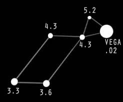

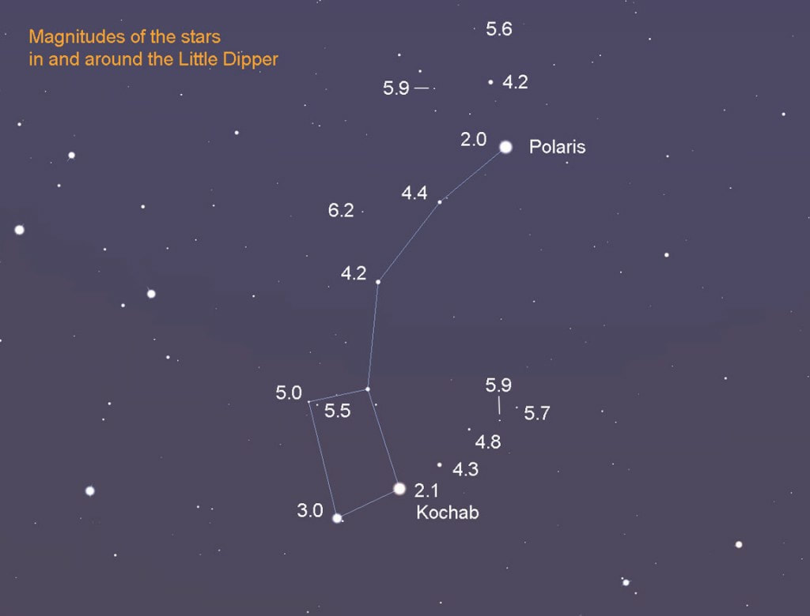

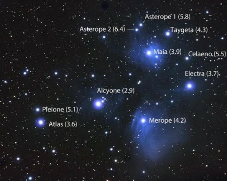

FIGURE 4 - These are some of the star fields that I have memorized, which include the regions of the Lyra, the Little Dipper, and the Pleiades.   I typically use this information to compare with my own skies on a given night.  This gives me a general guideline for knowing how transparent my skies are.   I'm typically not all that precise with it (no need to be).  But it does give me a quick way of relating one night to the next while imaging.   Click on each to see the full image.

Being able to judge the darkness of the sky visually might seem to be frivolous, but it's worth monitoring when you begin planning observations.   As such, you can plan around lunar phases, you can make filter choices to either work-around or combat light pollution, and you will have a way to compare data quality when taking a particular data set over sequential nights.  

### Atmospheric Seeing

As a visual astronomer, I learned to appreciate good atmospheric seeing when I saw it.   When you start looking at the seeing threshold for a given eyepiece in terms of steadiness of the view, a veteran observer will know which eyepieces in their collection will likely give the better views for any given night.   Most of us recognize this when we put in TOO powerful of an eyepiece, which prompts us to back-down on the EP focal length until the views are better.    But many of us can simply look UP and be able to gain some understanding of what the seeing SHOULD be like just by looking at the scintillation of the stars.   

Imagers can do something similar if they are imaging at higher rates of "sampling."   In other words, those who are used to adjusting focus on screen with long focal length instruments like RCs and SCTs will have a pretty good understanding of how bad seeing can wreck an image, either by watching a guide-star go crazy during a focusing run or by watching the autoguider jump all over the place.   But those who only ever image with a wide-field refractor or with camera lenses may never understand how crazy the sky can be.    For those people, doing some visual astronomy on occasion can be fruitful, allowing you to gain a perspective of the atmosphere that you wouldn't otherwise get if you only did imaging every night.  

While this "skill" might not seem very helpful, consider the following scenarios...

Those who like to be portable with their imaging setups have likely learned NOT to make assumptions when it comes to seeing.  For example, after years of figuring it out, I've learned that it's pretty pointless for me to take my big (long) telescopes to the Texas Star Party.   This comes from many years of using bigger instruments visually, realizing that I can seldom push larger magnifications through the eyepiece.   This is because, as much as we hate to admit it, although the skies at Prude Ranch are dark, they simply do not offer good astronomical seeing.   For that, you'd need to drive up the mountain a little bit to get above the inversion layer.    

For planetary imaging, where the setup is critical from the standpoint of stability, being on (or next to) a cement pad can be a killer to your images.  Being next to a body of water can improve your situation.  Having another visual scope with you BEFORE you set up your imaging rig is a good way to figure out exactly where you need to be.   

There have been times when the Clear Sky Clock told me to expect bad seeing only to have steady views while observing, so another telescope is a good tool to verify or contradict information you already have.   Likewise, I cannot tell you how many times I've had poor seeing with the camera, only to use another scope visually and notice the seeing is actually quite good.   As such, you then realize that your imaging setup likely isn't acclimatized to the ambient air temperature yet, or you forgot to turn on your cooling fans, or you need to turn on a box fans to push stagnant air away from the scope.   

Many people only setup one telescope with one camera.  But having a visual setup, or even binoculars, in addition to your imaging rig can provide a proper perspective of what the atmosphere is like.   Besides, what else are you planning to do when the exposure is running?   Unless you just plan on sleeping the night way while the image rolls on, why not practice on your astronomy?

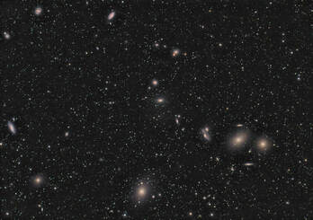

FIGURE 5 - Markarian's Chain of Galaxies in Virgo - Images like this are mind-blowing, but only if you know WHAT you are seeing. Being able to explain what people are seeing here is much more important than just posting the image on Facebook.

### Being Able to Talk About My Images

​A photographer really doesn't need to know much about what they shoot.   And really, with astrophotography, you can be happy posting an image to your Facebook page and saying, "Hey, everybody, look what I did!"   

But really, unlike regular photography, an astro-image might not be interesting or artistic enough to stand on its own.   For example, as cool as the image in FIGURE 5 is, it's really not all that artistically striking, if we are to be honest.   But an astronomer will be able to communicate how amazing the image truly is, whether it's due to the incredible number of galaxies that show up in the image, or because we recently (April 2019) saw an image of M87's black hole, which is merely one of the over 200 galaxies visible here. 

​Other than the challenge that astrophotography represents to photographers, I am hopeful that you were also inspired by what's "up there" as well.  Because truly, the amazing thing about what we do is less about taking great images, but rather that we CAN take pictures of objects whose photons left their galaxies more than a million years ago.   

The universe doesn't revolve around you, "Mr. Fancy Photographer."   So try to remember that you aren't anywhere CLOSE to being as awesome as the expansive cosmos you are capturing!  

### Knowing Which Objects to Shoot and When

As a corollary to the previous point, it stands to reason that knowledge of the sky can help you choose which objects to capture.   In my article called "Developing a Plan for Our Images," I talked about thinking of astrophotography as shooting "subjects," in much the same way we do any other type of photography.  This allows us to think more artistically about our images, rather than acting like we are skeet shooting sporting clays.   And certainly, in that article, I talked a lot about the typical photographic subjects that are worth your time from the standpoint of being "artistic."  

But much of being an astronomer is very much "object-oriented."   We learn about objects that are visual treats.  We go after Astronomical League observing lists, in hopes of completing them for certificates of accomplishment.   We categorize our images by object type, whether it be galaxies or emission nebulae or globulars or planetaries.    As such, the astronomer always has something to shoot, just like we always have something to view through our eyepieces.    And this is just fine...if you know something is there and are curious about what it looks like with your camera, then give it try!

But there are two aspects to having a real advantage as an astronomer here.  

First, you will know how certain objects might look from the standpoint of "angle of view" within the image, as being defined as the amount of space any given object takes up on the sensor (in arc measure).   As an astronomer, we easily learn the angular size of most of the things we observe.  For example,  the galaxies listed as Messier's are typically 12 arc minutes or bigger.   A few of them extend to around 30 arc minutes or 1/2 degree (which approximates the angular size of the full moon).   One of them (M31), is over 3 arc degrees in size.    But how about the other one-zillion galaxies up there?   Well, the vast majority of those we deem worthy of imaging will be between 5 to 10 arc minutes.   Put into perspective, they all begin to look like the galaxies in FIGURE 5 above.   In fact, the largest of those galaxies in that image (from our perspective), the lenticular galaxy M86, is not even 9 arc minutes in size.  What this means is that if you like to image galaxies, you better consider working up to some longer focal length instruments if you hope to catch good detail in many of them.  

Or perhaps you realize that if the Pleiades (M45) looks the best through large binoculars, then perhaps you will realize that it will be a good candidate for imaging with your wide-field refractor, especially if you are familiar with the dust in the surrounding reflection nebula (or "galactic cirrus") and know that you might even be able to piece together a mosaic of the entire field.  

Second, you will know the best times to shoot any given object.   While we have software available to us to help us plan our images, including large, multi-frame mosaics, an astronomer has the advantage of needing nothing to plan his or her nightly agenda.   For example, the northern hemisphere imager may have learned that spring-time is typically about galaxies and globular clusters in any around Virgo and Leo.   Summertime will be all about the Milky Way.   Winter is all about Orion the Hunter, his hunting companion, and his adversary.   The Fall will be Andromeda's time to shine, including her mate, Perseus, and their magical winged horse, Pegasus.   

These become quickly obvious to most imagers, but astronomers learn pretty quickly when other objects are available as well.   For example, in the spring months you know objects such as M13 in Hercules and M81/82 in Ursa Major will be taking up a large part of your evening agenda.   But you also will know that around 3AM becomes time for some Milky Way targets and you might get some nice glimpses of M13 and M31 if you persist until the dawn hours.   It also allows you to take images of objects when it makes the most sense to capture them.   Something like the Constellation of Cepheus will be visible for most of the night during the fall months, but an astronomer knows that something like the Iris Nebula (NGC 7023) will likely not be worth attempting beyond 3AM...and if it is, you'll definitely want to be shooting red filtered images (as opposed to blue or luminance with an astro-camera).   This knowledge gives you the ability to plan for an entire night, optimizing the quality of the captured data at all times, especially if you plan on nursing your images all the way from dusk to dawn. 

More than that, I cannot tell you how many of my imaging compatriots and astronomy friends pointed in the sky to ask ME what the object was that they knew was "somewhere over there."   It's nice to be able to tell them the object by name so that they can search it within their planetarium software.

### Being Able to "Point and Shoot"

One of the things I've enjoyed recently as an imager is going back to the basics.   While I've been using big-boy tools for literally decades now, like 2857mm scopes on mounts that really need to be polar-aligned using T-Point modeling runs - which also assures accurate pointing within TheSkyX planetarium software - at some point it's nice to get portable, roll out your equipment in a new place, and be imaging long exposure DSOs within 15 minutes of pulling up the car.  

Consider using a DSLR with a small apochromatic refractor on a German Equatorial mount WITHOUT a computer.   At that point, you just need a mount that can be quickly and accurately polar-aligned and enough knowledge of the sky to know where to point your telescope. 

See FIGURE 6 below for 5 images taken over two nights in June 2018.  These are examples of what can be attained by not only understanding the capabilities of the equipment, but also by simply knowing where to point a telescope "the old fashioned way."    The best part about these images is that I didn't have to oversee any aspect of the data collection.   Once framed and focused, I just programmed the camera with an intervalometer and fired the sequence.    In the meantime, I was teaching a group of students using the big-boy equipment in the observatory next to me.  ​

For more about what you need to take your own easy images, take a look at Sidebar: The "Point and Shoot" DSO setup.  

The take-away point here is that you need to know the sky if you want to use a manual, "non-GOTO" imaging rig like the setup mentioned above.  I can point straight to the objects in each of the above images.  No computer needed, unless I want one.  No finding a guide-star, unless I want to. 

After a while, you could do the same.  

## Sidebar: The "Point and Shoot" DSO Setup

A lot of assumptions are made about long-exposure DSO imaging.  The worse of these assumptions is that everybody needs a "guiding solution."   Nothing could be further from the truth.   In fact, people who are imaging at short focal lengths (which is most imagers) with good quality mounts might not need to auto-guide their images at all.  

Unguided long-exposure images are possible if all three conditions are true:  

First, the mount is polar-aligned so that drift is undetectable at your image scale over the length of the image.  One of the first important steps to learning to image with an EQ mount is making certain that the polar alignment is great.  This can be difficult to know for the beginning imager when other mount errors are confused for the drift that a bad alignment causes; however, many mounts come with really good polar alignment routines, and those that don't can be aligned well using software (like PEMPro or T-Point) or a hardware solution such as a QHY "Polemaster."

Second, the exposure lengths are somewhat "short."   Most amateurs begin to look at guiding solutions early on because they have the need for exposures greater than 5 minutes or so. They know that coaxing that kind of performance from their mount, regardless of the focal length of the instrument, can be a tall order.  But with today's "fast" optics, individual sub-exposure times can be much shorter than in the past.   Celestron RASA and Hyperstar optics, camera lenses, and fast apochromatic refractors can mean that exposures of 1 or 2 minutes might be all you need. 

This becomes especially true when using smaller pixel cameras with lower full-well capacities. Such pixels have much less room to hold photons in the first place.  Most people likely do not realize that many mounts can be made to perform well at such short exposure times, especially when you consider that it represents only a portion of the periodic error curve (duration of the worm gear) on many mounts.   

When evaluating the total length of sub-exposures in such systems, it really depends on the system.   For CCD astro cameras, the ideal situation is to image long enough where camera read noise is swamped by the shot noise of the background light, known as "sky-limited" or "read-noise limiting" imaging.  This is useful because the larger pixels allow for longer exposures without over-saturating the stars.   But other cameras, like small pixel CMOS astro imagers and DSLRs likely will have exposures maxed out by the star colors themselves, which ceases to exist when the pixels begin to completely fill up with photons.   As a rule of thumb, DSLR users can use the on-camera LCD histogram to keep the hill no more than half way up the graph.  

Third, and most importantly, you can likely image unguided if the total error of the mount vs. the image scale of the setup meets your level of tolerance.   If you look at your image after 1 minute and everything looks great, then congratulations, you can image unguided for 1 minute!   Same for 2...then 3...or 5.  Be aware that somebody who or more mathematically inclined will base the threshold on making sure that the mount's total amount of error does not exceed the imaging scale of the setup.  But I find this unreasonably stingy.  Even if the occasional mount error spills photons into other pixels, it will likely do it only at a fraction of the time, only into the adjacent pixels, all within an image where you can't perceive the pixels anyway!   

At such, the mount errors induced to the image over that short time (likely a fraction of the total peak-to-peak error) are very much concealed by either the small resolution of the image scale itself or in some cases seem to be contained within the quality of the "seeing."  How you judge the effectiveness of this depends on your idea of "small stars" or good image detail.   As such, don't be so picky.   When the stars are so small as to be insignificant in an image, which is true with images at short focal lengths under 500mm or so, then at little star elongation (which your optics will induce in the corners anyway) hardly matters when capturing wide field astro images.  
​

From an equipment standpoint, you'll need to use a capable mount in which you are very familiar.   Most of a mount's periodic error can be corrected down to levels within the threshold we are looking for.  However, many such mounts might also have some random errors that will jump stars across a few pixels before you know it.   As such, PEC is pretty uneffective.  Quality is the first order of importance if you desire to push the focal and exposure lengths somewhat. 

I love Takahashi mounts, as they have to be the best mounts in the world for portable imaging.   Don't get me wrong, they are big and sturdy for their given payload capacities and they won't save your back like an Astro-Physics mount that breaks down into two parts.   But "Tak" mounts setup on simple wood tripods with bicycle "skewer" clamps to lock them down and they have the very best through-axis polar alignment scope in the business, assuring FAST alignment.   Properly and precisely setup, which isn't hard to do, a Tak mount like the NJP shown in Figure 7 can be sighted-in to within 2 arc seconds of the celestial pole. 

And because of the mount's low periodic error (typically around 6 to 8 arc seconds peak-to-peak for the NJP), "autoguiding" is optional at the types of focal lengths we are talking about.  With small scopes, like the 450mm focal length FSQ-85ED used in the FIGURE 6 images, two minute exposures begin to over-saturate star images in my DSLR.   But this is entirely sufficient for some really good images, especially if you have dark skies.  ​

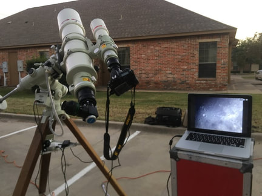

FIGURE 7 - Shown here is one of my favorite rigs for public outreach events. It features a Takahashi TOA-150 refractor with smaller Tak FSQ-85ED with Nikon D810A DSLR mounted on top. The mount, a Tak NJP, makes public events and short focal length imaging a breeze. For the images taken in FIGURE 6, I only used the FSQ-85 with little Tak finderscope.

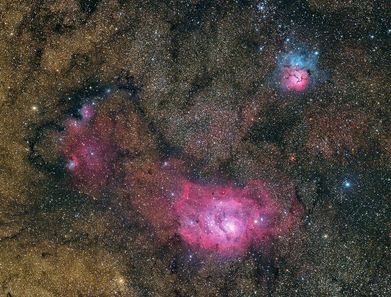

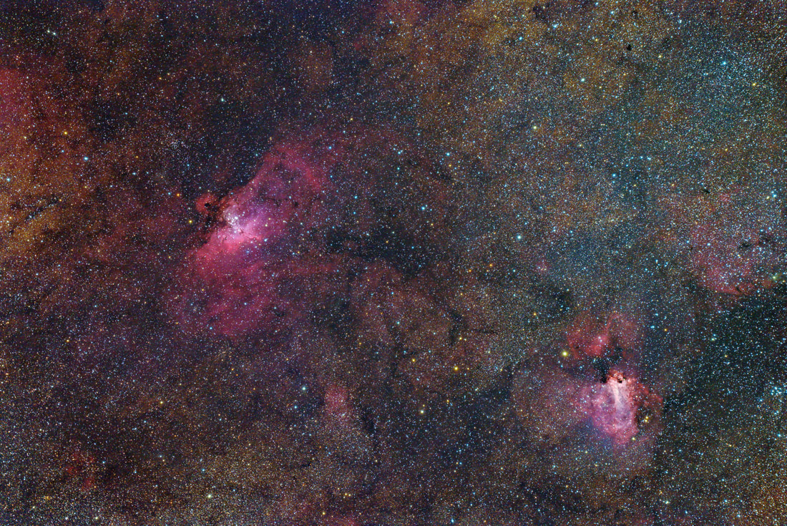

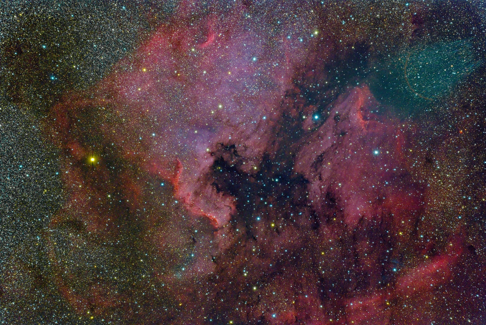

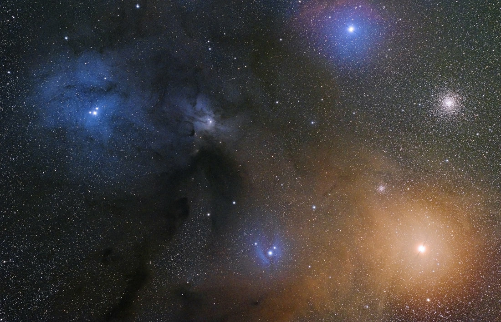

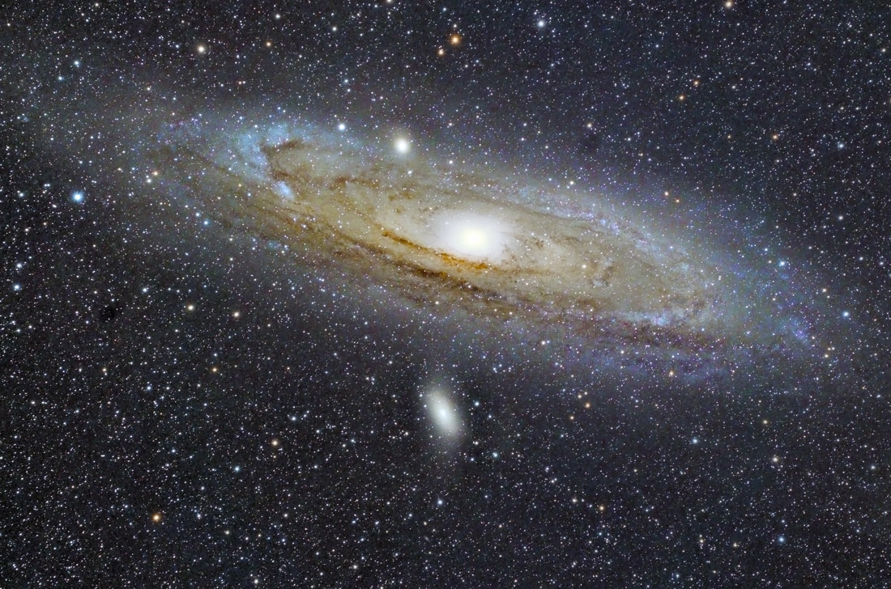

FIGURE 6 - These images are amazing.   Not because they are wonderful or unique.  They really aren't.  In fact, I've taken individual images of each of these 5 targets previously, all of which are much better images in most regards.   No, these images are amazing because they were EASILY done.   Using a Takahashi NJP mount, which can be quickly polar-aligned within two arc-seconds of the pole, and a 450mm Takahashi FSQ-85ED ("Baby-Q") apo refractor (seen in FIGURE 7), this combination of tools meant UNGUIDED images for two minute sub-exposures.   Using a Nikon D810a DSLR at ISO 1600, none of these images are longer than 50 minutes of total exposure time.   Focusing is accomplished through the camera's own view finder and object framing is accomplished with the bald thing sitting on my shoulders.

### Being Able to Make More Out of a Night

Just like I mentioned earlier when I said that "no night should ever be considered wasted," the most obvious reason to become an astronomer as well as an imager is that you will have so many things you can do with an evening under the stars.    Without astronomy, what we can accomplish during a given night might be somewhat limited.  

There are nights when the clouds roll in steadily, where I know that there's no point to hooking up the camera.   But such nights can be perfect observing nights.   If you are anything like me, it's painful to know that tonight you might not be fruitful with collecting data.   But after a while, especially here in Texas, you eventually realize those "partially cloudy" nights are just part of the whole game.    

But beyond suspect weather events, what else are you going to do during the night once the cameras are firing away?   Sleep?   

As somebody who could script their imaging sessions, I typically choose to be active all night.  I like the feeling of being under the stars.  I like using binoculars and revisiting old familiar sights up high.  I like taking down a few challenge objects with an eyepiece.   And as I said earlier, I like to practice my imaging. 

And when the weather is really bad, I enjoy movie-night with Tom Wideman, tapping into a 15-year old scotch with Lonnie Wege, or sampling a new IPA with Vance Bagwell.     I mean even if you don't care about visual observing, bad weather nights can still yield a great night with your other bummed-out buddies!   

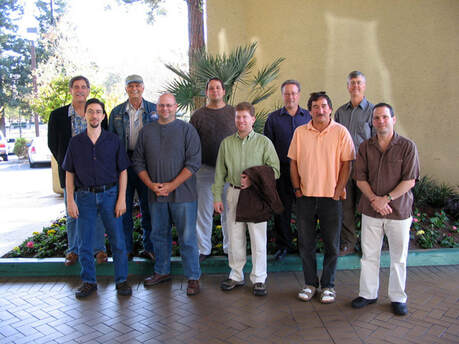

Rubbing elbows with pioneers of the hobby at the first Advanced Imaging Conference (AIC) in 2004. Pictured clockwise from back-left are Frank Barnes, Tom Harrison, Ken Crawford, Don Goldman, Michael Mayda, Robert Gendler, Tony Hallas, Adam Block, JAY BALLAUER, and Russell Croman. That's me standing there in such illustrious company. Me, I say!

### Practicing Together...

So perhaps astronomy is a highly personal thing...just you and your significant other (your scope) out for a romantic night under the stars.  And this is okay.  It doesn't have to be a big social event, especially since many astronomy goals, like completing a Herschel or Messier List, require a lot of individual focus, study, and effort.   

But one of the unique characteristics of something like astrophotography is that you will always benefit by having others with similar goals around you.  Whether under the stars, in an online astronomy forum, at a local astronomy club...whatever. 

Certainly, having friends goes beyond what you learn.    I can't tell you how many times I've borrowed a strap-wrench from my neighbors when my threaded Takahashi adapters got stuck YET AGAIN.   Or how many times I've borrowed Jeff Barton's extra coat because I was too silly to bring my own.  And I guarantee that he also has the weather forecast.   Or getting real-time advice from next door neighbor, Phil Jones, about the "seeing" quality prior to deciding which refractor you should use.   

But the real value of practicing together is the immeasurable learning FOR ALL.  I cannot tell you how many people I've helped, how many questions I've answered, and how many of my own skills I've improved just because an evening became an astronomy classroom.

And really, it doesn't have to be under the stars.   Your learning alongside others can take place when processing images, while fixing equipment, and even when shopping for your next scope.  Here's just a few stories of such experiences:
​

At the inaugural Advanced Imaging Conference (AIC) in 2004 (see picture at right), there were so many great learning experiences during presentations.  To this day, I still remember what Tony Hallas discussed about artful presentations in images and what Richard Bennion said about image acquisition and what Ray Gralak said about autoguiding and about what Adam Block showed you can do with even the worst of your subframes and what Russ Croman said about art vs. science and what Steve Mandel said about the Integrated Flux Nebula...and no, I didn't cheat and look at old notes.   Those were everlasting impressions that prompted me to practice what they showed.   But perhaps the greatest learning experience came after hours, when I sat with gentlemen like Bud Guinn and Jan Rek and Adam Block and Don McCrady and Daniel Verschatse (rmay he R.I.P.) and Tom Harrison and the young, talented Daniel Marquardt who would die tragically a few years later.    Sitting in the bar, tossing a few down, while sitting behind our laptops showing each other processing tricks was worth a hundred AICs for me.   And most of those associations have spawned continuing friendships that have lasted to this day. 
 
In November of 2007, my buddy Vance Bagwell (www.cosmicsniper.com) and I were out at 3RF on a beautiful new moon night.   We had imaging setups running, both shooting M78 in Orion.   It's a common event to have a few of us hanging out late at night, having extended our stay beyond the weekend of helping out at the Saturday night public star party.   At that point, I had mentored Vance along for a few years and he had already become a terrific imager.   He was using his short Tak FSQ-106 refractor while I was imaging with the 6" Tak TOA-150.   At around 3 AM, the only other two men on the campus, who were new volunteers at 3RF and new to astronomy, sought us out to ask us about the amazing "comet" that was in the sky near M42.   Of course, Vance and I just rolled our eyes and laughed at the "noobs," saying, "Uh...nah, no comet, bud.  You must be seeing things."   Of course when lead-noob Danny Townsend pointed his laser at the object in question, Vance and I became believers.   We immediately stopped our images of M78 and swung the short distance away, acquiring the mystery object in our scopes.  Of course, it wasn't a comet...and the next day we would find out for sure what it was.   In short, it was a Delta IV rocket fuel dump that you can read about here.   But there were three things I took away from the experience:  1)  How we missed the object ourselves as we were imaging an object right next to it taught me to get my head out of the laptop.  2)  You can learn something from anybody and ANYBODY is worth listening to, no matter how veteran you think you are.  And 3) guys like Danny can grow and become awesome astronomers and friends themselves.  
​

During another night out at 3RF, myself and fellow imager, Russell Horn, hung out in the 15 ft. ProDome observatory which, at the time, housed an 8" TMB f/7 apochromatic refractor.  (!)  Russell, being a great planetary imager, loved the instrument for taking awesome images of the planets.   While I've learned to let friends like Russell do all the planetary stuff (because I'm not very good at it), I still like to hang around people to see if I can learn something.   On that summer night, we were doing some maintenance on the instruments, setting them up for Russell to do his expert imaging of Jupiter.   As we were waiting for Jupiter to rise to a better seeing altitude, we decided to take a break and walk back to the building for a snack.   Now, in Texas, when you walk around during a pitch-black night, you should probably have a light, just in case there's something to surprise you.   While Russell had a light, we heard the SOUND before Russell could shine it in that direction.   And, of course, with Rattlesnakes as big as this one, you are just thankful that they have nice big rattles to warn you!  And aside from all the things we'd learn together that night, it's nice to have somebody like Russell to dispatch the 6" rattler for you!

It's okay if you are lone wolf - a dedicated imager or observer who likes to shut off the world around you.  But really, as much as the night sky and amazing gear and dark skies are freaking awesome, so are your fellow imagers.   Take up arms, one with others, and watch how much more imaging IQ you develop together! 
​

### How to Assess Your Learning?

Now that we've looked at all the qualities of what I'd consider good practice from the standpoint of getting better at astrophotography, let's bring the discussion full circle.  While it might be tempting judge how GOOD you are getting by looking at the quality of your images, in truth it's a poor way to evaluate your hard-earned skills on any regular basis.   See FIGURE 8 at right for more about what I mean.   

Don't fall prey to the "Legendary-Astrophotographer-on-the-Internet" Syndrome.  You know what I mean...there are guys out there who put up a gorgeous image every week.  Their posts are legendary, with thousands of views and hundreds of shares.  Their visibility has gotten the attention of everybody and they are invited to conventions to show off they work.   

In truth, they most likely bought or borrowed their data online and have become master processors of perfect data.    With money, you too can turn such data into perfect images.   That's easy.   What's hard is taking YOUR tools and making great data to produce great images.

This Syndrone is contageous and it's unfortunate that you will want to judge both your progress and your images by what you see on the Facebook.  Don't do that!  Rest assured that many out there couldn't do what YOU can do if they had Einstein's brain, Ansel Adam's eye, and Brad Pitt's looks!   

That said, let's look at some ways that you can evaluate the progress you've made as an imager.     ​

FIGURE 8 - Teachers use both formative and summative assessments to evaluate student knowledge and skills. Summative assessments occurs when we give exams over the content. Formative assessments occur in the process of learning to verify student understanding. Applied to an astrophotographer, this illustration is a brilliant way to think of assessments. Obviously, you will be tasting your own soup most often when it comes down to your learning objectives. But consider the image itself the "summative." - credit Steve Wheeler (click on image for his site).

### Be Data-Driven 

With today's software and hardware tools, it's become much easier to evaluate our progress with objective measures.  Today, being "data-driven" is crucial to measuring improvement in almost every scholastic, industrial, and corporate arena.    Just like a company's CEO that can forecast the future based on performance metrics, the astrophotographer also has tools that can put real numbers on our results.  

Certainly, you need to know something about data.   There's no shortage of math when it comes to our hobby.   So it pays to be well schooled in the aspects of focal lengths and image scales and star profiles and SNR and sky-limited exposures and data reduction.   But doing so will require learning new software or understanding new metrics or grasping the concept of noise or measuring how signal accumulates.    

Granted, this area of the hobby is very confusing for the beginner.   Not many, except for the most patient and persistent among us, can learn all that we need to know from a bunch of technical papers, websites, and textbooks.   So, it's in this area that you can benefit from some outside guidance. 

Be sure to find a presentation or a conference or a workshop or a mentor who is capable of making you understand concepts like FWHM and why such metrics are important to evaluating the quality of our data.  

In many cases, understanding metrics can also save you time.  You'll be able to evaluate, based on a single focus frame, just how much imaging time you might need in total for a new image.   You'll be able to detect shifts in focus over the course of an imaging run, saving yourself the time spent on bad sub-exposures.  You'll be able to achieve a perfect balance of auto-guiding accuracy via graphs.   You'll be able to compute the perfect exposure times to reach the sky-limited threshold of peak efficiency.  

After some experience, you'll also be able to use metrics to judge your sub-exposures and sort them according to quality.  You'll know how to use stacking algorithms to improve the SNR in an image stack.  You'll be able to recognize when you are pushing your processing too far via your histograms.  

Understanding and getting the most from your hardware and software tools can raise your imaging game as well.  Learning to value software like T-Point or PEMpro can turn average equipment into solid data collectors.  And being intimate with Photoshop or PixInsight can lead to rapid success.  For example, while following an image processing tutorial using the default settings for a process can get you pretty far, knowing how to customize the settings can open up more powerful possibilities for an image.   In other words, if you regard your pretty pictures as representative pixels, then you'll recognize how certain processes are affecting those pixels.  

To the artistically-minded, as much as we want to practice the ART of photography on the night sky, we shouldn't neglect the inescapable notion that what we are doing is inherently mathematical and scientific.   To get the best from the hobby, you need to be somewhat conversant in the language of data.

When working with data, it's hard to stray from the fact that YOUR development as an astrophotographer will result in the consistent quality of the data you produce.  But the converse is also true...understanding the consistent quality of the data you produce will definitely show you how GOOD an astrophotographer you've become.       
​

### Eliminate the Variables

Burn-out is a real thing.   My father never let me play Pee-wee football.  Why?  Because as a high school football coach, he'd seen too many kids burn-out.   And while I didn't understand it at the time, he was right.   By the time I got to 11th grade, I wasn't looking forward to those hot Texas two-a-day practices!   

Highly technical hobbies have a similar affect on us.   In our discussion regarding being data-driven, the beginners among you probably got a little scared.  Well, it's really not that bad if you handle it in stride.   Take it in bite-sized chunks and look for others to fill in the gaps for you.    It's manageable, even for those who are less technical.  

But actually, the greatest robber of our imaging "MOJO" will not be the weather or the technology or the math.   Instead, it's the VARIABLES.  

As you are looking to evaluate or troubleshoot your on-screen data, it becomes apparent that there will be several possible causes for something like trailed stars.  Let's see, what could have happened?   Was it a bad cable?   A snagged cable?   A slightly off polar alignment?   Improperly balanced scope?  Aggressive autoguider?  Field rotation?   Wrong tracking speed for the given object?  

How do you even approach finding a correction for such issues?    How do you react?  

Rest assured, you'll naturally learn to make distinctions between cause and effect for the various problems that arise, even when it doesn't seem possible.  When you see something happen enough times, you'll learn how to fix it and recognize it every time it happens.  

Furthermore, you'll learn the most likely causes for any given type of error.   It's strange really.  One day you'll wonder why the same black specks are littering your calibrated images only to realize that it's happening because you've resisted doing a "master" dark frame.   After that, you'll never have those specks again!   

That's a simplistic example, but it's true with so much of how data acquisition works.   Quite often, it won't really make sense to you until you've fixed enough of those problems yourself.   LIke an electronics expert who can trace down a flaw in a circuit to a specific chip, you too will have troubleshooting skills you didn't expect when you first started.   It's reactive...and you become able to fix the things you don't like. 
 
But there's one irrefutable fact to know - GOOD practices inherently eliminate the variables.   This begins to happens when you prioritze the learning of skills that impact data the most.  When you get good at a skill, the errors associated with that skill becomes a thing of the past.   

In other words, the most important thing you can do to get better is to be proactive in the hobby.   This is why we talk about "best" practices in the first place. 

In the end, you will be a veteran to both eliminating the problems you see and avoiding the problems you don't want.    And because of that, the whole journey starts getting easier.   Not only will your images improve, but you'll wonder what made it so difficult in the first place.  And it's at that point when you realize how valuable all that practice truly was! ​

### Become a Teacher of Others

As a high school teacher, it's easy to know which kids are the most successful...they will be the kids teaching the OTHER kids.    

As you gain confidence and ability in the hobby, more and more people will naturally want to know how you got to where you are.   They will bestow upon YOU the titles of MASTER and MENTOR.  It serves as confirmation that you've achieved a certain level of success.  I find this peer recognition to be MUCH more satisfying than the awesome images themselves.  See SIDEBAR: Oh, Canada!  for an interesting anecdote.

At first, becoming a teacher of others isn't going to be natural...and, early on, you shouldn't seek opportunities to teach others, except maybe via a few points here and there on an Internet forum.   But as you grow in the hobby, more and more people will seek you out - which is both wonderful and terrible at the same time.   It feels good to know that people think highly of your knowledge to seek you out, but it's scary to know that how you communicate that knowledge can greatly shape the learning of others, hopefully for good, but sometimes for bad.   

It's easy to become dogmatic about certain things we believe in the hobby.   Some of this, like our opinions about politics and religion, need to be kept in check until you've paid your dues and are recognized by OTHERS for being an expert in what you do.   So keeping a sense of humility as a teacher of others is critical.   There's no place for ego in the business of being a teacher.   And there's no place for acting like "Mr. Know-It-All" as an astronomy mentor.   

Walk quietly and carry a big stick, but let others compliment you on the, ahem, size of your stick!  ​

## Sidebar: Oh, Canada!

While having people fawn all over your images is nice, we need to be careful about using the opinions of others when it comes to evaluating our astrophotography.    Here's an amusing story about what happens when you get too prideful...

The year was 2009.  I was contacted by Canada Post...you know, of the country Canada.    They had seen my 2005 APOD image of the Rosette Nebula and requested to use this image on a new postage stamp, one of two in a series of stamps to be released in April, 2009 that would commemorate Astronomy in Canada. 

At that time, the irony that I am an American (moreover, a genuine Texan) did not escape me, but I figured that if they didn't care, then neither did I.  I mean, how exciting is that? How many other astrophotographers have had their work commemorated on something like that?
​

I was even surprised by how proactive they were. More than a year before the project goes to print, and they already had a working design for my stamp, as shown below:

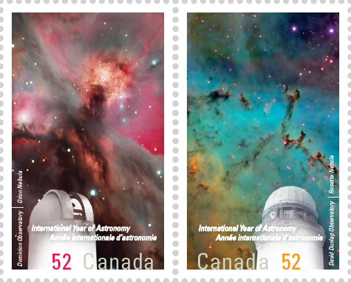

After talking back and forth via email for a few months, filling out the permission forms, and sending a variety of image crops and file sizes, I settled into a patient waiting game that would last more than a year. And really, I never asked for much in compensation - perhaps a few First Day Cover issues and a few books of stamps (if indeed the Canadians do indeed have books of stamps).  Honestly, the satisfaction of knowing that one of my images would be licked by thousands of Canadians would have been plenty!

Time passes on and I begin to get antsy, wondering when the Post will contact me again about the project, and to conduct my interview with their philatelist/stamp collector's magazine called "Details."  So I emailed my normal contacts wondering when this great American astrophotographer would be commemorated on a stamp used by the McKenzie Brothers and my favorite band, Rush.  

Alas, those "hosers" informed me that Canada Post must adhere to the policy of using Canadian content where possible, and they would thus be required to go in another direction.

By Canadians, for Canadians, I suppose.

Being led-on for over a year, like a girlfriend who would soon jilt me (lots of experience there) was bad enough.  But having my image replaced ultimately by one that I felt wasn't as "good" as mine felt worse.

Just goes to show that we have to be careful when we prop ourselves up too high on those pedestals!

## Conclusion

​Astrophotographers can become obsessive.   This is good, as it drives learning forward.  But the quest for taking great images can be all-consuming, which also means that the inevitable struggles become more frustrating; more stressful.    Keep in mind that the nature of imaging - and astronomy on the whole - is highly unpredictable.   As much as we want things to be on our time table, it never really is.  If you don't believe me, then purchase a new imaging rig and just watch the clouds roll in.   Astronomers joke that the weather will absolutely SUCK 1 week for each inch of aperture in your new instrument.  So, buy a Celestron C-11 and it'll feel like 3 months before you can use the blasted thing!  

We've talked about things you can do in the meantime.   Things that can still make for some productive learning experiences.   

But remember that that you don't HAVE to be productive or driven or competitive.   It's alright to realize that taking imaging of the cosmos is a great accomplishment and you will likely achieve it very consistently someday.   But don't allow your ego to make it more than it is.  Your self-worth shouldn't be tied too tightly to your hobby.   Too many people feel worthless because they fail and even more people act overly self-important when they succeed.  

To avoid this, commit yourself to having fun, whatever stage of the process.  Surround yourself with great people you enjoy being around.  Teach others the hobby.  Kick back with a cold one every now and then instead of being "Mr. Alcohol-affects-your-night-vision Guy."   Get some sleep on night 4 of a week long star party.  ​ 

Mostly, enjoy your learning.   Fall in love with the night skies.   Be an advocate for important causes like dark sky preservation and science education.  Celebrate all the small successes you have and share them with those you love.    And then, after many years of hard practice and results, celebrate your success by the number of people you've influenced positively with your hobby!
