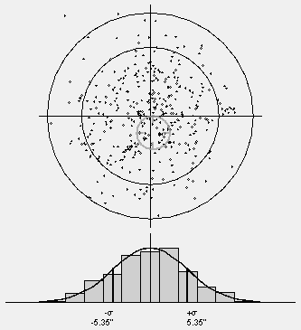
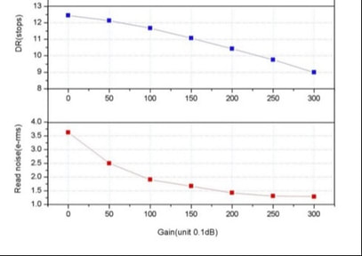
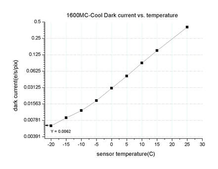

Imaging sensors are like the swimming pool at the country club. Not everybody is guaranteed an opportunity to swim; some photons lack membership cards. But for the most part, a typical photon would quite likely stand a good chance of swimming somewhere on the chip. Now, where I choose to swim doesn't matter so much as does the fact that I actually have opportunity to swim for a good long while, or at least until somebody drains the pool.

Thankfully, the CCD or CMOS pool is chlorinated (or calibrated) to produce a very clean and clear swimming experience, or at least that is true until on a summer weekend when half the universe targets our pool. But what I can't tolerate is when the pool isn't clean before we jump in — or when half-way through the day, they pull us out of the pool for a 10 minute "safety-break" head count. Talk about wasted efficiency!

Analogies aside, it seems like we deal with a lot of filthy noise in CCD/CMOS imaging. We do have strategies for mitigation in these areas — which both complicates the hobby greatly AND provides obfuscation where a deeper understanding of sensor theory is concerned. And it is this aspect of confusion that leads us to look for "rules of thumb" and truisms in the hobby. These are typically useful and safe — until they are misconstrued or wrongly applied.

But what if I told you that very little of what concerns most astrophotographers concerning noise actually affects my images? Rather, you too can experience some of the same comforts, knowing that your image data represents the theoretical max in terms of noise on any given night. What if I told you that with the right imaging plan and a proper mitigation strategy, you can essentially take images with what might be close to the "ideal" camera? In fact, did you know that you actually have control over most of these things?

As such, in this article, we will be exploring ways to yield images where the ONLY real source of noise in your images is that which you cannot control anyway, that being "photon-noise" or "object-noise." Consequently, you can maximize the efficiency of your imaging by assuring yourself the highest signal-noise ratio possible by producing images with the lowest amount of noise possible. (To see what this looks like from the standpoint of improving signal, see my article, ["Best Data Acquisition Practices."](/learning/best-data-acquisition-practices/))

## How Noise Accumulates in an Image

Astrophotographers have come to understand the total unpredictability in a region of pixels — you need more than one pixel to measure it — as *noise*, even if they may not fully understand the mechanisms that produce it. Mistakenly, from the classical thought of "noise" from other fields (like television and music), noise is NOT "unwanted signal." *Unwanted signal* is an important subject of its own, discussed further below.

But when we regard *noise* as "*variance from expected values*," as we should, we will be dealing with many sources of noise. The one thing that every imager should understand first is that these noise sources always add quadratically. For all sources of noise, the total amount of noise is represented by the square root of the sum of their squares:

**total noise = sqrt (source 1² + source 2² + ... + source n²)**

When this is properly understood, the imager can work to reduce the total effect of noise in an image *if they can minimize the contributions of noise sources compared to others*. Many sources of such noise can be calibrated out of the image; others can be diminished through a good mitigation strategy.

For example (and as a tease for what follows), a high read-noise camera at 15 e- doesn't have to impact an image much if I can "swamp it" within another source of noise:

**Total noise = sqrt(100 e- shot noise² + 15 e- read noise²) = 101.1 e-**

You've undoubtedly heard that camera read noise is "bad," but in such a case it contributes only about 1% of the overall noise in the sampled area, assuming these are the only two noise sources in this hypothetical example. If you understand the concept of hiding smaller noise sources within a single, dominant source of noise that we cannot control anyway, then you have an idea of what we will seek to do here — image with a camera we didn't even know we had, a near-perfect one.

When a shotgun is fired, it scatters pellets in a natural distribution as shown. Approximately 68% of all pellets land inside the first ring (one standard deviation) — a value that becomes more predictable at higher pellet counts. An image sensor records photons the same way, which is why even a point-source star ends up spread across multiple pixels rather than a single one.

### Noise Sources

Let's sort types of noise within two broad categories: random noise and spatial noise. We can do nothing about *random noise*, other than do our best to mitigate its sources — it accumulates according to the equation above and includes shot (Poisson) noise (from the object and the sky background) and camera read noise. *Spatial noise*, on the other hand, is related to a pattern, which can be modeled and mostly (not completely) removed through calibration techniques — this includes noise relating to pixel gain (how an amplifier boosts signal) and offset (how an amplifier is reset). There's a third category people mistake for noise but isn't: *unwanted signal*, such as light pollution, which produces residual noise even after calibration.

**Shot / Photon Noise** — Shot Noise, also known as "Poisson" noise, is the noise arising from the natural distribution of random photon events. It is the unavoidable result of collecting millions of photons on an imaging chip, each a single random event. Like a shotgun that randomly scatters pellets over some area, light from space does the same onto your imaging sensor. A star's point-spread function (PSF) shows roughly 68% of the star's light concentrated within 1 standard deviation of its center, 95% within 2 sigma, and 99% within 3 sigma. At the pixel level, the amount of shot noise can be estimated as the square root of the signal — as a simplistic example, if 10,000 photons should be recorded at a pixel, the actual recorded count could be within ±100 photons (the square root of 10,000).

**Camera Read Noise** — Generated by amplifiers during sensor readout, measured in electrons (e-). Read noise tends to improve with higher gain settings, relates to pixel size, and its relative contribution shrinks the longer your individual sub-exposures run — which is why multiple short sub-exposures compound its effect more than fewer, longer ones.

**Dark Current Noise** — A temperature-dependent, thermal noise source that increases exponentially as a sensor heats up. Properly calibrated dark frames remove most of the dark current signal, though some residual noise persists.

ASI 1600MM specification charts showing the trade-off between gain improvements in read-noise performance against dynamic range losses.

## Achieving Sky-Limited Imaging

Optimal performance occurs when background sky glow dominates over camera read noise. By taking sub-exposures long enough to reach roughly 1000 ADU counts, read noise becomes negligible — on the order of 1-5% of total noise — allowing shot noise from the object and sky to dominate instead. In practice, multiple long exposures prove superior to many short ones: it improves outlier rejection during stacking while keeping the read-noise contribution minimal.

Dark current for a cooled CMOS camera, demonstrating the exponential increase in dark current as sensor temperature rises.

## Why Is Noise So Annoying?

Several factors determine how bothersome noise is within an image:

- the image's resolution — how fine the details are;
- the viewing distance — how small the image is, or how far you are from it;
- the size of the noise — noise exists at scales larger than a single pixel;
- the noise intensity — the SNR of the image (lower SNR makes for more intense noise);
- its spatial correlation — even when random, noise can show itself in patterns;
- and the viewing environment — noise can be hidden in the dark.

Because of this, your need to mitigate noise depends, in part, on how you wish to view your final image and how sensitive you are to it. Noise can be seen as the obfuscation of structure — the breaking up of the lines of a nebular wall, the inability to see the dimensions of a dust cloud you know is there, or the surprise mottling of color that breaks up an otherwise single-hued space. Random noise is more visible (and objectionable) when it is "spatially-correlated" — perceived within a broader context of details in an image — while random noise in random space isn't nearly as bothersome.

## The Unique Fingerprint of PRNU

Photo Response Non-Uniformity (PRNU) — the pixel-to-pixel variation in gain across a sensor — is distinctive enough to a given camera that it can act almost like a forensic fingerprint, matching an image back to the specific camera that took it. Flat-field calibration removes PRNU from a processed image, though the underlying pattern remains a useful way to think about why spatial noise is fundamentally different from random noise.

## Computing SNR

Signal-to-noise ratio (SNR) is the mean pixel value divided by the standard deviation across a neighborhood of similar pixels — not a single pixel. The measurement needs a sufficiently large sample of similar pixels to avoid bias from any one outlier; in Photoshop, this can be approximated using the histogram's standard-deviation reading over a sampled, evenly-illuminated region.
