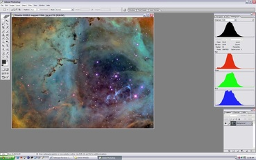
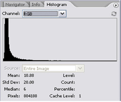
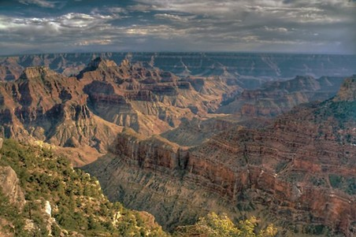
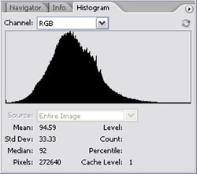
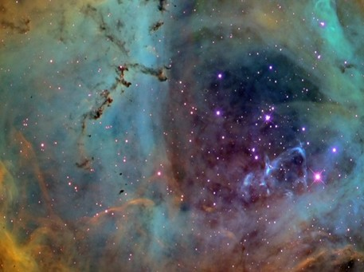
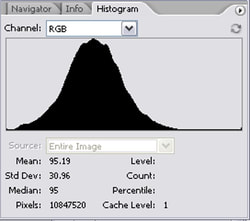
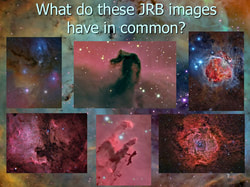

For as long as I can remember, I have been fascinated with photography, though my early recollections of it had more to do with clicking a button on a box and watching a piece of "plasticky" paper come out. The reward came after a minute of flapping the paper from side to side and then hesitating long enough to see a ghostly image gradually gaining in opacity and strength, soon turning into a fully-realized picture of some inartistic, yet heart-felt object of my affection – or more likely just a picture of my icky little sister.

My Polaroid camera soon gave way to dreams of my first "real" camera. These were dreams that began when I first saw "it" in some of my uncle's mid-70s "Popular Photography" magazines. In fact, my first association with "sexy," despite my pre-pubescence, would have been that awesome Nikon F2 that graced those pages. Of course, back then, that camera cost more than a couple of my parents' monthly paychecks - so I was smart enough not to ask for one. I did manage to score a 110-format "brick" with disposable flash cubes though.

It would be 25 years until I would acquire that dream Nikon camera, but it would come out of my new astrophotography budget. With that camera came my first real successes at imaging the stars.

But for some reason - I don't know if it is our concept of the darkness of space, the fixed-lens aspect of a telescope, or the inefficiency of film when taking such lengthy exposures - the wisdom of the time eschewed the thought that my photography experience during the day would help very little on my imaging efforts at night.

For several years, I learned to image the heavens by studying the new ways of this most challenging form of photography. Terrestrial concerns about composition and lighting were replaced by equal parts of perseverance and luck. Shutter speed was made obsolete by the camera's "bulb" mode...

…Autofocus? Flashes? Light meters? Bargain-bin films? Depth of field? None of which seemed applicable in this type of photography.

Instead, notions of reciprocity failure and spectral range danced in my head, concepts that most certainly no real photographer had ever heard of.

And then, I went digital, which meant a whole new vocabulary and a whole new set of rules would be necessary.

Signal to noise ratios. Dynamic range. Photon flux. Calibration frames. Shot noise. Sky-limited imaging.

Most certainly, we are in a whole new kind of imaging. And so began my indoctrination into the idea that astrophotography bears no resemblance to real-life, ordinary photography in almost every traditional aspect of the discipline. Consequently, my results over the next several years would seem to confirm those differences – namely, lots of dark, wasted pixels of barren space, wholly framing a singular cosmic target.

*But is this all there is?*

Like many in this hobby, I began my imaging career by working my way through progressively longer focal length lenses with my film camera to the current, prime focus images taken with some of the best tools available to amateur imagers, namely cooled astronomical CCD cameras on high dollar scopes and mounts. But my early struggles in digital astroimaging made me suspect that there must be something more, especially in light of some of the more positive results I began to see from my contemporaries.

Not surprisingly, most of my early CCD efforts looked, well, amateurish - lots of stars and sporadically placed regions of color and brightness against a massive backdrop of dark space. And it was my perception of "space" that caused the problem. At that time, I just didn't know what amateurs were capable of doing with these CCD cameras!

The last decade has certainly demonstrated that our concept of "space" has drastically changed, so people breaking in to the hobby today have less trailblazing to do. But even so, "space" remains synonymous with "blackness," largely mysterious to us.

If we looked at the image data as the percentage of a range of brightness values, most people would expect to see tons of "black." Thus, a histogram of such images would be heavily concentrated to the left side of the graph, meaning that an overwhelming majority of the pixels in the image are almost an indistinguishable shades of boring darkness, as shown below...

This is in direct contrast to that of a terrestrial landscape image, as it would appear to have a much more equal distribution of pixel values across the entire graph. If exposed correctly, the data will reveal the full dynamic range of the camera, where there is aesthetic value and meaning within all brightness "zones." This comes naturally with lunar shots when "zoomed" in to show the lunar surface exclusively, but not so much for deep-space, astronomical "targets," despite the fact that today's technology can actually achieve those levels of data acquisition on even deep-space objects.

So, by intuition, I began to lift the black point in my images, seeking for other niceties that lurked just barely undetected in the shadows. I sought to master Curves in Photoshop and other methods of logarithmic "stretches" of my data, such as with Digital Development (DDP). I started choosing targets that yielded full chip coverage. I started to compose and crop my data logically, to maximize the amount of appealing objects in my images. After a while, most of my images began to yield an entire array of pixels containing meaningful photons of light, much like an Ansel Adams photograph or a typical Grand Canyon landscape. And the histograms below bear this out:

Ultimately, a worthy goal is to acquire image data and process your images in such a way to render maximum details in the darker, but still useful portions of an image. This is based on the ideal notion that all regions of a photograph should portray something of interest. It is this philosophy that is foundational to everything else – at least I believe this to be true if you desire to impress anybody with your images other than yourself - or to give a modicum of integrity to the grandeur of the amazing creation you hope to capture. There are photons to be collected in all parts of space and they deserve to be seen.

Of course, it is much easier to have a CCD chip covered in meaningful pixels when shooting large, extended nebulae and Milky Way vistas. But even when shooting smaller, isolated targets such as galaxies and star clusters, I believe it to be worthwhile to explore ways to infuse the same "landscape" philosophy into even those images. For example, as mentioned earlier, you could use your cropping tool to rid yourself of the disinteresting, often dark portions of an image. Or, focus entirely on a single area of interest.

Better yet, why not just have an image FULL of meaningful pixels so that I can do something with ANY of it?

What do you NOT see in these JRB (me) images of "space"? If you said "space" or "void" or "blackness," then you have the right idea. We need to first realize that there's a lot of light up there. "Space" isn't as dark as we always thought it was!

How can I make my all of my astrophotos more interesting, appealing to a broader audience of astronomers and non-astronomers alike? What practices can we develop in our techniques that can optimize pixel values to yield greater dynamic range and make for more interesting and impactful images?

How might I render astronomical images in such a way to make them look like terrestrial landscapes?

How do I make greater object "signal" in the weakest parts of my image? Let's look at three areas where I think we can find answers to these questions.

## Going Long...

In traditional photography, exposure time is set according to how much detail you can separate out of the faint parts of the image. This means that your shutter speed and/or "f-stop" is determined by what will maximize the camera's dynamic range, or that which makes an image's faint areas just as useful and valuable to an image as the brighter ones. It is an old saying, expressed by the pros as, "Expose for the shadows." In today's world of histograms and image processing, the statement is revoiced as, "Expose to the right." Either way, the idea is to accumulate as much light as possible in the image without reaching total saturation in any single part of the image.

Therefore, with film, if a one or two-stop increase in shutter speed or aperture setting could put more light into the faint zones without over-saturating the highlights, then a photographer would generally opt to do so, knowing that the brighter areas of an image could be controlled through darkroom techniques, such as "burning and dodging." In digital-speak, as long as the highlights are not blown-out, having reached the point of total pixel-saturation (e.g. data loss), they can be brought back to normal in processing through a judicious application of Curves, compression, or some sort of pixel math. These tasks become easy in just about any of our favorite image processing applications.

This doesn't just happen as an exercise in freewill. How much you can push the histogram to the right depends on how clean the image is from the standpoint of noise. Specifically, you will want enough signal to overcome any noise that will inevitably show up once you attempt to boost the levels in those shadow areas. As you push to the right, how you regard that noise will be the determining factor. Has it become objectionable? Can I control the rise in noise with some reduction techniques in post-processing? Do I need more exposure time to accomplish what I want to do in the processing of those areas?

So, as a rule of thumb, we should "go long" with our total exposure times...as long as possible; as long as practical. There is no such thing as "too much time." However, determining when we have sufficient time is very difficult to gauge. Sometimes we are imaging targets that require much longer exposures. Sometimes we are imaging in conditions that will scatter our light (bad seeing and/or transparency) or our good photons have to compete with bad photons (light pollution). In truth, you can shoot the same object on two different nights for the same exposure time, process them individually, and yet each of the images can be entirely different from the signal-to-noise perspective. As such, finding the needed amount of exposure time is key.

How this is accomplished, however, is half of what makes this hobby so difficult, and the extent of what needs to be learned goes far beyond a single article. However, when I mentor other hobbyists, I find that one of the most difficult things to get my students to do is NOT shoot everything in the sky on a single night! Honestly, to get the types of images you might see here, or elsewhere, you have to be willing to acquire your data over the course of an entire night...or nights, plural. This is the only true way to get the "signal" you will need.

Thus, for true "landscapes in space," deep-sky exposures are measured in terms of hours, not fractions of a second like our terrestrial counterparts. Even so, the same "Expose for the Shadows" principle applies - go long.

## Go Clean...

When we process our data, we "stretch" it out to see what we have captured. We can stretch it out pretty much however much we want. How much "stretch" is typically determined by a single aesthetic…noise.

Noise, or unreliability in our data, is inherently a problem in areas of the data where less amounts of total light are accumulated. Certainly, the presence of noise in an image can be a sign that you did not go LONG enough to capture the details cleanly. However, for most struggling beginners, it typically means that you did not do it WELL enough in the first place.

To combat this, the imager should have an understanding of the sources of "noise" in an image and how it limits the effectiveness by which one can process an image to bring out details in the shadows. I will choose to save deeper inquiries into noise consideration for future articles. However, fundamentally, we should understand that anything that makes light go somewhere it does not want to go causes noise. Poorly tracking mounts, flexure, poor focus, bad auto-guiding, wind, bad collimation...these things work against the efficiency of what you hope to accomplish when you acquire data all during the night. For a detailed view of how to improve in these critical areas, see my article, "Best Data Acquisition Practices."

Therefore, the better you become as an astroimager, you will naturally strive to do it not only LONGER, but BETTER! This not only reduces the amount of the total noise contribution (impact) to an image, but perhaps even eliminate some noise sources entirely.

## Be Artful...

Knowledge of artful composition is important to producing good landscapes in space. For example, if there is too much black space despite all your efforts, nothing says you have to keep that black space in your image. This is what the "crop" tool is for. Don't laugh. I find many of my own images substantially improved because I have learned how much of the area of the sensor's field of view I should keep.

I find many students and pros alike reluctant to crop their images substantially. I suppose if you spend thousands of bucks on a really big sensor and you've spent DAYS on an image that you probably thing cropping away some of the image is just a waste?

Quite simply, there are images that become better, more mysterious, convey stronger mood, or even become more informative if they are cropped to only the areas of the image that really matter. Unless you find trying to capture a lot of the Intergalactic Flux Nebula (IFN) just wonderfully interesting, then I'm not sure how necessary it is to keep all those low SNR regions within your image, especially if there is a strong story to be told elsewhere in the image.

Similarly, using longer focal lengths and how you compose the image in the available field of view makes a huge difference in the amount of exposure time needed. In many cases, you can make decisions that will fill the field of view with good object photons to begin with, as opposed to just shooting wide-fields of random targets because it's all you can think to do.

But being "artful" is more about the message you wish to convey as the photographer. Are you trying to tell a story? Convey a mood? Strike a sense of awe within the viewer? If so, I think you will find the Landscape in Space philosophy most relevant. I find that the vast majority of photographers care about how their images are perceived. And the vast majority of the public is interested in "feeling" something about an image.

However, if your intent is more scientific or more observational, then perhaps a little black space in your image is fine? For many, this hobby is very personal; private, and the work you do is for you alone. Or, perhaps you are acting more as an explorer or a scientist and have no need to worry about if the work is perceived as art. All of that is terrific! I would make no judgments about an image if it is made clear by the photographer such intent.

Darkness does have its place in the occasional image...even mine. Even if we practice "art" 99% of the time, there is the occasion when we want to show off the blackness of space, especially for images like the Virgo galaxy cluster where we want to see how many galaxies are captured in a given field of view. Or, perhaps, the darkness itself helps to convey the mood?

Personally, in such cases, I document any changes to my typical methods and agenda when I display my images online. In fact, astrophotographers should always give image specifications, processing information, and even the purpose of taking a particular image. In this way, you let the viewer know whether your image has an intent beyond the type "work of art" interpretation.

## Conclusion

At this point, with better attention to adequate exposure lengths AND by increasing the quality of our image capture, we will have stronger data more capable of aggressive stretching of detail in the shadows areas. Likewise, better compositions and a willingness to crop out uninteresting pixels can help to swing that histogram more "to the right."

While there are many other factors that can lessen the fidelity of your data, namely bad calibrations and reckless processing, it will all start with acquiring really good data in the first place. Simply put, making all pixels count it is much easier with really good data. Garbage in...garbage out.

## Epilogue

Beginning around 2005, I began presenting this philosophy to many groups of interest. I do not think that "Landscapes in Space" is necessarily unique to me, even if the title might be. Since then - but never before - I've heard the same philosophy talked about by many other astrophotographers. Around that same time, among my contemporaries, Adam Block's presentations and tutorials became known as "Making Every Pixel Count." This is perhaps the most popular example. But I think most of us intuitively began to realize what was hiding in our images and we simultaneously learned how to make "all those pixels count."

And whether or not they've vocalized it, just looking at the astro-galleries of the masters among us can tell you everything you need to know about their belief in this philosophy. Take a look at Rob Gendler's work and see how many images, among the extensive catalog of his images, include a bunch black space. Even around single galaxy images where some black is unavoidable you will see how the galaxy itself fills the image as much as possible.

The numerous images in my own gallery, as well as all of the writings here focus on this philosophy as a core principle. In fact, the writings on the "Learning" page here at All About Astro originally came from a book I was writing about astrophotography, where this article you are finishing was my "Chapter 1." So, when you explore my articles like Best Data Acquisition Practices, Developing a Plan for Our Images, and some of the future articles about image "noise" and data processing, be sure to remember the underlying philosophy at play.

