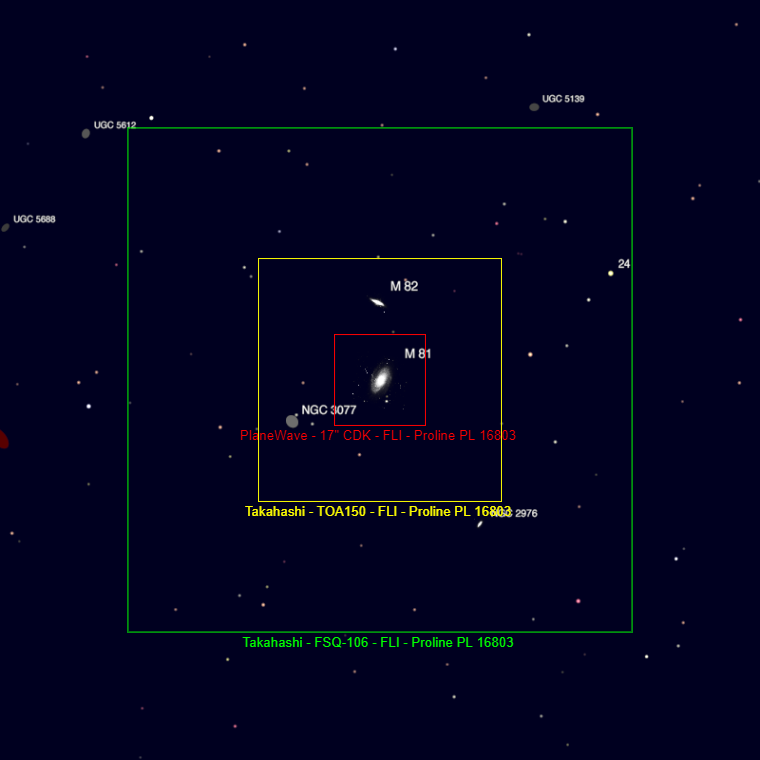
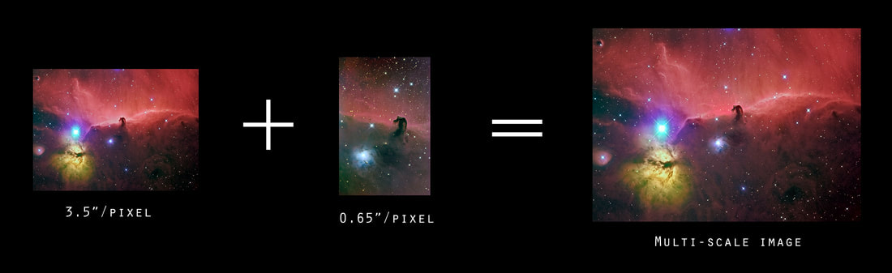
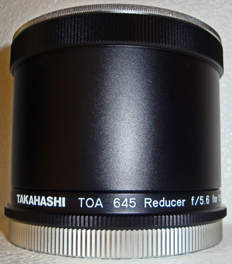

**IMAGE INTENSITY AND THE LUST FOR PHOTOGRAPHIC SPEED**

As a visual observer, I had an intuition when it came to the concept of image "intensity." For any given aperture of scope, f/ratio was merely a value that made the scope shorter. For example, when using a **20" Obsession dob**, I knew that the f/4 version meant that I didn't need a ladder when compared to the f/5 version (at 3RF, I had access to both scopes). And because I could use eyepieces to make the object any size I wanted in the eyepiece, I was able to place all 20" of light onto the same area of my eye (known as an eyepiece's exit pupil). Two different eyepieces will yield the exact same magnification in any two scopes of the same aperture (but differing focal lengths) as long as they produce the same exit pupil (EP focal length/scope f-ratio).

As such, I came to understand the importance of **aperture**. It was the key player to any view's ***intensity***. Differing aperture scopes, when operated at the same magnification (same angular size on the eye), always differed in illumination level...and it was always brighter with the larger aperture scope. Furthermore, regardless of the telescope, I came to realize that increasing the magnification wasn't diminishing the amount of light I was receiving, but rather it was just spreading it across the eye in a way that I could see it ***better***.

In truth, when we use an eyepiece, we are "slowing" the instrument's effective f-ratio down. Even so, with less intensity per unit area on the eye, this "trade-off" is necessary to produce what our eye deems is a better image.

To put it succinctly, the more ***intense*** view will not always provide the ***best*** view through the eyepiece.

***And so why is photography is some how...different?***

In all the claims about "photographic" speed, I knew that achieving faster f-ratios AT THE EXPENSE of image detail really didn't interest me. I knew that I would be choosing instruments based on their focal length to give the right "sampling" and "angle of view" for the objects I wanted to shoot - and if I could afford to have big aperture while doing this, then all the better! Doing otherwise, such as when we buy "fast" instruments with no regard to proper sampling, places less emphasis on the objects themselves.

In other words, akin to visual observing, if I wanted good images of things like Messier galaxies or globular clusters, then I wasn't going to be willing to lessen the "magnification" to increase photographic speed. Doing so would be like trying to take a picture of a lion in the wild with a wide-angle lens. The wide angle view allows for more of the scene's light to enter the lens, but if the lion looks like an ant on the sensor, then why bother? And no, I'm not jumping out to get a closer look!

## Sidebar: Why this Matters...

Shown below are the fields of view (FOV) with three telescopes for a given camera (click the image to enlarge). These telescopes represent the evolution of an astroimager, of sorts, moving through shorter focal length to longer focal length. As such, in the example, we go from 530mm to 1100mm to 2939mm.

The mindset is that, eventually, we'd like to do our imaging the way we do visual astronomy...and that is to image objects. So, if I have a list of Messiers or NGCs or ICs, then it'd probably be nice to have a telescope that will actually show those very well, akin to plopping in a nice Nagler to magnify M57 for a better view of it.

But along the way, you were told that shorter focal length instruments are easier - very true. You are certainly willing to increase the amount of sky you are capturing if it means a better chance of success. You can live with M57 being really small on the chip as you attempt to tackle this difficult hobby.

The same FLI Proline PL16803 camera behind three focal lengths — a 530mm FSQ-106 (green box), a 1100mm TOA-150 (yellow box), and a 2939mm CDK 17" (red box) — showing how dramatically field of view shrinks around M81/M82 as focal length climbs.

You were also told that "faster" scopes with smaller f-ratios are...well...faster! And this is where we have to put on the brakes.

The answer is "yes," but this is somewhat of a half truth...a deception. What you weren't told is that this is ONLY TRUE if you don't mind imaging more of the sky...and it's this aspect that runs completely contrary to your likely goals, which is to progress up the chain to beauty shots of individual objects!

In other words, looking at the FOV example above, you may favor using an FSQ-106 because its f/5...but what good is a 4 degree FOV if a detailed M81 or M82 is your chief goal? So, you will likely opt to spend your life-savings on a 2939mm Planewave CDK 17". But this f/6.8 scope is slower, right?

It is this aspect of focal-ratio where you must be careful, and this is the reason, "Why this matters." It is highly recommended to think more about the components of focal ratio, namely ***focal length*** and ***aperture size***, and treating them separately.

As such, our article will look at the REASON a system might be faster - namely because its the aperture component that is most responsible for photographic "speed." And it's this aspect that plays the biggest role in reducing our exposure times...especially when your agenda in the hobby is to capture images of objects, as opposed to wide-field, multi-objects vistas.

At this point, the astrophotographer can benefit from the perspective of a visual astronomer and realize that he or she should purchase a scope that best frames the types of objects to be shot (i.e. for galaxies and lions, you need longer lenses). Or in the least, the same astrophotographer should look to reach some compromise, realizing that lions look a lot better up close and personal.

As a visual observer (and as somebody who has literally imaged through dozens of instruments) I feel that I have a better awareness of the components of "f-ratio." But even if you don't, this discussion should declare to you that the best "f-ratio scope" isn't always the best scope to use. Simply put, if getting faster "photographic" speeds makes for smallish, less detailed images of particular objects, then you traded off too much focal length when you decided to "chase" the f-ratio. See ***Sidebar: "Chasing F-ratio"*** for examples of what I'm talking about.

## Sidebar: "Chasing the f-ratio"

The difference between wide and narrow-field shots, especially using the same image sensor, are obvious. Shown below are images taken of the Horsehead Nebula region with an 530mm f/5 instrument on the left and a 2857mm f/9 instrument on the right. The total exposure lengths are roughly the same. Whether you take 50 x 5 minute exposures (the image on the left) or 25 x 10 minute exposures (the image on the right), the SNR per angular area of the sky will remain the same.

In other words, if you take the wide-field image here and if you crop it to show the same narrow field around the dark nebula as in the .65"/pixel image, then the two images will have exactly the same SNR, permitted that the image is "read-noise" limited (AKA "sky-limited). What this means is that you aren't gaining "speed" or imaging "faster" if you crop the f/5 images. In actuality, you are just wasting resolution and detail.

Practically, we just mimicked what happens when you use a more powerful eyepiece to magnify the view visually. The amount of light per unit area doesn't change. It just get spread across more pixels making areas of detail easier to see. By narrowing the field of view, you lose any gains that the "faster" f-ratio scope might have gained for you because it's the extra photons OFF THE SCREEN (in the pixel's you cropped) that makes the image go "faster."

A wide-field 3.5"/pixel frame and a narrower 0.65"/pixel frame of the Horsehead/Flame region, combined into one multi-scale image — cropping the wide shot down to the narrow field would have yielded exactly the same SNR, not a "faster" result.

I find it interesting how even the veterans among us will pay little heed to this issue. They will take their image of a small galaxy (the lion), crop it to size, and then think that they've benefited from the faster photographic speed, as if the faster f-ratio magically accumulated more total photons from that galaxy. It didn't. It just filled up those fewer number of pixels more rapidly.

Photographic "speed" is a product of the sampling rate x the number of pixels used to sample the image. It didn't increase the SNR of that galaxy in the picture (when shooting images that are read-noise limited) and they sure didn't gain any more detail. And the math supports this very well...see this ***[article by Stan Moore](http://www.stanmooreastro.com/f_ratio_myth.htm)*** for more specifics.

At the risk of beating the dead horse, why buy a telescope FOR IMAGING that so quickly sacrifices DETAIL in your images for the sake of photographic speed? You wouldn't do that with a visual instrument or even for a terrestrial photographic application. So how is it somehow better in astrophotography? If you are honest, instead of making ***better*** images, you're really only making them ***easier***.

If that's what you want, then super! But at that point you might as well be using ***camera lenses***.

Just like with visual astronomy, I use telescopes to give DETAILS to the images of the objects in the sky. When doing imaging, this means selecting my instruments based on FOCAL LENGTH first. From there, if you want "faster," then you can buy more aperture at that focal length, producing a lower f-ratio. Lessening the f-ratio by reducing the focal length might end up being faster, but it could be something you really don't want to do!

## The Focal-Ratio Myth

By now, you realize that astrophotography is a challenge; nay, a monster. It doesn't take long with the equipment you have to realize this. So, you look for every reading and every video you can find to make some sense of it. You read Cloudy Nights forums, which leaves you even more confused because people have opinions with no proof...their anecdotal evidence doesn't seem to align with what you have experienced.

So, you attempt to go back to the basics, looking at various "rules of thumb," where certainly you find some solace in the things you know MUST be true. Surely, you used this when you purchased your f/3.5 refractor because somebody told you it would be faster. And while you have no experienced perspective to think that such a rule of thumb would be false, it doesn't really speak to the entire picture of what's going on, especially when you come to realize that any increase in speed is coming at the expense of detail in your images.

This is the problem with "focal ratio." In order to standardize everything, a myth has propagated stemming from an old-time rule, which is now been both misconstrued AND wrongly-applied. The myth states something like this:

> "All things being equal, the lower the f-number of a scope, the faster the scope is, and the less time is takes to acquire my image."

Yes, I called it a myth. You heard me right. This means that I disagree with that statement. Actually, this statement is not so much a myth as it is a straw man - it generally means very to little to the real-life concerns of the astrophotographer.

Inevitably, every time I bring up this point in a discussion, a presentation, or a web forum, I immediately get raked over the coals when it comes to this topic. I find it amazing how people love their old rules and give little thought to the error of their ways. Unlike them, I would challenge you, the reader, to think this through...read through the article carefully before you decide that I'm a complete and total crack pot.

***Let's begin by explaining the components of focal ratio and the origins of its usefulness. We will then look at a corrected understanding of it and a reapplication of its usefulness (or uselessness, if you please). We finally conclude with reasons why you need to change the way you think about this.***

**FOCAL RATIO AND ITS COMPONENTS**

"Focal Ratio" in telescopes is defined as the instrument's focal length divided by the instrument's aperture size.

Today, the two aspects work together to allow a telescope to perform its function: to collect light and place it on an eyeball or an imaging sensor. The aperture size (or opening) determines the amount of the light that can be collected of a given object while the focal length determines the concentration of the light onto the eyeball or chip. As such, the focal length of the optics, whether in telescopes or camera lenses, determines the size of whatever object we see. When imaging something like a galaxy, whose faint light can benefit from larger-apertured telescopes, the number of pixels "covering" the object will vary as a function of the focal length alone. Shorter focal lengths will concentrate the light from that galaxy onto fewer pixels, meaning that the pixels fill up faster. Also true is the converse - longer focal lengths will spread the galaxy photons across more pixels.

It's this rate at which light is hitting the chip (per unit area) which becomes the target of our interest here, which is indeed determined by the FOCAL RATIO of the system.

This rate of light accumulation, also called *photon flux* or *intensity*, is historically important to what we do as astrophotographers. In the days of film, where film emulsions needed to be activated by light to record the details of a scene, we depended upon photon flux. The stronger the signal of light on a particular film grain, the more efficiently the film could work. In most dark sky cases, film might not record areas of the sky where photons were limited simply because there was not enough light to activate a film grain on which the light would fall. To combat this, photographers understood that lowering the ***"f-stop"*** of a camera lens would increase the intensity of light per unit area on the emulsion, thus activating a greater number of the grains. This occurred, of course, because a lower f-stop would physically change the size of the opening of the lens (aperture) delivering more actual photons to the film.

Similarly, yet differently (!), astrophotographers knew that a "faster scope" of lower focal ratio represented the best way to increase the intensity of light to the film grains. This was done chiefly by using a focal reducer on the same instrument. Unlike a camera lens, the aperture isn't changing in this scenario, but rather the instrument's focal length. Essentially, it's the converse of the above...instead of pouring more light onto a given area of film, we lessen the focal length to focus photons from an object onto a smaller area of the emulsion.

Therefore, ***focal-ratio does not equal f-stop***, even if both aspects seem to have some connection to light intensity.

It's at this point where a further investigation into the situation is required.

F-Ratio is defined as the rate of photons that flow to the sensor per unit area. This amount of area comprises a certain number of pixels.

The typical amateur would believe that f/5 is the same intensity at the image plane in all instances, but this is not the case. Take two systems: a 4" at f/5 and 530mm at 3.5"/pxl, versus a 16" at f/5 and 2032mm at .91"/pxl.

## Sidebar: Quick Tip - Eyepiece Selection

A nice formula for when it comes to choosing a set of eyepieces for a particular slope uses "focal ratio." As follows:

**Exit Pupil = Eyepiece Focal Length** divided by **Telescope Focal Ratio**

The optimal way to choose eyepieces for a given instrument can be found by computing exit pupils ranging from .5 mm to 5mm size. This range matches the natural aperture opening of the typical human eye.

For example, an eyepiece that yields an exit pupil greater than this will waste light because it will spill outside of the pupil (aperture) of the eye. So, if I had a scope with a focal ratio of f/5, then any eyepiece greater than 25mm or so (which yields a 5mm exit pupil) would likely force all of the light from the scope into your eye. Something larger like a 32mm eyepiece would put the light onto something larger than a 6mm pupil size. Some of the light would not enter the eye, especially for older observers and/or those whose eyes are not "dark adapted."

While this might be acceptable to yield the eyepiece field of views (magnification) that is needed, there is the tradeoff of "wasted aperture" in that regard.

Choosing a range of eyepieces that yield different exit pupils helps users optimize their purchase choices for a given instrument, as well as for those who may be purchasing for multiple instruments.

**TOWARD A CORRECTED UNDERSTANDING OF F-RATIO**

**THE RELATIONSHIP OF FOCAL-RATIO TO SPEED**

Instruments with lower focal ratios are said to be "faster" photographically, but this is somewhat of a misnomer. Photons aren't actually collected faster with "faster" scopes, since the total number of photons that hit the chip are determined first by aperture and second by exposure time. In other words, any two 8" telescopes, regardless of focal ratio, will collect the same number of any object's photons over any given amount of time for the object being shot. The difference is that with the "faster" scope, the photons from the object will be collected by fewer pixels, thus filling those pixels faster.

The problem is that this is somewhat meaningless in today's world of CCD image processing, where we can "stretch" images out digitally to convey any range of pixel values that we want. The ability to stretch the image, thus showing the full dynamic range of an object, depends on something called object S/N, or signal-to-noise ratio, and that is determined solely by the aperture of the scope. Therefore, it's not always a good thing to have all the photons hitting fewer pixels (something called "undersampling" the image), especially if those pixels fill up so quickly that additional photons are wasted. If the light is spread over more pixels in numbers that best show the detail of the object, then it's more likely that you can process those photons with more success, especially if you have a large aperture scope collecting more of those photons.

When using wide-field instruments, especially faster ones, you have a situation where individual pixels are collecting more photons, and bringing in good "pixel" S/N. Because such an image is sacrificing detail, you will see a smoother image in a faster amount of time. But the rules change when using longer focal length instruments, where the photons from an OBJECT are hitting more pixels. "Pixel" S/N is no longer the overriding factor in determining exposure length, but rather aperture size and the CCD chip's quantum efficiency for a given exposure length. In other words, when shooting wide field objects of many objects, fast focal ratios can give faster exposures times, by nature of undersampling the image. However, for narrow field, single object images of longer focal lengths, aperture is the more important determination for photographic speed.

So, the first task of choosing an imaging system should be to determine what focal length you need to give you the type of images you want to shoot with your camera. Then, you choose the scope with the largest aperture at that focal length you can find. So, despite the fact that your scope might be in the neighborhood of f/15 or so you can still get good images if the object is "well-sampled." People get good shots with longer focal ratios all the time; however, the accompanying long focal lengths can make tracking and guiding very tough, which is the more common reason people don't have success with such scopes.

Other than the natural unpredictability of photon collection - a variance between the number of collected photons versus photons that might have been collected is always the square root of the total number of recorded photons - there is only one noise of concern to us, namely, camera read noise. Each time the CCD's photons are counted (and emptied off the chip in preparation for the next exposure) the camera electronics spreads a bunch of noise around. A little here, a little there, but never in the same place and in the same amounts. Unfortunately, the amount of read noise scales with how many pixels are in a given area of the chip, which then translates to a particular amount of read noise per any angular area of the sky. Therefore, if it takes too many pixels to cover a particular sky object, then read noise has a greater effect on SNR of that object, not to mention each pixel that helps to "sample" that object. And because a scope's focal ratio helps to decide how many pixels covers our objects - fewer pixels for "faster" scopes and more pixels for "slower" scopes - then it's easy for people to make the next leap of faith; that f-ratio must control the amount of SNR and, by necessity, exposure time.

Or is this truly a function of the f-ratio? Given the same aperture, isn't it just a function of focal length? Nah, we love the "ratio" too much to admit that. But I disgress.

***But this brings us to the heart of the discussion.*** SNR, or Signal to Noise Ratio. Do we judge it in terms of the object, or the pixel itself? As somebody reminded me one day on the Cloudynights forums, "pixel-peeping" is a favorite pastime of all digital photographers, not just those with telescopes. The way a CCD is divided up and counts its charges makes it a convenient way to talk about SNR. "Pixel peepers" will say that what's good for the pixel is also good for the entire image; that SNR scales throughout the image from the very fundamental level. Those who oppose the practice will say that, while it has its usefulness to determine saturation levels on the chip, it has little bearing on actual SNR of objects recorded in space; actual objects that have dimension, resolution, and spatial qualities.

Dr. Craig Stark, author of some outstanding CCD imaging and processing software at Stark Labs, has written a series of articles on the subject of SNR and image sampling. At the conclusion, Craig professes to be a pixel-peeper, who concludes that SNR in an image is driven by the optical "speed," or focal ratio of the telescope.

This is my response to Craig's work - a rebuttal not only to Stark, but also to the entire thought that "pixel SNR" is the gateway both to determining how our objects are being recorded, but also how quality is to be judged in an image.

**THE INSIGNIFICANCE OF CAMERA READ NOISE**

As mentioned above camera read noise is a factor and it can punish image quality when the integration times are short and/or our chips record fewer numbers of signal photons. To see the effect of this, we can indeed look at the pixel level to see how the SNR might be influenced by read noise.

For the purposes of illustration, let's choose an "average" read noise level camera such as the SBIG ST-10xme (or any camera with the Kodak KAF-3200 chip) with 9 electrons (e-) of read noise. For the uninitiated, 9 e- means that each time the camera pixels are "read-out" at the completion of an exposure, pixel values will fluctuate by as many as 9 ADUs (SIDEBAR: ADUs, DNs, counts, e-, converted photons, etc). This adds uncertainty to the true value of the pixel because you cannot pinpoint the actual value - a neighboring pixel, which ideally should have the same value, will differ by as much as 9 electrons due to read noise and perhaps up to another 10 electrons (on a 100 ADU pixel) because of photon noise - remember that photons have their own noise component equal to the square root of the photons collected (more on this later).

But the noise does not add together linearly. In this case, there are not 19 electrons of variation between pixels of supposedly equal values, but rather independent noise sources will add together quadratically. (ASIDE: There are other noise sources, but we can safely work outside them in this example because they are either dismissed with calibration steps or they are too small to compete.)

The computation is simple. Square the noise contributions separately, add them together, and take the square root of the total. For those who love equations, it looks like this:

Equation 1: TOTAL NOISE = sqrt [(photon noise)^2 + (read noise)^2]

So in the above example of the 100 ADU pixel, 9 e- of read noise and 10 e- of photon noise computes to the sqrt (9^2 + 10^2), or 13.5 electrons of noise. To show how punishing those 9 electrons of read noise are, their presence raises the total noise of the pixel from 10 electrons without it, up to 13.5 electrons with it.

However, the reality of our hobby is that pixels are seldom that empty. Even when the object is faint, when we are lucky to record even just a few photons during an entire exposure, those pixels will still have an abundant amount of ADUs just from light pollution (see sidebar). In fact, after a few minutes in mildly light polluted skies, a minimum of 700 ADUs with the ST-10xme camera (sky-limited threshold for that camera) can easily fill the weakest pixel.

So how much effect does camera read noise have now - in a scenario, by the way, that is much more likely to us than pixel SNR computations with only a 100 ADUs?

Let's compute it, only this time we don't need to take the square root of 700 ADUs to find the photon noise contribution because we'll just be squaring it anyway, which leads to a re-write of the equation:

Equation 2: TOTAL NOISE = sqrt [signal + (read noise)^2]

So, TOTAL NOISE in a typical scenario like this would be the sqrt (700 + 9^2), or 27.9 e- of total noise. So how punishing is read noise now? Without read noise, the pixel would have 26.5 e- of photon noise uncertainty. Add in the read-noise and it only jumps 1.4 electrons. That means, in a typical exposure, often within 2 or 3 minutes with the ST-10xme camera in the skies typically available to a vast majority of amateur astroimagers, read-noise will eventually be a very minor contributor to the total uncertainty of the image. In this case above, only 5% of the total noise comes from read noise, and that only after a few minutes of exposure time. After total exposures time measured in hours, which has become more the "rule" rather than the "exception," camera read-noise is almost a non-factor when compared to natural photon noise.

Said another way, it doesn't take long at all before the ONLY influential pixel-based noise source in our CCD images is obliterated from most SNR equations. For the most part, unless blessed with very darks skies and/or the inability to take exposures longer than a couple of minutes, you'll never really concern yourself with read-noise at all. (SIDEBAR - Sky-limited threshold)

*[Author's draft note, left as-is: "Insert a multi-object wide-field image and a single object image here — discuss what it means for aperture to put more photons per object in an area and how the total number of pixels comprising the object really doesn't matter. In other words, define the difference between the 'pixel-SNR' and 'object-SNR' camps."]*

**A DIVERGENCE OF PHILOSOPHIES**

Now, here's where the two philosophies on SNR interpretation diverge.

Pixel-peepers see the need to still measure SNR by the individual pixels whereas others, like myself, regard SNR on the groups of pixels comprising the objects (or details) themselves.

"Pixel SNR" proponents still judge the quality of an image by what is perceived as the weakest link of the chain, while "object SNR" guys view pixel sizes as arbitrary divisions of chip real-estate from the standpoint of signal and the noise that tries to conceal it.

But pixel SNR measures are based on faulty logic. In their attempt to be as objective as possible, proponents of pixel counting ignore a fundamental issue about Poisson noise distribution, whether from object signal, LP "signal," or photon-noise. This flawed logic has several parts:

1. Any measure of pixel SNR can only compute a worse-case scenario for that pixel - fact is, a single pixel is just as likely to show "zero" noise than "total" noise.
2. Single pixel measures fail because they do not provide a large enough sampling to measure actual noise content. (It takes two pixels to perceive that there could be noise and several pixels to get a mean value for that noise).
3. Pixel SNR can only be computed on likelihoods, not on actual SNR data. For that, you need to measure pixels according to the size of the detail to be measured.

Many papers on the subject are fond of talking about the "ideal" or "perfect" camera, as if it's a standard that's unattainable. But as shown above without much effort, calibration routines and "sky-limited" exposures allows us to realize more of the full, ideal potential of the camera than most people realize. Sure, 100% collection efficiencies across the whole light spectra would be great, and for that reason a "perfect" CCD or CMOS chips cannot be found; however, modern low dark-current chips do not suffer much from a noise standpoint, especially if they are cooled astro CCDs (see SIDEBAR: Thermal Noise and DSLRS). In practice, good imaging methods allow us to come close to "perfect" CCD performance where noise is concerned.

Stan Moore, author of CCDStack ([www.ccdware.com](http://www.ccdware.com)), in many of his quotable, yet unfortunately misinterpreted papers regarding CCD sampling and the focal-ratio "myth" is fond of talking about the "virtual" camera. For Stan, this represents a camera that could capture an image without pixel sub-divisions, where a photon sticks precisely where it hits. Where "pixel wells," "read noise," "dark current," and "camera bias" doesn't exist. He would want you to think of it as the miniaturization of the scene being captured, without any other influences.

With such a camera, the capture of a galaxy (for example) would appear exactly as the optics would present it over an integration time sufficient enough to deliver enough photons for presentation. If a million photons are collected, then a million photons show up in the print with ONLY the random distribution of photon noise to add uncertainty to the image - it's unavoidable, just like it's impossible to keep a shot-gun from scattering its pellets from the end of the rifle - hence the real reason why photon noise is commonly referred to as "shot" noise.

So after a million photons are collected from our galaxy, regardless of the ***size of the projection*** of the object where the image is focused (focal plane), those 1,000,000 photons will carry with it 1000 photons worth of uncertainty scattered about in the image. Where and how this noise is distributed we cannot be certain because we have no way of surveying it, but it is still there nonetheless. In a virtual, or other such perfect camera, the amount of photon noise becomes the only contributor to the ratio of signal to noise (SNR). Thus, in our example, our million-photon galaxy would have BOTH 1000 photons of noise variance AND a total SNR = 1000.

Now, for the sake of discussion, if we take those million photons and sub-divided them into four equal-sized parts (or quadrants) with the assumption that exactly 250,000 photons fall just as equally (but just as they did before). "Noise" for each of the four sub-divisions would be the sqrt (250,000), or 500 photons of uncertainty. SNR = 500.

At this level, a measurement of SNR is pretty meaningless for two reasons. One, the SNR is so hugely in favor of the signal that it's not a useful measure for us; and two, the samplings (four) are not enough to differentiate between SNR heavy and SNR poor areas of a sub-division. Now if these four quadrants were pixels as we know it, the four regions would be big blocks of uniform brightness across the entire region. But remember, this is a virtual camera, where photons are pictured where they fell at the focal plane. So the original variation within the distribution of photons is still represented. Of course if they were pixels, then it'd be the equivalent of a massive Gaussian blur - or just a sum of all the photons that hit in the quadrant. Of course, they are not.

But the question must be asked at this level of macro-sampling? What's better from the standpoint of SNR? Four SNR regions of 500 or one SNR region of a 1000? Has the information content of the image changed at all with the sampling size? Of course not. Certainly, the SNR ratio is getting worse as we sub-divide our virtual image, but is that not a meaningless measure? (SIDEBAR - Hardware Binning and its assumptions).

In fact, what does SNR really mean in such a context?

So since the size of the sampling does not provide a useful way to interpret the SNR quality of the image, how about we sub-divide our example further, this time into a 10 x 10 grid of 100 squared sub-regions? Now in reality, at this point of the image you wouldn't have equal numbers of photons in each division since faint and bright regions are becoming isolated from each other. The border regions will have fewer total photons than the core areas at the center of the virtual image. And each sub-region will still have areas of both relatively high and low SNR.

So we go to a million photon object with SNR=1000 across one sample to 100 sub-regions ranging from, perhaps, SNR=150 in the core regions and SNR=50 in the galaxy outskirt regions. Might we judge anything from SNR numbers in this example?

First, we know that the SNR numbers are still rather large on the whole so they still do not tell us much about SNR on the areas we need it, namely, the faintest parts of the galaxy within the outskirt sub-region samples. We would need finer sampling for that.

Second, the information content of the image has not changed despite the fact that the strongest sub-region has only SNR = 150 - a far cry from SNR = 1000 of the galaxy on the whole.

So what we need is a better way to survey the data. Let's take an individual sub-division from the above example and divide that up into 1000 smaller regions, for 100,000 total such regions in the entire image. This would likely correspond to the smallest visible details in the image. In our one SNR=50 square, we would likely now have a range of SNRs from 0 to 10, with the majority of the area receiving maybe a single photon from the object. Based upon an SNR=1, we could deduce that detectability of details would be 68% based on Poisson stats (you generally need SNR >= 3 to guarantee - at a 98% likelihood - the detection of details).

So what now?

SNR becomes an instructional tool, letting us know regions that are photon-starved; areas that would likely be affected by other noise components in an image, should such exist; areas which could benefit from raising our total number of photons from 1 million to 2 million...or 3...or 4.

But once again, has the information content changed? Did the amount of shot noise change with the sampling of the object from 1 time to 100,000 times? Again, no. And because pixel-based noise sources are minimized, then the pixels themselves become arbitrary in that regard.

Certainly there are regions where SNR is low enough to make us question object details, but that does not change the fact that we have an SNR=1000 for the whole object. But our cameras have even finer subdivisions, do they not? In reality, we have finer sampling than a mere 100,000 pixels. So, subdivide our 100,000 even further by a factor of 100. This would simulate pixel sizes and numbers in modern cameras.

The problem with "pixel peeping" is this:

1. The sampling is too fine to provide useful SNR measures. Just because I might have SNR=0 pixels, it changes nothing with regard to how an image is perceived on a larger, more meaningful scale. Those pixels still contribute to a greater SNR for a small detail and/or sub-region and/or object as a whole. Thus, beyond this microsampling level, SNR is not a useful metric since its measuring a pixel that cannot be seen on its own. Rather, it's part of a context that contributes to a greater understanding of the image. In other words, you could sub-divide to infinity, getting lower and lower numbers, but what does that change about how you evaluate the image as a whole?
2. Evaluation of SNR is being applied to an angular size of sky at a fraction of the actual sampling. We say that we need 2x to 3x sampling for accurate reproduction of signals, yet we expect the simple pixel to still give meaningful SNR data on object, yet very few pixels actually cover the object...and in most cases, it doesn't even begin to simulate the best of what the imaging system has to offer. As such, pixel-peeping breaks one of the fundamental rules of data processing...it assumes proper sampling. You simply cannot isolate or extract these elements from the spatial domain in which it exists.

So at what point are SNR numbers meaningful? They are meaningful when evaluating the object itself.

**THE IMPORTANCE OF APERTURE**

Yes, it's all about aperture…just like with visual. Why people have always thought differently comes from the need to POUND film emulsion grains with photons in order to sensitize them, which is accomplished by increasing focal ratio WITH increases in aperture. Still, it's a huge debate…aperture vs. f-ratio…and honestly, those who do the math should know better.

For CCDs, TOTAL exposure time for an object of interest depends on two factors: aperture size and camera quantum efficiency (QE). Now, how you divide up the sub-exposures depends on the focal ratio, but this does not mean you are shortening the total exposure time…so it takes more sub-exposures to achieve the same level of S/N (signal-noise ratio) as with a longer-focal length scope of the same aperture. This assumes, however, that your sub-exposure is optimized for your f-ratio to achieve the appropriate background ADU counts, which essentially means that any further time on a subexposure doesn't benefit you any longer (the CCD is no longer linear). Do a Google search for "sky-limited" imaging for more about this.

In short, S/N dictates total exposure time, and you increase S/N by increasing aperture and the camera's "sensitivity"…all other things being equal. This is true of all objects, not just stars.

Resolution doesn't really have an effect on long exposure imaging because the "image scale," as Robert mentioned, is usually larger than what a scope's aperture can deliver from a resolution standpoint. So, increasing the resolution in a scope to .46 arc seconds (a 12" scope) doesn't really matter when a pixel can only reveal an object as small as 1 arc seconds, for example.

When doing planetary imaging, aperture size does affect resolution to a point, since you are imaging at long enough focal lengths (small enough image scales) to take advantage of scopes with larger apertures. But after 14" or so, there are diminishing returns…and in fact, this is why normally-sized SCTs in the 8 to 14 inch range work so well for planetary imaging…you gain very little jumping to more aperture in terms of resolution unless the astronomical seeing can support it…which it rarely can. But we are talking focal lengths more than 5000mm, as the norm, which puts the image scale commonly as small as .25" to .35" per pixel. For normal long exposure imaging less than 3000mm (usually a lot shorter), then aperture doesn't affect resolution very much.

However, resolution and optical quality do work hand-in-hand, with good focusing, to yield a sharper, more contrasty image. But while contrast is determined by the amount of energy that goes into the airy disk as opposed to the diffraction rings, it is actually contained within the resolution itself. So, for the same reason that a scope's resolution doesn't have much effect on long exposure imaging, neither does contrast due to aperture.

For imaging galaxies and other smaller deep space objects, the ideal scope is one with lots of focal length, 2000mm or more. This yields good sampling and detail for such objects. So, astroimagers will normally target a scope on focal length first, followed by as much aperture as is affordable. But Jeff hits on the real issue concerning aperture. Big aperture is both heavy and long, which means that you need a mount that is both big and accurate, respectively. That means at least a few thousand bucks, if not MUCH more, in order to give yourself the best chance of success.

So, despite the debates that can be had on the subject, it's really as much common sense as anything else. There is a reason why 10 meter scopes exist…they collect a lot of photons…and all such scopes have CCD cameras on them. As long as a camera captures those photons, then it means higher S/N levels and shorter total exposure times.

**TAKING ON THE PIXEL-PEEPERS**

Oh, I agree for the most part with Stark. He writes very well and he uses excellent examples. I'm doing something similar in my upcoming book about this hobby. I think he fails on one key point near the end of his "image sampling" article.

But to restate for everybody here, his key paragraphs are as follows:

> "Thus, each pixel is getting less light and so the signal hitting that pixel is less. Some aspects of the noise (e.g., read noise) will be constant (not scale with the intensity of the signal the way shot noise does). Thus as the signal gets very faint, it gets closer and closer to the read noise. As we get closer and closer to the noise floor, the image looks crummier and crummier. Doubling the focal length (aka one f-stop or doubling the sampling rate) will have 25% as much light hitting the CCD well, meaning we will be that much closer to the read noise. If the exposure length is long enough such that the bits of the galaxy or nebula are still well above this noise, it matters little if at all. But, if we are pushing this and just barely above the noise (or if our camera has a good bit of noise), this will more rapidly come into play. (Furthermore, who among us doesn't routinely have other faint bits that it'd be great to pull out from the image?)
>
> Please note, that none of what I am saying here contradicts [Stan Moore's "f-ratio myth"](http://www.stanmooreastro.com/f_ratio_myth.htm) page. He makes this same point and if you look closely at the images on his site, the lower f-ratio shot does appear to have less noise. As noted, it's not "10x better" (which some people who say f-ratio is all that matters would argue), but it's not the same either. Stan argues that, "There is an actual relationship between S/N and f-ratio, but it is not the simple characterization of the 'f-ratio myth'." What I'm arguing here is to try to make clear that other side. F-ratio (and therefore image sampling) doesn't rule the day and account for everything, but it also isn't entirely irrelevant."

And here…

> "Is it a huge effect? No, but it's one that will be present to varying degrees and one that can hit you where it hurts. If you're running with a line filter and trying to get that faint H-alpha image and are already pushing to get 5, 10, or 15 minute shots to show much of anything, you're running down near the read noise. If you're down near the read noise, you're SNR in that part of the DSO is very low. Spreading the light across more pixels will drop the SNR and make that part look crummy. Run at a lower resolution (smaller f-ratio, lower sampling rate, etc.) and you're getting more photons to hit that same CCD well, getting you further away from the read noise.
>
> Therefore, for the same exact reasons why f-ratio matters some, image sampling matters some when it comes to target SNR. As noted in the Aside above, binning has a very similar effect here. Under the right (or maybe that should be "wrong") circumstances, your SNR will go down as you oversample. Taken to extreme levels of oversampling (e.g., 0.1" / pixel) you darn well better be able to expose individual subframes long enough to get your signal well above this."

---

Above he mentions SNR gets poor in the fainter parts of the image (like in galaxy shadow details and other faint objects you are trying to pull out of the sky glow) and that it's getting closer to the camera read-noise. I could agree if the ONLY noise source is camera read noise, but I think we've shown that the dominant source of noise comes from pixel variance caused by the residual effects of captured photons from light-pollution.

He then argues that faster f-ratios become useful since by putting fewer pixels on these areas of detail, you would have a better opportunity given these object photons value over camera read noise (which again isn't the real problem). And even if it were the issue, what it neglects to address is that many of us do not wish to under-sample our images...I do not wish to trade-off image resolution for field of view.

Thus, I disagree with Stark…the limiting factor is not read-noise, but rather shot noise of the sky background. Even if you do not approach "sky-limited" exposures, the concern is the amount of wanted photons of the faint object details vs. the unwanted photons of the sky-glow...and it should be argued that the ONLY way to improve that would be to increase your aperture size to give more object photons in the first place. Therefore, Stark, and other pixel-SNR advocates, are arguing a straw-man - voicing a scenario that just doesn't happen in the first place.

***Truly, after a large number of sky-limited subexposures, lower SNR in difficult, faint areas will be because of a lack of enough quality object photons as compared to those that come from the skyglow. Whereas you could certainly raise sampling to put those photons on fewer pixels, you will not be raising SNR due to some theoretical increased separation from camera read noise.***

So, practically speaking, once your image scale (sampling rate) is locked in by whatever focal length instrument you are using, you will just have to live with longer total exposures to get your shadow details above the sky-glow. A "faster scope" does nothing to raise object SNR unless this increase in f-ratio comes from the addition of aperture…the mixture of object and sky-glow shot noise still remains at the same ratio and together they still swamp out the read noise. However, if you do trade off sampling rate, which increases the overall field of view of the image, thereby increasing the number of total photons that come from some angular measure of the overall sky, then certainly you can get your images faster. But this doesn't decrease noise...it hides it by making those areas of SNR no longer visible in the image.

Perhaps what I don't quite understand, from people who should know better, is why people try to make read-noise more important than it really is?

They should know that as long as you are reaching the proper sub-exposure times, which is not that hard in suburban skies with decent equipment, then we are actually performing quite close to Stan Moore's "ideal camera." Certainly, achieving the "sky-limit" within 2 or 3 minutes with an f/5 FSQ in typically average skies isn't all that difficult, right?

Likewise, I fail to understand why such articles fail to breakdown noise into its components and realize its quadratic nature clearly demonstrates that camera-read noise becomes quite insignificant over time?

On second thought, perhaps the Stark articles aren't that well written after all? How anybody can talk about this stuff for so long without ONCE mentioning "sky-limited" exposures or the quadratic nature of noise is beyond me!

***To summarize:***

***Our eyes do not perceive pixels in an image…they are too small. We perceive groups of pixels…and SNR across those pixels…pixels that represent specific objects of detail that are established by the sampling rate. It is the first fundamental…once we establish that, we don't change it. If we want faster exposures, we get more aperture…we don't jack with the sampling rate. Changing f-ratio with a constant aperture puts the same # of photons on fewer pixels…that's all…not only does it run a risk of undersampling (I chose my 2857mm RC for a reason), it does nothing to combat camera read noise. SNR remains the same because read noise is already a small, almost insignificant part of the equation when the sub-exposures are the appropriate (and realistically achievable) length. Likewise, undersampling does NOT increase separation of object signal photons versus sky-glow photons (they accrue at the same rate to each other)…and the noise from both will still be the over-whelmingly dominant source of noise.***

---

Just know that AP prioritizes a few things…

1. Most people now-a-days start with a camera, either a DSLR or a specific astro CCD. Therefore, you tend to purchase optics to match the camera. This is largely because of the cost of the camera and the need for it to be versatile. For example, many people like myself get a good all-around camera, like an SBIG STL-11000 with 9 micron pixels, and then plan on optics to work around that.
2. Optics then are chosen according to FOCAL LENGTH to yield the field of view we need for particular types of image composition. At first, that should probably be a shorter instrument, like a 3" or 4" apo refractor, which gives you wide fields of view at the expense of "image scale", or resolution. After experience, when you want to gun for detailed shots on small DSOs like galaxies, you'll max out your focal length to something that gives the best image scale for your local seeing, which is normally in the .5" to 1" range (this is what we were talking about when we mentioned "sampling rate" earlier in the thread).
3. After you establish focal length necessary for your images, then you purchase the biggest aperture affordable.
4. There are secondary considerations to getting your optics which are important to consider…such as chip size versus the size of the corrected optics…field curvature and coma are big issues when you get to moderately sized chips, so you will pick optical designs that deliver the best off-axis performance (at the edges of the chip).

Of course, all of it has a prerequisite…your mount is capable of giving you good performance at whatever image scale/focal length you choose. So, don't skimp on the mount. Lot's of aperture is pretty worthless if your mount cannot track well enough to keep the photons on target…a small target indeed.

Focal ratio has no bearing on object S/N…period. It's all about aperture.

For the authoritative article on the debunking of the "f-ratio myth," see [Stan Moore's article here](http://www.stanmooreastro.com/f_ratio_myth.htm)…

Similarly, [R.N. Clark gives his view on it here](http://www.clarkvision.com/photoinfo/f-ratio_myth/)…

[Here is more from Stan on the why](http://www.stanmooreastro.com/eXtreme.htm)…

The point is, when shooting extended objects like galaxies and nebulae, camera read noise will never be a factor since your sub-exposures will be "sky-limited." What this means is that any noise inherent from camera read noise will be swamped in shot noise (the natural Poisson noise distribution characteristic of all light through optics). At this point, shot noise is the main part of the noise equation, usually by a factor of 19 to 1. Since shot noise is determined by the square root of the TOTAL PHOTONS for an object, the only thing that matters is that you have enough APERTURE to deliver the photons and dark enough skies so the "good" photons can standout. The more good photons you can deliver, the greater the S/N for the OBJECT of interest.

S/N doesn't decrease because the read noise factor on a pixel is essentially eliminated (it only contributes perhaps 5% to the total noise in the image). In this case, all that matters is the S/N ratio from shot noise, which, as I said, is improved by an increase in aperture and darker skies, not focal ratio (or by increasing focal length). Said another way, there are no silver bullets, no math magic to be had when imaging in skies with light pollution (or any ambient source that competes with our object signal). An arbitrary drop in focal ratio will not make it any easier to image faint objects.

It's also why we record our images over hours, not minutes…we are trying to increase the S/N ratio from a shot noise perspective, not to combat camera read noise, which was already beat to submission in our sub-exposure.

Thus, as Stan Moore says, there are three ways to "speed up" your images of particular objects…either get more aperture, a higher QE camera, or expose for longer total time.

Put another way, if focal ratio was all that mattered, I couldn't make this comparison…

Here is my shot of M27 in CFHT-mapped color taken with a 12.5" RCOS RC at f/9…

Now, here is M27 in the same mapping taken with the 8.2 meter f/2.2 VLT scope at European Southern Observatory (in 1998, with "less" of a CCD in terms of S/N)…

The first image was taken with over 8 hours of total exposure time.

The second image was taken with 15 minutes of total exposure time.

Yes, f/2.2 is "faster" than f/9, but the difference in exposure time is because of APERTURE, not the ratio. Just based on the old "focal ratio" rules, f/2.2 should be a little more than 4 times faster…not 32 times faster. Or, just ask yourself, why would somebody spend millions on a 10-meter scope if they were going to put a CCD camera on it?

**CORRELATION TO VISUAL OBSERVING**

Oh, and BTW, the exact same concepts apply to visual observing too.

A bigger aperture scope delivers more photons for an OBJECT you are observing. This means that you are able to better distinguish an object over the background sky glow with a larger scope than with a smaller one. This is why a good observer with a big scope will commonly use magnifications well over 500x…despite the fact that the photons become spread out over a much wider area. It doesn't matter, because the S/N (object signal against sky glow) of the view allows it by virtue of the larger aperture. In other words, despite the fact that the object itself looks dimmer at those high magnifications use to the inverse square law, it does not lose SNR. Afterall, if light from the SIGNAL is spread out, why would we think that the NOISE is NOT? So in actuality, there is no hit to the SNR of what you are seeing, despite the increase in focal length (magnification).

This same truth is in imaging too. If more aperture delivers a greater number of photons of the object, then why do we think that increasing the image's magnification (spreading out the object's photons over more pixels), doesn't not ALSO spread out the noise in the same fashion? If you say it's because of camera read noise, then that becomes debunked by the "sky-limited" scenario.

So, in truth, from the standpoint of observing, f-ratio becomes a consideration only as far as the purchase of a ladder is concerned.

**POINT/COUNTERPOINT**

YOUR POINT: When considering digital sensors, we measure noise on a per pixel basis, not a per sensor basis. Therefore it is convenient to consider the "brightness" of the subject's components, and more importantly the S/N, on a per pixel basis.

COUNTERPOINT: With deep sky imaging, particularly in the sky-limited or "photon-limited" case, we measure noise on a per photon basis, not per pixel. Photons aren't particular to where they fall on the sensor…as long as they are recorded, there will be an improvement to S/N of the object.

As Moore says in his f-ratio article:

> "The quality of information from an object depends on how many photons are captured and measured by the instrument. The number of object photons available to the camera is solely determined by:
>
> 1. Object flux (photons/second/square-meter)
> 2. Aperture size (square-meters) and efficiency
> 3. Exposure time
>
> Focal length (and thus f-ratio) has absolutely no effect on the number of photons collected and delivered."

As for brightness of the subject, sure, that's important…but the real important part is the faint shadow areas, where you need to solidify S/N to the point of bringing those areas out against the background sky glow. As I've implied, since the background sky glow SHOULD have enough "flux" (through proper sub-exposure lengths) for its photon noise to swamp out the camera read noise, and because we have the ability to calibrate out images to wipe out other sources of noise that are a concern, then we can indeed image more close to the IDEAL. This is not hard to accomplish for many of us, particularly with a good mount that will allow our cameras to reach the sky-limited threshold of our f/9 scopes. Though even for those who are challenged by their mounts, they should still be able to image long enough for the affects of camera read-noise to become the minority component of noise. So, even if you cannot be truly photon-limited, you can still reap many of the benefits as you get closer to it.

POINT: In the case of stars, under very good seeing, we (may) have all of the incident flux focused on one pixel, regardless of the focal length. The number of photons is proportional to star brightness, area of aperture, and optical system/camera imaging bandwidth. In this case the S/N will improve with an increasing aperture, focal length has no effect (at least for this idealized case of good/great seeing).

COUNTERPOINT: Are we talking about an image here? If you suppose that a star image can be shown on a single pixel, then you probably haven't seen many astro-images that clearly show a contradiction. Bright point sources clearly cover many more pixels than dimmer ones. It sounds like you are confusing optical theory, which seems to say that the diffraction limit due to aperture (the size of the Airy disk) is likely to be smaller than the image scale (angular area covered by a pixel). But this is only true for a visual observation of point sources at perhaps 30 hz. Our cameras do not behave in this way, being able to record photons over a much longer period of time. All this energy much go somewhere, and it does so by spreading over more pixels.

If this were not the case, then you would likely never see a single star in an image, since the entirety of it would be contained within a single pixel. Instead, a camera's recording of star light spreads across multiple pixels according to its original brightness. It is recorded as a Gaussian, where the number of pixels in the diameter of star, when measured at half of its maximum intensity (FWHM), is the true representation of the its point spread function (PSF). As such, there is no difference in the way stars are recorded on a CCD versus the light of an extended object. Light diffracts uniformly and cameras record it.

As for wavelength, all stars are broadband white light sources with a dominant concentration of spectra skewed toward the area of its color. Even so, the amount of difference this makes on diffraction is minimal (certainly no more than 20%), since this law of physics assumes a single spectral wavelength.

POINT: The situation is not so simple for extended objects, whose total incident flux (dictated by the scope aperture and imaging bandwidth) will be spread over a greater, or lessor, number of pixels as the focal length increases, or decreases. As we spread the subject's total flux over a greater number of pixels, by increasing the focal length, the number of photon generated electrons per pixels decreases relative to the pixel's noise electrons, for a given exposure time, hence the S/N decreases.

COUNTERPOINT: All light spreads out in accordance to focal length, which can serve to either oversample or undersample light for a given CCD pixel size. And as shown, it is not a respecter of any particular light source, treating stars and extended sources of light much the same way. The only difference is that light from extended sources will not have the photon flux of a bright point source, meaning that there is not enough energy available to exhibit a PSF, as would a star.

As such, because the limitations to S/N are reliant by an overwhelming majority to photonic flux, both on the object and on the background sky glow, it does not matter how many pixels record the light…only that they are indeed recorded. Having object signal spread over more pixels has no effect on anything since the shot noise is ALSO spread over those same pixels…and since the darkest part of the image is no longer affected by camera read noise, you do not have to concern yourself with how many pixels are covering an object from the standpoint of S/N. In other words, the ratio of photonic signal to noise remains constant at the pixel level, regardless of how much those photons are spread out.

The whole point of being "sky-limited" is so that all pixels in the image are able to declare independence from camera read-noise, not just the ones that hold enough flux.

POINT: As a specific, but generally irrelevant example, we can consider a photo of Jupiter, and ask what length of exposure is needed to achieve the criterion of total noise (photon, read, dark) be less than 1% greater than photon noise alone (ie sensor noise ~1% of photon noise), for a given camera and scope. *How long must an exposure be to guarantee that the photon noise from a planetary image exceeds the camera noise by some amount (a criteria), given the aperture, focal length and pixel size?* The answer is very much effected by focal length and image scale, and numbers stand. The extensions, ie reduce the focal length (focal ratio) allows for a reduction in exposure, and an increase in frame rate while meeting the criteria. Nothing was said about maintaining image scale, ie changing pixel size via binning (as Clark points out as a requirement to remove focal ratio from the discussion).

COUNTERPOINT: These paragraphs, and your example with regard to Jupiter, are not indicative of a "sky-limited" scenario. Anytime you are measuring exposure times in "fps" as opposed to "minutes," this will be true. Of course, this is also why the best results can ONLY be obtained after stacking hundreds of frames…it takes that many to cancel out the effects of camera read noise, which is, not unlike shot noise, mostly random in nature.

POINT: The (spread) subject will also deliver fewer photons to each pixel for that same exposure. The camera noise, for the given exposure, will become a larger fraction of the total noise. The S/N will decrease in that pixel, and other close by pixels containing the same subject/sky.

COUNTERPOINT: Disagree. While camera noise becomes a larger fraction of the total noise, as you said, the S/N will NOT decrease. This is because, when "sky-limited," the read-noise will be, at most, only 5% of the total noise on the pixel. If you want to argue that f-ratio makes scopes faster by 5%, then that's fine...but trying to argue that a full-stop improvement in f-ratio makes for half the exposure time is just plain wrong.

POINT: If you are far below this, due to short exposure, limited imaging bandwidth (as in narrowband filters), or whatever, the time required to achieve the criteria will go up as the square of the increase in focal length (or focal ratio). As you approach the (photon limited) criteria, the exposure time increase will fall below what would be expected from focal ratio alone.

COUNTERPOINT: This is crux of the disagreement. You say that focal ratio allows you to get to the sky-limit faster. Absolutely it does! But you believe that's the end of the story. You believe that because it takes longer to achieve the sky-limit as you increase focal length (or focal ratio), that total S/N is improved as well. You'd say that 15 three minute sky-limited sub-exposures at f/5 (45 minutes total) would achieve better total S/N than 9 five minute sky-limited sub-exposures at f/9 (also 45 minutes total). Would you not?

I would say that 45 minutes of total exposure time has the same effect on S/N on an object regardless of how those sub-exposures are divided up…providing the subs are all sky-limited and the scopes have the same aperture.

Put another way….

Despite sub-exposures being shorter with "faster" f-ratios, there will still more TOTAL photons of an object from a longer sub-exposure if the scopes have identical apertures. Or, said another way, "faster" scopes are hindered by the fact that they must stop their sub-exposure times too early. They reach the "limit" too soon…and thus they cannot achieve the same levels of object S/N before you have to stop the exposure. The "sky-limited" scenario is not an actual LIMIT, per say, since you do not lose much by going longer with the sub exposure other than the risk of something happening to that single image. The point is that stopping the exposure and starting another one comes with no penalty at this point...you are no longer limited by camera noise and can merely continue acquiring more total exposure time by going to a new subframe.

So, although you will have to take longer subs at f/9 as opposed to f/5, the end results will be more object S/N in the sub taken at f/9. And when you combine those, in total, the image with the longest TOTAL exposure time will have the best final S/N…given that the scopes are the same aperture, of course.

Therefore, S/N ratio is concerned not with sub-exposure times or even the number of sub-exposures, but rather the TOTAL time put into the image with the CCD performing optimally, in an always linear fashion, and always at "sky-limit."

POINT: Also note the example provided by Moore, the nebula has a higher S/N, and contrast on his f/3.9 case than for his f/12.4 case even though the exposures were seemingly long enough to put both into the photon noise limited regime.

COUNTERPOINT: Actually, no…that's the whole point. He wanted to show that once f/12.4 image is rescaled to match the image scale of the f/3.9 shot, the S/N is identical, and thus, the images can be processed to look identical. He did not need to rescale the image to increase S/N, but he did so to put both images in the same scale for comparison.

That, in a nutshell, is the importance of image S/N. It gives us the ability to process an image to best show its dynamic range, without the penalty of revealing noise when "stretching" the image. And in long exposure, deep space CCD imaging, the only real noise of concern should be shot noise.

---

Incidently, there is a parallel here to visual observing.

Many people assume that the smaller the magnification you use, the brighter an object appears…after all, with small mags you have more photons from any one area hitting a smaller part of your eye, right? But the best views of many objects actually occur when magnifying an object so that you get around an 1.5 to 2.5mm exit pupil. This means your eye will be "sampling" the object with a better mixture of detail vs. light grasp. CCD imaging works in a similar way…greater focal lengths can yield excellent results with reasonable aperture sizes for proper "sampling" of the image. This is why "slower" instruments like SCTs yield exceptional results…they have enough aperture and focal length to sample deep sky objects well, which is the entire point of [Stan Moore's f-ratio myth article](http://www.stanmooreastro.com/f_ratio_myth.htm).

---

For most beginners, this is way too much information. In general, it's not a bad thing to say "faster f-ratios are better," unless we tell somebody that a Mak will not work because it's f/15, or something like that. The latter point is just not true. A 5" scope at f/15 when matched with the right camera (for optimum sampling) can produce excellent images…if the mount is good enough, of course! :)

**SUMMARY**

Now, let's revisit the statement of the myth...

> "All things being equal, the lower the f-number of a scope, the faster the scope is, and the less time is takes to acquire my image."

You should now be able to see that it's the **first clause** of that sentence that causes the problem. My first priority will be the focal length, specifically chosen to yield the field of view and the resolution that I require. Not everything will be equal if I change to a faster scope...focal length is compromised.

For many of us imagers, we NEED all things to be equal, chiefly focal length.

As a DSO guy who wants my galaxy images to exhibit nice resolution, I will be happy using my f/9 RC. Yes, f/6.8 would be faster, but I would be trading off field of view to make that happen.

The solution is that I could also increase the aperture of the scope to something like 17", yielding a similar image scale of original. That would truly be keeping "all things equal."

At that point, relative to MAKING all things equal (namely, the composition result that I seek), I must change APERTURE size if I hope to gain improvements in my image from a time standpoint. I cannot just surrender field of view with a shorter focal length instrument. Nor may I just crop the image around the part that I wanted originally.

Therefore, in practice, if I want to decrease my exposure time, I must increase my aperture at any given image scale.

## Sidebar: Wasted money?

When I purchased the Tak TOA-150, which is an f/7.3 apochromatic refractor with an 1100mm focal length, I also purchased the focal reducer shown here. Of course, I shelled out a little over a grand for it...and over a decade later, it sits, still new-in-the-box. Why?

Jay's Takahashi TOA-645 focal reducer for the TOA-150 — bought for well over a thousand dollars, and still sitting new-in-the-box a decade later.

Because I simply did not need an 840mm focal length instrument, which is the result of the reduction.

Today, I do have some other scopes in that focal length area, namely a Skywatcher Esprit 120 @ f/7 (833 mm) and the 11" Celestron RASA @ f/2.2 (620mm). But these scopes get used more because I have them for testing purposes. I susposed that if it weren't for those scopes, I would have used the TOA-150 in that configuration by now, but to me, I like Tak as 1100mm instrument. I love the combination of great field of view and resolution, especially when you consider the superior Tak optics.

So was the 645 f/5.6 reducer a waste of money?

Well, yes, I believe it was. Now, in all honesty, it's not because I fell prey to the "myth." Rather, I simply thought that I'd get a lot more versatility with both 1100mm and 840mm options. Truly, there is great flexibility there. But in practice, I just seemed to really like the longer focal length, which was the whole reason I got the scope in the first place!

Perhaps today, instead of shooting the 5" Skywatcher I would opt for the TOA-150 plus reducer because more aperture wins. And if I am using a DSLR, then I'd be crazy NOT to use the Celestron, which seems built for such cameras. But overall, I have a Tak reducer that really hasn't seen the light of night...or day.

Incidently, notice that it is characterized as the "f/5.6 reducer." Takahashi doesn't label their reducers this way anymore...they just show the reduction, like ".73x reducer." Perhaps they knew that in the world of CCD imaging, that f/5.6 is a little misleading?

**CONCLUSION**

The core of this argument seems to be a semantic one. But casually disregarding this, the way it plays out in reality comes with consequences that you may not have anticipated. As we have seen, you cannot just lower the photographic speed and crop the image as compensation.

What bothers me most is the sneaky deception involved that plays out in the way we spend money on equipment. For example, have you thought that a "focal reducer," by definition, ***reduces the focal length of the instrument***? But that's not what you thought you were getting, is it? ADMIT IT! You were just thinking of the by-product of that reduction...a drop in focal ratio. You wanted faster images...this is probably why you bought it!

Then why not market the reducer as a "speed enhancer," or a "super-duper time reducer." Because even the money-makers know that, all things being equal, it does NOT make your system faster.

Instead, it yields a system that is UNEQUAL...which is probably exactly what you needed to actually make the task of imaging ROUND stars possible in the first place. Hence, "focal reducer" to the rescue.

Of course, who could blame you...after all, when you bought the reducer, the salesman probably asked, "So which one do you want, the f/6.3 reducer or the f/5 reducer?"

"Give me the f/5 please. That's going to be FAST!"

"Woohoo!!!"

## Sidebar: Sky-Limited Images

There are too many variables involved for a rule of thumb, but the chief components are the read-noise level of the camera and the speed that you accumulate background ADU levels that can swamp out said read noise.

The easiest way is with a sub-exposure calculator like the one [here](http://www.ccdware.com/resources/).

You just take a test exposure first and then figure out the numbers. After a while, you start to gain a feel for how long to expose for given conditions with your differing setups and filters. It doesn't have to be perfect…you want it long enough for read noise to yield only a 5 to 10% contribution to total noise.

The other way is to use the following formula:

Background ADU = 9.8 * camera readnoise ^2/camera gain + pedestal (usually 100)

In other words, you use the camera's readnoise and gain factors to compute what Background ADU you need to achieve the sky-limit. Then, in the field, you just monitor subexposure to target those background counts…whatever sub-exposure length that would be.

For my STL-11000 camera, my background counts need to be in around 1900…so I target that on sub-exposures with my scopes. For my FSQ at f/5, that comes faster than with the 12.5" RCOS at f/9, but that just means the subexposure ends faster. I would need many more subexposures to have similar SNR levels than with the "slower" scope. Again, total exposure time is all that is important.

If you are under the background counts, then read noise starts to factor into the SNR equation. If you are over the background counts, then the CCD becomes non-linear and you might as well start with another subexposure. It's better to be slightly over than under, so err on the high side. If you have sub-exposures a few hundred counts over, then no big deal…but beyond that and you are spinning your wheels a bit.

### Sidebar: Hardware Binning

Binning is not an effective tool because it combines pixels to yield more total electrons (this does not change the Poisson characteristic), but rather because binning 2x2 reduces the total number of pixels on an object that are being read-out by 25% (the total improvement to S/N is actually close to 50% when all is said and done)…it doesn't change total signal, but rather it drops read-noise. But it is important to note that Moore mentions binning as being beneficial for short exposures only…the reason being is because in longer exposures, where you are sky-limited, a reduction of read-noise by binning has no effect on "true S/N" because read-noise is already greatly overwhelmed by shot noise.

This is a fact I discovered intuitively, when hardware binning my color channels when shooting from my suburban home. I was distressed because I saw no improvements when processing my binned RGB images over and against my unbinned luminance. There was no increase to S/N, even when I tried to compare binned shots unfiltered. However, when I got in dark skies, binning became more effective…at least up to the point where I approached being sky-limited. In fact, it became obvious that, in dark skies, that binning worked best when I kept my sub-exposures short. However, shortening your sub-exposures works against you from the standpoint of total photon flux…so in reality, it's a two-edged sword. I'd rather shoot unbinned RGB up to the sky-limited "limit." That way, I get the benefits of both maximum photon flux AND matched image scale to my luminance…so that I can actually USE the color shots to increase S/N in the image.

Therefore, with regard to binning (where you are making bigger pixels), there is a mistaken notion that increasing the number of electrons in a pixel makes for more signal on a pixel, and thus more S/N…when in reality you haven't changed total photon flux at all.

