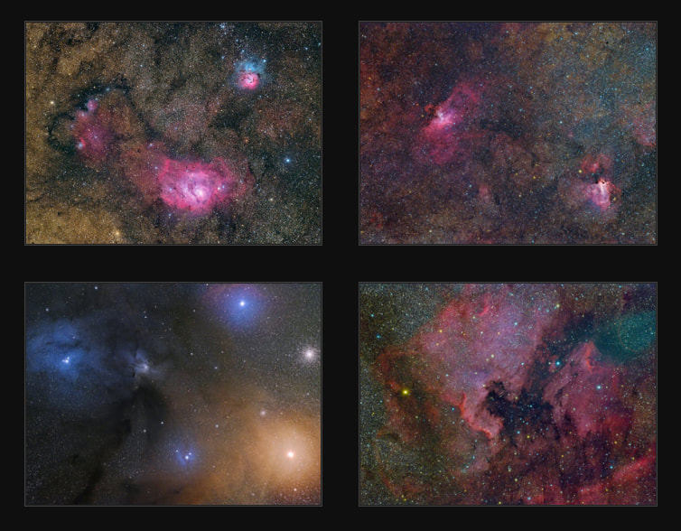

**THESIS** — Three factors allow you to streamline your imaging and processing workflows, should you choose, factors that arise because of the powerful hardware and software tools available to us today...

- Cameras that perform close to the ideal camera. (Shorter subs, lower noise)
- Software techniques and acquisition methods that can replace the need for calibrations to produce great images.
- Mounts and cameras that make unguided imaging easy.

---

Truth be known, I've spent more of my life studying astrophotography than any other ***single*** thing I've ever studied. And it's not particularly close. They say that it takes 10,000 hours to become an expert on something. If that's the case, then not only have I achieved such status, I've put in enough hours to be the valedictorian of my class. Indeed, if you could earn a university degree in Astrophotography, I venture to say that the first class in the curriculum might read like this...

## Imaging Dynamics 101

*Course Description* — In this survey course, we will look at the history, methods, tools, and troubleshooting techniques of astrophotography. You will learn to pay enormous sums of money to gain mild performance increase; gambling on factors such as weather, faulty electronics and software crashes; and pulling your hair out trying to figure out why your images are nowhere near as good as the other images you see on the Internet. We will explore each of a thousand things that could happen to image data and the ways in which variables can change to make you wish you'd taken up a more peaceful hobby, like quilting, instead.

The images are nice, as hopefully you'd expect when visiting a website about astrophotography, but what's not obvious is that these images were achieved with no auto-guiding, no calibrations, and no computer...just a portable mount, a telescope with a manual focuser, and a DSLR. With modern astronomy cameras based on CMOS sensors, the future of "easy imaging" is today!

For a beginner, you begin your education knowing that what you are ABOUT to do is challenging. If you were anything like me, THIS was the appeal. But for others, especially those who have expectations of great images on the first night (surely you don't) or for those who cannot solve problems as they arise, you soon wish that astrophotography wasn't so...involved. Not only must a thousand things have to work right at the same time, you discover quickly the sheer number of things that people SAY you should be doing to get good images.

And traditionally, they'd be correct. Focusing in the dark means finding reliable methods, either manually or automatically. Enter the concepts of Bahtinov masks and "robotic focusers." Dark skies also means LONG exposures, which means tracking the stars with a "mount" that uses drive motors to compensate for the earth's rotation. The popular advice would be to employ an "autoguider," especially with larger lenses or longer focal length telescopes. Of course doing so requires more equipment...more software...more technology...and more oversight. Such exposures, especially with high read noise CCD cameras, could bring people to say that you need to take "sky-limited" exposures, meaning knowing what the optimum exposure time would be to overcome the read noise hit to an image. And because these exposures are longer and the cameras likely build up thermal "noise," the sensors themselves will likely require "calibration" to achieve consistency and uniformity across the entire array of pixels. And this is also true optically, since optics can be calibrated to eliminate typical problems where field-flatness is concerned. Surely, somebody told you that "flat-fields" are required. And while one-shot color (OSC) cameras make the job much easier — since we don't have to calibrate individual color channel data as we do with grayscale sensors and diachromatic RGB filters — the amount of post-processing required to make great images is a huge learning-curve, not to mention an additional software expense that many people fail to anticipate. Of course if you've asked enough people, you'd surely discovered that PixInsight and/or Photoshop are "required."

For many years, I've attempted to be sensitive to the needs of the beginner here at ALL ABOUT ASTRO. In my article on [Data Acquisition Best Practices](/learning/best-data-acquisition-practices/), I tell you what you need to be worried about, those tasks you need to focus on FIRST that strongly impact an image and that you should strive to learn the most important practices first. In fact, all of my articles and writings have one goal in mind...to make the hobby more entertaining and less frustrating for those who choose to do it.

But the tips and tricks learned here aren't for beginners alone. I'm astonished how many people, in the hobby for years, don't really know WHY they have the workflow they have. Moreover, spend any time on Cloudy Nights and you will find yourself being told all the things you MUST do to a dataset if you hope to get the most from it...and this pressure you feel is no respecter of persons. People giving advice typically would NEVER tell you that you can get good images without flat fields or dark frames or autoguiding.

No wonder the hobby is difficult, because the beginner feels they have to do EVERYTHING right off the bat and the intermediate level imagers don't realize that their images would be just as good, or perhaps improve, if they'd just simplify some of their workflow.

***Let it be said that "getting the most from a dataset" will require everything that we are leaving out. People will always have the tendency towards squeezing the most performance out of their astronomy gear. But today, there's a "good enough" level that can produce better images than you realize, where some aspects of your workflow can be stripped away via good hardware purchases and software techniques to the point where you'd be hard pressed to know the difference between an image that does everything "right" and one with a simplified workflow.***

***DEFINING THE CONCEPT OF "EASY IMAGING"***

Everybody is a photographer. Look in your pocket and you'll find a camera, perhaps two, and you've likely already taken pictures today. It's so easy now. In fact, the quality of the camera in your smartphone supercedes the capabilities of yesterday's film cameras...or even some of the DSLRs introduced over a decade ago. Though I always contend that good photography is "all about the glass," even today's pocket cameras do a remarkable job of easily making good pictures with their built-in lenses. Besides, you 'Grammers probably put a "filter" on those square images anyway.

In truth, most people are content to get good pictures in the most simple way possible. This is true even for my friends with "a real camera." Be honest. I bet you still shoot in full "program" mode with your DSLR. If I say "full manual" or "aperture-priority," you probably don't even know what I'm talking about.

I too am guilty of being a "point and shooter," even though my DSLR camera provides capabilities far beyond a "point and shoot" camera. Truly, this is the nice thing about terrestrial, daylight photography...there aren't too many demands about getting what we perceive to be "good" images...or at least, good enough.

And then, there's astrophotography, which is something entirely different.

Many of us have been convinced that technological advances will allow for easier, better ways in the future...and some of that we've already seen, either in small measure or as a function of more advanced, high dollar setups. Companies like Meade already sell telescopes that remove our need to "guide" the image ourselves. "Autofocusers" can do the task for us. "PoleMasters," software-alignment software, and polar-alignment scopes have taken "drift" out of the setup equation. Periodic error correction (PEC) has allowed us to get more accurate star-tracking, lessening the load on our autoguider and, in some cases, has given us the ability to do unguided images for a short duration, particularly if the focal length is shorter. Scripting software can allow for completely unattended observations.

But in all cases, it requires not only more technological power and money, but also overcoming a substantial learning curve. Truly, these solutions are not "turn-key"; rather, they are the result of incredible planning and effort. Integration of technology within this hobby isn't passive, as with most of the ways that technology improves our lives. Instead, to this point, it has required active oversight within each and every aspect of our setup and workflow.

In light of this, I would propose that we should strive toward two ideals for our astrophotography, unless, like many of us, we just appreciate all the complexity.

1. Technology should integrate seamlessly into our tasks.
2. Technology should lessen the demands for what is required with our tasks.

The end result will be what I suggest should eventually become "easy imaging." Roughly defined, it's the ability to use technology in a way to not overly complicate a single process and to limit the number of processes entirely to get better results. Certainly we thought it would happen at some point, but why, in THIS hobby, did everything start getting more complicated when we went to digital? It's understandable for a certain amount of time when the technology is new...but at what point should it begin to make things easier? When will this hobby start to forgive us of the difficulties of combining high-tech with such a difficult application of it?

And perhaps that is the word to use...we need our technology to be more ***FORGIVING.***

***TOWARDS A MORE FORGIVING WORKFLOW...***

When you think about terrestrial photography and the ease in which we can take good pictures, technology yields a variety of improvements over the way taking pictures with film used to happen.

1. User adjustable gain.
2. Autofocusing.
3. Remote shutter release.
4. Self-timer.
5. Automatic metering.
6. "Program" mode.
7. Sensor cleaning.
8. Video capabilities.
9. Auto-dark frames.
10. Auto-zoom.

***Calibration-less Images...***

We typically take dark frames, bias frames, and flat fields to calibrate and flatten our sensors and optics (see [How to Calibrate Your Data](/learning/how-to-calibrate-your-data/) for more). But in the easy approach, I want to demonstrate how in many cases we can remove the calibration step from our workflow entirely and still yield surprising results, so much so that you wouldn't know the difference in the final image.

**Ditching the Dark Frames**

Back in the olden days of CCD imaging, we really didn't have much of a choice...we had to subtract dark frames from our raw data. In fact, our sensors were rated and priced according to their quality and number of defects. As such, we could purchase a Class 2 KAF-6303e sensor should we want, for a savings of as much as a few thousand bucks, but that would come with more dead pixels and at least two column defects. But even the Class 1 variant would have a column defect and some dead pixels that needed to be fixed, and the only real way to do that was to "map" those separately and then subtract those from each subframe using a separate process — dark frames didn't work here since those only fix thermal variations on a pixel's gain.

Compounding the issue was that our cameras had worse thermal and read-noise performance than modern equivalents, so truly it made sense to do everything we could to make sure these unwanted signals and performance limiting noise was calibrated out of the image.
