An astronomical image can be defined as:

*The conversion of camera "data" into a format THAT CAN BE INTERPRETED with the human eye that conveys either a scientific goal or an artful presentation.*

Emphasis is placed on the "that can be interpreted" part.   In essence, this is the TASK OF IMAGING PROCESSING.  It's both the job of the software program AND the person using it.   This job is subject to all kinds of techniques, philosophies, and ethics, which is what makes this whole thing somewhat difficult.   Consistency in image processing is remarkably hard; and no two efforts will ever be the same.

To drive this point home, see the figure at right.

The goal of this article is to provide a broad overview of the TASK of IMAGE PROCESSING, so if you are learning via a video or a tutorial you can know why you are doing what you are doing.

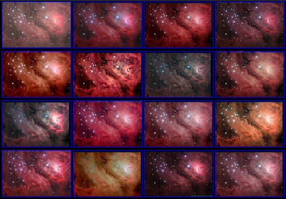

The Lagoon Nebula processed by 16 world-class astroimagers using the same Jim Misti archived data. Multiple interpretations here or merely diversity in techniques... feel free to discuss.

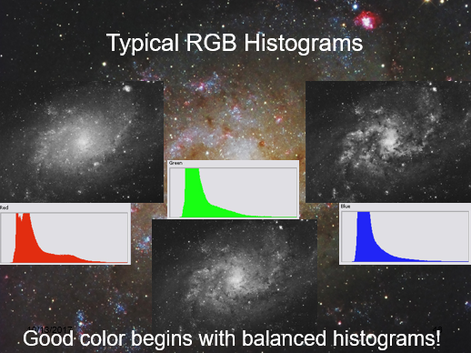

Whenever it is that you decide to merge your RGB, you will strive to make similar adjustments to each of the color channels. The visual indicator for this will always be your histogram. Some variance in shape indicates that some localized or independent processing of a channel was done; here, I have hit the red channel with some saturation to boost the emission nebula in the Pinwheel Galaxy (M33). But the thickness of the "hill," as well as its starting and ending points should be very similar (with some exceptions when working with h-alpha data).

To start, we need to form a distinction between image "data"  (that RAW data which comes from the camera) and the image itself (our final goal).

## Data in the Raw

When a camera collects sky photons, it fills up pixels with electrons captured by the silicon chip.  At the completion of the data acquisition stage, the camera's AD converter takes the charge held by the pixels, digitizes it on a scale of 0 to 65,535 illumination levels (in a 16-bit camera), also referred to as ADU's (analog to digital units) and then reads out rows of pixels into a data file of your choosing (see types of data files later).   Because of the headroom of cameras with large bit-depths (a large range of brightness representations), sky subjects (other than bright stars) rarely fill up the pixel wells beyond a small percentage of those available values.

This shows itself when you first open your astronomical image data as total black.   This is because your eyes detect less than 8-bits of illumination (256 levels) on a computer monitor, yet your camera has only recorded a couple of 256ths of illumination values (except for the bright stars).   Hence, your monitor shows only a small fraction of what the CCD was capable of recording.

It's simply not like looking at the LCD on the back of your DSLR, which is typically used to collect a lot of daylight photons AND which pre-processes so much of the data for you.

So, as astroimager of dark things, your job becomes to display the data for visual representation.  This information must be "scaled" in such a way to show the object shadows, mid-tones, and highlights without:

- Cutting out shadow detail (clipping)
- Over-saturating highlights
- Revealing objectionable noise in the data.

The objective to converting your data-set to an image, therefore, is process the image in such a way that emphasizes the most important parts of the data's range.   An image results from the efforts.

## Getting Started

There are two trains of thought as to how you should begin.   One school says that you must merge all of your color channels together first.  And therefore you would do the following procedures to the single, RGB image, working carefully to keep balanced histograms (see below) in the image as you process it.  This assures proper color balance throughout the process, which is typically the goal (and conviction) of the first school of thought.

The second school says that you treat all the channels of data separately, as the grayscale images that they are, and then merge them afterwards.  It's advocates might say that doing so assures the best S/N because you avoid global adjustments to multiple channels at once and you are better able to detect subtleties that only show up in a single color channel, which is likely something that might service as a point of emphasis in the image and therefore requires a gentle touch.

I tend to favor the second approach because I see value in it.   Plus, I feel like that unless you are really crazy about getting "true color" in an image, then you would likely be changing the color balance aggressively at some point later in your processing anyway.   And of course, looking at the image above, you can probably see what I think about trying to chase "true color."   After all, which of those 16 images of M8 is "truth"?

Whichever way you choose, this article will not distinguish between the two...so when I talk about "stretching the data," for example, you should assume that I mean doing it globally for the RGB-merge-firsters and doing it in triplicate for each color channel for those who want to each channel separately.  In other words, the processing software does not care what type of image it is (grayscale or color); you will proceed the same way.

## Choosing a Data Format

When you first open your acquired 16-bit camera data in Photoshop, CCDStack, or other software of choice, the software immediately takes the data's total illumination range and sorts it into 256 levels.   The software itself preserves the dynamic range within each of the 256 levels (in 16-bit data formats), but since computer monitors are incapable of displaying MORE than 256 levels per grayscale dataset (which may or may not contain individual color channel data), Photoshop merely labels sections of the data in 256 separate "containers."  Therefore, when we manipulate data in the 128th level, for example, we are affecting the 256 different illuminations that were originally sorted within that level.   The scaling is applied to all those illuminations separately, weighted according to the scaling scheme.

This makes the file data format very important.  If you want to preserve the full dynamic range, you must choose a data file format that is capable of holding the complete data set (16-bits) without truncation or compression.  If either happens, you lose parts of the dynamic range originally acquired by the camera.

The obvious way to lose data is saving your data set into an 8-bit file format.   Because 8-bit data files are only capable of holding 256 levels (2^8) of illumination per grayscale "channel," the format will truncate the data to fit those 256 levels.  Therefore, instead of preserving the individual illuminations within each of the 256 levels, it makes all of them the same.  Therefore, your "dynamic range" in a single grayscale image is automatically reduced from a potential 65,536 levels (0 to 65,535) all the way down to 256 levels (0 to 255) of illumination.   Not good.

Now, you might argue that since color monitors are not capable of displaying anymore than 8-bit RGB data, then why do we need the data within these 256 levels?  After all, a color image with 256 levels each of red, green, and blue channel data STILL produces a palette of over 16.8 million colors!

But, it can be deceiving, as 16-bits do not appear to give a visual advantage over 8-bit formats.   However, the nature of our hobby is to capture photons of very dim objects...and we desire EVERY photon to count for something - they aren't all that abundant!

As an example, the fainter details in the image might have a range of values with ADU counts in the 400 to 500 range...a range of values that you want to differentiate!   Keeping in mind that a 16-bit camera produces up to 65,535 ADU levels in total, then you will need to preserve this with a 16-bit file format (or better).   But if you convert to 8-bit, both 400 and 500 ADU values (and everything in between) automatically becomes 0 in Photoshop (fitting 65,536 ADUs into only 256 "slots"). This means that not only did you turn 100 dynamically different elements into a SINGLE output value, you made it ZERO (which is absolute black).

Gone!   Poor!   Nevermore!   You lose data that never even had the opportunity to become one of those millions and zillions of colors!

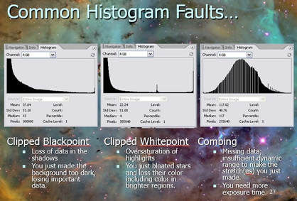

Whether you are choosing a file format, performing a "stretch," or trying to protect your data, you will need to pay attention to the histogram. "Clipping" is an indication that you've lost data on the upper and lower ends (the extreme faint and bright parts of the image). "Combing" typically occurs because the image lacks the dynamic range to perform the stretch you are trying to make.

Such egregious errors typically result in a "combed" histogram (see left) at some point during processing, where the gaps in the data caused by truncation into the 8-bit format become very apparent...the data is gone (only 256 brightness levels remain) and there's not enough to fill out the histogram "hill."  So when you see a combed histogram, it's your signal that you went VERY WRONG some place in your processing.

Another way to lose data is by choosing a file format that uses a "lossy" compression scheme, designed to reduce the file sizes.   GIFs and JPGs are the common examples of lossy file formats.    Thus, you will want to work in a TIFF format (when using Photoshop) or the original astronomical FITS when using dedicated astronomy processing software.   PixInsight users will likely want to use their proprietary XISF format (though FITS is typically fine).

However, a couple of comments concerning JPEGs need to be made here; and a myth that needs to be debunked.

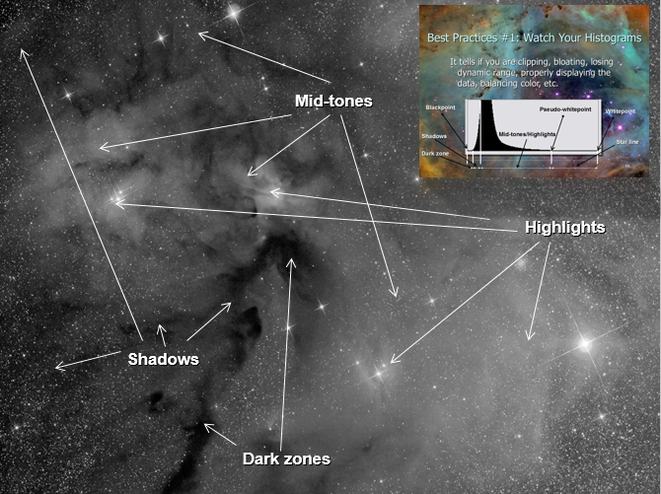

The histogram corresponds to different zones in an image, as shown. When you "stretch your data," your goal is to maximize the content of the image, allowing all parts of the image to show its awesomeness. Noise will tend to crop up in the shadow areas first.

First, the amount of compression used in a JPEG is user-configurable.  It is possible to opt for a "compression-less" JPEG format, which does NOT lose information (and the size of the file will show it).   So, calling all JPEG files "lossy" is somewhat inaccurate.  Second, the JPEG does a smart job with its compression scheme.  It greatly reduces file size by eliminating much of the RGB data; however, before doing this, it takes luminance detail from the channels first.  Therefore, it is able to compress the three color channels substantially while retaining its total luminance.  Because of the way the eye perceives luminance data, nothing is lost once the color is recombined.  Thus, as much as people think that working in JPEG is a bad thing, it is very doubtful that even the most experienced processor would notice a difference.   In fact, many expert photographers work exclusively in JPEG for this reason...and they save storage space and processing power to boot.

## The Screen Stretch

Once you have opted for a working file format - be sure to archive and protect your RAW data - then you will need probably want to begin "stretching" out the data that is mostly hiding in the left side of the histogram.   Remember, you are likely staring at a black image right now!

Most dedicated astronomy software (like CCDstack, MaxIm, and PixInsight) will allow you to auto-stretch the data, just to get a preview or glimpse of what the data would look like once you DO stretch it.  In CCDstack, you apply a temporary "DDP" stretch using by clicking the "auto" button and then refining it with a simple slider.   Many beginners may which to actually use this as their permanent stretch of the image, since usually serves as a good intermediate base-line for any refined stretches (you would likely want to apply local contrast enhances later on).  To do this, you would need to "Save as scaled", meaning that the image is saved with the stretch you see.   Otherwise, if you close CCDstack without saving, the will return to the same black, untouched image when you reopen it.   In other words, the "screen stretch" is non-destructive until you actually save the file (or do other processes that DO permanently change the image.  Regardless, you might want to re-save and re-name the working document at various stages in case you want to restore the image at various parts.

MaxIm allows you to stretch the data our temporarily using a simple slider, but you are limited on only parts of the data to be displayed...any processing move like DDP would be destructive...not merely as screen stretch or preview.

PixInsight uses the "ScreenTransferFunction (STF)" dialog (process) whereby you can manually-adjust or auto-adjust to see a preview of the image.   This is only a temporary preview, but you can make it permanent by dragging the STF settings onto the "HistogramTransformation" process dialog.

Back in the old days, the first processing step was typically to make your screen stretch permanent, turning your black, RAW, "linear" data into a non-linear "stretched" version  - which is actually logarithmic in nature, meaning that shadows are stretched more than the highlights.   Now, we understand that there are things like "gradient removal" and some forms of noise reduction that are better performed when the data is linear.  This means that you need to actually see a preview screen stretch in order to perform these processing steps...otherwise you cannot see what you are doing!   Then, you make it non-linear by making your stretch permanent.

Interestingly, if you open RAW data into Photoshop (usually having saved it as a 16-bit TIFF in your stacking software), there is NO WAY to screen-stretch the data without making the changes permanent.   And to do so, there is no "auto-stretch" button for this...you would need to use multiple iterations of Photoshop "Curves."   The positive is that you can learn to gain very good control over the entire process this way.   The negative is that you must do this step first in order to see what you are doing...so there can be no benefits gained to early processes like in PixInsight.

## Preserving Dynamic Range

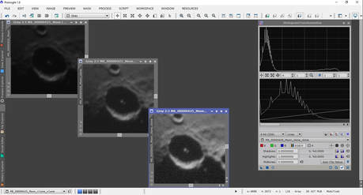

How much is too much? Click on the image and you will see how the data isn't sufficient enough to brighten up areas of detail without a severe noise hit. Will noise reduction work now or will you need better (more) data? Example here is shown in PixInsight.

I have alluded to the point that differing details can be separated by only small ranges of ADUs.  As an image processor, we are hoping to distinguish between those levels in a way that is noise-free AND pleasing to look at.  This is a difficult task, since this typically occurs in the faintest parts of the image where there is naturally low S/N (signal to noise ratio).   Thus, you will need to strike a balance...just because you CAN put contrast and separation between neighboring areas of detail doesn't mean you actually have the quality of data to do so cleanly.

It is this understanding of "dynamic range" that ultimately makes you are better processor of data (see Sidebar: Defining Dynamic Range below).   It's a juggling act of recognizing what you CAN do versus what you CANNOT do in processing the data.    This is immediately understood in the initial "stretch" of the data.  How far should you go?  Where to stop?  Will some form of noise reduction help?

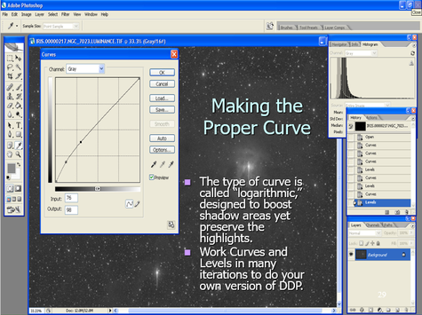

In Photoshop, you would use Curves (with Levels) to stretch your data. Shown is a typical curve, whereas shadow areas receive most of the boost. Guard the right side - make sure the input values match the output, else you will push the already bright values too far to the right. The consequence is a loss of color (especially stars) due to over-saturation (the brighter it gets, the more white it becomes).

Take a look at an example using an easy target like the moon (upper right).   Noise is always most evident in the faint areas of an image and it always becomes more objectionable when you attempt to show detail in those areas.    I would suggest that the center image, while demonstrating some noise, is likely something that a little noise reduction will handle.   While I like the brightness and contrast in the second image, there's just not enough quality in this range of data to stand up well to any noise reduction attempts.   I would reshoot the image striving for slightly longer exposures to make sure that the dynamic range in these areas have higher quality S/N.

Of course with an image of the moon, we are talking fraction-of-a-second images...so I likely could go quite a bit longer with the image without putting a lot of pressure on things like mount tracking, guiding, etc.

But imagine if this were the outskirts of a faint galaxy, where I am attempting to show the wide extent of the galaxies arms...or perhaps its ejecta?   First, you'd need to understand that additional exposures to yield sufficient, usable dynamic range might require additional image time measured in HOURS.  Secondly, you need the experience to know, typically before you image, of the existence of such details and what it might take to bring out those details in processing.  After all, we don't always have the luxury (or the desire) to need to retrain the scope on the same target AFTER we've already processed the image.  And finally, you need a lot of skills to bring out subtleties in such areas if you hope to get something out of the dynamic range you do have.

Also consider this...when you captured the data, did you execute well?   Was focus good?   Autoguiding?  Was there anything you could have improved on to improve dynamic range here?   When you see such noise in the faint areas of processing, you begin to realize that small things in acquisition can absolutely kill your dynamic range.

And it doesn't stop there...certainly you took quality calibration frames and accounted well for thermal noise and optical artifacts, right?   Did you choose the appropriate settings and algorihms in the stacking or intergration stages?

And, for certain, you are working in the correct file format?   Please say that you are.

What you will soon discover, if you haven't already, that your ability to process an image in direct proportion to the quality of the data you are using.   Ultimately, it's about dynamic range, allowing areas of detail to contrast well against other areas of detail.   This is what makes for great astroimages.

## Star Masking

## Sidebar: Defining Dynamic Range

The term "Dynamic Range" derives its origin from the film days. Specifically, it refers to the amount of "dynamic" content in an image.

The metric for this was the amount of contrast in an image, from darkest shadows to brightest highlights, and all the shades in between. Essentially, it's the ability of the photographer to use a camera to record the scene the way it is visualized. It's the faithful rendering of a scene, whereas if a level of brightness is witnessed by the photographer, then it is reproduced accurately on film.

The result was always measured in "stops," or the number of times that the level of light doubles in an image, corresponding to the same way that lense apertures and film speeds are measured. Therefore, if an image could not display several levels of illuminations, with prominent details displayed in all those levels, then the image was not "dynamic." This would result in an image that hides significant areas of detail, showing limited contrast and overall range.

The concept was very important in film photography because of the way film responds to light. In order for film grains to be sensitized (to actually record information), a minimum amount of flux (photons over time) has to be recorded. Therefore, in order to display details in shadow areas, the photographer had to assure that enough light is recorded in those areas, all the while not oversaturating the very bright areas of the image. In that case, the photographer would "expose for the shadows and process for the highlights."

This is the philosophy of the Zone System as popularized by Ansel Adams. Adams felt that if a film was capable of recording information, then it was his job to get everything out of the film, up to the threshold of what the film could record. This is because Adams understood that the limit to faithful reproduction of nature scenes was not the condition of something like El Capitan in Yosemite, but rather the recording media itself.

To do this, Adams judged a scene to have several levels of illumination, which he divided into 10 "zones," and then sought an exposure time that would be certain to show details in the dimmer zones (he focused specifically on Zone 3). Simply put, if the film didn't record the information from the darker parts, then there would be no hope in bringing it out in processing. Similarly, he knew he could control the highlights in processing by using a variety of processing and printing techniques in such a way that he could preserve these brighter areas. "Burning" and "dodging" are examples of such techniques.

Much has been made about the Zone system regarding how "complex" it is, but this is only because Adams, by his own admission, didn't explain it very well in his early writings. In its simplest form, it is a tool; a method for rendering a scene as faithfully as possible. This philosophy, today, is synonymous with the term, "dynamic range."

Therefore, in concept, when we discuss Dynamic Range, we seek to express the same ideals within our digital world, namely, to reproduce all the illuminations of a scene as faithfully as possible.

Because of the subjects we are dealing with in astrophotography, where finding details in the shadows is always difficult, "dynamic range" becomes synonymous with "getting good S/N in faintest parts of an image."     This was also Adams' goal too; a concept known as "imaging to the right."

Unfortunately, unlike Adams, we cannot trust our eyes to visualize a scene since only the camera is sensitive to see what is really there.   But if we can image in such a way that we can push Zone 1 information (the faintest details) into Zone 3 brightness levels, then we will be able to provide nice, clean contrast in these important areas of our images.

We have discussed the importance of protecting the right side of the histogram (the highlight zone) when you perform your data stretches.  Failure to do so causes the already brightest parts (stars) to bloat, over-saturate, and completely loose all indication of color.

However, you should know that some people adopt another approach, namely to use a star-mask.

A star mask is like "dodging" in the old film darkroom, where you cover up the bright areas in an effort to prevent them from getting brighter, allowing you to spend more time brightening up the fainter areas.    In the digital world, we would do something similar by covering over the plethora of stars.   Then, if we apply something like a histogram stretch, noise reduction, sharpening, or other global processing task, the stars are masked off from the effects...like using masking tape when painting your baseboards.

The technique is effective; however, great care must be taken in how you develop the mask, especially as you attempt to segue between the active image and the mask itself.   As such, the risk is that you induce obvious transition problems between the processed and the protected areas within your image.

To make an effective star mask in Photoshop, you essentially highlight all the stars using some type of selection method (or action).  I would typically use the "Select Range" feature, expand the selection by a few pixels, and then "feather" by a few pixels.   At that point, you can do your processing moves by pasting this selection as an actual "layer mask," or you can simply invert your selection and apply your processing to the image in another Photoshop layer.   I typically favor the later method.

Or, you can use a Photoshop Action, like in Noel Carboni's Astronomy Tools Action Set which does everything for you - this is my typical approach in Photoshop for star-only masks.

In PixInsight, the task is a little more difficult, but also a lot more necessary since many of the automated processing routines (noise reduction, HDR tools, and deconvolution) REQUIRE you to protect the stars.  There are several ways to do a star mask in PixInsight, though the "StarMask" process is the most straight-forward, albeit less-intuitive, approach.

Regardless of the software, a good star mask allows people to do be less careful with stretching the majority parts of an image since the stars are safely hidden under the mask.

Because I am very careful when I stretch my highlights, I am much more likely to mask stars to protect them when applying a sharpening process, regardless of the software I use.   Instead, I find the technique is most useful to protect ANY area of the image, not just stars.  For example, I might mask off EVERYTHING except the background to apply noise reduction.  Or, I would likely mask off everything but the mid-tones to apply localized contrast (see Other Techniques at the end of the article).

As opposed to a star mask, another simple technique that I'll often employ is to process separate images, one as usual, and then another that works ONLY the stars.   Then, you merge (or mask-in) the two, gaining the best of both worlds.

As such, because there are so many ways to kill those proverbial birds with a single stone, you can manage to have a really great imaging career without ever using a single star mask.   In fact, you should always remember that there are a multitude of ways to accomplish the same tasks in this hobby.

Having been around as long as I have, and having seen the emphasis being placed on star masks themselves, I have always felt that star masks greatly complicated the processing of an image for marginal gain.   I reserve it for some of the more specific processes within PixInsight.

So, as you go forward, or as you look at the processing "workflow" of others, I like to tell those who I mentor not to obsess too much about masking stars.  It's one of those things you can add later on as you explore more powerful ways of doing something, especially if you aspire to be a master PixInsight user.

## Noise Reduction

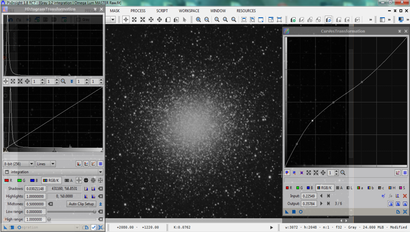

What a typical stretch looks like in PixInsight. Notice the similarity of the curve with the Photoshop curve (shown above). Care must be taken NOT to overly brighten the core of objects like this, especially if you hope to differentiate between the old and new stars in a globular cluster. Over-saturation makes everything completely white.

So now that you have your image stretched out, producing an image that displays all the tonal ranges you wish to show, you should save a version of it.  I normally save many "working images," perhaps putting the name of the processing stage in the title.

At this point, you probably want to begin addressing that noise in your image.   Even if you did some noise reduction in the linear stages of the image (pre-stretch), it is very likely that the detail you want to show in the shadows will still require some post-stretch noise reduction techniques.  This is especially true if you are working color channels in an LRGB image - color channels can be attacked judiciously with noise reduction when you have a bunch of clean, clear luminance data that you will be applying to the image (see Luminance Merging in the Other Techniques section at the end of the article).

The biggest problem with noise reduction techniques, in my opinion, is the overwhelming number of options, routines, and software that you have.  Since noise reduction is often a requirement in MANY forms for digital image processing, it opens up so many options beyond Photoshop and astronomy-specific tools.   And honestly, whatever gets the job done, then good for you!

Ultimately, the choices are largely made on the basis of the comfort level of the user; the ability to put ones experience into play.  In other words, what works well for me may not work so well for you.

For the most part, any good solution will provide all or most of the following features...

**16-bit TIFF Processing** - Less a issue today than in year's past, you need to make sure that your NR software handles the same file format and bit depth that you are use in other forms.  This can be a bit tricky for PixInsight users, as they will have to exit FITS or XISF format in order to use an external solution (Photoshop too).

**Batch Processing** - Do you ever need to apply the same noise reduction steps to many images at once? If so, then you'll appreciate the ability to load multiple images singularly into computer memory and automatically apply your routines to an entire stack. Truthfully, I fail to see the utility in this, since we are normally working with master channels of specifically luminance, red, green, and blue images, and thus would want separate applications of NR on my channels. However, I could see a need in some tasks to clean up individual sub-exposure frames prior to the master combine step.   As a fan of early NR application in a processing workflow (I do some linear NR within PixInsight), this might be something worth exploring, particularly in low signal-to-noise ratio (S/N) data sets where either you lack enough subframes for outlier rejection combine methods (e.g., median, sigma) or those methods cannot guarantee sufficient clean-up of certain pixels.

**Type of Package** - Standalone "exe"? Integrated routine? Plug-in? Photoshop action? Often, the biggest decision when choosing a noise reduction solution comes in deciding the type of interface you need in your NR software. Adobe Photoshop is a big player in this decision, simply because it dominates the processing landscape, and a tidy add-on makes a lot of sense, whether it expands the core options in the form of a filter "plug-in" or it takes advantage of the "action" macro.   I love the aforementioned Astronomy Tools Action Set, as it provides a nice global set of processes with the ability to apply to "selection only" within an image.

Other software makers take a different approach and realize that there is a market for a solution that stands on its own and does not require prerequisite software. These often reasonably priced "executables" are powerful options because they afford the opportunity to investigate multiple, advanced, or "smart" algorithms and batch processing modes without the heavy encumbrance of bulky memory overheads of larger core processing kernels, such as with Photoshop. (How long does it take PS to load on your PC?). Finally, there are integrated solutions as standard fare with the processing software you already use (e.g. PixInsight, Photoshop and MaxIm DL). These options need to be investigated if only to discover if a third-party solution might be desired.

**Manual Filter Controls and Multiple Undos** - No matter the software, the ability to affect the amount of aggressiveness or to completely undo an effect is very important. This is the advantage of a program like Photoshop, as plug-in filters and actions can be controlled by the opacity settings and adjustment layers, or by retracing your steps in the workflow history. Or some people might like the ability of programs to offer a wide number of parameters to give weight to particular aspects of a filter, and then to preview the effect in a "preview" mode, after which dumping the result with the "undo" function should it not meet expectations. In other words, the option to control the parameters of a filter manually are important, and you will appreciate a program that will do exactly as you set it.

**Intelligent or "Automated" Mode** - The converse to controlling the NR process manually is to have a processing mode for total automation. The nice part about a lot of solutions is that, in many cases, the user can push a single button and remove noise as the program identifies it.  Beginners should be fond of filters that do all the work for them, and that should make Photoshop NR actions high on their list of choices (there is a learning curve though).  But for some people, they are reluctant to give up that control, fearful that the aggressiveness cannot be tamed, or that it might not apply NR to the right areas. But for the most part, especially when coupled with a good preview mode or undo button, automation can be a nice feature to have, for beginners and advanced users alike.

**Multiple NR Algorithms** - The problem with old versions of Photoshop, among others things, was that you were limited on the types of filters for noise reduction. "Despeckle" and "Gaussian Blur" are the standard old routines, which can be effective if used on small selections in the image; however, they convolute pixels by averaging groups together. The result is normally a blurring of image details in the areas you do not want. They lack sophistication and global control. Newer versions of Photoshop actually have more intelligent filters geared specifically for "noise removal." These do a much better job by differentiating noise within the lower S/N areas, allowing you to set the parameters for reduction and thereby applying its function more selectively. Many other software NR solutions will bundle lots of nice algorithms for a wide variety of uses. As such, there can be more versatility and power to the user. However, more functions can mean a steeper learning curve.

**Extra Algorithm Bonuses** - Aside from giving noise removal tools, many packages, especially Photoshop Action sets, can give a wide-range of additional tools as well. Noel Carboni's Astronomy Tools Actions for Photoshop represent a tremendous value once you account for all the other slick and powerful actions. So, such solutions, while giving excellent NR algorithms, will also beef up the rest of your processing toolset as well!

**Astrophotography Specific** - Many packages, particularly those in the stand-alone category, may not be designed specifically for astroimaging. The reason is obvious: noise infests terrestrial images too and that market is much larger! Keep in mind that some NR algorithms may have adverse effects based on the fact that it might have been designed with terrestrial images in mind (and this makes manual programming of the filters even more important). Similarly, these packages may not have as many usable tools as one that has "astronomy" as its focus. For example, Photoshop actions designed for astronomy could add routines for handling star clean-up, removal of column defects, and vignette removal as well. Lastly, be careful of file format options with your non-astronomy specific solutions. Most all solutions will offer output to 16-bit TIFF formats, which is my preference in Photoshop anyway. But for those who like to work their images in FITs, you might be limited to certain NR packages, else you will be forced to convert to another bitmap format such as TIFF.

**User-Friendliness and Learning Curve** - Often going hand-in-hand, these two aspects are probably the most important choice. Inherently, Photoshop actions will get lower marks in this area simply because many people do not understand them. Similarly, the simple task of loading a Photoshop plug-in may prevent a person from ever using it. Photoshop is synonymous with "learning curve," and this fact alone might have people seeking easily loadable "executable" programs with their own interfaces. For example, I have many friends that own the affordable and powerful Astronomy Tools Actions mentioned above, but seldom use them either because they find applying actions to be confusing or they have a limited knowledge of Photoshop adjustment layers.

## Sidebar: Global vs. Local Processing

When talking about a processing task, we often times have to make a decision whether we want it performed on the whole image (applied globally) OR just a part of the image (applied locally).

Your choice to do so typically depends on the process...and sometimes your philosophy and ethics toward a particular data set.

In Photoshop, every processing step will affect the entire image UNLESS you have selected an area yourself OR you have applied a mask to a given area.   In PixInsight, you are often given the ability to run the processes on single images or multiple images (global means "more than one image").

I typically run my local processes in Photoshop because I have better control over what I select.  In PixInsight, I seldom select anything (other than the occasional star mask) and I usually run the processes on the whole image.  However, it should be understood that many processes in PixInsight operate on wavelet layers of an image, meaning that you can opt to run only on particular "scales" (sizes of detail) within an image.   This is what makes PixInsight more difficult to use, yet more powerful when you can finally figure out what you are doing.

Philosophy (or ethics) often drives the decision between global vs. local choices.   It's less an issue today than in years past, but there was a time when many opined that anything more than a consistent "gamma" stretch equally to all channels and all parts of an image was just "not real."    Today, there is a wide swing of opinions, from miserly use of processing all the way to "anything goes."    For the record, I am in the "anything goes" camp, as I believe it becomes "art" from the first decision we make (see the 16 Lagoon images example above).

For me, I value local manipulations of data in order to target specific areas of noise, sharpening, or specific areas for contrast enhancement (see Other Techniques later in the article).   I also will typically work another image separately for stars or bright areas that require masks, such as the cores of M31 and M42.  Of course, this requires working on a "selection" of the data.

## Noise as It Relates to Image Type

As I alluded to earlier in the article, I value noise reduction when the image is in its linear stage.   Typically, this requires the ability to impose a temporary screen stretch to the data so you can see what you are doing; therefore, I use PixInsight, not Photoshop, for linear noise-reduction.   I favor MultiscaleLinearTranform at this stage.

Once I make my screen stretch permanent with with non-linear stretches (using the HistogramTransformation and CurvesTransformation processes), I will normally apply ATrousWaveletTransform to handle additional noise in the shadows that remains.    I also will apply SCNR at this point to handle the typical green color bias that occurs, if I am working on a merged color image.

But this is where I diverge a bit.   From this point forward, the handling of noise depends mostly on the type of image that I am processing.   Because I usually work my color channels separately, the first task in Photoshop will often be merge channels  (if I didn't already do it in PixInsight followed by SCNR).    Then, it all depends on if I am processing a luminance image or an RGB color image.

When working on luminance images in Photoshop, I will typically select regions of the image where there is still objectionable noise and will target those with either the Carboni "Deep Space Noise Reduction" Action and/or perhaps the "Dust & Scratches" filter.   Care must be taken with luminance data, since this is where the "cleanliness" of the image is most important.  This has to be balanced with protecting the fine details of the image, which is usually the hard to walk line, particularly if your data is not all that solid.

For already merged RGB color, I attack noise aggressively, meaning that I will often do heavy Gaussian Blur (with a bump to saturation) on a large portion of the image.  I eradicate color noise and you should too.   Of course, I typically have solid luminance data that I will merge later.

in the event that my image is entire RGB data (no luminance taken), then I will still use the LRGB process - extract the luminance details first (I temporarily convert to LAB color mode and copy/paste as a second layer over the original RGB.   Then, I work the layers separately like I would handle any luminance and RGB data.

## Sharpening

Sharpening (or deconvolution) in an image seems like the thing that all the cool kids do.  But like me too, you've probably embarrassed yourself more than once at the party!

You MUST get one rule into your head.    Sharpening MUST be applies on high S/N sources in the image (i.e. the brighter parts).   Therefore, if working the image in Photoshop, you want to avoid global instances of sharpening on luminance data since it will inject noise into your image - something you don't want to do when you just cleaned it all up in your background!   But, when the image is bright, with strong signal and little noise, then you will likely want to make the details standout with some small radius sharpening - I use either the High Pass or Unsharp Mask filters on a feathered selection on the image.  Make sure your localized selection includes only those brighter, detailed portions of the image...remember sharpening injects noise and you need those high illumination to cover up the new noise you just added.

I typically do not use sharpening in PixInsight, though if I have an enormous amount of "average" seeing data, I will sometimes use the Deconvolution process there.  I feel that I want to control this better; Photoshop always gives me that feel of control.   Sharpening can also be accomplished through Wavelets in PixInsight, in a way similar to how the lunar and planetary imagers do their processing in programs like Registax.  I just find that long-exposure deep sky data typically lacks the S/N to support a large amount of sharpening - and therefore I do it in extreme moderation.

I never sharpen the color channels of a image.  Never.   Only the luminance, and only if the S/N supports it.

## Other Techniques

Many of the workflows you've undoubtedly seen have additional steps that need to be mentioned.   So, let's look at some other techniques that you might see when processing a data set.   You decide if they merit incorporation into your own workflow.

**Gradient Removal** - This is typically NOT an optional step.  If you are imaging through LRGB filters (or with single shot color cameras), then you will want to be sensitive to any even illumination caused by light pollution (especially the moon) or localized lighting (like computer displays or street lights).  This causes a linear gradient (or gradients) in the image running in the direction of the light source.  Because gradients are somewhat easily seen and modeled, you will want a solution that can remove it.    Like Noise Reduction, there are many different programs, plug-ins, and processes that can accomplish this task.   Personally, I use the Dynamic Background Extraction (DBE) process in PixInsight for this.  The process allows me to manually select various background sky samples in the image and then choose "subtract" for the application method - "division" can be used to handle any vignetting remaining from poor flat-field application.  I typically use this on the individual master channels for luminance and spectral band images.

For color images, I often do this on the merged RGB, allowing DBE to work on the color biases as it sees fit.   Color gradients can be tricky, since their direction can be different depending on the filter used.   Likewise, multiple light sources can produce multiple gradients.   Thus, a process like PixInsight's DBE can provide a nice way of performing this difficult task.  Incidentally, there is also a totally automated process for LP removal in PixInsight called AutomaticBackground Extraction, though you lack the ability to exhibit control over the background sky samples that are selected.

DBE, or any linear gradient removal, is performed early in the processing workflow when the image is still LINEAR.  However, if Photoshop is your only method for gradient removal, then you will have no choice but to do this after you have stretched the image.   At that point, you can apply various Actions (again, the Carboni set includes a good one), or you can actually do it manually by using the Info tool to measure the gradient, duplicate the gradient with the gradient tool, and then subtract it away as an adjustment layer (difference blending mode).   If you favor manual removal of gradients, then make sure you do them on the separate color channels, since gradients can take on different directions, especially if there is multiple light pollution sources.   At the later point, you will be excited to have a program like PixInsight to do the dirty work for you.

<blockquote>Important Tip: Learn to use the Info tool within Photoshop (or any other similar software).  It's a valuable way to judge the nature of background values (among others) in the image without having to rely upon the eye test.</blockquote>

**Localized Contrast** - The goal in image processing is typically to faithfully render all of your data over the entire dynamic range of values, taking care not to give away any of those closely separated details though poor processing choice or execution.   However, there are often times in any image when you might want to surrender some of the intermediate values between objects of detail so that you can really set apart their differences.   As such, you might want to put some localized contrast enhancement in order to make lunar "rays" more obvious on the surface, or to make stellar dust pop out more from the background, or to show off the contrast in a galactic core, like M31 (see below).    Essentially, adding such contrast gives an image more of a 3D look.   Such a process would be done on an image that has already been stretched, usually done at the towards the end in order to give things a little more "pop"!

To accomplish this, a large radius "deconvolution" (sharpening) of the image is normally required.   The best way to simulate this is by opening an image, choosing the Unsharp Mask filter, setting your amount slider to around 20%, and then setting your radius slider anywhere from 5 to 100 pixels, or more.    Experimentation (with the settings) is good, but you probably want to apply this to an adjustment layer and on a selected/feathered area only.  Any sharpening method injects noise, so those same rules apply.    With an adjustment layer, you can come back and control the amount of contrast to apply, yet another one of those aspects that sets Photoshop apart from all the rest (see Sidebar: Photoshop Layers for more details).

Within PixInsight, the LocalHistogramEqualization (LHE) process accomplishes something very similar, allowing the user to set a Kernel radius and amount of effect and a contrast limit.   Since the process is global (unless you have used a structure mask), care must be taken not to inject noise into parts of the image.

In some cases, I use the HDRMultiscaleTransform process in tandem with the LHE, since the latter will often boost the white point too much, something that can be regained with the former.   HDRMultiscaleTransform essentially increases dynamic range in an image, working to compress highlights (and boost shadows) and allowing you to see details that might be hidden in such areas of increased saturation (see image below).

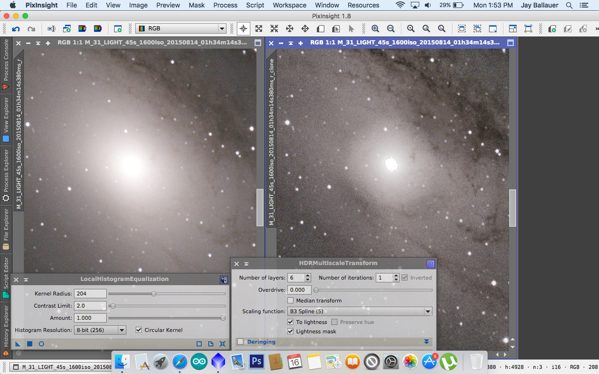

Single 45 second image of M31 core (Nikon D810A and Celestron RASA) demonstrating localized contrast enhancement. Left image is a gamma stretched histogram only. Right image uses LocalHistogramEnhancement to bring out dark dust and HDRMultiscaleTransform to compress the core. The result is an example of how the PixInsight processes can work together to bring out detail in an object by raising areas of local contrast. Notice the increase in noise, however. You want to apply any such contrast techniques on high S/N images.

One of my favorite ways to apply localized contrast is to use Carboni's Local Contrast Enhancement action on the luminance of an image.   I typically select the areas I want to apply the process on, using a generous feather, and then run the action, also running "per selection only" and "as layer on top."

The results are automatically placed by the action in a layer above the original image.

## Sidebar: Photoshop Layers

As you probably noticed, I favor PixInsight for a wide variety of my processes.   But I, like many of us - even some of the very best in the hobby - still use Adobe Photoshop (PS) as our primary processing software.     For the most part, this is because of the enormous amount of control that PS gives over the process.   Whether being the convenience of having infinite "undos" with the History palette or the simple ability to select exact what you want to affect in an image, Photoshop feels very comfortable to those of us who care about what happens to each pixel.

But most of what keeps Photoshop the current standard in our hobby is the ability to process images in Layers.    Akin to stacking negatives together in the old days and setting an opacity for each one, PS quickly and intuitively allows us to see the effects of each layer of processes.  And it allows us to apply these processes on portions of our images (as with masks) using a variety of blending modes over a range of opacity settings.    Or, we can specify them as actual Adjustment Layers, whereby each layer has a specific use.

We can even add text to a layer for custom made posters of our astroimages!

The most recent versions of Photoshop have taken Layers a step further, allowing us to treat them as Smart Objects and then applying stacking modes to them, such as "mean."  Thus, we can now do stacking in PS without having to mess with the opacity settings of individual layers.   I found this very helpful when compositing this year's total solar eclipse corona image, which required manual control over the alignment process.

Therefore, Photoshop's power comes in its intuitive feel of seeing the processes stacked in Layers.   This is what sets PS apart from all other software packages, even PixInsight.  Even if most of your pre-processing and stretching is accomplished in PixInsight, it's very likely that MOST people still do their finish work in Photoshop, something that I doubt will be changing anytime soon in our hobby.

Looking at how this Carboni's Photoshop Action works, I have used the exact same sub-frame of M31 as the above PixInsight example (see below).

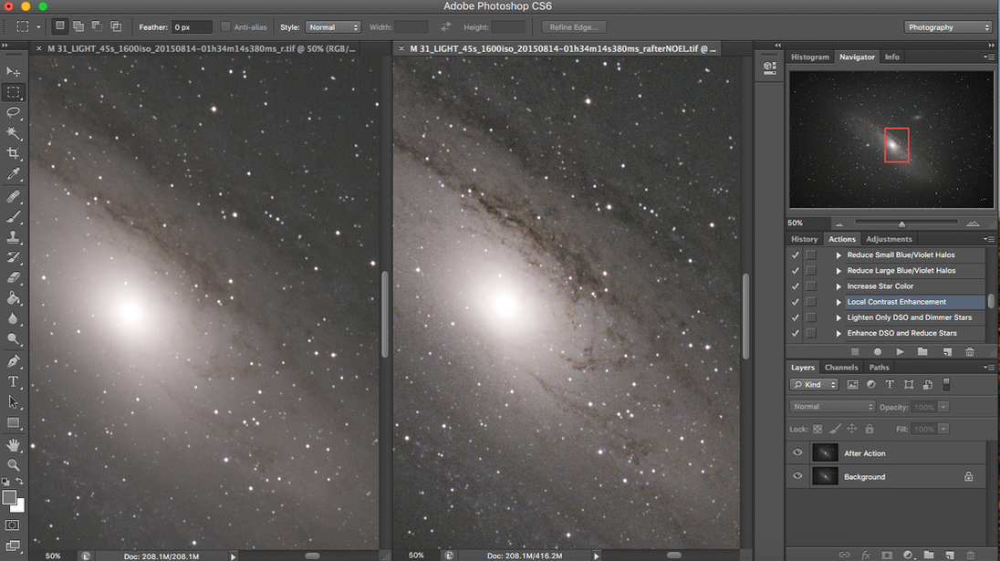

I ran two instances of the Action, the results shown on the right of the above image.  I selected only the background (no stars), otherwise, the stars would take on hard edges and bloat.  I really like the Carboni action, which seems to also run noise rejection to counteract the rise of noise, which is the byproduct of any such boost to localized contrast.   It's very smart!

**QUICK TIP:**  Be on the lookout for your stars.   Sometimes your feathered selection might still include a portion of the stars and they might be adversely affected anyway.   Don't make assumptions.  Verify the stars are as intended.   Your stars will lose color before they bloat...it's an early warning signal!

**Luminance Merging** - As I mentioned earlier, I typically run any detail processing, including local contrast enhancement on the luminance of an image, but this does not mean that you cannot run it on pure RGB, like in the above DSLR image of M31.   I just prefer to limit the side-effects of chrominance noise when I process luminance details.  This is the heart of the LRGB technique.  Since the L and RGB are vastly different in the way they should be handled, it makes a lot of sense to keep them separate for the entirety of the process.

But at some point, you have to bring them back together!   So, what do they look like at this point?    See the below example:

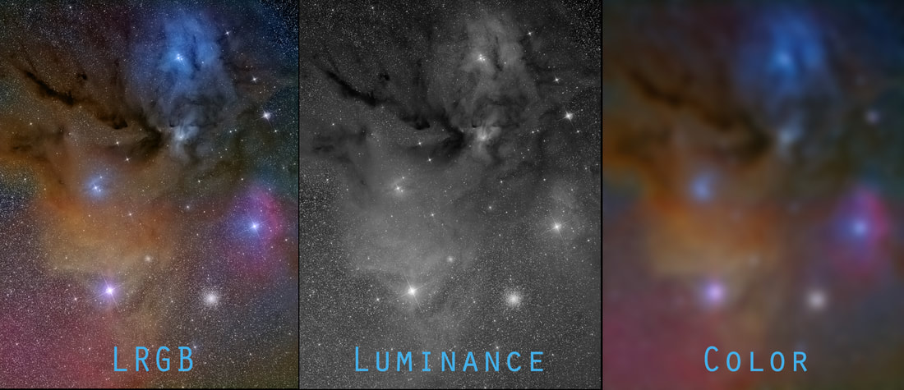

The final image (left) is the result of a clean, detailed luminance image (center) and an RGB color image (right).   Assembled in Photoshop, with the Luminance in Layer 2 using "luminosity" blending mode at 100%, I applied a severe Gaussian Blur to the Layer 1 color and boosted the saturation as compensation.   The result is probably shocking to many.

This should be "Exhibit A" for the flexibility and latitude that you actually have with color data.  As long as the luminance is clean and detailed, the color only needs enough presence to "map" the scene.   Thus, strategically, you can see why I am a strong advocate of individual luminance processing, specifically using an LLRGB technique (see Sidebar: LLRGB Technique).  Once the luminance has been polished and the color has been built-up and corresponds well to the luminance at hand, then you will want to merge it to form your image at this point.

**Hydrogen-Alpha Merging** - Perhaps the most difficult process to master, at some point after processing a well-balanced RGB or LRGB image, you might want to apply some h-alpha data to add impact to the emission nebulae within the image.

After reading the LLRGB sidebar (at right), you probably realize that the issue with merging h-alpha with LRGB data is that there is essentially ZERO one-to-one correspondence between the data sets.  So, you must begin a process of merging the data together, slowing building up the color (typically the red channel) so that the H-alpha data is slowly folded in.

The steps go far beyond the scope of this article, but those who are trying to gain tips by looking at the workflow of others should not be surprised to see people attempting to add h-alpha data to their images to produce an HaRGB image...or probably something more like an (Ha+L ) (Ha+R) GB image.

**Spectral-Band Tri-Color or Multi-Channel Images** - It's easy to see why people do spectral-band images.  Such filters are the great equalizer...you can shoot right next to a full moon with h-alpha and still get great results.   And today, it seems like that multi-channel spectral band images are the new fad in imaging!

Any discussion on this deserves an article of its own, so I will wait until I can create such a discourse.   However, you should know that the procedure essentially involves "mapping" spectral-line data to one of the RGB images, creating a "Pillars of Creation," Hubble-like image.   Such "mapped images" don't have to conform to the same "HST-palette," but can take on many forms, from dual-channel Ha/OIII only, to a "CFHT-palette" mix, or even using a full set of UVBRI filters.

Whichever way you go, you don't labor under the misconception that you are doing some kind of science.  It's art...pure and simple.

## Presentation

Perhaps one of the best ways to improve your image is what you do at the very end of a processing workflow: rotation and cropping.

I know...you bought that big chip camera, you've worked so hard to collect that exquisite data, and heaven forbid if you crop away some of it!

The problem is that what you've uploaded to your Facebook page is just this itty-bitty image of M13 surrounded by black space.  Unless people actually click on the image and go to your webpage, you know they aren't going to get the full experience.

I guess you are just happy that your FB "friends" have given you a "pat on the back, thumbs up, job well done."

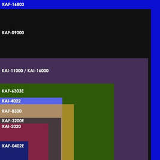

- Phil Jones at www.visualuniverse.com

The thing is, it doesn't have to be this way.   Your presentation of the image is EVERYTHING.   This is where being an artist comes into play.

You need to realize that just because you have a big canvas or CCD chip, you don't have to use all of it!  More than likely, your optics don't completely cover something like a KAF-16803 anyway...or even a full-frame DSLR for that matter, which is roughly the same size as the KAI-11000 shown in the diagram at left.

## Sidebar: The LLRGB Technique

Those familiar with LRGB probably understand the virtues of taking separate luminance data and applying it to the RGB color during processing.   But you may not fully realize how REAPPLICATION of the luminance (hence the "double-L") can drastically improve the color and overall quality of an image.

Many who shoot color data do so in light polluted conditions, which puts a premium on total exposure time.   And typically, if you are like me, the color seems pretty weak as a result...the blue filter, especially, is the bane of my existence.

But here's the deal...if you captured enough data to "map" the scene in all RGB channels - meaning that its existence in the image is where it should be, albeit really noisy - then you likely have enough to produce a really good LRGB image if your luminance data is really good.

When you process the RGB color, you will attempt to color balance, getting equal histograms without concerning yourself too much about anything else.  You can handle noise with impunity, dealing large radius, heavy gaussian blur to the image.

The first time you apply your luminance, you typically can only a little of it.  This is because there is often a large difference between it and the RGB data, so much so that it lacks one-to-one correspondence, detail to detail.

But what will happen is that details from the little luminance you use (try 20% at first) will sort itself into the individual color channels, improving the quality of the data that is there.   You follow that with more RGB processing, a boost to saturation, more noise removal (if necessary), followed close behind with another application of the luminance, only this time a little bit stronger (perhaps 40%).

In this iterative process, you will slowly see the quality of the RGB channels build up in quality, to the point where the luminance is finally applied at 100% and the image is pretty much done.   The detail from the luminance will finally have found its home into the proper RGB channels, as dictated by your close control over the color balance and saturation increases in between luminance applications.

Stars can be masked over with another processed copy, which requires very little exposure time.  I normally take just a few of the best images in the RGB to create the stars for the mask.  They are applied later...or often applied as I near the completion of the LLRGB process so I can match star sizes in the RGB with the better luminance data (which typically has smaller stars).

The ramifications are LLRGB are many, meaning that you can work less hard to get good quality RGB data, even binning that data.    For those who shoot Ha/OIII/SII images, you no doubt realize those methods, whereby you get only enough OIII and SII to map the scene and derive the majority of detail from your H-alpha...well, LLRGB works just like that.

But even if you do not take separate luminance data, the ability to perform similar actions on a synthetic luminance is a power all its own.   Learning to create such luminance from existing data is a great skill to know!

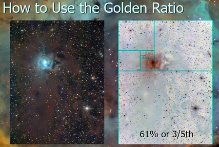

The golden ratio is an aesthetic that we are naturally comfortable with - which assures that you have images that resonate well with your audience. Key features should never be placed in the center, rather around the 2/5th mark. This is roughly analogous to the "rule of thirds," which is less anal about the percentages.

The truth is, much of that space is likely unusable unless you have spent a TON of money on optics that are designed for big chips.  Thus, you probably need to plan around that, which makes cropping a huge part of our game plan.

But HOW you crop and HOW you rotate the image can really set your image apart.  A few tips in that regard:

**The Rule of Thirds** - A nice composition tool is to divide the image into an invisible grid of thirds, top to bottom.   Strive to put key features at the intersections of those grid lines (also see Golden Ratio at right).   Thus, the goal would be to crop and rotate the image in such a way that lines up your key features into places that your eye naturally wants to see them.  It's "Psychology 101."

If you are the person that takes pictures of a single object, like globular clusters and small galaxies and you insist on putting them in the dead center of the chip, then this tip was meant for you.  You are welcome!

**Bye Bye Black Space** - The problem with large chips is that you quickly run out of good composition ideas, unless you are shooting in the Milky Way.  Even then, if you are like me, you get bored shooting with the short focal length refractor, especially since the field of view is so massive that you have to go REALLY LONG to turn all the pixels into usable, interesting space!    Who really has time for that?

So, why not just focus on shorter images with a smaller field of view?   Hack away the dead space and you will become much more productive with your total image output.   Not every image HAS to be deep (i.e. 20 hours long).   See Getting Intimate with M27 below.

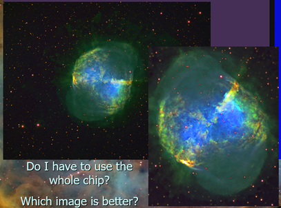

Getting Intimate with M27 - Not everybody has to know that the original image contained all the black space. So, getting rid of most of it can greatly improve an image. Just because your camera captured it doesn't mean you have to display it.

**Reading the Image** - Unless you were born in the Middle East, most of us read from right to left.    Quite naturally, we tend to look at everything the same way.   Images are like a story and we visually like to "read them" from right to left.

Witness the shot of the Cocoon Nebula below.  It's a fantastic image, by almost all accounts.  For years, I put this image on my webpage exactly as shown (left).

But one day at the Advanced Imaging Conference (AIC) in San Jose, Tony Hallas shared this tip with us.   He said that we want to think of movement in the scene, going from upper left to center.  And he was right.   It makes for a more active scene, where our eye catches the initial movement in the upper left (where our eyes naturally start) and then we are drawn toward the main parts of the image.

So, I went back to my images to see if any of them merited an adjustment.  Could I any of my images be rotated in such a way that put something of interest in the upper left corner?    Could any of my images benefit from being "read like a book"?

When I revisited this image of the Cocoon, I noted how there was nothing but stars in the upper-left corner.  Perhaps you see that too?   Interestingly, it was the lower right corner that has something of interest - a bright blue star with perfect refractor spikes setting the scene for the reflection of its light off the background dust, which in turn cascades like a river toward the turbulent center.   So, I decided to rotate and slight crop the image further, as shown at right (below).

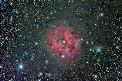

BEFORE - original orientation

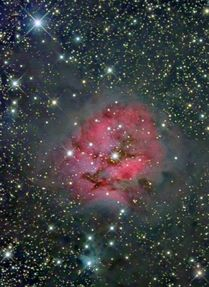

AFTER - rotated and cropped to "read" left to right

Same data, two different presentations. Rotating and slightly cropping the image moved the bright blue star and its refractor spikes into the upper-left, giving the eye a natural entry point into the scene instead of starting in an empty corner.

Perhaps you do not agree, but I feel that the image improved DRASTICALLY by this one simple move.  8 hours of data acquisition followed by another 8 hours (or more) in data processing...and it took 30 seconds to do what is arguably the single most impactful thing for my image!

**How are your images consumed?**  - When I first began imaging with a telescope in 1997, Facebook was still 7 years away.   The first iPhone was 10 years away.

When I finally went digital, moving from film to CCDs, it was around 2002, first using CCDs to "autoguide" my film images, and then progressing totally to CCD once I purchases my SBIG ST-7E with the KAF-0400 chip (see the blue chip in the above chip comparison diagram).  Talk about small by today's standards, but my goodness did it produce good images!   (See Sidebar: CCD Choices below for further thoughts on this.)

Shortly after going full digital, I founded this website in early 2003 as a place to upload my images and teach other people how to do the same.   I used an email distribution list to attach a preview image, funneling people toward this site where the full image, complete with details, could be seen.

But in today's social media age, how we distribute our images has greatly changed.   But more subtlety, how people CONSUME ours images has also greatly changed.  No longer are people likely to see the full-resolution shot of our images.  More likely, they will see it on their small iPhone screen IF they stumble across it in their Facebook news feed.   Because of this - and because today there seem to be THOUSANDS of people competing with your images - it places a higher premium on artistic presentation.

How do we differentiate our images from all the rest?   Whereas the M16 image (shown below) gives a good tip about this, there are likely many more ways that you can set your image apart from the rest.   But the biggest advice I can give in this regard is to take notice about what is exceptional about your image and put that on full display.  If the amazing seeing and tremendous resolution rocked your world, then post a close-up view of that image on Facebook.   If the colors of the image are the most pleasing thing, then post it with a boost of saturation (many a normal version on your webpage).

Also keep in mind that since most people are likely to only see the small preview on their phones, then they likely won't see the noise in the image either.  Thus, Gaussian Blur on the backgrounds and extreme sharpening on the highlights can really get people's attention.

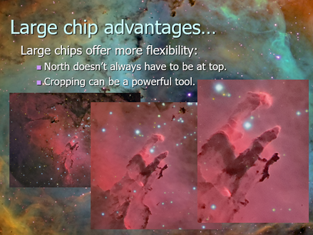

When the resolution is good, why hide it in the wide-field? Large chips allow you to post a variety of views. Perhaps your FB image is the close-up on the "Pillars"...drawing people to your webpage where they can see the whole field?

## Sidebar: CCD Choices

Many of us are trapped into thinking that we MUST have the biggest CCD (or CMOS) chip available. And while big chips do yield great flexibility, it's not necessarily a requirement, especially with less sophisticated, long focal length optics.

The cropped version of the "Pillars" of M16 (see left) could have been shot just as well with my very first dedicated CCD camera, the SBIG ST-7E.  Such a camera is ridiculously cheap on the used market today.  Better yet, why not look at one of the several modern, powerful options on the market today - all of which are enormous compared to the ST-7?

Simply put, you don't have to spend a ton of money on a dedicated astro CCD camera that can take special images.

## Conclusion

The Task of Image Processing is a difficult one, as is acquiring the data in the first place.  Of course, I venture to say if it was EASY, nobody would really care.  The nightly challenges of collecting good data, followed by the challenges found while processing the data set is what keeps me going.   Without the challenges, guys and gals like us probably lose interest...or we just learn to use an eyepiece.

This article was intended to give you some of the theory behind the workflows that you see people do.   It is an attempt to clarify terminologies, processes, and timelines in a way that you see the logic behind certain choices that are made - commonalities that exist - things worth doing vs. things that people overrate.   But mostly, you found the article full of juicy tips and helpful tidbits that make you approach your own processes in a slightly different, hopefully more impactful and efficient way.

As always, for advice and other tips, feel free to fire me an email.   Or, if you just like what you read, let me know that too.  It's a wonderful incentive to keep writing!

