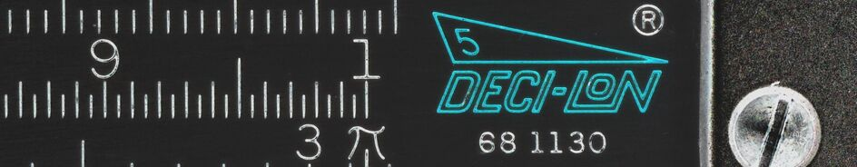
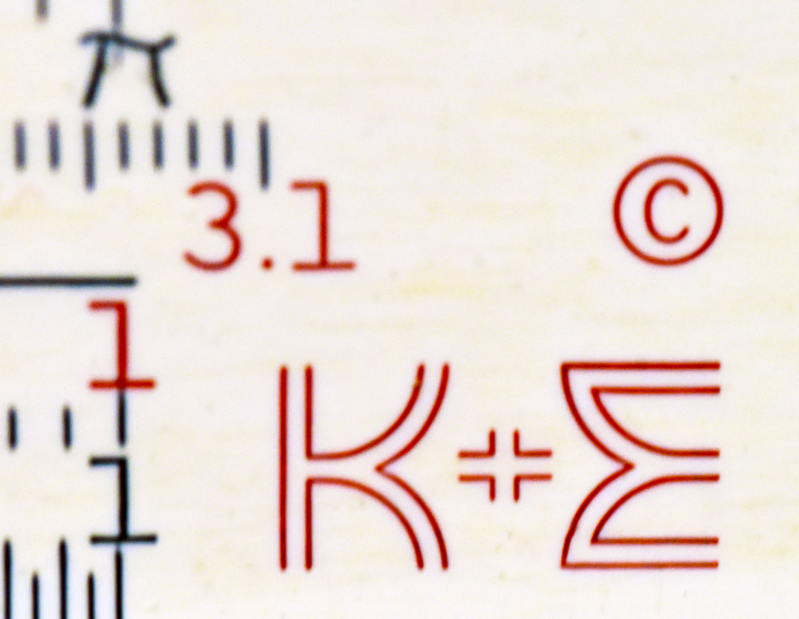

*Author's note: This, and most articles I write, are living documents. This article (or book) about K&E represents my research and understanding at the time of writing. It take a more narrative, story-driven approach to the topic. There are no targets with this writing, no thesis; no other purpose except to work my way through my own process of learning. The text will grow, change, and evolve slowly until, some day, a reader finds value in it. If that is you, and if that is today, thanks for taking the time to read it. Please forgive some of the "under construction" aspects of this writing, as things like annotations, the appendices and descriptions of items in the latter chapters might be incomplete or not fully documented. That will change the closer to "completeness" it gets. This article was last updated April 18, 2026. Many changes are being made to reflect a 1968 K&E Catalog Price List that was stumbled upon! See the [Version History](/sliderules/all-about-ke-rules/appendix-5-version-history/) appendix to check what's changed since your last visit.*

### Table of Contents

- **Introduction**
- [Chapter 1: Understandings and Conventions](/sliderules/all-about-ke-rules/chapter-1-understandings-and-conventions/)
- [Chapter 2: Rules of the Single-Sided, Mannheim-Type](/sliderules/all-about-ke-rules/chapter-2-single-sided-mannheim-type/)
- [Chapter 3: Rules of the Double-Sided, Duplex-Type](/sliderules/all-about-ke-rules/chapter-3-double-sided-duplex-type/)
- [Chapter 4: The Specialty Rules](/sliderules/all-about-ke-rules/chapter-4-specialty-rules/)
- [Chapter 5: Miscellaneous K&E Rules](/sliderules/all-about-ke-rules/chapter-5-miscellaneous-rules/)
- [Chapter 6: Out of Catalog, Custom Rules](/sliderules/all-about-ke-rules/chapter-6-out-of-catalog-custom-rules/)
- [Chapter 7: My Portfolio of K&E Slide Rules](/sliderules/all-about-ke-rules/chapter-7-portfolio/)
- [Appendix 1: A Study of K&E Cases](/sliderules/all-about-ke-rules/appendix-1-study-of-cases/)
- [Appendix 2: A Study of K&E Product Catalogs](/sliderules/all-about-ke-rules/appendix-2-study-of-product-catalogs/)
- [Appendix 3: A K&E Cursor Study](/sliderules/all-about-ke-rules/appendix-3-cursor-study/)
- [Appendix 4: Bibliography](/sliderules/all-about-ke-rules/appendix-4-bibliography/)
- [Appendix 5: Version History](/sliderules/all-about-ke-rules/appendix-5-version-history/)

## Introduction

If you are a lover of slide rules, or merely a connoisseur of trinkets, then it would be difficult to find something more collectible than slide rules made by Keuffel and Esser. Not only is this because of the enormous variety of rules to be found in circulation today, but because of the vast number of model types and styles of rules manufactured by K&E over the 100 plus years of its existence. Speaking as a slide rule collector myself who, like most, began the hobby not as a respecter of anything particular, swallowing up any rules we can get our hands on, it's not until we begin to accumulate a few K&E rules that we realize that we could spend most of our lives acquiring, researching, cataloging, and writing ONLY about K&E. The history is that extensive. I have found myself charmed by their rules; enthralled with understanding K&E product evolution and design decisions; curious as to the nature of their consumer demographics and preferences; and wondering about K&E marketing, company leadership, and the business successes and failures surrounding these slide rules.

For those who live in the United States, count yourself fortunate that K&E slide rules, among other collectible K&E products, are easily and quickly found. For the most part, particular K&E models dominated sales for them. Such models, like the 4081 Log Log Deci-Trig and the 4053 Polyphase Mannheim are in no way rare, nor particularly valuable. But because each of those models have existed for 70 years or more, and because K&E always felt that their rules could be improved, a collector like me might end up with 20 to 30 of EACH of these models, realizing that no two of them will be exactly the same. And because of this, the evolution of changes can be mapped in a way that would please Charles Darwin. I am thankful that K&E was never satisfied with the status quo, because I can collect an enormous number of meaningful slide rules without needing to pay exorbitant prices for them. That said, I could do that if I wanted as well!

Historically, there are rare slide rules of substantial value. Such can be the result of either extremely limited production or historical significance. And when these slide rules are unearthed, there is a large group of dedicated K&E collectors who want to acquire them, not only the rules themselves, but the story they tell. And I believe it's a exciting time to become a K&E devotee, as we are now two or three generations removed from people who actually know what slide rules are. There is the opportunity for even ultra-rare K&E slide rules to come out of hiding, as family heirlooms turn into dispensable curiosities of "what is this thing and why do we still have it?"

So unlike any other makers, including Pickett, Hemmi, Faber-Castell, and Aristo, Keuffel and Esser - both the slide rules and the company - sparks curiosity in me. So much so that what follows here will be a written love-affair of not only the slide rules in my collection, but information and understanding about every other slide-rule-related fact to be unearthed about K&E.

