Growing a business had to be daunting in the era after the US Civil War. But during this era of Reconstruction and into the Industrial Revolution, if you were a business that wanted to sell products, then there was certainly opportunity!

However you approach it, having a "product catalog" seems to be part of any good plan. Especially when you can identify a burgeoning market like Keuffel and Esser did.

When I think of stores that lifted the primacy of a product catalog, Sears & Roebuck comes first into my mind. "Sears" — as they would become best known — started as a mail-order business in 1892, opening its first retail store in 1925. Their product catalogs became their chief source of marketing, with placement in local general stores where consumers could go through the catalogs of goods and have items shipped through their local stores. It would take decades before their huge catalogs could be made available direct to consumers.

It might surprise most that Keuffel and Esser accomplished much of this prior to Sears, opening for business in 1867, introducing its first major product catalog in 1881, and establishing quite the list of consumer goods to those within engineering and architectural fields. Being based first in America's largest city, New York City, K&E was able to forgo wide distribution just by direct selling to any business that might need their goods.

Unlike Sears, K&E's catalogs didn't focus on a mail-order business, but existed as a comprehensive presentation to engineers and architects at the very heart of the fastest growing city in the world. Both William Keuffel and Herman Esser knocked on every door that had something to do with industry, equipped with samples of their goods and their product catalogs. Consequently, they rapidly grew in the first decade. As they say, "preparation met opportunity."

As such, *K&E Product Catalogs* became an important part of conveying who the Keuffel and Esser Company was and what they had to offer.

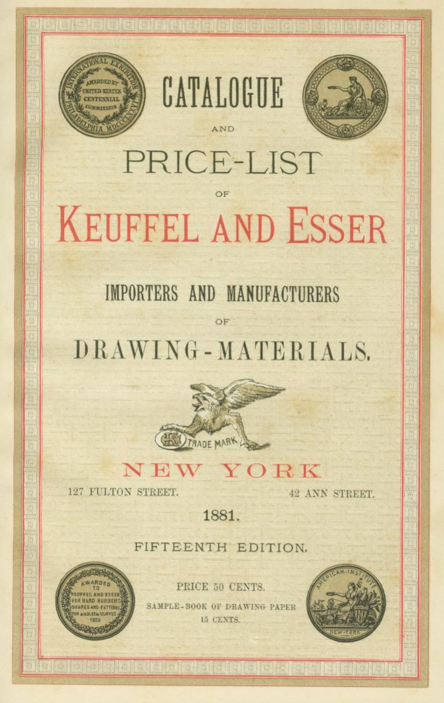

The title page of the 1881 catalog. This is regarded by collectors as K&E's first catalog, since it is the first published and recognized by the US Library of Congress. Despite this, as shown at bottom, K&E regarded this as their "fifteenth edition" catalog. As this was their 15th year in operation, this would seem to indicate K&E's desire to have had an annual catalog all along.

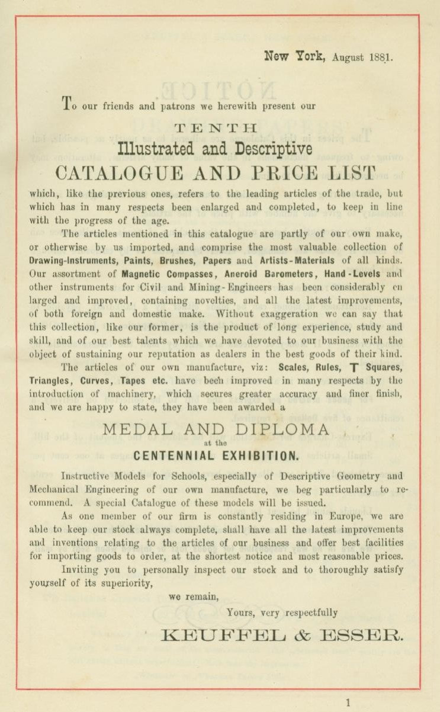

Atop this introduction page, it is clear that the 1881 published catalog was actually the "TENTH Illustrated and Descriptive Catalogue and Price List." Reading this introduction is informative both in terms of goods being offered as well as how K&E was attempting to position themselves — they wanted you to know that despite this being the first "published" catalog, they'd been around for a good while and that the consumer could trust both their goods and their business.

Keuffel and Esser did have a home base, doing business out of a small storefront on Nassau Street in Manhattan. They almost immediately began the manufacture of drafting triangles and drawing aids, which were of such high quality that K&E quickly gained a reputation for quality goods. Early manufacturing forced Keuffel & Esser to relocate its business several times, and once they expanded into surveying equipment, it became necessary to build their first sizable factory nearer their residences in Hoboken in 1875. Moreover, in 1880, they would begin construction on a much larger factory across the river in New Jersey as well.

As far as general offices and a storefront, K&E also saw it necessary to move into an old 4-story facility at nearby 127 Fulton Street in 1878, as their manufacturing capacity and need for space continually out-stripped any hope of a large showroom. And even while maintaining the storefront on Fulton Street, they also provided tracing and blueprinting services to the industry based out of that same facility. In 1892, even though most of the manufacturing side had moved to Hoboken, they expanded the Fulton Building into a beautifully ornate, 8-story* Renaissance architecture which remains standing to this day (although K&E would leave that facility in 1961). They would outgrow that by the next decade, as the principal office would move to Hoboken in 1907 once their large Hoboken facility was rebuilt after a 1906 fire.

During this time, they would also publish a trade newsletter called *The Compass: A Monthly Journal for Engineers, Surveyors, Architects, Draughtsmen, and Students*, written from 1891 to 1894 by William Cox. Remarkably, in the October 1891 issue of *The Compass*, Cox states that the first issue had been somewhat criticized by another "leading journal" because of the repeated mention of either K&E or its products. Well. Yeah. But humorously and delightfully, this demonstrates the exact effect that K&E hoped to elicit, and Cox responded to the criticism something to the effect of, "When you make the best stuff around and write a journal that uses the stuff, it's pretty much unavoidable!" (Cox, Oct. 1891, Vol.1, No. 3, p. 40)

*\*William Cox would write that each floor of the Fulton Street building contained 118 ft. x 25 ft. of space per floor. This is approximately 23,600 sq. ft. of space. (William Cox, The Compass, April 1893, Vol. 2, No. 9, p. 136)*

### The K&E Product Catalog

Coinciding with the Hoboken opening in 1881, K&E published their first formal catalog. Shown above, it is obvious that prior catalogs existed and that K&E was attempting to show themselves as what they had become — the leading seller of products to that market.

As mentioned in an earlier chapter, K&E seemed to be following the model of another well-known company of the era, who now also served as a business partner. The **W.F. Stanley & Co.** of London, England, had become the world's largest company in the market by the turn of the 19th century. In 1881, the year of K&E's first published, bound catalog, Stanley was boasting a catalog of over 3000 items and a workforce of over 80 employees. Keuffel and Esser routinely visited London during this era, both for mutual business interest — Stanley likely provided the dividing engines for K&E slide rules and many of their catalogued products — but also to learn how to grow a business that had aimed to reach the same type of markets.

K&E wasn't too far behind them in terms of growth. By 1892, their new "23rd Edition" catalog was 295 jam-packed pages worth of products, not including a 32-page price list. As such, if there was a playbook for K&E to follow, it was laid out almost entirely by W.F. Stanley & Co.

The catalogs themselves are beautifully done, particularly after William Cox was put in charge of focusing his energies toward the catalogs instead of the newsletter — the last edition of *The Compass* was printed in July 1894. The catalogs would then become hardback, at least until the later era (after 1955) when the single catalog became split up into several mini-catalogs specific to individual fields within their market.

The 1936 Catalog (38th Edition) is especially well done, bound together with pages of varying thickness, utilizing glossy cardboard stock to denote new section headings. Actual vellum pages serve a similar purpose, which are also samples (labelled as such) of the types of vellum they sell. And as with many of the earlier catalogs, there is a collection of swatches just inside the front cover to let you feel and see all the paper and tracing products they sell.

In a pocket just inside the rear cover is typically the price list to be applied to the catalog version. The price list is staple-bound, varying from 30 to 60 pages depending on the year. Earlier versions of the catalog put the prices in the catalog itself, which makes sense only as long as they intended to produce the catalogs yearly. They were also personalized to the owners of the catalog, many editions of which had their own serial numbers. As such, these catalogs are collectible in their own right.

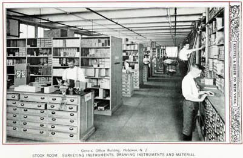

K&E included pockets of photographs on thicker glossy stock interspersed throughout many of their catalogs showing everyday life around Keuffel and Esser facilities. These provide an impressive glimpse into company life, albeit at greatly increasing the quality and the expense of producing a catalog.

Likewise, many of the page illustrations can be surprisingly colorful and tastefully done. Splashes of color can surprise you as you turn the page. And it's amazing how many products K&E not only offered for sale, but cared about presenting as something worth the customer's money.

### K&E Catalog Conventions and Timeline

As we see in the catalog pages posted above, K&E called their first published catalog their "fifteenth edition" and the tenth illustrated catalog produced to that point. Confusing, indeed, especially when you only see a single catalog. However, as a collection of catalogs, it becomes more obvious what K&E was attempting to do.

The 1881 Catalog was deemed the 15th Edition, marking their 15th year of being in business. Yet, they mention that this catalog was the 10th such illustrative "catalogue and price list" they had produced. We will see that catalogs over the next two decades would maintain that pattern, even if the catalogues were not published annually. For example, K&E's next catalog, coming two years later in 1883, would be deemed their 17th Edition catalog and the 12th such catalog they had produced. However, somewhere near the turn of the century, the edition designations became inconsistent. For example, the 1901 catalog is known as their 30th Edition catalog whereas the 1909 catalog is only the 33rd Edition. While it is difficult to ascertain, K&E might have been adjusting the edition number of the catalogs to match the actual number of illustrated catalogs they had historically produced. Even so, by the turn of the century, collectors are better advised to look at the copyright page in any particular catalog, as it provides a more comprehensive listing of all published catalogs to that point.

Through the next century, K&E would try to produce new, full-line catalogs every 3 to 5 years, on average. The large time gaps occurred most notably around both World Wars and the Great Depression. Regardless, it's evident that K&E didn't much see the need to produce a new catalog every year. By the 1950s, K&E began to split their catalogs into two volumes, always paperback. Those catalogs would split into as many as 7 or 8 mini-catalogs itemized by product/industry type once the 1960s and 1970s arrived — something they had been doing anyway for several decades in addition to their full-line catalogs — as they realized that not every market needed a catalog which included products for other industries and purposes. When you've been a company for almost 100 years, I would guess that you are no longer concerned with impressing the public with a fancy, beautiful product catalog!

It would be these mini-catalogs that would fill in our knowledge gaps during the intermittent years between catalogs. For example, there were no large product catalogs during the Great Depression years from 1927 to 1936; however, there were almost yearly "slide rule only" mini-catalogs. Similarly, the introduction of the "Education Products Catalog" in 1933 became a semi-periodic publication. Or, in the very least, if they did not produce a major product catalog, then their price lists would come out to inform consumers and businesses of current pricing.

Collector Clark McCoy has maintained a PDF listing of all known published K&E catalogs, mini-catalogs, brochures, and price lists relative to K&E slide rules at [his webpage](http://www.mccoys-kecatalogs.com/KEmain.htm) for your reference. It is an *incredible* resource, even if it's only focusing on the catalog pages that contain slide rules. Moreover, he also takes those slide rule pages and organizes them within a "slide rule cross-reference" index. Here, you can look up a model number and McCoy will provide his own descriptions of the rules and link all the historical catalog pages that contain that product. McCoy's efforts here are especially useful, whether or not you have any of the physical Keuffel & Esser catalogs within your own collection.

But, I must say, collecting the catalogs has been as rewarding as the slide rules themselves, as you gain much more information than just the McCoy resources alone.

Reading through all of the K&E catalogs — as well as supporting documentation — is a terrific way to learn about individual product timelines and technologies. Much of the understanding I've gained throughout this book came from not only acquiring multiple models of a particular slide rule, but also reading the catalogs concerning changes to a particular rule over time. Similarly, parallel products can be studied that might relate somehow to slide rules. One notable advantage of picking through all the catalogs is that you can see the "Doric" name doesn't stop at just slide rules, but rather any number of products in the K&E lineup intended to convey the same, back-to-the-basics philosophy.

The catalogs also help us to monitor the expansion of the business itself, as K&E would include illustrations with their catalogs coinciding with new facilities they would build, most notably their giant expansion of the Hoboken facilities in 1906, as well as any branch offices K&E would open. For example, just by perusing the catalog title pages in McCoy's list, we can see that the Keuffel and Esser Co. opened additional facilities and regional branches as shown in the table below.

| Catalog Year | Location | Purpose |
| --- | --- | --- |
| 1892 | Chicago | Branch store |
| 1895 | St. Louis | Branch store |
| 1901 | San Francisco | Branch store |
| 1909 | Montreal | Branch store |
| 1928 | NYC, East 41st St. | "Uptown store" |
| 1936 | Detroit | Branch store |
| 1938 | Long Island, NY | City store |
| 1941 | Los Angeles | Branch store |
| 1955 | Dallas | Branch store |
| 1955 | Seattle | Branch store |

Note that when K&E moved their general offices to Hoboken alongside their large factories in 1907, the Fulton location was retained as their "Parent House" and primary showroom. This would spare absolutely no expense, as they arranged ALL of their catalog offerings across all 8 floors of the prime Manhattan facility.

> The main store in New York City is a model establishment, where every requisite of the engineer and draftsman can be found, and where unusual facilities are afforded for examining and testing the many delicate instruments of precision included in this line.
>
> — W.J.D. Keuffel

Similarly, K&E often used catalog pages to show a glimpse of the everyday production life of their products through glossy pictures. For example, the 1906 Catalog has many full-page pictures in the foreword of the inside of their facilities, such as their stock rooms, counting room, packing room, retail department, and general offices. Around 1/3 of the way through the same catalog, they give a glimpse of their production facilities, showing images of their employees working in their saw mill, making wooden tools and leveling rods, assembling drafting furniture, and wood finishing room. Yet again at the 2/3 mark, we see more nice pictures of workers within their optical department & foundry, and the production of surveying instruments. And finally, towards the end of the catalog, we see pictures of workers graduating measuring tapes, operating in the press and stamping room, and working in the machine and tool making shops.

Keuffel and Esser was a well-organized machine, and the company wanted potential consumers to know that.

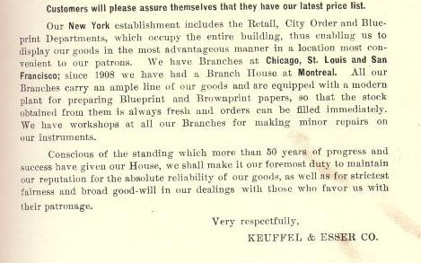

By 1921, K&E lets us know in their "36th Catalog" exactly the state of their affairs — what they do and where they do it is described here.

Perhaps the most impressive feat of such a catalog is the need for illustrations to describe and inform on the products themselves. During an era when photographic methods hadn't yet come to maturity, nor the ability to make multiple copies of such images, pencil illustrations became the only way to convey those pictures. In a catalog that attempts to display thousands of products, the sheer number of highly detailed illustrations has to be the most time-consuming aspect of putting together such a catalog.

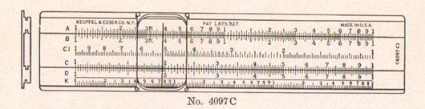

While many of the tens of hundreds of catalog illustrations are simply drawn, so as maybe to show the difference between scale sets of their various slide rules — as with this 4097C drawing — there are equally as many illustrations that are impressively drawn.

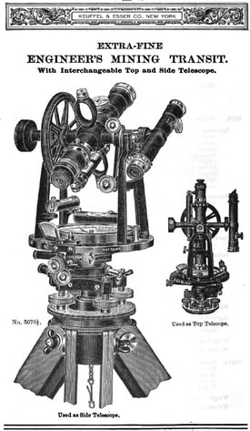

Such as the Engineer's Mining Transit. If a tool such as this is to be described as "EXTRA-FINE," then most certainly K&E wanted their artists to illustrate exactly how fine such a product truly was!

The majority of all full-line catalogs were laid out in a similar fashion, in two parts, ordering their goods typically as follows...

**Part I — Office Products**

- paper products
- drawing instruments — mechanical pencils, compasses, dividers, drawing sets
- drawing machines — eidographs and pantographs
- drafting instruments — drawing arms, mechanical protractors
- measuring instruments — rulers and scales
- drawing tools — triangles, curves, protractors, t-squares, straight-edges
- drafting furniture — print frames, blueprinting machines, trays, drawing boards, tressles, drawing tables, blueprint drawers
- artist goods — water colors, inks, brushes, ink-holders, pens, pencils, erasers, stencils
- slide rules
- planimeters and integrators

**Part II — Field Products**

- surveying instruments — levels, transits, theodolites, tachymeters, tripods, traverse/plane tables, sextants/octants
- field tools — heliographs, sundials, compasses, clinometers, hand transits, hand levels, mirrors, and prisms
- weather/water tools — barometers, anemometers, thermometers, rain gauges, current meters
- surveying scales — measuring/stadia rods, hand clinometers, odometers, pedometers
- hand optics — binoculars, magnifying glasses
- measuring instruments — tapes, reels, measuring chains
- books and publications

K&E forgoes a Table of Contents in their catalogs in favor of a very weighty and detailed index in the rear of the catalog.

For those collecting catalogs, a cover timeline can be useful. What follows is a small gallery of catalog cover images:

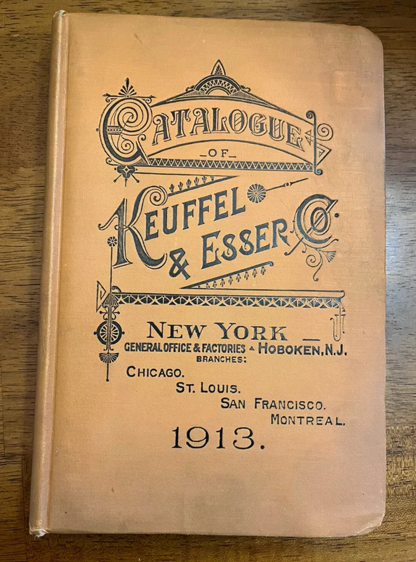

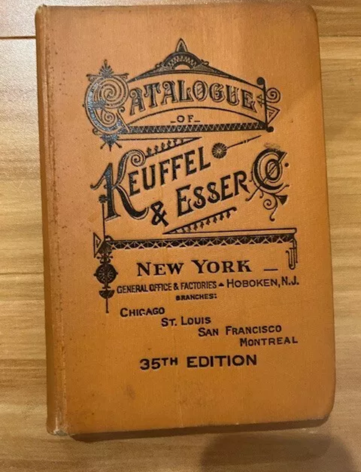

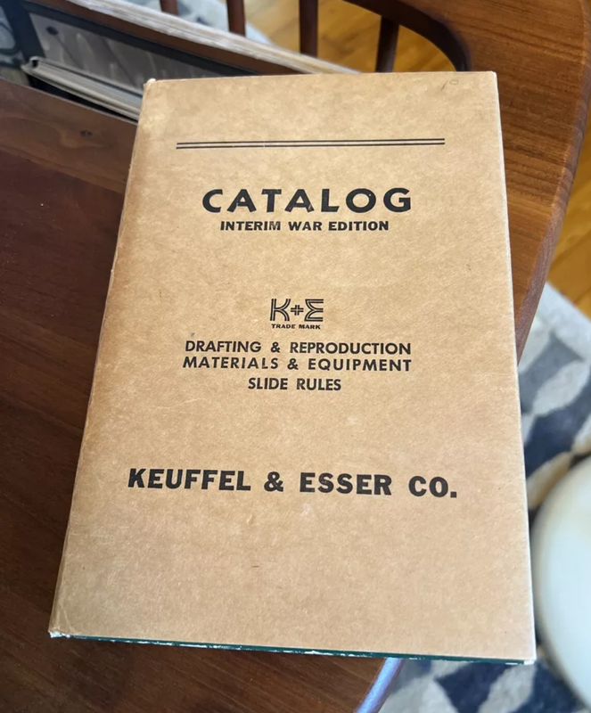

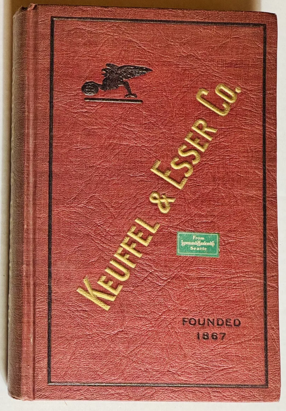

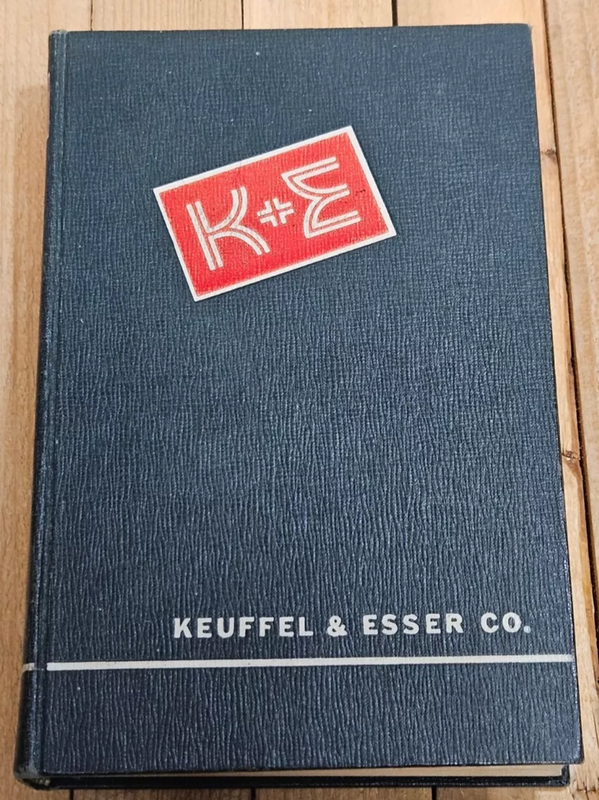

A small gallery of K&E product catalog covers across the decades.

[Continue to Appendix 3: A K&E Cursor Study](/sliderules/all-about-ke-rules/appendix-3-cursor-study/) · [Back to Table of Contents](/sliderules/all-about-ke-rules/)
