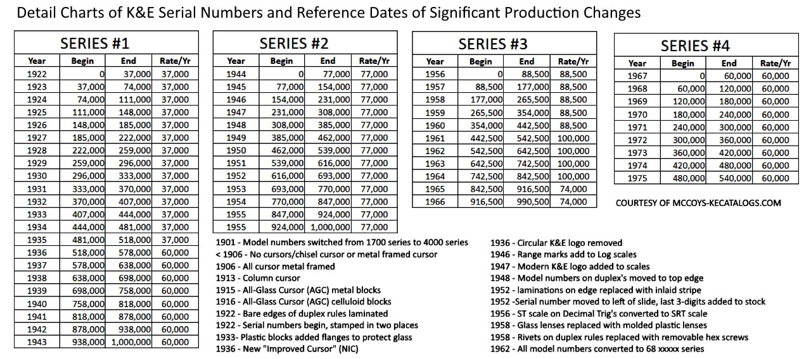
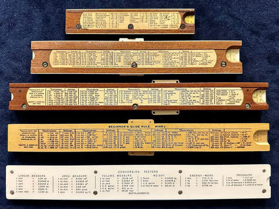
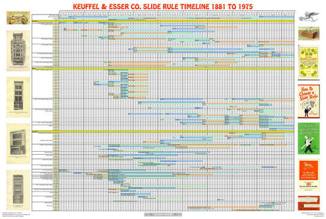
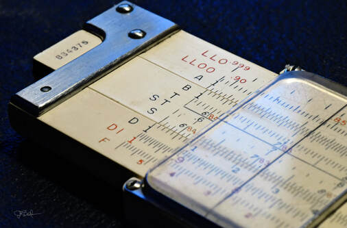

Keuffel and Esser is the oldest major US slide rule maker, going back to 1867. Beginning as a supply house for anything engineering related, they are widely known for drawing supplies, surveying equipment, and of course, their long history and diverse models of slide rules. Famously, in 1891, they originated the "duplex" design of having scales on both sides of the rule with a dual indicator, beginning 70+ years of innovation and production in the slide rule business. The key to understanding K&E slide rule production is to pay attention to both their model naming convention as well as their cycles of serial numbers. I will attempt a healthy description of the histories here, which will also reveal much about the company on the whole. Likewise, we'll discuss slide rule construction, the major families of rules and their evolutions across model lines, and we'll wrap up with my own portfolio of K&E rules, which are the most numerous in my collection. The goal is to get the would-be collector up-to-speed on the K&E world of slide rules.

## Sidebar: The Problems with K&E Rules

In my own exposure to the vast array of K&E slide rules, I've noticed some problems that pop up consistently throughout my inventory of rules. While these aspects don't detract from the overall wonderful collectability of their products, there are some annoyances you need to be aware of when you seek to collect them yourselves.

The most common problem is the "K&E Rotting Cursor Syndrome," known as "KERCS." (You know it's a problem if there's an acronym for it.) Many rules made prior to ~1950 had celluloid cursor rails that didn't hold up well over time and would eventually crumble to pieces. This begins with the outgassing of the nitric acid from the celluloid, which rusts the cursor spring and compromises the spring's anchor going through the rail. Eventually, the spring breaks away and the celluloid rails become brittle as the camphor plasticizer is also forced out of the celluloid.* Thus, if you are looking at K&E slide rules on eBay, inspect the pictures carefully as a majority of the older rules will have cracked or crumbling cursors. Once compromised, any disassembly of the cursor for cleaning runs the high risk of watching the cursor rails crumble into your hands. If cracks in the rails are not obvious in the pictures, then note any rust stains either at the cursor or along the slide rule rail itself. If this is noted, avoid purchasing the rule. K&E seemed to rectify this condition after 1950 with a more durable plastic that also held up better against the typical yellowing of old plastics.

Less known about K&E wooden rules, especially when compared with the Japanese bamboo-constructed rules, is that while mahogany is a generally stable wood (often used in the making of guitar necks), it isn't as stable as bamboo. Some of the rules in my collection show slight signs of cupping across the face of the slide and stator (base) rails, the result of changes in humidity over the life-time of the rule. I've noticed that it can affect the appearance of a rule, as well as its functionality if the cursor becomes too tight to the rails due to the swelling. This is especially true with all-glass cursors from 1916 to around 1930, whose cursor rails thickness to the body has a very small tolerance. In such cases, I've had cursor glass break just because the glass is too tight to the rule when using it, all because of the slight swelling of the mahogany and/or a loosening of the celluloid over time. If this is noticed, it is beneficial to shim between the cursor rails and the glass.

In a similar way, because the slide is designed to glide into the stator rails with a tongue and groove design, the mahogany of the slide's tongue is prone to chipping off at the ends, and in many cases breaking off along the wood grain much further down the slide than many would like. So, an inspection of the slide before purchase is a good idea. That said, with a donor slide rule of matching mahogany wood, you can typically repair broken slides with some wood glue or super glue.

Many of the single-sided Mannheim types have a stator rail screwed onto and through the rules backing. This is not a problem in general, but because the backing is thin, overtightening these screws can wear out the countersunk shoulder in which the screw rests, eventually widening and no longer holding the rail firm to the backing plate. This can be revealed often times in pictures when there's larger gaps than you'd expect when the slide is in place. And because the celluloid plastic is bonded to the wood with glue, separation can occur over time. While this is often repairable with some super glue and a clamp, neglecting the separation can lead to broken-off sections of the plastic on many samples. The quality of the adhesives did improve overtime, so older rules are more susceptible to delamination, which is why companies like Nestler and AW Faber actually used screws to reinforce the celluloid laminations of earlier slide rules.

Finally, the smaller, single-sided plastic rules of the 4150-1 and Doric types of pocket rules are a little too flimsy in my evaluation. The plastic backing has easily cracked in my own hands when cleaning them, or can peel away from the stator rails. Again, a little super glue can fix this, but I find the overall quality in those rules disappointing. In a similar way, the older Ever-There 4097 and 4098 rules made of "Xylonite" are very brittle now, the toll of 70 to 80 plus years of existence, many of which having warped or curled over those years. I snapped a slide in two when trying to dislodge a stuck and warped sample myself, so condition is crucial when considering a purchase. Likewise, these rules have yellowed much more than any other K&E slide rule you will find. In most cases, the aged yellowing of celluloid can actually be cleaned or sanded away from the surface of the rule without affecting any of the engine-divided scales/fonts. But I've been unable to make much progress with restoring the Xylonite in a few of my own Ever-There slide rules.

Having those concerns mentioned, the great thing about many of the K&E rules is that they can be brought back to life, remarkably so, with a few repairing skills. You need a completely intact rule (especially the cursor), but cosmetic issues can be corrected indeed. I've taken a 20" 68-1200 (4081 type) duplex rule that was covered in severe rust-colored stains, and then I used sandpaper, razor blades, and Scotch-Brite pads to bring the celluloid back to it's old glory without affecting the scales themselves...or at least not in a way that hasn't been worth the effort of restoration. As such, I've bought some pretty cheap, cosmetically-damaged K&E slide rules and turned them back into a display-worthy sample. Likewise, with use of a cheap donor slide rule, a 3D printer, or via metal fabrication, you can replace missing components, especially cursor rails, on an otherwise pristine slide rule.

*Note: There is some debate about what causes the rusting of the spring in these cursors. While camphor does sublimate out from old celluloid eventually, it is a well-known rust inhibitor, and as such would not be the cause of a compromised cursor spring. Of note though is that the camphor is the plasticizer of the nitrocellulose structure, and as such the leaching of camphor would certainly make for brittle celluloid. Some feel that "celluloid rot" can cause other rot in other pieces of celluloid, but I find this untrue in observation...the rule itself, also covered in celluloid, never seems to suffer from the breakdown of the cursor rails beyond some rust marks from the cursor spring. A second opinion regarding KERCs comes from the Autumn 2011 issue of the Slide Rule Gazette, where the author, through personal correspondence with K&E expert collector Clark McCoy, says that McCoy feels that the rotting cursors appear on rule made between 1940 and 1945, which involved only rules made between serial numbers 750,XXX (in 1940) and the first "roll-over" back to 000,XXX (in 1945). This can be seen in McCoy's Serial Numbers chart nearby. McCoy posits that K&E changed the recipe of the celluloid at the government's request to preserve nitrates needed in the production of explosives. (John Hunt Sr., Slide Rule Gazette, Issue 12, Autumn 2011, p. 37.)

## Model Number Naming Conventions

Model numbers typically take the form of 4XXX-L, where "L" is the approximate length of the slide rule in decimeters (1/10th of a meter). As an example, a popular K&E slide rule historically is their 4053 "Polyphase" series of Mannheim-style slide rules. This family of rules was in continuous production from 1909 until just before the end of the slide rule era in 1970. These rules came in 4053-1 (5-inch), 4053-2 (8-inch), 4053-3 (12-inch), and 4053-5 (20 inch) variations. This "dash" suffix was introduced in 1911 to signify slide rule length (in decimeters), seemingly a lovely way to communicate model variants within the model line.

K&E also used an "N" in front of some model numbers, as in N4XXX, to denote a major change in the slide rule for a new production year. Presumably, this means "new" to distinguish it from the old version. (Pickett would later do something similar). They did this to a majority of the model lines in 1925, the first instance of the "N" designation occurring in 1922 with their N4135 "Power Computing" Duplex rule. And seemingly arbitrarily, they would revert back the original designation in some cases. For example, the 4080-3 "Log Log Duplex Trig" replaced the 4090-3 model in 1937, became the N4080-3 in 1948, only to switch back to the 4080-3 in 1954. The switch to the "N" in 1948 reflected a major change in the scales for that rule. Another major change in scales occurred in 1954, whereas K&E just dropped the "N" from the model name.

I said earlier that K&E models are typically a 4XXX type of number. There are notable exceptions. Prior to the year 1900, all of their slide rules (and other items like Thacher and Fuller Calculators and their sector rules) used a 17XX scheme. Likewise, the earliest K&E products made before 1887 used a 4XX three digit scheme. Going forward in time, Models with a 9XXX designation started to appear in the late 40s and early 50s, which denoted the Doric series of plastic slide rules. The Doric slide rules that remained were reclassified into the 4XXX naming scheme by the 1955 Product Catalog. And, finally, in 1962, K&E shifted away from the 4XXX numbering scheme and began using model numbers of some 68-1XXX variation. "68" was an indicator of "slide rule," so likely the company shifted all company products to this number format for accounting reasons. Thus, you will see something like their 4081-3 "Deci-Trig" slide rule become known as the 68-1210 "Deci-Trig" in 1962. Same rule; different number, of which, by the way, they often didn't stamp on the slide rule itself. This includes two of their best slide rules, the 68-1261 "Jetlog" and the second variant of the powerful 68-1100 Deci-Lon 10 rule. It did indicate the model number on the box, however. Furthermore, there are known instances when a post-1962 slide rule in a 68-1XXX labelled box still contained a slide rule with the old 4XXX model number, likely in the early 60s as K&E was still unloading their inventory of older rules.

The move away from 4XXX series numbers with the "dash" suffix is frustrating for collectors, as Indicating the length of the rule within the model number with the "dash" is very helpful. Plus, the 68-1XXX scheme is very difficult to remember. I do question the changing of 62 years worth of model familiarity among their consumers. This couldn't have helped sell more slide rules. Albeit a decade later it would hardly matter anyway. In a way, the 68-1XXX scheme began the countdown towards the hand-held calculator age and the collapse of the company.

## Serial Number Conventions

As for serial numbers, K&E tried to make it difficult for us in that they used a sequential numbering of their rules regardless of the model. So, a 4080-3 model could have a serial number of 123456 while a 4070-3 might be SN #123457. These six digit serial numbers, which K&E didn't use at all prior to 1922, would run from 000000 to 999999 and restart to zeros, starting the cycle over again. There were 4 cycles and 3 "roll-overs" back to zero, occurring around 1944, 1956, and 1967. Therefore, dating a slide rule will reveal three date possibilities, but usually only one logical choice based on the type of scales, model type, and construction used. You will discover that within a typical model type, there will be subtle changes from year to year, thus creating a number of "variants" with each rule.

Production rates were fairly linear, with around 66,000 units made prior to World War II, 77,000 per year post-war, and then ramping up to nearly 100,000 per year during the late 50s and 60s until, in 1965, they tapered production back down to around 70,000 units per year. It is thought by many that very few rules were made after 1968 and that sales into the 1970s were of slide rules K&E still had in stock.

There is also an extra wild-card where serial numbering is concerned. K&E used specific serial numbers for certain models as separate from the usual SN# chain, which was reserved for mostly their wood-constructed rules. As of 1947, any of the plastic rules are not included within the serial number line-up as they had their own series for numbering. There has been a recent attempt to rationalize K&E serial numbers to dates of manufacture among the plastic K&E rules by Mike Syphers, Eamonn Gormley, and Kurt Dietrich at Mike's Substack website here. It's an encouraging, yet still early look at serial number classification and considerations with most of K&E's plastic slide rules. Finally, as stated, slide rules made prior to 1922 did not have serial numbers at all. Thus, it's typically the post-1922 wooden rules that are more easily dated (not including the Beginner's 4058 rules that never had serial numbers).

K&E serial number and production dates chart, courtesy of Clark McCoy.

In dating my own slide rules, I typically use the chart above to give me an idea of possible dates, but then I peruse Paul Tarantolo's massive collection of K&E (and other) rules archived over at the Oughtred Society. This is an amazing collection of models collected and categorized for us to see. Compare your slide rule with one of his and you'll know what you have. Proudly, I have a few K&E rules that he does not have! Paul's site is testimony to the way slide rules within a model line evolve, and specific dates can be tracked where evolutions were common across most K&E models. For example, when K&E advanced their cursor design, it was typically implemented across ALL of their rules in a given production year. As such, these changes can help pinpoint exact production dates within a model series, as long as your slide rule sample does not have a replacement cursor. This adds to the confusion, at first, but in time the K&E aficionado will be able to detect an old slide rule with a newer cursor. Some of those highlighted production changes by significant date are also shown in the chart above.

## Slide Rule Construction

Let's now establish some of the construction jargon that we will use. Slide rule bodies had very similar, common elements, those being two fixed, grooved rails (or stators) and a tongued slide, free to glide between the rails. The way the rails are fixed together determines the platform for the slide rule, either single-sided or double-sided.

This shows a variety of K&E single-sided rules and the way conversion and formula charts can be laid out on the back of the rule, usually borrowed from the US Bureau of Standards, Circular 47 (1914). Such charts were typically pasted onto the back of their nicer wooden rules and screen printed to the back of their budget and plastic rules.

Single-sided rules will have their rails affixed to a backing plate. The back side will typically have formula charts and conversion tables. For most wooden rules, this information was printed to a paper label, affixed to the rule with adhesive, and further protected with a lacquer finish. Less expensive wooden and plastic models would have screen printed (painted) the information to the rule's back. The data on these are generally consistent for a model over time, though small changes in some of the text from year to year can help to date the rule. The slide is free to glide between the rails. The slide is removable, typically with additional scales on the back of the slide. Often, there will be windows on the edges of the rule's backside to input values for those scales, reading the outputs off of the front side. This will be the case for the Mannheim types of rules made from wood. Other rules might allow the slide to be flipped over and used entirely on the front side. This will be the case for Mannheim rules made of plastic, especially the shorter pocket models. The void between rails is called the slide well. The slide well itself can have maker's marks and patent information, as well as a centimeter extension scale to extend the length of the slide rule for linear metric measurements. Other rules can integrate scales onto the slide well itself.

Doubled-sided rules, also known as duplex rules, have their rails affixed with end brackets (or sometimes known as braces) in either metal or plastic, with the slide free to glide in between. This allows removal of the slide so it can be flipped to access scales on either side of the rule, and in some cases with early K&E rules, they could have shipped with multiple slides to increase a rule's capabilities. A double-sided, duplex platform rule that does not utilize the back side for additional scales is known as a simplex design.

The scales themselves can be engine-divided (etched), painted-on, or cast, depending on the material. Their spacing is established by a scale length which determines the overall length of the rule's platform. As such, there will be scales with total lengths of 12.5mm, 20mm, 25mm, 40mm and 50mm. The scales themselves might be linear, as such for inch and centimeter rules typically on the edges of the rule, or in the base 10 scale for solving logarithms, which K&E refers to in its early literature as a "scale of equal parts (or measures)." For the most part, scales will be logarithmic which, for collectors, is what defines a "slide rule" in the first place. All computations involving the two basic operations (multiplication and division), and the functions that arise from them, are made possible by using logarithmic scales. Because K&E is in the United States, classifying the slide rule lengths by their metric scale lengths would have been a disaster. Therefore, the above mentioned metric scale lengths are traditionally known throughout all K&E literature as 5", 8", 10", 16", and 20" respectively.

The last common element of the slide rule is known as the runner or indicator in the earlier literature, shifting to be known as the cursor in the later era, a term which we will use mostly in this writing. The earliest rule, known as a Gunter style, came without a cursor. But all other models used some kind of indicator. This element wraps around the rule's edges and glides in grooves on single-sided rules. The earliest cursors will be "metal" or "brass" in the literature, a style which today is referred to as a chisel style because of the chisel-like fingers that project over the scales. These chisels are typically on the left side of the indicator but evolved in the later models to be placed on the right side as well, something known as the double-chisel design.

By the turn of the century, window cursors began to replace all-metal versions. Such a cursor will have two cursor rails made either of metal or plastic attached to a window etched with a visible hair-line. This window could have been made of glass, clear celluloid plastic in early rules, or modern "acrylic" plastic in later rules. These cursors were adaptable to double-sided, duplex rules simply by adding a second window to the back side, completely wrapping the cursor to the rule. These will affix a spring to one of the rails to give tension to the cursor (also in single-sided cursors as well). Adjusting tension of the spring is accomplished by oversized holes in the edge of the glass (or a glass frame in the evolved versions) whereby screws can be tightened at the proper tension to hold the cursor in place, yet provide a nice glide across the slide rule. Alignment of the hairline on the front and back windows is accomplished carefully by the same means. Cursor design would evolve over the 100 year history of K&E slide rules. Where that occurs, it will be noted in the individual descriptions of all K&E slide rules.

On the whole, most traditional K&E rules - meaning those after 1906 - are of wooden mahogany construction covered in celluloid, which is an ivory-colored organic plastic displaying the engine-divided (etched) scales. These are the slide rules for which K&E became known and highly regarded, helping them gain strong foothold in the U.S. market. But in the first three decades of the company's existence, slide rules were almost entirely single-sided boxwood rules, with the exception of the 1890s which began to incorporate not only the mahogany laminations, but two sided, "duplex" rules based on the William Cox patent licensed exclusively to K&E. There is inconsistency prior to circa 1900 when K&E mixed their in-house rules with those supplied from two European companies (or perhaps more).

Once mahogany rules with celluloid laminations began to dominate the K&E product line, the only exceptions were their "beginner's" type of consumer rules that were made of cheaper "hardwood," painted white with black-painted scales; and their first line of plastic rules, starting in 1931 with their "Ever-There" family of pocket slide rules. Certainly as low-cost plastic construction became more practical as a material, it would begin to see progressively more use in the slide rule. By the 1950s, their "Doric" type of mostly experimental plastic rules, sold alongside their flagship mahogany rules, showed K&E how well both construction types could fill out a product lineup and fulfill the needs of their market. And as the Doric rule evolved over a decade, it gave rise to their more "modern" slide rules like the Jet-Log and Deci-Lon series rules, both of which are highly collectible and well-regarded slide rules made of "Ivorite." This plastic was consequential to most all of their rules, incorporated into the cursors or the rules themselves, regardless of price, and not merely used in their budget rules. As such, most of the traditional wooden construction techniques evolved to incorporate more plastic features. Some wooden models would give way to plastic rules entirely, becoming the spiritual successor of the older model lines. By the end of the slide rule era, most all K&E rules were constructed entirely of "Ivorite," with only a few flagship, mahogany slide rules remaining because, after all, that is what a hundred years of customers had grown to expect. So by the end of the slide rule era, K&E had managed to preserve their long-standing heritage of powerful wooden slide rules while also supplying users with even more powerful, all-plastic models.

Regardless of construction, K&E made it a point of pride to produce high quality rules, and for the most part during their history they absolutely succeeded. Their slide rules even came with a life-time warranty, which is unheard of today (likely for good reason as we will discuss later). But as a collector, so many years after the fact and when judged over the course of time, there can be a variety of issues that make your sample less than mint. For more, please see "Sidebar: The Problems with K&E Rules" earlier in this chapter.

## Slide Rule Families vs. Slide Rule Series

Understanding slide rule construction, which will be further discussed when talking about the individual slide rules, we now want to consider how K&E would organize their rules throughout their long history and the way they would market to consumers. What we will see is somewhat of an evolution in this regard. For the most part, from the inception of the company, slide rules were categorized according to their construction, whereby single-sided rules and double-sided rules served as the major differentiation, and within those extremely broad categories, they would be categorized according to purpose (a model line or a scale set). These are known as slide rule "families." This is very predictable in the first 50 years of K&E product catalogs. But around the 1930s, we begin to see certain models of rules sold in "series," a collection of rules with similar build and technology, yet with a diverse range of uses.

The way K&E thought about "pocket rules" is a good example of this. During the first 50 years, the company would focus first on a Model line within a particular family of rules, like the 4041 or 4053, and then decide if they wanted to make a pocket version of that rule. In doing so, they would essentially cut the 10" wooden slide rule stock in half and build the shorter rule in exactly the same way as the longer rule. Labor costs in doing so remained high, since production time isn't decreased just because there is only half of the materials. And as we will see in our discussions of the rules, K&E did NOT make pocket rules any less expensive than their full-sized rules. And in many cases, they cost more.

Around 1930, with the introduction of plastics beyond celluloid/wood lamination, we see that K&E could (and did) change production techniques to produce their pocket rules, whereas any cost-savings could be passed onto the consumer. And because of this, product models that traditionally were NOT manufactured with a "pocket" version, could now be made at low production cost for a demanding consumer. As such, K&E would birth the "Ever-There" rules, a series of pocket models intended to supply users of their traditional model lines a more portable option of their favorite slide rules. Similarly, K&E produced several other "series" of rules once the technology became available to them, and this does not make it easy to sort individual rules into the traditional "family" of K&E slide rules in which they belong. Rules in a series are often the completion of an existing model line, or at least their spiritual successor. And this obfuscates how we could view the entire ecosystem of K&E rules.

Michael Frey's K&E Model Map, charting slide rule families and models from 1881 to 1975. Courtesy of the International Slide Rule Museum and Clark McCoy. Click to enlarge.

## Article Conventions

As such, attempts to organize K&E rules from today's collector's perspective, or to write a comprehensive article about K&E slide rules, is, therefore, complicated. But previous efforts are substantial and very much appreciated. For example, Michael Frey of the International Slide Rule Museum (ISRM) did a wonderful job of mapping K&E slide rules over history in his K&E Model Map (see image above). Here, we see used the three broad categories of Mannheim, Duplex, and Specialty. It's logical and, for the most part, mirrors the way K&E would have organed the rules themselves. It does take some interpretation however, which we will do shortly. But for me, a good discussion about K&E slide rules would not be possible just by moving straight down the K&E Model Map, even though I will stick mostly to that organizational structure until I feel it no longer suits me.

In my writing, it should be noted that my thoughts about K&E and their rules comes primarily from firsthand experience, from my own use of the rules, gleaning of the available product catalogs, price lists, and supplementary product brochures, mostly as made available by Clark McCoy at his important resource website here. This, when coupled with a study of my own collection of K&E items, including slide rules, product manuals, and catalogs, yields a tremendous amount of understanding, especially in terms of product time-lines, product "families," and the evolution of the slide rules within individual model lines and series. This provides the initial framework of my writing, whereas I might conjecture about items within the broader context of what I've already gleaned. At that point, especially where many of the more rare models are concerned, extra research is conducted to fill in gaps of understanding or specifics about a product. This research begins first at the aforementioned ISRM, as well as the rich resource of materials made available by the Oughtred Society, in which I am a member. There are also many websites from fellow collectors available on the internet from which extra information can be gained. And finally, where applicable and available, any books, journals, or other published works are consulted. Most of these will appear as works cited within the body of this writing, though an Appendix (see the end of the article) eventually will list all support materials used.

A slide rule in my collection, the Model 4082-3 "Radio Special," is a Specialty Rule made by K&E. But it shouldn't be dismissed as "miscellaneous" in our thoughts. Rules like this had a long history in the K&E product line. I will be equally excited to talk about the long history of Merchant's, Stadia, and Radio/Electrical rules later in the article, even if this author wouldn't necessarily see use in them compared to a general arithmetic slide rule.

My approach in this article will be to itemize rules according to construction, followed by purpose, in the traditional sense. As such, major sections of the writing will be divided by "family" of rules. But where a "series" of rules could belong to multiple families, I will discuss the "collection" itself to gain a better understanding of that collection as a series. And then, if those rules are also the evolution of a traditional model line, I will discuss those also within that family context. For example, while the Model 4097C of the Ever-There is important to that "series" of rules, it functionally works as the fulfillment of a pocket rule for the Merchant's "family" of slide rules, and as such, will be highlighted in those conversations as well. In my mind, this is the best way to focus on the evolution or continuity of a product line, and perhaps give some insight into what K&E was thinking in this regard. Doing so in any other way would be too granular in terms of their slide rules, which weren't isolated from other rules, but rather part of an eco-system of K&E products. As we will see, this approach to describing their slide rules works well, even if we run the risk to talking about it in multiple places in this article. I would recommend getting in-depth looks at a specific rule from many of the wonderful resources on the Internet, especially the ISRM, the Slide Rule Universe, or the Oughtred Society. While you will get some individual product depth here, I want to make some sense of what K&E was thinking with the production of their rules, and not just make it about the rules themselves.

Therefore, it does make sense to divide the discussion of K&E rules into their major families, similar to the K&E Model Map. From there, I will place my focus on individual model lines within those families, how they evolve, and how K&E likely thought about their overall placement within their slide rule ecosystem. And within that framework will come specifics about a particular slide rules. Where scales are concerned, the following convention will be used, using the original single-sided Polyphase Mannheim Model 4053 as an example:

Front Side: Inches // A [B, CI, C] D \\ K
Back Side: [S, L, T]

Reading across the front side, we have an inch ruler on the top edge of the rule, A on the top rail, B CI and C scales on the slide, D on the bottom rail, and a K scale on the bottom edge of the rule. On the back side, the bracket indicates that the back of the slide has S, L, and T scales. While single-sided in build, the "back side" would consider the scales on the usable part of the rule, which is the back of the slide only in this case. Where applicable, the physical backside of a singled-sided rule would typically have formulas, unit conversions, or even instructions for a rule's use. That will be noted where it happens.

For duplex rules, you could expect something more like the post-1947 Model N4080/4081 Log Log Duplex scale description here:

Front Side: LL02, LL03, DF [CF, CIF, CI, C] D, LL3, LL2
Back Side: LL01, K, A [B, T, ST, S] D, L, LL1

So what follows in the article will be the five major categorizations organized in separate chapters: Single-Sided/Mannheim-Type, Double-Sided/Duplex-Type, Specialty Rules, Miscellaneous Rules, and Out of Catalog/Custom Rules. The chapter covering Single-Sided/Mannheim-Type rules will transition across the families, Mannheim >> Polyphase Mannheim >> Modern Mannheim. "Mannheim" implies a purposed scale-set; however for K&E rules, especially as listed in the K&E Model Map, it's broadly implied to mean "single-sided" construction as well. This is why a series of rules like the "Ever-There" would be categorized as "Mannheim," on the model map, even though only one such rule had the Mannheim scale set (as differentiated from Polyphase Mannheim). All Ever-There rules were single-sided.

So, in some cases, it will be necessary to talk about a slide rule under multiple family designations. Similarly, in our chapter covering Double-Sided/Duplex-Type, "Duplex" is logically about the two-sided design with a cursor/indicator capable of reading both sides of the rule with one setting. And certainly the duplex design is organized amongst purpose-built slide rules based on scale set, a spectrum moving from basic Duplex >> Polyphase Duplex >> Log Log Duplex >> Vector >> Modern Duplex. However, as we get to the Modern rules, we begin to see that while many rules are built with duplex construction, they have some traits akin to the single-sided rule, most notably the GP-12 and Analon slide rules. Likewise, a "duplex" format rule like the "K-12 Prep," being only printed on one side and replacing all the Model 4058 "Beginners" rule in the evolution of that product line, should be talked about naturally in the context of the single-sided Mannheim type of rules - even if it isn't a Mannheim scale set - as well as in the section of Modern Duplex rules in which it should be fairly categorized. Thus, to eliminate some confusion in the K&E Model Map, I add single-sided and double-sided distinctions to these two chapter labels, which becomes the way I think about these general mathematics types of slide rules.

The chapter covering Specialty Rules can be thought of as rules that are "everything else" if you'd like, but this would be inaccurate for two reasons. First, that would not be fair to some important families of rules in the specialty class. The Merchant, Stadia, Radio/Electrical, and Demonstration families are every bit as important throughout our history here and are a fundamental part of the eco-system from the very beginning of the company. Secondly, there are many specialty rules that are not associated thematically with a broader family of rules, and so those should be talked about separately. Either way, rules in this chapter, within these families, didn't always care about using the same construction or form-factor. For example, there are both singled-sided Mannheim-style (the Model 4100) and doubled-sized duplex (the Model 4102) "Stadia Family" slide rules. So, for this chapter, it's important to note that the Specialty rules are not miscellaneous K&E rules, but rather those of interesting distinction that still reside within broader family types.

After that, there remains many specialty rules that are not specific to a "family" of rules, and thus these rules get their own "Miscellaneous" chapter. These are those items listed in a K&E Product Catalog to be discussed individually, out of the context of a more broad categorization. This is where most of the non-linear production slide rules can be found, such as the pocket-watch rules, cylindrical rules, and one-off linear rules that were promoted in K&E literature. Some of these rules are historically significant and are some of the more exciting products in a K&E collection. As such, the dismissive "miscellaneous" moniker should in no way be interpreted by the reader as being slide rules that are not worthy of discussion.

And finally, we have a chapter of rules, which here we call the "Out of Catalog/Custom Rules," that consists of items not found within a K&E Catalog, but yet still existing "in the wild." They could have been custom rules built for industry or they might have been a short-term slide rule that K&E hoped would catch on, yet was introduced and then discontinued between two issues of their product catalog. We will see that such catalogs, and other K&E price lists and brochures, often went many years between publication. These represent the most mysterious of K&E products with less of a story historically shared, yet lends itself to a plethora of historical questions. Such questions are the subject matter of many advanced collectors of K&E rules and provides some of the more exciting discussions about K&E rules in the present day.

And now, the K&E slide rules...

[Continue to Chapter 2: Rules of the Single-Sided, Mannheim-Type](/sliderules/all-about-ke-rules/chapter-2-single-sided-mannheim-type/) · [Back to Table of Contents](/sliderules/all-about-ke-rules/)
