As I mentioned earlier, it's easy to equate the "Mannheim" rule with "single-sided," since historically speaking they go together. But not all single-sided rules are Mannheim. In Europe, the Rietz and Darmstadt rules dominated historically, yet the Mannheim originated over there. We just know that K&E decided to place its focus on the Mannheim (and it's improvements) when producing a general arithmetic rule for its customers.

Likewise, the Mannheim scale set can have interpretations on double-sided rules. As examples, the "Duplex Family" was largely based on a classic Mannheim scale set and the Polyphase Duplex was just a re-imagined Polyphase Mannheim slide rule.

Some of the single-sided rules near the end of the slide rule era were duplex-designed rules that simply chose to use only ONE side of the rule. The other side, like the traditional Mannheims, would contain a variety of conversion scales and useful information. So whereas you might regard a slide rule like the 68-1400 Analon as a duplex rule (or even a specialty rule), the choice to utilize only one-side of that rule for computations could very easily require me to talk about it in the "single-sided" section of slide rules. But because those are actually duplex in construction, we will talk about them in the next chapter.

So, what follows will be those historical K&E slide rules that are foundationally "Mannheim" in its scale set. These rules fall into three broad categories. The first are those rules with the traditional Mannheim scale set of 7 scales (A, B, C, D, S, L, & T) and as such many K&E rules regardless of construction type are considered to be in the "Mannheim Family" of rules. Secondly, we have budget options, the "Beginner's Family," that thematic needs to be discussed because the purpose of these slide rules becomes more important than what scales they have; but for the most part are still a Mannheim originated slide rule. Third, we will look at the "Polyphase Mannheim Family," an evolution of the Mannheim scale set, yet also formatted with same type of non-duplex form of construction. After that, we will look at the game changing "Ever-There Family," the first all-plastic K&E pocket rules that solidified their product line across all possible markets. And finally, we must look at the "Modern Polyphase Family" of rules, the all-plastic rules of the non-duplex type, also still founded on the traditional Mannheim scale set of slide rules.

## The Mannheim Family

General-purpose rules obviously range in capabilities and were classified into several slide rule families. K&E's longest running family of rules, the basic Mannheim family, utilized the front side only with A, B, C, and D scales, and with formulas filling the back. S, L, and T were placed on the back of the slide and could be utilized with a small window indicator on the back of the rule. Pre-1900 models in this family were named "Engineers Slide Rules" within catalogs (shown below). But at the turn of the century, it's clear that K&E shifted the marketing of these rules toward the "everyman," showing that anybody could benefit from doing the basic arithmetic and trig operations made possible with the Mannheim rules. In 1901, K&E revamped their entire product line-up and marketing campaigns, pushing toward broader markets, including the in-house production of slide rules. They managed to hit every price point with their catalog of new slide rules, ranging from $1 for their budget "Beginner's rules," to as much as $12.50 for their new 20" Mannheim model. In 2022 money, that's $35 for the basic rules and as much as $420 for their flagship Mannheim model.

## Sidebar: Solving the Early Maker Mystery

Until recently, and rather myopically, I made the assumption that K&E switched from the Model 479 series to the newer Model 17XX names in 1887 because of a change in suppliers. In self-defense, it is common among collectors to believe that Tavernier-Gravet was responsible for the early rules and Dennert & Pape supplied the later rules of the 19th century. Yet, we have evidence that the shifting of model designations was not because of a change of supplier, but rather that the sheer number of products sold by K&E necessitated a better system for cataloging their offerings. We note that below in the Preface to the 1892 catalog below...

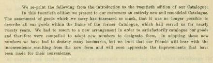

Please note that 1887 is the "twentieth edition" of their catalog.

Most certainly, Tavernier-Gravet remained the chief supplier for the K&E Mannheim rules well past the 1887 date. This seems reflected in catalog descriptions, which are largely unchanged until the 1890 year, when celluloid-faced rules are described. It's also important to note that there is no provision for a non-celluloid, boxwood slide rule, with cursor, to be sold after 1890.

The timing seems about right. According to Hans Dennert, grandson of the founder of Dennert & Pape, it wouldn't be until 1888 until they had fully shifted to making slide rules with celluloid-laminations on mahogany. By 1890, we can see that the new slide rule designations and descriptions would have been easily justified. And given that K&E likely had extra inventory of the old Tavernier-Gravet Mannheims, it makes sense that they would continue to sell these old rules with the new model numbers until 1890, when the new D&P rules were stated to be available.

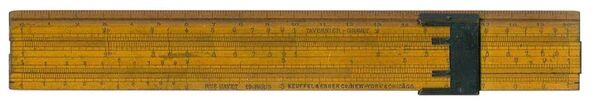

This 8" slide rule, bearing both Tavernier-Gravet and Keuffel & Esser markings, is listed in the Rarities Gallery of the Oughtred Society with an estimated manufacture date of 1885 - yet markings on the rule point to a much later sale date.

Yet, the slide rule pictured above gives me reason to think that Tavernier-Gravet slide rules were sold by K&E past the 1890 catalog date, and perhaps well past that date. This 8" slide rule, listed in the Rarities Gallery of the Oughtred Society, estimates a date of manufacture of 1885. This rule bears the name of both Tavernier-Gravet and Keuffel & Esser. An assumption of this date would indicate the rule as likely the Model 479-5, which was the 8" rule made prior to 1887. I believe it is more likely to be true that the date is approximately correct, but that the same model rule would have been sold for many years at a time without any evolutionary changes. The real point is not the manufacturing date, but rather the date that K&E would have sold it.

Two markings on this rule pinpoint the sale date to much later than 1885. First, on the rule's back is stamped "Medailles d'or 1878 et 1889," indicating the gold medals their product won in the World's Fair in Paris those years, the later year famously marking the completion of the Eiffel Tower. While the slide rule was certainly produced early, Tavernier-Gravet likely added this stamp to their existing inventory and new slide rules after this 1889 date. Second, also notice the reference to "Chicago" on the rule's front.

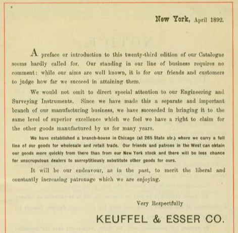

K&E's 1892 Product Catalog, the first to list a Chicago office, opened in 1891.

Knowing that K&E did not have an office in Chicago until 1891, as also expressed in their 1892 Product Catalog imaged below, this is perplexing. K&E would have to be offering this rule for sale after 1891, despite not having a matching boxwood model in their catalog.

Was there a line of boxwood only, T-G slide rules offered by K&E during the last decade of the century?

I would date this boxwood rule to the mid 1880s, as did the Oughtred Society, which also falls in line with my Tavernier-Gravet sample pictured at left. The indication of "Chicago" on front, identifying the rule as post-1891, could have been stamped after the fact, akin to the additional stamping on the back of the rule by T-G. This might be the typical method of operation for K&E: importing the components of the rule unassembled, stamping on all the numbers and labels, and then building the rule in-house with their own end brackets and cursors. (See also the Cox Original Duplex rule in the next chapter).

Likewise, it should be mentioned that early products offered by K&E were not required to have "Keuffel & Esser" stamped somewhere on the actual product. Often enough, K&E served as a distributor only. There is a fine line between products that K&E sold versus those that K&E wanted to be identified strongly with; yet, catalog entries for a product did not necessarily have to identify branded-products as from another maker. Likewise, it would have been sufficient enough if K&E wanted to "brand" such products, to personalize only the product packaging with their own "Keuffel & Esser" identifier. So, we shouldn't assume all samples sold by K&E to be clearly marked as such.

At some point, K&E certainly understood the concept of product branding, whereas by the turn of the century there would no longer be slide rules and accessories that did NOT have the company name emblazoned upon their surfaces. And we see indication of this earlier, with samples where the old maker's mark is scratched away in favor of the K&E branding.

Therefore, matching the catalog descriptions prior to 1890, Tavernier-Gravet most certainly supplied this boxwood Mannheim rule (shown in these pictures) as late Model 479 and early Model 1746 slide rules, with no real change in the rules appearance. The K&E stamped versions of the rule were undoubtedly offered after the catalogs stated that they were no longer available.

To further complicate the scene, we have the slide rule shown below:

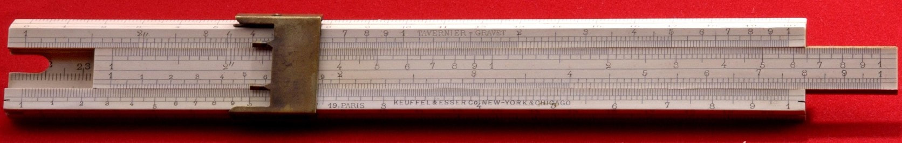

This is a Tavernier-Gravet slide rule with celluloid-facings of unknown wood choice. It has been assumed that Dennert & Pape was responsible for these early celluloid-faced rules since it is they who held the patent for the technology, but we see here that T-G also produced such rules for K&E, even into the 1890s as seen by the "Chicago" stamp also on this sample.

We have evidence that K&E was offering celluloid-laminated slide rules as early as 1888, according to E.A. Gieseler in a March 9, 1888 article within "Railroad Gazette" (Volume 20, p. 149) where the author mentions these rules by name as current offerings.

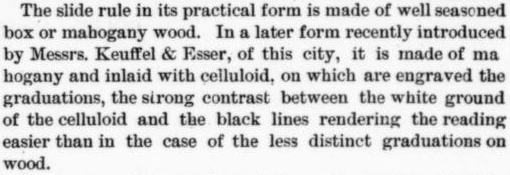

E.A. Gieseler's article in the March 9, 1888 issue of Railroad Gazette (Vol. 20, p. 149), an early mention of K&E's celluloid-laminated slide rules.

This matches well the 1890 catalog description and the three year gap between catalogs (from 1887 to 1890) whereas K&E could have been receiving rules from D&P. And without doubt, Dennert & Pape was around in 1891 for the production of the early duplex rules, particularly the Wm. Cox rule designed in 1891.

A wildcard in need of further research regards the use of the horizontal longitudinal lines (railroad scales) on samples from both T-G and D&P. This feature seems consistent with T-G rules of the era. But it is noted by a few sources that D&P no longer used such scales on rules after 1888, particularly in the U.S. markets. However many samples, including the Otnes' "Rosetta Rule," are in conflict with this generalization as there is no question that D&P produced rules with that feature during the 1890s.

So what can be said about this early maker mystery?

It is reasonable to believe that Tavernier-Gravet was responsible for the production of most boxwood rules prior to circa 1901, including those with celluloid-laminations. The exception would be the potential for the earliest rules to be made by Rabone and Sons, as Bob Otnes opined, and those possibly made in-house by K&E later in the century. This aligns well with some of the "Transitional models" and the "Favorite" rules to be discussed later in the chapter. Dennert & Pape, owner of the celluloid-on-wood patent in 1886, had shifted entirely to mahogany by 1888 according to Hans Dennert, so it is likely that all mahogany rules with celluloid after that date were made by D&P. Whether they also made boxwood rules special to K&E during the 1890s, or whether the T-G rules with celluloid were anything other than boxwood, is unknown; however, I would suggest that this could be a reasonable theory.

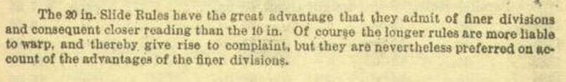

A screenshot of the Oughtred Society's Rarities Gallery listing for this rule.

It is also reasonable to believe that catalog offerings of K&E products prior to the early part of the 20th century should be taken with a measure of uncertainty. There are samples of slide rules that do not seem to conform to catalog descriptions. And the era was such that consumers would not have required the level of product certainty that we demand today. A box labelled "Mannheim rule with celluloid-facings" could have been filled with any number of products.

In conclusion, a picture of what was going on in the these early days at Keuffel & Esser is incomplete today. But there is enough circumstantial evidence to see that they, in addition to building some rules in-house prior to the turn of the 20th century, sourced their slide rules simultaneously from both Tavernier-Gravet and Dennert & Pape, and perhaps even others if the opportunity availed itself.

Note that early on, K&E rolled out a revamped series of the Duplex and Specialty rules as well, which we will talk about in later sections.

Earlier models in the Mannheim family of rules pose extraordinary degree of difficulty to describe. Mostly, we can thank the lack of surviving samples of these rules for this, as well as the absence of good descriptions or any firsthand, anecdotal, historical reports. But there will be a recurring theme until we get to the "flagship" Mannheim model in this family, the Model 4041 Series: up until the turn of the century, K&E seemed content to provide slide rules to customers using whatever was readily available to them, including from multiple suppliers, without too much rigid adherence to what the catalog stated was available.

<blockquote class="ke-callout">

"Early models in the Mannheim family of rules pose extraordinary degree of difficulty to describe...K&E seemed content to provide slide rules to customers using whatever was readily available to them...without too much rigid adherence to what the catalog stated was available."

</blockquote>

As we will see, the development of a standard celluloid-covered mahogany Mannheim side rule with the ever-so-familiar "K&E look" was most definitely a process!

Ordered historically, the major slide rule models in the Mannheim family include:

### The Model 479 Series

Let's start with a description of these first slide rules offered by K&E before we get into the real issues of the rules' manufacture.

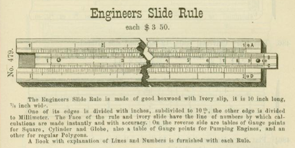

The catalog illustration for the Model 479, K&E's first slide rule, produced 1881 to 1886.

We see the catalog illustration for the Model 479, K&E's first slide rule produced from 1881 to 1886 here (above).

The original, cursor-less 479 model, offered in 1881, was 10" long and 7/8" wide, made of boxwood and a real ivory slide. Known as the "Engineer's Slide Rule," this 479 was later classed as a "Gunter" version of the Mannheim, which featured only the A, B, C, and D scales and no indicator cursor (it was used with calipers). This now rare - seemingly mythical - rule was introduced at a cost of $3.50, which I am certain was an absolute fortune back then.

In 1883, the 479 Gunter model became known as the 479-1, ditching the ivory slide. K&E also added two others to the line-up, the 479-2 and 479-5 rules. It's a curiosity, but the dash did not represent the length of the rule (a convention first appearing in 1911). Instead, all K&E slide rules were a Model 479, with the dash indicating a different product offered. The 479-2 and 479-5 were 10" and 8" models respectively that included trig functions on the back of the slide and a brass bracket indicator, also known informally today as a "chisel cursor." These were true Mannheim rules and grandparents of the future 4041 models that would be produced in-house by K&E after the turn of the century.

Assuming their first Model 479 was sold in 1881, in keeping with the first product catalog, then there would be 20 years of slide rules sold by K&E that were either outsourced from a manufacturer and branded by K&E or re-sold by K&E with their own catalog designation. The distinction is important. At this point in history, K&E production capacity was on drafting tools and surveying equipment, filling out their catalog with other items while acting as a distributor. For these 20 years, most would agree that K&E functioned as a re-seller where slide rules were concerned, first gaining the notion of designing and manufacturing their own slide rules in the 1890s, but not gaining capacity to do so until the end of the century. While we will see throughout this writing that K&E might have begun in-house production of some models even as early as the Cox Duplex rule in 1894 or 1895, it wouldn't be until 1901 when full production capacity of most all slide rules was reached.

It seems to be the general consensus that two companies were mostly responsible for providing slide rules to K&E during this time, French maker Tavernier-Gravet, during the Model 479 years, followed by German maker Dennert & Pape for most of the Model 17XX years. Working under the assumption that the shift to the newer models in 1887 also signified their shift in manufacturer, we should realize that their is evidence is to the contrary (please see Sidebar: Solving the Early Maker Mystery at left).

If I had to hazard a guess who K&E chose to manufacture these early Model 479 Mannheim rules, then I would suggest Tavernier-Gravet. Comparisons of known samples of T-G rules with model illustrations in the K&E product catalogs should be all we need to be rather definitive about the provenance of these rules. There are enough samples of T-G rules around today, including one in my own collection, pictured below, that gives us a strong indication of what these Model 479 slide rules might have been.

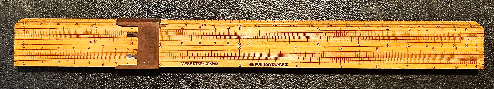

The 10" Tavernier-Gravet Mannheim rule in my collection is likely what we should expect the Model 479-2 slide rule to look like. This rule could have been produced as early as 1883, matching well K&E's catalog descriptions for the rule. The fact that no Model 479 rules have resurfaced today indicates that K&E may not have stamped their brand physically on the rule for the early models, and thus such rules are out there, but in hiding.

However, renowned collector Bob Otnes conjectured that this rule could have been produced by John Rabone and Sons in England. In the Otnes' article, "Keuffel & Esser - 1880 to 1899" published in the Journal of the Oughtred Society, Spring 2001, p. 18, Otnes bases this thought on similarities between a Rabone 8" rule in his collection and the 10" Model 479. In an earlier JOS article (Oct. 1995, p. 15), he mentions that a regular scale rule (not a slide rule) in his possession in the 1883 catalog has both Rabone and K&E labels. He also states that he possessed a "gunter" style rule from Rabone, with no K&E markings, but that he felt could have been a 479 slide rule.

I credit Taverner-Gravet with the majority of the production of the Model 479, conceding that Rabone could have made the earliest version of this rule prior to T-G. And that tends to conform well to the way K&E did business during this time, as it seems that K&E would have sold anything to the public if there was money to be made. Because the catalog descriptions and illustrations are wildly generic, the actual rule being sold could have been anything that fit in a K&E wrapper.

So it should be noted that the Tavernier-Gravet rule in my collection could very well have been the same rule sold by K&E during this era, despite not having a K&E maker's mark on the rule. I feel this might be especially true in the early years of the company when K&E seemed urgent to increase their catalog offerings as rapidly as possible. This would also explain the absence today of these older K&E slide rules. I do find it difficult to believe that these rules are so rare, as known rules from other manufacturers of the era are not. Rather, today, I believe these older Model 479 slide rules might have gone "incognito," bouncing around today in a different guise.

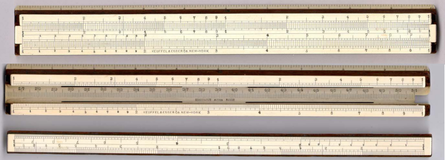

From the collection of the late Bob Otnes, this rule, coined as the "Rosetta Rule," connected Dennert & Pape definitively with K&E during this era. With celluloid-facings, this would most certainly be a candidate (there are others) for the Model 1746 rule (sans cursor) in the new Mannheim series beginning in 1887, yet celluloid-laminations are not mentioned in the catalog until 1890. The Otnes collection also has a 50cm version - K&E model 1748 (?) - yet with the D&P maker's mark in the slide well ground away.

### The Model 17XX Series

Officially replacing the Model 479 series in 1887, the new model numbers were necessitated by a better way to catalog K&E product offerings (see the Sidebar above). So for a time, there is no evidence to suggest that these new models would be any different than those that preceded it. However, by 1890, these slide rules would include the likelihood of a shift to a new supplier; namely, the German maker Dennert & Pape (known later as Aristo).

The first two rules in the series were the Model 1745 and Model 1746 rules, both 10 inches. The Model 1745 retained the basic Gunter design, made of boxwood with engine-divided scales, and no indicator cursor. Similar in construction, the Model 1746, with brass cursor, was a true Mannheim rule, adding S, L, and T scales on the reverse of the slide, as well as inch and centimeter scales on the edges. It also had a centimeter extension rule in the slide well.

Subtly important is the catalog description which lacks indication of the wood type. A pattern develops in these descriptions - when characteristics of the rule they will sell are certain, K&E will say it; but when uncertain, they leave the description intentionally vague. The wood type is suspiciously missing in the 1746 Mannheim descriptions all the way through the 1899 catalog. This should be an indication that K&E left open the possibility of a variety of slide rules that could meet the description, some boxwood and some mahogany.

These rules, like all T-G and D&P rules known to this point, had horizontal "embellishment" lines, known by most today as "railroad" scales. By the end of the century, both of the rules had transitioned to mahogany construction. A 20" version of this rule called the 1748 was introduced in 1890, and a 5" version called the 1747 arrived in 1899. Of the 20" rule, K&E seems to be rather apologetic. Their catalog description in 1890, and as printed below in the 1895 catalog, states...

Interesting that this statement is made a decade prior to 1901, when they would roll out their patent for the "adjustable slide rule."

Two more rules in the series arrived in 1897, including a glass cursor version of the 1746 called the 1746-1/2 and the first of the "Beginner's Rules" known as the 1749-1, strangely also a 10" model. I say strangely because K&E used the 1749 model number for a wide variety of products by applying a dash. For example, Colby's and Crane's Sewer rules (see Specialty Rules in a later section) were numbered 1749-2 and 1749-3 respectively, and their 12" ivory and boxwood sector rules were numbered as 1749-7 and 1749-8.

A 1744 duplex 10" rule (at a retail cost of $6.50) was also produced in this series (see The Duplex Family in a later chapter). This, known as the "Cox Patent Rule," was an important slide rule to the history of K&E, so it will be handled in the later context.

Mahogany was not exclusively used for celluloid-faced rules during this time, as the Model 1748-3 was introduced to this series in 1899. This 10" boxwood Mannheim rule would become the Model 4054 "Favorite" rule in 1901; though there is no model number on the rule. However, the 1748-3 is described as "Favorite" in the 1899 catalog. To save time here, you can read about the 1748-3, it's construction and purpose, below within the section on The Favorites, since it essentially is the same rule.

Finally, it is speculated by some that this same Model 1748-3 rule might have first appeared shipped in a box labelled "American," not appearing in the catalogs. This boxwood rule, every bit as similar to the "Favorite" Model 4054 series (described later in this section) and the 1748-3 just mentioned, is thought by some to be K&E's first manufactured rule. At least that is a working theory, with the "American" label being apropos if that's the case. It is mysterious though, since there is no labelling as such on the rule itself, but rather the only indication of its existence comes from actual samples that came in a case so labeled.

Samples of this "American" rule are widely known, but rarely found, and is very desirable among collectors. There is some indication that the American rule might have continued through 1901, as there are samples that are also adjustable. This most certainly is perplexing on top of already being a mystery! There is no known associated model number to go with the American slide rule and no company literature that talks about it historically.

The absolute best source to read with regard to the "American" rule can be found in Part 1 and Part 2 of Mike Sypher's insightful articles found at his terrific www.followingtherules.info website.

It appears that one of the common traits of all rules within this 17XX series is the 26cm long form factor with scales of 25cm length for the 10" rule; and all rules regardless of length did not leave much room at the ends. This 1/2 centimeter on each side of the rule complicated the use of a glass indicator with single hairline, since barely 1/2 of the cursor would be on the slide rule when set at the indices. This is an oversight, but there is some evidence from drawings in the early catalogs (specifically 1899) that a double hair-line cursor did exist, which would be available as an option later for the Model 4041 Series, as well as used on some later specialty rules such as the Model 4133 Roylance Electrical and the Short Base Triangulation rule.

A note regarding wood choice. As we have shown, Dennert & Pape was producing celluloid-faced mahogany rules during this time. But we should likely expect variance in the types of wood in use between models as well as model years. Exact dates of the use of wood within models are unknown, as it is possible that a mix of woods could have been used to supply the same models during this time.

Similarly, as clarified in the Sidebar: Solving the Early Maker Mystery above, there is a sample of a celluloid-covered slide rule made by Tavernier-Gravet that also meets the description of the 1746 model. As such, it becomes difficult to know how K&E incorporated both suppliers into this picture. But most certainly Dennert & Pape was responsible for the early celluloid rules, as they would have been the only maker able to make these rules due to patent rights. Such rules from Tavernier-Gravet would have required some lead-time before D&P licensed (we assume) these rights to other makers. Let's call that logical conjecture.

Because of the variance in both maker and make, it's highly probable that K&E used generic descriptions in the product catalogs of this era so that they could offer slide rules covering multiple construction materials and techniques from multiple suppliers. There is not enough conclusive evidence to say when Tavernier-Gravet and Dennert & Pape supplied rules for K&E. Nor do we know when K&E began producing such rules in-house, as we believe they did with the Model 1748 "American." I could see all three events happening simultaneously, with K&E putting any one of those rules in a box that was labeled "Model 17XX."

Mannheim slide rules of the 17XX series were replaced across the board in 1901 with a complete line-up of "new" slide rules, thought by most to be company-made. But the transition to full-production of all rules would still take some time giving rise to some slide rules referred to in the next section as "Transitional."

Nevertheless, any rules of this era are rare for today's collector.

### The Transitional Years and Models

During the last 5 years of the 19th century, it is obvious that K&E was experimenting with what they wanted their Mannheim Family to look like. Some rules, like the American/Favorite, had most certainly been made in-house; but not all, showing that K&E was transitioning between the roles of importer and manufacturer of their rules.

Between 1901 and 1906, despite the new model designations and added slide rules to K&E's product line, a few of these slide rules seem to have an identity crisis, as they would not resemble the rules of the product line a decade later. The rules themselves seemed to shift freely between boxwood and mahogany construction during this era - and I surmise that some rules were made of any wood K&E could find. Others held on to the metal "chisel" indicator when it was clear that glass was largely preferred. Several others retained the "railroad" style of scales, unlike all other 4041 series rules, yet some like the 4030 model dispensed with the horizontal embellishments and took on the cleaner, more modern look of the next series.

In fact, many of these rules could be classified in the "Model 4041 Series," a classification given by collectors, not K&E; however, these rules, which I've classified as "transitional," are different enough despite their spiritual heritage and similar model numbers. I suspect this is mostly because of existing back-inventory from Tavernier-Gravet and Dennert & Pape that K&E did not want to waste, and so they sold them with revised model numbers to match the 4XXX series designations. Therefore, here are some models sold in the first decade of the century that held onto life as remnants from the 17XX model line or remain different enough to deserve separation from the rules talked about in the next section.

These rules are as follows...

**Model 4028 Gunter** - This 1901 model succeeded the 479, 479-1, and 1745 "Gunter" rules of previous years. Remaining cursor-less, this model was discontinued after 1906, and would have likely never been offered for sale in the 20th century if K&E didn't still have a back-stock of slide rules in which to dispose. Their rarity today is likely an indication of sales; I know of no known samples of this Gunter rule. Or, as mentioned, it could be incognito. Regardless, the rule disappeared after the 1906 catalog.

**Model 4030** - This model is the 5" Model 1747 described above, both in form and function. It is non-adjustable boxwood with the basic Mannheim scale set. Like all models for the 1901 years receiving a new 4XXX designation, the 1747 was christened the Model 4030 and sold for the next couple of years. I would speculate that the sole reason it sold after 1901 was because of back-inventory of the 1747 rule, and as such is a likely a Dennert & Pape imported rule - operating on my theory that D&P produced the rules made just prior to 1900. Albeit, it is indeed curious why D&P would make these boxwood rules when it is known they had shifted primarily to mahogany construction during this era? This rule was, however, in the 1901 catalog and listed among the "adjustable" rules. This shouldn't pose any issue, since the 4030, 4031, and 4032 are completely interchangeable at this time other than their cursor options.

**The Early Model 4031** - Continuing with 5" slide rules, this rule is essentially a Model 4030 made to be adjustable like the mahogany Model 4041 Series, and is listed as such within the 1901 catalog. But because it is boxwood with the identical 1747 legacy, this production rule is far different than the K&E-built rule to come in 1906 with the same model number. Hard to say why this rule did not change to mahogany with the rest of the 4041 series in 1901, but noting that this is a 5" slide rule, I would surmise that K&E had the most back-stock of this size. As we will see with most all early wooden slide rules, K&E couldn't sell shorter slide rules at a discount to the longer ones and likely didn't sell many 5" rules. So with essentially an over-supply of 4030 slide rules laying around, then adapting them to the new adjustable technology makes sense to me.

**Model 4032** - Once again, a 5" rule identical to the 4030 and 4031 models of this time, the Model 4032 came with the earliest of K&E's magnifying cursor. Otherwise, like the 4030 and 4031, I'm guessing it too is a D&P rule. It would translate like the Model 4031 does into a full-fledged member of the Model 4041 Series as far as construction goes, but it would eventually be discontinued by the 1909 catalog.

**Model 4040 and Model 4050** - These are 10" and 20" models of the same Model 4041 that would appear in 1901, fully-adjustable and made from mahogany. However, these would be the last K&E rules to offer the chisel-type brass cursor. These, like the Favorite/American just prior to the new century, were most certainly built in-house by K&E. They could just as well be placed with the rules of the 4041 Series, but the chisel cursor banishes it to this list of transitional models. Both models, like the 4030, would disappear from the 1906 catalog anyway.

Beginning with 1901, most collectors sort the Mannheim Family of rules into three broad categories: the flagship Model 4041 series, the middle priced Favorites series, and the budget-minded Student or Beginner's series. So we see that K&E is already showing that market positioning and product placement is essential if they hoped to sell slide rules, particularly in the numbers that they would eventually sell.

Also important for collectors is the idea of standardization within the appearance of K&E rules, and as such, what follows is mostly a strong commonality in the look and feel of K&E's wood rules that would dominate the next half-century. As such, next, I will focus on aspects of the Model 4041 Series that are typical of what we picture when we talk about these rules, as well as what we can realistically expect when we purchase them more than 100 years after they are made.

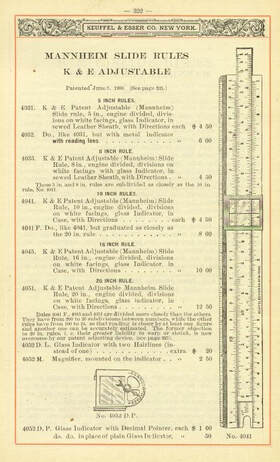

From the 1906 K&E product catalog, this page defines their Mannheim rules as being "adjustable." This was also true of the 1901 catalog, but this version drops the 4030, 4040, and 4050 models, as the brass chisel type indicators were no longer offered. While the cursor-less 4028 Gunter was still being offered, it is mentioned on the preceding page and not with the adjustable rules.

### Model 4041 Series

Once K&E replaced the 1746 and 1748 rules, as well as having moved past their transition period of various and sundried slide rules mentioned above, the Mannheim product lineup solidified and standardized around the Model 4041 series, both in form and function. These rules described below were manufactured in-house by K&E and sold with a sewed leather sheath. Although many of these rules were listed in the 1901 catalog, what we will classify here as the Model 4041 "Series" will be those models listed in the 1906 catalog and moving forward.

The most important aspect of this series that differentiates them from those I mentioned in the previous sections are that 1) all are made of mahogany and 2) all rules of this series are made to be adjustable, based on Keuffel's patent of the "Mannheim Adjustable Slide Rule Frame" in June, 1900.

## Sidebar: Mahogany vs. Boxwood

As early as 1900, we see Keuffel & Esser shift the majority of its slide rule construction from boxwood to mahogany wood. This, following on the heels of their major supplier, Dennert & Pape, having done the same. Likewise, American competitor Dietzgen also followed suit.

The exception to this great "mahogany migration" were K&E's Beginner's rules which I believe were some other wood, as I will contend later in our discussion of them. Likewise, the Favorite series would continue to utilize boxwood. Even so, within a short amount of time, every wooden slide rule manufactured by K&E would be made of mahogany.

So, clearly, there is an aspect of mahogany that makes it the preferred wood for slide rules. I believe if we hope to understand K&E's mind on this, a deeper dive into the nature of these woods is required. As a woodworker myself, I think that perhaps I can bring some clarity.

Boxwood is more of a shrub than it is a tree. While it can grow to 20 feet or more, it yields a trunk no more than about 6 feet on average, and is seldom straight. This means you could never really supply longer projects with it as it could never produce conventional "lumber" in lengths any more than a foot or two. Instead, any of the three European species that historically supplied rulers and slide rule makers in the 17th and 18th centuries - England was almost entirely the center of manufacturing during that era - would have been cut into logs like firewood and then milled up longitudinally to form short "blanks."

These boxwood blanks would have been hard, much harder than mahogany, making the milling process a challenge. And while the wood has small pores, the grain of the wood does not always run straight. This causes something referred to as "grain run-out" which affects ones ability to smooth the blanks, as the boards tend to "tear out" if planed (smoothed by knifes) in the wrong direction. Additionally, multi-directional grain tends to lend to more seasonal wood movement along the entirety of the wood's surface, not only at the blank's end grain. This means the blanks will be prone to warping, bowing, or swelling if they take on increased moisture from the air, as well as end-grain "checking" or cracking during the drying/curing process.

Wood with multi-directional grain may also hold tension, meaning that once milled, it will have a natural tendency to bend to another shape. So the procedure when working such wood is to cut pieces over-sized, wait a day or two, and then mill the wood to final dimensions after the board relaxes. Not only does this property require extra time in milling, but it can also make the boards bind against the blade during cutting operations as the wood releases its tension through the cut. This, coupled with its extreme hardness (there is no harder wood in Europe), makes working boxwood more risky than woodworking-friendly lumber, like mahogany.

Another important point directly relevant here is that the properties of boxwood would not make it the best candidate to be laminated with celluloid, even if many rules did just that just prior to the turn of the century...but more on that shortly.

But once well-seasoned (dry) and sealed, then boxwood tends to hold its shape. It also can be brought to a very smooth finish after sanding and polishing. For this reason, today, boxwood is considered a lovely wood when "turning" (with a lathe), for making small pens, chess pieces, small wind instruments, croquet mallets, wooden goblets, and bowls. It is seldom used for objects with flat dimensions since boxwood is not very "workable" beyond its use in turning.

In the 19th century, when K&E first began offering slide rules, they would have taken their lead from Tavernier-Gravet, so it makes sense they would have continued with the European tradition of using boxwood until it became impractical to do so.

On the other hand, mahogany is a very versatile and wonderful wood to work with. It too is a hardwood, though only moderately so. It is soft enough to work with relative ease. Orangish-brown in hue with large pores and a glimmering chatoyance in brighter light, this very straight-grained wood could be milled from very large stock as such trees grew quite large. The wood is known to be dimensionally stable, making it perfect for use in products like musical instruments, especially in guitars and for guitar necks. It's a woodworker's dream, as it can be easily milled flat with very little tear-out of the grain upon plaining. And it retains its shape once cut, with very little internal tension.

The only point of curiosity with regard to slide rules is one of supply, particularly to Europe. True mahogany comes primarily from the tropical Americas, major sources being Honduras, Mexico, Cuba, Jamaica, West Indies, and many regions around the Caribbean, including Florida. There are many mahogany "knock-offs" - related species - that are marketed as such, but only African Mahogany (Khaya) would be close enough to have been possibly used in slide rule manufacture. I have heard it stated that D&P and, therefore, K&E received their mahogany supply from the German slide company, Nestler, though it begs the question of how Nestler was supplied?

It's not beyond reason, if this is the case, that Nestler could have imported their lumber from the Americas, as the wood is plentiful enough to be reasonably priced. Likewise, a single board would have produced an enormous number of slide rule blanks without any waste, something that could not have been stated about boxwood. And once K&E began to manufacture their own mahogany slide rules, then finding a supplier in the United States would have been quite easy...and relatively cheap compared to the imported boxwood.

By the turn of the 20th century, the shift from boxwood to mahogany was industry wide. We can speculate the reasons why. First, it is likely that boxwood just became increasingly more difficult to supply. It was most certainly becoming over-harvested. Combining this with its susceptibility to disease and moth infestation, a known problem to world supply over the past century, it would have made boxwood far too in demand...and therefore expensive. So the shift to the better mahogany supply would have been required.

More importantly, since celluloid-lamination of wood was quickly becoming the desired construction for slide rules, then it would have made sense to use a wood-type that paired well with the plastic. As mentioned earlier, boxwood is not really the best candidate for that. We need look no further than with Dennert & Pape for evidence, whose first boxwood slide rule was introduced in 1872, yet a short 16 years later, D&P had shifted production almost exclusively to mahogany, coinciding almost exactly when their 1886 patent for celluloid coverings was granted.

As such, two questions come to mind. First, why did K&E still offer boxwood with some of their rules, even after 1901 when many rules were mostly produced in-house? And, second, once K&E made their own rules, did they pay a royalty to D&P until 1906, when the original 1886 patent would have expired?

To answer the first question, I believe K&E received their boxwood supply of both slide rules and blanks from Tavernier-Gravet. While the writing was on the wall for boxwood, they certainly could have had a back-stock of inventory needing to be sold. Remember that these slide rules were expensive for the time, and there wouldn't have been many people persuaded to need them yet.

Although I have not heard it mentioned anywhere, K&E would have needed to have arrangements with D&P extending to 1906 even if rules were no longer supplied to them. There is no doubt that K&E would have honored the German patent (DRP 34583) and paid them a royalty for using their patented construction. This would seem to make sense as, next to 1901, 1906 was the next major catalog year, where K&E made a large number of changes to their slide rule lineup, as well as solidifying existing models, including their Mannheim and Duplex Family lineups.

For this reason, D&P would likely be responsible almost entirely for the mahogany-based slide rules approaching the 20th century, with Tavernier-Gravet, certainly paying for that right, to make their own celluloid-laminated, boxwood rules. (I have not been able to confirm if they also produced such rules from mahogany.) So during this era, a picture develops of K&E receiving their supply of boxwood rules from Tavernier-Gravet and their supply of mahogany rules from Dennert & Pape. I could see 1901 as being a target for in-house manufacture for all slide rules, with inventory to burn until 1906, at which point they would no longer be under the contract with D&P and could build most all of their slide rules to a more uniform consistency.

By that point, mahogany would have been the rule of choice for a variety of reasons, most importantly, price.

Today, nothing has changed. Boxwood is very expensive, mostly because by today's standards, lumber mills see no value in putting in the extra work to prepare small blanks of wood for woodturners unless they can extract more value from them in the form of high prices.

Regarding the shift to mahogany construction, I explore the reasons surrounding it in the "Sidebar: Mahogany vs. Boxwood" alongside. Regarding adjustability, K&E long understood that weather could change the moisture content of the wood, causing seasonal swelling - remember their comment above regarding the tendency of the 20" Model 1748 to warp? So any rule without the patented adjustability, namely those made prior to 1901, would have been hard to use on occasion.

As such, after 1901, all "flagship" models with the Mannheim frame, including the Model 4053 "Polyphase Mannheim" rules in the next section, would boast "adjustability" as a significant improvement, and they could justifiably charge more for it! Conversely, mid-tier and budget rules would not include the extra feature and could be viewed by the consumer as a cost saver.

Despite early questions about what all their Mannheim rules looked like in 1901, the Model 4041 would be the flagship model for this Mannheim series, most certainly in the eyes of modern day collectors. This Mannheim rule ($4.50 in 1901 and 1906) was a lovely 10" mahogany rule covered in celluloid with engine-divided scales and glass cursor (evolving over time). The original 4041 rules would have no model number until around 1912, at which point it would print the model number vertically in red at the end of the slide, as has become familiar with most all K&E rules.

Prior to 1911, when K&E would move to the "dash length indicator" naming convention, K&E used different model numbers for the same rule in multiple lengths; therefore, the same 4041 rule became the Model 4031 in a 5" length and the Model 4051 in a 20" variety. In 1906, they would add the Model 4035 in an 8" length (the first 8" rule since the original Model 479-5) and the Model 4045 in a 16" length. Most models are similar in construction and appearance, though many took on evolutionary changes earlier than others. Formula and conversion charts on the back of the rules pretty much stayed identical across all models and across all years. The exception is the 5" Model 4031, which retained the old chart since it was too small to use those of the larger rules. But recall that these are fundamentally Mannheim rules, and just as a reminder they all consisted of the following scale set:

Front Side: Inches // A [B, C] D \ centimeters
Rear of Slide: [S, L, T]

The rule would also have a centimeter extension scale in the slide well on laminated celluloid, though it would disappear in 1912 in an evolutionary change.

Speaking of which, let's look at how the 10" 4041 model evolved over time:

The rule retained a similar font and scale design as the earlier 4030 models for the first year or two, but changed between 1902 and 1904, while also adding red ink to the maker's mark. In 1904, the 4041 added a centimeter to the rule's physical length, making for a 27 cm format. This solved the issue of the indices being too close to the ends of the rule, and therefore fixed the problem with the cursor hanging off the end. Even so, K&E would continue to sell the two-hairline cursor, designated the 4052 D.L until beyond 1916. Note: K&E would also sell the magnifying cursor (4053 M) and a "decimal keeper" cursor (4052 DP) through 1906 (as shown above), being discontinued by 1909. With the extra space at the ends of the slide, the vertical, bracketed model number &lt;4041&gt; appeared in 1912. The centimeter extension scale in the slide well disappeared as well. This left only the June 9, 1900 patent notice remaining on the celluloid-covered slide well, still in black ink. In 1914 or 1915, the metal-framed cursor gave way to the "frameless" all-glass indicator, first with metal rails, and then with celluloid plastic rails in 1916. In 1917, the celluloid-lamination in the slide well disappeared and the patent notice moved to the front of the rule, in red. In 1921, it is interesting to note that the pricing of the 5" and 8" models was raised to $7.30 and $7.70 respectively, whereas the 10" charged $6.50. This indicates that the shorter rules were more expensive to make, likely because they were deemed to be "divided as finely" as the 10" version. If extra labor or tooling was involved to make that happen, it's curious why it took 20 years before this was reflected in the pricing? In 1922, like all K&E wood rules, serial numbers appeared on all models of the series. The 4041 (and 4035) added the "N" designation in 1925 with a slightly wider frame (see below) - growing from 32mm to 35mm wide - as well as scale labels. The 4035 model followed suit two years later. In 1936, like almost all K&E rules, the improved-glass, metal framed cursor was introduced. The scale designations were shown on the front of the rule. In 1939, the 16" and 20" versions are discontinued. In 1941, only the N4041 is left in the catalog, disappearing itself in the 1943 catalog.

Throughout the history of the Model 4041, a few custom versions appeared as special order rules. Interestingly, and mysteriously, a sample of the Model 4041 appeared around 1910 with railroad track scales. This seems to pay homage to the old days of the D&P rules, as it was otherwise similar to the typical K&E-made 4041 being produced at that time. Even so, it's a real curiosity, and should not be a surprise to us given the amount of experimentation going on all throughout the early part of the 20th century. This version is not listed in a catalog. This 4041 rule was also produced between 1906 to 1935 with a finely-divided scale option known as the N4041F (a $3.50 upgrade). These rules included engine-divided inch and centimeter rulers on the sides (and a centimeter extension rule in the slide-well up until 1912). Likewise, during almost the entirety of the 1920s, a version of the rule could be ordered with decimal-reminders; "Quotient +" and "Quotient -" labels on the end of the slide. This option is not listed in any catalog of which I am aware.

As I mention in the Collector's Outlook (see below), the 10" Model 4041 is quite ubiquitous; however, the length variations of the 4041 are quite hard to find, as is the N4041F, "finely-divided" model of this series, as too the railroad track and decimal-reminder variants.

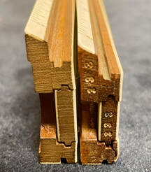

With the original Model 4041 on the right, we see the 3mm difference with the new 1925 N- version of the model (left).

I would conjecture fewer of the variations of the 4041 were sold due to the pricing structure. $4.50 could have bought the consumer any of the 5", 8", or 10" models, as they were all equally priced. One might question why this is the case, but it makes sense when we consider that production time and cost would have been similar regardless of the rules' length. And most consumers of the day would have only been able to choose one such slide rule due to the high cost, not feeling compelled to have, for example, a pocket model to go with their full-scale daily driver. Similarly, the 16" Model 4045 and the 20" Model 4051 were priced $10 and $12.50 respectively. Those prices represent a rather steep requirement for slide rules that wouldn't have been significant functional upgrades to the 10" rule.

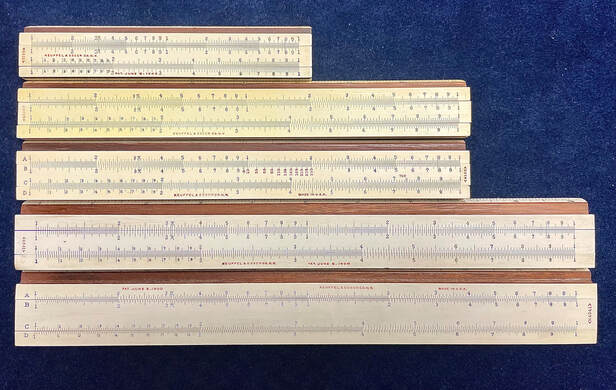

A size comparison of rules in the 4041 series, shown here without cursors. The middle rule is the 8" 4133 Roylance Electrical (discussed in Chapter 4) shown for comparison to the Model 4035 above it. Two other items to note. First, the diminutive size of the 5" Model 4031 might surprise you. This sample is missing its cursor, so finding a replacement could be a challenge. Second, the bottom rules show the difference between the "N" and non-N versions of the Model 4041, with the N4041 (bottom) growing 3mm wider in 1925.

Modern day consumerism, whereby products providing 20% performance improvements at double the price is an acceptable trade-off today, would not have been the nature of K&E's market in the earlier part of the century. Thus, to the consumer, it's easy to see how the 10" Model 4041 rule would have represented the very best in value, and as such would have been K&E's primary seller in this model series. Because of this, more than 100 years later, it has made tracking down the entire series of rules quite a challenge since, undoubtedly, relatively few of anything OTHER than the 10" rule was sold.

### The "Favorites" - Models 4054, 4055, and 4056

Collectively marketed as "Favorites," these basic 10" Mannheim rules are lower cost varieties of the 4041 series, also part of the huge product roll-out in 1901. The 4054 ($3.00 retail price) and 4056 ($2.75 retail price) ran during the length of the original 4041 production run (which changed to an "N" designation in 1925). Dropping all Favorite models in 1925, they reinstated the line in 1927 in the form of a lone 4055 model. The Model 4054 was identical to the 4041, complete with celluloid scales, except for its less expensive choice of boxwood* and painted-on inch and centimeter rules on the sides. The Model 4056 saved consumers even more money by being a bare "polished" boxwood, completely painted-scale model. Both models lacked adjustability.

Once the 4054 and 4056 were dropped in 1925, the new Model 4055 design featured celluloid-laminated mahogany with engine-divided scales, but it lacked inch and centimeter rules on the sides. It was considered a middle-ground option between the top 4041 Mannheim rule and the budget student/beginner rules (see next model) that K&E always offered. A 10" scale length was the only option for these rules.

Both of the 4054 and 4056 models would be reintroduced at points in the future. In 1936, the year that the "improved-glass" cursor was introduced across many K&E slide rule lines, the 4056 was reintroduced as a budget version of the 4055, the $3.50 latter rule receiving the new cursor and the former getting a standard metal-frame glass cursor, saving consumers a dollar. Otherwise, the rules are identical, including mahogany and celluloid-facing for this new 4056 - a vast improvement over the original, spartan 4056 model.

In 1944, when K&E finally ended the long reign of the 4041 Mannheim, they also discontinued the 4055, leaving the 4056 as the sole "Favorite" model. The 4054 was also reinstated as a nice budget option for the N4053 Polyphase Mannheim, which we will talk about shortly.

The new version of the 4056 would endure through 1952, when it was discontinued. I would speculate consumer tastes were shifting more toward the wide-variety of pocket rules K&E offered at the time, including their variety of Ever-There models (see next section), as well as the new line of modern, all-plastic Polyphase rules being pushed out around 1950, known as the Doric models (please see Modern Polyphase Rules in the next section).

I should note that the original boxwood versions of the 4054 and 4056 Favorite rules are very hard to find. I suspect this is because they weren't as long-lasting as the adjustable mahogany rules that litter eBay. These rules, if found, are easy to mistake as "ordinary," so it's likely that a collector might not have to pay a lot if they stumble across one. Shown below, a 4054 Favorite rule from circa 1915 in my collection was acquired in exactly just this manner.

*Note: I do not feel boxwood was less expensive to K&E, but only that they likely had enough supply to produce rules for the Favorite series.

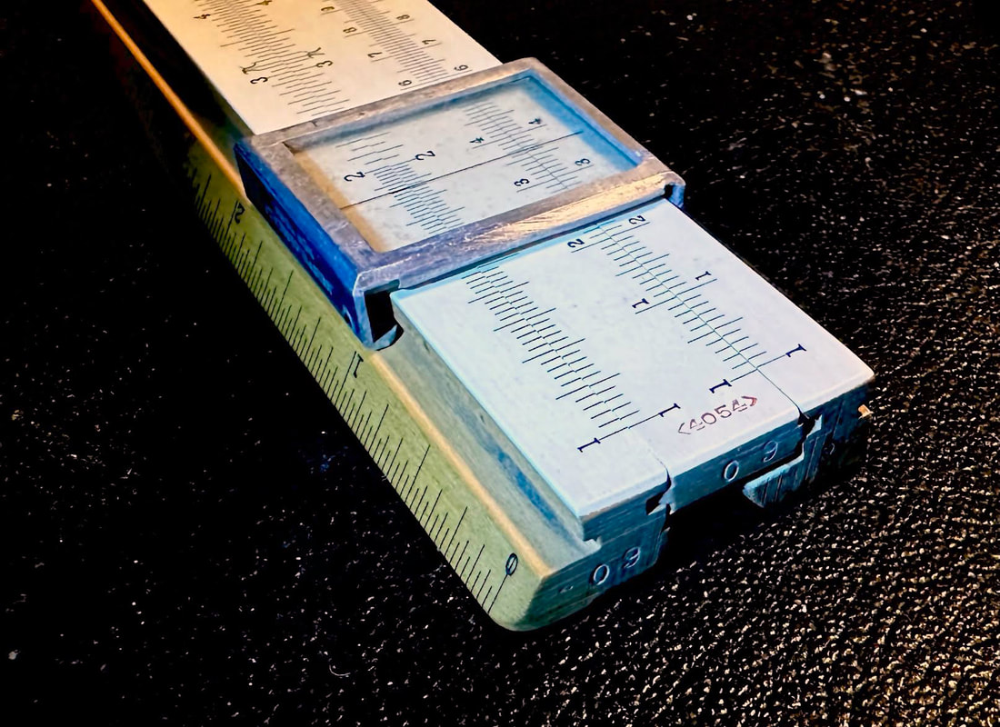

This is a 4054 Favorite rule in my collection from approximately 1915. Note the plain boxwood on the inch ruler, the celluloid-covered face, the early production number on the ends, and the indices almost at the edge of the rule. It is exceptionally rare. At any given time on eBay, there will be 15 or so 4054 rules, yet all of them will be the later Polyphase model. A keen eye might be able to notice this gem when it arises, and it will likely be priced like all the 4054 Polyphase rules. I paid less than $20 for this sample.

## The Beginner's Family

It would become obvious by the turn of the century that the everyday person would not be able to afford a slide rule. With the rising prices of materials and costs of quality craftsmanship, a budget alternative was necessary. In many ways, such rules served as an introduction to slide rules, encouraged by K&E to be a first purchase so as to begin what they hoped was a life-long customer with fierce brand loyalty.

As mentioned earlier when discussing the 17XX series of Mannheim rules, it was apparent that the push toward a more broad customer base was happening, both in the language used within their product catalogs and in the 1901 expansion of product offerings. That said, let's take a look at the next series of single-sided rules, based on the Mannheim type. Whereas later rules in this family will shift away from the pure Mannheim scale set (which could be talked about in the next section), we will continue to discuss them here to better demonstrate the evolution of K&Es least expensive slide rules.

### The Model 4058

A "student" model for any budget, made of a less expensive wood, glued-on paper-scales, and a metal-framed, glass cursor, the Model 4058 was the carry-over of the previous model 1749-1 introduced a few years earlier. Reintroduced in 1901, the rule had a rock-bottom price of $1. These rules did not include the inch/centimeter scales on the sides, but otherwise offered the Mannheim scale set. It should not be assumed these were constructed in-house. I've seen rules by Nestler that look suspiciously similar to me.

While all 4058 variants served the purpose of a budget rule, these were not intended to last long, nor be rules to keep for long, as the catalog states, "for the use of beginners to enable them become familiar with the slide rule without incurring the expense of the regular rule..." Apparently, once the user became "familiar," they are recommended to acquire another rule, at which K&E knew a place they could be purchased.

As such, they were likely imported rules up until the 1913 Product Catalog when they are described as printed directly on the rule (without the white paper). There is no indication that the new rules were made in-house, but the cursor was certainly K&E-made, however. W.L.E. Keuffel's patent for a folded-celluloid cursor, issued in 1916, was introduced on these rules at that time. Rules would begin to be stamped with that patent date on the front of the rule around 1920, the same year that K&E added a "Made in USA" on this slide rule. I treat that as significant while others might not.

This model was introduced as the "Student's Slide Rule" from its inception, with that label also getting placed above the formula table on the back of the rule in 1923, this also coinciding with a change in formula charts to the familiar "US Bureau of Standards Circular No. 47" version.

## Collector's Outlook: Single-sided K&E rules

Note: Suggested prices are for slide with case on eBay. Any extras, especially those considered complete, with box and documentation, can double these prices.

Single-sided K&E rules are easily collectible, if by "collectible" we mean easily and cheaply found. The basic student rules of the 4058 series are abundant on used markets between $10 and $20 respectively for the full-scale 10" rule. The same can also be said of the 4053 Polyphase series. The 8" and 20" versions do carry a higher price, but can typically be found in the $30 to $60 range depending on condition and completeness.

The special versions of the Beginner's rule, Models 4059, 4058D, and 8858 Special War Time rule are all very rare, appearing maybe every other year on eBay. Prices for the 4059 and 4058D are as cheap as the normal 4058 rules, likely because nobody recognizes them when they come up and aren't truly collectible. On the other hand, the Model 8858 with its special war time packaging is more collectible, likely going for $50 to $100 if one were to come up again. It has been quite some time that this has happened for any of them.

The 4041 series is also quite common, likely $20 to $30 for a rule in good condition. The variations of this rule are where they become much more desirable. The 5" 4031 and 8" 4035 are difficult to find. The 4031 model comes up on eBay maybe once a month, selling for around $40 on average. The 4035, maybe once per year for a similar price. The original 4040 version in this series, that with the brass cursor, only had a run of 5 production years, and thus it's quite rare. Only two samples have been sold on eBay over the last 23 years, averaging $273. A sample of the 16" 4045 and 20" 4051 will come up for sale every other month or so, with an average price of ~$50. Of course there's often another one posted for maybe 3 times that amount that remains there forever.

Highly desirable is the "F" or "fine-scale" version of the 4041 and 4053 slide rules. They come up maybe once or twice a year with an average selling price of perhaps $100.

Others that are moderately collectible are the 4054/4055/4056 "Favorite" series of rules, which are found easily on eBay for maybe $20. The exception is the original boxwood version of the 4054 and 4056 rules, which are very difficult to find, as most in the wild are the later mahogany versions. Very few have come up on eBay over the last couple of decades, though prices are less than $100 for the 4054 and $20 for the 4056 when they do.

Any of the Ever-There Pocket rules, as well as most of the more modern pocket rules made of the better plastics come up very frequently on eBay and can be had for around $15 to $20 or so.

Anything from the 19th century is basically a unicorn. Only a couple of 1746 samples have come up on eBay over the last 23 years, selling for around $1000 each. The early 1749-1 Beginner's rule has seen one sample sold on eBay for nearly $500. The so called "American" slide rule, in the box, exists in very few collections. This can cost perhaps $300 to $500.

I never seen a Model 479, nor it seems has anybody else, though I would speculate that these rules were those imported from Tavernier-Gravet, lacking the model number which could have been known as the Model 479.

The "Student" label would change to the "Beginner's Slide Rule" in 1925. With the name change, a new version of the rule with a wooden-rail glass cursor was added to the normal 4058. Called the 4058C, it was very much an improvement for a quarter cents more than the base rule.

There is some overlap between the name-change and the new 4058C model, as there are versions of it with each of the "student" and "beginner" labels.

In 1930, another rule was added, giving buyers the option of three grades of the beginner rule as follows:

- Model 4058 with Xylonite cursor: $.75
- Model 4058C with glass cursor & wooden cursor rails: $1.00
- Model 4058W - like the N4058C but with white painted faces: $1.25

The newest model, with white-painted face, also utilized the wooden-rail cursor. In 1937, the new 4058W took on a metal framed indicator lasting until 1950 when it would get an all-plastic cursor. This series would go through a variety of cursor types among its variants. For more specifics, I reference you to Appendix 3: A K&E Cursor Study.

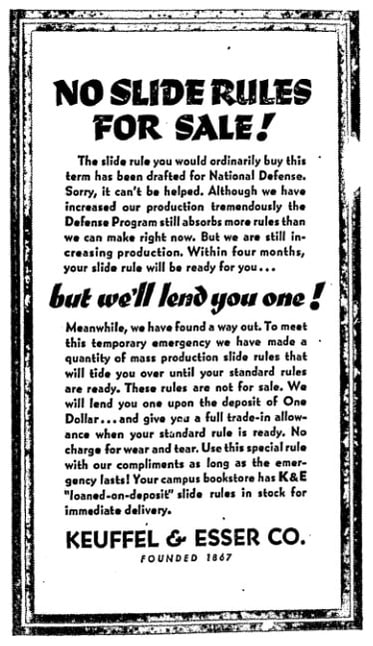

This ad printed in the Univ. of New Mexico student newspaper on September 19, 1941, showing the inability of K&E to meet the demand of students across the nation during war time. The problem would exacerbate after the war, when scores of soldiers returned home to enter engineering college. It is said that when students were forced to purchase cheap slide rules like Lawrences and Charvos-Roos, the slogan, "Don't get stuck with that stick" was born.

As World War 2 neared, the Model 4058 lineup of rules shifted. A new Model 4059 appeared in 1939, which was the first and only 8" version of the 4058 slide rule. With Xylonite cursor, a trimmed down version of the conversion chart on the rule's back, and lacking any scales on the back of the slide (no trig scales), the 4059 sold for only $.50 in 1939. This is a rule I would not mind collecting. But it is rare, being discontinued three years after it was introduced.

In 1942, the Model 4058D arrived, which was merely a relabeling of the base Model 4058 rule with the Xylonite cursor. I suppose it was meant to replace both the 4058 and the 4058C model, which was discontinued that year. Even so, it would disappear the very next year itself, having appeared in only the 1942 catalog.

Another rule with strange product numbering was the Model 8858 Special War Time Issue of the 4058D rule. Produced only in 1942, this slide rule removed the Conversion Tables from the back of the normal version, with a special message printed instead. It read:

> "No. 8858 Slide Rule. Loaned on deposit of $1.00 by Keuffel & Esser Company to meet a temporary shortage caused by defense orders. This deposit will be accepted as part payment toward the purchase of a standard K & E slide rule through your regular dealer before July 1, 1942."

In a unique way of supporting customers, the rule functioned as a loaner for those wanting a slide rule that was not available during WW2 due to a lack of production capacity. Apparently the 8858 functioned like a coupon in exchange for a more expensive rule, yet making sure that the customer had something to use in the meantime. The redemption date of July 1, 1942 seems sudden for a rule produced in 1942, but apparently K&E had it under control!

The white 4058W model continued on, but became the Model N4058W in 1944 when its Mannheim scale set shifted entirely to the Polyphase Mannheim. Still a beginner's rule, it would make little sense to talk about it among the next family of rules, but this new version would continue until 1960 when it would be replaced by the all-plastic rules we discuss next. Even so, as a budget rule, there was nothing significantly different with the N-prefix rule, other than the scale set.

Earlier models of the 4058 are reputed to have been quite enduring. While most collectors deem the rules to be made of boxwood throughout the entire 4058 production run, the only real indication of wood type is in the 1897 catalog where the 1749-1 (the original "Student's rule") was stated to be "hardwood." In 1915, K&E changed the catalog description to read, "The graduations are printed on light-colored wood." This indicates a move to not only the printed scales, but likely the type of wood that it would remain for most of the rest of the model's production. There are some suggestions of pearwood from internet research, but that wood too is mostly European, as found in many rules from A.W. Faber (Castell). Like Boxwood, pearwood would be difficult to supply and prohibitively expensive, making it unfeasible for US import.

In fact, if the 4058 were indeed boxwood, then the rule would be remarkably similar to the Model 4056 Favorite rule described in the previous section (absent the paper scales), which carried a $2.75 price tag when it was introduced in 1901. (!) Likewise, as with the 4056, K&E never had a problem telling you that a slide rule was made of boxwood. That term is not used in any of the catalog descriptions for this beginner's series of rules. But more importantly, if K&E desired you to learn on one rule and then upgrade to another, then they simply would NOT make the beginner rule too "good." Student rule owners would have wanted to upgrade. Planned obsolesce isn't reserved for modern home appliances and cellphones!

I would suspect the lack of wood descriptions in the catalog, or using generic language like "light-colored," allowed K&E to utilize whatever wood they had available. Since the early wood rules would be covered over with paper scales, it shouldn't matter much anyway. It also doesn't dismiss the possibility of boxwood or mahogany of lower grade; less desirable wood blanks not suitable for use with their better models. "Waste" wood, or those wood blanks that might not have passed quality controls for the better models, had to be in abundance...a fact that is true whether or the construction of these rules were outsourced. This would tend to agree with one sample in particular from Paul Tarantolo, a 4058 rule he dates to 1909 that is most certainly mahogany. Plus, many of the post-1913 do seem to be "boxwood-like."

Please see Sidebar: Mahogany vs. Boxwood earlier in this writing for more perspective on those woods choices in slide rules.

I will say that I have two 4058C samples from 1930 to 1935 that are actually quite lovely, as they also came in nice boxed cases. These "C" versions are bare wood, with scales printed directly on the wood, yet finished nicely in what is very likely shellac or varnish. 90 years later, they still function very well. These are the versions that feature a glass cursor with wood cursor rails. But comparing them to boxwood rules in my collection from European manufacturers, as well as the Model 4056 boxwood rule in my collection, even these rules are most certainly not boxwood, albeit they are indeed a moderate hardwood and different than the wood used in the 4058W versions. In my mind, this is the only version K&E should have made. It is functional, slides well, and feel very good in the hands.

By the 40s and 50s, judging by several samples of the white-painted, 4058W rule in my own collection, it is obvious that the source of wood was not of the highest quality, nor was it "hardwood," as I can somewhat easily indent the wood itself with my fingernail. My two 4058C models of the 1930s also fails the fingernail test, just for reference. These too are light-colored rules that could be easily mistaken for boxwood. Worse, the wood of the write-painted varieties in my possession appears to be quite blonde and quite soft. In particular, my 4058W rules are quite unusable now, having surrendered their usability to wood movement.

Like the Favorite series discussed above, the 4058 models were NOT adjustable like the flagship Model 4041 series - that feature is naturally priced out of a "budget type" slide rule.

I do not have a large collection of the Model 4058 rules over the timeframe and across the variations in which they were produced, so making a definitive judgment to the wood type and quality in the "Student's rules" is not possible at this time; however, because they are inexpensive, it's a long-term project that I might tackle.

Aside: In the interest of full disclosure, I doubt that I will. Budget rules of this quality of construction do not appeal to me as a collector. This is one of the reasons I have not bothered to collect many of the numerous varieties of Lawrence and Engineering Instruments slide rules, both of which have a similar type of construction and feel.

Overall, some form of these wooden rules ran from 1901 to 1960, but as you might have deduced, they are typically underwhelming from this collector's perspective. None - other than the 4059 and 4058D - are rare, nor are they expensive to acquire today.

### Model 4158/68-1892 "K-12 Prep"

In 1961, the Model N4058W gave way to this all-plastic (vinyl laminations with heat-pressed markings) slide rule. The Model 4158 "K-12 Prep", so named to emphasize its intended use in the classroom, was constructed in a duplex form yet printed on one side only - scales on the front and totally blank on the back. It used a duplex-style cursor without a rear glass window, braced at the ends with plastic brackets and coming in a plastic slip-case. It did include more scales than the normal, strictly Mannheim beginner's rules:

K, A [ B, S, CI, T, C] D, L

While this scale set is not specifically Mannheim, and the rule is based on a duplex style, it might just as well be moved to a later chapter. However, its importance is as a continuation of the student's series of rules, as noted by the evolution of the model number, and as such should be cataloged here.

The 4158 designation was short-lived, since all K&E products shifted to the 68-17XX a year later. From that point until the end of the slide rule era, the 4158 was known as the 68-1892 model. A 10" scale length was the only option for this slide rule.

Functionally speaking, it is a fine slide rule, comparable to any of this era's student models from other makers, such as the plastic models from Pickett, namely their 120/121 Trainer and 140 Microline models, as well as something like the Aristo 90X student rules. However, with a lack of anything useful on the back of the K12 Prep rule, I give the Picketts and the Aristos the upper hand.

Even so, the rule served the purpose as a beginner's, low cost rule, at $2.25 in 1962. This was by FAR the least expensive rule in the 1962 line-up, priced $3 less than the next cheapest rule. I find that fact somewhat remarkable.

### The Model 4098A

Originally part of the "Ever-There" series of pocket rules discussed later in the chapter, the "A" version of the 4098A became a stand-alone pocket rule in 1936. Priced originally at $1.75 - the least expensive Ever-There Model 4097B model was $3 - this was K&Es lowest priced slide rule other than the Model 4058 Student's rules. Made entirely of Xylonite plastic and using a cheaper frameless Xylonite cursor, this rule was simplified to the same Mannheim scale set used in the 4041 (as well as the 4095 "Favorite" and 4058 "Beginner's" rules). The revised 4098A was narrower with straight sides, dropping the angular sides of the previous version (and the rest of the Ever-There series). After the 4041 was discontinued in 1943 - this slide rule was the only true Mannheim rule remaining in the entire K&E lineup until it would be discontinued in 1953, as even the 4058 had transitioned to a Polyphase model by that point. And by that time, better Polyphase versions in a superior plastic would make the 4098A obsolete.

My sample of the Model 4098 pocket rule, shown below, is in very good condition for what it is; a thin Xylonite construction that typically did not age well, even over moderate amounts of time and exposure. It is, however, slightly bowed, which is unsurprising because the rule is only 1/8" thick. This sample is black-ink only, but earlier samples would have had both black and red ink on the rule. Serial numbers look to be sequential for this rule alone. I have seen numbers ranging from approximately 00000 to 120000, with a delineation for the red/black and black-only versions of the somewhere between 60000 & 70000 range. Pinpointing a date is difficult, but it likely wouldn't be too inaccurate to say that if the first version of the 4098A was produced in 1936, then K&E likely shifted to black-only versions around 1940.

Of another note, the Ever-There rules allowed the slide to be reversed, although they were not intended to be used that way. The 4098A has non-symmetrical tongue & groove construction on the slide, which means that physically reversing of the slide is impossible. Reason for the distinction? Perhaps if the buyer knew the slide was not reversible, then he or she wouldn't attempt to do so and then complain to K&E that the rule was broken and didn't work? It might seem silly, but there are many anecdotes of K&E serving customers who made such complaints. We do see a similar thing occur with the Deci-Lon rules which we discuss in Chapter 3. Those rules too began their run with a physically reversible slide, only to be altered to non-reversible later in the production run.

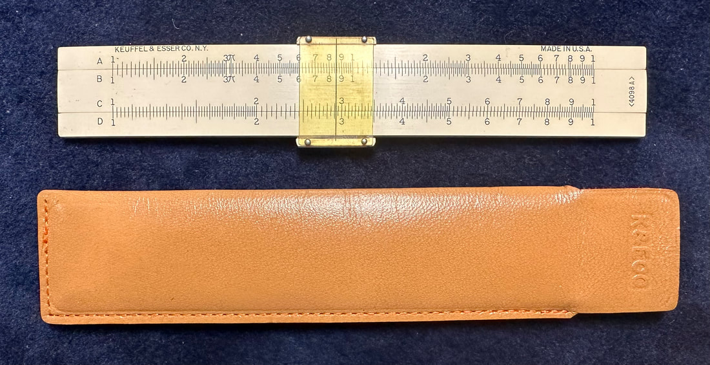

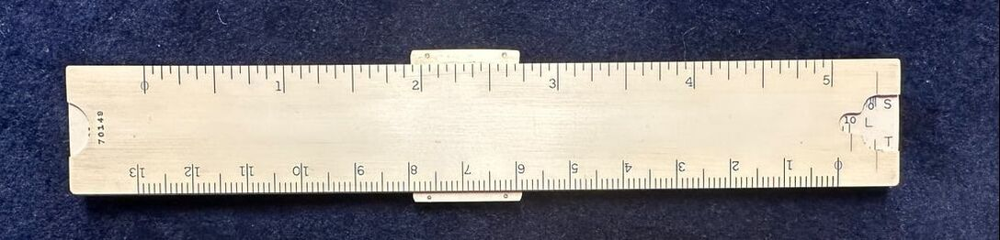

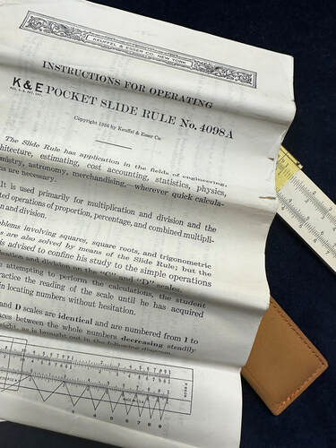

Top and bottom, the Model 4098A's front side, with its simple Mannheim scale set and leather sheath embossed "K&E Co.," and its back side, with inch and centimeter rulers and the S, L, and T scales (the trig functions set an angle via the notched back indicator, then read off to the front's B scale; the log scale reads its input off the D scale's right index and its value off the back); rightmost, the cover of the 1936 instruction manual — once the A suffix was added, the 4098A left the Ever-There family behind to become the first rule advertised simply as a "pocket slide rule."

## The Polyphase Mannheim Family

Note: We should note that at this point in K&E history we can be reasonably assured that full-production capability of all general-purpose math slide rules had been achieved, where all rules, save the student rules, shared the same familiar look and feel.

Introduced in 1909 and pushed out in a variety of scale lengths a year later, the Model 4053 was essentially the big brother of the 4041 model. Almost identical in most ways, it included two more important scales over the regular Mannheim rule. Added were a "K" scale to compute cubes and cubed-roots, and a CI (inverted C) scale to permit easier chaining of division and multiplication operations. As for the name "Polyphase," see Sidebar: What's in a Name? below. This Mannheim version of the with the Polyphase scale set was a response by K&E to offer more scales on the same single sided, wooden platform, and to adjust to similar advancements made by their competitors at the time, most notably the Rietz slide rule being produce by Dennert & Pape since 1902. And if you compare the Model 4053 with the Rietz, you'll see striking similarities. So much so, that if you referred the Polyphase Mannheim mistakenly as a "Rietz," I wouldn't try to correct you!

This family of Polyphase Mannheim rules was perhaps the least changed over K&E's production history, often varying from year to year with minor evolutionary changes, but never shifting model names beyond the addition of an "N" designation in 1925 to the 4053 model name. The Polyphase scale set itself would find itself on most of the more basic of K&E rules, eventually superseding the basic Mannheim scale set. It would also be translated for use on various duplex rules throughout K&E slide rule history. Members of this family include the following:

## Sidebar: What's in a Name?

You could be a dedicated, well-studied slide rule collector for over a decade and NEVER really gain a grasp what the term "Polyphase" really means. I can find no real source for the name, though I can speculate a bit on where it came from, which I will do shortly.

Certainly, we "kinda" get it anyway, right? We likely took enough language classes to know that poly means "many" and phase comes from the Greek word, "appearance." And therefore, if we are to do something with a slide rule like the new Polyphase models, then it likely indicates that we can do multiple things with the rule because its multiple appearances (or functions).

So it would make sense for K&E to let us know that any improvement to the Mannheim rules comes with a change in name, and Polyphase is the term they chose.

The defining feature of the Polyphase scale set, regardless of the platform of the rule, is the improvement of the typical Mannheim scales of A, B, C, D, S, L, and T, with the addition of two new, important scales to appear additionally functional. These scales are the K scale and a CI scale, or "inverted" C scale. Doing cubes and cubed roots with the new K scale pretty much speaks for itself. Yet, it's the CI scale that yields most of the power in the new scale set. It does this in two ways: because dividing by a number is the same as multiplying by its reciprocal, then the user can opt to perform multiplications in the method of division by using the CI scale rather than the typical C scale. And the flexibility of using the CI scale, in addition the the C and D scales allow them to work together for greater efficiency when doing multiple operations.

It is this second characteristic that defines the "poly" and "phase" meaning of the word, wherein the user can customize their method of operation depending upon the nature of the numbers. The only inflexible aspect of being able, for example, to multiply three factors together with one setting of the slide is the fact that some computations could still be "off-the-scale." In those cases, users will often learn to re-order their computations to assure they remain ON the rule. Though with the addition of a folded scale into that mix, it represents the best of all possible worlds since an index will always be available to the user. The original Polyphase Mannheim rules did not offer this, though the future, "improved" Polyphase rules did.

We will see examples of these rules later in the Modern Polyphase era of single-sided rules, within the Ever-There series of rules, and in several of what will be discussed as "Mystery" rule. Likewise, it should be understood that this improved Polyphase scale set was also found in the Polyphase Duplex Model 4088, which you might be surprised to know appeared only four years after Model 4053, "normal" Polyphase rule.

So, what's in a name?

In 1904, the Dietzgen company produced their Model 1762 Mannheim-type rule as a response to the K&E Cox duplex rule, which boasted the ability to do efficient, chained operations. Dietzgen's model featured a scale innovation that added an extra two-decade B scale, with a single index in the middle, running one decade to the left and one decade to the right. This rule was coined by Dietzgen as the "Multiplex," meaning, quite literally, "many appearances."

You can decide who's name came first. However, not to be outdone, Dietzgen would soon call another type of their slide rules the "Maniphase."

And I'll give you one guess what that word means!

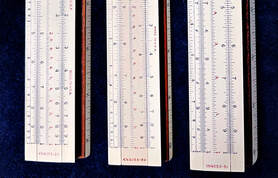

Part of the collection: 8 inch, 10 inch, and 20 inch versions of the N4053 Polyphase Mannheim.

### The Model 4053

The original 1909 model of the 10 inch 4053 was similar in construction to its contemporary, the Model 4041, based on celluloid-covered mahogany wood and engine-divided scales. However this rule replaced the centimeter scale on the rule's edge with three-decades worth of "K" scale and squeezed in the "CI" scale in between the B and C on the slide. The cursor had an indicator on the bottom allowing easy reading of the K scale at the edge, a feature that K&E mentioned made the 4053 a "hybrid" of the Mannheim and Duplex style of rules.

Two years after its introduction, the 1911 models came in many lengths using the "dash" system of model labelling, from an 8 inch rule with a 4053-2 designation, the normal 10" rule relabeled as the 4053-3, and a 20" variant known as the 4053-5. These models would take on an "N" prefix in 1922 when K&E removed the K-scale from the front edge of the rule and squeezed it (without regard to aesthetics) onto the bottom stator rail and gave users back their centimeter scale on the front edge. Interestingly, during this transition year in 1922, the printing of the "N" on the rule itself varied from outside of the bracket (as in N&lt;4053-3&gt;) to being above the bracketed model number. By the next model year, the prefix joined the model number inside the brackets.

A finely-divided scale option of the 4053 was also produced (as they did with the Model 4041 Mannheim), which was designated as the Model 4053-3F. This model was "divided as finely as the 20" rule." As such it provided the precision of a larger rule. K&E produced this rule between 1911 and 1943, but is rather rare. Perhaps this is because the upgrade to finely-divided scales came with a $3.50 premium!

In 1954, all 4053 versions to follow would employ semi-plastic construction - the back of the rule was now laminated with celluloid as well, making printing directly on the rule possible. The name of this model would drop the "N" prefix to reflect the major feature change. More plastic would be added over time, evolving to an all-plastic base with typical celluloid-covered mahogany rails and slide in 1962 and following. K&E also produced a variant of the rule for special use by the U.S. government known as the Model D4053-3 beginning in 1954. This rule, stamped "U.S. Government," came with manual, magnifying cursor, and custom leather case to also accommodate the higher-profile cursor. The "D" designed decimal trig scales, which was new to the Model 4053 rule (see Chapter 6 for more on this slide rule).

There would also be discontinued rules in the series, including the 8" N4053-2, discontinued in 1938, and the aforementioned N4053-3F version in 1943. With the 1962 model year, when K&E changed the model numbering convention for all of their slide rules, the 10" 4053 would become the 68-1617 (with the military version called the D68-1617) and the 20" N4053-5 was issued model number 68-1607. Both rules could be upgraded to a chamois-lined leather case, known as the 68-1622 and 68-1612 respectively, but it did not change the model number on the rule, only on the shipping box and in the catalog.

Cost for the original 4053 was $5.00 in 1909, or $0.50 more than the 4041 Mannheim. The K&E product line included both the 4053 and the 4041 for a surprising 35 years until the 4041 was finally dropped in 1943. I would have expected it sooner, since the 4053 largely replaces the capabilities of the 4041 for only a little more money. Then again in 1921, K&E seemed to realize this when they raised the price of the 4053-3 to $7.60, which was a full $1.10 more than the 4041.

Likewise, they raised the price of the 8" model to $8.80, which put the price of the shorter rule above the 10" model. Recall that they did something similar to the 4041 family of rules that same year. This solidifies the notion I've mentioned previously that shorter rules in the single-sided Mannheim format were not inexpensive to make, and for consumers there was no such thing as a discount just because there was less of the slide rule to buy!

The Model 4053, first introduced in 1909, would continue in production in some variety until the end of the slide rule era in 1975. It was easily K&E's longest, continuously running slide rule model.

Model 4098 and 4097C "Ever-There" - These models of the Ever-There series could be slotted in here because they were Polyphase Mannheim pocket rules, but rather, I'll leave their full descriptions for the next section's complete discussion of the series. But for the long duration of the Model 4053, K&E had never produced a 5" pocket version. Never, as remarkable as that seems. But once new modern plastic rules could be built, it made sense to make a pocket rule based on the 4053 Polyphase Mannheim scale set. The Model 4098 was introduced in 1931, followed by the 4097C in 1936. Importantly, these rules provided the functionality of a rule that was always too costly to sell, which would begin a shifting in the way K&E thought about their products philosophically. It just took them a while to learn that sometimes form should follow function.

### Model 4153

K&E worked hard to find new plastic rules to replace the Ever-There series. They were successful. Coming a few years after the end of the Model 4097C, in 1957, a new model arrived to take on the role of the pocket Polyphase Mannheim. The rule had two options: either the Model 4051-3 with normal pocket sheath, or a new Model 4153C model featuring a leather slip-case with a leather-covered metal "clip." In 1958, cost for the 4153-1 would be $5.50, with $6.25 for the "C" model with the clip.

Construction of these rules were very similar to many of the pocket rules K&E was producing at the time. In fact, the platform of this particular rules, with "Ivorite" (ABS plastic) and small clip-on "unbreakable" cursor, served duty in other slide rule families, including a "Merchants" pocket rule, Model 4150-1 (see Specialty Rules later in the article), and the Model 4161-1 pocket rule for the "Modern Polyphase" family of rules (see Modern Polyphase Rules in the next section). All three rules together are identical except for their scale sets.

In 1962, the rules would be redesigned as the 68-1648 and 68-1643, for the non-clipped and clipped case versions respectively. They would hang around until the end of the slide rule era.

### The Model 4054 Polyphase

Earlier I mentioned that the original Model 4054 "Favorite" Mannheim model was discontinued in 1925. When it was reinstated in 1944, its role shifted to a more advanced model, a sister rule of the N4053-3. As such, this new Model 4054 variant would be marketed as a "Polyphase Slide Rule" and no longer associated with the "Favorite" series of slide rules. With improved glass cursor, the new 4054 rejected its basic Mannheim heritage to sport the same 4053 scale set, missing only the inch and centimeter scales on the sides. Equipped with mahogany instead of the original boxwood, this $5.50 model saved users $2.00 over the N4053-3 flagship Mannheim-type (single-sided) rule in 1944. Even so, that's almost double the price of the original 4054 model that was first introduced in 1901. That's inflation for you!

The Polyphase version of the Model 4054 would last until 1953. It would seem that company and consumer interest was shifting toward the all-plastic rules at this price point, particularly the pocket rules, as K&E would discontinue no fewer than SIX of their traditional Mannheim and Polyphase based models between 1950 and 1954. Despite this, the Polyphase version of the Model 4054 is abundant on eBay. K&E most certainly sold a ton of them.

## Sidebar: The 4088, an Ever-There, and the Mystery Rules

During a 20 year period, from 1930 to 1950, K&E produced a surprising amount of rules that didn't have a model number. I will speculate later on what I feel could be the origin of some of these rules, which are known by collectors as K&E Mystery Rules, but there are a few statements we could make about the Mystery Rules in general.

First, these rules aren't necessarily rare, so you would be mistaken to think they were not produced in generous numbers. We can see this today by how often these rules come up for sale, which in my opinion seems to be "not often" rather than "rarely."

Second, K&E did not show these Mystery rules in their catalogs, as they did not have a model number. We can judge from this that these rules were likely developed for a specialty or custom market, where K&E did not want the general public to think these rules were offerings they could purchase.

Third, and more relevant here, is that the Mystery Rule scale set is almost identical to the Model 4088 Polyphase Duplex, which predated the Mystery variants by two decades or more, and the 4097D Ever-There pocket rule which would be introduced a few years after the first known instance of a Mystery rule. This "Improved Polyphase Mannheim" scale set, as it came to be known, is as follows:

Front Side: inches // A DF [CF CI C] D K \ centimeters
Back of Slide: [S B L T]

Many rules are strikingly similar to the Model 4053, and some are indeed the exact same rule without the model number. But many of what we regard as these "mystery rules" have an unusually longer slide than the actual frame, so when indexed to the left, the slide protrudes perhaps 8mm from the right side of the frame. This was a feature of many Dietzgen models of the era which enables (arguably) easier manipulation of the slide when the rule is in the "closed" position (i.e. left indices are aligned).

A single "K&E Co." maker-mark is placed on the right side of the slide, vertically in the fashion of the normal model number. Other mystery rules after 1947 might have only modern K&E logo. Yet others might contain nothing at all. Serial numbers on the rules match the production of all other wooden rules of the era, so they can be dated just like any other wooden K&E rule.

To compare, collector Mike Syphers has started a detailed list of known "mystery" variants at his amazing website, Following the Rules.

All of this all sounds odd, but we do know that K&E produced MANY custom slide rules for a variety of purposes and industries, a practice that Pickett would pick up on a half-century later with their own specialty types of rules. Many such K&E rules are so rare that their existence is likely lost to antiquity. Those we do know about will be discussed in Chapter 6, as there is a rich history of strange/custom K&E slide rules. But we should not be surprised that K&E would produce slide rules specifically for universities, among other places, perhaps even made to order.

K&E's desire to reach out to the education markets was obvious. Jack Burton, former VP of Sales at K&E, confirms this (J.O.S., Spring 1999) by stating that all regional managers targeted university bookstores as potential distributors. Yet he also refers to the ones sold at these stores as "junky," not in terms of quality, but rather in terms of less functionality, like with the Mannheims and Polyphases.

We also know that K&E began to print Educational Catalogs and price lists in the 30s, seemingly during the early production these Mystery rules. That speaks to K&E strongly focusing toward the educational markets, as I suggested. The real questions become, what type of rules would college students need and what type of rules could the company realistically offer them in terms of functionality and value?

If I am a university professor wanting a powerful slide rule for my students, I'm more inclined to inquire about the Model 4092 Log Log Duplex or 4093 Log Log Vector rules, which were K&E's flagship models for many years. At least this is what I would have wanted as an engineering student. But that price point would have put them out of reach for most students. Knowing that the 4092 and 4093 have too many scales for a conversion to a one-sided platform, then I can see K&E pushing the less-expensive 4088 instead to the college market. As strange as it does seem that the Mystery rules do not appear in any of the educational catalogs, neither in 1933 nor 1936; however, the Model 4088 is indeed listed, while the 4092 and 4093 are not.

So I could see K&E producing a variant of the 4088 on the less expensive one-sided platform, especially with the knowledge that the 4088 would be discontinued in the late 30s. While this would not give engineering students the power of the flagship rules complete with log-log scales, it most certainly does give more power than the "junky" rules described by Burton. If this happened, then I can see why such a Mystery rule would be excluded from product catalogs...if K&E was providing at-cost rules to engineering students in select engineering programs around the country, then they would not want general education markets (and the general consumer market) to think such slide rules were available to them as well.

We shouldn't be surprised that perhaps the company didn't mind being charitable when it suited them, giving back to an education industry who would produce more engineers, builders, and slide rule buyers of the future. In fact, we have every indication that K&E understood the importance of quality and brand loyalty in all of their products, so making new loyal customers at the college level, those who would be most likely to buy their flagship slide rules in the future, makes a lot of sense to me.

This theory sounds outlandish, but one of the first Mystery Rules produced - which had the standard Polyphase Mannheim scale set but without the 4053-3 model number - had a customized conversion chart on the back with a University of Washington College of Engineering insignia on it. This was around 1930. Perhaps surprisingly, the rule for Washington students would reappear around 1940, but this one with the "Improved Polyphase Mannheim" scale set.

I have a similar sample, without a university name to it, with a 1937 serial number. This rule has "decimal keeping" instructions on the back of the rule, unique to general purpose rules found on the typical single-sided K&E rules (which focused more on unit conversions, weights, and measures). Several of this type are known as "Decimal Keeping Mystery rules." Yet others mystery rules have formula charts containing more classroom specific geometric formulae and calculus derivative/integral rules.

Following through with the conjecture, it would make sense that the early 30s began with custom-built rules for a specific university book store and labeled as such; and yet, they also produced a more generic version for any university to sell. Such rules without the Washington connection do appear as early as 1931. The fact that there is also a Washington rule as late as 1940 should not be surprising, since K&E could always customize a rule for a university upon request.

Additionally, there would appear 20" versions of a similar rule, but missing some of the newer Polyphase scales. These likely do not have a connection to education, though could have very well been to custom clients, or a niche group of consumers.

As for the Ever-There 4097D, when K&E decided to merge their B and C variants of the 4097 into their "D" version of the rule in 1936, we had already seen this combination of scales in not only the 4088-3 Polyphase duplex rule that had been in regular production since before the 1st World War, but also in those Mystery rules produced for universities. Thus, with the 4097D, it is apparent that K&E was providing a budget-friendly, single-sided version of the 4088 for the regular consumer. At half the price of the duplex rule in 1936, this certainly had market demand.

You might think that this rule would have stopped the manufacture of the "Mystery rule" based on the same scale set, but serial numbers indicate that those were likely made up until ~1950. This would seem to indicate that K&E was indeed comfortable providing even lower cost wooden rules to select clientele, as a $4.25 Ever-There was still a hard ask for a college-going student.

And speaking as a collector, the Ever-There rules are somewhat hard to date. Their serial numbers seem to fall in line with the serial number scheme of the wooden rules, but McCoy indicates that the Ever-There's, as well as all-plastic rules later, had their own serial numbers sequences. Further research is required.

But at the time, the Ever-There's were innovative rules, gaining a solid foothold in the pocket rule market in 1931, and redesigned in 1936 to match the diversity of the 1936 Post offerings. The 4098A matched the lowest price of the Post offerings at $1.75. And the 4097s sold well enough that K&E was not compelled to match price with the imported Post/Hemmi pocket rules, none of which cost buyers more than $2.70 according to the Post 1937 Catalog. K&E simply knew that their $4.25 4097D was going to sell a lot slide rules, especially since it was half the price of their 4088-1 duplex rule that pretty much offered the same capabilities.

However, if there were ever a K&E slide rule that could be considered of questionable quality, especially in the longer-term, it would have to be the Ever-Theres (see the earlier Sidebar: The Problems with K&E Rules in Chapter 1). The Xylonite plastic was not long-lasting. It became brittle over time, prone to yellowing (as the clear Xylonite cursors did) and warping. K&E knew the plastic was not ideal and would seek alternatives to replace it after 15 years. This is a historically important distinction, as it's the impetus for some of the corporate decisions made after World War II in the late 1940s.

Therefore, the Ever-There series, beginning in 1931 and revamped in 1936, would hang on until the early 1950s, when at that time newer plastic versions of these rules were finally introduced. Those models would be classified simply as "Pocket Slide Rules." But the Ever-There's had served their purpose of supplying all K&E family model lines an affordable, pocket version of their popular slide rules.

## The Ever-There Series

Named the "Ever-There" series of slide rules, K&E introduced this product line of pocket rules in 1931. K&E's first all-plastic rule, made of a celluloid known as "Xylonite," and with a frameless Xylonite cursor, the two models in this series were meant to give users of K&E single-sided rules a light-weight pocket option for the full-sized rule they already had, namely, for those with either "Polyphase" and "Merchant" slide rules (more on the Merchant Family of rules can be found below among Specialty Rules).

Other than the 4031 Mannheim pocket rule and their pocket duplex models, the intent of the Ever-There series was obvious, to provide a cost-conscious solution to all future pocket-sized rules, regardless of the scale set.

### Models 4097 & 4098

Initially, the series began with only two models, the Model 4097 and the Model 4098. These cost the customer $3 and $4 respectively in 1931. When compared to the 5" wooden pocket Mannheim 4031 at $5, the Ever-There's make financial sense for both K&E and the consumer. Just as a way to gauge that, $3 in 1931 is approximately $60 in today's money. It's not a trivial amount, especially at the height of the Great Depression, but just as my daughter might be required to purchase a $100 calculator for her college classes, the Ever-There rules were priced similarly, even if my daughter would think those in my collection are just a slab of plastic. But I digress.

Almost identical in construction, only the scales were different between the 4097 and 4098 models. The Model 4097 mimicked the Model 4094 "Merchant's" rule, a 10" specialty single-sided rule introduced the year before. The Merchant's models will be discussed later (see Specialty Rules in Chapter 4), but the 4097, as did the Merchant's rules, did away with the A & B scales (and the S, L, and T scales on the back of the slide) in favor of folded C & D scales (CF & DF) and an inverted C scale (CI) on the slide. The idea of this was to allow rapid chaining of numbers more efficiently, with fewer moves of the slide and the ability to avoid off-scale computations. The 4097, as with the 4098, did make use of the rule's back side to give 5" and 13mm rulers.

The Model 4098 stepped in as a true Polyphase Mannheim pocket rule, filling the gap of a 5" pocket rule that the 4053 series failed to offer - at that point there were 21 years of 4053 production and the smallest rule offered was the 8" Model 4053-2. In fact, the 4098 not only used the same scale set as the 4053, it put the scales in the same place. Except the Ever-There, as mentioned earlier, put the inch and centimeter scales on the back.

Both rules uses a clear Xylonite cursor, which also appeared on the Model 4058 Beginner's rules. Starting clear, these cursors did not stand up well to UV light radiation, and so turned yellow over time.

### Model 4097B, 4097C, and 4097D

The Ever-There series proved to be much thinner, lighter, and budget-friendly than all slide-rule technologies that preceded them. Not stopping there, five years after their introduction, K&E revamped the Ever-There line-up in 1936 to offer more choices to consumers and to increase their profit margins by selling these easy-to-manufacture slide rules.

Dropping the 4098 from the lineup, it would become redesigned as the 4098A (as mentioned earlier) to give the original Mannheim users a cheaper option - it worked, as the $1.75 rule would be competitive enough to make K&E discontinue the 5" 4031 four years later. They would keep the 4097 as the only slide rule model in the Ever-There family, but produced three variants of the 4097 to meet consumer needs in three separate markets. Interestingly, the models would be known as the 4097B, 4097C, and 4097D.

K&E would never offer a "4097A" rule, presumably because the "A" designation went with the 4098, honoring the 4098's legacy in the previous Ever-There lineup. This new 4098A version (discussed fully in our discussion of the Mannheim Family of rules), would be known simply as the "K&E Pocket Slide Rule," no longer under the catalog heading of "Ever-There Pocket Rules."

The new Ever-There rules were as follows:

- The 4097B (with a 1936 cost of $3) essentially retained the functionality of the original 4097 slide rule, using the "Merchant's" scale set of their 4094 slide rule.
- The 4097C (with a 1936 cost of $3.75) was redesigned to become what the old 4098 was, the true Polyphase Mannheim rule it had been for 5 years.
- The 4097D (with a 1936 cost of $4.25) would become, so it seems, a "hybrid" of the other two 4097 rules, merging both the folded scales and the Polyphase scales onto a one-sided slide rule. K&E accomplished this by altering the Polyphase scale set, moving the B-scale to the slide (joining the S, L, and T scales), and replacing it with a CF-scale, and then squeezing in a DF-scale just below the A-scale on the upper stator rail.

To me, the intent of the "D" variant is obvious...to provide a cheap pocket version of the 4088 Polyphase Duplex rule (see Polyphase Duplex Rules below). Comparing the two, the only scale that the 4097D lacks is a CIF scale (folded, inverse C-scale) as found on the 4088 line of rules. And while K&E did manufacturer a pocket version of this Polyphase duplex rule with their 4088-1 model, it was exactly twice as expensive as the new 4097D Ever-There in 1936 prices ($8.50 versus $4.25 respectively). As a result, the 4088-1 would be discontinued within three years of the introduction of the 4097D.

Note: There is much more to be said about this scale set historically, which I do in the Sidebar: The 4088, an Ever-There, and the Mystery Rules earlier in this section.

As far as construction, the new Ever-There series did evolve from their preceding lineup, going to K&E's new-improved glass cursor, which they began using in all their slide rules beginning in 1936. They also tweaked the shape of the rules slightly, enough to appear dimensionally different from original 4097 and 4098. It is not known if K&E repackaged any of their old 4097 and 4098 stock into new 4097B and 4097C boxes, but it's definitely something I would have done. However, this will have to remain an inquiry in need of future research.

Finally, it is important to talk about the Ever-There series in terms of the competition that stood against K&E during this time. German-based Dennert and Pape introduced all-plastic slide rules in 1936 marketed under the name "Aristo." But at that time, U.S. and European markets were completely separate.

The chief competition for K&E state-side came from the Frederick Post Company, who began to compete for market-share with their sale of 4" and 5" Bamboo pocket rules, imported from the Sun-Hemmi company in Japan. Post would attack strongly in that market, producing no fewer than SEVEN pocket models by 1937. And, not surprisingly, Post would market these rules as both "Mannheim" and "Multiphase" rules, the latter a term Dietzgen gave to their rules.

As a slide rule user, I much prefer using the Post/Hemmi bamboo pocket rules, something I freely admit. Though this speaks more to the longer-lasting nature of a bamboo constructed rule as compared to an early plastic rule some 80 years later. (I just love my bamboo Hemmi-built rules!)

## The Modern Polyphase Family

The history of the Mannheim platform evolved and endured over almost the company's entire history, from their basic outsourced rule in the beginning, to high-quality rules built in-house, to the advanced functionality of the Polyphase rules, and through the modern era of the company. Regardless of the rule, by the 1950s, the Polyphase Mannheim had become the desired scale set for non-duplex rules.

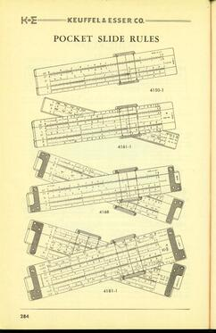

From the 1952 catalog. K&E would begin to rethink their "family" naming scheme for their slide rules. This is likely because if a consumer wanted a pocket rule, it would be easier to show all of their offerings on a single page. In 1972, the same catalog page would grow up to 6 distinct pocket rules, regardless of their construction.

## Sidebar: The Doric Family of Rules

Around 1948, when there hadn't been a K&E Catalog since war-time 1944, several all-plastic rules began to be offered by the company with a 9XXX model number designation. These were different than the Ever-There series, with a different type of plastic altogether. They were labeled "DORIC" on the rule, on their boxes, and in their documentation.

It's difficult to find good research on what the Doric rules are and why they were introduced as a series. The 1949 catalog classifies the "Doric Family" with only three rules, while we know that many others existed around the period of 1950. Moreover, this 9XXX series rules would be converted to 4XXX rules by 1952, only some of which would persist in carrying the Doric moniker on the rule itself, and none of which are identified as a Doric Family rule in 1952 catalog. It's confusing, to say the least.

But in total, there are 7 known rules planned by K&E to carry the Doric designation in production and 2 others that were described and barely exist in reality, likely as prototype rules. A summary list of these rules is listed here, with deeper descriptions of many of them found with the main body of the article.

- 9068 - 5" Polyphase Duplex (1948): Described in the 1949 catalog; became the 4168 in 1951 and the 68-1555 in 1962; labelled as Doric on all versions of the rule up until 1975.
- N9081-3 - 10" Log Log Duplex (1948): Described in the 1949 catalog; became the Model 4181-3 in 1952, while dropping the Doric label
- N9081-1 - 5" Log Log Duplex (1949): Described in the 1949 catalog; never known to exist as an actual rule; perhaps the forerunner of the 4181-1 "Jet-Log Jr."
- 9061-1 - 5" Polyphase Mannheim (1950): Became the 4161-1 in 1951, dropping the Doric label.
- 9050-1 - 5" Merchant's Rule (1950): Very few known samples. Became the Model 4150-1 in 1951, carrying the Doric label for maybe one year.
- 9071-3 - 10" Polyphase Duplex (1950): A plastic version of the 4070 with a Doric label, with its only catalog appearance in a part's list; disappeared entirely by 1952.
- 4168 - 5" Celanese Celcon (1968): A custom rule made of a special green resin, produced only that year, based on the 9068/4168 platform; used Doric name on the rule.
- 10000 - Prototype 5" 9068 rule (1946): Thought to exist prior to the 1948 build of the 9068; appeared only in a catalog part's list. A 10000/10002 manual exists in large number, but a small number of known samples of the actual rule exists.
- 10002 - Prototype 10" 9068 rule (1947?): See Model 10000 description. Very rare, with two samples known to exist.

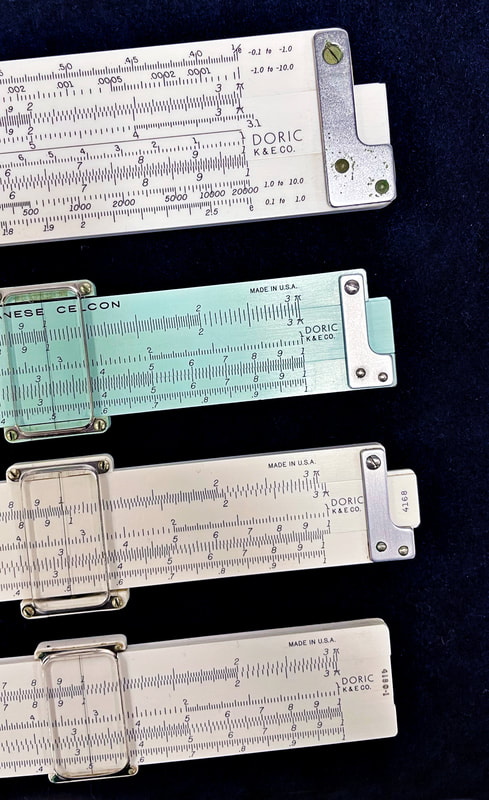

Pictured top to bottom, the N9081-3, 4168 Celanese Celcon (originally the 9068), the 4168 Polyphase Duplex (also the 9068), and the 4150-1 Merchant's Pocket Rule (formerly the 9050-1). I expect to find the 9071-3 and 9061-1 at some point to complete the collection of known, actual Doric rules.

"Doric," in classical architecture/design meaning "simple of form" or "non-ornate," clearly indicated that K&E's new line of all-plastic Doric rules were intended to be nothing fancy. In fact, every major family of rules by the late 40s had a Doric representative slide rule and all of those had the same, basic black font, different from K&E's standard font. Interestingly, the term "Doric" would also be used with other products offered by K&E, most notably their drafting tools and lettering kits, with Doric indicating their most basic kits. However, there is no mention of Doric "anything" in their 1944 catalog, so it seems to be a name that K&E was determined to associate with a variety of their products by the next catalog 5 years later.

As such, It is difficult to know if the Doric rules were introduced as a cost savings option, or as a "budget rule," mostly because the quality of the rules were quite high. Many assume so, though I am not so sure.

The common element of the Doric rules is their construction of what has been called by many sources online as a "white Xylonite" plastic, which would be the same description as traditionally given to the Ever-There series by K&E in their catalogs since the beginning of their production and continuing through this time. But these rules are clearly not the same plastic as the brittle, yellowing, and somewhat sticky Ever-Theres. Possessing many of these rules, my hands would declare them a different formulation - the Dorics are of much better quality plastic; far more durable, resembling more the plastic construction in their later molded ABS plastic rules known as "Ivorite," albeit notably heavier.

According to Joe Soper (JOS, Vol. 11, No. 2, Fall 2002, p. 17), the Doric rules, made in Hoboken, were not molded, but rather made from plastic sheet. Certainly, these rules are built of a very different and superior plastic to the Xylonite, and in the only K&E catalog that describes the Doric rules, they are called "plastic" as opposed the "white Xylonite." Certainly this is not a mistake, as K&E wants to draw a distinction between these rules and the Ever-There rules.

And I believe this might give a hint to the purpose of the Doric series in the historical product line of K&E rules - to be a transitional, short-term model between the older "Xylonite" plastics traditionally used, and the newer ABS-based "Ivorite" plastics that would dominate the later years of the K&E product models.

As such, I do see some inconsistencies in the rules carrying Doric labels. Not all of them feel the same. While the 9081-3 feels like the newer, modern rules made of "Ivorite," particularly close in feel to its 4181-3 successor (I note that the 4181-3 is a little more light in weight), the 9068, on the other hand, feels very similar to all successor rules, so much so that I couldn't tell them apart if I couldn't see the model numbers.

I would speculate that when the Dorics were first produced around 1947, they were still a couple of years short of the "right formula" for the newer products to be injection-molded, so the Dorics were individually made from any number of suppliers and plastic recipes. While they were a wild improvement over the Ever-Theres, it would seem that 1950 was when K&E felt like they got it right and thus began changing the 9XXX models into 4XXX models, signaling a change in construction technique and plastic composition. As such, construction of these new molded rules would begin in Hoboken around 1950, shifting to a new plant in Salisbury, CT., beginning around 1957, according to Soper.

In total, the Dorics lasted from 3 to 5 years, where it would seem 1947 marked the earliest of the Doric rules, and 1952, the latest. And I do NOT believe it's a coincidence that the older Ever-There rules were discontinued completely sometime around 1953 and 1954. Out with the old brittle plastic, and in with the new.

So why not keep the "Doric" label? I think that's quite simple. If the Dorics were intended to become the pocket versions of so many of their other families and models of slide rules, then they should be modeled after those rules aesthetically. Meaning the "Doric" name would no longer be appropriate if future rules needs red scales again, or if they would intend the rules to look like others in those families of rules.

To add to the conjecture, the "prototype" models of the Doric 10000 & 10002 were less "plain Doric" than the others, including the use of red inverse scales and even ornamented with a red star on both the slide and the cursor. Perhaps the type of Xylonite being used didn't work very well with the red ink? We've seen many rules from a variety of makers have inks that leaked or bled into the rule. In such a case, "Doric" would be a good way to hide that these white Xylonite rules could only be manufactured with black ink.

As for the "Doric" label, only the 9068/4168 rule would keep that identity permanently, even up to the end of the slide rule era in 1975. Perhaps this is to pay homage to that legacy? It was, after all, the original Doric, with 4 historic slide rules based on the 9068 platform.

As such, many collectors think of the Doric as synonymous with the lone 9068/4168 style pocket duplex rule, the only one left standing in the 70s, despite the fact that 9 such rules were originally "Doric" in heritage.

However we think of the Doric rules today, it was these slide rules that either directly spawned or inspired all "Modern Polyphase" and "Modern Duplex" rules that would follow in the 1960s and 1970s. And as such, when we discuss the newer "modern" rules, we fall back on the Doric Family of rules as their legacy.

With the introduction of better plastics, most all slide rule manufacturers dabbled with all-plastic construction at some point. For a company like Pickett, plastic rules were mated to their entry-level, entry-priced types of slide rules. While a company like Sun-Hemmi would eventually use all-plastic construction for even some of their most sophisticated rules.

K&E would be more like Hemmi in this regard. When the technology became available to make high quality rules out of plastic, the company had no problem applying it to their high end rules. We see this especially in the Modern Duplex Family of rules to be discussed later, whereas K&E's most revered slide rules of all-time are all-plastic in construction - the Jet-Log, Deci-Lon, and Analon rules if you were curious. While K&E did produce some budget rules from plastic, they were always well-constructed, with some heft and substance. Thus, plastic doesn't have to be the equivalent of "cheap."

But even the venerable, single-sided Mannheim/Polyphase types of rules could benefit from an all-plastic refit. So K&E evolved these into all-plastic and semi-plastic models over time. This is easily noted in the early 50s, when K&E discontinued six of their Mannheim and Polyphase Mannheim models within a 5 year span - those with "Favorite" and "Ever-There" legacies - and began focusing on a variety of new "Ivorite" plastic rules. In fact, through the 1950s, the only wooden rules of the non-duplex types were the N4058W "Beginner's" rule and the flagship Mannheim-type rule, the Model 4053-3, and even this latter rule became more increasingly plastic over the 50s.

We could very well be describing these rules as part of an "All-Plastic Family" of K&E slide rules; but I resist doing so for two reasons. First, there would remain a separation in functionality between rules of the single-sided (Mannheim) type of construction and those of the duplex style. As such, we need some differentiation when discussing rules of both types. And second, K&E would still maintain a price structure with their rules already established historically in their product lines. While K&E could normalize the production cost of all their slide rules by virtue of all-plastic construction through common manufacturing methods and tooling, it's not like we would expect the company to significantly lower the price of their flagship duplex rules, even if they COULD have been priced closer to the more basic single-sided rules.

Therefore, when writing about K&E slide rules and attempting to describe a family of rules with the "Modern" moniker, then we are mostly certainly talking about their common all-plastic construction. In fact, with the later (or modern) era K&E slide rules, we start to see some blurring of the lines between their single-sided and double-sided rules. We already mentioned this in our discussion of the "K12-Prep" (68-1892) rule's replacement of the Model 4058 beginner's models, but this was true of another model, the "GP12" (68-1565), as well. Even the famous 68-1400 Analon rule, while very much of duplex construction, was in all practicality and functionally, a one-sided rule.

Note: Such a single-sided rule in a duplex format is typically known as a "simplex" rule, which Pickett had made popular. While the GP-12 could be talked about here as a Modern "Single-Sided" rule, it most certainly does not resemble a Polyphase in any form. Because of its obvious relationship to both the Deci-Lon and Analon rules, I will discuss them collectively in the later section called Modern Duplex Rules.

Lastly, approaching the modern era, it became clear that K&E wanted to recategorize how their slide rules were presented. While the words Polyphase, Duplex, Mannheim, Log Log, Deci-Trig, et al, would always carry on in their titles for individual rules, they would no longer be listed in "family" designations within their catalogs. Instead, as we would see in the 1972 catalog, they would group them as "Pocket Slide rules" or "Limited Purpose" or "Special Purpose" or the "Deci-Trig Group." This shifting of labels is logical since most slide rules at this point would have common plastic construction, or a blurring of the traditional Mannheim (single-sided) versus Duplex (doubled-sided) point of view. So rather than listing them as model lines within these broad categories, K&E wanted users to think in terms of how they would be used practically. We can see this in how all K&E "Pocket Slide Rules" were listed in the 1952 catalog (see image above). Previous catalogs would have never grouped single-sided and duplex rules on the same page like this.

### The Model 4161 Polyphase Mannheims

This model was first introduced in 1948 as the 9061-1, which was part of the Doric series of rules (see Sidebar: The Doric Family of Rules earlier in this chapter). However, by 1951, the 9061-1 was renamed the 4161-1 as a 5" pocket rule made of an ABS plastic known as "Ivorite," dropping the Doric label. This is the same plastic that would be used in all of their plastic rules toward the end of the slide rule era.

Evidently this became a popular slide rule for K&E, as a 10" 4161-3 version of the rule was added to the product line in 1954. It's like an all-plastic version of the classic 4053-3 model, except with the additional folded scales. It's also like the 4088 Polyphase Duplex and 4097C Ever-There rules, except adding L and ST scales. As such, it would be the most powerful implementation of the Polyphase Mannheim scale set to date.

So the scale set for both rules...

Front side: K, DF [ CF, L, CI, C] D, A
Back of slide: T, ST, S, C

The 10" model has additional utility over the pocket version by including inch and centimeter rulers to the top and bottom edges.

Of special note is that the trig scales on these rules are in decimal trig, though it would not carry a "Deci-trig" label. Three US Naval Academy professors (Kells, Kearn, and Bland) did write the manual for these rules, names that will be familiar to us throughout our reading here. Likely, like in many other rules discussed later, they had more to do with the rule than just writing the manual.

Both 4161 model rules rules would prove popular. Solid, clean, and durable, with an "unbreakable" metal frame cursor, the model name would become 68-1586 for the 5" and 68-1576 for the 10" in 1962, marketed as the "Modern Polyphase." Five years later in 1966, both rules would be reclassified as the "Jet-Math Modern Polyphase" rules, even though they had been mostly unchanged for 15 years.

In 1967, K&E would terminate the model 68-1586 (4161-1) in favor of the same rule - since 1956 they had been producing the SAME 5" rule in a leather case that came with metal clip. This rule, known as the Model 4161-1C (for clip), would be called the Model 68-1581 in the 1962 reorganization of model numbers. Therefore, at the discontinuation of the 4161-1 in 1956, buyers no longer had a choice to buy the rule without the case clip. Priced at $11 in 1962, the rule was very well priced, 50% to 80% less when compared to two other rules from different families built from the same form factor (which will be highlighted later).

As for the 10" Model 68-1571 (4161-3), it would continue to be sold until 1975.

[Continue to Chapter 3: Rules of the Double-Sided, Duplex-Type](/sliderules/all-about-ke-rules/chapter-3-double-sided-duplex-type/) · [Back to Table of Contents](/sliderules/all-about-ke-rules/)
