When K&E licensed the rights for the "duplex" design from William Cox in the early 1890s, they knew that it was full of potential, and thus it would be a technology that other slide rule makers would desire to have for themselves. By locking up the exclusive rights to the design, K&E set themselves up for early success, especially once they started selling to a hugely growing, revolutionary, industrial market in the U.S. And it was a name to be trusted - K&E surveying equipment and drawing supplies had already built half of Manhattan, including the Brooklyn Bridge, so rapidly expanding the product lines of slide rules couldn't have failed.

K&E would offer a variety of rules of many different types or "families" since the early 1890s. And unlike in Europe, which didn't really appreciate the duplex design of rules until closer to the modern era, Americans seemed to like and appreciate a good duplex slide rule. Pickett, a company which started post World War II, would never make a rule that WASN'T a duplex design. And, of course, this is largely due to the success of K&E's efforts in that product market.

Aside: German-maker Dennert & Pape actually manufactured the first K&E duplex rules during this early period, yet would not produce duplex rules of their own until 1948, the same year the company would be renamed to match their famous plastic rules, "Aristo." So it's not that they didn't know about duplex rules or were incapable of making them - they just didn't see reason to introduce them to the European market.

At any time throughout K&E's history, the "flagship" slide rule for Keuffel and Esser would always be of a duplex design. As a general principle, duplex rules would always be more costly than their single-sided, Mannheim-type relatives, likely due in part to more surface area being covered by the celluloid laminations, as well as more scales required to be finely etched. In the modern era, most duplex rules would shift to all-plastic construction, but they would always produce their flagship, classic rules of mahogany. And these rules would always be more expensive than their plastic counterparts.

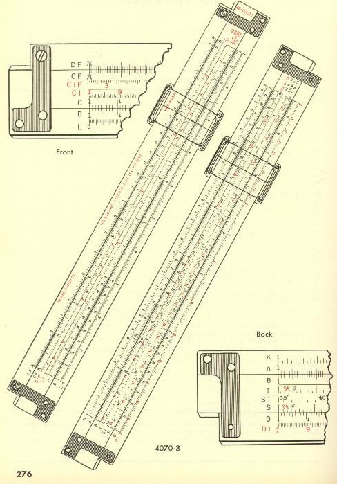

From p. 276 of the 1954 K&E Product Catalog, this detailed drawing of the Model 4070-3 Polyphase Duplex slide rule shows the detail that went into duplex slide rule construction. This rule, and many others, will be discussed within this chapter.

The duplex rule would evolve over the 70+ years of its manufacture, which I will describe more fully within the historical context of each model itself, but other than cursor materials and design, font usage, and edge laminations, the celluloid-covered mahogany rules would remain remarkably similar throughout these build histories, a testimony to the long-lasting quality of these rules.

Collector's Note: For the most part, the dimensions of the duplex rules remained the same as well. Where there are differences in a rule's length within a model line, the thickness of the stock did change as a function of its length. For example, the 5" version of these rules will be right at 1/5", the standard 10" rules are always 1/4" thick, and the 20" versions of the rules are approximately 1/3". The profile of the cursor block was made thicker to compensate so that the same frames and glass could be used. This is important for today's collector looking for replacement cursors for the longer slide rules, since cursors from the company are not interchangeable between rules of differing lengths. As a new collector, I once thought that maybe a 10" cursor from a donor 10" rule might fit on the much more rare long-scale version, but this is not the case. However, such a cursor can be customized by shimming the cursor blocks with other material, like an old credit card.

K&E rules of this type are easy to compare to those from other manufacturers, particularly the bamboo-constructed rules made by Hemmi in Japan and the metallic rules from Pickett. As collectors, we love them all, but in general the K&E rules are absolutely ubiquitous in the United States, so without too many exceptions these slide rules are easily acquired on this side of the world. As such, beyond those older rules of the Original Duplex Family, which are mostly all scarce, much of what we will talk about in this chapter is not necessarily rare, or with extraordinary value, except for one notable exception in the Modern Duplex era.

It, and other K&E duplex rules, will now be fully discussed, broken down by historical "family" type.

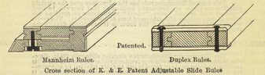

The innovative Duplex design allows access to both sides of the middle slide simultaneously. If the indicator/cursor covers both sides of the slide rule, then a single setting of the slide can allow access to double the number of scales versus the single-sided, Mannheim design.

## The Original Duplex Family

Certainly, slide rules based on the duplex design had the potential to be powerful rules, especially evidenced by what they would become by the end of the slide rule era; however, without question, K&E achieved remarkably little with the "Original Duplex Family" of rules from a technology perspective. Those advances wouldn't come until decades later with other duplex family types.

In fact, K&E was unable to use the extra real estate inherent in the Duplex design to good effect. This is due, somewhat, to a technology limitation early on, mainly because of a lack of capability of their dividing-engines to etch scales across the entire surface area. As such, it would be a long while before the K&E duplex rules grew beyond the 8 scales of the original series.

K&E may have thought that they had time to develop this rule conservatively, given the sole right to produce the duplex design. But other slide rule makers were quick to dig into their own bag of tricks, inventing designs that would take away the chief duplex advantage, namely the ability of the rule to do three multiplications (or divisions) with one setting of the slide. See Sidebar: Three-Number Multiplication for more detail.

The Wm. Cox patent of Oct. 1891 called for his invention to have three defining characteristics:

1. The now familiar duplex stator and slide construction.
2. The use of a "wrap-around" runner.
3. The implementation of the specific scale set with inverted scales on the slide.

It is that third quality that makes three-number multiplication possible with the Cox rule, becoming the technology's main selling point.

As such, the early 1744 series of rules known as the "Wm. Cox rules" were very specifically based only upon those patent qualities, including a very limited scale set by more modern standards. And this seems to be the only goal for the first series in our discussion here, which is essentially to function as a "double-sided, original Mannheim" rule with an additional inverted scale capable of performing that simple and efficient multiplication technique.

There would be room to improve the rules over time, offering more functionality. But instead of adding to the Cox design overnight, improvements happened by way of evolution, not that they didn't seem to try. This period of time would be the most furious experimentation with a product you'll ever see!

To start, K&E did recognize that the Cox patent version of the rule did not have trig functionality, so in a strange implementation, they would offer a version of all the rules in this family equipped with an option for a "trigonometric slide," with S, L, and T scales replacing the BI and CI scales on one side of the slide. And if the consumer was especially well-to-do, he or she could opt for a model version with BOTH slides. And then there was the feverish pursuit in cursor design, with no fewer than 5 different cursors appearing on models over the course of both the 1744 and 4070/71 model series.

Note: A discussion of K&E cursors deserves more space than a simple sidebar, so please see Appendix 3: A K&E Cursor Study.

## Sidebar: Three-Number Multiplication

The two important inventions of the Cox patent were the ability to use scales simultaneously on both sides of the rule during a computation AND the ability to do what we refer to here as Three-Number Multiplication using one position of the slide.

The first of those inventions is logically the most important from the standpoint of history, being that for the next 80 years of the slide rule era, the most powerful slide rule in the world, regardless of maker, would be of the duplex style.

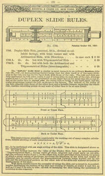

The Model 1744 series of rules as shown in the 1895 Product Catalog.

Yet, it is the second of those inventions that was the main selling point in their 1895 Product Catalog (shown above), which essentially copied the information and diagrams from the 1891 patent. So while the scale set would be limited, it was the inverted scales that made the design capable of the multiple operations with a single setting of the slide.

This happens with any duplex rule where D and CI are on one side of the rule with another C/D scale on the other. For example, to compute any multiplication of three numbers, the first product can be figured by aligning each number on the D and CI scales on one side of the rule, and then merely flipping the rule while setting the third number on its C scale and reading that result off of that D scale. For a mixture of division and multiplication, you just decide whether or not to use the inverted scale in your computations.

Yet, K&E had to understand that single-sided rule designs could accomplish the same thing if it had both inverted AND folded scales, or perhaps some other innovation in the way scales are laid out. As such, many other slide rule makers knew this and claimed the same "advantage" as the Cox duplex design.

Collector Mike Syphers provides a terrific look at the nature of this three-digit multiplication in a vignette called the "Scale Wars." He highlights here many rules from other U.S. makers produced at the time in response to the Cox Duplex rule. They include a rule from Thacher & Scoffield (distributed by Dietzgen beginning in 1901) called the "Engineer's Slide Rule." Another by Dietzgen in 1904, known as their Model 1762 "Multiplex." And yet another by Kolesch & Co. in 1907 coined the "Triplex." These rules were rather ingenious, involving new innovations to provide equally efficient multiplications as the Cox rule, all without breaking the Cox patent.

Additional rules from Europe also began to feature scales that would provide three-number multiplication capability. These included the Tavernier-Gravet "règle des écoles" produced in 1904, the Nestler 34 slide rule introduced in 1911, and the Halden's Calculex Pocket Watch Rule of 1906, which used an inverted scale on its back side.

But the most damning evidence I mentioned earlier in the text, being the first Rietz rule made by D&P in 1902. It, predating the strikingly similar K&E Polyphase Mannheim, offered strong efficiency with chained multiplication.

So whatever advantage that K&E had hoped to gain in that regard with the Cox patented rules was gone within 5 or 10 years of the introduction of the Model 1744 duplex rule.

And subsequently, in addition to the new Polyphase Mannheim Model 4053 produced in 1909, K&E would push out newer duplex models: the 4088 Polyphase Duplex in 1913 and the updated 4092 Log Log Duplex in 1922, each yielding the potential for FIVE multiplications in only TWO settings of the rule.

Do yourself a favor and read more about these slide rules on Sypher's "Following the Rule" website!

Consequently, and rather strangely, this Original Duplex family would boast the largest number of individual models of any slide rule family in the company's history. And all of the model numbers with all of the slide options, as well as cursor options, make it very difficult to follow, particularly since rules that remain today will seldom have BOTH sets of slides for a particular sample, nor would they be labeled with the model numbers on the actual rule in a way to know which version of the rule you have in hand.

This family of rules would prove to be K&E's shortest lived, introduced with the Model 1744 series in 1895 and ending around 1916 (or perhaps 1917). So by the end of the approximately 20 year run, there would be only ONE scale dissimilar to the Polyphase Mannheim Model 4053, which favored a K-scale instead of the Duplex rule's BI scale - and that scale is honestly unnecessary since the rule already offered the CI scale to accomplish triple-number multiplication.

As such, it's a telling point that K&E really didn't seem to know what to do with these Original Duplex rules. Truly, some of the choices for scale layout and models didn't make a lot of sense in hindsight.

So, in essence, the Original Duplex family, even after a couple of decades, did not provide for a wider range of functionality over the slide rules already in their stable.

<blockquote class="ke-callout">

"So, in essence, the Original Duplex family, even after a couple of decades, did not provide for a wider range of functionality over the slide rules already in their stable."

</blockquote>

Yet, this doesn't keep ALL rules in this family from being some of the most collectible and valuable K&E slide rules in company history (please see the Collector's Outlook for this series later in the chapter).

The two main series in the Duplex family are described below.

### Models 1744, 1744A, 1744B, and 1744½

Also known as the "Wm. Cox rule," the 1744 was the first "duplex" rule ever produced by any manufacturer. Early samples of the rule clearly show a Dennert and Pape construction, much like the 1746 Mannheim rules offered by K&E at that time.

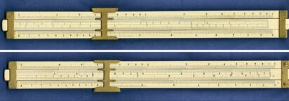

The Cox patented 1744 model rule, as offered in the 1895 K&E Product Catalog. Note the railroad scales and typical Dennert and Pape construction.

There has been some debate about these early rules being constructed by K&E, but collector Bob Otnes has stated that he was informed of the likely happenings by Hans Dennert of the D&P/Aristo company lineage. Dennert confirmed that the celluloid-laminated, wooden components with completed scales were sent unassembled to K&E so as to avoid the US duty tax. K&E then finished the rules by stamping the labels and numbers to the scales, affixing the body of the rule together with end brackets, and then supplying the chisel metal cursor. He further stated that the rules have no D&P markings on the rule. According to the Oughtred Society, which relates what I just told you here, there are only two known samples of the rule in existence - one shown above, and the other shown at that link.

The construction is similar to the imported Mannheim rules made of celluloid-covered boxwood and with cursors and end brackets made either of brass or metal-framed glass. It was added to the 17XX line-up of rules (which included the Mannheims) in 1895, costing buyers $6.50.

The scales were not labeled on the rule, which was typical of almost all known rules back in the day, even if the patent showed scale labels on the left side of the rule. It was a basic scale implementation strict to the Cox patent:

Front Side: A [B, C] D
Rear Side: A [BI, CI] D

The wrap-around cursor, obviously readable on both sides of the rule, was of the "chisel" type, also made of brass.

Marketed as an "Arithmetic" rule with "Arithmetic Slide," this 10" model, as I said, would allow for three multiplication or division operations in one position of the slide. Simultaneously, K&E produced a 1744A trigonometry option for the same price, replacing the BI and CI scales on the back of the slide with S and T scales (sine and tangent), as well as a "scale of equal measures," or L scale (logarithms), squeezed in between. And for a $1.50 more, K&E sold their 1744B variant which shipped with both slides from the other two models, made to be interchangeable. William Cox describes this in the December 1893 issue of The Compass (Vol. 3, No. 5, p. 74).

As such, with the variant options, it is very clear that K&E saw the need to offer more capability with their first duplex rules, but they would not be capable of doing it with one single slide rule.

Interestingly, K&E offered a 1744½ version of this rule, the ½ denoting "half-size." This would be their first "pocket" duplex rule. You might think you could save money getting the half-sized rule, but it was priced equally to the 10" 1744 at $6.50. That combination of price and size likely didn't sell very well, so I'm not planning on finding this rule "in the wild" anytime soon.

I have already voiced my criticism of the rule, which I also discuss in the related sidebar, yet the most obvious problem to mention now is that providing the option for both types of slides in any of these rules greatly limits how the user can operate the rule and the types of computations that can be done. Operations must be constrained to either one type or the other, so mixed operations between algebraic and transcendental functions - trigonometric, exponential, and logarithmic - cannot be accomplished seamlessly without first swapping out the slide. And truly, it is uncertain today how many of these rules, in either the Cox models or the following 4070/71 models, were actually sold, as so few samples of any of these rules exist in the first place.

But for the collector, these Model 1744 "Cox" rules are rare, and thus very desirable. As with most of K&E's 19th century slide rules, none came with the model number on the rule, however samples of this rule include the Cox patent written on the rule by the "Cox" name, as well as having the traditional D&P railroad track style scales.

Rules in the 17XX series, including both their Duplex and Mannheim rules, were the only slide rules offered by K&E from 1887 to 1900. But a year later, everything would change.

### The Model 4070 & 4071 series

When K&E ramped up production of their slide rules in 1901, their Duplex Family expanded immensely, becoming their most emphasized and produced slide rules. The 10" Model 4071 was the main rule in this series of 10 slide rules, all of which were variants of the original 1744 series, and all available through the 1901 K&E catalog. These rules, now made of celluloid-covered mahogany with engine-divided scales, typically came in a choice of brass indicator OR clamshell glass cursor, a choice of arithmetic-only or both-slide (arithmetic and trig) models, and in 5", 10", and 20" varieties. And, importantly, these would be the first production duplex rules built in-house.

Among the 10" rules, the Model 4070 (all-brass indicator) and Model 4071 (clamshell glass cursor) directly descended from the arithmetic 1744 rule. As such, these had A [B C] D scales on the front side and A [BI CI] D scales on the back, meaning there would be no reason to ever invert the slide. At an introductory price of $8.00 for the glass-equipped 4071 and $6.50 for the brass-equipped 4070, these represented K&E's flagship line, and thus their highest priced slide rules.

The previous Model 1744B, shipping with dual arithmetic and trigonometric slides, became the new Model 4075 and Model 4076 rules in this lineup. Again, both 10" rules, the former with brass and the latter with glass, and both shipping with interchangeable arithmetic AND trig slides. The option with both slides costs an extra $1.50 over the single-slide 4070/71 models. Note that the 1744A trig-slide-only variety was no longer represented, so if you wanted trig scales you would have been given little choice but to spend the $9.50 for the Model 4076 with the extra trig slide.

K&E also offered a full selection of pocket Duplex rules in this series, based on the original 1744½. These 5" rules were the arithmetic-only Model 4060 (brass) and Model 4061 (glass) versions, as well as the Model 4065 (brass) and Model 4066 (glass) which shipped with both arithmetic and trig slides. Again, K&E offered no discount with these rules over their full-sized brethren.

Finally, the first 20" duplex rules were included in this series. These were the Model 4078 and Model 4079, again with brass and glass cursors respectively. These only offered the arithmetic slide option, but they still set back the buyer $16.50 for the 4078 and $18.00 for the 4079. The latter would cost around $630 in today's money, or about the price of your iPhone. At least they didn't have to recharge the slide rule.

This series of rules would morph slightly over the next 15 years, beginning with 20" options that came with interchangeable, double slides to add trig functionality. These models, introduced in the very next catalog in 1903, were the Model 4080 (brass) and Model 4081 (glass) rules priced at $20.00 and $21.50 respectively. These rules would be renamed when the line-up was completely revamped in 1906, and those model numbers would be reused by K&E nearly 30 years later for two of their most important slide rules in company history (see the Log Log Duplex Family in a later section).

Speaking of 1906, while recovering from a fire to one of their Hoboken, NJ, warehouses the year earlier, K&E was undeterred from making a plethora of changes to the 4071 series of slide rules, streamlining some of the models while also adding many others, including a variety of 8" and 16" rules. Additionally, K&E shifted away from shipping both slides with their rules, going back to single-slide, arithmetic and trigonometric options. Where they did this, the models were denoted with an "N" suffix. These retained the $1.50 higher price tag over the arithmetic-only rules despite no longer shipping with two slides. This is because K&E found a way to add the trig scales to the arithmetic slide, with A [B S C] D on the front side and A [BI T CI] D on the back, with the L-scale on the edge of the rule. The cursor was modified to provide an indicator for the rule's edge. This was true for both cursor options, which remained the same for the models, except "metal" was substituted for brass in the non-glass variants. And like the models before it, all slide rules would come with a sewed-leather case and directions.

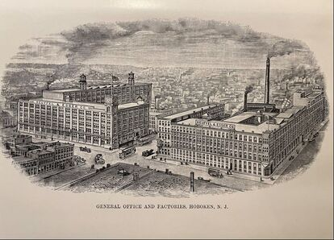

The left building was K&E's new office building in Hoboken, NJ as built in 1906, next door to their largest factory on the right.

And this is what it looks like today, as shown on Google Earth.

Because of the number of models in this series, 20 in total in 1906, it is easier just to list them by length. The 4060 ($6.00) and 4061 ($7.50) 5" rules did not change, but the 4065 and 4066 rules became the 4065N and 4066N, with arithmetic and trig slides respectively. Those rules are priced, once again, at $1.50 premium over the arithmetic-only 4060 and 4061 slide rules.

A new series of 8" rules was added, given model names of 4067, 4068, 4069, and 4069½. The 4067 ($6.00) and 4068 ($7.50) arithmetic rules came with metal and glass respectively. The trig-only rules, the 4069 (metal) and 4069½ (glass), carried with them a $1.50 higher price tag. Why the "½" suffix? In this case, they ran out of numbers, as the 4070 starts off the 10" rules.

The 10" rules, which bear the family name, were the 4070 and 4071 models. These did not change from the previous model years, other than the conversion of the brass cursor to "metal." The 4075N and 4076N (note the added "N" suffix) were converted to the new all-purpose single-slide "with trig scales," as explained in the 1906 catalog. Like the 5" and 8" rules, these 10" slide rules retailed at the same prices.

Also new to the family were 16" rules, the 4082 (metal/arithmetic), 4083 (glass/arithmetic), 4084 (metal/trig), and 4085 (glass/trig). Prices were $14, $15, $17, and $18 respectively. (Note that the 4082 and 4083 model names would be repurposed in later years.)

For 20" slide rules, the 4080 and 4081 "both-slide" models were changed to the 4088 and 4089, now becoming trig rules. Curious is the lack of the "N" suffix here, where apparently the change of number was good enough? The 4078 and 4079 arithmetic rules of the previous line-up would also get new model numbers, now called the 4086 and 4087. These rules actually got a price cut, with the 4086 and 4087 priced at $16 and $17, while the 4088 and 4089 were $19 and $20.

1909 would feature one last revamping of the 4071 series, whereas the entire lineup would dispense with the metal cursor option. As such, all model numbers originally with brass or metal cursors would disappear, reducing the total number of rules offered in the 1909 version by half. K&E also made a change to the end brackets for the 1909 model year, as shown in that catalog's illustration of the rule for that year. The bracket for the older rules was in the shape of a "C," but in 1909, the brackets became an "inverted-C" shape. Two years later, they would switch to the "L" shaped end brackets which are the standard for all future K&E duplex rules.

Of these ten rules introduced in 1909, five of them would change model numbers and add a "T" suffix. This designation now indicated the rule was of the "trigonometric" variety. As such, there would only be two rules for each length, with a single number model, both with and without a "T." The 5" rule would now exist as the 4061 and 4061T models, priced at $5.00 and $6.50 respectively. The 8" rule became the 4065 and 4065T models (a number borrowed previously from the 5" trig rule). These models were priced the same as the 5" rules. The Model 4071 and 4071T took permanent grasp of both the series name and the 10" selection of rules, again priced identically to the 5" and 8" versions. The 16" variety, now known as the 4083 and 4083T rules, were priced at $12 and $15 respectively. The 20" rules were condensed down to the 4087 and 4087T models, at $15 and $18 each. These prices represent a $2 discount to the previous price and 16% off the highest historical price of this family of 20" slide rules. I believe it's quite obvious that K&E was aware of how exorbitant some of these prices were and worked conscientiously to reduce cost to the consumer, which in the case of the longer rules, was chiefly commercial customers.

This series of rules would disappear entirely a decade later. Listed in the 1916 catalog, there would be a 5 year gap before K&E's next catalog in 1921. While there is no catalog to show exactly when the line-up disappeared, it is clear from collected samples today that there were no more production dates after 1917.

Dating most of these rules is difficult. These ended before K&E's use of serial numbers in their rules in 1922; and while there are production numbers imprinted on the ends of the rules, it is not known how those can be used to date the rule today. Instead, collectors are left to use evolutionary changes to the rules like cursor, end-bracket, and scale changes, as well as catalog descriptions, to approximate the date of these early duplex rules.

I mentioned earlier why I felt this model lineup could have been short lived, and certainly, it seemed K&E was never content with it, constantly trying to improve it, but never really addressing the real truth of the matter, namely that the Duplex Family of rules didn't really give additional power for the user to do calculations that couldn't be done with already existing K&E slide rules. This is something that could have been fixed - quite simply, there's no reason to have A and D scales on BOTH sides of a slide rule that has a capability of being read on EITHER side of the rule with the same setting of the cursor. I find it curious why it took K&E so many years to understand that? It is, after all, a major selling point for duplex rules.

I suspect that K&E just didn't see the urgency. If they are selling slide rules by the thousands, then what would they care if a slide rule wasn't as good as it could be? Or perhaps by 1909, they'd be trapped by their own product placement, not willing to compete with their flagship slide rule, the Model 4092 Log Log rule, introduced the same year (see the Log Log Duplex Family in a later section).

Even so, from the perspective of history, for all the potential that the duplex technology possessed, the 4071 series and the Duplex Family of rules on the whole were rather unremarkable.

This would change with the introduction of the Model 4088, the first rule in the improved Polyphase Duplex family, which we will talk about next.

## The Polyphase Duplex Family

In 1913, four years after the introduction of the Model 4053 Polyphase Mannheim slide rule but also four years prior to the death of the 4071 series, K&E introduced what they called the Polyphase Duplex slide rule design. Before we discuss each of these models though, let's continue our exploration of what K&E offered to that point and why these rules represented the more complete fulfillment of the promises of the duplex design.

The 1913 catalog, which is copyrighted 1912 incidentally, has a few addendum pages pasted within to reflect newer products in 1913 at the time the catalog went to press. The new Polyphase Duplex Model 4088 rule was described on one of those addendum pages.

The first sentence reads, "The Polyphase Duplex Slide Rule is a combination of the Polyphase and the Duplex Rules, with the addition of several special scales."

I think this statement is disingenuous, at best.

If K&E were honest, they would admit their Duplex family of rules was not meeting the potential of the duplex design. Remember, that line-up was revamped in 1909, only then giving it a near-equivalence in scales to the 4053 Polyphase Mannheim. There was simply no room with existing Duplex rules to innovate with other scales. Likewise, we could see that other slide rule designs, such as their own Model 4053, as well as other single-sided rules from competitors, had made the functionality of the Original Duplex Family of rules less unique.

As such, the Polyphase Duplex family of rules was K&E's opportunity to make the most of what a duplex rule could do, to the point where K&E would kill production of the original Duplex family within 4 years of the introduction of the Polyphase Duplex.

That said, so what were the "special scales" K&E mentioned? These would be the folded scales of the C, CI, and D scales. This is the first appearance of the CF, CIF, and DF in any K&E slide rule, which were valued because now users didn't have to worry about off-scale computations - a solution will always be on the rule with folded scales regardless of which index is used. And as mentioned earlier, that combination of scales permitted chaining of multiplication and division operations with great efficiency, now capable of doing 5 such operations with only two settings of the slide.

And as a tertiary advantage, because the scales were folded over pi (3.14159...), then values on the D-folded scale were also the product of pi and the D scale setting. This made quick work of problems that dealt with circles.

Of historical note, this is rather late for the introduction of folded scales on a slide rule. In his comprehensive 1909 work, *A History of the Logarithmic Slide Rule and Allied Instruments* by Florian Cajori, he states that as of the time of his writing folded scales on slide rules had not taken "foothold" (p. 66) in the States and England, that France had seen much increased use of it, especially in their technical schools - using a Tavernier-Gravet slide rule with folded scales known as the "règle des écoles" - and Germany was just beginning to offer this rule for sale. The 1913 introduction of the folded scales on the K&E Model 4088 rule was certainly better late than never!

Specifics of the models in the Polyphase Duplex Family, starting with the Model 4088, are as follows.

## Sidebar: The European Influence on K&E

An aspect that I believe becomes obvious upon digging deeper into K&E's product line and the historical timing by which they rolled out certain innovations is also something I haven't seen talked about very much on the Internet, and that's the level of influence that European companies and their markets undoubtedly had on K&E. As German immigrants, founders William J. D. Keuffel and Herman Esser leaned strongly on happenings in Europe during the mid-to-late 19th century and brought some of those practices to their own company, which they founded in 1867, to the United States.

While K&E was the leading seller of slide rules in the United States for the entire duration of the company's existence - challenged early by Dietzgen and Post/Hemmi and later by Pickett for market share - K&E was known as the leading producer in the States, especially in their main business of surveying equipment. But they also would hold a variety of important patents regarding slide rule technology, especially once William Keuffel hired his second cousin, W.L.E. Keuffel, in 1884. Also named William (or sometimes "Willie"), he would eventually become the Vice President of Manufacturing. He should likely receive more credit for K&E slide rules than any other single individual, as he was the guiding force for pushing the company in the direction of in-house production of all rules, including the writing of seven patents from 1898 to 1916, as well as the development of tooling to make slide rule production happen. His own son, A.W. Keuffel, would eventually write 11 slide rule patents himself.

As a company, K&E was always evolving; pushing diversity; able to make money on a variety of products. But for them, slide rules were a highly visible aspect of their business. They did not need slide rules to be tremendously profitable in order to reap the benefit of the exposure they gave the company. They would not compromise on quality for this reason. But this did not mean profit wasn't important. In some cases, they ruthlessly protected their bottom line, especially in their dealings where licensing agreements are concerned.

But in the early days of slide rules, we know they leaned heavily on what they could learn from European slide rule makers. Companies like Dennert & Pape (Aristo), Nestler, Marc/UNIS, and Tavernier-Gravet predated K&E by several years, particularly in slide rule production. After all, Great Britain had been developing and using slide rules since the 1600s and, by consequence, became popular in use throughout Europe much earlier than in the U.S., beating the US in popular use by a good 20 years. The original Mannheim was in use by the French military in 1859, whereas it wasn't until 1881 that Americans began to be exposed to the Thacher Cylindrical rule. K&E was always aware of these histories, as well as the development by D&P with celluloid-lamination of wood in 1886, their making of the Rietz design in 1902, and the nature of European markets, especially in London, Paris, and Berlin.

K&E wasn't alone in this. Dietzgen, A.W. Faber, Frederick Post, and Hemmi each set up shop prior to the turn of the 20th century, all of which were finding their way to the slide rule market as contemporaries to Keuffel & Esser. They too followed the lead of the earlier European companies. As such, the market for slide rules accelerated rapidly and there were many makers for Keuffel & Esser to monitor. In fact, it is said in these early years that the founders made yearly trips to Europe to learn and grow their business as much as possible, something that becomes obvious with the company contracts and products they would soon offer.

Likewise, the reason for European partnerships is simple. It was the best way to fast-track products to their rapidly expanding product markets. K&E's factory, which produced surveying equipment as K&E's main business, was not tooled for the additional production of slide rules. They needed established partners to fit the bill. Although consumer interest for slide rules in Europe remained in the single-sided or "simplex" designs, based on the traditional Mannheim, Rietz, and Darmstadt scale sets, in the United States there was no extensive history to dictate consumer preference. So being quick to market, rather than taking years to build up their own production capabilities, was the first mandate for Keuffel and Esser. They understood the importance of giving consumers many slide rule options, and they sold in large numbers, particularly their duplex rules.

And, importantly, this wasn't only a focus of their slide rule business. From their inception, K&E would rapidly produce an extensive catalog of a wide variety of goods. While their main lines of products were made in-house, the vast majority were out-sourced to other suppliers. And by the turn of the 20th century, K&E had thousands of products available in their catalogs, with store-front/distribution centers in four major cities across the U.S., including New York City, Chicago, Saint Louis, and San Francisco.

Of course, this business model was not unique. Perhaps no other company was more influential to K&E's business model on the whole than the W.F. Stanley and Co. in London. The Stanley Company was enormous in England by the turn of the 20th century, having long broken ground in the arena of drafting and survey equipment themselves. Not only would K&E sell many Stanley-made products over time, K&E likely purchased most of their own tooling from Stanley as well, particularly their dividing engines that Stanley invented in 1861. Stanley laid the blueprint for such a business some 15 years prior to Keuffel & Esser, having more than 3000 products in their own catalog by 1881. London had to be a frequent, annual stop for Messrs. Keuffel and Esser.

This idea of borrowing ideas, designs, tooling, and supply from other companies shouldn't be a surprise, nor does it make K&E any less innovative. It's the way of any good business. We see this with the Frederick Post Company, who would never manufacture a slide rule of their own, instead farming out their manufacturing to Sun Hemmi in Japan. Likewise, Chicago-based Dietzgen was in no way particular about from whom they would acquire licensing rights. They too formed partnerships with Dennert & Pape and Nestler to accomplish their own goals.

Instead of spending money on the research and development (R&D) of new products, it's much cheaper to let somebody else do that, put your own name on it, and rapidly build a customer base. With any young company getting one's feet wet in a new market, it's just smart business to produce reliable, known products with a history of consumer demand and commercial success. Where they came from didn't really matter.

Of course, concerning slide rule production, we know that the earliest K&E models were imported from European companies like Tavernier-Gravet and Dennert & Pape. And for them, tapping into a growing market across the Atlantic made financial sense. So, it is reasonable to believe that these companies desired to flood the US and European markets simultaneously with slide rules.

Keuffel & Esser were quick to understand the advantages of celluloid on slide rules. The technology was obviously superior to anything that preceded it, making slide rules more accurate and much easier to read once engine-divided and painted in relief. Quite simply, Keuffel & Esser did not hesitate to bring this to the States. Interesting that by 1901 with the introduction of the new product lines, K&E simply referred to the celluloid laminations as "white facings" - they had become that ubiquitous.

Evolving from boxwood models provided by the Parisian company Tavernier-Gravet, and moving to mahogany rules from German maker Dennert & Pape, this represented a rapid development from an invention patented in 1886 and not fully implemented by D&P until 1888, where in the same year there is evidence (Gieseler, p. 149) of K&E offering these rules to the American public. In an age without phones or internet, with an enormous barrier of water in between, I find the speed of this to be rather astonishing. We see this with the following models and their associated product catalogs:

10" Model 1746 Mannheim and 20" Model 1748 Mannheim in 1890
Model 1744 Wm. Cox Duplex in 1895
20" Model 1749 Stadia rule in 1895
10" Model 1745 Gunter in 1895 (adding celluloid facings to the original rule)

These rules, of course, are the precursors to the K&E-made, complete line of 4041 series mahogany rules, the Model 4070/71 Duplex family, and a variety of specialty rules (stadia, sewer, et al), all of which would come out in 1901.

### The Model 4088 Series

The model series began with a single Model 4088 slide rule in 1913. This model number is not to be confused with the brass-cursor 4088 model (4071 series Duplex Family) that was discontinued in 1909. The new 4088 model was introduced in two lengths, an 8" version predictably designated the 4088-2, and the full-scale 10" version known, of course, as the 4088-3.

The 4088-3 (10") and 4088-2 (8"), as introduced in 1913 with the same "column cursor" pushed out to all K&E slide rules, contained 11 scales. This is the same number as the 4071T duplex rule that was currently being produced and which it would eventually replace. So what makes it better?

In this new rule, K&E does away with the redundant scales. Gone were the A and D scales on both sides of the stator rails. Instead, the front side of the rule would be configured as DF [CF CIF C] D and the rear of the rule would be setup as K A [S T CI] D L. It's an improvement over the Polyphase Mannheim and Duplex families because of the historical addition of the folded scales discussed earlier, but also there is a K-scale which was missing from every Duplex rule K&E had produced. Certainly, this is the best arrangement of scales on any K&E slide rule to this point, even better for general math computations than the Model 4092 Log Log Duplex rule introduced in 1909 (to be discussed in the next section). It would become even better when K&E added a B-scale on the back of the slide in 1922.

Perfectly timed with the ending of the Duplex Family line-up, K&E added the 20" Model 4088-5 in 1917 and then the 5" Model 4088-1 five years later. Very few other changes were made to this rule over time, except for the cursor modifications they made simultaneously with all other slide rules. Those changes included the switch to the frameless glass cursor with metal rails in 1915, followed by a switch to plastic rails in 1916.

(Note of general amusement: This version of the cursor was patented in August 1915, as number 1,150,771 by "Willie" L. E. Keuffel.)

In 1936, K&E revised the 20" rule and added an "N" designation. They supplied this N4088-5 with the "new-improved" cursor like all other K&E rules - this new cursor with a metal rim around the glass kept users from breaking off the corners of the glass by overtightening - which was indeed a god-send. It is unknown why the new prefix was used for this rule since no other such "improved" cursor rules added the "N" to the model name.

Edit: After some deeper digging, it appears that there are samples of the N4088-5 with serial numbers, cursor, and scale fonts that date back as early as 1926. This is beyond curious, as it isn't until 1936 when the N-prefix is first shown in a product catalog. Later we will see the Model 4092-3 adding an N-designation in the catalog, yet not on the rule. I see this as an indication that K&E did not always have correct designations in their catalogs. More research is needed.

K&E would cease production of all versions of this rule in 1939, replaced by similar, but more powerful, Polyphase Duplex rules that we'll talk about next.

### The Model 4070 Trig and 4071 Deci-Trig

In 1939, K&E discontinued all models of the 4088 and replaced it with these two slide rules, both with 10" scale length. Not to be confused with the original 4070 and 4071 Duplex family of rules that were discontinued more than 20 years prior, these new rules increased trig capabilities to give more accuracy for angle measures that are less than 5.73 degrees. Because sine and tangent are mostly the same for such angles (actually approximating the radian equivalent for that angle), then a single scale of greater resolution can be used to evaluate both of those functions. This would be known as the "ST" scale on this rule, which ranges from 0 to 5.73 degrees (on the Model 4071 Deci-Trig) rather than the typical 0 to 90 degrees on a normal S or T scale.

The secondary benefit of this is extra precision on the S and T scales, meaning that those scales could now begin at 5.73 degrees instead of the normal 0 degrees. As such, by essentially continuing the S and T scales where the ST leaves off, you gain at least half a rule's worth of precision for angles bigger than 5.7 degrees, since half of the typical S and T scales normally take up half the rule. So, in essence, the ST and S/T scales work like one continuous scale when used together.

Now this was somewhat of a new scale for K&E. It would mark the second occurrence of an ST scale on a K&E rule, following the 4080 Trig/4081 Deci-Trig Log Log models introduced two years earlier, as we will see in the next section.

This ST scale (also known as the SRT scale in later decimal trig rules) would become a fixture of all but the most basic of K&E slide rules.

The overall scale set is something we could call the "Improved Polyphase." It was described earlier with the Ever-There Model 4097D. It is as follows:

Front Side: DF [CF, CIF, CI, C] D, L
Back Side: K, A [B, T, ST, S] D, DI

So, why two new models? Taking a cue from the Log Log Duplex Family of rules (see next section), K&E gave buyers a choice with how they wanted their trig angles expressed. Those who preferred a traditional degrees, minutes, and seconds (DMS) format might have chosen the Model 4070 Polyphase Duplex "Trig" version of the rule. But the trend toward a decimal degrees rule was strong by this time, whereas the Model 4071 Polyphase Duplex "Deci-Trig" could be preferred. This distinction with angle input preference had proven successful when first introduced in the Log Log Duplex models in 1933, so it made sense to do the same with the Polyphase Duplex rules in 1939.

The 10" new models immediately superseded the 27-year-old 4088 model in all lengths, except for the 8" 4088-2 that would hang on for one more year, I suspect because they might still have had stock available. But I find it intriguing that until the Doric rules were introduced in the late 40s, a good decade passed by where the 10" 4070 and 4071 were the only Polyphase Duplex models available. In fact, this was a decade where there were ZERO K&E duplex rules manufactured in sizes less than 10". And as I said earlier, I suspect that the Ever-There series had something to do with that. A pocket version of a 4070 or 4071 duplex model would have cost double that of the Model 4097D Ever-There that sported the same, yet Improved Polyphase, scale set.

Note: These rules and the Doric rule that follows have manuals written once again by US Naval Academy professors, Kells, Kearn, and Bland. By 1945, their patent number is listed on the slide rule itself. Coming two years after the 4080 & 4081 models that they designed, it is clear that they had some part in the design of this rule as well.

### The Model 9071-3 Polyphase Duplex Doric

After 1947, the 4071 Polyphase Duplex would get a plastic, Doric equivalent rule known as the 9071-3 Doric Polyphase Duplex. Strangely, this rule was never described in a K&E catalog; only in a 1949 parts list. The rule was likely in production for a year or two around that time. I would suggest as early as 1947, which matches the copyright on a similar Doric plastic rule, the Model N9081-3, which was the all-plastic brother of the Model 4081-3 Log Log Duplex rule. It would appear that these rules were intended to test the market for the concurrent sale of both plastic and mahogany slide rules that provide the same functionality, something I will discuss more with the N9081-3 in the next section.

Made entirely of plastic, but no plastic like the Ever-There rules, the Model 9071-3 demonstrated the transitional and experimental nature of K&E's use of what they were still calling Xylonite plastic, something discussed fully in the Sidebar: A Little About Plastics later in this chapter. Being fully "Doric," it lacks any ornamentation as one might expect, with black-only numbers and fonts.

The 9071-3 Doric is quite rare from a collector's perspective as it doesn't pop up often at auction. It is certainly attainable, however, and reasonably so, as it won't be confused by many as a high-dollar collector's rule, with an average price of maybe $25 dollars on eBay when it does come up. However, very few have come up for sale over the last 5 years and may be valued higher for that reason.

Edit: I acquired this rule in 2023. More description coming soon.

### The Model 9068 (4168) Polyphase Duplex Pocket Doric

So when I discussed the Modern Polyphase Family of rules in the previous chapter, I made mention of the Doric series of rules which served as a transition line of rules in terms of construction. One rule, the 9071-3 Doric, we just discussed. The other, the more impactful of the two rules, requires a more detailed look here.

The 5" Model 9068 Doric was a beautiful, well-proportioned pocket duplex rule with a simple Polyphase-type scale set:

Front Side: DF [CF, CI, C] D, L
Back Side: K A [B, ST, S] D, T

I mentioned earlier that the Doric can be thought of as un-ornamented, but this doesn't have to mean "basic" just because it uses no red ink. The scale set is logical and powerful for as simple as it is, originating, naturally, from the 4088. The ST scale (in DMS measures) is very convenient, giving 4 significant figures of precision despite being a pocket-sized rule. While typically called a 5" rule based on the length of the actual scales, this rule is actually 12.5 cm in scale length, not 5". This will come into play when I discuss this format of rule as it appeared to be cloned by other slide rule makers (see the Sidebar: The 9068 and the Clones below).

When K&E shifted direction away from providing a long-term Doric family of rules, the 9068, which likely originated from a different "prototype" rule known as the Model 10000 Doric as early as 1946, was reassigned the model number of 4168 around 1950, or most certainly prior to the 1952 catalog. In 1956, the same rule would be offered in a sheath with a leather covered clip, with a model number of 4168C. In 1962, it would become either the 68-1555 or 68-1550, the latter number if the customer bought the version with the case clip. Finally, in 1968, the non-clip version was discontinued, only offering the version with the clip until the end of the K&E era in 1975. It would be the only rule to retain the Doric label over time, despite no other Doric references to slide rules since 1949.

This same model would also be made for one year only, in 1968, as the Model 68-1555 Celanese Celcon, a beautiful and highly desirable slide rule (see also the Sidebar below). This rule, carrying the Doric label as well, is somewhat rare and will cost the collector at least $75 to $100 when they appear yearly, perhaps, on eBay. The normal 9068 or 4168 version of the rule will be in the $20 to $30 range, more with pristine accessories.

The 9068 Doric model was offered at $8.50 in 1949, suspiciously priced at $10.35 in the December 1951 price list as the 4168, only to be returned to $8.50 two months later in the February 1952 price list. In 1962, the clipped case model 68-1550 would be $9.50, while the clipless version was $1 less; I suppose the former is money well spent if it keeps the rule from falling out of one's pocket!

## Sidebar: The 9068 and the Clones

The K&E 9068/4168 was far from the only pocket duplex rule of its exact shape and size on the market during this period, and the resemblance between them is not a coincidence.

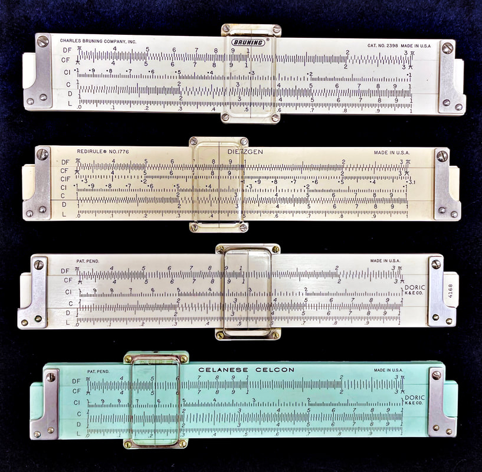

What you see is not an illusion. The image above shows four rules that look almost identical to one another, and two of them are not K&E slide rules. The third rule is the K&E Doric 4168 Polyphase Duplex, likely introduced around 1950. As mentioned earlier, this is the direct descendant of the original 9068 Doric model. It would continue in production for 11 years until 1962, get renamed the 68-1555 for 6 years, and then be sold for 8 more years as the 68-1550 with a leather clipped case. Once K&E dropped the Doric "family" concept, no longer mentioning the word in the 1952 catalog or after, this is the only original Doric rule to retain a Doric label.

Below this rule in the image is a one-time variant known as the Celanese Celcon (68-1555), made of a green "acetal co-polymer" thermoplastic known as Celcon, produced by K&E for the Celanese company for one year in 1968. According to the ISRM, in an interview with the research director, it is the first use of the Celcon resin in a product. Celcon, and the Celanese Company, still exists today - they are a Fortune 500 company* and the world's leading producer of acetic acid and polyvinyl acetate. This digression aside, other than the plastic used in both the body and the cursor rails, these pocket rules are identical.

And now, to the top two rules. We likely shouldn't be surprised that Dietzgen is represented here, as they were known to outsource their production to outside makers, but you'd be mistaken to think K&E built the Dietzgen No. 1776 Redirule as pictured. Despite the shape, the dimensions are subtly different throughout, including the length of the rule, size of the rail grooves, size of the adjustment screw in the end brackets, and of course the cursor. The scale length is different too. The Dietzgen has a true 5" scale length while the K&E is actually 12.5 cm. The Dietzgen also adds two more scales, those of the "new" Polyphase scale set.

The top rule is the Bruning No. 2398, and yes, in construction, it is identical to the Dietzgen in every way, with the possible exception of the plastic being used. While age can account for color variations in plastic, the Dietzgen is most certainly colored differently from the factory. However its surface feels like the Dietzgen while the K&E rules feel different. Interestingly, the Bruning has the same scale set as the K&Es, not the Dietzgen.

Part of the problem with reconstructing slide rule history is the lack of documentation of agreements, contracts, and production timelines for any of these companies. The best we have is trademarks, product catalogs, and patents in order to understand, in this case, who's cloning who?

The Charles Bruning Company deserves special mention. Bruning produced their own rules, but a greater number of them existed as rules licensed to other companies. As I said, Dietzgen was known for out-sourcing many of their rules, especially the plastic ones, but not to K&E in this case. Bruning is the licensed contractor here, as well as for Dietzgen's No. 1771 rule, among others.

The hard question to ask is how Bruning might be related to K&E? And is there any chance that Bruning produced these 9068 rules?

The latter question can be answered first - not likely. Most certainly K&E was held back by World War II in the sense that R&D efforts would take a back seat to customized production with the military as their top customer. So another company, like Bruning, could get a jump on them.

For example, Bruning would produce "Ivorite" types of slide rules even during the war. It would not be until ~1950 before K&E shifted to Ivorite construction in their plastic rules. But the early 9068 Doric, and the "prototype" Ecco 10000 version of it, is reputed to be something else - improved Xylonite (?) - or most certainly different than something like the 10" Bruning 2420 "Polyphase" Mannheim rule made around 1943 (from which the Post 1452P rule was also produced).

A second aspect, one of supplying to the military, means that production of typical products would have been redirected into other areas more specific to what was needed in the war effort. We discussed that with the 8858 Special War Time Issue slide rule mentioned in the previous chapter, but we also see a glimpse of this in the K&E 1944 Product Catalog. While we suspect that production numbers of slide rules did not wane overall, as the serial number reference table shows rather normal estimates of 60,000 rules in 1943 and 77,000 rules in 1944. But if we were to look at K&E rules in the wild during this period, we wouldn't see much of their normal production rules.

What K&E did instead during this time is hard to figure completely, but we do know they produced their M4 and M16 Graphical Firing Tables during this time (looking suspiciously like William and Cox Load Adjuster "slipsticks" of the same era), and likely their Model 4108 "US Military" rule. Their rules, with some speculation of their origins, will be covered in the section on Specialty Rules later. But importantly, the serial numbers of these rules seem to match the production table used to date our K&E rules. Regardless, these rules alone are not enough to make K&E busy during the war.

Back to the relationship with Bruning - they produced exactly the same rule as the Model 4108, doing business as the American Blueprint Co. Again, both K&E and Bruning making the same rules during this time? Certainly, this is something worth further understanding!

The idea of "cloned" rules is not anything unusual. While we are inclined to believe that K&E likely produced rules licensed to Bruning, I would leave open the possibility that it could have happened the other way around. And if that's the case, then it opens up inklings that Bruning could have produced the Doric series as well. I don't think so, but who really knows how business was run during the post-WWII era? Yet, in the very least, Bruning most certainly influenced K&E with their slide rule construction during the 1950s, as Bruning was not limited in R&D efforts as was Keuffel & Esser.

*Note: The Fortune 500 company Celanese is based in Irving, Texas, within 10 miles of my residence in the DFW metroplex. I haven't worked up the courage yet, but I wonder if I walked through the front door with my own sample of the Celanese Celcon slide rule if they would even know what it was?

## Log Log Duplex Family

We now come to the "flagship" family of K&E duplex rules, which preceded the Polyphase Duplex rules by four years. This line of rules would prove to be K&E's most successful line, introduced in 1909 with the Model 4092 and continuing in some fashion until the end of the slide rule era. In fact, when you consider a "standard" duplex rule to compare with rules from other makers during the high-point of slide rule production in the 1950s and 1960s, it would be hard to argue that the later version, the Model 4081, doesn't deserve top placement on any tier list you might create.

"Log Log" slide rules were introduced relatively early in the history of the device, invented by physician Peter Mark Roget (of Roget's Thesaurus fame) in 1814, which allowed for the computation of arbitrary exponentials and roots. This was almost a full century before the first K&E Log Log rule. Why so long? Historians would suggest that there were not practical reasons to have a Log Log rule until the engineering boom of the early 20th century, though I feel the real reason is one of production capabilities.

Unlike previous Log Log rules that used a single scale, it is a certainty that more makers wouldn't have thought production of a Log Log rule to be useful unless multiple continuous scales could be utilized, providing worthwhile resolution. Such a design already existed, known as the Yokota layout, which required three continuous log log scales on a stator rail. Enter European slide rule maker (and industry leader) Dennert & Pape, who developed their first "Yokota" designed Log Log rule in 1908, one year before K&E produced their first Log Log Duplex rule.

Note: As previously discussed, dividing machines up until the mid-1900s could only function at the physical edge of a stator rail, so only 2 scales on the rail were possible. This seems odd to me, as companies could put 3 scales on a slide for many years previous, but nevertheless there was a technological limitation to that point in time.

K&E likely retooled with these new capabilities simultaneously with Dennert & Pape, but it wouldn't be until a year after the Dennert & Pape effort that they could roll out a product to market. But it was obvious that K&E's first order of business was to make such a slide rule, likely in what I feel was a partnership effort (see the Sidebar: The European Influence on K&E earlier in this chapter).

Note: Since the C-scale represents the log of a number "x," then a "log of a log" scale for some base "b" allows the computation of b^x power. Because of the need for precision, these Log Log scales are very fine, typically three continuous scales called LL1, LL2, and LL3, folded to produce a single long scale for computing exponentials from base 1.01 up to 22,000. (LL1 ranging from 1.01 to 1.11, LL2 ranging from 1.11 to 2.718 or "e," and LL3 ranging from 2.718 to 22,000.) Other scales can be added for negative powers as well, typically known as LL01 (LL/1), LL02 (LL/2), or LL03 (LL/3) scales. Later rules from many makers will have up to 8 total log log scales for your exponential solving pleasure.

Such Log Log rules require three or four scales to be useful, which means that unless a company produced a rule ONLY for exponential computations, then there would not be enough space on the typical, multi-purpose rule, such as the Polyphase Mannheim layout championed by K&E the very same year. With the duplex design and newly-found ability to have three scales on a rail, then a Log Log Duplex rule could be produced without sacrificing the utility of their own updated Mannheim layout (only the K scale of the Model 4053 is missing from the new Model 4092 Log Log rule), making for a very powerful slide rule.

One should note that the original K&E-made Duplex rule, the Model 4071 series, had been closing in on a decade of production at this point. As mentioned when discussing that rule, I felt that K&E had greatly underutilized that design because they couldn't add more scales and were unwilling to remove redundant scales (A and D scales on both sides, for example). While splitting that series into arithmetic and trig models that same year in 1909, it's no surprise that the days were numbered for this original duplex design. Eight years later, which was also 5 years after the superior Polyphase Duplex 4088 Model, the old Duplex family of slide rules would be gone.

By 1913, the pricing of these rules seems to support this: $6.50 for the 10" Model 4071T (Duplex Trig), $7.00 for the superior 10" Model 4088-3 (Polyphase Duplex), and $8.00 for the new 10" Model 4092 (Log Log Duplex). There would have been a place for the old Duplex at around $4.50 in this pricing structure, but not at a cost nearer the 4088, which was an improvement in every way.

As mentioned, there is a long history of models in this family of K&E rules, so let's dig deep into a model-by-model summary.

### The Model 4092 Log Log Duplex

Introduced in 1909, and priced at $8.00, the new Log Log model became K&E's most expensive, flagship 10" slide rule. Front side scales included A [B S C] D and the back side included LL1 LL2 LL3 [C T CI] D L. I find it interesting that a Model 4092½ version of this rule is mentioned in the 1914 instruction manual that shipped with the rule. The length of that slide rule is not given, but 5" is assumed. The manual mentions that the shorter rule does not have the D scale on the back side of the rule, but otherwise is identical. This rule was never listed in a catalog, nor are samples known to exist. No shorter rule based on this scale set would be offered by K&E until the 4181-1 "Jet-Log" introduced in 1953.

Aside: Note that there is mention of an N9081-1 Doric rule in 1948, but this rule is never known to have been produced. The fact that such a rule took 40 years to happen should not be a surprise. A shorter wooden rule wouldn't have been cost effective, so ultimately waiting for the newer plastic technology makes perfect sense.

This Model 4092 would remain entirely unchanged (except for the company-wide cursor changes) until 1922, when a 20" model, the 4092-5, was created. Of course, this necessitated a name change of the 10" rule to the Model 4092-3.

With this new rule came a drastic revision to the scales. Not surprising based on the success of the 4088 at that point and the increased potential for more scales, the 1922 version of both the 5" and 10" 4092 model incorporated folded scales as well. This design was filed for U.S. patent by A.W. Keuffel in that same year, assigned as patent number 1,488,686 two years later.

Moving all trig functions to the back side of the rule, and reworking the Log Log scales, the new layout was entirely revamped:

Front scales: DF [CF CIF CI C] D L
Back scales: LL0 A [B S T C] LL3 LL2 LL1

The addition of the LL0 scale is lovely here, adding the possibility of computing exponentials for bases between 0 and 1. Granted this scale is somewhat imprecise compared to future Log Log rules that would split these values across more scales (usually called LL01, LL02, and LL03 in future rules); however, this one scale did provide two significant figures of precision.

A K-scale for cubes is all that remained from the typical Polyphase scales, but it could be argued that a K scale is redundant compared to performing the same computations on the new 4092 rule with the LL0 scale.

For example, 8³ can be computed rather imprecisely to two significant figures using the K scale of a typical 10" slide rule - cubes with large bases are mostly impractical because precision is poor. Worse could be said using the LL3 scale of the 4092, but by using the LL0 scale instead (which, like the trig scales, was keyed to the A & B scale of the rule), users can rewrite the problem as (.8×10)³, or .8³×10³. Setting the base at 0.8 on the LL0 scale and raising to the 3rd power yields .51, a similar level of precision as the K-scale. Multiplying by 10³ is the same as moving the decimal three places to the right, for an answer of approximately 510.

Of course slide rules are much less effective with larger numbers, so the real power of the Log Log scales occurs when you have exponential bases closer to 1. For example, something like 1.2³ can be computed to 4 digits of precision using the LL2 scale on the Model 4092 but only 3 digits with the K-scale. Plus, with Log Log scales, the user can just as quickly get all the powers of 1.2, even decimal ones, just by moving the cursor.

No matter, this would be fixed in 1924 when K&E added a K scale to these rules, with a change in designation to both the 10" and 20" rules, adding the "N" prefix. Interestingly, these were catalog-only designations - the 20" 4092-5 rule is the only one that added the "N" onto the rule itself; a curiosity indeed!

The 4092 rules would continue in production until 1939, even hanging on 6 years after the introduction of the next two Log Log Duplex rules, as its scale set was very convenient, powerful, and versatile, especially from the perspective of history. Later similar rules, from K&E and others, would seem to compete for the title of "most scales" on a rule, raising the complexity of their use. The 4092 keeps to the essentials. Likewise, this rule is nicely dimensioned. I haven't talked much about the form factor of K&E rules, especially the duplex rules, but to help with the look of additional scales, the width of the rule is increased compared to other K&E duplex rules. For example, the 4092 rules are consistently 4 cm wide compared to the 3 cm of the 4088 Polyphase Duplex. This 4 cm width would become standard for all of the more powerful duplex rules produced by K&E.

As such, I find the 4092 a joy to use, especially in the later variants that added the K-scale. The inclusion of the DF [CF CIF CI C] D with the "N" model, as with the Model 4088, facilitates terrifically efficient chaining of multiplication and division operations with the least amount of slide motions.

It is beautifully constructed. Its extra width and uncluttered arrangement of scales seems to strike the right aesthetic, especially after 1922 when the rules shifted to laminated edges and after 1927 when the scales were printed in a non-serif font. I own two original 4092 samples made around 1920, as well as two 4092-3 samples made in 1933 & 1934. The later pair are among my favorite slide rules.

### The Model 4090-3 Log Log Trig and 4091-3 Log Log Deci-Trig Duplex

The idea of a slide rule with decimal trig scales had been around for a good while, and when K&E produced one in 1929, a new "vector" rule no less (see the next section), its decimal trig scales got the attention of other consumers. Thinking at first that only electrical engineering students could benefit from decimal trig scales, K&E was quite quick to offer them with their other duplex lines as well. As a math educator myself, doing trigonometry with decimal angles is just much easier for all concerned, not just electrical engineers. While I did not live back during those times and cannot state with authority that education was trending away from DMS (degrees/minutes/seconds) angles, I think it's obvious to see that K&E was not going to deny consumers the opportunity to choose either option where their duplex rules were concerned.

And thus was born the concept of the Trig and Deci-Trig versions of these rules.

I mentioned earlier that, first, the 4088 would give way to the new Polyphase Duplex 4070 Trig and 4071 Deci-Trig rules in 1939, but here, in 1933, K&E did it first with the Log Log Duplex rules, producing the Model 4090-3 Log Log Duplex Trig and Model 4091-3 Log Log Duplex Deci-Trig slide rules. Again, like the 4070 and 4071 that would come later, these rules were identical, only differing in the way the trig scales are divided.

Unlike the new Polyphase rules, these two new Log Log rules would not replace their original rule in the series. In this case, K&E kept the excellent Model 4092-3 and produced a new, revamped Log Log scale set. It was this new scale set that would be implemented into the Trig and Deci-Trig options. So in 1933, and for six years after, K&E would carry three Log Log Duplex rules in their product line.

The new scale set for the 4090-3 and 4091-3 rules:

Front: L LL1 DF [CF CIF C] D LL3 LL2
Back: LL0 A [B K CI] T S1 S2

And scales of the earlier 4092-3 Log Log Duplex:

Front: K DF [CF CIF CI C] D L
Back: LL0 A [B S T C] LL3 LL2 LL1

The first thing to observe with the new scale set is the emphasis on trigonometry, as you might expect. The original 4092 gave up its additional C scale and the S scale for the S1 and S2. These split sine into S1 (0 to 5.73 degrees) and S2 (5.73 to 90 degrees). Since the sine and tangent for angles in the small angle domain are largely the same, then the S1 scale could be used for tangent evaluation of those angles as well.

This is the only implementation of the extended sine scales S1 and S2 on a K&E slide rule, though their Log Log Vector Duplex rule introduced 4 years prior had inverted S1, S2, and T scales. As we will see in our discussion of that rule, there is an interesting backstory there. But suffice it to say, there might be another reason that K&E would re-label these scales for the next version of this slide rule 4 years later.

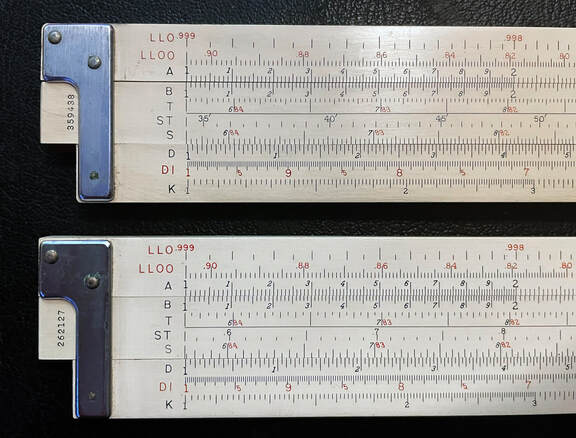

Two rules from my collection, the 4080-5 Trig and 4081-5 Deci-Trig, top and bottom respectively. As per all Trig/Deci-Trig models, the only difference is the divisions for the trig scales. The minute marks on the angles of the ST scale on the 4080-5 is the obvious indicator, but note also that all three trig scales (T ST S) are divided differently, degrees etched in 6ths on the top rule and degrees etched in 10ths on the bottom rule.

I do find it curious why the 4092 hung around for six years simultaneously with the new 4090 and 4091 rules, and wasn't discontinued like the Model 4088 Polyphase Duplex when usurped by the trig models? I would suspect this had something to do with the fact that the original 4092-3 also came in a 20" version, the 4092-5, and because such a long-scale version was not offered with the 4090 and 4091 series, then the 4092 in both 10" and 20" were rather safe, at least for a time.

But mostly, I would suspect that the newer models just weren't as good as what they attempted to replace. To me, they seem to sacrifice too much for their new capabilities. First, it is natural and usual to have all the trig scales on the slide, which the majority of K&Es have always had. While you gain additional precision with small angle trig on the new rules, you do so at the penalty of having the trig scales on the stator rail. Because these are referenced off of the C & D scales, the user would either need to flip the rule to read from D or flip the slide and perfectly align it to assure an accurate reading off C.

Second, as a Log Log rule, having all the LL scales on the same side of the rule makes sense when you only have 4 such scales. This is an aspect that makes the Model 4092 one of my favorite K&E slide rules. Noting that the new rules move the LL0 scale to the back, it seems like a case of, "If it isn't broke, then don't fix it." Future rules would also put the LL0 scales on the opposite side of the rule, but in those cases it's forgivable since they will give you more of them, impossible to fit them all on a single side of the rule. While this is an admittedly minor reason to dislike the newer 4090 and 4091 models, it is a change that I believe didn't resonate well with customers who would have seen this as an unnecessary complication.

Adolph Keuffel, company Vice-President and head of the slide rule division for K&E by this time, expressed surprise at the public acceptance of this rule in a testimony given during the civil lawsuit of K&E against Pickett in December 1948. Concerning the 4090 and 4091 rules, he states:

> "[The 4091] was considered an improvement over the previous rule, because of the - I would like to use the term 'amplified' trigonometric scales, or more useful trigonometric scales. After this rule was on the market we had some good reactions, but we were rather surprised that certain reactions from our users, who were more acquainted with the 4092, the previous rule, and there seemed to be some confusion, and we were rather disturbed that this rule was not taking hold as we thought it should. We didn't seem to grasp the reason for it. I mean, we did not grasp the reason for it." - Transcript of Record No. 9939, US Court of Appeals for the 7th Circuit, Keuffel and Esser Company vs. Pickett and Eckel, Inc., p. 299.

Indeed, I would also consider this layout of the new trig rules poor for what it attempts to do. Too many trade-offs needed to gain a small amount of accuracy with the extended trig scales. And even then, if you wanted more accurate trig evaluation of smaller angles, then sticking with the superior 4092 layout and dividing any small angle by 57.3 will give you the same levels of precision (this is essentially what the ST/SRT scale would later do). In fact, we even see earlier K&E rules, like the Log Log Vector rule (see the next section), add a "radian" mark on the C/D scale for exactly this reason.

Thus, it should not be a surprise if K&E wanted to replace these rules as soon as possible, which leads us to...

### The Model 4080 Log Log Duplex Trig & Model 4081 Log Log Duplex Deci-Trig

The run of the 4090/4091 rules would indeed be short lived. In only 4 years, they would be replaced with these 4080 Trig and 4081 Deci-Trig models in 1937. However, the 4092-3 and 4092-5 would hang on for two additional years. Introductory pricing in 1937 for both rules was $11.75 with synthetic leather case, with a real-leather upgrade for one dollar more. The Model 4092-3, still available, would save you a dollar.

The writers for the manual that would ship with the new series of rules were Lyman Kells, Willis Kearn, and James Bland, all from the U.S. Naval Academy. This is significant for several reasons.

First, the manual was not outsourced; rather it was written by the designers of the slide rule itself. As such, all we need to do is look at the patents written on the 4080-3 and 4081-3 models, particularly U.S. patent number 2,170,144, to see that Kells, Kearn, and Bland entered into a patent agreement with K&E for these slide rules. So, essentially, this is K&E either buying out USN Academy professors for the rights to the design or paying royalties to them for their production and sale.

Of equal importance, this rule is the first indication we have that K&E worked closely with the US Naval Academy, beginning around 1935. This would lead to the production of what appears to be as many as eight other slide rules, including three of the radio rules we will discuss in Chapter 4 and the Model 4110 Power Trig rule discussed in Chapter 6. And as we've already seen, the trio had some impact on the 4161 Polyphase Mannheim (Chapter 2) and the 4070/4071 Polyphase Duplex models described earlier in this chapter.

If I hadn't mentioned how puzzling the previous 4090/4091 rules were, one might be inclined to think that the 4080/4081 were simply a re-designation of those model numbers, as K&E was sometimes bent to do. However, not only do these rules fix the usability issue of the 4090/4091, the new models add three additional scales from the previous 17-scale models; bonus capabilities as well.

## Sidebar: Laminated vs. Visible Edge Construction

We have explored the majority of duplex rules to this point in our text. And while construction techniques with the rules have been very consistent, other than the evolutionary changes to the cursors/cursor rails and the addition of plastic in the duplex family, one of the more distinctive elements you will notice about duplex rules is that sometimes K&E banded the edges of the rule with celluloid - other times they did not.

K&E duplex rules were constructed with only the faces of the rule covered with celluloid, with two exceptions: the original Duplex Family laminated the edge of the rule beginning in 1909, as did the Model 4088 Polyphase Duplex upon its introduction in 1913. The Model 4070/71 versions of the Duplex, those with the "T" suffix, would place the L scale on the celluloid-laminated top edge of the rule with a cursor that could indicate also on the edge. While that feature only lasted maybe 4 years in that configuration, when the L scale shifted back to the rule's face, K&E didn't bother to remove the edge lamination. It would stay in this style until 1917, when the entire Duplex Family lineup was discontinued. The Model 4088 would always enjoy laminated edges through its run.

The edge of everything else showed the mahogany construction of the rule. This would remain true until 1922, when the company started using serial numbers; they also began to laminate the edges of the rules with celluloid plastic. And this is without exception.

For 30 years thereafter, all K&E duplex rules had laminated edges, where the only place the mahogany could be seen is where the slide meets the grooves of the rails and the ends of the rule where the wooden end-grain is visible. K&E would put the new serial numbers toward the end of the bottom edge.

And then, in 1952, the edge banding disappeared, or rather was altered to a strip of inlayed celluloid on the edges, where the mahogany showed on both sides of the inlay.

For the Log Log Duplex and Log Log Vector Families of rule, K&E would clean up the rule faces of all maker-marks (except a new K&E logo at the end of the slide's face) and relocate them to the inlayed celluloid strip on the edge. Here we typically see the model number, patent numbers, and "Made in U.S.A." black printed text.

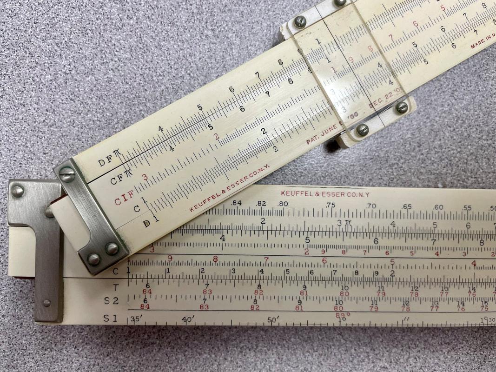

Delamination at the edges, as shown with the 4088-1 and 4090-3 rules in my collection. If this was happening shortly after they were produced, then the 1952 shift away from lamination of the entire edge of the rule would make sense. It may not affect the rule functionally, but it isn't good for the overall aesthetic.

At this time, I cannot give a solid reason as to why K&E would go to edge laminations outside of the notion that, perhaps, they felt customers would want it that way. Or perhaps they just felt it was more aesthetically pleasing? Or perhaps, with competitor rules like Dietzgen and Post/Hemmi offering complete celluloid-covered wooden rules, they felt some external pressure as well?

Certainly it was not because they felt it necessary to move the serial number to the rule's edge. While this is something they did with the edge-lamination, they could have continued that practice when they shifted to the inlays, where instead they used the last three digits of the serial number on the faces of both rails near the ends, as well as on the slide. Labeling both in this manner assures that the rails and slides are well-mated during production.

There is some notion that covering around the entire slide rule would prevent seasonal movements of the underlying mahogany, but mahogany is more stable in this regard than most hardwoods (a reason it's used in guitar necks) and edge grain of the wood is less prone to expansion or contraction than the face were it not laminated. However, I do have some duplex rules in my collection that do show a slight lack of uniformity in rail/slide alignment over eons of time - or even a slight cupping in the edges of a stator/rail. So it does exist, but the amount at which that becomes objectionable is debatable since any expansion would be latitudinal and not in the direction of the scales themselves.

This could have been a concern of K&E's, at which point the company could have taken a "better be safe than sorry" approach. This notion would support the incorporation of the edge inlay in 1952, as perhaps they did not feel it was necessary any longer? But more than likely it was because the new inlay design would prevent delamination at the face/edge join of the rule, which is something that many rules of the time did indeed experience.

Verdict? K&E likely felt edge-lamination was desirable and practical for all the reasons I mentioned. But these were also aspects of their duplex rules that could be sacrificed if unsightly delamination of the celluloid became a bigger issue.

This is especially true when the 68-1xxx designations came in 1962, the same year the Deci-Lon was introduced. The 10" 4080-3 would be rebranded as the 68-1318, the 10" 4081-3 became the 68-1210, the 20" 4080-5 relabeled the 68-1308, and the 20" 4081-5 shifted to the 68-1200. These would be the designations on the rule, though the catalog numbers would show more 68-1XXX numbers depending on the case accessory. [sigh]

To illustrate the headache of the 68-XXXX numbers, there were three separate catalog numbers for the 10" Deci-Trig model. 68-1220 designated the rule with the synthetic leather case, 68-1215 for the real leather, chamois-lined case option, and 68-1210 for a version packaged with both the nicer case AND a hard-back user manual.

The 20" 4080-5 regular trig model would be discontinued first, after 1966, which should tell you something about which rule was more in demand between it and the 4081-5 Deci-Trig model, which would endure until 1972. Same story with the 10" models, as the 4080-3 version would end after 1967, outlasted by the 4081-3, also lasting through 1972.

Afterword (8/17/2024): With the discovery of the 1968 pricing, a few observations can be added. The remaining two Deci-Trig rules came at a price of $33.75 for the 10" version and $70.00 for the 20", these with the basic case. This 20" rule, at $76.50 with the real leather case, would be the most expensive rule offered by K&E, even more pricey than the 4083-5 (68-1424) Log Log Vector rule ($66.50 for synthetic case option) which had always been the highest cost K&E slide rule. But no longer. Interestingly, and to my amusement, both rules would be more costly than the 6.5 ft. long Deci-Lon demonstration rule (68-1929), which remained $60. How much is $76.50 today in 1968 money? How does $692 sound?

The change for the rules - from 4090/91 to 4080/81 - was well received. Adolph Keuffel voiced this once again in court during the K&E vs. Pickett lawsuit in 1949, stating that they viewed the new invention as a "solution" to a "problem" concerning the 4090/4091 rule. Keuffel met with the professors and Admiral Hewitt in 1935, head of the U.S. Naval Academy, to discuss the rule, as was introduced to Keuffel by a letter the Admiral had sent. Hewitt was desirous of having the new model available to his new cadet class of 1936. Keuffel states in his testimony that he took charge to make that happen, completely converting a production line over to it. When asked by the court if that was a usual practice for them when they learned of a new potential product, Keuffel admits that it is "very unusual." (Transcript, K&E vs. Pickett, p. 313)

It is said that this new series of Log Log Trig and Deci-Trig rules became not only K&E's top seller but was, historically, the top selling slide rule of all time, regardless of maker - considered by many the "standard bearer" of slide rules. It leaves us to hope that K&E compensated Kells, Kearn, and Bland really well for the design!

And I can easily see why this slide rule was successful. The front side scales reverted almost identically to the excellent 4092 model, placing the trig scales back on the slide while also squeezing in a CI scale for good measure. This alone would have been good enough. But the back side of the rule would also show improvements. The full scale set is as follows:

Front side: L, LL1, DF [CF, CIF, CI, C] D, LL3, LL2
Back side: LL0, LL00, A [B, T, ST, S] D, DI, K

First, the "ST" scale arrives at the first K&E slide rule. As mentioned earlier, instead of an {S1, S2, T} set of trig scales, having {S, ST, T} just makes more sense from the perspective of what the ST can do, namely to give functionality to sine and tangent equally. And it also puts these scales back on the slide, read off of the C and D scales directly below. This was unlike the Model 4092 Log Log Duplex, which referenced the trig scales off of the A and B scales, a difference actually noted within the newer patent by the professors, and as such, was the reason for the patent.

These K&E duplex rules provide some nice added functionality. The LL00 extends the LL0 scale, splitting exponential bases between 0 and 1 into two scales to give another significant figure worth of precision. In this implementation, LL0 is extremely accurate now, covering only bases from .999 down to .905, while LL00 handles .905 to 0. The added DI scale inverts the D scale across the rule, nice for a variety of general math uses.

Moreover, the organization of the log-log scales is nice, with scales for bases greater than one on the front side of the rule, and scales for bases between 0 and 1 on the back side. It's really a good design and, as mentioned when I introduced the Log Log Family of rules, the Model 4081-3, in particular, would become a "standard" rule by which others could be compared.

At this point, there would be nothing new in terms of construction of these rules, as most all duplex rules of this era remain 4cm wide, with celluloid covered mahogany, engine-divided, and sporting the same "New Improved Cursor" as most 1936-and-greater rules would have. Not all is great, however, from the standpoint of the collector, as cursors of this era suffer from the KERCs-infestation. Thus, while great rules, many of these models can be hard to find with a good cursor (I bought two 4081-3 models before finding a good one).

Because this rule in either Trig or Deci-Trig version was so successful at the time, both the 10" and 20" 4092 models would be discontinued two years later. In dropping those rules, 20" versions would arrive in 1939. These rules, the Model 4080-5 Log Log Duplex Trig and Model 4081-5 Log Log Duplex Deci-Trig, were introduced at the price of $25.30 each, or $27 for the chamois-lined leather case. As such, these 4080/4081 series rules, in all lengths, became the true functional successor of the Model 4092 series, something that the 4090/4091 abominations failed to do.

Nothing would change with the 4080/4081 until 1947 - at a 30% to 50% price increase for almost all of K&E's rules - when all versions of this rule in both -3 and -5 varieties would take on the N-prefix with majorly revised scales. The objective of the change would be to alter the red LL scales (those with bases less than 1) so that they too could be referenced off of the C and D scales. This had two desired effects in that now 1) all scales on the entire rule could be consistently referenced off of C/D and 2) the single decade aspect of C/D allowed the previous LL00 scale (running from 0 to .91) to be split into two higher resolution scales named LL02 and LL03 on this rule. As such, the new rule grows from five log log scales to six. To accommodate the change, the DI scale was removed from the rule.

As such, the new N4080 and N4081 rules of 1947 would have scales as follows:

Front Side: LL02, LL03, DF [CF, CIF, CI, C] D, LL3, LL2
Back Side: LL01, K, A [B, T, ST, S] D, L, LL1

I find it interesting that this change necessitated a new patent, assigned in 1947 to only James Bland. This U.S. patent number 2,422,649 would be known as the "Bland Invention," referenced as such in the later product manuals written by the trio. Yet, like the patent for the original 4080/4081 design, this too would be assigned to K&E under patent agreement.

So, as summary, the original 2,170,144 patent by Kells, Kearn, and Bland assigned the trig scales to the C/D scales, and this second 2,422,649 patent, by Bland alone, followed suit with the log log scales.

It's with this configuration of scales that the 4080/4081 model line would dominate the "slide rule era" of the 50s and 60s, except for one minor change in 1954 where K&E would relocate the L scale to the back-top rail above the K scale and add the DI scale to the back-bottom rail, as in the original version of the rule. K&E did drop the N-prefix from the rule with that change, but I feel it was a response to match "N-less" model numbers with the new all-plastic version of this rule, the 4181-3, that was likely introduced a year or two prior. If you are curious, K&E did change the wood models in 1956, relabeling the ST scale to the "SRT" scale, matching the scale set of that plastic rule.

Their rules would continue being produced through the modern era, advertised as their "highest grade" slide rules in order to differentiate them from the new all-plastic rules. But it's important to note that when those rules DID arrive with the same functionality in the 9081/4181 for a substantial price savings, there's no question that the 4080/4081 would lose some share of the market in this category.

### The Doric N9081-3 Model

This Doric model, introduced in 1948 and appearing in the 1949 catalog as one of the three members of the Doric family, was an exact conversion of the Model 4081-3 scales into a plastic rule. Interesting to me, there was no "N9080-3" version of this same Doric rule. We could make a judgment about the Trig vs. Deci-Trig choices being made during this era of slide rules. K&E's own choice of the "decimal degree" version of the rule instead of the DMS version likely demonstrates which version was the best seller. As such, the Model N4081-3 Deci-Trig was deserving of being rewarded a doppelganger rule.

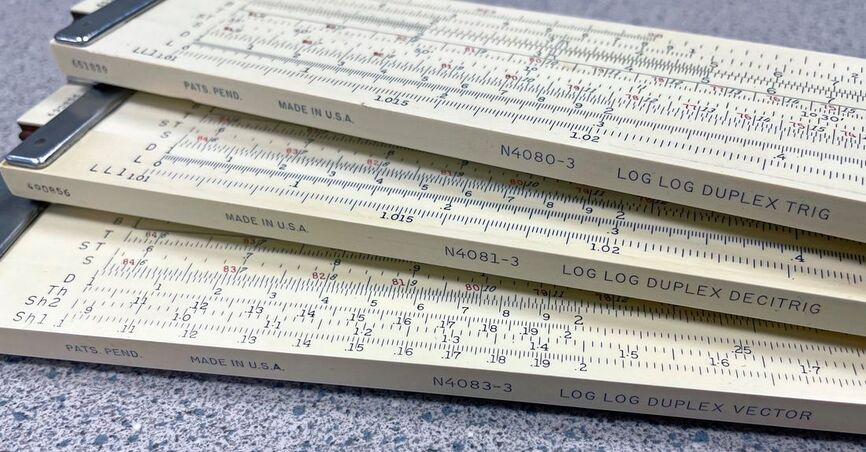

From the collection - neophytes to K&E rules need time to learn the differences in models. Here we see the two "log-log" models, both in degree/minute trig and in decimal trig form, as well as the "vector" rule, bottom, to be discussed in the next section. Note the differences in scales here. Quick tip: sometimes it's difficult to detect what model is being sold on eBay if the seller doesn't post a model number, but the faster you learn the scales for particular models, the better you can identify the rules in that setting. I've gotten the jump on some rather nice, inexpensive rules by recognizing what they are when the pictures seem lacking in detail.

The Doric N9081-3 was excellent in most every regard, albeit a little spartan and less impressive than the flagship wooden rule that it copied, as were all of these "Doric" rules. It is understandable why K&E wouldn't want to replace the 4080 and 4081 models as they had become part of the fabric of the company itself. But as we will talk about with the Modern Duplex rules, the opportunity to offer a similar rule at a lower price point would prove to be the reason why this Doric rule appeared in the first place. In this case, the 1948 catalog price for the N9081-3 rule was $12.00, which saved $8.50 over the mahogany version. Remember, this is for a complete, functionally equivalent rule to the company's most successful slide rule to date. If a customer couldn't afford more than $20 for the celluloid-covered mahogany rule (equivalent to more than $250 in 2023 dollars), then they would have thought the all-plastic version ($150 in 2023 dollars) was a godsend. These savings represented by all of the Doric rules signaled the transition to all-plastic construction; a harbinger of the future.

This N9081-3 rule (along with the Doric 9071-3 Log Log Duplex) served somewhat as a proof-of-concept, albeit K&E was certainly comfortable enough with the product to offer it for public sale rather than to classify it as a prototype slide rule. Why exactly that is the case is curious? But I think it is rather obvious that this Doric rule offered an opportunity to test the market with two functionally identical slide rules of two vastly different forms. This rule, and the 9071-3, were unique in that none of the other Doric rules had a direct wooden analogue, and thus there was something to be learned by offering both rules for public sale simultaneously. This data would give them valuable knowledge of how to proceed once the inevitable did happen - the shift to mostly all-plastic slide rules in the coming decades. Could K&E continue to sell wooden rules after the all-plastic rules entered the picture? Would customers view the company as compromising their own legacy of making well-made, elegant, top-of-the-line American slide rules?

Of course the 9071-3 Doric quickly disappeared with no modern plastic version, so it was this N9081-3 rule that demonstrated that the best selling and highly-regarded Model 4080 or 4081 made of mahogany could be replicated as a functioning replacement, and even be sold at the same time. While the Doric rule would give way to a better version 3 years later, these rules would be sold alongside the wooden version until the end of the slide rule era.

Notwithstanding, history would show that the N9081-3 rule was very much transitional, but an important slide rule historically. Its replacement, the Model 4181-3, would become the first "Modern Duplex" rule for the company. It will be discussed fully in that section.

## Collector's Outlook: Double-sided, Duplex-Type K&E rules

Note: Suggested prices are for slide with case on eBay. I don't include shipping in these estimates. Any extras, especially those considered complete, with box and documentation, can double these prices.

Our writing here spends an enormous amount of effort describing the Duplex Family of slide rules. It would be nice to collect them all, if only to hold on to some of the most delightful slide rules ever made. For me, that is what defines something as collectible. But I suspect that most people only care if something has monetary value.

And while all rules are interesting, most of them can be found for $15 to $30. This includes all of the Polyphase Duplex, Log Log Duplex, and Log Log Vector families of rules. So any of the 4088, 4092, 4080/81, and 4083 models (and their derivatives) are plentiful on eBay. It should be noted once again that finding a good sample with an intact cursor can be challenging. A nice, clean selection, especially with box and documentation, should be in the $40 to $60 range.

Among the Modern Duplex family, two rules come to mind as being of value. The first is the K&E Analon slide rule, which was produced only during one production year in limited number. It is somewhat of a "holy grail" item for collectors and will cost in excess of $300 to $400 on the open market. The price goes higher if NIB (new in box) with hard-bound instructional guide. The second rule of value is the 5" Deci-Lon 5, Model 68-1130. It will cost upwards of $130 to $150 or more. It should, as it's likely the best pocket rule ever made. The bigger 10" version, Model 68-1100 Deci-Lon 10, has some variance here. I possess seven samples of this rule and never paid more than $30 for any of them, but I've seen some go on eBay for as high as $250 in a bidding war - for no known reason other than the completeness of the NIB package.

The real valuable rules are from the original Duplex Family, especially the earlier William Cox rules of the Model 1744 varieties made prior to 1901. These rules will run well over $500, usually well over, during their quinquennial appearance on eBay. The best opportunity to purchase one is as part of a bundle that isn't specifically named in the description, where only a small picture catches an eagle-eyed lurker's eye at the chisel-type cursor. But even then, expect a bidding war.

The follow-up series, the 4071-type models (not the newer Polyphase Trig and Deci-Trig remakes), can be tremendously valuable. Recall that these items were produced between 1901 and 1916 across no fewer than 20 different models, as K&E struggled to figure out what rules to actually offer. For this reason, some of these rules have never been seen, while others are no more frequent than "yearly."

Compounding the issue is those rules that came with dual slides or in many different configurations, since it remains unclear how available they actually were. For example, while the 1906 to 1909 versions of the 16" 4083 and 20" 4087 are rare enough - they are found occasionally for hundreds of dollars - each of those rules came in three other configurations with distinct catalog numbers. So if those other variations exist, finding them becomes complicated.

The same can be said about the 5", 8", and 10" versions too, especially when slide and cursor options were considered. Speaking of which, those rules that shipped with two slides, it is rare to find a sample for purchase that still has both slides. And, likewise, we must keep in mind that many of these models were still marketed with the option for metal chisel-style cursors, even after 1906. But as we know, these types of indicators were being phased out of the K&E lineup at that time; people simply weren't buying rules with chisel cursors anymore.

So, it is unlikely that we will ever cross paths with many of these selections, but if we did they'd likely be priced well out of reach of most collectors. The 4061, 4065, 4070, and 4071 models, in both the normal and "T" (trig) versions, will be the most common among this family of rules, but still very rare. I would expect prices in the $100 to $200 range for the yearly appearance on eBay. The longer rules, the 4083 and 4087 models, will be in excess of $200, and on a much more rare basis.

Also, because of the infrequency of these rules coming up for sale, the reader should keep in mind that this seems to be my general observation only, as too few of these rules have resurfaced to provide a good statistical sampling in regards to price. So expect variance here.

Ultimately, as with many highly desired rules, stumbling upon one at an estate sale might be the best way to acquire any of the pre-1916 K&E duplex slide rules.

## Log Log Vector Duplex Family

This was very much a special purpose slide rule and from that standpoint could be talked about among the Specialty Rules, but staying true to the ISRM's K&E Model Map, we will discuss it here with the other duplex rules.

This history of the origin of the Log Log Vector Duplex is most unique among all other K&E slide rules. Being a scale set licensed from an individual, there would be decades of negotiations, disagreements, and even a lawsuit over royalties and breach of contract. (Credit to William K. Robinson for his study on the subject. Much of our understanding comes from this research.)

But what must be said is that the introduction of a Log Log Vector Duplex rule in 1929 was an important development for K&E, not so much because it was necessarily a great seller, but rather what it could do was quite remarkable. The ability to read hyperbolic functions on a slide rule was nothing new, but the scale set, developed and patented in 1924 by A.F. Puchstein, could compute hyperbolic functions on the complex number plane, a task at which electrical engineers and students would find extremely useful. Secondarily, the user could easily convert these functions between rectangular and polar coordinates, a useful feature for a variety of vector operations. Doing all of this required both hyperbolic trig and standard trig scales on the same rule, since the computations always require a combination of both scales.

Professor M.P. Weinbach of the University of Missouri, working with Puchstein, promoted the slide rule to K&E beginning as early as 1925, but a contract would not be reached for several years. In this arrangement, Weinbach would pay Puchstein 1/5 of the royalties received from the rule. The partners would hold exclusive royalty rights from the rule's first production in 1929 until 1947. This meant that for 18 years, K&E would not have competition in this market from other makers. Afterwards, Hemmi's Model 255 arrived after WWII and could solve hyperbolic trig functions directly, but it was obviously limited in the States. By 1948, the Pickett Model 4 and Dietzgen Model 1735, both of which had hyperbolic scales, finally challenged K&E for market share.

In all, two vector models would be produced by K&E spanning the 43 years in which the Log Log Vector rule was offered.

### The Model 4093 Log Log Vector Duplex

Introduced in October 1929 after being on the drawing board for nearly two years, K&E introduced the Model 4093-3 Log Log Vector Duplex. The rule was constructed much like all other duplex rules of the era, with celluloid-laminated mahogany construction and with frameless glass indicator. The rule featured the circular K&E logo on the upper right stator and patent notifications on the lower right stator. Upon introduction, the scale set was as follows:

Front side: L LL0 DF [CF B CI C] D LL3 LL2
Rear side: Sh1 Sh2 Th [SI1 SI2 TI] D S T

For the uninitiated, the front scale set will look as familiar as any Log Log slide rule, bearing some similarity to the Model 4092. However, the rear of the rule would be like nothing seen before. An engineer would have recognized the utility immediately, where the only scale on the rear of the rule that is NOT a trig scale is the D scale. The top stator, with Sh1, Sh2, and Th scales, are the hyperbolic sine and hyperbolic tangent scales. The slide had extended sine scales for small angle trig, like the 4090/4091 that would come 4 years later, but in this case, these scales are inverted. And a normal sine and tangent scale are below the D scale on the lower stator.

An important characteristic, being very much a rule designed by electrical engineers FOR electrical engineers, is that the trigonometry on this rule is all in decimal degrees. As such, this is the first K&E slide rule to use decimal degrees instead of DMS measures, even prior to the first "Deci-Trig" rule, the 4091-3 Log Log Duplex, which would arrive three years after. The instruction manual, written by Weinbach himself, supplemented the rule.

In short, after much debate with K&E about the design of this slide rule, Weinbach got exactly the rule he wanted to produce almost six years after his scale set was first patented. Upon introduction in 1929, the 4093-3 was $16, or $16.85 for the nicer leather case version. This was $6 more than the Model N4092 Log Log Duplex, just as reference. K&E would drop the price to $12 by 1932. According to Robinson, Weinbach's royalty was 5% per slide rule.

A long-scale 20" version, the Model 4093-5 Log Log Vector Duplex, was added in 1931. Pricing of this rule made it the most expensive offering among all K&E slide rules, priced at $32 ($33.50 for the good leather). Of course this is a serious premium for the superior resolution rule. And it would stay that way, rising to $35 by the 1938 price list. This made the 4093-5 K&E's most expensive slide rule by at least 25%, even outpricing the expensive specialty rules, such as the N4096 Desk rule and the 4102 Surveyor's Duplex that we will discuss in the next chapter. Needless to say, K&E must have felt they would sell at that hefty price.

I mentioned some degree of contention between Weinbach and K&E that would eventually lead to a lawsuit in 1944. The initial conflict actually started with the Model 4091 Log Log Duplex Deci-Trig, first produced in 1932. Weinbach did not like the idea that K&E was producing another decimal trig rule, which at that point was a feature exclusive to his Vector rule, as was the extended sine scales. His concern, somewhat unfounded, was that engineers and students would forgo the more expensive Vector rule for the new 4091 Deci-Trig. Of course, K&E felt the concerns were unfounded as well. Their argument was that what made Weinbach's rule unique was the ability to do complex hyperbolic trig problems, and not necessarily have the monopoly on standard trig problems in decimal degrees. However, this could be the impetus for K&E to change to an ST trig scale when the 4090/4091 rules were upgraded to the 4080/4081 models 4 years later.

This did not make Weinbach waver in his position though. Although K&E would dispense with the extended sine scales for the 4080/4081 series upgrades, Weinbach also felt that he was owed a royalty for 4 years of the 4091 Deci-Trig for using mostly identical scales to his rule. In Weinbach's own notes, he mentioned that since K&E was using decimally-divided trig scales in the Deci-Trig rule (half of all his copyrighted trig scales of the Vector rule), that K&E should pay him half-royalties akin to the Vector rule contract, or 2.5% per rule (Robinson, pp. 21 & 22). According to Robinson, K&E would not concede on the Deci-Trig, but would offer to make the minimum annual royalty payments for their own rules $650 beginning in 1934, which did not seem to appease Weinbach despite only making around $250 on average the previous 4 years. In the middle of the Great Depression, and being guaranteed the price of an average car each year, I'm inclined to think Weinbach might have been standing too much on principle.

However, he would be worn down by the end of the year and conceded to the agreement in December 1934. K&E, not completely philanthropic as they tried to appear, did want Weinbach to agree in writing to the loosely held termination date of their royalty agreement in 1947.

The parties, according to Robinson, would be mostly silent for 4 years. But in May 1938, Weinbach decided to contact K&E about a new idea for a slide rule. He was disappointed to be turned down, but there was a "bright side" to the letter. He was informed that K&E wanted to update the 4093 with a major scale revision and asked for Weinbach to give input. He was sent a prototype rule to evaluate and was asked if he would update the instruction manual in light of the new rules, which would be called the Model 4083-3 Log Log Duplex Vector (note the switch of "Vector" and "Duplex" within the 4093 name).

Weinbach loved the new design, submitted a couple of minor suggestions, and updated the manual extensively to provide more examples to demonstrate the increased capabilities of the new rule.

### The Model 4083 Log Log Duplex Vector

The quality that Weinbach loved most about the new version of his rule was that it would improve the scale set to make it more capable in a general math sense. He saw this rule as one that non-engineers might actually buy, and any opportunity to cut into the sales of the Deci-Trig was favorable to him.

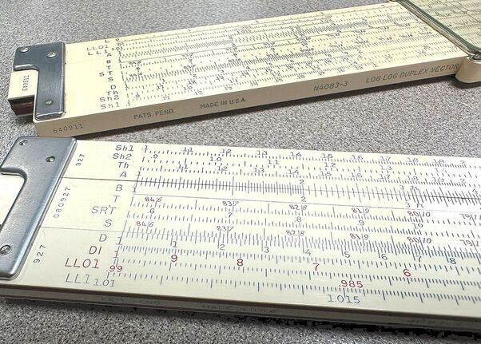

Two of the Log Log Duplex Vector rules in my collection. The lower 10" rule was likely made just before the move to inlayed celluloid edge in 1952. The upper 20" version shows a serial number placing it right around 1962. This slide rule came in a 68-1424 box with a blue/green case, which is the synthetic leather version.

The Model 4083-3 Log Log Duplex Vector went into production mid-1939 at a cost of $13, or $14 with the case upgrade. Interestingly, a 20" Model 4083-5 would be made ready with the roll-out as well, not something that K&E was always ready to do with their non-standard sized slide rules.

Of note, K&E asked Weinbach for approval of a price decrease for the larger rule. According to K&E, the rule could be discounted $5 because the new scale set required much less machine setup as compared to the old rule. Weinbach approved. The Model 4083-5 would be priced at $30, or $31.70 for the plush leather case.

As for the new scale set:

Front side: L, LL1, DF [CF, CIF, CI, C] D, LL3, LL2
Back side: LL00, LL0, A [B, T, ST, S] D, TH, Sh2, Sh1

The obvious change is the replacement of the SI1, SI2, and TI scales with non-inverted T, ST, and S scales. Being functionally the same, the new standard trig scales are borrowed from the 4080/4081 rules and would become commonplace for all future K&E rules. The hyperbolic trig scales were moved to the bottom rail to make room for an A scale, which the earlier rule lacked. So easy squares/roots could be calculated, as well as basic multiplication and division on the back side of the rule without need to flip the rule over for hyperbolic trig functions. This general math enhancement, as well as the improvements to the log log scales, are what excited Weinbach about the new rule.

With the relationship seemingly repaired, Weinbach easily made money beyond the $625 guaranteed minimum royalty, something that happened for the first time in 1936 with the 4093 version of the rule as the economy was leaving the Great Depression. By 1940, the new 4083 would earn double those royalties for Weinbach, where Robinson estimates in his writing that maybe 3000 rules were being sold on average between 1939 and 1942.

It's at this point, in 1943, when the relationship goes bad between Weinbach and K&E, under very strange circumstances. I spare you the narrative of everything here and point you to the Robinson paper, but a condensed version of the story is enlightening.

Weinbach received a visit by a couple of gentlemen in 1943, presumed to be from K&E (according to Weinbach's later statements). The gentlemen inquired about the copyright of the rule, what the contract between him and K&E looked like, and when the agreement would end. Weinbach offered the information freely, without too much worry about it. Promising to reveal their associations later (something that would never be stated explicitly), the two gentlemen were certainly from a competitor, likely looking for information as to when their own company could freely produce a Vector rule of their own. Shortly thereafter, Weinbach revealed to K&E, in casual conversation, the happenings within that meeting, whereas K&E immediately stopped royalty payments on their contract. While not obvious to Weinbach - this shows a naivety that I find surprising - it was certainly quite obvious to K&E that Weinbach had erred, having broken his non-disclosure agreement with their competition.

## Sidebar: The New "Unbreakable" Indicator

Yet another new feature being applied to K&E slide rules of a variety of types was something they called the "unbreakable" indicator, appearing first described in the 1953 Educational Product Catalog with their pocket rules. This new cursor design would use a clear plastic window replacing the glass in their normal "improved" indicator.

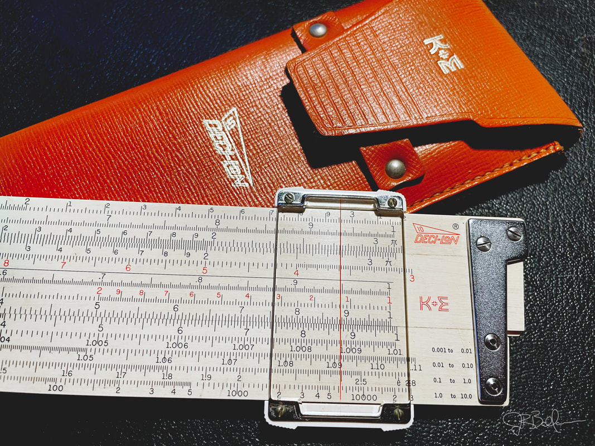

Introduced in 1962, despite not being their "highest quality" rule, the Deci-Lon 10 (68-1100) would go down as their best, most powerful rule. Of interest here is the clear "unbreakable" cursor, a feature introduced in 1954 on all K&E rules except for their "highest quality" wooden duplex rules. By 1962, K&E would use it on all their slide rules.

From that point forward, in addition to their pocket slide rules, it would be applied to many others, including the new 4181-3 Log Log Deci-Trig, their classic 4053 Polyphase Mannheim, the Merchant's rules, and the 4058 Beginner's rules. It was not considered as luxuriously appointed as their improved glass cursors and so it was not applied to their top-end duplex rules, at least not early on.

This was not the first attempt at an all-plastic cursor by K&E. Their first Ever-There rules were equipped with an all-plastic cursor based on the same transparent Xylonite used in their drafting triangles and protractors. Prior to that, in the early decades of the century, the same type of indicator would be used on their Model 4058 Student's rules. While good transparency is less important with such tools, it's obviously important for slide rules, and therefore use of the clear Xylonite was short lived. The clear material would become increasingly yellow over time with exposure to UV light. K&E would supply these rules with the improved glass cursors, first around the 1920s with the Student's series and then in 1936 with the introduction of the new Ever-There lineup.

Of course, by the mid-50s, suitable materials for highly functional transparent cursors were plentiful, so swapping out the glass windows began to occur across all slide rule models, culminating with the "unbreakable indicator" described above for all slide rules by the end of the slide rule era.

So what clear plastic was in use here? My guess would be acrylic, which polishes very clear and naturally resists UV light, thus remaining clear over time.

As a consequence, and through a chance run-in with an old friend who happened to be a patent attorney, Weinbach decided to file suit against K&E, not only for breach of contract for withholding the royalties, but also to sue for back-royalty payments for all the Deci-Trig sales over the previous decade. Weinbach never let go of the idea that K&E was making money off of his technology without compensation. Robinson estimates the total profit loss to Weinbach was around $190,000, which was a very large amount of money at that time. Of course that figure comes from the fact that the Model 4081 Deci-Trig, which Weinbach claimed also used his decimal-based trig scales, had become their best seller and would remain so for decades later. This estimate also falls in line with the damages claimed in court documents.

The story does not end well for Weinbach. Although his agreement was to end in 1947, the number of sales of the Vector rule increased massively with the return of American soldiers after the war - Weinbach stated himself that enrollment in his university program tripled in 1945 - and therefore he would miss out on his large royalty payments, which would have likely matched his salary from his job. That same year, Weinbach lost his wife, as well as suffered from health problems that would put him in the hospital for lengths of time.

K&E, surprised by the lawsuit, responded with every delay tactic they could, in a way which would greatly increase court costs for Weinbach, but also seek to win the battle by attrition. We know the lawsuit never went to trial. Robinson suggests that a settlement was reached, and through interviews he ascertained that Weinbach's portion of the settlement was likely around $10,000 (with a share going to Puchstein), which is a figure that likely replaces the lost royalties of his own slide rule. Weinbach would die himself mid-1946, with the original royalty agreement ending in 1947. Not coincidentally, both Pickett and Dietzgen would produce American rules that incorporated hyperbolic trig scales in 1948.

Author's Aside: I make no serious judgments about the conflict based on the limited sources we have, though the letters brought to light by Robinson do give me some general impressions about it. First, K&E was a big business, something easy to see here, and their only concern is the financial ledger. When I think of all the outsourced products in their entire catalog, the hundreds of contracts and dealings that K&E had made over 70+ years at that point, the significance of one man, one contract, meant very little to them. Second, I feel that Weinbach acted too often like a man with more resources than he actually had. Often naïve; often unappreciative; even sometimes greedy. Robinson estimates nearly 24,000 of his slide rules were sold between 1929 and 1943, with total royalties paid out to Weinbach at approximately $14,000; this, for a very niche product. Considering the economic era in which these events happened, Weinbach would have had a very comfortable and meaningful life as a college professor. As a professional educator myself, I would consider myself having the perfect career if I were making another 25% to 50% extra income and the satisfaction of having my intellectual property out there as a service to others.

This, of course, was not the end of the Model 4083 Log Log Duplex Vector. 1948 would also signal a redesign of the 4083. Adding the N-prefix to both 10" and 20" models, the rule would shift around the log log scales and add another. It would also move all notations on the rule's front onto the top edge of the slide rule.

Note: We have no price lists between 1944 and 1947. The 1947 catalog shows a substantial price increase to most K&E slide rules, especially with their duplex families of rules. The price of the 4083-3 (basic case) slide rule jumped from $13.50 in 1944 to $20 in 1947 and again to $22.50 in 1948 for the new N4083-3 model. The 20" version would jump from $31.50 to $48.50 over that same time frame. Even the nice leather case (an option that puts an "S" suffix on the model number) would cost an extra $3 and $5 for the 10" and 20" upgrades respectively. While I'm not an expert economist, nor an expert on the post-World-War-2 era, I would find further study of this inflation intriguing.

Like the rest of the K&E duplexes, the N4083 models would also shift to the inlaid celluloid edge and stylized K&E red logo in 1952, accompanied by another $2 price hike as well.

Another major change to the scale set would occur in 1954, significant enough to drop the N-prefix from the models. As you might recall, all of the Log Log rules (both Duplex and Vector families) dropped the N-prefix that year, which I speculated earlier might have been because of the new 4181-3 introduction of the Ivorite rule that lacked the "N," where K&E revamped the Log Log Duplex rules to match its scale set.

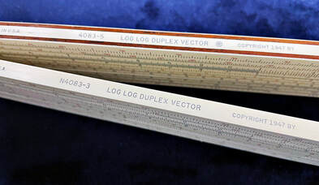

Here we see the scale set change and the removal of the N-prefix on the vector rule. Sh1, Sh2, and Th are the scales that reveal the vector nature of the rule. These scales get swapped to the upper stator rail in 1954, with the SRT scale arriving in 1955. The lower rule dates to 1956, showing both changes.

In the case of the Vector rule, the scales were shifted to place the Sh1, Sh2, and Th scales at the top of the back stator rail. The L scale was removed and a DI scale added below the D scale. New green cover manuals would also come that year (for all their rules), with an additional 8-page supplement to support the new DI scale.

The following year, in 1955, the ST scale would be relabeled the SRT scale, with no other changes to the rule. It would be packaged with a 6-page supplement to the manual describing SRT functionality.

The typical 1962 renaming of the model numbers occurred, with 68-1439 assigned to the 4083-3 and 68-1434 assigned to the 4083-3S (upgraded leather). New numbers for the 4083-5 and 4083-5S are 68-1429 and 68-1424 respectively. No changes to the rule otherwise. Prices are $26.50/$29.50 for the 10" rules and $59.50/$65.50 for the 20" rules in the 1962 price list.

The 20" Vector rule would disappear in the 1967 catalog, with the 10" disappearing from the 1972 catalog. A long run for a very good, versatile slide rule with the most interesting of histories!

## Modern Duplex Family

By the 1950s, leading high-end slide rule makers of the age, especially Faber-Castell and Aristo (Dennert & Pape) with their beautiful plastic rules and Pickett with their metallic rules, had transitioned successfully to more advanced materials and construction. Keuffel & Esser would do the same. But unlike the other makers (except maybe Hemmi in Japan), K&E would keep the wooden rules around out of tradition, legacy, customer expectations, and cachet. It is not, after all, like the wooden rules were somehow made lesser by the plastic revolution. They are as they always were, long-lasting, powerful, and beautiful tools. Like Hemmi, it would be difficult to let such rules die even though their all-plastic rules were undoubtedly more cost effective.

But by this point, wooden rules were not high profit items. And for K&E, it is debatable if they ever were. Wooden rules, from the first day, were costly to build, especially in smaller sizes where the labor hours were mostly the same regardless of the size of the rule. This meant lower profit margins for wooden pocket rules and fewer customers that saw value in them. Many that K&E did produce over time, particularly the pocket versions (e.g. Models 4031, 4053-2, and 4088-1), would likely have been sold nearly at cost, just so they could fill market expectations.

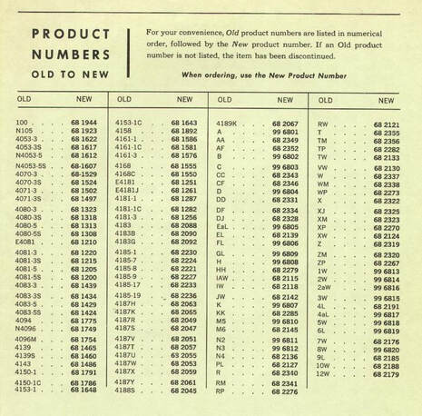

Because the new 68-1XXX model number convention of 1962 lacked all manner of intuition, K&E helped customers out by publishing this conversion list in the 1962 catalog. Thanks a lot.

Author's Aside: This fact has led some to believe that slide rules were never a very profitable venture for K&E. I would disagree, instead choosing to say that some slide rules made them money while other ones did not. However, it is mentioned by Jack Burton, former VP of Marketing for K&E, that toward the end of the era, profit margins suffered due to the rejection rate of production rules and the company's life-time warranty. K&E, a victim of their own perfectionism, would reject most of the rules they made, as well as freely exchange rules with customers who had the slightest complaint, even when the rule was damaged, worn by typical use, or the customer couldn't adjust it themselves. Burton mentions that instead of arguing with customers, K&E instructed their distributors and stores not to argue and just replace the rule. It is estimated that as much as 50% of K&E's wooden slide rules would have warranty claims during Burton's run during the 60s and 70s (Journal of the Oughtred Society, Vol. 8, No. 2, Fall 1999, p. 28).

I will be talking about all of the following slide rules in rather glowing terms. These ABS plastic rules, made of "Ivorite," do not surrender capabilities and functionality when compared to their wooden brethren. In no way was the quality of the rules compromised despite being lower in cost to produce, as K&E made certain that the rules that can still be found today remain functional; a testimony not only to K&E's quality control but also the endurance of the materials and method of construction. How profitable they were depends on rejection rates and warranty replacements; but that said, the performance/value ratio of the Modern Duplex family of rules is off the chart.

K&E likely could have sold these rules at prices near (or above) their "highest quality" wooden duplex rules. Instead, as we saw with the Doric 9081-3 in the previous section, these prices would greatly undercut those wooden rules.

But before we discuss the several rules in this family, it's important to note that K&E was preparing for another rule to go into production in the 1970s known as the "Ke-Lon." Only a mockup prototype of this rule exists, but the Ke-Lon, prototyped on a Deci-Lon body, was essentially a Deci-Lon with three added scales for hyperbolic trig. All "Lon" scales would have moved to the front of the rule. The idea of this slide rule would have been to produce the "ultimate" slide rule in the sense of unifying all previous Duplex families into one flagship model. However, in my opinion, it would have been just for cachet only, impractical in the sense that few people would find the Vector functionality useful. But K&E did drop the Log Log Vector family completely in previous years, so perhaps it made sense to them to revisit it on this new proposed slide rule? No matter, K&E would be in worse financial trouble by the early to mid-70s, so this rule never really had a chance (see the Sidebar: The End of the Era later in this chapter).

But at least the slide rule market was still good for K&E in the 60s. So let's talk about these Modern era rules that DID find success, starting with the replacement to that aforementioned Doric N9081-3 slide rule that would signal the beginning of the new, all-plastic era.

### The Model 4181-3 Log Log Duplex Deci-Trig (Jet-Log)

In the 1952 catalog, K&E writes, "Nothing has been found to surpass the combination of selected, seasoned mahogany and xylonite, of which the famous highest quality K&E slide rules are made."

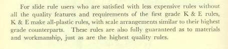

For slide rule users who are satisfied with less expensive rules without all the quality features and requirements of the first grade K&E rules, K&E make all-plastic rules, with scale arrangements similar to their highest grade counterparts. These rules are also fully guaranteed as to materials and workmanship, just as are the highest quality rules.

But if the real intent for the new plastic rules was not known, I think with a little more reading we see K&E's full plan. Product positioning is important. As I've tried to express through the article, any line of consumer goods needs to cover the gamut of possible consumer demand. Since the inception of their rules, K&E had struggled in trying to lessen the cost of their slide rules in order to meet a demand of the every-man. By the 1950s, we see the need for slide rules within the markets of the common person, chiefly to students and to workers at normal jobs, and to those who might find it convenient to keep another slide rule in their pockets. While they would still sell rules to engineers and builders, willing to spend the most for the best, K&E knew that if they could provide plastic rules for ~70% of the price of their "highest quality" rules, and if those rules were functionally equivalent, then they would have positioned all their products to maximize market share.

As such, the Model 4181-3 Log Log Duplex Deci-Trig, first introduced as a repackaged Doric N9081-3 in 1952, would prove to be one of K&E's most important rules. Priced initially at $15 in the 1952 catalog, compared to the $22.50 price of the N4080-3 and N4081-3 models, we can see the savings to be had with all-plastic production.

## Sidebar: A Little About Plastics

In a way, we've been talking about plastic construction the entire time. Celluloid is a bioplastic, produced from a cellulose substance (like cotton fibers), nitrated (with nitric acid), and then mixed with a plasticizer (like camphor). This was originally produced in the 1860s. It wasn't until 1907 when Bakelite, the first all-synthetic plastic, was formed.

Since then, most plastics begin with a fossil fuel and then are polymerized with a compound of substances, synthetically comprising the plastic being manufactured. For example, ABS is an emulsion of acrylonitrile (produced from propylene), a polymerizing butadiene, and styrene. This, and many other modern plastics, are thermoplastics, meaning that they can be melted, molded, formed, and even recycled to become something else.

As we talk about the modern K&E rules and their evolution to all-plastic construction, it should be expressed that the actual composition of plastic being used is never explicitly revealed. This would be true of the plastic industry as a whole. As plastic became more widely used, their composition and methods would have been proprietary from company to company. So as collectors of slide rules trying to understand their evolution, it can be confusing for us.

Our chief indicator is simply what slide rule manufacturers advertise them to be. Over the 40s and 50s, we see a transference of title from Xylonite to "plastic" to Ivorite in the K&E catalog descriptions. We know that the "Ivorite" copolymer is an Acrylonitrile Butadiene Styrene (ABS) resin, which has become standardized across industries for a variety of molded components and products ever since. And we know that "Xylonite," a name first given to celluloid types of compounds (plasticized nitrated cellulose), was a catch-all term used for a variety of celluloid-type evolutions for nearly a century prior.

Joseph Soper, who began a career at the K&E Salisbury plant in 1966, eventually becoming Plant manager, says in his book, *K&E Salisbury Products Division Slide Rules*, that the molded Cycolac ABS blanks were produced by a company called American Insulator. He states that all such slide rules were made of the resin in 1966 and that earlier molded rules would have been made from any of a variety of nitrocellulose-based compounds, likely because they found it difficult to find a place with enough capacity to produce the rules (Soper, p. 113).

As such, there would be variance between model lines up until the point at which they could agree on a compound, which probably had more to do with waiting for the plastic industry to catch up to the demand that K&E wanted to fill. As I speculated earlier in our discussion about the Doric rules, the very temporary aspect of that series could be explained in that K&E wasn't ready (or able) to settle on one consistent formula or supplier.

Soper confirms that, stating that the ABS resin was in limited use around the country in 1960. Interpretation of the word "limited" is obviously a matter of degree, so the question does arise, at what point prior to 1960 could K&E find the right supply? Regardless of timing, it does confirm for us that finally settling on a plastic would have been an evolutionary process. And with the Doric rules, they all lack a consistent look and feel, unlike the Modern Polyphase and Modern Duplex rules we discuss here.

For this author, lacking scientific methods for determining exact composition of the rules, the best I have to go by is the feel of the rule in my hands and the way that K&E decided to talk about them. From that standpoint, it would definitely seem that once K&E settled on the term "Ivorite" in their language use, then we are talking about slide rules of very similar ABS resin composition, in this case from the 4181-3 model up until the latest rules of the slide rule era (1975).

Shown in the September "Slide Rules" only revision of the 1955 catalog, the rule would be transformed from the familiar Doric N9081 characteristics to that which we would become more familiar with, dropping the N-prefix, dispensing with the Doric label, and adding red ink for the labels and the inverse scales. The catalog description for this rule (and the plastic pocket rules) states that "Ivorite" construction is used. We see this description also in an edited version of the preface that we saw in the previous 1952 catalog (see below). "Ivorite" is trademarked here, which might simply mean that K&E, while their rules were already transitioned to Ivorite with the Doric rules, could now be safely called what they wanted all along. They seem proud.

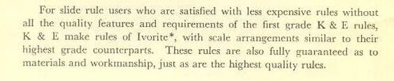

For slide rule users who are satisfied with less expensive rules without all the quality features and requirements of the first grade K&E rules, K&E make rules of Ivorite*, with scale arrangements similar to their highest grade counterparts. These rules are also fully guaranteed as to materials and workmanship, just as are the highest quality rules.

Judging between the N9081-3 and newer 4181-3 versions of this Log Log Duplex slide rule, they are slightly different in feel. The former seems heavier, stiffer, smoother, more glossy, and more square, and the latter would appear to be lighter, thinner, and more beveled. The color of my samples of these rules are slightly different, with the N9081-3 Doric retaining more of a pure white tone, though I would not make judgments about whether or not this is true across all samples of these rules. Regardless, they appear to use a slightly different plastic, both of which are leagues removed from the white Xylonite advertised by K&E as used in their Ever-There rules beginning in the early 1930s.

Of course, as talked about with the Doric rules and as we witness here, it becomes hard to find consensus in what the actual plastic composition is. My thoughts on this, and a little more about plastics in general, can be found in the Sidebar: A Little About Plastics above.

Scales for this rule were identical to the wooden 4081-3 rule, and would continue to adopt the same scale evolution as it also changed. The N4181-3 (9081 Doric) version of the rule was based on the 1947 Model 4081 scale set, with the newer 4181-3, described in the 1955 supplementary catalog, taking on the same revised, "non-N" 4081 scale set that moved the L scale to the top rail and put a DI scale on the bottom.

This new rule would be renamed the "Jet-Log" in 1960, referred to as such in a pocket slide rule brochure in that same year as the big brother of the Model 4181-1 "Jet-Log Jr.," a very important pocket rule that deserves its own discussion next. Two years later it would receive the Model 68-1251 designation. It would hang around until the end of the era, becoming the sole Deci-Trig option once all the wooden slide rules disappeared in the 1972 catalog. Despite filing for bankruptcy and ending all slide rule production that same year, the importance of this rule as K&E's lone successor of the long Log Log Duplex line demonstrates how good this rule had become. As the end of that line, I could have presented it entirely under the Log Log Duplex family of rules. But because of its new construction, I have slotted it into the Modern Duplex category.

### Model 4181-1 Pocket Log Log Deci-Trig (Jet-Log Jr.)

The pocket version of the 10" Model 4181-3, this 5" Model 4181-1, in many ways, became the more successful rule. This is largely because as a pocket rule, it is just really good!

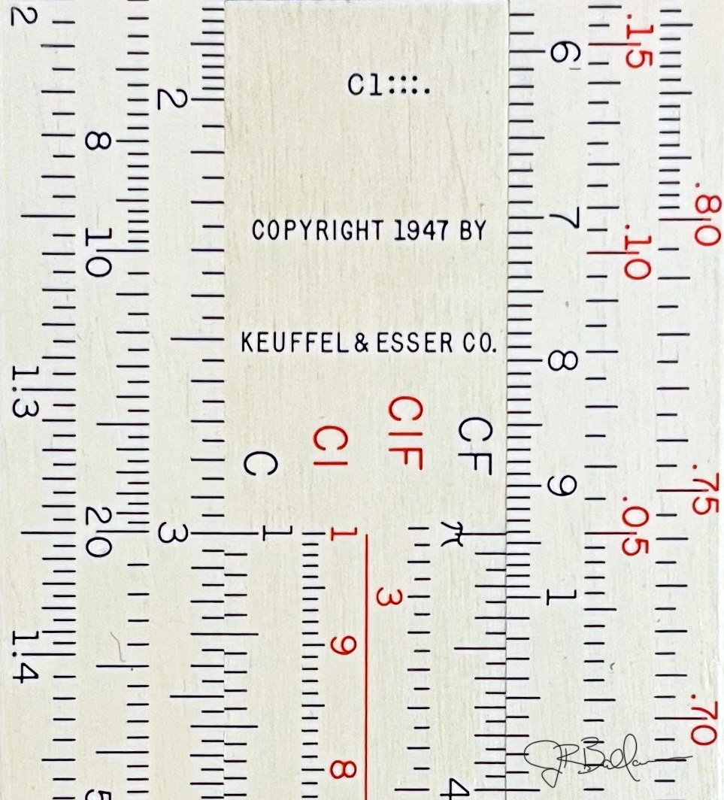

Like the big brother, the Doric version of it was described early on in the 1949 catalog. But unlike the 9081-3 Doric, the 9081-1 was never actually produced, at least not to our knowledge. It would come into production in finished form, described in the 1953 Educational Products Catalog, looking very much like a smaller 4181-3 (non-Doric version). (Note: The 4181-3 in that same catalog is described as the Doric version.) And by finished form, I mean complete with dual-color scales, red K&E logo, and unbreakable indicator. There is some indication from internet sources that the 4181-1 initially appeared without a model number on the rule; however, I have not seen this to be the case myself. This would also conflict with the aforementioned 1953 catalog, which is shown pictured with 4181-1 on the slide.

The scale set was the same as the 10" version, which made it the most powerful pocket slide rule upon its introduction, regardless of make. And it's for this reason that, from 1953 and a decade following, this rule would be K&E's chief competition against the powerful pocket rules being produced in the United States by Post (Pocket Versalog 1461 in 1957) and Pickett (Model 600 Magnesium introduced in the late 1940s). Priced at $9.25 for the synthetic leather sheath ($1 more for the upgraded leather case), as compared to $15 for the full-sized rule, I'm quite sure there were many consumers who saw the value in going straight to the pocket version of this rule.

Note: The Post Versalog 1461 would seem to be a response to K&E's excellent 4181-1 pocket rule, but it would come 4 or 5 years later. And as a celluloid-covered bamboo rule (by Hemmi), it was expensive to make, priced around $6 more than the K&E rule in 1962. However, there's an argument to be made that the competitive threat was coming from Pickett. Their Model 600 Pocket Log Log Duplex rule had been in production since the late 40s, and while it's not as powerful as K&E's rule (two fewer scales), it's very likely that K&E felt some sense of urgency, and that the 4181-1 was a response to that Pickett model. The magnesium Picketts were troublesome, which was common knowledge, but K&E wouldn't have viewed any time to spare. Pickett would replace the magnesium models with aluminum by the late 50s, and their new N600-ES rule would have been very much a competitor against the K&E 4181-1 during the entire decade of the 1960s.

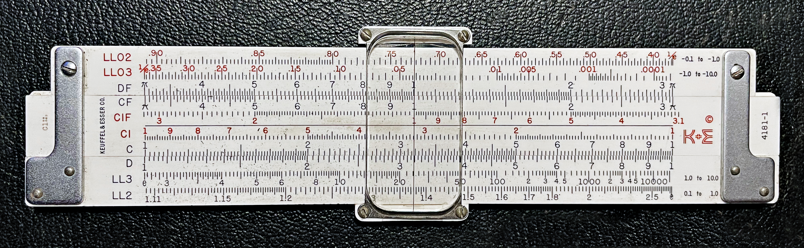

4181-1 Pocket Log Log Deci-Trig - Front

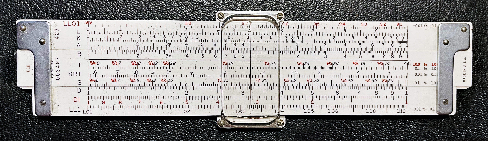

4181-1 Pocket Log Log Deci-Trig - Back

As mentioned earlier, 1960 would bring about a new marketing name for the 4181 rules, now referring to them collectively as the "Jet Log" series of rules. The 10" 4181-3 would be known as the Jet-Log and the 5" 4181-1 would be referred to as the Jet-Log Jr. Strangely, until 1962 when the rules would receive their 68-1XXX model designations, the version of the 4181-1 with the upgraded sheath (with leather-covered clip) would be listed as the E4181J. Even more strangely, only its successor, the 68-1251 with the upgraded leather case, would be called the Jet-Log Jr., with two lesser case options, the 68-1282 and 68-1287, known collectively as the "Deci-Trig Pocket" rules. These model numbers would not be printed on the actual slide rule.

In 1968, only the 68-1251 Jet-Log Jr. would be offered, along with the 10" Jet-Log, both outlasting the wooden rules in the Log Log Duplex family, as the classic 4080/4081 legacy wooden rules would be missing from the 1972 catalog.

I find it ironic that K&E would hang on as long as possible to their all-wooden rules, reminding consumers that those were their "highest quality" rules. In retrospect, it was an effort to convince customers that these expensive-to-produce slide rules were still worth the highest price in their product line. K&E seemed to soften from that in 1962, where the catalog became less descriptive and more matter of fact. By this time, unfortunately for the classic wooden rules, they would not be able to compete with Modern Duplex construction, high quality or otherwise. The Ivorite constructed rules would prove in the end to be cheaper to produce, and I think quite surprising to many, would still maintain a standard of quality deserving to become their "highest quality" of slide rule.

### The Model GP-12 (68-1565)

"GP," meaning "General Purpose," it is clear what K&E intended with this slide rule: to supply a higher-quality duplex rule than the K-12 Prep rule, with more capability, but not equating to a large price tag. The 1966 K&E catalog, the year it was introduced, clearly intends this toward general math/business/science applications. Note: The rule is marked with a 1964 copyright, so a 1966 introduction might not be totally accurate, lacking a 1964 or 1965 catalog.

Without knowing this upfront, it would be one of the most curious slide rules of the modern era in my estimation. It might still be. Regardless, it is certainly a very functional and attractive rule.

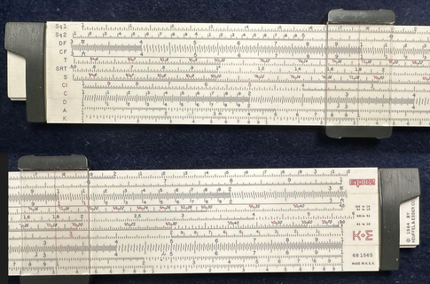

From my collection, here is the K&E GP-12; front side.

The Model GP-12, also mostly unknown as the 68-1565, is of a duplex design, made of Ivorite, but it would be considered a simplex rule (a duplex rule using only one side for scales). This is only mostly true, however, as we will see. It has a lighter feel than other full-size plastic rules, like the 4181-3 Jet-Log and the Deci-Lons (described next). This is largely due to the use of plastic end brackets rather than metal.

The top and bottom edges are grooved to accept a single-sided, clipped-on cursor that rides in the grooves, but it could have easily been supplied with a full-duplex cursor if they wanted to put indexable scales on the reverse side. Instead, the back is populated with useful formulas and conversions, with a couple of surprises!

Front Side: Sq1, Sq2, DF [CF, T, SRT, S, CI, C] D, A, K
Back Side: single decade log scale [centimeters, inches] L scale

For the front side, it seems like it was created by taking as many scales as you can off of the Deci-Lon rule to fit them into a one-sided rule. Perhaps it's no coincidence, but the arrangement seems to pattern the Aristo 901 Junior {DF [CF, CIF, CI, C] D, A, K}, only with the double square root and trig scale thrown in.

But the back side of the rule is quite different. It is populated with "Conversion Scales and Factors," but it has a logarithmic scale on the top rail and an L linear scale on the bottom, with centimeter and inch rulers along the edges of the slide. These scales, however, are not calibrated to the front face, nor is a cursor needed.

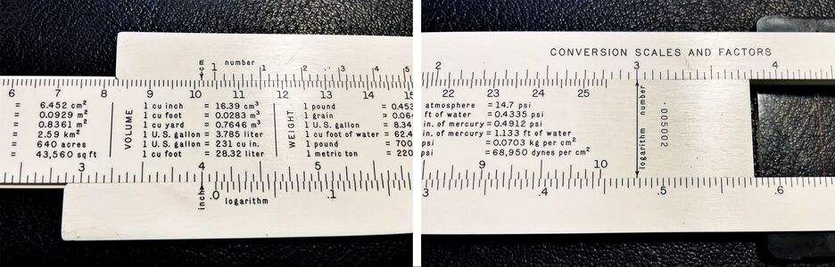

The back of the GP-12. Note the two uses. On the left, note the inch/cm indicators on both rails. Here the bottom indicator is aligned to 4 inches, whereas the top indicator reads ~10.15 centimeters. So, the GP-12 allows for direct inch-to-centimeter conversions. Or, since these scales are on the slide, it can be removed and used as a 10" (or 25 cm) ruler. On the right side, note the indicators are now on the slide, pointed toward the scales on the rails. As set here, the number 3 is indexed to the bottom log scale, reading ~.477. As such, log(3) = .477.

As such, the rear of the rule is more than merely conversion tables. It provides what is essentially an L scale for computing base-10 logs and exponentials, and gives easy inch/centimeter conversions. Experienced users will also recognize that .477 is the mantissa for the log of any number of the form 3 × 10ˣ. As such, log(30) = .477 + 1 = 1.477, log(300) = .477 + 2 = 2.477, or log(.3) = .477 − 1 = −.523. And while it's not designed to do so, because the linear scale on the bottom rail is divided up in inches like the ruler above it, it can be used to do easy addition (and subtraction). For example, the rule can be positioned to see that 446 + 925 = 1371, among other sums involving 446.

Price for the GP-12 is unknown since there are no published price lists for anything later than 1962. However, in 1962 prices, there is a large gap between the K-12 Prep rule at $2.25 and the 4181-3 Jet-Log at $21. Those being the two least expensive full-sized duplex rules, K&E likely felt this slide rule was needed to fill that gap. In 1966, I would place it roughly equivalent to the Model 4161-3 (68-1576) Modern Polyphase in terms of materials and capabilities. This $11 classic Mannheim-designed slide rule (in 1962), also with all-plastic construction, had 12 scales (as did the GP-12, disregarding the back side), yet it was very much a different rule. So I feel like K&E would have naturally priced the GP-12 around $11 to $13 in 1966 without too much concern that it would steal sales from the Model 4161-3, which would become known as the "Jet Math" in 1966.

Afterword (8/17/2024): With the discovery of the 1968 K&E Catalog Price List, the speculation of the previous paragraph is over. And was I ever wrong! The 1968 price for the GP-12 rule was $6.50. This is perhaps half the price anticipated and well under the $11.50 tag placed on the Model 4161-3 (68-1576) Modern Polyphase rule for that same year. Comparing the rules and their prices, it's uncertain how people would ever choose the Jet-Math over the GP-12 at those price points?

The more that the GP-12 is used and held, the more that this user can appreciate the overall utility it provides. I find the rear of the slide rule to be more useful than I first imagined, perhaps because of its simple functionality. Additionally, the rule is really attractive, feels great in the hand, and it gives the impression that it's more akin to a top-end rule than its price would have certainly suggested.

### The Deci-Lon Series

Shifting to a new model numbering scheme wasn't the only thing that K&E accomplished in 1962. They also introduced, arguably, their best slide rule in company history. It came in both pocket and full-sized versions: the Deci-Lon 5 (68-1300) and the Deci-Lon 10 (68-1100).

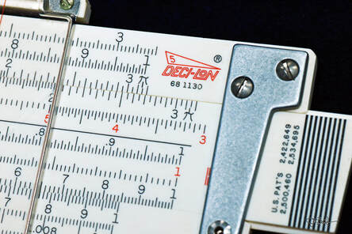

On the short list of the best pocket slide rules ever made - the Deci-Lon 5 as introduced in 1962.

The Deci-Lons were the fulfillment of everything K&E had learned about making slide rules. From the modern Ivorite plastic construction, unbreakable cursor, and a very powerful, 26-scale set, these functional rules could have very well taken over the entire industry. But what made this slide rule really wonderful is its form. This was K&E's exit from modernity, coming of age into what a future slide rule should look like.

This rule throws out tradition entirely. Gone are the right angles and the conservative approach to design.

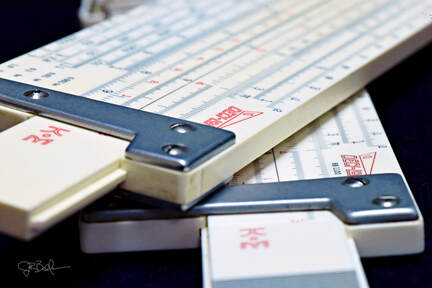

Now angular, deep-bodied, muscular, and even angry, as if it has something to say. Colored vertical lines on the ends of the slide declare, "Hold me here." We've seen K&E produce innovative rules before, even giving them bold names like Deci-Trig and Jet-Log, but this shouts its name on the rule itself.

Deci-Lon!

Exploring the scale set, we have 13 scales on the front and back each:

Front side: Sq1, Sq2, DF [CF, CIF, L, CI, C] D, Ln0, Ln1, Ln2, Ln3
Back side: Ln-3, Ln-2, Ln-1, Ln-0, A [B, T, SRT, S, C] D, DI, K

There is nothing new here. It's all been seen before... just not this much of it!

Basic arithmetic operations are handled with ease with all the Polyphase Mannheim scales. Efficiency of these operations is improved by a full suite of folded and inverse scales. Squaring, cubing, and rooting functions can be found with high precision with the A, K, and a pair of square root scales. Trig functions are handled by the full {S, SRT, T} set, in Deci-Trig divisions (hence the "Deci-" in Deci-Lon). Exponentials and logarithms are powerfully executed with eight log log scales based on "e," known as Lons (hence the "-Lon" in Deci-Lon).

It's the perfect, complete general math rule with a cool name in the prettiest package imaginable.

But such a slide rule would not be useful for many if it were priced out of reach. Whereas one might think that K&E's most powerful slide rule would command the highest price, this is not the case with the Deci-Lon. Being a modern rule, based on modern, finely molded plastics and inexpensive production techniques, the rule could be offered at a much lower price point than their traditionally "highest quality" mahogany-based slide rules. The 10" Deci-Lon entered the 1962 catalog with a $25 price tag. This is $4 greater than the Ivorite 4181-3 (68-1251) Jet Log and $3.50 less than the wooden 4081-3 (68-1210) Log Log Duplex Deci-Trig. So from the standpoint of usefulness, I'm not sure how the venerable wooden Deci-Trig - or even something like the famous Post Versalog - could compete? The Deci-Lon was most certainly a hit at that price point.

As for the pocket rule, the Deci-Lon 5, with a 68-1130 model number, was priced exactly half the price of the full-sized rule at $12.50. This should have been a very popular option, as by the 1960s pocket rules were very much in vogue. The 5" Deci-Lon gave buyers even more reason - it's functionally every bit as powerful as the larger rule. Where some precision is obviously lost, many would believe that the trade-off in portability and the huge discount compared to the 10" rule would have made this an easy choice. At least this is my thinking. The reality is such that the Deci-Lon 5 is actually a quite rare slide rule today, very collectible, in fact. As such, I wish we knew how in demand the 5" version really was?

Keeping in mind the popularity of the 4181-1 Jet-Log Jr., K&E would have a complete array of six pocket rules, all reasonably priced, once the Deci-Lon 5 arrived in 1962. So we do know that K&E had consumers covered in pocket rule options!

Significantly, this is a long way from the days when K&E offered a wooden pocket rule (Model 4031) at the same price as its full-sized version (Model 4041). Because production for the modern plastic rules is mostly the same regardless of size, they can be priced more in line with the cost of actual materials used. This was not the case with the wooden rules, which required longer production times across the board, which meant the pocket rules also had to be priced to cover the labor involved. When you recall that very few pocket rules were made by K&E until the 50s, and that one of their longest running models, the 4053 Polyphase Mannheim, didn't receive a pocket version until the Ivorite rules in the late 50s, then it should be clear the advantages of plastic when six pocket rules appear in the 1962 catalog.

The Deci-Lons would stay in production for a decade, largely unchanged, until the early 1970s when K&E removed the vertical stripes (grips) from the ends of the slide on both Deci-Lons and ceased putting the actual model number on the body of the rule. The latter point is not unheard of, as there were many instances in the company's history when a slide rule did not show a model number. But the disappearance of the vertical stripes, which in my opinion are one of the interesting and distinctive features of the Deci-Lons, obviously requires some reasoning. The popular story there is that the mold for the Deci-Lon was damaged on one of the slide's ends, so instead of fixing the mold, they dispensed with the vertical stripes altogether. Honestly, I am not sure I concur with this explanation as I write this, since a new mold would be needed to omit the stripes anyway. But I have a right to change my mind upon further research.

Yet another curiosity with the Deci-Lon is something I mentioned when talking about the Model 4098A pocket rule in the previous chapter. These rules are not intended to be used with a reversible slide, though it could be physically removed and flipped over, just as with the majority of duplex rules regardless of manufacturer. However, on a Deci-Lon, doing so could have caused an issue with the way the scales lined up front-to-back, as indexes often do not line up with the slide in the reverse position (something I also noted with the Model 4181-3 Log Log Duplex). The amount of error is small, but noticeable. It is a curiosity, but can be explained by the cast nature of the plastic rule. Such rules were no longer "engine-divided," but rather are imprinted in the casting process. Certainly there can be front-to-back error in the mold that wouldn't have been there using a traditional dividing machine. But this error doesn't affect the rule functionally unless the slide is used inverted. And I suspect K&E knew this, likely hoping that the angular ends of the slide would mean that users couldn't have been confused about the slide's orientation.

However, somewhere in the middle of the production life of this rule, K&E altered the tongue & groove joint on the slide to assure the slide can only be slotted one way. This shift in construction does not seem to align with the aforementioned delineation of the two variants, as two samples of my Deci-Lon 5 slide rules, both with stripes and model number on the rule, are different in that one (SN 011482) allows the slide to be inverted and the other (SN 021968) does not. Same story with my many Deci-Lon 10 samples, though it seems the change was made closer to the same time as the change in the striping. The reason for the change, as I speculated with the 4098A, might have been to counteract a proliferation of warranty claims that might have come up in later years from customers who felt that the scales should be perfectly aligned no matter how the slide was oriented. Keep in mind that the traditional duplex rule didn't really care how the slide was oriented. It would have been usable and accurate either way. I can see how users, new to the resin-cast rules, might have been surprised the first time they tried using the rule with an inverted slide!

I believe that K&E learned that if the user cannot physically invert the slide, then it's unlikely the user would ever know of any misalignment when the slide is incorrectly positioned, nor would it generate any public concern that the newer plastic rules breached a century's worth of K&E's high standards. Ignorance, in such cases, would be blissful for K&E, who we know was losing a lot of profit to warranty returns because of the overly generous return policy, as I noted in the Author's Aside earlier in this section.

For the moderately serious collector today, the Deci-Lon is one of the first rules that can be found in their collection. It's unique among all slide rules from the standpoint of design and represents the pinnacle of what K&E learned about slide rules over their century of existence. The 10" Deci-Lon 68-1100, in either variation, should cost between $30 and $100 on eBay depending on condition and completeness. They are by no means rare - there are 24 samples available on eBay as I type this - but they do command a healthy price for the most part. On the other hand, the 5" Deci-Lon 68-1300 pocket version is much more rare, appearing perhaps monthly on eBay. Prices will be set between $100 and $150 for the slide rule with leather sheath, and often much higher. This seems about right for something that just might be regarded by the majority of collectors as the best pocket slide rule ever made.

## Sidebar: The End of the Era

If you were an engineering student at a university in 1972, you would have entered your first year with a slide rule in hand. By the time you graduated, your slide rule would have been stowed away in your desk, giving way to the new Hewlett-Packard or Texas Instruments hand-held calculator that had become affordable enough to own.

The end of slide rules happened that quickly - and without remorse. There was no asking whether or not switching to electronic calculators was a good idea. Or whether something would be lost by the dismissal of the slide rule. All that mattered was that computations formerly done on the slide rule could now be done with 8 digits or more of precision, all without having to track the decimals yourself.

Speed? People of the era would say that they could do computations on the slide rule just as quickly, but being a generation removed from the era myself, and only now learning my way toward slide rule proficiency, the calculator is most certainly faster and more convenient.

Precision? How precise do you really need to be? We round our answers routinely to the hundredths or thousandths anyway.

As a high school math educator for 28 years, I now see where we have missed the slide rule pedagogically. Numeracy among students is far worse than it ever has been. My students give little regard to magnitude and significance to the output of calculator computations, not knowing if they got the question right until they see the amount of red ink on their graded exam.

Much of this could have been prevented during the analog to digital transition. Traditional pedagogical methods could have held, withholding calculators from young students until they understood the principle of "garbage in, garbage out." Teachers could have continued to insist on deriving estimates to solutions a priori. Our school system could have hammered the rules of numbers and their operations solidly prior to letting them be lazy with a calculator. Or better yet, educators could have kept teaching children the slide rule to give them a better sense of numbers, operations, proportions, fractions, arithmetic rules, and reasonableness of solution within math problems.

I recall a time early in my educational career when the importance of "manipulatives" were stressed, to supplement understanding of material with hands-on, visual reinforcement. And while today's "apps" on our smartphones can somewhat do this, it's in no way standardized in an educational system still trying to push TI graphing calculators on the kids, all because of a huge lobby at the state level to assure that they do not go away. Where were the slide rule lobbyists in 1973?

All rants aside, there are so many advantages to old slide rules in modern education that I wrote an interesting and detailed article about it, if you are so inclined.

Despite going public on the NASDAQ in 1965 and advertising their biggest sales year in 1966, Keuffel and Esser rapidly declined shortly afterward. Slide rules were in no way their big money maker, but these were still going strong into the 1960s. It was their technologies in other fields that were being supplanted by improvements. All of their traditionally analog products were quickly becoming obsolete. Their surveying instruments, transits, and theodolites were giving way to digital equivalents, which would be 5 to 10 years ahead of pocket calculators. So while we tend to think the digital world began with pocket calculators, that is only true for the general consumer like us. Within industry, digitalization had already begun its transition.

K&E would continue selling slide rules until 1976. But for the most part, their production of slide rules had abated beginning in the late 1960s. By that point, they were selling from massive amounts of inventory that they had accumulated, which is likely why, after 1962, there are so few K&E product catalogs and price lists to let today's collectors know what was actually going on during the late slide rule era.

Likewise, when we say that a model was still being offered as late as the mid-70s, this is only because they still had inventory that they hadn't been able to sell. So when we see that K&E still offered a particular rule in 1976, then that means either the rule was less desirable than others that sold out long before, or they were top selling rules in prior years that K&E had produced in over-abundance. But all we need to do is count the amount of slide rules offered in the 1967 Catalog (29) and compare that with the 1972 Catalog (13) to know how much life was left in the venerable slide rule.

K&E did not die overnight. They would stave off Chapter 11 bankruptcy until 1982. They hung around for 5 more years before selling their existing intellectual properties and products to the Azon Corporation in 1987. After other transactions through the years, K&E's optical tooling technology eventually found its way into the hands of Brunson Instruments Company, a competitor to K&E in that field since 1927. Today, Brunson still sells a line of products based on the original K&E designs.

Many of K&E's products have become collectibles, not only their slide rules. But while K&E would always reap the most profit from the rest of their consumer goods, they would be best acknowledged by the general American public for the long history of excellent slide rules.

### The Analon (68-1400)

One of the more unusual slide rules ever produced, and certainly a pinnacle rule for slide rule collectors, the Analon was introduced in 1967 as a slide rule for doing dimensional/numerical calculations within Engineering-Science applications. Simplex in design (duplex with single-side use only), the Analon was very similar to the GP-12 in build, with gold-colored plastic brackets instead of the GP-12's black.

With A, B, C, and D scales in their traditional places, the rule was populated with 7 other scales: three U scales on the slide and 2 V scales on each of the rails. These U and V scales had any of 30 different dimensional and physics variables (with a legend for these on the back side of the rule). These could be used to confirm the formulas that comprise those variables. In other words, it helps keep dimensional units straight when you do lengthy computations. At a more basic level, a formula like F (force) = M (mass) × A (acceleration) can be confirmed on the Analon by placing the C-index at "M" on the bottom rail's V scale, moving the cursor to "A" on the slide's U scale, and reading "F" off of the same V scale, thus confirming the formula.

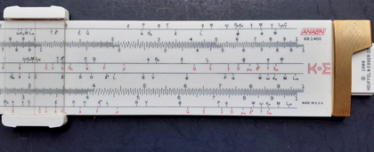

The 68-1400 Analon, courtesy of Miguel Ramirez at his highly recommended "My Rules" website.

Without getting too much into the design history and theory, to make this happen with 30 of the typical variables in science & engineering fields, while keeping all the scales spaced out and readable (increasing accuracy), was quite the feat. As such, the scales are no longer logarithmic, but rather affixed linearly within a confined 10" space. In other words, it's easy to imagine starting with scales from scratch and then positioning the F, M, and A variables on the rule so that they perform the same example above. But how do you place 30 other variables for all the other formulas you might need to confirm while keeping them equally spaced on the scale and, importantly, keeping them on the 10" rule? For more on this, I encourage you to read Cliff Frohlich's article for the Fall 2014 Journal of the Oughtred Society.

Design considerations aside, as remarkable as they are, it's the collectability of this rule that has made it popular. In truth, it is a "holy grail" for collectors. I still do not own one as of November 2022 (edit: nor yet in August 2024), though I've passed over a few that have come up on eBay, as I'm not ready to spend $300 or more on one. But why so expensive?

The Analon was only produced for one year, 1967, in very limited supply; perhaps 600 to 1000 samples. It is said that double that amount were manufactured, but half of them did not pass quality inspection due to errors with the painting of the rule. When you couple so few samples of the Analon with its very unique design, it's something very desirable for collectors. For myself, I will remain hopeful to stumble onto a bargain somewhere.

In a very large sense, this is a specialty rule, and had K&E continued in its manufacture after 1967, the question becomes whether it would have caught on? In Frohlich's article, after listing six specific flaws that might have ended the Analon's production, he summarizes it for us thusly:

<blockquote class="ke-callout">

"Nevertheless, the design of the Analon was highly innovative. If calculators had not replaced slide rules, other dimensional slide rules probably would have appeared, possibly targeting specialized audiences, such as chemists and even earthquake seismologists. Undoubtedly slide rule manufacturers would have experimented with other layouts and designs. Because there is a certain 'geek market' attracted to slide rules with numerous scales, dimensional scales - either like or unlike the Analon's U and V scales - might have been added to some of the more complex slide rules. However, these events did not happen, and the Analon is unique - there is nothing else like it." - Cliff Frohlich, Journal of the Oughtred Society, Fall 2014, p. 27.

</blockquote>

Had the Analon not been produced so close to the end of the slide rule era, I could imagine that other slide rules would be produced, the K&E product line would have shifted, and we might be thinking today of a different way of categorizing all of their slide rules historically. But despite being far from a general-purpose rule, it was still a Modern Duplex family member very much akin to the Deci-Lon and GP-12. It made sense to talk about it here, instead of treating it like the specialty rule that it is, which becomes the subject of our next chapter.

Afterword (8/17/2024): I had not tried to speculate on a price for the Analon rule because its 1967 introduction was well after the last known 1962 price list. However, now that we know 1968 pricing, we can deliberate a bit more in that regard. The original price point was set by K&E at $18.35.

Comparing this to other K&E rules of modern construction, the very similar GP-12 was $6.50 and the 10" Deci-Lon was $28.50. This shows great potential profit margins to the former rule, yet is much more attractive in price compared to the latter rule... or in fact, to the venerable Model 4081 Log Log Duplex (68-1200) mahogany rule which would command a price more than $6.25 higher.

Compared with the other wooden K&E specialty rules of the era, the Analon was priced MUCH less than the Model 4083-3 Log Log Vector ($33.25) and the Model 4139 Cooke's Radio rule ($29.75).

Perhaps the best price entry comparison is with K&E's Model 4143 Kissam's Stadia rule, priced at $20.50 in 1968. Both all-plastic and both specialty-purpose rules, K&E seemed to regard them as similar both in terms of market size and profit margin.

Introducing my recent find of the 1968 price list to subscribers over on the "Slide Rule Fan Club" Facebook group, collector/owner of an Analon, Bob Cherry, recalls the purchase of his sample in 1978 at the price of $35. He states that his came in a box complete with rule, case, hardback book, and quick-use guide (on paper). This would make sense, as K&E was doing the same with the Deci-Lon, Jet Logs, and Jet Maths by the early 70s.

I appreciate Bob's candor on this, as it becomes easy to see how a boxed-set of those items, costing collectively around $25 in 1968, would have increased by $10 by the end of the 70s. Bob confesses that he "wasn't searching for an analytical rule" and that he bought it "as kind of a novelty." Apparently, what Analons remained by the end of the 70s were already being considered collector's items shortly after the death knell to slide rules sounded.

[Continue to Chapter 4: The Specialty Rules](/sliderules/all-about-ke-rules/chapter-4-specialty-rules/) · [Back to Table of Contents](/sliderules/all-about-ke-rules/)
