The majority of slide rule products sold by Keuffel and Esser in the 19th century were actually highly specialized tools already developed by others. This was due to K&E's growth focus on becoming a sales distributor of products they felt aligned with their major markets of engineering, construction, and design. And keep in mind that it wouldn't be until the 20th century until K&E felt there was a market toward the every-man consumer. They built their foundation on providing quality products and tools to industry, those that would be building and rapidly expanding the U.S. after the Civil War.

To this point in our survey of K&E slide rule products, we have covered only those slide rule products that resonate with those who practice general mathematics. While there were certainly engineers in need of a Log Log Duplex slide rule, there are a wide variety of specialty products and slide rules that must be addressed in our effort to be complete. Beginning in 1901 with the introduction of the 4XXX naming convention, K&E started using 41XX series numbers to denote many of these specialized types of slide rules, particularly the linear rules. The notable exceptions to this naming scheme are many of the cylindrical or circular types of rules, as well as the Merchant's Family of rules, all of which carry 40XX model designations.

To differentiate this chapter from the one that follows, Chapter 4 focuses on Specialty rules within specific families, as K&E historically cataloged them. As such, these families of rules represented a longer history of specialty types, including a variety of rules intended for merchants, surveyors, electricians, engineers, and industrial workers. This chapter will also represent those items that fit well into a category, such as K&E demonstration rules, sectors, and rules related to chemistry or medicine. This is unlike Chapter 5, which highlights unique, one-off rules and other designs that wouldn't be cataloged within a "family" of slide rules.

As we discuss the Merchant's Family of rules first, which comprises the 4094, 4095, and 4096 models, it will be easier to discuss them in a narrative form rather than by a rule-by-rule breakdown, mostly because there are so few models to describe. However, other families will breakout each slide rule by individual model type.

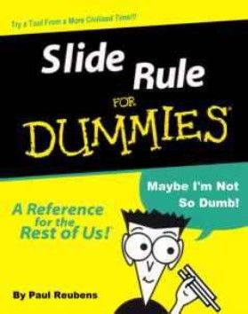

Not likely the original manual for the Merchant's Family of slide rules, but can we be so sure?

## The Merchant's Family

In 1915, K&E introduced a new duplex rule for those that might be confused by so many scales. Seriously, this is what they state in the catalog. They suggest that businessmen, accountants, merchants, mechanics, foremens, and the like, need a rule that doesn't detract from what they need the slide rule to do, namely "multiplication, division, and proportions." The Merchant's duplex rule, the Model 4095, was designed to do this. 10" long and built with the same form factor of the Model 4088 Polyphase Duplex introduced just two years before, the 4095 sports a very simplified scale set of DF [CF, C] D on the front side and only two scales, the CI and D on the back. This scale set is essentially patterned after the "règle des écoles" rule that Tavernier-Gravet introduced nearer the turn of the century.

Of course, this scale arrangement focuses only on C and D scales, which are the multiplication and division scales. These are enhanced by folded scales on the front side, which allows any such computation to have an index that is always at the center of the slide rule, which assures that a product or quotient is not "off the rule," a common happening on rules without CF and DF scales. And naturally the C and D scales can do conversions and proportions by virtue of being one decade logarithmic scales. This four scale arrangement on the front of the rule allows for chains of multiplication and division operations to be done more efficiently and quickly, seemingly something that merchants might want to do. This includes the three-number multiplication technique mentioned earlier in my writing.

Thus, technology for this rule was nothing new, as they'd been developing upon the same industry standard of efficiency for the previous 20 years, beginning with the Cox-patent Original Duplex rule. K&E understood the virtue of using those scales to promote greater simplicity in operation on this Merchant's Family of rules.

The back side, with only a CI scale on the bottom of the slide and another D scale on the bottom rail, allows users to invert their multiplications to work more like a division problem, without any distractions from other scales. Strangely, with only two scales on the back there is a conspicuous amount of empty space on the rule. K&E intended for users who do commonly performed conversions or computations to use this void on the rule to mark their own "gauge-points" to align with the index marks. Seems like a great idea, though it does make for a sparse presentation on the back side of the rule.

The Model 4095 came with a frameless glass indicator and a "Morocco" case (box) at a cost of $4.50, which was also the cost of the Model 4041 Mannheim. For further perspective, this is the least expensive duplex rule when it was introduced in 1915, with the Model 4088 priced at $7.00 and the Model 4092 at a dollar more. The older Duplex Family of rules, two years before being discontinued, were also available in 1915 at 50 cents more for the base version and $2.00 more for the "T" or trig version. The 4095 also beat the Model 4053-3 Polyphase Mannheim in cost, coming in at 50 cents less.

In 1922, the year of the introduction of serial numbers and the celluloid-wrapped edges, the 4095 was renamed the Model 4095-3, with 5" and 20" rules being added, the Model 4095-1 and Model 4095-5 respectively. The 4095-3 was $5.50 that year, with the case-upgraded "S" version at $6.35. The 4095-5 and 4095-5S were $13.00 and $14.50. The 4095-1 only came in as an S version, priced the same as the 10" model (with basic case). This 20" Model 4095-5 rule would only last 4 years and is a quite rare rule, with only two of them popping up on eBay since 1999 at a cost of ~$50, though because one hasn't been listed in a dozen years, it might sell for as much as a Chevy. The 5" Model 4095-1 would endure alongside the 10" version until 1943; however, it is almost as rare as the 20" version, popping up on eBay every couple of years, though with an average cost of around $75.

A year after the 4095-5 was discontinued, it would return in a different guise in 1927 as the Model 4096 Desk rule for $18. Enclosed in a nice wooden case, and able to be worked IN the case, the Mannheim-style rule was much larger in cross-section than the typical Mannheim, with attached metal feet that lifted the rule off of the table at an angle, yet solid enough to be worked with one hand (freeing a hand to write down computations). A knob on the slide allowed for slide movement. The scales were a repeat of the Model 4095's front side, with DF [CF, C] D. There were no scales on the back of the slide. In 1930, the desk rule would become the Model N4096 when it added a CI to the middle of the slide. This made it a more complete Merchant's model, though it wouldn't not be classified as such in catalogs.

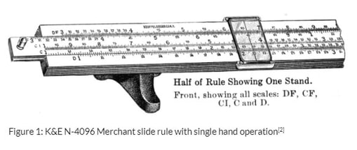

The Model N4096 Desk rule, K&E's 1927 reworking of the discontinued 20" Model 4095-5 into a large, table-mounted Mannheim-style rule.

Note: This rule is not to be confused with a very early All-Metal Mannheim Model 4096, a rule we will discuss toward the end of our text. It is an absolute unicorn and has nothing to do with the Merchant rules.

If we go by the product catalogs, then the Merchant's Model 4094 was born in 1930. However, there are samples with serif-font that date as early as 1927, albeit not in the 1927 catalog or 1928 price list. This was a standard Mannheim-formatted build out of celluloid-covered mahogany, like the current Model N4041-3, only with the Merchant's scale set. In fact, it was essentially the same rule as the N4041-3 in all regards except the scale set, DF [CF, CI, C] D. Inch and centimeter rules were on the top and bottom celluloid-covered edges of the rule. There were no scales on the back of the slide. Price of the rule was $5.00, which was 50 cents less than the N4041-3 for that year.

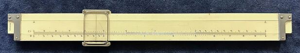

The Model 4094 Merchant's Mannheim, with its simplified DF [CF, CI, C] D scale set, from the author's collection.

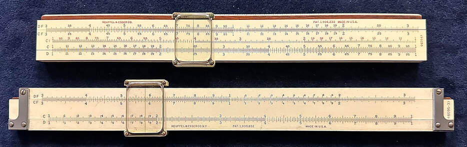

Its duplex sibling, the Model 4095-3 Merchant's Duplex — both slide rules pictured here share the family's spare, four-scale front presentation.

For 1939, K&E would add the Model 4096M, which was identical to the 20" desk model without the metal stands and metal knob on the slide. Thus, it was hand-held. Priced at $15 in a Morocco case, which was $5 less than the desk model for that year. I actually have this rule with a 1938 serial number in my collection. So while it wasn't in the May 1938 price list, it's a reminder that their first catalog entries may, or may not, be when the first samples first arrive!

1943 would signal the end of all remaining Merchant's 4095 models as well as the end of the N4096 desk version. The 4096M actually was rebranded as the "desk" model, but without the case or leg stands. It, and the Model 4094, would remain until they were discontinued in 1947. Strangely, these slide rules appeared in the 1947 catalog, but indicated that their were "temp. disc." The Model 4094 would indeed return in 1948 and the Desk Model 4096M returned a year later, along with the old N4096 version on the metal stands and with the desk presentation case. Albeit, once the case version was reintroduced, the 4096M version disappeared the following year.

There had not been a pocket Merchant's duplex model since 1943 and never a pocket model on a Mannheim build (unless you count the Ever-There 4097B which was functionally the same). Of course, in 1949, this is where the Merchant's Doric rule is first introduced. The 5" Model 9050-1 Doric filled that gap nicely, though as I mentioned in the discussion about the Dorics, this version would not hang around long, being reclassified in 1950 as the Model 4150-1. This was the same rule as the Doric, keeping the Doric label on the rule for a couple of years prior to dropping the label altogether. At this point, the 4150-1, 4094, and N4096 would remain in some form until 1972 when all but one of the Merchant rules disappeared.

In 1954, the 4094 became the N4094, taking on the same transformation in construction as the Model 4053-3 Polyphase Mannheim, gaining a plastic body with printed on conversion charts and the unbreakable cursor. The "N" designation was only in the catalog, as the rule remained labelled the "4094."

In 1962, these rules would receive their 68-1XXX series numbers. They would also be marketed as "Business" rules, with the N4094 being the only "Merchants" trademarked rule. The 4150-1 and N4096 would have two case options each. Prices at this point were $5.25 for the 4150-1 (68-1791) and $6.25 for the 4150-1C (68-1786) with clipped case. The N4094 (68-1775) cost $16.50 with only a synthetic leather option. The Desk Model 4096 cost $29.50 for the 68-1754 with synthetic leather case and $39.50 for the 68-1749 with wooden presentation case. The 4150-1 would be the only rule to make it past 1972, however. It would be sold until the end of the slide rule era in 1976. As I mentioned in the "Sidebar: The End of the Era," it's not that the rule was that much more desirable at the time; instead, it's likely that K&E was trying to off-load their old stock of these rules as long as they were still in business.

On the whole, the Merchant's Family models are quite collectible. It's difficult to find any of the models today except for the post-1922 Model 4095-3 rule and the 4150-1 plastic pocket rule (either might be between $15 to $30 today). The pre-1922 non-N version of the 4095 will more than double the price of the later rule because of its scarcity. And as I mentioned previously, the 4095 in other lengths are especially scarce, so the next one sold might cost more than most collectors would be willing to pay. The Model 4094 in the Mannheim format is not as rare, but has been difficult to find in recent years. It typically sold for around $20 or $30 in the past, but as I write this, three such rule sit on eBay with "Buy-it-Now" prices of over $70 and another, the all-plastic N-version, is priced at $57. Finally, the Model 4096 in both hand-held and desk version will run somewhere in the neighborhood of $100 and $200 respectively. They are most certainly desirable slide rules, though they are more common than you might think. The high price is more because of the size (and novelty) of those slide rules.

In summary, the Merchant's Family of rules helped professionals and trades-people who needed to do only a limited type of computations on a daily-basis. It's like a 4-function calculator in a world of scientific calculators. From that standpoint, the much cheaper Student's rules of the Model 4058 line are actually more powerful given their full Mannheim scale sets. But given the build quality of the Student's rules, it's easy to see that people would want something even more basic, yet still luxurious, nice, and smooth. Such was the appeal of the Merchant's Family of slide rules.

## The Stadia Family

Next to the original Mannheim family of slide rules, the earliest offered by K&E are rules from their Stadia Family. Recall that early demand for K&E products was from an industry that was actively building and expanding the country, which meant that land surveying was big business. A method known as the "stadia method" for surveying was the most advanced method used up until the technological age of laser range-finders and GPS, requiring optical tools for which K&E, of course, would provide. With these tools, a survey crew could measure the height and distance of any object given any "line of sight" to which the optical system is capable. The stadia method is still in use today, as the method is simple and accurate enough for a variety of range-finding and topographical applications, without having to spend thousands of dollars on automated surveying tools.

A lengthy understanding of stadia surveying is beyond the scope of this article; however, perhaps we can gain quick understanding of the process in order to know how to use most any Stadia slide rule. The important variables and factors are shown below, courtesy of Mike Syphers' amazing and comprehensive website.

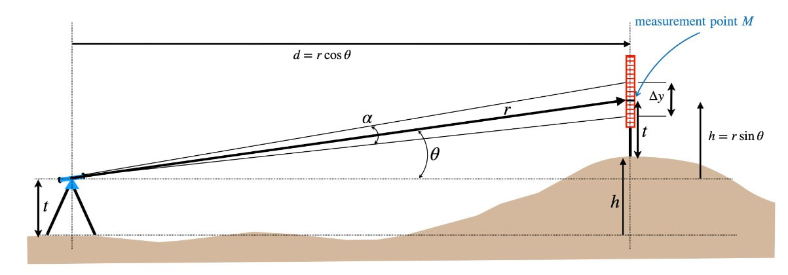

The variables of stadia surveying, courtesy of Mike Syphers' "Following the Rule" website.

In order to find both the height and distance of an object, four inputs are needed, with one derived from the first three observations:

1. The angle theta (Θ), given by the tripod of the sight device.
2. The angle alpha (α), given by the fixed measure of the optics, typically .010 radians. This is the fixed angle between two stadia marks in the optical field of view.
3. The delta-y (Δy), given by the linear measure of a stadia rod/board with gradations measured in inches, judged through the sight device between the upper and lower stadia marks.
4. The measure of "R" or "r" computed by dividing the Δy with the angle theta. This is a simple inverse-tangent function.

On a slide rule, certainly on any of the K&E rules, an R scale for the sight distance will typically be on the top rail, with an A scale on the bottom rail. Both these scales are the same two decades of logarithmic scale, though A is marked 1 to 100 and R is marked 10 to 1000. Given such a rule, situations between 10 and 1000 feet are required. On the slide are a V scale on the bottom and a combination H (right side) and V scale (left side) at the top. These signify "horizontal" and "vertical." The V part of the scale on the upper slide is for measuring large angles of theta up to 45 degrees, with an entire bottom V scale allowing for small angles, yielding the ability to measure possible vertical angles in degrees and minutes. The H scale runs backwards from 0 to 45 degrees, with limited resolution.

The scales are derived from the formulas for horizontal and vertical displacement (defined later). The scales increase in angle from left to right, marked in black, but the H scale also has angles marked in red running from right to left. The black and red angles meet at 45 degrees around 1.5" inches from the right of the scale.

To use the stadia rule, you would first compute the R input from the inputs given you by the survey measurement, which is the amount of feet measured on the stadia rod divided by the .010 radian standard of the sight device. An easy example is if Δy is 2 feet at an angle Θ of 15%, then "r" would be 2/.010 = 200 ft. On the slide rule, the right index of H/V would be set to 200 on the R scale. The cursor can be set on the H/V scale for the angle Θ (15 degrees in our example). When set on the LEFT side of the 45 degree mark, the resulting reading (off the R scale) of 50 feet is the vertical height gained over the distance. When 15 degrees is set on the RIGHT side of the 45 degree mark, the resulting reading (off the R scale) of 187 feet is the horizontal distance to the site being measured.

For grins, computing the hypotenuse (r) using the displacement figures to compute a new "r" allows you to know the total distance reduction given by the change in sigma (tilt of the stadia rod) for the measurement. In our example, sqrt(187^2 + 50^2) = 193.6 ft., where we would expect closer to 200 ft. given smaller angles of theta. Certainly, there are also slight errors given by reading the slide rule, as the horizontal displacement when plugged directly into (r * cos(Θ) * sin(Θ)) yields 186.6 feet, or ~5 inches off of the 187 ft. measurement we read. Not too bad!

For smaller angle of theta, the V scale would be used, as it is finely etched for angles of 3 minutes of arc to around 5.5 degrees. When this is used, the height is measured off the A scale, at better precision than using the H/V scale. For smaller angles of theta, the horizontal distance would approximate whatever R was, so that would not be computed on the slide rule.

More on the math: When given the hypotenuse (r) of the larger right triangle, finding distance would typically be r * cos(Θ) and height typically r * sin(Θ), but the measure of Δy assumes it is orthogonal to the sight device. Unless it is a level measurement (0 degrees of rise to the target), then there will be error caused by larger angles of "theta." As such, the computations for height and distance change according to some reworking of the trig, a process known as a "reduction." And this is where the stadia rule is designed to help, as it will compute the actual vertical (r * cos^2(Θ)) and horizontal (r * cos(Θ) * sin(Θ)) displacement, or height and distance. On most of the K&E rules, this will be labeled clearly by cos^2(Θ) on the left side of the rule, to remind users that measuring to the left of 45 degrees is the vertical reduction. Likewise, it will be labeled (1/2)sin(2Θ) on the right side (the equivalent of sin(Θ)cos(Θ)), indicating that values to the right of 45 degrees measures the horizontal reduction.

As such, a crew of two men, one operating the sight device and the other holding the stadia board can map out the topology of any area from any single spot within a sight radius of 1000 feet. Math is a wonderful thing...and a stadia rule makes it better!

Armed with this discovery, let's look at members of the Stadia Family over the nearly 90 years slide rules were produced by K&E.

### The Model 1749 Mannheim Stadia

K&E's entry into stadia rules occurred in 1895 with this 20" Mannheim-style rule, Model 1749. Several items were designated the 1749 at the end of the 19th century, including another stadia rule, their beginner's rule, two sewer rules, and their sector rules, all with dash indicators. Being the first 1749, the Stadia rule was dash-less. This slide rule, of course, gave way to the 4XXX series of in-house rules in 1901.

Priced at $13.50, which was $3 less than the 20" Mannheim Model 1746 they sold at the time, the 1749 Mannheim Stadia was most certainly constructed on the same frame, with celluloid-faced mahogany (probably), imported from Dennert & Pape. At least this is the likelihood since there are no known lasting samples of this nearly 130 year old slide rule. Thus, if you find one, you might well have won the lotto.

The scale set is unknown, though based on drawings in the 1901 catalog of the successor Model 4100 Stadia rule, as well as known samples of that rule, the 1749 was likely the same. Instructions, as on the 4100 model, were likely printed to paper and affixed to the back of the rule. The back of the slide would have been empty, although later models will add a B and C scale for doing general math computations and proportions. As such, this rule, and all stadia rules until 1913 (when the B and C scales are introduced), would have not included a cursor.

### The Model 4100/4101 Stadia Series

In 1901, the Model 1749 Mannheim Stadia was re-designated as the Model 4101 Stadia. This 20" model would endure until 1952. But it would be the 10" version, added that same year that would become K&E's longest lasting slide rule, being produced in some form until 1960.

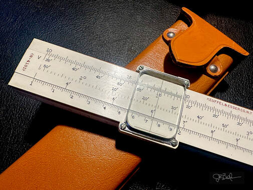

The 20" N4101 Stadia Surveyor's Rule. I stumbled upon this mint rule with case recently. Dating from 1943, produced during World War 2, the very lengthy single-sided Mannheim formatted rule carried an asset sticker on the back from the US Geological Survey. A wonderful piece of history!

The scale set on this new Model 4100 Stadia rule, like the forerunner Model 1749, was R [V/H, V] A. Nothing changed in the way the rule worked. Directions were spelled-out on the back, printed on paper stock, and glued to the rule. This rule was also blank on the back of the slide, and was thus without a cursor, as once the index of the slide was set to the stadia measure's R-value, then it was easy enough read the rule from the measured elevation angle.

The rule would change completely in the 1913 catalog, advertising a reversible slide with a new B scale on the back, located on the bottom of the slide. This, when used with the two decade A scale on the bottom rail gave the rule a general purpose application for multiplication, division, and proportions. For the first time with a stadia rule, this catalog pictures and describes a glass indicator. This cursor would have the metal frame.

Both rules were offered in a Morocco-covered case (box) for $4.50 and $12.50 for the 4100 and 4101 respectively. K&E did sell cases a la carte at this time, offering a sewed leather option for $.90 and $1.40, as well as a sewed case to accommodate a magnifying indicator. The cases were $1.40 and $2.10 for any 10" and 20" rules. The magnifying indicator for these rules was an extra $2 and $2.50. Other than adding the frameless glass indicator in 1914 (metal rails) and 1915 (plastic rails), both rules would remain unchanged over the next dozen years.

Both rules would be greatly improved for 1925. The Model N4100, priced at $6.50 and sporting a new N- prefix, added an HC scale in the middle of the front slide and a C scale to the back slide.

The C scale is obvious. As a single decade, it would now work with the A scale for squares and square roots. The HC scale, however, is not so obvious. This scale, very smartly I might add, allows for more accuracy with horizontal measures, akin to what the small angle V scale did for vertical accuracy. It too, like the bottom V scale, is keyed to the A scale. It is laid out with angles from ~1 degree, 48 minutes up to almost 18 degrees, 25 minutes. This works as an offset to the stadia measure (R value) used. As an example, if the reading is for 5 degrees elevation (theta) at 500 feet away (R-value), then setting right of 45 degrees to 5 degrees on the H scale, there's around a foot of error for the horizontal reduction. However, when setting the cursor to 5 degrees on the HC scale, the A scale reads ~3.77. As an offset, this number subtracts from the 500 feet R-value to yield a much more accurate horizontal reduction of 496.23 feet. Remarkable!

As a further bonus, the rule would also add celluloid to the edges, with an inch scale on top and a centimeter scale on the bottom. Because general math computations are read from the two decade A and B scales, resolution suffers compared to the normal Mannheim, but with the added utility of this N4100 Stadia, it would have been hard to be disappointed.

The 20" would not add the N- prefix until the 1928 catalog, and while the 1925 catalog states that the 20" rule is identical to the 10", there seems some discrepancy with known samples of the rule, as the 4101 appears to have waited until 1928, not only for the new prefix, but also for the new scales. I cannot concur however, since the price of the Model 4101 did not change from the 1925 price of $16 when the N-4101 was introduced in 1928. Curious indeed.

There were S options for both rules in 1928, with the N4100S costing an $.85 premium and a $1.50 extra for the N4101S.

Other than the typical cursor improvements in the mid 30s, both rules would remain unchanged for two decades. As mentioned, the N4101 would show as "temp. disc" in the 1949 catalog and subsequent price lists over the next three years. While some rules come back from that status, the 20" version of this rule never did, but apparently there was enough back stock to sell until 1952, as known samples age to that year.

The N4100 would continue, but it would see a conversion to semi-plastic in 1956, just as did the 4053 Polyphase and the N4094 Merchant's rules in 1954. Essentially, all three of these rules were identical by 1956, with plastic bases. The N4100 dropped the N- prefix to reflect the major change. It would also print the identical Conversion Factors onto the back of the rule, with stadia instructions now placed into the front channel beneath the slide. A strange look, indeed. Checking the price of all three of those rules in 1956...the Model 4100 was $14, which was 50 cents more than the 4053-3 and a $1.50 more than the N4094. Both the Stadia and Polyphase rules had "S" upgrade options to the chamois-lined leather case for $3 more.

Today, samples of the 10" Model 4100 can be found perhaps bi-monthly on eBay for a price of between $50 to $60, though 15 to 20 years ago the rule was in much higher demand, approaching $200. The same can be said for the 20" Model 4101, only more appreciably. It has sold for over $400 back in 2003, yet today will still cost maybe $150 if one actually comes for sale, which happens maybe once per year. But as with many rules that haven't sold in a while, a really nice, well documented version sold today just might surprise you how many Ben Franklins it can bring.

### The Model 4143 Kissam Stadia

Apparently, the Model 4100 was discontinued around 1960, as it would disappear from the 1962 catalog. But introduced around that time was the Model 4143 Kissam Stadia. It was to the Model 4100 as the 4161-3 was to the Model 4053...an all-plastic spiritual successor. But the first mention of the rule wasn't until the 1962 catalog when it would be called the Model 68-1486 Kissam Stadia (4143). Because there are Kissam Stadia rules with 4143 printed on the slide rule, it's obvious that the Kissam rule would run for a year or two as the 4143 before the 68-1XXX switch.

The "Kissam" moniker comes from Phillip Kissam, a Princeton University professor who authored many texts on surveying during his long career beginning earlier in the decade. He shared a patent with Carl Keuffel for an "optical plummet," which would have been incorporated into the design of K&E's surveying transits. Presumably, Kissam had some input into either the design of the 4100 or re-design of the 4143. Equally likely is that slide rule was designed to work with Kissam's techniques described in his textbooks, which were quite ubiquitous and well-known. It is unclear if Kissam received a royalty for some intellectual property or if the moniker was merely a tribute to Kissam himself, but it's noted that the original 4100 model lacked such an association.

This Kissam rule, other than being all-plastic construction with the unbreakable cursor, was indeed quite different from the former 4100. The scales on the back of the slide were removed, lessening its functionality for general math computations. It kept the Conversion Factors on the back of the rule, but it removed the stadia instructions entirely, placing them on a separate plastic card. The front side scales were also changed:

inches // R1 [V1/H/V3, HC, V2] R2 \\ centimeters

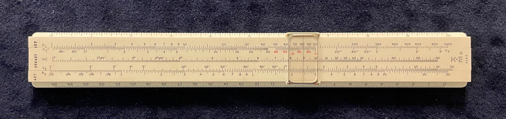

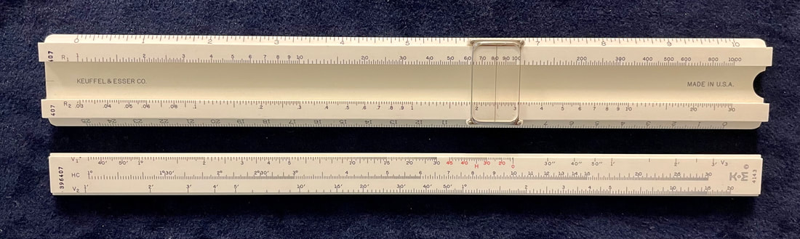

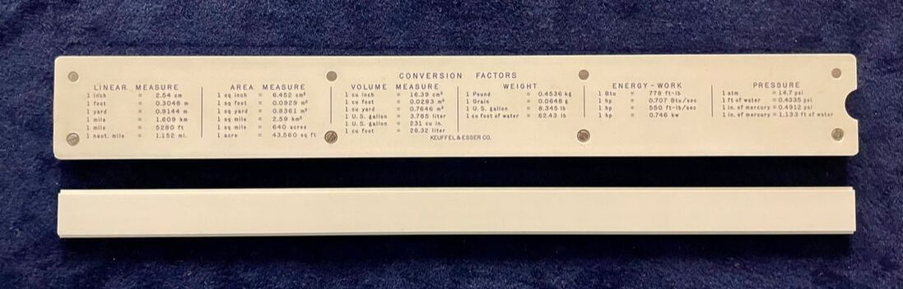

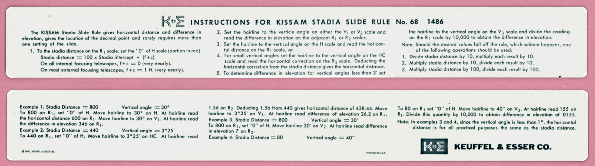

Left to right: the Model 4143 Kissam Stadia in the author's collection, likely originally purchased in 1962 given its matching 68-1486 plastic instructional insert (K&E had no issue repackaging older inventory for a new catalog year); with the slide removed, showing all-plastic construction and maker's marks in the slide well, and the back of that slide, left void of scales unlike the general-math-capable Model 4100 it replaced; and the plastic instructional insert itself, image courtesy of ISRM.

The R1 scale added another decade, now numbered 1 to 1000. The top scale on the slide was now a combined V1/H/V3 scale. The H scale, in red, would index from the end of the second decade, at 100 on the top rail. Horizontal measures would read right of the 45 marker. To the left, vertical measures for standard angles was the same. The right side V3 part of the scale allowed for computations with sub-minute sized angles, read off the R1 scale, but then divided by 10,000 and subtracted from the R-value to give the vertical reduction. For angles between a minute and a degree, the V2 provided vertical reduction for those angles with more precision, read off the R2 scale on the bottom rail. The HC functioned as normal, also read off the R2 scale as on offset to the R-value to yield horizontal reduction. To make that work, the R2 scale was entirely different from the previous A scale, a sacrifice made - no more general math ability - in order to give much more precision for stadia measures.

Priced at $19.50 in 1962 with a leather case and plastic instructional insert, this Kissam rule is substantially more than the 4163-3 ($11) and 4094-3 ($16.50) rules which shared the same form factor. This final version of the "4100" Mannheim Stadia rule would last through 1972, ending the long run of a popular slide rule for K&E.

Value for the collector is strong, though it seems to vary. As with the Model 4100, 15 years ago or more the Model 4143 would have been in excess of $200, with one sample on eBay achieving a bid-off ending at $338. Today, the rule pops up only occasionally for a likely price tag of maybe less than a $100.

### The Model 1749-3 Colby's Stadia

Patented by Branch H. Colby of St. Louis, and one of two devices known as "Colby's Computers" licensed to K&E for sale, the Model 1749-3 Stadia is pictured in the 1897 catalog. The rule is for an office desktop, at a massive 50 inches in length. It is comprised of an upright slide riding in a vertical, perpendicular groove. Advertised for stadia reductions, computing the difference of elevations between two points if the Stadia reading (delta-y) and vertical angle (theta) are known.

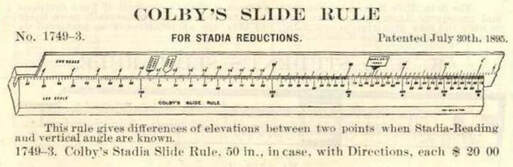

The Model 1749-3 Colby's Stadia, pictured in the 1897 K&E catalog.

The July 30, 1895 patent for the device describes a "Log Scale" on the base of the rule to be three decades of logarithmic scale (an extended R scale) numbered 1 to 1000. The vertical slide is labeled "Arc Scale," keyed to the Log, based on angles of elevation from 0 to 18 degrees relative to the distances on the base scale according to the formula for vertical displacement. The device has indexes for meters, yards, and feet, covering any unit by which a survey could have been measured.

The idea is to have surveying crews recording distances and angles of elevation/depression data from a known benchmark, measuring points either in a site plan grid or radiused from the sight device using recorded azimuth measures. The data could then be brought back to the office where the all of the elevation differences are computed in higher precision than with a standard 10" or 20" stadia rule. This would give accurate topographical surveys of the fields being measured, whereas a map could be produced - all done from the comfort of the office. This was traditionally accomplished with reduction tables, which was accurate, but a very tedious process. Colby's slide rule attempted to fix that. The extent at which he succeeded is unknown?

The rule itself, according to pictures of a known sample, appears to be celluloid colored mahogany. It was sold in a long wooden case and priced at $20 in 1897. This rule was given the 4125 model number in 1901, but would be discontinued prior to 1904. Perhaps this short life-span answers my question as to success of the rule?

Only one of these devices to be sold on eBay happened in the year 2000 at a price of $400. This collector is holding out hope of finding another one!

### The Model 4105 Webb's Stadia

A very unique rule, the Webb's Stadia rule was added to the K&E catalog in 1903. The price was $5, only 50 cents more than the Model 4100. It's unique in that the Model 4105 Webb's Stadia Rule is an elongated wooden cylinder with seven paper scales affixed around the surface. If you pictures a rolling pin in your mother's kitchen, then this slide rule wouldn't look all that dissimilar in appearance. Four scales are labeled "Differences in Elevation," which collectively serve as a single folded scale ranging from 1 minutes to 40 degrees. At 12.5" long, these scales are the equivalent of a single 50" scale. Three scales are labeled "Horizontal Correction," which serves a similar function as those for elevation, ranging from just under 2 degrees up to 40 degrees. Sliding through an outer metal tube with a slit through which the inner cylinder may be read, the slit is labeled with a single scale ranging from 100 to 1000 feet.

The idea is simple here: align the index of the cylinder to the stadia measure (R-value) by sliding it through the tube, and then sighting the vertical angle on the correct vertical and horizontal scales by rotating the cylinder to measure the reduction respectively. No cursor is needed. Quite nice! The device shows that such a rule is actually better formatted to a cylinder rather than to a linear rule, especially from the standpoint of increased resolution.

Designed by Walter Loring Webb, a Professor at the University of Pennsylvania, his namesake slide rule was licensed by Keuffel & Esser and manufactured in-house. K&E sold the device for exactly 20 years until it was discontinued in 1923. This 20 years being the length of his Webb's exclusive patent rights. It is unclear if other makers might have freely produced the slide rule after 1923. Cost for the rule was $7.50 in it's last year, but it will cost you more than $400 today for the rare sample that might come up on auction.

### The Model 4102 Surveyor's Duplex

In 1915, despite already producing 3 other stadia slide rules, K&E introduced their first stadia rule based on a duplex form factor. However, this rule had a few special tricks up its sleeve.

The stadia functions of the rule cover the back side, giving the same functionality as a typical stadia rule.

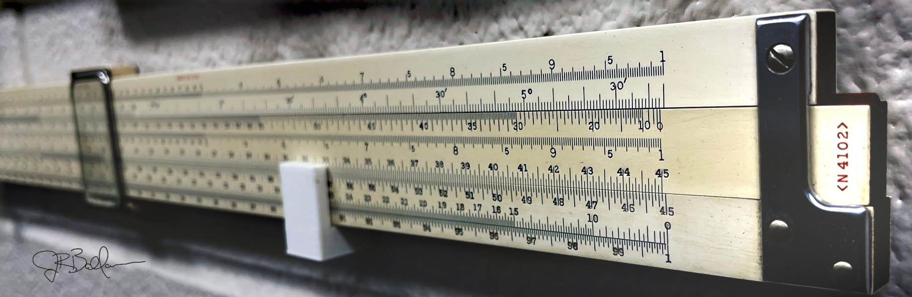

My sample of the N4102 Surveyor's Duplex, as displayed on my classroom wall.

But it's one thing to use the stadia method of surveying any number of points, but they mean very little unless those points relate to a meridian line. So before a survey can be done, precise latitude and longitude as well as an exact north bearing measurement is required. At night, this is possible by sighting Polaris (the "North Star") and staking out when true north is on the ground. But this isn't feasible during the day. In that case, measuring the sun's azimuth and comparing it to it's known bearing provides that information. Known as "astrometrics," this is a practice still valued by modern surveyors today.

As for the 20" Model 4102 Surveyor's Duplex, this is where the front side, astrometric scales of the rule are useful. Once the altitude of the sun is ascertained by transit observation, the slide rule has scales to compute accurately the sun's azimuth (bearing from true north). This important measurement allows a survey crew to stake out a true directional grid, as well as conduct a radial survey of the area. Rear side of the rule has typical math scales, with both of the traditional stadia scales.

The astrometric scales are designed to compute the formula:

cos(azimuth) = sin(d) / (cos(h) * cos(l)) - tan(h) * tan(l)

In this formula, "l" is the latitude of the observation obtained by either map or direct observation, "d" is the declination of the sun as provided by ephemeris data, and "h" is the sun's altitude taken from transit observation and corrected for atmospheric refraction. According to the catalog description, it computes this with an accuracy of 1 arc minute, with the length of the rule giving more sub-divisions for increased precision. The manual did ship with the slide rule to provide instructions for use.

Scale layout is as follows:

Front Side: D, sin d [ cos l & h, C, tan ] tan l, Az
Back Side: Vert, A [B, CI, C] D, Vert/Horiz

This 20" duplex formatted rule first appeared in the 1915 product catalog with frameless indicator and Morocco boxed case for $18. It would adopt the N- prefix in 1927, with the only apparent alteration, other than a $24 price tag, being the change to a non-serif font (which happened across all K&E slide rules in 1927, without exception). It would upgrade to the improved-glass indicator (metal frame) in 1936. In the 1952 catalog, the N4102 was listed as "Temp. Disc." and would disappear entirely by 1954.

This rule is quite desirable and rare, coming up on eBay maybe once per year at an average price of over $400. It pops up on the occasional auction site as well where I found a sample for my own collection, fortunate to pay less than $100. My N4102 is a 1937 model with the new-improved cursor, yet as with many cursors of this type did come with cracked cursor rail (onset of KERCs). It does remain intact and fully-functional, however, reinforced with a little super glue (cyanoacrylic).

## The Chemical Family

The idea of a chemical slide rule seems obvious. As easy as it is to mark pi on a slide rules with a gauge mark of the symbol π, using gauge marks to indicate chemical elements and formula weights was inevitable.

Even before atomic theory had arrived, chemists knew the weights of elements and compounds empirically, through experimentation. By the 1930s, when the idea of the neutron (neutral particle) was finally understood, many such chemical gauging of slide rules had already been around for decades, as chemists would commonly mark their own general math rules with many of the most used chemical compounds and elements in their experiments.

For K&E, waiting for the discovery of the nuclear age was unnecessary, as they would produce the first actual chemical slide rule in 1913.

### Model 4160 Chemist's Duplex Rule

The date is August 25, 2024 as I write this. I would have thought that I would have a sample of this slide rule by now, but it still eludes me. It is somewhat rare, popping up perhaps twice per year on eBay. Even so, good fortune has not brought one into my hands. However, hope does not elude me.

I share my emotions regarding the Model 4160 Chemist's Rule before describing it simply because it's one of the first K&E specialty rules that came across my radar, as I just think a slide rule for chemists is pure genius, even if real chemists might feel they aren't entirely useful (at least of among the chemists I know). My collection does include the Hemmi version of this rule, the "Model 257 Chemical Engineer," and I have felt that it would only be a matter of time before the K&E rule would join it.

The Model 4160 appeared in K&E product catalogs from 1913 to 1941.

Louis Gotlib, in his Fall 2012 article for the Journal of the Oughtred Society, expresses that the number of Model 4160 rules produced by K&E, as told to him by K&E Salisbury plant manager, Joe Soper, was quite small. While I would agree with that assessment - I've been a collector long enough to know that there is a direct correlation between the number of rules originally produced and the number that come up for sale today - Soper would have only known this indirectly, as the last catalog appearance of the Model 4160 Chemist's rule was in 1941, more than two decades prior to Soper joining Keuffel & Esser in 1966. It is thought, perhaps, that K&E might have continued to produce the rule despite being removed from their catalogs; however, this in mostly due to the fact that the chemical rules from all the other makers began and persisted into the 1950s and 1960s. But most would believe that K&E, with the Model 4160 being the first of such rules produced, had discontinued that rule well prior to other companies taking up the mantle.

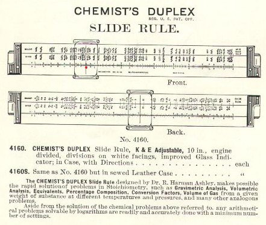

A page from the K&E catalog referencing the Model 4160 Chemist's Duplex Rule, dated 1941.

### Model 4165 Urea Index Rule

🤖 AI-drafted &middot; unverified

<dl class="ke-ai-stub-facts">
<dt>What it is</dt>
<dd>A specialty slide rule cataloged by K&E under the Chemical Family, alongside the Model 4160 Chemist's Duplex.</dd>
<dt>What it did</dt>
<dd>The name suggests a single-purpose rule for urea-related conversions — most plausibly urea nitrogen/protein-content calculations used in agricultural, dairy, or clinical chemistry testing of the era, though this is inferred from the name alone.</dd>
<dt>Approx. introduced</dt>
<dd>Unknown — no catalog appearance has been confirmed for this chapter.</dd>
</dl>

This summary was generated by an AI assistant from general knowledge of comparable specialty slide rules, not from a verified first-hand source or sample. The surviving record for this chapter contains only the model's name and number — treat every detail above as a starting point for research, not settled fact.

catalog image not yet sourced

Verify further: <a href="https://www.oughtred.org/">The Oughtred Society</a> &middot; <a href="https://www.sliderulemuseum.com/">International Slide Rule Museum (ISRM)</a>

## The Sewer Family

Cataloged alongside the Chemical Family rules, K&E also offered a trio of sewer-grade rules for civil and sanitary engineers: the 4130 Colby's Sewer, the 4132 Crane's Sewer, and the 4128 Nordell Sewer. Each is discussed individually below.

### 4130 Colby's Sewer

🤖 AI-drafted &middot; unverified

<dl class="ke-ai-stub-facts">
<dt>What it is</dt>
<dd>A sewer-computation slide rule bearing the Colby name — likely another design licensed to K&E from Branch H. Colby of St. Louis, the same designer behind the Model 1749-3 Colby's Stadia discussed earlier in this chapter.</dd>
<dt>What it did</dt>
<dd>"Sewer rules" of this era typically computed gravity-flow capacity, slope, and velocity for sewer pipe design (a Manning's-formula-type calculation), sized for civil engineers rather than surveyors.</dd>
<dt>Approx. introduced</dt>
<dd>Unknown — given Colby's other K&E rule dates to the 1890s&ndash;1900s, a similar era is plausible, but unconfirmed.</dd>
</dl>

This summary was generated by an AI assistant from general knowledge of comparable specialty slide rules and the designer's other known K&E work, not from a verified first-hand source or sample. Treat every detail above as a starting point for research, not settled fact.

catalog image not yet sourced

Verify further: <a href="https://www.oughtred.org/">The Oughtred Society</a> &middot; <a href="https://www.sliderulemuseum.com/">International Slide Rule Museum (ISRM)</a>

### 4132 Crane's Sewer

🤖 AI-drafted &middot; unverified

<dl class="ke-ai-stub-facts">
<dt>What it is</dt>
<dd>A sewer-computation slide rule bearing the Crane name, cataloged alongside the Colby's Sewer and Nordell Sewer.</dd>
<dt>What it did</dt>
<dd>Likely served the same general purpose as other sewer rules of the era — gravity-flow capacity and slope calculations for sewer pipe design — under a different designer's scale layout or formula approach.</dd>
<dt>Approx. introduced</dt>
<dd>Unknown — no catalog appearance has been confirmed for this chapter.</dd>
</dl>

This summary was generated by an AI assistant from general knowledge of comparable specialty slide rules, not from a verified first-hand source or sample. The surviving record for this chapter contains only the model's name and number — treat every detail above as a starting point for research, not settled fact.

catalog image not yet sourced

Verify further: <a href="https://www.oughtred.org/">The Oughtred Society</a> &middot; <a href="https://www.sliderulemuseum.com/">International Slide Rule Museum (ISRM)</a>

### 4128 Nordell Sewer

🤖 AI-drafted &middot; unverified

<dl class="ke-ai-stub-facts">
<dt>What it is</dt>
<dd>A sewer-computation slide rule bearing the Nordell name, the third member of K&E's Sewer Family alongside the Colby's Sewer and Crane's Sewer.</dd>
<dt>What it did</dt>
<dd>Likely served the same general purpose as other sewer rules of the era — gravity-flow capacity and slope calculations for sewer pipe design — under a different designer's scale layout or formula approach.</dd>
<dt>Approx. introduced</dt>
<dd>Unknown — no catalog appearance has been confirmed for this chapter.</dd>
</dl>

This summary was generated by an AI assistant from general knowledge of comparable specialty slide rules, not from a verified first-hand source or sample. The surviving record for this chapter contains only the model's name and number — treat every detail above as a starting point for research, not settled fact.

catalog image not yet sourced

Verify further: <a href="https://www.oughtred.org/">The Oughtred Society</a> &middot; <a href="https://www.sliderulemuseum.com/">International Slide Rule Museum (ISRM)</a>

## The Steam Power Family

### Model 4140/4141 Hudson's Horsepower Computing Scale

If I am K&E and I want to be known as THE source for slide rules in the USA, then I will not care so much if I made the rule or not. In the case of the Model 4140/4141 Hudson's Horsepower Computing Scale, K&E became licensed to sell the product from its maker, the W.F. Stanley & Co., Ltd. in England. We will talk more about Stanley later in the context of the Fuller Calculator, but there is no mistake that K&E followed this company closely in terms of their business model, especially working together with them in many areas. One of these is to license the U.S. sale of the Hudson's Horsepower Computing Scale.

Origins of this slide rule can be traced back as early as 1877 in the W.F. Stanley product line. These early versions were made of pure ivory, whereas later versions might incorporate celluloid covered boxwood, as does the version marketed by K&E known as the Model 4141, or simple cardboard construction, as with the Model 4140 version of the rule. Either version is only 4.5" long. Price of the two rules in the 1913 catalog is $3 for the cardboard Model 4140 and $6.50 for the wooden Model 4141 version. K&E sold these rules between 1901 and 1916. Both versions came with a leather-covered sheath.

The rule has two slides which move independently between two fixed stator rails, bracketed on the ends. As such, it is fully duplex, as there are indeed scales on the back side. There is no cursor. While K&E did not start selling this rule until 1901, the fact that it existed as a duplex rule in its construction as early as 1877 most certainly predates the Wm. Cox patent for the duplex slide rule of 1891. It's important to note here that Cox might have used this rule as inspiration for his own patent, which called for logarithmic scales, inverted scales, and a "runner" cursor. The Hudson scales had none of these.

Scales for the Hudson rules are as follows...

Front Side: Indicated Horsepower [RPM] [Stroke Mean Pressure] Cylinder Diameter
Back Side: Mean Pressure Scale

The slide rule works on the principle that if you know any two of an engine's piston speed, its displacement size, or its power, then you can compute the third quantity. Displacement size would be a product of the stroke length and its cylinder diameter, giving 4 total inputs, which makes the dual slides a necessity in a cursor-less design. 700 RPMs is shown as the maximum measurement, as such would be for slow revving engines of the day, most usually steam engines, but not necessarily.

J.G. Hudson, designer of the rule, invented 3 other rules similar to this horsepower rule, each of which was produced by Stanley. These include a Pump Duty Computing Scale; the Shaft, Beam, and Girder Scale; and one known as the Photo Exposure Scale.

Why K&E chose only to sell the Horsepower rule is unknown, but all such rules are similar in style and function. The horsepower rule is the most common; however, as well as the longest selling, sold by Stanley (and AG Thornton) until approximately 1931. Even so, it's still quite rare, as only two Model 4141 rules have come up on eBay since 1999, averaging around $460.

### The Model 4135 Power Computer

A likely reason for K&E dropping the Hudson's Horsepower Scale in 1916 is that the company began selling their own version of very similar slide rule 3 years previously. The Model 4135 Power Computer rule, first appearing in the 1913 Product Catalog, allows for similar horsepower computations of steam, gasoline, and oil engines. Two versions of the rule would appear over the product's history. The first rule, made by K&E from 1913 to 1921, was based on the same design as the cursor-less, Hudson rule, with identical celluloid-covered boxwood and dual independent slides. It was longer, however, at 7 inches. The K&E version also makes better use of both sides of the duplex rule, with a general-purpose Mannheim scale-set on the front side of the rule (A, B, C, and D scales only) and the specialty scales on the back. Cost for this rule in 1913 was $7.00, only slightly more expensive than the Hudson version despite the much larger size and increased utility.

Like the Hudson rule, the Model 4135 is used to compute the formula:

HP (horsepower) = (P * L * A * N) / 33000,

where P is the pressure (mean effective), L is length of stroke, A is area of one piston in square inches, and N is the number of power strokes per minute. In this case, 33000 ft.lbs/min. is James Watt's equivalent for 1 horsepower (hp).

As such, scales on the back side of the rule are like the Hudson rule:

Indicated Horsepower [RPM] [Stroke Mean Pressure] Cylinder Diameter

In 1922, K&E completely changed the format of this slide rule, adding the "N" prefix. The new model N4135 was converted to the 4088-1 model body, also introduced that same year. Thus, it was a normal 5" pocket duplex style using typical celluloid-covered mahogany. This rule added a glass cursor. Scales were as follows:

Front Side: A [B, CI, C] D
Back Side: P [R, W] D, where P = horsepower, R = Stroke, W = RPM, and D = Cylinder Diameter

Essentially and functionally, the new format worked the same as the old, except stroke length and RPM are switched on the slide relative to the earlier version, and the cursor replaces the need for dual slides. This rule would last appear in the 1937 catalog and the 1938 price list at the price of $10. Of note, 1938 catalog pricing for the 4088-1 polyphase duplex pocket rule, from which the N4135 was derived, was $9.50.

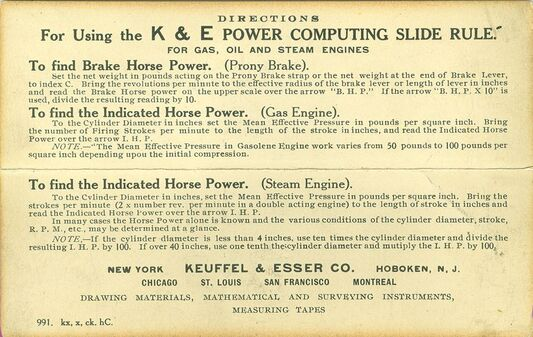

Description from my 1921 K&E Catalog. Click on the image for a close-up of the scales for this rule. Note front and back scales are denoted A, B [C, D, E] F, G, adjusted for steam pipe calculations on the front and water pipe calculations on the rear.

### The Model 4142 Allan Friction Head Duplex

This slide rule might as well be a unicorn - I am unaware of a single known sample of this slide rule anywhere. But it is described in every product catalog from 1915 to 1927 at a cost of $18.

Keeping to the theme of "steam" power, the Model 4142 Allan Friction Head Slide Rule is a 20" duplex formatted slide rule designed to do steam and water pipe computations. According to the catalog, the rule is setup to compute one of 5 variable inputs as follows: volume, friction, diameter, velocity, and pressure. Those relating to steam computations are handled on the front side of the rule, with scales for water calculations on the back.

The detailed illustrations in the 1921 catalog show a very clearly labeled and well thought-out slide rule. I would certainly love to see a scan or image of this rule, or better yet, the real deal in person. Alas, there is simply no internet record of an actual sample anywhere. More searching (and research) is necessary.

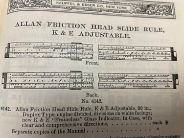

The detailed illustrations of the Model 4142 Allan Friction Head Duplex in the 1921 catalog.

## The Radio and Electrical Family

As a slide rule collector, those specialty rules designed to help with electrical applications are among my favorites. Most slide rule makers have a variety of slide rules dedicated to this purpose, especially since specific electronic computations are easily derived from special logarithmic scales and because of the need to do these computations in the field.

Radio communications is merely an extension of electronics, and traditionally a radio engineer needed the capabilities that an electronics rule would provide. Typically, such radio specific rules will add a scale (or three) specific to an aspect of radio engineering, or to those of the electronics and the general-math abilities they provide.

K&E would provide five different radio rules over the years, but prior to that, we should look at the company's only electrical rule.

### The Model 4133 Roylance Electrical

Introduced in a supplement to the 1913 product catalog, this rule, in the 8" single-sided, Mannheim format, had an interesting history.

The first question that arises is the origin of the name, "Roylance." Many places on the Internet declare the name to be "Roy Lance," but it should be noted that all catalog entries and instruction manuals, give the name as Roylance.

Secondly, this rule cannot be taken out of the context in which it was introduced, during the time when the world was first becoming "electrified." Creating the infrastructure for running electricity in every home took place in the early part of the century, and that required running an enormous amount of copper wire. Determining the amount and type of copper wire needed to run from AC transformer to AC transformer is the focus of this slide rule. As such, it allows for the computation of amperage limits for a particular gauge and type of copper wiring, as well as wire temperatures at particular power draws. The rule's exact construction is based on the 4035 Mannheim rule in its format, with scales as follows...

Front Scales: Inches || A [ B, C ] D || B&S Gauge
Back of Slide Scales: [ S, L, T ]
Back Scales: Centimeters

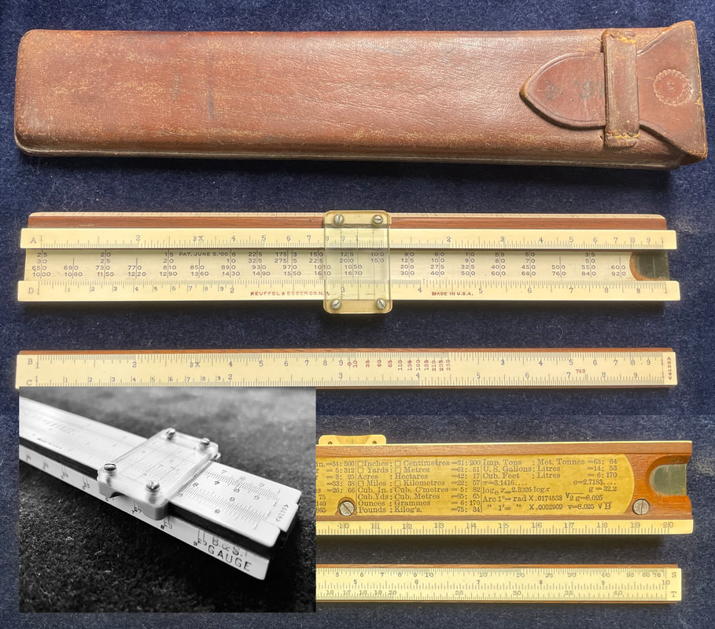

The Model 4133 Roylance sample in my collection. Its overall shape and size, use of celluloid on the rule's back, the "B&S Gauge" on the front edge, the utilization of the slide well, and the purpose of the rule itself all contribute to its uniqueness.

Of note are extra markings, in red, on various scales for extra purposes:

- Between 9.9 and 20 on the B scale, there is a scale for wire temperature in Celsius for doing resistance calculations.
- On the right hand side of the A scale is a "W" gauge marking to represent the constant (.003027) for calculating weight in pounds per 1000 feet of bare copper wire.
- The C scale is marked in red at 746 to assist with conversions of watts to HP (and vice versa).

The front edge of the rule has what's known as the B & S (Brown and Sharp) standard wire gauge. These numbers are the equivalent measure to the better known AWG (American Wire Gauge) commonly used today. On the rule, it's a three line continuous scale running from 0000 to 40, representing common wire gauges from large to small. Most electrical calculations on the slide rule begin with this setting.

Additionally, there is a scale beneath the slide on the main body with columns of numbers in 4 rows. Those numbers are used with the B & S Gauge scale to give the following information:

- Top row: The amp carrying capacity for rubber-covered wire
- 2nd row: The amp carrying capacity for weather-proof wire
- 3rd row: The amp carrying capacity for the rubber-covered cable
- 4th row: The amp carrying capacity for the weather-proof cable

An example for the use of the Roylance rule is shown below.

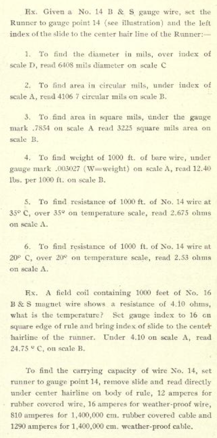

An example for use of the Model 4133.

Two other features of the rule seem unique. First, the rule employs a three hairline cursor. It is unlike earlier two-line cursors used around the turn of the 19th century when the scales were a 0.5 cm from the end of the rule. In this case, if the diameter of a circle is set on the right hair-line, then its area can be read from the left hair-line. A very interesting feature! The center hairline is used for all other computations normal to the rule. Second, there is a centimeter ruler on the back of the bottom stator of the rule, and it is divided atop a celluloid lamination. This is the only instance of a single-sided, wooden Mannheim formatted rule running an extra celluloid strip on the back.

The Roylance was introduced with a leather case in 1913 with a $5 price tag, but quickly rose to $8.50 by 1922 when if would be sold as a N4133S version, indicating sewn leather case. As comparison, the 8" Model 4053-2 on which format the Roylance was built was $6.95 in 1922. The Roylance rule was somewhat enduring, lasting until the 1949 catalog, albeit there were times of unavailability during the war. Other than the typical cursor evolution, the only significant change to the rule occurred in 1925 with the addition of a CI scale to the middle of the slide. This added the "N" prefix to become the Model N4133.

The Roylance is very much a blue-collar, industrial slide rule, intended for doing large-scale electrical work, from power pole to power pole. The Roylance Model 4133 would have played a significant part of building the electrical infrastructure for the United States. Once electricity was provided, then it became possible to have devices that ran on electricity, giving rise to the electronic industry beginning in the 1920s. A remarkable amount of such electronics concerned the development of radio.

### "The K&E Radio Rules"

For K&E, an electrified world meant designing more slide rules that could help with computations required in electronic/radio circuit design, of which K&E is an early pioneer - it was around this time when slide rule makers produced some of the first Elektro/Electric slide rules in which the collector would be familiar. Yet it was radio electronics where K&E became most interested.

Living in the 21st century, we have a difficult time understanding the need for slide rules designed for radio electronics. In an age of on-demand digital media, it almost seems that radio itself is as obsolete as slide rules! Yet, for the discussion of the following slide rules, it is helpful to understand the world as it appeared a century ago, when radio was a growth industry and its ability to change the world was at hand.

It is in this setting that K&E and other manufacturers would produce slide rules to help with the computations involved in radio transmission and receiver design. These following rules represent somewhat of an evolution of their radio rule, all of which were conceived, planned, and produced between 1935 and 1940. And as we will see, K&E allied themselves with the US Navy for this task.

### Model 4091-3 Spec

The earliest attempt at an electronic engineering slide rule by K&E is also the one in which we have the least knowledge.

According to Clark McCoy (JOS, Fall 2015, p. 51), the U.S. Navy approached K&E to produce such a rule around 1935 or 1936. At the time, instructors at the Naval Academy were working with K&E on the development of the 4080 and 4081 Log Log Models that came out in 1937. Through this working relationship, the Academy inquired about producing this slide rule.

To my knowledge, McCoy owns the only three known samples of this slide rule, so "rare" is quite the understatement.

McCoy does explain that one of these samples has "RMS No. 72" inscribed on the rule's edge, yet he surprisingly has no explanation for that. RMS would indicate Radio Materiel School (RMS) at the Naval Research Laboratory (NRL) in Bellevue, District of Columbia. Its use in their six-month curriculum would seem to be obvious. This program pushed through approximately 200 US Navy sailors each year, beginning in 1924. These facts should indicate something about the growth of radio in this country during the era, especially its importance within military applications. It's this context in which K&E saw a burgeoning market. This becomes thematic of all the radio rules that K&E would produce, as described shortly.

While a general math rule could be used to compute solutions to the formulas required for electronics, the Navy wanted something more efficient, and they knew such a rule would have been simple to implement.

Hearing this, K&E took the Model 4091 Log Log Deci-Trig (decimal trig scales needed) and added this "special" scale, thus giving rise to the name of the rule as the Model 4091-3 Spec. The word "SPEC" is written above the normal "<4091-3>" model number found on the typical rule, highlighting the distinctive difference. The added scale is labelled "LC." "L" stands for Inductance - "I" is reserved for "current" in electronic-speak - and "C" means Capacitance. The LC scale would allow for the computation of resonant frequency when given a variety of inductances and capacitances. LC circuits themselves have both an inductor and a capacitor, storing energy at natural oscillation frequencies. They are an electronic building block within radio circuitry, and this rule was design to help engineers tune those circuits.

This scale was squeezed onto the top stator rail on the back of the rule, just above the LL0 scale. The only other difference between these versions of the 4091-3 rule was that K&E switched the front and back of the rule, putting the maker's marks and copyright notices atop the L scale - as there would not have been enough room above the LL0 scale for the new scale if kept as normal.

Not listed in any K&E Product Catalog and rolled out around 1936 (according to their standard serial numbers), this item is rare, perhaps serving only as a prototype or precursor to other radio rules, with very limited purpose to the US Navy only (see Sidebar: It's Classified! below). It is difficult to know how many were made since only three such rules are known to exist. However, this rule was enough to give K&E a start with this type of slide rule, giving them something to improve upon, which is where the next rule comes into our conversation.

Note: This slide rule could have very well been discussed within Chapter 7; however, we discuss it here because of its contextual importance to the development of electronic engineering slide rules by K&E.

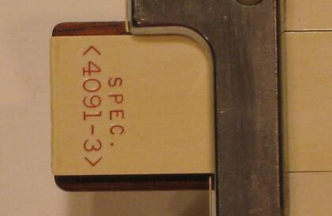

The ultra rare Model 4091-3 "Special," shown here courtesy of Clark McCoy.

## Sidebar: It's Classified!

When looking through descriptions of K&E specialty slide rules posted over at the excellent International Slide Rule Museum (ISRM), I stumbled across a letter to the editor of "Radio-Craft" written by Nelson Cooke in 1943.

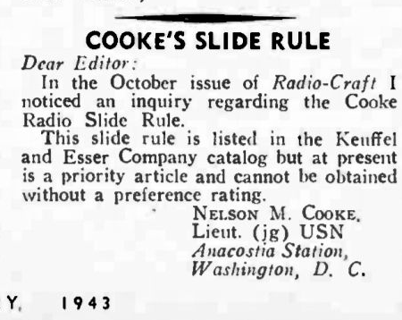

- courtesy of ISRM

Cooke would rise to become the Navy's top radio electrician, opening many of their electronics schools across the country and writing many of their curriculum manuals and text books. But for this context, we know that he designed the K&E rule which bears his name.

While the Cooke radio rule was the main contributor to the US Naval electronics programs, it seems apparent from Cooke's letter that the curriculum and slide rule used for the Navy's electronics instruction was indeed a "priority article," classified and restricted to only "preferred" military personnel.

This would indicate most of the intent surrounding the K&E slide rules developed in part by the US Navy, that being their intended use in these non-civilian programs. As such, we see why so many of them were never listed in a product catalog or, in the case of the Cooke rule, could have been in production long before being published to a catalog.

The point at which the Radio rule was declassified and made available for public distribution is unknown, but it would seem that the 1943 entry in the K&E catalog was premature, prior to the US Navy's consent to do so. Most certainly if it was never intended for public sale, then K&E would have refrained from posting the slide rule in every product catalog through 1967. So most certainly, the Cooke rule became an available product.

Thus, Lt. Cooke's letter to the magazine would appear to indicate that K&E jumped the gun in their publishing of the Cooke Radio rule within the 1943 product catalog. So, it appears like Cooke himself was trying to put out a few fires!

Nevertheless, an RMS inscription has been found on both the Cooke rule and the 4091-3 Spec. This would indicate their use within the "Radio Materiels School" of the US Navy.

It is unknown whether or not the 4082-3 Radio Special rule was connected in any way to the US Naval programs in a manner similar to the 4091-3 Spec and Cooke Radio rules, but it would appear highly likely indeed to be a slide rule designed and commissioned for the US Navy. To me, this seems very likely based on its development date, provenance and similar design to these other rules, not to mention that it too was not known about publicly.

As an endnote, the use of commissioned slide rules within electronics schools would be a common theme during the slide rule era, as we would later see with the Cleveland Institute of Electronics (CIE) as they commissioned their own slide rules from both Pickett and Aristo. In the case of a public program such as the CIE, the numbers of students who historically attended the program are numerous, making slide rules connected to that program quite plentiful for today's collector. Yet for many of the K&E radio rules, it would be easy to see why they are not quite so ubiquitous.

As such, both the rarity and the mystery surrounding many of the K&E radio rules is not a surprise.

### Model 4138 Morrison Radio Engineering

One year after the 4091-3 Special, K&E came to market with a radio rule that customers could apparently buy. The Model 4138 Morrison Radio Engineering rule only appears in the 1939 "slide rule only" catalog for a cost of $20 (add a dollar for leather case) and likely disappeared as quickly as it appeared. Very few of these exist in the wild today, so it is apparent that not many of them sold. They come up at auction on rare occasion, with a handful popping up on eBay over the last 20+ years. Expect to pay in excess of $500 or $1000 for one!

Designed by J.F. Morrison of Bell Labs and produced by K&E in 1938, the rule accomplishes what the Model 4091-3 Spec does, yet adds specialized scales to compute the propagation of radio frequencies (RF). Because of this, the Model 4138 is one of the more unique of K&E's rules in terms of its look and scale set...

Front side: L, F, A [B, CI, C] D, T, ST, S
Back side: 9, 8 [7, 6, 5, 4] 3, 2, 1

Most of the general-purpose scales are placed on the front of the rule, while nine numbered scales are located from bottom to top on the back. The F scale in this implementation is a single inverted "D" scale folded at 1/(2*pi). It is self-documented on the right side of the scale with "FREQ." label. This allows for the fast computation of inductance or capacitance of a circuit for a given frequency when read off of the A scale (result would be given in ohms). This is the typical A scale, but it is self-documented on the right side with the "LC" label, which indicates that the rule is setup to work problems that use the resonant frequency formula, or LC = 1/(2*pi*f)^2. Note that the A scale, being 2 decades, accounts for the squared quotient of that formula.

When used with the single-decade D scale, problems that work with the Inductive Reactance (equal to 2*pi*f*L) and Capacitive Reactance (equal to 1/(2*pi*f*C)) formulae can be solved. For example, to know the capacitor required (units in farads) for a given inductor (units in henries) at a given frequency (units in cycles), the user would set the frequency on the F scale, the inductance on the C scale, and then read the result from the D scale.

Decimal placement is more critical than in most slide rule usage cases, since many of the units are typically used with prefixes. As such, the capacitance could very well be in micro-farads, the inductance in micro-henries, operating on any number of kilo-cycles, yielding a reactance in kilo- or -mega-cycles (or hertz). Of course, for an electrical engineer, they would be accustomed to the domains in which they are working and would do quite well to get the correct unit magnitude. But even if they are not, the rule has decimal keeper scales, like the Pickett N16 Electronic, to keep things sorted out.

The F scale implementation here - and its usage relative to the A and D scales - appears again with the Model 4082-3 Radio Special rule that we will talk about next.

Morrison's design continues to the back side whereas, according to manual, the numbered scales allow for the computing factors involving radio wave propagation.

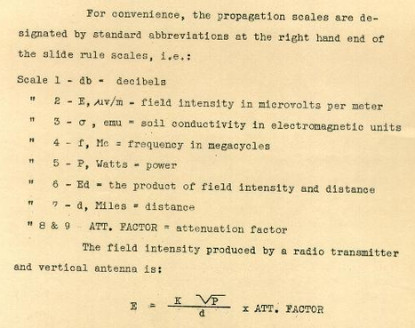

These scales on the back side are self-documenting, with labels to what each scale involves, shown on the right of each numbered scale.

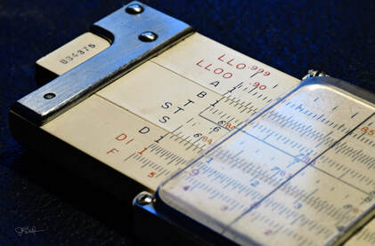

The Model 4082-3 "Radio Special" within my collection. Note the unique "F" scale, which replaces the "K" scale of the Model 4081 from which the 4082 is derived. This is a rare rule, with very few changing hands on eBay.

### Model 4082-3 Radio Special

While the Morrison rule might find utility for general public use, it would have been overkill for most in the electronics field, which likely explains the rarity of that slide rule and its only appearance in the 1939 product catalog. More practical would be a rule that offered the feature set of that rule's front side only, or something more like the 4091-3 Spec that was custom-made for the US Navy and not offered for public sale. What was needed, specifically, was a general purpose slide rule that adds the "F" scale found on the Morrison rule.

One might be inclined to wonder why K&E did not just offer a version of the 4091-3 Spec rule that uses this "F" scale, replacing, or in addition to, the LC scale on that rule? First, recall that the US Naval Academy was writing the documentation for the upcoming 4080/4081 redesign of the 4090/4091 slide rules, yet their own rule, pre-dating the 4081 Deci-Trig model, could not take advantage of that actual redesign.

And, second, you should also remember my disdain when discussing the Model 4090 and 4091 earlier, as I felt using it is quite cumbersome. Therefore, it made sense to build a new "special" rule not on the 4091 design, but rather on the improved 4081 model that would come out in 1937. And thus, we have the Model 4082-3 Radio Special, a slide rule based on the excellent design of the Model 4081 Log Log Duplex Deci-Trig (because electronic engineering requires decimal trig) with the important addition of the "F" scale as discussed in the Morrison rule.

Front Scale: L, LL1, DF [ CF, CIF, CI, C ] D, LL3, LL2
Back Scale: LL00, LL0, A [ B, T Cot, ST, S Cos ] D, DI, F

A typewritten manual was supplied with the original rule. Instructions for computing capacitive and inductive reactance of a circuit at any frequency are presented just as with the instructions given for the Morrison Radio rule. However, the Radio Special's manual also gives instructions for other electronically-related applications using the general-purpose scales. For example, it shows how when 10 on the LL3 scale is aligned to the index on the C scale, then by setting the cursor on any "power ratio" on the log-log scales will read the decibel conversion across the hairline on the D scale.

Curiously, this slide rule would not appear in any K&E catalog, so it is unknown if this rule was offered for public sale. We will discuss this more when we investigate the next slide rule, the Model 4139 Cooke Radio Rule, but in the meantime I am inclined to believe that this rule, like the 4091-3 Spec, was also designed and intended for US Naval Academy use only. Such would explain why it was not listed in a catalog at anytime between 1937 and 1943 when it is suspected that this rule was being produced. It would also address the rarity of a slide rule that I feel should have done better in overall sales has it been publicly offered. Moreover, other than the Morrison rule, all of the radio rules covered here seem impacted by K&E's association with US Naval Academy math professors, and the Model 4082-3 really fits into the design evolution of these rules thematically.

Regardless, it should be noted that K&E made two versions of this slide rule. The first rule in 1937 had the words "Radio Special" presented on the rule itself, or so it has been said by K&E collector Clark McCoy, who offered the scan of the manual referenced above. I have seen no images of this earlier rule and they are not offered by McCoy.

This rule would be updated in 1939, also according to McCoy, but removes the "Radio Special" moniker from the rule itself. This second version also makes one alteration of the scales by switching LL00 and LL0 on the back side of the rule. This rule, as shown in my own collection, might have been offered at least through 1943, though my own sample has a serial number that corresponds to 1941.

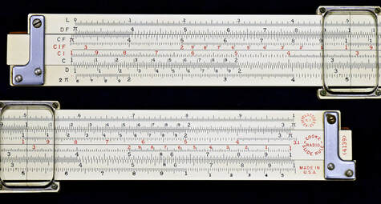

The Model 4139 Cooke Radio Rule - showing the front side of my more recent sample of two, this slide rule has a 1954 serial number. Significant in that it exhibits the &lt;4139&gt; model number and the rounded Cooke Radio emblem, which the earliest Cooke rules did not have, as well as the exposed mahogany edges.

### Model 4139 Cooke Radio Rule

So if we take the two "special" electronics rules described above and merged them into one, then we might produce a slide rule desired by more people. Such is the Model 4139 Cooke Radio Rule, which takes the "LC" scale from the 4091-3 Spec and the "F" scale from the 4082-3 Radio Special and places them on a rule with a NON-log-log duplex scale set. This recipe culminates in K&E's longest enduring and highest selling slide rule designed for electronics.

This rule first appeared in the 1943 catalog (and 1942 price list) at the cost of $12.75 (plus a dollar for the S-case version). It would last appear in the 1967 catalog as the Model 68-1460. Designed also by a U.S. Navy man and academy instructor, Chief Radio Electrician Nelson Cooke, the Model 4139 certainly has a similar pedigree to the earlier efforts by the Naval Academy, with notable differences.

The non-log-log duplex scale set we speak of is the Model 4071-3, which itself appeared first in 1939. It seems odd that K&E did not base this rule off of the log-log duplex rules as it did its predecessors, but they certainly felt that the smaller form factor - 40mm instead of 33mm wide - and the lack of any log-log scales was acceptable for offering to the public. Are log-log scales unnecessary for electricians? Certainly they are a bonus in making a "do-everything" kind of slide rule. But is this really K&E's goal with this rule? Instead, it's the former point - that the smaller form factor was suitable for this rule - that makes sense when you compare the front of the Cooke rule with the Model 4071-3, which despite its smaller rule height has some tradeable assets.

Because the maker's mark, patent information, and "Made in USA" label occupy a large part of the top stator, their removal provides sufficient room to add another scale, which the Cooke does by moving the "L" scale (base 10 log) up to where the labels were and then adding a folded 2*pi scale to the bottom of the rule. The removed text would be relocated to the right side of the rule's front. The same considerations could not be made with the 4081 rule that is already packed with scales and no extra room to add a specialty scale. And furthermore, there is no candidate scale, like the K scale, that could be replaced on the 4081. The 4071 format rule was able to make a sacrifice for the Cooke rule, subtracting the K scale on the rule's back and adding the LC scale from the 4091-3 Spec rule.

With this configuration, the scale set is as follows:

Front Side: L, DF [CF, CIF, CI, C] D, 2*pi
Back Side: LC, A [B, T, ST, S] D, DI

If you noted that the non-inverted, folded 2*pi scale is not the inverted and folded 2*pi "F" scale that I described earlier, then hopefully you also noticed the DI on the bottom stator of the back of the rule? If the "F" scale on the "Radio Special" was read from the D scale, then here on the Cooke the 2*pi scale would work with the DI scale. So in practice, the user simply has to flip the rule over to read between 2*pi and DI. This allows similar use to compute the reactance formulas discussed earlier.

Despite appearing first in the 1942 price list, the rule was designed and entered production much sooner than that, likely as early as 1938, as I have an original variant Cooke Radio sample with a 1938 serial number (686538). Now this prompts conflict in my mind for a few reasons. First, as we said, the Model 4071-3 Deci-Trig on which it's based did not debut until 1939, so it would seem strange that the Cooke rule could make it into production a year earlier. This could be explained by the notion that the way we date K&E rules by their serial numbers has some degree of imprecision, certainly within +/- 1 calendar year of error; and, in fact, McCoy tends to place the serial number of my rule to early 1939. Second, with this first principle in mind, just because the 1939 catalog marked the first appearance of the base 4071-3 model, we shouldn't be inclined to believe the rule didn't begin production until 1939. There are 4070-3 and 4071-3 models with serial numbers closely approximate with the Cooke rules.

And my third item of conflict; even with a 1939 production debut, the Cooke rule somehow managed to miss the 1939, 1941 and 1942 product catalogs. I have no explanation for this, other than that, perhaps, earlier years of the production rule weren't yet offered to the public. But solace can be found in the fact that the Morrison Model 4138 was the only "radio" rule to be listed in a catalog prior to 1943, meaning that the Cooke wouldn't have been the only radio rule to not be in a catalog while it was in production.

The Cooke rule was most certainly the latest of all radio rules based on it being a fusion of the other two radio "special" rules. But having its inception as early as 1938 makes complete sense given K&E's association with the US Navy during most all of the late 1930s. I could see K&E sitting down with US Naval Academy instructors as early as 1935 discussing ideas for as many as five future slide rules. Five? Interestingly, the three radio rules - all except the Morrison - are not the only slide rules impacted by math professors at the US Naval Academy. They too are responsible for the best selling Model 4080/4081 Log Log Duplex and the Model 4110 Power Trig slide rule (see Chapter 6) produced around 1941, also a short-lived rule that never saw a K&E catalog.

As for the Cooke, the slide rule seems successful, as it's not scarce, especially after so many years of production. Its evolution can be easily traced over the nearly three decades of production, appearing in as many as six variants over its life-span (Journal of the Oughtred Society, Vol. 24, No. 2, 2015, p. 36). Four of these variants have covered celluloid edges and two have the inlayed celluloid, exposed mahogany edges beginning around 1952.

The first four variants were created by alterations and movement of the texts and emblems on the rule. For example, the <4139> model indication would not appear on the first variation of the rule, which included all samples up to ~852,000 in serial number, dating to somewhere in 1941. Likewise, the circular "Cooke Radio" badge is on the back of the side with the earliest model, unlike most of the later variants. I will spare the reader the tedium of each variant, but a few other notes are worth stating:

- The ST scale would be replaced with an SRT scale around 1956, just as with all other Deci-Trig slide rule models.
- The circular K&E logo, which was dropped from other slide rules around 1945, persisted from beginning to end with the Cooke Radio Rule.
- Horizontal lines separate both scales on each rail up until 1951 when the rule converted to inlayed edges.
- The familiar red, capitalized K&E logo, which appeared on the majority of rules after 1945, only appeared on the Cooke rule for one variation around 1945.

As I indicated, Cooke Radio rules are not rare, but they aren't as common as any of the K&E general-mathematics slide rules. They can be found on eBay at a frequency (pun-intended) of 1 or 2 entries per month, but as of this writing there are none. Average price for the collector will be around $50 in good condition with a case, and double that amount if box and documentation is included.

For more of the type of problems that can be done with the Model 4139 rule, enjoy a visit to Miguel Ramirez's My Rules page, where Miguel offers an illustrated tutorial for use of the Cooke Radio rule. Additionally, interested students may also reference the manual written by Cooke that accompanied each slide rule, "Cooke Radio Slide Rule - A Supplementary Manual" by Nelson M. Cooke. The manual notes the accuracy of the rule is more than sufficient for any calculation required, as most discrete components used in electrical circuits, such as resistors, have a tolerance of +/- 10%. It also provides 62 pages worth of problems for using the Model 4139.

### National Union Radio Rule

Note: This slide rule might be better talked about later in Chapter 7 where we discuss the "Brick-o-Meter," as many parallels can be drawn from it. This rule is not listed in a K&E catalog and in fact doesn't have the symbol K&E or the words Keuffel and Esser anywhere on the rule. But its application makes fit better here.

Often referred to as the National Union Radio Reactance Computer, I have shortened it to the name found on the 4 page instruction pamphlet that came with this slide rule. We will talk about dating this rule shortly, but we should note here that the instructions state that the rule was "designed and Copyright 1937 by National Union Radio Corporation." This business, based in Newark, New Jersey, and formed in 1929, constructed radio (vacuum) tubes prior to researching and developing some transistors in the 50s prior to closing down in 1954. Keeping these dates in mind, let's look at the slide rule itself.

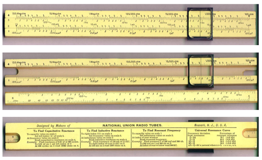

The National Union Radio Reactance Computer, image courtesy of Richard Smith Hughes, "Specialized Slide Rules for Electronic Engineers," The Oughtred Society.

The scale set is simple:

Front side: 4 [3, 2] 1
Back of slide: [extended 2 and 3 scales from front]

The purpose of the rule from these scales is clear...only provide scales that allow for the computation of inductive reactance, capacitive reactance, and resonant frequency without any other math operation.

For inductive reactance, the input frequency on the 3 scale (in cycles) is aligned to the index of the 4 scale. The hairline is moved to the value of the inductor on the 2 scale (in henries) and the total inductance is read under the hairline on the 4 scale (in ohms). For capacitive reactance, the value of the capacitor on the 1 scale (in farads) is aligned with the index of the 2 scale. The hairline is moved to the frequency value on the 3 scale (in cycles) and capacitance is read off the 4 scale (in ohms). For resonant frequency, the value of the capacitor on the 1 scale is aligned directly over the value of the inductor on the 2 scale, whereas the frequency can read off of the back window of the slide rule. Of course, all of these instructions are shown on the back of the rule. As indicated with the other radio rules, the engineer would have a good understanding of the decimal placement for these computations, as the domains for such a wide-variety of inductor and capacitor sizes makes for wild swings in results.

Back to the dating of this rule. Most people who have referenced this slide rule pinpoint the date somewhere in the 1950s. I believe this to be in error. For a business that closed down in 1954 and spent most of the 50s working with transistors, a date in this range would be too late. Likewise, if the National Union Radio rule was indeed modeled after the 1958W, then this rule would have been the N4058W by that time with an all-plastic cursor. The metal rimmed cursor of the National Union Radio rule is more of a match to the late 1930s versions. This would also align well with the 1937 date in the instruction pamphlet and the production date for the aforementioned Brick-O-Meter, which is identical except for the printed parts of the rule. This would also date the rule with all of the other radio rules discussed in this section. A local electronics company coming to its neighbor, K&E, and asking for a solution because they couldn't afford to give their employees a Cooke Radio rule? That sounds logical to me.

As such, I could see this simple rule as a cheap alternative for K&E to provide to National Union Radio Corporation for in-house use to provide the functions of the radio rule - and only those functions - in the least amount of money possible. Because there is no suggestion that the rule was sold publicly, not being published to a product catalog, and due to the rarity of the slide rule, it's my opinion that the rule is custom-made and commissioned for National Union only.

This slide rule comes up rarely on eBay, not even yearly. Cost will be variable. It will be sold cheap if the seller sets a Buy-it-Now price - which a seller is likely to do - simply because the slide rule doesn't look like it should have value. It is, after all, constructed like the cheap student rule of the 4058W series. But if this rule was auctioned, it would potentially go for several hundreds of US dollars.

## The Sector Family

From 1881 to 1915, K&E catalogs illustrated sector rules for sale, in both 6" and 12" varieties, and in both ivory and boxwood construction. But in the interest of full disclosure, there are three statements to be made.

- Sector rules are not slide rules, nor do they operate on any of the mathematical principles contained in this very length document.
- There are no known sector rules, neither in ivory or boxwood, with the words K&E on them...anywhere...ever.
- There is zero information on the internet about K&E sector rules...anywhere...or from anybody.

So, why talk about them?

That is 34 years in which K&E offered sector rules in their product catalogs. Operating on the theory that K&E sold some slide rules during that time, the question becomes why no historical samples have been identified?

Conrad Schur, in an article about the Scofield-Thatcher slide rule, put it this way:

> "The Scofield-Thatcher slide rule falls into a category of intrigue, which several collectors have been pondering for some time. This category also includes such other interesting examples as the Charpentier, and surveyor's and stadia slide rules, to name just a few. All of these were offered for sale for many years; they were inexpensive; and there was a large potential market (at least for the engineer's and surveyor's slide rules). The question then, is what has become of all these slide rules, or were they in fact shunned by their intended users, in favor of the more general-purpose models available? In the latter event, why did companies like Dietzgen, K&E, etc. persist in offering these models over and over for so many years? If any readers have any special insight (or even plausible theories) to explain this puzzlement the authors (and other collectors) would be pleased to hear about them."
>
> — Conrad Schur, Journal of the Oughtred Society, Vol. 3, No. 1, March 1994, p. 24.

I think such questions are more easily answered in the case of "K&E" Sector rules, with the simple answer that a) K&E likely didn't label identify these outsourced rules with their own identifying marks and b) sector rules would have fallen out of favor for much of those 34 years, if not all of them.

But even so, we will discuss them because they are intrigue me. And because they were always listed with the rest of the slide rule in K&E product catalogs. K&E's catalogs list two specific entries under this heading, discussed individually below: the 4175 Ivory Sector and the 4176 Boxwood Sector.

### 4175 Ivory Sector

🤖 AI-drafted &middot; unverified

<dl class="ke-ai-stub-facts">
<dt>What it is</dt>
<dd>The ivory-built member of K&E's Sector Family, cataloged from 1881 to 1915 in both 6" and 12" varieties.</dd>
<dt>What it did</dt>
<dd>A "sector" is an older instrument than the slide rule — two hinged rulers etched with proportional scales, used for scaling, proportion, and trigonometric problems by opening the legs to a measured angle, predating the logarithmic slide rule.</dd>
<dt>Approx. introduced</dt>
<dd>Somewhere within K&E's confirmed 1881&ndash;1915 catalog window for the Sector Family generally; no year specific to this model has been confirmed.</dd>
</dl>

This summary was generated by an AI assistant, combining general knowledge of sector instruments with the dates/materials Jay has confirmed for the family as a whole above — not from a verified first-hand source or sample of this specific model. As noted above, no K&E-marked sample of either sector model is known to exist. Treat every detail above as a starting point for research, not settled fact.

catalog image not yet sourced

Verify further: <a href="https://www.oughtred.org/">The Oughtred Society</a> &middot; <a href="https://www.sliderulemuseum.com/">International Slide Rule Museum (ISRM)</a>

### 4176 Boxwood Sector

🤖 AI-drafted &middot; unverified

<dl class="ke-ai-stub-facts">
<dt>What it is</dt>
<dd>The boxwood-built member of K&E's Sector Family, cataloged from 1881 to 1915 in both 6" and 12" varieties.</dd>
<dt>What it did</dt>
<dd>Functionally identical to the Ivory Sector above — a hinged, two-legged proportional instrument — but in less expensive boxwood construction, likely priced as the budget option of the pair.</dd>
<dt>Approx. introduced</dt>
<dd>Somewhere within K&E's confirmed 1881&ndash;1915 catalog window for the Sector Family generally; no year specific to this model has been confirmed.</dd>
</dl>

This summary was generated by an AI assistant, combining general knowledge of sector instruments with the dates/materials Jay has confirmed for the family as a whole above — not from a verified first-hand source or sample of this specific model. Treat every detail above as a starting point for research, not settled fact.

catalog image not yet sourced

Verify further: <a href="https://www.oughtred.org/">The Oughtred Society</a> &middot; <a href="https://www.sliderulemuseum.com/">International Slide Rule Museum (ISRM)</a>

## Demonstration Rules

Most slide rules makers produced larger versions of their popular slide rules for demonstration use. These rules are typically measured in feet, not inches, and are usually large enough for a room full of people to see. Such rules were often supplied to schools with the purchase of classroom sets of the regular sized rules or they could have been purchased separately. They also have a dual-purpose as marketing displays.

Such demonstration rules were surprisingly inexpensive, or least much less that you might otherwise imagine. An example is the 1958 price of the Polyphase N4053-3 at $13.50 and the 100 Mannheim Demonstration rule at $22. This is mostly because production techniques for the demonstration rules were not as involved as the real item. For example, the Deci-Lon Demonstration Rule in my collection is made of redwood, milled down to two rails and a slide in a 6.5 foot length. The rails are grooved and the slide is rabbeted, allowing them to slide within each other, with easy to fabricate metal brackets - or in this case wood made to look like metal - placed on the ends. They are painted white and marked with painted-on scales and other labeling to simulate the real rule. The cursors are typically two sheets of plexiglass, held together with wooden cursor rails and marked with a center-line. Gravity serves as the cursor spring.

As such, K&E demonstration rules were not intended to be exact-scale models, but merely functional duplicates of the real thing. No engine-divided celluloid facings or expensive wooden stock. They would not have taken much more time or material expense to build over the actual item.

K&E demonstration rules appeared for the first time in the 1933 Educational Catalog with the 100 and 101 models, the origin before that is not known, but there is thought that they'd been around for a while prior, but not listed in the full line product catalogs. The Model N105 would follow, appearing first in the 1952 educational product catalog, but soon making its appearance in the full line 1954 catalog along with the Model 100. The Model 101 was dropped at some point between the 1936 and 1954 educational catalogs.

Another form of demonstration rule were those made for overhead projection. Thus, slide rules models could be made completely from a transparent or translucent material, marked with opaque scales, and placed on a 10 x 10 inch "overhead projector" - probably from Dukane, 3M, or Bell and Howell - as commonly found in most classrooms of the era. These would appear as the Models 68-1960 and 68-1955 in 1962, supporting the Deci-Trig (4080/81) and Deci-Log (68-1100) respectively.

For the collector, these rules are obviously display pieces. They are rare to find in the wild unless posted for local/regional sale on Craigslist or other online market-place sites. They also pop up with some frequency on eBay, but buyers will always pay upwards of $100 extra for shipping, which reduces the number of actual sales of the large rules unless people finally change the price to something that makes more sense to buyer. Typical pricing of such rules can be between $50 to $2000 (or more), plus any relevant shipping charges, depending on the condition of the rule and demand.

### Model 100 Mannheim Demonstration Rule

Created to demonstrate the Mannheim, Polyphase Mannheim, and Beginner's series single-sided rules, the Model 100 Demonstration Rule was likely K&E's first such rule. Its placement in the first educational catalog of 1933 tells us its purpose. The Model 4041, 4053 and 4058 rules were those supported, which were the K&E rules for the most basic of general math use, likely finding themselves in many classrooms. The catalog description tells us, "It's appearance will add to that of any classroom in which it may be placed."

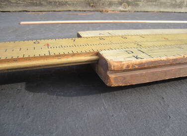

The earlier Model 101 made of thick, light-colored softwood. Later Model 100 types would be of much thinner redwood. - photo courtesy of eBay

The rule was approximately 7 ft. long and could be supported at each end with an eye screw. It had an indicator that suspended via gravity, so no spring was used. It was likely made of clear celluloid, though the catalog did not specify. Earlier pictures make the window look tinted, which is typical of celluloid as it ages...or in some cases, could be made tinted or might not have been made to be entirely transparent. Plexiglass was invented in 1933, the same year in which the rule first appeared in a catalog, but it's unlikely that plexiglass would be used with this product, at least not at first, unlike it would be used for later demonstration models. The wood was lightweight, but it is a type unknown to this writer as I've never seen this rule in the wild, although plenty do exist. Since later demonstrator models would be made primarily of redwood, it could be expected that it would have also been used with these earlier rules. Yet, many of these Model 100 samples use a light-weight, light colored wood such as spruce or fir. Samples of these rules do appear occasionally via sources like eBay, Craigslist, and Facebook marketplace.

To my best counting, eleven of these rules have been sold on eBay over the last 24 years with an average bid price of $151. This would not have included the cost of any shipping, which could double the price of some of those rules sold. As I write this in July 2024, one is available on eBay with an asking price of $525, incomplete as it's missing the indicator.

### Model 101 Polyphase Duplex Demonstration Rule

When the Model 4088 Polyphase Duplex was introduced in 1913, it represented a slightly different scale set than the typical Mannheim rules. So a demonstrator was needed to train groups using the new Polyphase scale set, particular in its duplex form. Thus, the Model 101 Polyphase Duplex demonstrator rule was born.

### Model N105 Log Log Duplex Deci-Trig Demonstration Rule

🤖 AI-drafted &middot; unverified

<dl class="ke-ai-stub-facts">
<dt>What it is</dt>
<dd>An 8-foot demonstration rule modeling the Log Log Duplex Deci-Trig scale set of the Model 4081-3, following the same construction approach as its Model 100 and 101 siblings.</dd>
<dt>What it did</dt>
<dd>Classroom-scale duplex demonstrator, mounted for both front and back viewing, used to teach the 4081-3's log-log/trig scale set to a full room at once.</dd>
<dt>Approx. introduced</dt>
<dd>Confirmed as of the 1952 educational catalog, crossing into the general 1954 product catalog alongside the Model 100.</dd>
</dl>

The dates above are confirmed elsewhere in this chapter's source material, but the physical description was generated by an AI assistant by inference from the model's 1962 renumbering to the 68-1923 (see next entry), whose own catalog listing confirms the redwood body and full scale set — not from a verified first-hand sample of the N105 itself under its original name. Treat the construction details as a reasonable starting point for research, not settled fact.

catalog image not yet sourced

Verify further: <a href="https://www.oughtred.org/">The Oughtred Society</a> &middot; <a href="https://www.sliderulemuseum.com/">International Slide Rule Museum (ISRM)</a>

### Model 68-1944 Mannheim Demonstrator

In 1962, the Model 100 was renumbered as the 68-1944, "for use with the Polyphase group and K-12." Per that year's catalog, it remained a 7-foot demonstrator (2 meters of scale length) in redwood, with A, B, CI, C, D, K scales on the front face and S, L, T on the reverse.

### Model 68-1923 Log Log Duplex Deci-Trig Demonstrator

Likewise, the Model N105 was renumbered as the 68-1923 in 1962, "for use with the Log Log Duplex Decitrig and Jet-Log group." The catalog lists it as an 8-foot demonstrator (2 meters of scale length) in redwood, with LL02, LL03, DF, CF, CIF, CI, C, D, LL3, LL2 on the front face and LL01, L, K, A, B, T, SRT, S, D, DI, LL1 on the reverse.

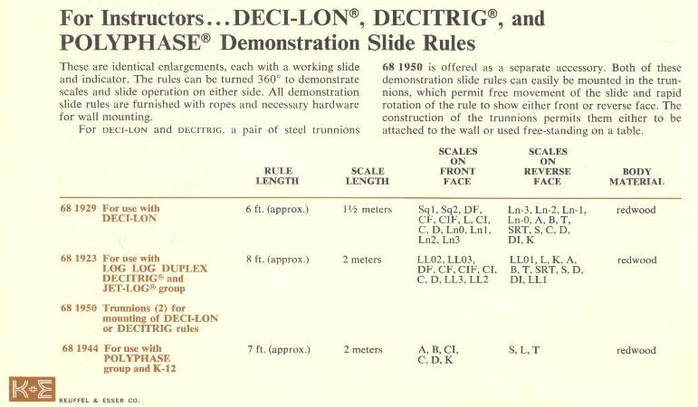

The 1962 catalog page listing the 68-1929 Deci-Lon, 68-1923 Log Log Duplex Decitrig, and 68-1944 Polyphase demonstration rules by rule length, scale length, front/back scale sets, and body material, alongside the 68-1950 mounting trunnions sold separately for the Deci-Lon and Decitrig models.

### Model 68-1929 Deci-Lon Classroom/Demonstrator

Found on Craigslist in Austin, Texas, I am proud to have this massive slide rule in my collection. Most demonstrator rules are indeed not built of the same material as those from which they are modeled, so this giant Deci-Lon is not made of Ivorite ABS plastic, awesome as that would be. Instead, this Model 68-1929 Deci-Lon Demonstrator is made of big chunk of redwood about 6.5 feet long, with faces painted in white, and then screen-painted with scales. The cursor is two plates of plexiglass attached to wooden cursor rails, with a black cursor line affixed on both sides. Gravity keeps the large cursor in place, so no spring is required. The scales are painted black, with all inverse scales colored in red, and with red maker's marks, Deci-Lon 10 logo, and model/copyright numbers also printed in red. All scales from the actual Deci-Lon 10 slide rule are present on the demonstrator.

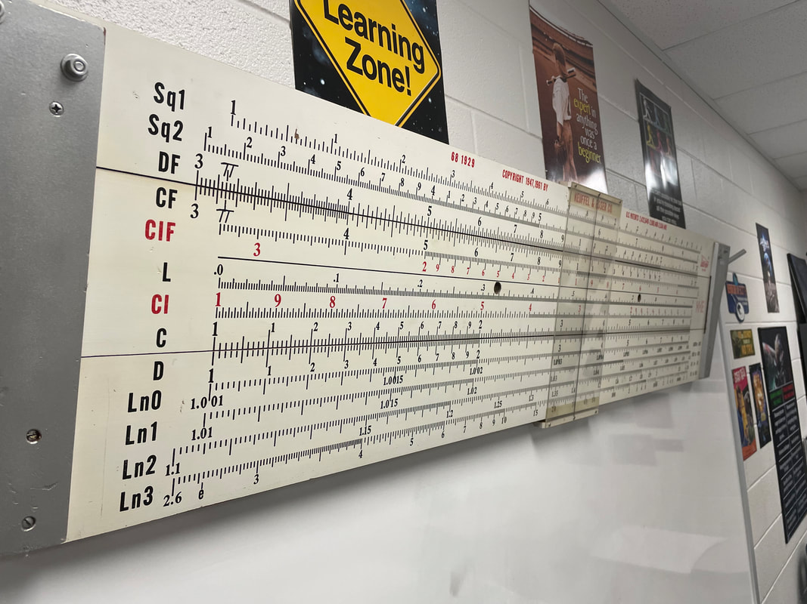

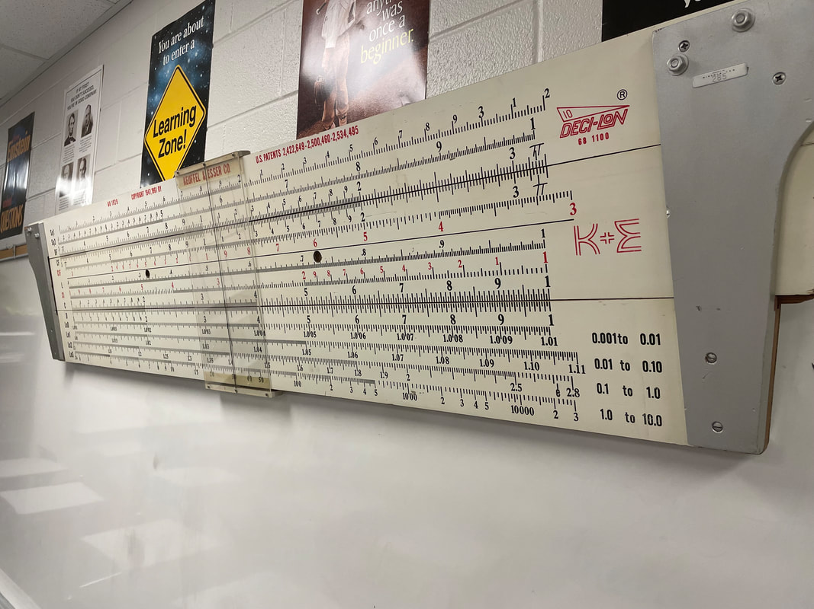

The author's Model 68-1929 Deci-Lon Demonstrator, a 6.5-foot redwood rule originally from Mineola ISD, hanging on both sides in his classroom today.

To hang this fully duplex slide rule on a wall, as I do in my classroom, it must be hung in a fixture that allows use of both sides. As such, K&E originally sold an optional trunnion (metal brackets) for mounting the slide rule to the wall, or free standing on a desk, allowing it to pivot to front and back positions. I mostly use mine as a display within my classroom, but I sometimes use it to demonstrate its use to my students. I also allow some of my students to use it, as I have extra credit for students who make a paper slide rule and are willing to demonstrate how a slide rule works. They enjoy using the enormous slide rule on my wall to demonstrate knowledge!

As a educator, perhaps one of the most satisfying aspects of having a demonstration rule comes from understanding its historical provenance. My sample came from Mineola ISD, as known by the metal ID asset inventory tag still attached to the rule. I find it exciting to know that a very small school district approximately 120 miles east of my residence in the Dallas/Fort Worth metroplex had K&E's most powerful demonstration rule hanging in a classroom. The implication is that their high school likely had an advanced math class, similar to my own, which not only used such a slide rule, but might have had a classroom set of Deci-Lon 10s for their students to use. Certainly this meant that some serious math computation was happening in Mineola, Texas, whereas a more simple demonstrator just wouldn't have sufficed!

Originally introduced in 1962 with the actual Deci-Lon family of slide rules, the 68-1929 demonstrator would have set you back $60, a very reasonable price considering its size. Remember, the actual Deci-Lon 10 slide rule was $25 itself. The 68-1929 would appear one last time in the 1967 catalog, disappearing after that.

Afterword: Note that the 1968 price of the demonstration rule remained $60, while the actual Deci-Lon 10 rule rose to $28.50. Nevertheless, the 4081-5 (68-1200) Log Log Deci-Trig was $70 with the lower price case in 1968. As such, it shows the level of workmanship that went into K&E's "highest quality" rule at that time.

### Model 68-1960 Log Log Duplex Deci-Trig Overhead Projection Rule

The Log Log Duplex Deci-Trig overhead-projector rule, supporting the 4080/81 scale set. Shown only in the 1967 catalog.

### Model 68-1955 Deci-Lon Overhead Projection Rule

The Deci-Lon overhead-projector rule, supporting the 68-1100 scale set, for classroom demonstration.

### Beseler Projection Slide Rule

🤖 AI-drafted &middot; unverified

<dl class="ke-ai-stub-facts">
<dt>What it is</dt>
<dd>Uncertain. The name doesn't confirm whether this is a K&E overhead-projector demonstrator sold or co-branded with Beseler, or a separate photographic slide rule from the Charles Beseler Company (a maker of photo enlargers/projectors, not classroom equipment).</dd>
<dt>What it did</dt>
<dd>If it follows the classroom-demonstrator pattern of the two overhead-projection rules above, likely a projector-mounted teaching aid. If instead a Beseler-branded product, more likely a darkroom calculator for photographic enlargement ratios or exposure times.</dd>
<dt>Approx. introduced</dt>
<dd>Unknown — no catalog appearance has been confirmed for this chapter.</dd>
</dl>

This is the thinnest entry in the chapter — the source material preserves only the name, with not even a confirmed connection to K&E. This summary was generated by an AI assistant from general pattern-matching only, not a verified first-hand source or sample. Treat every detail above as a starting point for research, not settled fact.

catalog image not yet sourced

Verify further: <a href="https://www.oughtred.org/">The Oughtred Society</a> &middot; <a href="https://www.sliderulemuseum.com/">International Slide Rule Museum (ISRM)</a>

[Back to All About Keuffel & Esser Rules](/sliderules/all-about-ke-rules/)
